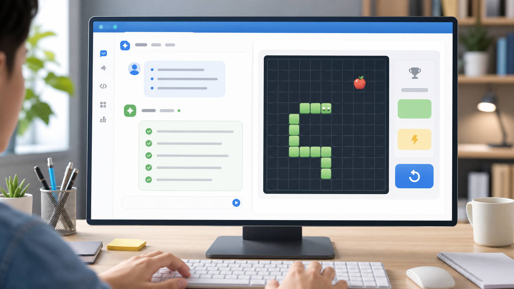
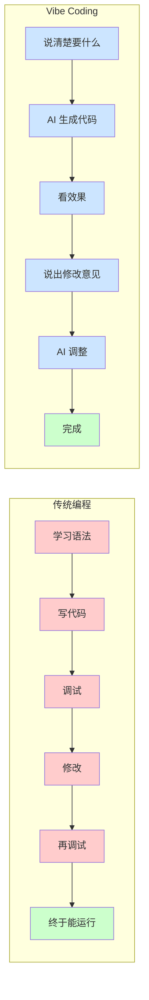
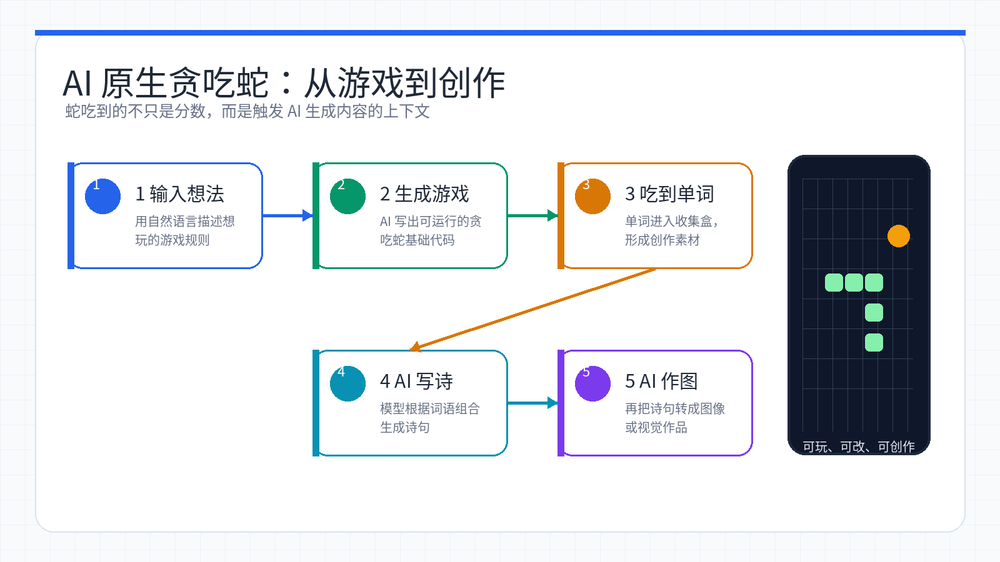

# Week 01：游戏热身 - 消除编程畏惧

> 小林是一名新闻传播专业的大三学生。她脑子里总有一堆产品点子：一个帮自己记账的小工具、一个记录读书笔记的网页、甚至一款简单的小游戏。但每次想到要写代码、要找程序员，就直接劝退了。直到有一天，她在朋友圈看到有人用 AI 做出了一个贪吃蛇游戏，只用了不到一小时。那一刻她意识到：也许编程这件事，不再是程序员的专属技能了。

<ChapterIntroduction duration="约 4 小时" output="1 个可运行的 AI 原生贪吃蛇游戏 + 对 AI 编程能力边界的清晰认知" prerequisite="无需任何编程基础" :tags="['对话式编程', 'AI 原生应用', '游戏开发', '需求表达']">

这一周，我们不讲语法、不配环境、不记命令。我们要做的是：用对话的方式让 AI 帮你写代码，直接在网页上就能跑起来。你会亲手做出第一个能运行的程序——一款会「吃单词、写诗、画画」的贪吃蛇。

通过这个实战，你会体验到 AI 编程到底是什么感觉：不是 AI 代替你思考，而是你把想法说出来，AI 帮你实现。你会学会如何清晰地表达需求、如何判断 AI 做得对不对、如何一步步迭代出自己想要的东西。

所有的创造都是从 0 到 1 开始的。这一周，我们就从最简单的游戏开始，带你跨过编程的第一道门槛。

</ChapterIntroduction>

<StepBar :active="0" :items="[
  { title: '① 认识 AI 编程', description: '普通人的新可能' },
  { title: '② 60 秒体验', description: '极速开发第一个游戏' },
  { title: '③ AI 原生实战', description: '打造会写诗的贪吃蛇' },
  { title: '④ 能力边界', description: '理解 AI 能做什么' }
]" />

---

## 普通人的编程困境与 AI 带来的新可能

小林的困境很典型：脑子里有想法，但不知道怎么实现。传统的编程学习路径是这样的：

1. 学习编程语言（Python、JavaScript 等）
2. 配置开发环境（安装各种软件）
3. 学习框架和工具（React、Vue 等）
4. 写代码、调试、修 Bug
5. 部署上线

这个过程对于非技术背景的人来说，门槛太高了。光是第一步「学习编程语言」就能劝退大部分人。

但 AI 的出现，第一次给了普通人一个全新的可能：**你不需要会写代码，只需要学会对 AI 说清楚你想要什么。**

<InfoCard icon="📊" variant="info">

**数据说话：AI 编程已经成为主流**

来自 GitHub Copilot 的数据显示：
- 超过 **1500 万开发者** 正在使用 AI 辅助编程
- 平均 **46% 的代码** 都是 AI 生成的
- 在 Java 项目中，这个比例能达到 **61%**
- 开发者完成任务的速度提升了 **55%**
- 原本需要 9.6 天的任务，现在只要 **2.4 天**

更重要的是采用率：在获得访问权限的当天，就有 **81%** 的开发者第一时间安装并使用；其中 **96%** 的人在当天就开始采纳 AI 提供的代码建议。

</InfoCard>

对于普通人来说，这个趋势更有意义：**如果专业程序员都在大量依赖 AI 写代码，那我们这些不会编程的人，为什么不能直接跟 AI 对话来实现自己的想法呢？**

这门课的目标就是帮你练成这个新技能：通过自然语言对话就能做应用。我们将教你怎么跟 AI 用「计算机的语言」沟通、怎么让 AI 帮你把脑子里的想法变成真实可用的产品。

<StepBar :active="1" :items="[
  { title: '① 认识 AI 编程', description: '普通人的新可能' },
  { title: '② 60 秒体验', description: '极速开发第一个游戏' },
  { title: '③ AI 原生实战', description: '打造会写诗的贪吃蛇' },
  { title: '④ 能力边界', description: '理解 AI 能做什么' }
]" />

---

## 60 秒做出第一个贪吃蛇游戏

在开始深入学习之前，让我们先来一次「震撼体验」。小林第一次尝试 AI 编程时，就是从这个 60 秒挑战开始的。

### 打开你的 AI 编程工具

首先，打开课程中使用的实验网页 [z.ai](https://chat.z.ai/)。

<InfoCard icon="💡" variant="tip">

**什么是 z.ai？**

z.ai 是由智谱 AI（中国领先的大语言模型公司之一）开发的 AI 平台，其核心能力由智谱自研的 GLM 系列大模型提供支持。该平台集成了多项 AI 功能，包括幻灯片生成、海报设计和全栈开发等。

在本教程中，我们将重点使用其「全栈开发」模块——这是一个可以直接在网页上生成可运行代码的工具，无需安装任何软件。

</InfoCard>

### 用一句话生成游戏

在 z.ai 的输入框中，输入这样一句话：

```
帮我做一个贪吃蛇游戏：
1. 用方向键控制蛇的移动
2. 吃到食物后蛇会变长，分数增加
3. 撞到墙壁或自己的身体就游戏结束
4. 要有开始和重新开始按钮
5. 界面要简洁好看
```

然后点击「全栈开发」按钮。

<InfoCard icon="✨" variant="success">

**小林的第一次体验**

小林第一次输入这段话时，心里其实是半信半疑的。她想：「这么简单的一句话，真的能做出游戏吗？」

结果不到一分钟，右侧就出现了一个可以玩的贪吃蛇游戏。她用方向键控制蛇移动，吃到食物后蛇真的变长了，分数也在增加。撞到墙壁后，游戏结束，出现了「重新开始」按钮。

那一刻，她意识到：编程这件事，真的变了。

</InfoCard>



*左侧描述需求，右侧马上看到可玩的游戏预览，这是本周要先建立的直觉。*

### 查看生成的效果

生成结束后，你能看到右侧出现可浏览的网页界面。你可以：

- 上下滚动浏览页面内容
- 点击页面顶部的 🧭 按钮切换至全屏模式查看效果
- 点击右上角的代码图标 `<>` 查看完整代码

<InfoCard icon="🎮" variant="info">

**界面按钮说明**

顶部从左到右按钮的作用依次为：
- **箭头按钮**：展开侧边对话历史栏
- **铅笔按钮**：新建一个对话
- **循环箭头按钮**：刷新页面
- **指南针按钮**：切换至全屏模式
- **Download 按钮**：下载项目
- **`<>` 按钮**：切换代码视图
- **Publish 按钮**：发布项目

</InfoCard>

### 这就是「对话式编程」

你刚才体验的，就是 AI 时代的新编程方式：**Vibe Coding（氛围式编码）**。



核心区别在于：**你不需要关心「怎么做」，只需要说清楚「要什么」。**

<InfoCard icon="🌐" variant="tip">

**探索更多 AI 编程工具**

除了 z.ai，还有很多优秀的 AI 编程平台可以尝试：

| 工具 | 特点 | 适合场景 |
|------|------|----------|
| **Google AI Studio** | 谷歌官方出品，支持 Gemini 模型 | 快速原型开发 |
| **v0.dev** | Vercel 出品，生成 React 组件 | UI 组件开发 |
| **Bolt.new** | StackBlitz 推出，全栈开发 | 完整 Web 应用 |
| **Replit Agent** | 集成 AI 的在线 IDE | 多语言开发 |

想了解更多工具的详细对比，可以参考课程附录中的「7 款主流 Vibe Coding 在线平台实测对比」。

</InfoCard>

<StepBar :active="2" :items="[
  { title: '① 认识 AI 编程', description: '普通人的新可能' },
  { title: '② 60 秒体验', description: '极速开发第一个游戏' },
  { title: '③ AI 原生实战', description: '打造会写诗的贪吃蛇' },
  { title: '④ 能力边界', description: '理解 AI 能做什么' }
]" />

---

## 动手实战：打造 AI 原生贪吃蛇

现在，让我们进入真正的实战环节。我们要做的不是一个普通的贪吃蛇，而是一个「AI 原生」的贪吃蛇——它会吃单词、写诗、画画。

### 什么是「AI 原生」应用？

小林一开始也不理解这个概念。后来她发现：

**传统应用**：功能是固定的，所有逻辑都是程序员提前写好的。
**AI 原生应用**：核心功能由 AI 动态生成，每次运行结果都可能不同。

举个例子：
- **传统贪吃蛇**：吃豆子，分数增加，游戏结束。
- **AI 原生贪吃蛇**：吃单词，AI 根据单词写诗，再根据诗画画。每次玩都是独一无二的体验。

这就是 AI 原生应用的魅力：**它不是在执行固定的逻辑，而是在创造新的内容。**



*AI 原生应用的关键不是多一个按钮，而是把游戏行为变成可以继续创作的上下文。*

### 第一步：基础版贪吃蛇

让我们从最简单的版本开始。在 z.ai 中输入：

```
帮我做一个贪吃蛇游戏
```

就这么简单一句话，AI 就会生成一个基础版的贪吃蛇游戏。

<AiChat :initial-messages="[
  { role: 'user', content: '帮我做一个贪吃蛇游戏' },
  { role: 'assistant', content: '好的，我来帮你创建一个贪吃蛇游戏。我会实现以下功能，使用方向键控制蛇的移动，蛇吃到食物后会变长，撞到墙壁或自己的身体会游戏结束，显示当前分数，提供开始和重新开始按钮。正在生成代码...' }
]" :show-input="false" />

### 第二步：让蛇吃单词

现在，让我们给游戏加点新花样。我们要让蛇吃的不是普通的豆子，而是单词。

```
帮我做一个贪吃蛇游戏，它应该支持：
1. 我可以吃不同的单词，它们会被收集在一个盒子里
```

<DiffViewer 
  title="从吃豆子到吃单词"
  diff="@@ -1,8 +1,15 @@
-// 原来的食物生成逻辑
+// 新的单词生成逻辑
+const words = ['梦想', '自由', '勇气', '希望', '星空', '旅行', '音乐', '阳光']
+
 function generateFood() {
   food = {
     x: Math.floor(Math.random() * gridSize),
     y: Math.floor(Math.random() * gridSize),
-    type: 'dot' // 普通豆子
+    type: 'word',
+    text: words[Math.floor(Math.random() * words.length)] // 随机单词
   }
+  
+  // 在画布上显示单词
+  ctx.fillText(food.text, food.x * cellSize, food.y * cellSize)
 }"
/>

<InfoCard icon="🎯" variant="success">

**小林的发现**

小林在这一步发现了一个有趣的现象：当她把需求说得更具体时，AI 生成的代码质量也更高。

比如，她一开始只说「让蛇吃单词」，AI 生成的单词列表很随机。后来她改成「让蛇吃关于梦想和旅行的单词」，AI 就生成了更有主题性的单词列表。

这让她明白：**跟 AI 对话，就像跟人对话一样，说得越清楚，结果越好。**

</InfoCard>

### 第三步：根据单词写诗

现在，让我们加入 AI 的核心能力：根据吃到的单词，自动创作一首诗。

```
帮我做一个贪吃蛇游戏，它应该支持：
1. 我可以吃不同的单词，它们会被收集在一个盒子里
2. 当蛇吃了 8 个单词时，AI 应该根据这些单词创作一首诗
3. 我可以根据需要重新生成这首诗
```

<AiChat :initial-messages="[
  { role: 'user', content: '当蛇吃了 8 个单词后，调用 AI 接口根据这些单词创作一首诗' },
  { role: 'assistant', content: '好的，我会添加以下功能：1. 在页面右侧添加一个「已收集单词」面板 2. 当收集到 8 个单词时，自动调用 AI 接口 3. 将单词列表发送给 AI，请求创作诗歌 4. 在页面上显示生成的诗歌 5. 提供「重新生成」按钮。正在实现...' }
]" :show-input="false" />

这一步是整个游戏的核心。AI 会根据你吃到的单词，创作出独一无二的诗歌。

<DiffViewer 
  title="添加 AI 诗歌生成功能"
 diff="@@ -1,5 +1,7 @@
-// 原来只是收集单词
+// 现在会触发 AI 创作诗歌
 let collectedWords = []
-function eatWord(word) {
+async function eatWord(word) {
   collectedWords.push(word)
   score += 10
   updateWordList()
+  
+  // 当收集到 8 个单词时，调用 AI 创作诗歌
+  if (collectedWords.length === 8) {
+    const poem = await generatePoem(collectedWords)
+    displayPoem(poem)
+  }
+}
+
+async function generatePoem(words) {
+  const response = await fetch('/api/generate-poem', {
+    method: 'POST',
+    headers: { 'Content-Type': 'application/json' },
+    body: JSON.stringify({ words })
+  })
+  const data = await response.json()
+  return data.poem
 }"
/>

### 第四步：根据诗歌画画

最后一步，让我们加入视觉元素：根据生成的诗歌，自动画一幅画。

```
帮我做一个贪吃蛇游戏，它应该支持：
1. 我可以吃不同的单词，它们会被收集在一个盒子里
2. 当蛇吃了 8 个单词时，AI 应该根据这些单词创作一首诗
3. 当诗完成后，下一步将自动根据这首诗创建一幅图像
```

<InfoCard icon="🎨" variant="info">

**AI 原生应用的三层结构**

通过这个贪吃蛇游戏，小林理解了 AI 原生应用的典型结构：

1. **交互层**：用户玩游戏，收集单词（传统编程）
2. **生成层**：AI 根据单词创作诗歌（AI 能力）
3. **视觉层**：AI 根据诗歌生成图像（AI 能力）

这三层的组合，创造出了传统编程难以实现的体验：**每次玩都是独一无二的创作过程。**

</InfoCard>

### 遇到问题怎么办？

在开发过程中，你可能会遇到各种问题：

- 点击按钮没有反应
- 功能报错
- 页面显示不符合预期

**不要慌！这是正常现象。** 小林第一次做的时候，也遇到了很多问题。

关键是：**学会跟 AI 描述问题。**

**好的问题描述方式：**

```
❌ 不好的描述：「代码有问题」
✅ 好的描述：「点击『生成诗歌』按钮后，控制台显示 404 错误，诗歌没有生成」

❌ 不好的描述：「页面不对」
✅ 好的描述：「单词列表应该显示在右侧，但现在显示在了底部，而且字体太小看不清」

❌ 不好的描述：「功能不工作」
✅ 好的描述：「蛇吃到第 8 个单词后，应该自动生成诗歌，但现在什么都没发生」
```

<AiChat :initial-messages="[
  { role: 'user', content: '点击『生成诗歌』按钮后，控制台显示 404 错误，诗歌没有生成' },
  { role: 'assistant', content: '我看到问题了。这是因为 API 路径配置错误。原因：代码中调用的是 /api/generate-poem，但实际的 API 端点是 /api/poem。我来修复这个问题...' }
]" :show-input="false" />

<InfoCard icon="💡" variant="tip">

**小林的调试心得**

小林总结了三个调试技巧：

1. **截图 + 描述**：把错误截图发给 AI，并用文字描述「我做了什么」「期望发生什么」「实际发生了什么」
2. **复制错误信息**：如果有报错，直接复制完整的错误信息给 AI
3. **一次只改一个地方**：不要一次提很多修改需求，改一个、测一个、确认没问题再改下一个

这三个技巧帮她节省了大量时间。

</InfoCard>

<StepBar :active="3" :items="[
  { title: '① 认识 AI 编程', description: '普通人的新可能' },
  { title: '② 60 秒体验', description: '极速开发第一个游戏' },
  { title: '③ AI 原生实战', description: '打造会写诗的贪吃蛇' },
  { title: '④ 能力边界', description: '理解 AI 能做什么' }
]" />

---

## 理解 AI 编程的能力边界

做完贪吃蛇之后，小林开始思考一个问题：**AI 到底能做什么，不能做什么？**

这个问题很重要，因为它决定了你能用 AI 做出什么样的东西。

### AI 擅长做什么？

通过这一周的实践，小林总结出 AI 特别擅长的几类任务：

<InfoCard icon="✅" variant="success">

**AI 的强项**

1. **小而完整的应用**
   - 单页面工具（计算器、记账本、待办清单）
   - 简单游戏（贪吃蛇、2048、井字棋）
   - 数据可视化（图表、看板）

2. **快速原型验证**
   - 产品经理验证需求
   - 设计师验证交互
   - 创业者验证想法

3. **重复性工作**
   - 生成相似结构的代码
   - 数据格式转换
   - 批量处理任务

</InfoCard>

### AI 不擅长做什么？

同时，小林也发现了 AI 的局限性：

<InfoCard icon="⚠️" variant="warning">

**AI 的局限**

1. **大型复杂系统**
   - 需要多个模块协同工作
   - 涉及复杂的业务逻辑
   - 需要长期维护和迭代

2. **高安全性要求**
   - 支付系统
   - 用户认证
   - 敏感数据处理

3. **性能优化**
   - 大规模并发处理
   - 复杂算法优化
   - 系统架构设计

</InfoCard>

### 一个实用的判断标准

小林总结了一个简单的判断标准：

**如果你能在 5 分钟内向一个外行人解释清楚这个应用是做什么的，那 AI 很可能能帮你做出来。**

**如果你需要画流程图、写文档、开会讨论才能说清楚，那可能需要专业开发团队。**

<DiffViewer 
  title="好需求 vs 坏需求"
  diff="@@ -1,9 +1,4 @@
-// ❌ 太复杂，AI 难以一次性做好
-需求：做一个电商平台
-- 用户注册登录
-- 商品浏览和搜索
-- 购物车和订单
-- 支付集成
-- 商家后台
-- 物流跟踪
-- 评价系统
-- 推荐算法
-...
+// ✅ 清晰简单，AI 可以做好
+需求：做一个商品展示页
+- 显示商品列表（从 JSON 读取）
+- 点击商品查看详情
+- 简单的筛选功能（按价格、分类）
+- 响应式布局，手机也能看"
/>

### 从「能写」到「能用」

小林还发现了一个重要的区别：**AI 能写出代码，不代表这些代码就能直接用于生产环境。**

<InfoCard icon="📊" variant="info">

**代码质量的三个层次**

1. **能跑**：代码可以运行，基本功能正常
   - AI 生成的代码通常能达到这个层次
   - 适合：原型、Demo、自用工具

2. **能用**：代码稳定、有错误处理、用户体验好
   - 需要人工测试和优化
   - 适合：小型项目、内部工具

3. **能上线**：代码安全、性能好、可维护
   - 需要专业开发团队
   - 适合：面向用户的产品

</InfoCard>

小林的建议是：**用 AI 快速做出原型，验证想法是否可行。如果可行，再考虑是否需要专业团队来打磨。**

### 实战案例：三个不同难度的项目

让我们通过三个实际案例，来理解 AI 的能力边界。

**案例 1：个人记账工具（✅ AI 可以独立完成）**

```
需求：
- 记录每天的收入和支出
- 按分类统计（餐饮、交通、娱乐等）
- 用图表展示月度趋势
- 数据存储在浏览器本地
```

**为什么 AI 能做好？**
- 功能清晰，边界明确
- 不涉及复杂的业务逻辑
- 不需要后端服务器
- 用户只有自己，不需要考虑多用户场景

**案例 2：团队协作看板（⚠️ AI 需要人工辅助）**

```
需求：
- 多人同时使用
- 创建任务卡片，分配给不同成员
- 实时同步所有人的操作
- 权限管理（管理员、普通成员）
- 数据持久化存储
```

**为什么需要人工辅助？**
- 涉及多用户并发，需要考虑数据冲突
- 需要后端服务器和数据库
- 权限管理涉及安全性
- 实时同步需要 WebSocket 等技术

**AI 能帮什么？**
- 生成前端界面和交互逻辑
- 生成基础的后端 API 结构
- 提供数据库设计建议

**人工需要做什么？**
- 搭建服务器环境
- 处理并发和数据一致性
- 实现安全的权限控制
- 性能优化和错误处理

**案例 3：在线支付系统（❌ AI 不应独立完成）**

```
需求：
- 用户充值和提现
- 订单支付
- 资金安全保障
- 交易记录和对账
- 符合金融监管要求
```

**为什么 AI 不应独立完成？**
- 涉及资金安全，容错率为零
- 需要符合法律法规
- 需要专业的安全审计
- 需要长期维护和监控

<InfoCard icon="🎯" variant="success">

**小林的实践总结**

经过一周的学习，小林总结出了自己的「AI 编程三原则」：

1. **从小做起**：先做一个最简单的版本，能跑就行
2. **快速验证**：用 AI 快速做出原型，看看想法是否可行
3. **知道边界**：清楚什么能做、什么不能做，不要强求 AI 做它做不好的事

她发现，这三个原则不仅适用于编程，也适用于产品设计和项目管理。

</InfoCard>

---

## 举一反三：尝试更多创意

完成贪吃蛇之后，小林开始尝试做其他东西。她发现，只要掌握了「清晰表达需求」这个核心技能，就能做出各种有趣的东西。

### 游戏类

```
1. 2048 游戏
   - 用方向键合并数字
   - 达到 2048 就胜利
   - 记录最高分

2. 井字棋（人机对战）
   - 玩家 vs AI
   - AI 有简单、中等、困难三个难度
   - 显示胜负统计

3. 打字练习游戏
   - 随机显示单词
   - 计算打字速度和准确率
   - 支持不同难度的词库
```

### 工具类

```
1. 番茄钟
   - 25 分钟工作，5 分钟休息
   - 记录完成的番茄数
   - 播放提示音

2. 随机决策器
   - 输入多个选项
   - 随机选择一个
   - 支持设置权重

3. 颜色选择器
   - 显示颜色色板
   - 复制颜色代码
   - 保存常用颜色
```

### AI 原生创意

```
1. 诗歌生成器
   - 输入几个关键词
   - AI 生成一首诗
   - 可以选择不同风格（古风、现代、俏皮）

2. 故事接龙
   - 你写一句，AI 写一句
   - 可以选择故事类型（科幻、奇幻、悬疑）
   - 保存完整故事

3. 配色方案生成器
   - 输入一个主题（如「夏日海滩」）
   - AI 生成配色方案
   - 显示色卡和 HEX 代码
```

<InfoCard icon="💡" variant="tip">

**如何想出好点子？**

小林分享了她的方法：

1. **从痛点出发**：想想自己日常有什么不方便的地方
2. **从兴趣出发**：想想自己喜欢什么，能不能做个相关的工具
3. **从学习出发**：想想能不能做个工具帮助自己学习

她举了个例子：她喜欢看电影，但总是记不住看过什么。于是她让 AI 帮她做了一个「观影记录」工具，可以记录电影名称、观看日期、评分和感想。虽然很简单，但对她来说很实用。

</InfoCard>

### 让 AI 帮你想点子

如果你暂时想不出做什么，可以直接问 AI：

```
我想用 AI 做一个小工具或小游戏，但不知道做什么。
我的兴趣是：[填写你的兴趣]
我的需求是：[填写你的需求]
请给我 5 个创意建议。
```

<AiChat :initial-messages="[
  { role: 'user', content: '我想用 AI 做一个小工具，我喜欢阅读和写作，请给我 5 个创意建议' },
  { role: 'assistant', content: '基于你对阅读和写作的兴趣，这里有 5 个创意：1. 读书笔记生成器：输入书名和几个关键词，AI 帮你生成读书笔记框架 2. 写作灵感卡片：每天随机显示一个写作提示，帮你克服写作障碍 3. 文章摘要工具：粘贴长文章，AI 自动生成摘要和关键点 4. 词汇扩展器：输入一个词，AI 给出同义词、反义词和例句 5. 故事大纲生成器：输入故事主题和角色，AI 帮你生成故事大纲。这些都是可以在 1-2 小时内用 AI 做出来的小工具！' }
]" :show-input="false" />

---

## 本周回顾与自测

恭喜你完成了 Week 01 的学习！让我们回顾一下你学到了什么。

<ProgressTracker title="Week 01 学习进度" :items="[
  { title: '理解 AI 编程的本质', description: '知道 AI 编程不是让 AI 代替思考，而是用自然语言表达需求', done: false },
  { title: '完成 60 秒挑战', description: '用一句话生成了第一个贪吃蛇游戏', done: false },
  { title: '打造 AI 原生应用', description: '做出了会吃单词、写诗、画画的贪吃蛇', done: false },
  { title: '学会调试和修改', description: '知道如何向 AI 描述问题并获得解决方案', done: false },
  { title: '理解能力边界', description: '清楚 AI 能做什么、不能做什么', done: false },
  { title: '举一反三', description: '尝试做出了自己的创意项目', done: false }
]" />

### 自测问题

完成以下问题，检验你的学习成果：

**1. 概念理解**

<InfoCard icon="❓" variant="info">

**问题**：什么是「Vibe Coding」？它和传统编程有什么区别？

**参考答案**：Vibe Coding 是一种通过自然语言对话来编程的方式。传统编程需要学习语法、写代码、调试；Vibe Coding 只需要说清楚需求，AI 帮你生成代码。核心区别是：传统编程关注「怎么做」，Vibe Coding 关注「要什么」。

</InfoCard>

**2. 实践能力**

<InfoCard icon="❓" variant="info">

**问题**：如果你想让 AI 帮你做一个「待办清单」应用，应该如何描述需求？

**参考答案**：
```
帮我做一个待办清单应用：
1. 可以添加、删除、编辑待办事项
2. 可以标记完成状态
3. 按创建时间排序
4. 数据保存在浏览器本地
5. 界面简洁，适合手机查看
```

关键是：功能清晰、边界明确、一次只提一个完整的需求。

</InfoCard>

**3. 问题诊断**

<InfoCard icon="❓" variant="info">

**问题**：如果生成的代码运行时报错，你应该如何向 AI 描述问题？

**参考答案**：
1. 说明你做了什么操作
2. 说明期望发生什么
3. 说明实际发生了什么
4. 如果有报错信息，复制完整的错误
5. 如果可以，截图发给 AI

例如：「我点击『添加』按钮后，期望在列表中显示新项目，但实际上页面没有任何反应。控制台显示：Uncaught TypeError: Cannot read property 'push' of undefined」

</InfoCard>

**4. 能力边界**

<InfoCard icon="❓" variant="info">

**问题**：以下哪些项目适合用 AI 独立完成？

A. 个人博客（展示文章，不需要后台管理）  
B. 在线支付系统  
C. 简单的计算器  
D. 大型电商平台  
E. 数据可视化看板（从 JSON 读取数据）

**参考答案**：A、C、E 适合 AI 独立完成。B 涉及资金安全，D 系统复杂度高，都不适合 AI 独立完成。

</InfoCard>

**5. 创意思维**

<InfoCard icon="❓" variant="info">

**问题**：请想出一个「AI 原生」的创意应用，并说明为什么它是「AI 原生」的。

**参考答案示例**：
- **应用**：「心情日记生成器」
- **功能**：用户选择今天的心情（开心、难过、平静等），输入几个关键词，AI 自动生成一篇日记
- **为什么是 AI 原生**：核心功能（生成日记）依赖 AI 的文本生成能力，每次生成的内容都不同，这是传统编程难以实现的

</InfoCard>

### 本周作业

<InfoCard icon="📝" variant="warning">

**必做作业**

1. **完整复现 AI 原生贪吃蛇游戏**
   - 至少实现：蛇可以移动、吃单词、收集单词、生成诗歌
   - 在复现过程中，练习如何向 AI 描述问题和需求

2. **写一份学习笔记**
   - 记录你遇到的问题和解决方法
   - 总结你对「AI 编程」的理解
   - 思考：AI 编程对你意味着什么？

**选做作业**

3. **自创一个 AI 原生应用**
   - 可以是游戏、工具、创意项目
   - 重点不是功能多复杂，而是你能清楚说出：AI 在这里帮了什么忙
   - 记录开发过程中的关键对话

</InfoCard>

---

## 下周预告

这一周，你通过游戏体验了 AI 编程的魅力。下一周，我们将进入更稳定的本地开发环境：**AI IDE 入门**。

你将学会：
- 为什么需要本地项目和 AI IDE
- 如何安装并熟悉 Trae 等 AI 编程工具
- 如何在本地运行、修改和预览项目
- 如何把网页上的一次性体验迁移到可继续迭代的项目

小林在 Week 02 会把第一个小游戏迁移到本地项目里，开始理解文件、终端和浏览器预览之间的关系。

下周见！

---

## 附录：扩展阅读

### 什么是前端开发？

<InfoCard icon="💡" variant="info">

**一句话总结**：前端就是用户能看到、能点击的所有内容。

</InfoCard>

**前端 vs 后端**

| 类型 | 定义 | 例子 |
|------|------|------|
| **前端** | 用户能看到、点到的部分 | 网页标题、按钮、输入框、游戏界面 |
| **后端** | 运行在服务器上的数据处理 | 用户登录验证、数据库查询、文件存储 |

**前端三件套**

浏览器通过三种「代码」来构建页面：

1. **HTML（骨架）**：定义页面上有什么元素
   ```html
   <button>点我</button>
   <h1>标题</h1>
   
   ```

2. **CSS（样式）**：控制元素长什么样
   ```css
   button {
     background: blue;
     color: white;
     border-radius: 8px;
   }
   ```

3. **JavaScript（行为）**：让页面动起来
   ```javascript
   button.onclick = () => {
     alert('你点了我！')
   }
   ```

**在 Vibe Coding 中**

你不需要写这些代码，只需要会描述：

> 「用 React 做一个排行榜页面，右侧显示分数列表，点击某行在下方展示玩家详情，风格简洁现代。」

AI 会自动生成对应的 HTML、CSS 和 JavaScript 代码。

### 什么是 Vibe Coding？

<InfoCard icon="💡" variant="info">

**定义**：Vibe Coding 是一种通过自然语言描述需求，让 AI 生成代码的编程方式。

这个概念由 OpenAI 联合创始人、特斯拉前 AI 负责人 Andrej Karpathy 于 2025 年 2 月提出。

</InfoCard>

**核心理念**

传统编程：
```
学习语法 → 写代码 → 调试 → 修改 → 再调试 → 终于能运行
```

Vibe Coding：
```
说清楚你要什么 → AI 生成代码 → 看效果 → 说出修改意见 → AI 调整 → 完成
```

**实际使用中的提示词**

在真实的 Vibe Coding 过程中，你可能会用到这些提示词：

```
「代码里有个 bug，请修复它」
「我不要部分代码，给我完整的修改后的代码」
「你的代码还是有问题」
「刚才还能运行，为什么现在不能运行了？」
「不要改我原来的代码」
「不要添加任何调试功能」
「我只要一个函数」
「不要改我的变量名！」
「不要只生成框架，生成完整的代码」
```

这些看起来很「粗暴」的提示词，其实是 Vibe Coding 的常态。因为：
1. AI 有时会「忘记」之前的对话内容
2. AI 有时会「自作主张」添加你不需要的功能
3. AI 有时会「理解偏差」做出不符合预期的修改

**小林的经验**：不要觉得这样跟 AI 说话很「不礼貌」。AI 不是人，它不会有情绪。你的目标是让它准确理解你的需求，而不是跟它客套。

### 什么是模型上下文？

<InfoCard icon="💡" variant="info">

**定义**：模型上下文是 AI 的「短期记忆」，指的是在当前对话中，AI 能够「看到」和「记住」的所有内容。

</InfoCard>

**为什么重要？**

每个模型都有上下文长度限制（通常用 token 衡量，目前主流模型在 32k～128k token 之间）。

当对话内容接近或超过这个限制时，会出现：
- AI 开始遗忘前面的内容
- 对话逐渐偏离最初目标
- 引用的内容前后不一致

**实际影响**

在 Vibe Coding 中，如果你的项目代码很长，AI 可能会：
- 忘记你之前提出的需求
- 修改代码时破坏了之前的功能
- 生成的代码风格前后不一致

**解决方法**

1. **分步骤开发**：不要一次性提太多需求
2. **定期总结**：每完成一个功能，让 AI 总结当前状态
3. **保存关键信息**：把重要的需求和约束写在文档里，每次都提醒 AI

### 什么是指令遵循能力？

<InfoCard icon="💡" variant="info">

**定义**：指令遵循能力是指 AI 能否准确、完整地按照你的要求执行任务。

</InfoCard>

**好的指令遵循能力**

- 按要求的数量输出内容（要求三个要点，就不会给五个）
- 覆盖所有指定的要素（要求提取作者、时间、事件，就不会遗漏）
- 遵守指定的格式和语气（要求正式语气，就不会太口语化）
- 不做不必要的延伸（只要求翻译，就不会额外解释一大段）

**在 Vibe Coding 中的体现**

指令遵循能力强的模型：
```
你：「只修改按钮颜色，不要改其他地方」
AI：只修改了按钮颜色相关的代码
```

指令遵循能力弱的模型：
```
你：「只修改按钮颜色，不要改其他地方」
AI：修改了按钮颜色，还顺便调整了布局、改了变量名、加了注释...
```

**小林的建议**：选择指令遵循能力强的模型（如 Claude、GPT-4），可以大大减少沟通成本。

---

## 推荐资源

### AI 编程工具

- [z.ai](https://chat.z.ai/) - 本课程使用的主要工具
- [Google AI Studio](https://aistudio.google.com/apps) - 谷歌官方出品
- [v0.dev](https://v0.dev) - Vercel 出品的 UI 生成工具
- [Bolt.new](https://bolt.new) - StackBlitz 推出的全栈开发平台

### 学习资源

- [Andrej Karpathy 的博客](https://karpathy.bearblog.dev/blog/) - Vibe Coding 概念提出者
- [IBM - What is Vibe Coding](https://www.ibm.com/think/topics/vibe-coding) - 深入理解 Vibe Coding

### 社区

- [GitHub Copilot 使用数据](https://www.wearetenet.com/blog/github-copilot-usage-data-statistics) - 了解 AI 编程的现状

---

**恭喜你完成了 Week 01 的学习！** 🎉

你已经迈出了 AI 编程的第一步。记住：编程不再是程序员的专属技能，只要你能清晰地表达需求，AI 就能帮你实现想法。

下周，我们将进入更实用的领域：用 AI 做产品原型。到时见！
