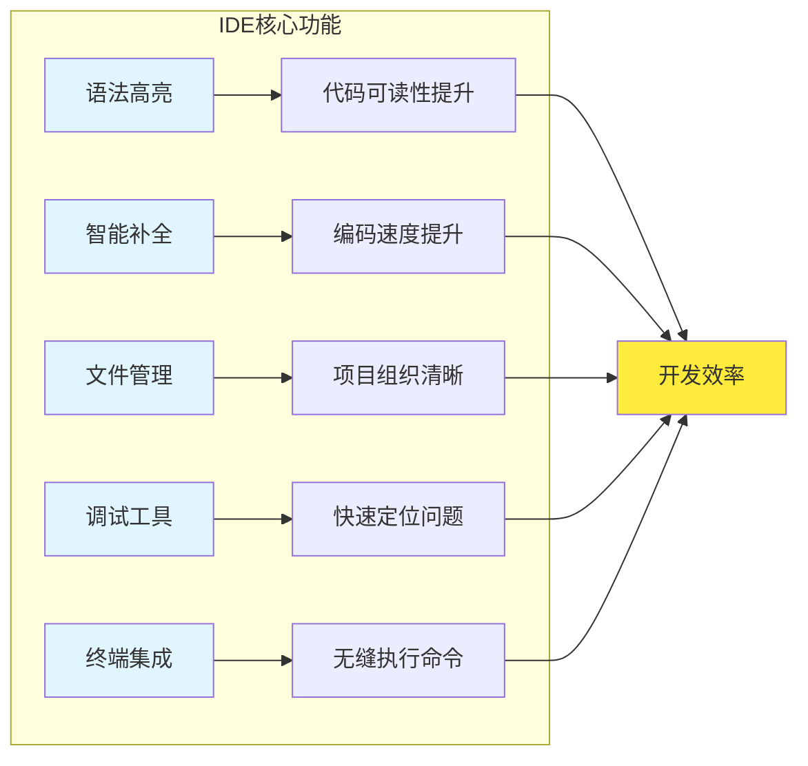
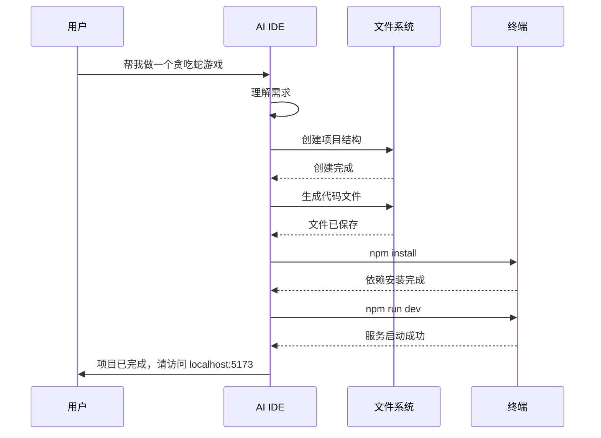
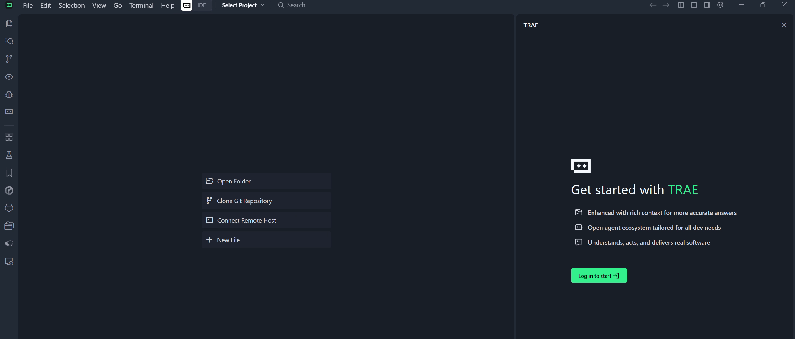
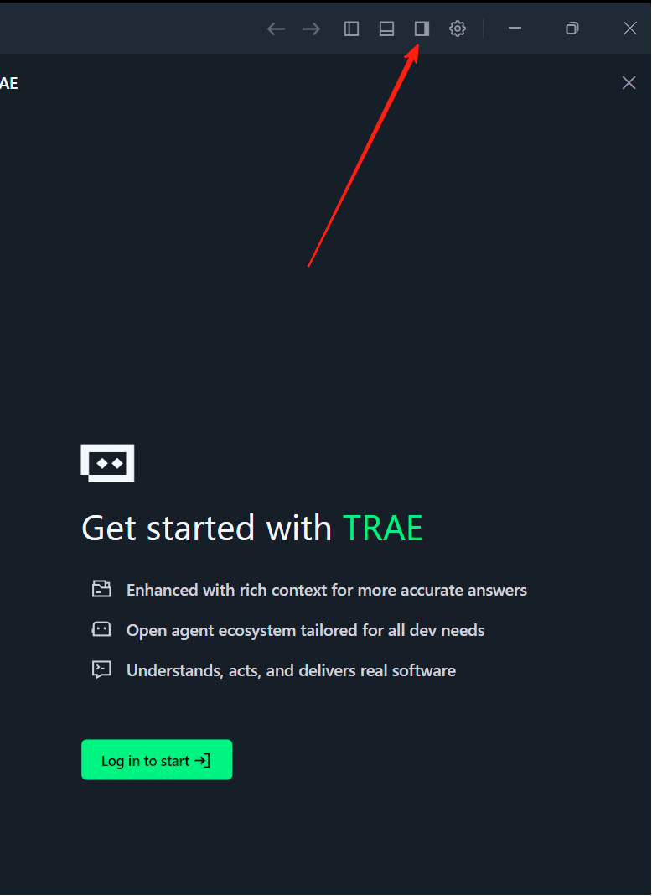
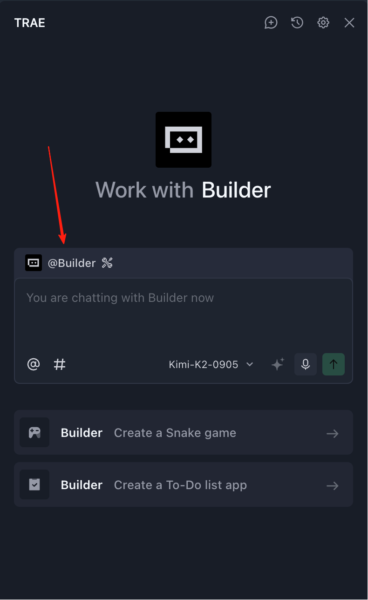
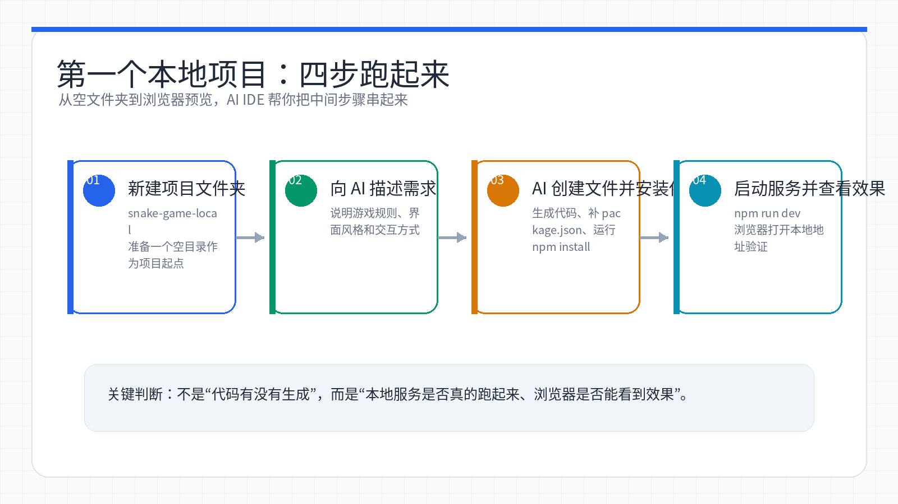
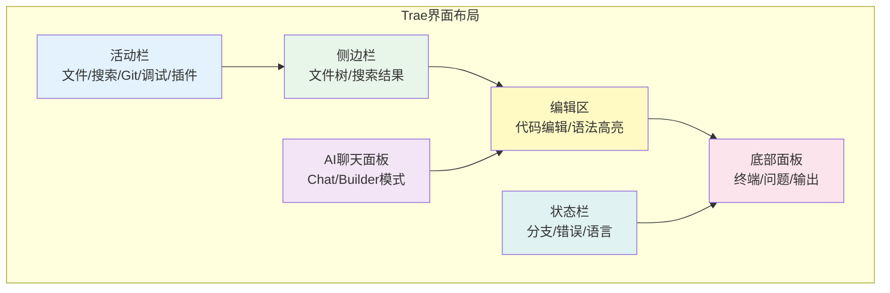

# Week 02：AI IDE 入门 - 跑出第一个程序

> 小林上周在 z.ai 上做出了第一个贪吃蛇，兴奋地发到朋友圈。结果有个做开发的学长留言：「网页版只能玩玩，真要做项目得装本地环境。」小林一脸懵：什么是本地环境？为什么网页版不够用？这一周，她决定搞清楚「在自己电脑上写代码」到底是怎么回事，并且真正跑通第一个本地项目。

<ChapterIntroduction duration="约 3 小时" output="一个在本地运行的完整项目，掌握 AI IDE 的基本使用流程" prerequisite="完成 Week 01，体验过 z.ai" :tags="['本地开发', 'AI IDE', 'Trae', '环境配置', '第一个项目']">

本周我们要解决三个核心问题：为什么需要本地开发环境、什么是 AI IDE、以及如何用它从零跑出第一个程序。你会亲手安装 Trae（字节跳动推出的 AI IDE），在本地新建项目、让 AI 帮你写代码、处理报错、启动服务。学完这周，你就能脱离网页版的限制，在自己的电脑上随时开发、随时保存、随时迭代。

</ChapterIntroduction>

<StepBar :active="0" :items="[
  { title: '① 为什么要本地开发', description: '理解网页版的局限与本地环境的价值' },
  { title: '② 认识 AI IDE', description: '什么是 IDE，AI IDE 和普通 IDE 的区别' },
  { title: '③ 安装与配置', description: '下载 Trae，完成基础配置' },
  { title: '④ 第一个本地项目', description: '用 AI 从零生成并运行贪吃蛇' },
  { title: '⑤ 界面与工具', description: '熟悉 IDE 的各个区域和常用功能' }
]" />

---

## 为什么需要本地开发环境

小林上周在 z.ai 上做贪吃蛇时，一切都很顺利：打开网页、输入需求、点击运行，几分钟就能看到效果。但她很快发现了几个问题：

### 网页版的三大限制

<InfoCard icon="⚠️" variant="warning">

**1. 不能随时保存**  
z.ai 的项目存在云端，网络不稳定时可能丢失进度。而且免费版有存储限制，做多了就得删旧项目。

**2. 文件管理不方便**  
当项目文件超过 10 个，网页版的文件树就开始卡顿。想批量重命名、移动文件夹，都得一个个手动操作。

**3. 无法做复杂项目**  
网页版通常只支持前端代码，想接数据库、调用后端 API、部署到服务器，都做不了。

</InfoCard>

### 本地开发的四大优势

相比之下,在自己电脑上开发就自由多了：

```
✓ 完全离线工作 - 没网也能写代码
✓ 文件随便管理 - 用系统自带的文件夹，想怎么整理就怎么整理
✓ 性能更快 - 不用等服务器响应，本地运行秒开
✓ 功能无限制 - 前端后端数据库，想做什么都行
```

小林的学长给她打了个比方：

> 网页版就像在图书馆借书看，方便但有时间限制；本地开发就像买书回家，随时翻、随时做笔记、还能拆开重装订。


*网页版适合快速体验，本地 AI IDE 更适合长期保存、管理文件、运行复杂项目。*

---

## 什么是 IDE，为什么需要 IDE

小林第一次听到「IDE」这个词时，以为是某种高级编程语言。后来才知道，IDE 全称是 **Integrated Development Environment（集成开发环境）**，说白了就是「专门用来写代码的软件」。

### 用记事本写代码会怎样

理论上，你可以用 Windows 自带的记事本写代码。小林试了一下，写了这段 JavaScript：

```javascript
function sayHello(name) {
  console.log("Hello, " + name)
}
sayHello("小林")
```

保存成 `test.js`，用 Node.js 运行，确实能跑。但问题很快就来了：

<InfoCard icon="😵" variant="danger">

**记事本写代码的五大痛点**

1. **全是黑色文字** - 关键字、字符串、注释混在一起，眼睛看花
2. **没有智能提示** - 每个单词都要完整手敲，拼错一个字母就要反复检查
3. **文件多了就乱** - 十几个文件来回切换，经常找不到要改的那一行
4. **出错只能猜** - 程序崩了不知道哪里出问题，只能一行行打印日志试错
5. **没有调试工具** - 想看某个变量的值，只能手动加 `console.log`

</InfoCard>

### IDE 解决了什么问题

IDE 就是为了解决这些痛点而生的。它把「写代码」需要的所有工具都集成在一起：

**记事本 vs IDE：同一段代码的显示效果**

记事本显示（全黑无高亮）：
```text
function sayHello(name) {
  console.log("Hello, " + name)
}
sayHello("小林")
```

IDE 显示（语法高亮）：
```javascript
function sayHello(name) {
  console.log("Hello, " + name)
}
sayHello("小林")
```

左边是记事本的效果（全黑），右边是 IDE 的效果（语法高亮）。IDE 会自动用不同颜色标记关键字、字符串、函数名，让代码结构一目了然。

### IDE 的核心功能

一个现代 IDE 通常包含这些核心能力：

| 功能 | 作用 | 小林的理解 |
|------|------|-----------|
| **语法高亮** | 用颜色区分代码的不同部分 | 就像给文章标重点，一眼看出哪是标题哪是正文 |
| **智能补全** | 输入几个字母就自动提示完整代码 | 像手机输入法，打「你好」就提示「你好吗」 |
| **文件管理** | 左侧树状结构显示所有文件 | 像电脑的文件夹，但专门为代码项目优化 |
| **调试工具** | 可以暂停程序、查看变量值 | 像视频的暂停键，能定格在某一帧仔细看 |
| **终端集成** | 在 IDE 里直接运行命令 | 不用切换窗口，写完代码立刻运行 |

小林第一次用 IDE 时，最惊喜的是**智能补全**。她输入 `console.`，IDE 立刻弹出一个列表：

```
console.log()
console.error()
console.warn()
console.table()
...
```

她只需要按方向键选择 `log`，回车，IDE 就自动补全成 `console.log()`，光标还自动停在括号里等她输入内容。这比手敲快了至少 3 倍。



---

## AI IDE 和普通 IDE 有什么不同

小林装好 VS Code（最流行的免费 IDE）后，发现它确实比记事本好用太多。但她很快又听说了一个新词：**AI IDE**。

### 普通 IDE：你是司机

在普通 IDE 里，你需要自己：

- 想清楚要写什么代码
- 一行行敲出来
- 遇到报错自己查文档
- 想加新功能自己找对应文件

就像开车，你是司机，IDE 是车，但路线、操作都得你自己来。

### AI IDE：你是乘客，AI 是司机

在 AI IDE 里，你可以：

<AiChat 
  :initial-messages="[
    { role: 'user', content: '帮我做一个贪吃蛇游戏，用 React 写' },
    { role: 'assistant', content: '好的，我来帮你创建项目。我会：创建 React 项目结构、实现贪吃蛇的核心逻辑、添加键盘控制、实现碰撞检测和计分。开始创建文件...' },
    { role: 'system', content: '✓ 已创建 src/SnakeGame.jsx ✓ 已创建 src/App.jsx ✓ 已安装依赖 ✓ 启动开发服务器...' },
    { role: 'assistant', content: '项目已创建完成！在浏览器打开 localhost:5173 即可看到效果。' }
  ]"
  :show-input="false"
/>

你只需要说清楚「要做什么」，AI 会自动：

- 创建项目结构
- 写代码
- 安装依赖
- 启动服务
- 遇到报错自己调试



### 对比：普通 IDE vs AI IDE

小林做了一个对比表，帮自己理解两者的区别：

| 场景 | 普通 IDE | AI IDE |
|------|---------|--------|
| **新建项目** | 自己查文档，手动创建文件夹和配置文件 | 说「创建一个 React 项目」，AI 自动搞定 |
| **写代码** | 自己想逻辑，一行行敲 | 说「实现贪吃蛇的移动逻辑」，AI 生成代码 |
| **遇到报错** | 复制错误信息到搜索引擎，找解决方案 | 把报错截图给 AI，它直接帮你改 |
| **加新功能** | 自己找对应文件，手动修改 | 说「加一个暂停按钮」，AI 跨文件修改 |
| **优化代码** | 自己重构，或者找插件 | 选中代码说「优化一下」，AI 重写 |

<InfoCard icon="💡" variant="tip">

**小林的体会**

刚开始她以为 AI IDE 就是「会自动补全的 IDE」，用了之后才发现完全不是一个量级。普通 IDE 的自动补全只能提示「下一个单词」，而 AI IDE 能理解你的意图，直接生成「整段代码」甚至「整个文件」。

更重要的是，AI IDE 能**跨文件操作**。比如你说「把登录功能改成用手机号」，它会自动找到相关的 10 个文件，一起改掉。这在普通 IDE 里得你自己一个个找、一个个改。

</InfoCard>

---

## 选择 AI IDE：为什么用 Trae

市面上有很多 AI IDE：Cursor、Windsurf、Trae、Cline……小林一开始也很迷茫，不知道选哪个。后来她发现，对于零基础的人来说，**Trae 中国版**是最合适的入门选择。

### Trae 的三大优势

**1. 完全免费，无需科学上网**

- Cursor 专业版要 20 美元/月
- Windsurf 免费版有次数限制
- Trae 中国版基础功能完全免费，支持国内最新大模型（Kimi、GLM、Qwen）

**2. 中文支持好，适合新手**

- 界面全中文
- 报错信息自动翻译
- AI 对话理解中文需求更准确

**3. 基于 VS Code，学会了就能无缝切换**

Trae 是在 VS Code 基础上改的，界面布局、快捷键、插件生态都一样。学会 Trae，以后换 Cursor、Windsurf 或者原版 VS Code，都不用重新学。

<InfoCard icon="🎯" variant="success">

**小林的选择逻辑**

她问了自己三个问题：
1. 我有预算吗？→ 没有，选免费的
2. 我能科学上网吗？→ 不稳定，选国内版
3. 我以后会换工具吗？→ 可能，选基于 VS Code 的

答案指向 Trae 中国版。

</InfoCard>

---

## 安装 Trae：从下载到第一次启动

小林决定动手了。她打开 Trae 中国版官网（https://www.trae.cn/），看到一个大大的「下载」按钮。

### 第一步：下载安装包

1. 访问 https://www.trae.cn/
2. 点击「下载」按钮
3. 选择你的操作系统（Windows / macOS / Linux）
4. 下载完成后，双击安装包

安装过程和普通软件一样，一路「下一步」就行。唯一需要注意的是：

<InfoCard icon="⚠️" variant="warning">

**安装路径建议**

不要装在 C 盘（Windows）或系统盘，因为以后项目文件会越来越多。建议装在 D 盘或其他盘，路径里不要有中文和空格。

推荐路径：`D:\Programs\Trae`（Windows）或 `/Applications/Trae`（macOS）

</InfoCard>

### 第二步：第一次启动

安装完成后，双击桌面图标启动 Trae。第一次打开会看到欢迎界面：

```
欢迎使用 Trae
□ 打开文件夹
□ 克隆 Git 仓库
□ 新建文件
```

小林点了「打开文件夹」，选择了桌面上新建的空文件夹 `my-first-project`。Trae 的主界面出现了：

- **左侧**：文件树（现在是空的）
- **中间**：编辑区（显示欢迎页）
- **右侧**：AI 聊天面板（这是 Trae 的核心）
- **底部**：终端（黑色窗口，用来运行命令）

### 第三步：打开 AI 聊天面板

如果右侧没有看到 AI 聊天面板，点击右上角的「侧边栏」图标（像一个对话框的图标），就能打开。



*Trae 的主界面：左侧文件树、中间编辑区、右侧 AI 面板*



*点击右上角图标打开 AI 聊天面板*

在聊天面板顶部，你会看到：

- **Chat 模式**：普通对话，AI 只回答问题，不会动手改代码
- **Builder 模式**：AI 助手模式，可以创建文件、修改代码、运行命令



*切换到 Builder 模式开始 AI 辅助开发*

<InfoCard icon="✨" variant="tip">

**小林的第一次对话**

她切换到 Builder 模式，输入：「你好，我是小林，第一次用 Trae。」

AI 回复：「你好小林！欢迎使用 Trae。我可以帮你创建项目、写代码、调试程序。你想做什么？」

小林突然意识到：这不是冷冰冰的工具，而是一个随时待命的编程助手。

</InfoCard>

### 第四步：选择模型

在聊天面板的模型选择下拉框里，小林看到了很多选项：

- Kimi k2
- GLM-4
- Qwen-3-Coder
- MiniMax-M2.7


*在 Builder 模式下选择合适的 AI 模型*

她不知道选哪个，就问 AI：「我应该用哪个模型？」

AI 回答：「对于初学者，推荐 Kimi k2 或 GLM-4，它们对中文支持好，代码生成质量高。如果遇到问题解决不了，可以换个模型试试。」


*Trae 支持多种国内大模型，可以随时切换*

小林选了 Kimi k2，准备开始第一个项目。

---

## 第一个本地项目：用 AI 生成贪吃蛇

小林上周在 z.ai 上做过贪吃蛇，这次她想在本地再做一遍，看看有什么不同。



*本地开发的目标不是“生成了代码”就结束，而是确认项目能安装、能启动、能在浏览器看到效果。*

### 步骤 1：新建项目文件夹

她在桌面新建了一个文件夹，命名为 `snake-game-local`。然后在 Trae 里点击「文件 → 打开文件夹」，选择这个文件夹。

左侧文件树显示：

```
snake-game-local/
(空)
```

### 步骤 2：向 AI 描述需求

小林在右侧 Builder 面板输入：

> 请你用 React 实现一个贪吃蛇游戏，包含：
> 1. 键盘方向键控制蛇的移动
> 2. 吃到食物后蛇变长，分数加 1
> 3. 撞墙或撞到自己时游戏结束，显示「Game Over」
> 4. 有「重新开始」按钮
> 5. 实现后自动启动项目
> 
> 如果缺少环境（比如 Node.js），请自动安装。

她特意加了最后一句，因为她不确定自己电脑上有没有装 Node.js。

### 步骤 3：AI 开始工作

AI 回复：

```
好的，我来帮你创建贪吃蛇游戏。我会：
1. 检查 Node.js 环境
2. 创建 React 项目
3. 实现游戏逻辑
4. 启动开发服务器

开始执行...
```

小林看到终端里开始滚动输出：

```bash
$ node --version
v20.10.0

$ npm create vite@latest snake-game -- --template react
✔ 项目创建成功

$ cd snake-game && npm install
⠋ 安装依赖中...
```

<InfoCard icon="⏸️" variant="warning">

**遇到暂停怎么办**

AI 执行过程中可能会暂停，等待你的确认。比如：

- 弹出「是否安装依赖？」→ 输入 `y` 回车
- 显示「Run」按钮 → 点击确认
- 显示网址（如 `localhost:5173`）→ 点击「Skip」继续

这是正常现象，AI 在关键步骤会征求你的同意。

</InfoCard>

### 步骤 4：查看生成的代码

几分钟后，AI 说：「项目创建完成！」

小林看到左侧文件树多了很多文件：

```
snake-game-local/
├── node_modules/        (依赖包，自动生成)
├── public/              (静态资源)
├── src/
│   ├── App.jsx          (主组件)
│   ├── SnakeGame.jsx    (游戏逻辑)
│   └── main.jsx         (入口文件)
├── index.html
├── package.json         (项目配置)
└── vite.config.js       (构建配置)
```

她点开 `src/SnakeGame.jsx`，看到了 200 多行代码。虽然看不太懂，但能认出一些关键词：`useState`、`useEffect`、`handleKeyPress`……

### 步骤 5：启动项目

终端里显示：

```bash
$ npm run dev

  VITE v5.0.0  ready in 500 ms

  ➜  Local:   localhost:5173/
  ➜  Network: use --host to expose
```

AI 说：「开发服务器已启动，在浏览器打开 localhost:5173 即可看到效果。」

小林按住 `Ctrl` 键，点击终端里的链接。浏览器自动打开，贪吃蛇游戏出现了！

她试着按方向键，蛇真的动了。吃到红色的食物，蛇变长了，分数从 0 变成 1。她故意撞墙，屏幕中央弹出「Game Over」，下面有个蓝色的「重新开始」按钮。

<InfoCard icon="🎉" variant="success">

**小林的第一次成功**

她盯着屏幕看了 10 秒，突然意识到：这是她第一次在自己电脑上跑起来的程序。不是网页版的临时项目，而是真正属于她的、可以随时修改、随时保存的本地项目。

</InfoCard>

### 步骤 6：理解代码（可选）

小林对代码很好奇，但又看不懂。她在 AI 面板输入：

> 请用通俗的语言解释一下，这个贪吃蛇是怎么动起来的？

AI 回复：

<AiChat 
  :initial-messages="[
    { role: 'user', content: '请用通俗的语言解释一下，这个贪吃蛇是怎么动起来的？' },
    { role: 'assistant', content: '好的，我用生活中的例子来解释：蛇的身体是一串坐标点，就像一串珠子。每隔 200 毫秒，蛇头往前走一格，蛇尾去掉最后一颗珠子，看起来就像整条蛇在移动。如果蛇头的坐标和食物重合，就不去掉蛇尾，蛇就变长了。每次移动前会检查是否撞墙或撞到自己，如果是就停止游戏。' }
  ]"
  :show-input="false"
/>

小林恍然大悟：原来蛇不是真的在「移动」，而是每次在新位置画一个头、删掉旧的尾巴，看起来像在动！

她继续追问：

> 那个 `useState` 是什么意思？

AI 解释：

> `useState` 是 React 的「状态管理」工具。你可以把它想象成一个「记事本」：
> - `const [score, setScore] = useState(0)` 表示：创建一个记事本，初始值是 0，名字叫 `score`
> - 当你调用 `setScore(score + 1)`，就是在记事本上把 0 改成 1
> - React 会自动检测记事本的变化，重新渲染界面，所以屏幕上的分数会更新

小林觉得这个比喻太形象了，她把这段对话截图保存下来。

---

## 熟悉 IDE 界面：每个区域是干什么的

小林现在能跑起来项目了，但对 Trae 的界面还是一知半解。她决定系统地认识一下每个区域。

### 整体布局

Trae 的界面分为 5 大区域：


*标准的 IDE 界面布局（Trae 基于 VS Code，布局完全一致）*

```
┌─────────────────────────────────────────────────────┐
│  标题栏 (Title Bar)                                  │
├──┬──────────────────────────────────────────────┬───┤
│活│                                              │ A │
│动│          编辑区 (Editor)                     │ I │
│栏│                                              │   │
│  │                                              │ 聊│
│侧├──────────────────────────────────────────────┤ 天│
│边│                                              │   │
│栏│          底部面板 (Panel)                    │ 面│
│  │          终端 / 输出 / 调试                  │ 板│
├──┴──────────────────────────────────────────────┴───┤
│  状态栏 (Status Bar)                                │
└─────────────────────────────────────────────────────┘
```



### 1. 活动栏（最左侧）

一排竖着的图标，每个图标对应一个功能：

| 图标 | 功能 | 小林的理解 |
|------|------|-----------|
| 📁 | 文件管理 | 显示项目里的所有文件和文件夹 |
| 🔍 | 搜索 | 在整个项目里搜索关键词 |
| 🌿 | 版本控制 | 管理代码的历史版本（后续会在 Claude Code 安全使用中反复强调） |
| 🐛 | 调试 | 运行程序并查看变量值 |
| 🧩 | 插件 | 安装扩展功能（比如主题、语言支持） |

点击不同图标，左侧的「侧边栏」会显示对应的内容。

### 2. 侧边栏（活动栏右边）

根据你点击的活动栏图标，这里会显示不同内容：

- **文件模式**：树状结构显示所有文件，点击文件名就能在编辑区打开
- **搜索模式**：输入关键词，显示所有包含该词的文件和行号
- **Git 模式**：显示哪些文件被修改了，可以提交版本

小林最常用的是文件模式。她发现，右键点击文件夹可以：

- 新建文件
- 新建文件夹
- 重命名
- 删除

比在文件管理器里操作方便多了。

### 3. 编辑区（中间最大的区域）

这是写代码的地方。顶部有标签页（Tab），显示当前打开了哪些文件。

小林发现了几个实用技巧：

<InfoCard icon="💡" variant="tip">

**编辑区的隐藏功能**

1. **分屏**：右键标签页 → 「向右拆分」，可以同时看两个文件
2. **代码折叠**：点击行号左边的小三角，可以折叠一段代码
3. **小地图**：右侧有个缩略图（Minimap），点击可以快速跳转
4. **面包屑导航**：编辑区顶部显示当前文件的路径，点击可以快速切换文件夹

</InfoCard>

### 4. 底部面板（终端和输出）

这里有几个标签页：

- **终端（Terminal）**：黑色窗口，输入命令的地方。比如 `npm run dev` 启动项目
- **问题（Problems）**：列出代码里的错误和警告
- **输出（Output）**：显示工具的运行日志
- **调试控制台（Debug Console）**：调试时查看变量值

小林最常用的是终端。她学会了几个基本命令：

```bash
npm run dev      # 启动开发服务器
npm run build    # 打包项目
Ctrl + C         # 停止当前运行的命令
```

### 5. 右侧 AI 聊天面板

这是 Trae 的核心，也是和普通 IDE 最大的区别。

面板顶部有两个模式：

- **Chat 模式**：纯聊天，AI 只回答问题，不会修改代码
- **Builder 模式**：AI 助手，可以创建文件、修改代码、运行命令

小林的使用习惯：

- 问问题时用 Chat 模式（比如「什么是 useState」）
- 要改代码时用 Builder 模式（比如「加一个暂停按钮」）

### 6. 状态栏（最底部）

一条细细的栏，显示当前状态：

- **左侧**：Git 分支名、错误/警告数量
- **中间**：当前文件的语言（JavaScript、HTML 等）
- **右侧**：光标位置（第几行第几列）、缩进方式（2 空格 / 4 空格）

小林发现，点击状态栏的某些部分可以快速切换设置。比如点击「2 空格」可以改成「4 空格」。

---

## 实战：让 AI 美化界面

小林的贪吃蛇能跑了，但界面很朴素：白底黑字，没有任何装饰。她想让它好看一点。

### 第一次尝试：模糊需求

她在 Builder 面板输入：

> 帮我把界面变好看一点

AI 回复：

> 好的，我可以帮你美化界面。请问你想要什么风格？比如：
> - 深色主题还是浅色主题？
> - 想要什么颜色作为主色调？
> - 游戏区域要居中显示吗？
> - 分数和按钮的样式有什么要求？

小林意识到：「好看」太模糊了，AI 需要更具体的指令。

### 第二次尝试：具体需求

她重新组织语言：

> 请帮我美化界面：
> 1. 游戏区域居中显示，不要贴在左上角
> 2. 背景色改成浅灰色（#f5f5f5）
> 3. 蛇的颜色改成绿色（#4CAF50），食物改成红色（#f44336）
> 4. 分数放大到 24px，显示在游戏区域上方
> 5. 「重新开始」按钮改成圆角蓝色按钮
> 6. 游戏结束时，背景半透明遮罩，提示文字居中显示

AI 回复：「好的，我来修改样式。」

几秒钟后，AI 说：「修改完成，请刷新浏览器查看效果。」

小林按 `Ctrl + Shift + R` 强制刷新浏览器，界面焕然一新！

<DiffViewer 
  title="美化前后对比"
  diff="@@ -1,9 +1,23 @@
-/* 美化前：最简单的样式 */
-.game-board {
-  border: 1px solid black;
-}
-
-.snake {
-  background: black;
-}
-
-.food {
-  background: red;
-}
+/* 美化后：精心设计的样式 */
+.game-container {
+  display: flex;
+  flex-direction: column;
+  align-items: center;
+  padding: 40px;
+  background: #f5f5f5;
+  min-height: 100vh;
+}
+
+.game-board {
+  border: 3px solid #333;
+  border-radius: 8px;
+  box-shadow: 0 4px 12px rgba(0,0,0,0.1);
+}
+
+.snake {
+  background: #4CAF50;
+  border-radius: 2px;
+}
+
+.food {
+  background: #f44336;
+  border-radius: 50%;
+}"
/>

<InfoCard icon="✨" variant="success">

**小林的收获**

她发现，和 AI 对话的关键是**把模糊的想法拆成具体的要求**。不要说「好看」，而要说「居中、浅灰背景、绿色的蛇、24px 的分数」。

这个技巧不仅适用于美化界面，也适用于所有和 AI 的交互。

</InfoCard>

---

## 常见问题与解决方案

小林在实践中遇到了一些问题，她把解决方法记录下来。

### 问题 1：终端报错「npm: command not found」

**原因**：电脑上没有安装 Node.js

**解决方案**：

1. 在 AI 面板输入：「帮我检查并安装 Node.js」
2. AI 会自动下载并安装
3. 安装完成后，重启 Trae

### 问题 2：浏览器显示「Cannot GET /」

**原因**：开发服务器没有启动，或者端口被占用

**解决方案**：

1. 检查终端里有没有显示 `localhost:5173`
2. 如果没有，在终端输入 `npm run dev` 重新启动
3. 如果报错「端口被占用」，在 AI 面板说：「5173 端口被占用了，帮我换个端口」

### 问题 3：修改代码后浏览器没反应

**原因**：没有保存文件，或者热更新失效

**解决方案**：

1. 按 `Ctrl + S`（Windows）或 `Cmd + S`（macOS）保存文件
2. 如果还是没反应，手动刷新浏览器（`Ctrl + Shift + R` 强制刷新）
3. 如果还不行，在终端按 `Ctrl + C` 停止服务，重新运行 `npm run dev`

### 问题 4：AI 生成的代码报错

**原因**：AI 也会犯错，或者环境配置不一致

**解决方案**：

1. 复制完整的错误信息（红色的那一大段）
2. 在 AI 面板粘贴，并说：「这是我遇到的错误，请帮我修复」
3. 如果 AI 修复后还是报错，可以换个模型试试（比如从 Kimi 换成 GLM）

<InfoCard icon="🔄" variant="tip">

**代码回退功能**

如果 AI 的修改让项目变得更糟，可以点击聊天记录里的「Revert」按钮，回退到修改前的状态。这是 AI IDE 的一大优势：每次修改都有记录，随时可以撤销。

</InfoCard>

### 问题 5：不知道该问 AI 什么

**原因**：对项目不熟悉，不知道从哪里入手

**解决方案**：

可以问这些「万能问题」：

```
- 这个项目的结构是怎样的？每个文件是干什么的？
- 如果我想加一个 XX 功能，应该改哪个文件？
- 这段代码是什么意思？能用通俗的语言解释吗？
- 有没有什么地方可以优化？
- 我想实现 XX 效果，应该怎么做？
```

---

## 高效与 AI 对话的技巧

小林用了一周 Trae，总结出了一套和 AI 对话的方法论。

### 技巧 1：说清楚背景和目标

❌ **不好的提问**：「帮我改一下」

✅ **好的提问**：「我想让贪吃蛇的速度随着分数增加而加快。现在速度是固定的 200ms，我希望每吃 5 个食物，速度加快 20ms。请帮我实现。」

### 技巧 2：一次只做一件事

❌ **不好的提问**：「帮我加暂停功能、改颜色、加音效、优化性能」

✅ **好的提问**：「先帮我加一个暂停功能，按空格键可以暂停和继续游戏。」

等这个功能做完并测试通过，再提下一个需求。

### 技巧 3：善用截图和代码片段

当你不知道怎么描述问题时，直接把看到的东西发给 AI：

- **报错信息**：复制整段红色文字
- **界面问题**：截图当前页面（需要支持多模态的模型，如 Kimi k2、GPT-4）
- **代码问题**：选中有问题的代码，右键 → 「Ask AI」

### 技巧 4：让 AI 解释，而不是直接改

当你想学习某段代码时：

❌ **不好的提问**：「帮我优化这段代码」

✅ **好的提问**：「请先解释这段代码的逻辑，然后告诉我有哪些可以优化的地方，以及为什么要这样优化。」

这样你不仅得到了优化后的代码,还学到了背后的原理。

### 技巧 5：遇到问题先自己尝试

不要一遇到问题就问 AI。可以先：

1. 看看终端的错误提示，有没有明显的线索（比如「文件不存在」「端口被占用」）
2. 检查是否保存了文件
3. 尝试重启开发服务器

如果尝试 3 次还解决不了，再把「我做了什么 + 出现了什么问题 + 我尝试了什么」一起告诉 AI。

<InfoCard icon="🎯" variant="tip">

**小林的对话模板**

她把常用的提问方式整理成模板，每次照着填空：

```
【背景】我正在做一个 XX 项目
【目标】我想实现 XX 功能
【现状】目前的情况是 XX
【问题】遇到了 XX 问题（附上错误信息/截图）
【尝试】我已经尝试了 XX，但没有解决
【请求】请帮我 XX
```

这样 AI 能快速理解上下文，给出更准确的答案。

</InfoCard>

---

## 进阶：从 z.ai 迁移到本地

小林上周在 z.ai 上做了一个待办事项应用，她想把它迁移到本地继续开发。

### 步骤 1：从 z.ai 下载代码

在 z.ai 项目页面，点击右上角的「下载」按钮，选择「Download as ZIP」。

下载后解压到桌面，得到一个文件夹 `todo-app/`。

### 步骤 2：用 Trae 打开

在 Trae 里点击「文件 → 打开文件夹」，选择刚才解压的 `todo-app/` 文件夹。

左侧文件树显示了所有文件。

### 步骤 3：安装依赖

z.ai 下载的代码不包含 `node_modules/`（依赖包），需要手动安装。

在终端输入：

```bash
npm install
```

等待几分钟，依赖安装完成。

### 步骤 4：启动项目

```bash
npm run dev
```

浏览器打开 `localhost:5173`，待办事项应用出现了！

### 步骤 5：继续开发

现在你可以在本地继续开发这个项目：

- 修改代码，保存后自动刷新
- 添加新功能，让 AI 帮你实现
- 随时提交版本（下周会学 Git）

<InfoCard icon="🔗" variant="success">

**无缝衔接**

小林发现，z.ai 和本地开发的工作流是一样的：都是用 React、都是 `npm run dev` 启动、都是在浏览器里看效果。唯一的区别是，本地开发更自由、更快、更稳定。

</InfoCard>

---

## 本周回顾

小林这一周从「只会用网页版」进化到「能在本地独立开发」。她回顾了一下学到的关键点：

<ProgressTracker title="Week 02 学习进度" :items="[
  { title: '理解本地开发的价值', description: '知道为什么要从网页版迁移到本地，以及本地开发的四大优势', done: false },
  { title: '认识 IDE 和 AI IDE', description: '能说清楚 IDE 是什么、AI IDE 和普通 IDE 的区别', done: false },
  { title: '安装并配置 Trae', description: '成功安装 Trae，打开 AI 聊天面板，选择合适的模型', done: false },
  { title: '跑通第一个本地项目', description: '用 AI 从零生成贪吃蛇，启动开发服务器，在浏览器看到效果', done: false },
  { title: '熟悉 IDE 界面', description: '知道活动栏、侧边栏、编辑区、终端、AI 面板各自的作用', done: false },
  { title: '掌握与 AI 对话的技巧', description: '能写出具体的需求、善用截图和代码片段、知道如何调试问题', done: false }
]" />

### 自测题

1. **网页版 AI 编程工具（如 z.ai）有哪三大限制？本地开发如何解决这些问题？**

2. **用记事本写代码会遇到哪些痛点？IDE 是如何解决这些痛点的？**

3. **AI IDE 和普通 IDE 的核心区别是什么？举一个具体的例子说明。**

4. **Trae 的界面分为哪 5 大区域？每个区域的主要作用是什么？**

5. **当 AI 生成的代码报错时，你应该如何向 AI 描述问题？至少列出 3 个要点。**

---

## 下周预告

小林现在能在本地跑起来项目了，但她发现了一个新问题：AI IDE 能帮她写代码，但她还缺少一个更直接、更通用的终端协作工具。

下周，我们会学习 **Claude Code 快速上手**，解决这些问题：

- 如何在终端里启动 Claude Code
- 如何让 Claude Code 读取文件、生成文档和修改代码
- 如何描述报错、检查改动并保持基本安全边界
- 如何把 AI IDE 和 Claude Code 放进同一套学习路径

学完 Claude Code 快速上手，你就能从"会用 AI IDE"进入"会指挥终端里的 AI 协作伙伴"。

---

## 本周作业

<InfoCard icon="📝" variant="warning">

**必做作业：在本地做一个比贪吃蛇更复杂的游戏**

要求：
1. 选择一个比贪吃蛇更复杂的游戏（俄罗斯方块、打地鼠、扫雷、2048、飞机大战等）
2. 必须用本地 AI IDE（Trae 或其他）完成
3. 至少包含：开始、进行中、结束三种状态
4. 有清晰的得分或进度反馈
5. 至少进行 2 轮迭代（第一轮做出能玩的版本，第二轮优化界面或功能）

**提交内容**：
- 项目文件夹的截图（显示文件结构）
- 游戏运行的截图（至少 3 张：开始界面、游戏中、结束界面）
- 一段 100 字左右的总结：你遇到了什么问题，如何解决的

</InfoCard>

<InfoCard icon="🌟" variant="success">

**选做作业：把 z.ai 上的项目迁移到本地**

如果你上周在 z.ai 上做了项目，可以尝试：
1. 从 z.ai 下载代码
2. 在本地用 Trae 打开
3. 安装依赖并启动项目
4. 添加至少一个新功能

这个练习能帮你理解「网页版和本地版本质上是一样的」，只是运行环境不同。

</InfoCard>

---

## 附录：常见术语速查

小林在学习过程中遇到了很多新词，她整理成了一个速查表。

### 开发环境相关

| 术语 | 解释 | 小林的理解 |
|------|------|-----------|
| **本地开发** | 在自己电脑上写代码和运行程序 | 就像在自己家做饭，想怎么做就怎么做 |
| **开发服务器** | 一个临时的网页服务，用来预览项目 | 像一个临时搭建的展台，只有你自己能看到 |
| **端口（Port）** | 服务器的「门牌号」，比如 5173 | 一栋楼有很多房间，端口就是房间号 |
| **localhost** | 代表「本机」，即你自己的电脑 | 就是「我自己的电脑」的专业说法 |

### IDE 相关

| 术语 | 解释 | 小林的理解 |
|------|------|-----------|
| **IDE** | 集成开发环境，专门用来写代码的软件 | 程序员的「工作台」，集成了所有工具 |
| **语法高亮** | 用不同颜色显示代码的不同部分 | 像给文章标重点，一眼看出结构 |
| **智能补全** | 输入几个字母就自动提示完整代码 | 像手机输入法的联想功能 |
| **终端（Terminal）** | 黑色窗口，输入命令让电脑干活 | 给电脑发「短信命令」的地方 |

### AI IDE 相关

| 术语 | 解释 | 小林的理解 |
|------|------|-----------|
| **Chat 模式** | 纯聊天，AI 只回答问题，不改代码 | 像问老师问题，老师只讲解不动手 |
| **Builder 模式** | AI 助手，可以创建文件、修改代码 | 像请了个实习生，你说他做 |
| **模型（Model）** | AI 的「大脑」，不同模型能力不同 | 像不同的老师，有的擅长数学有的擅长语文 |
| **热更新（Hot Reload）** | 修改代码后自动刷新浏览器 | 像边做饭边尝味道，不用等全做完 |

### 代码相关

| 术语 | 解释 | 小林的理解 |
|------|------|-----------|
| **依赖（Dependencies）** | 项目需要的外部代码包 | 像做菜需要的调料，不是你自己做的 |
| **node_modules** | 存放所有依赖包的文件夹 | 调料柜，里面放着各种调料 |
| **package.json** | 项目配置文件，记录依赖和脚本 | 菜谱，写着需要哪些调料、怎么做 |
| **npm** | Node.js 的包管理工具 | 调料商店，帮你下载和管理调料 |

### 报错相关

| 术语 | 解释 | 小林的理解 |
|------|------|-----------|
| **Bug** | 代码里的错误 | 程序「生病」了 |
| **报错信息** | 程序崩溃时显示的提示 | 程序的「病历」，告诉你哪里出问题 |
| **调试（Debug）** | 找出并修复错误的过程 | 给程序「看病」 |
| **日志（Log）** | 程序运行时输出的信息 | 程序的「自言自语」，帮你了解它在干什么 |

---

## 推荐资源

### 官方文档

- [Trae 中国版官网](https://www.trae.cn/) - 下载和使用指南
- [VS Code 官方文档](https://code.visualstudio.com/docs) - 学习 IDE 的基础操作
- [Node.js 官网](https://nodejs.org/) - 了解 Node.js 和 npm

### 学习资源

- [VS Code 快捷键速查表](https://code.visualstudio.com/shortcuts/keyboard-shortcuts-windows.pdf) - 提高效率必备
- [终端命令入门](https://www.runoob.com/linux/linux-command-manual.html) - 学习基本的命令行操作

### 社区

- [Trae 用户社区](https://forum.trae.cn/) - 遇到问题可以在这里提问
- [GitHub](https://github.com/) - 全球最大的代码托管平台（下周会学）

---

**小林的话**

> 这一周我最大的收获，不是学会了多少命令或快捷键，而是意识到：AI IDE 不是一个冷冰冰的工具，而是一个随时待命的编程伙伴。我不需要记住所有细节，只需要知道「我想做什么」，然后用清晰的语言告诉它。
>
> 从网页版到本地开发，就像从租房搬到自己家。虽然一开始要花时间装修（配置环境），但一旦搬进来，就会发现自由度完全不一样。
>
> 下周学 Git，我终于可以不用担心「改坏了找不回来」了！
