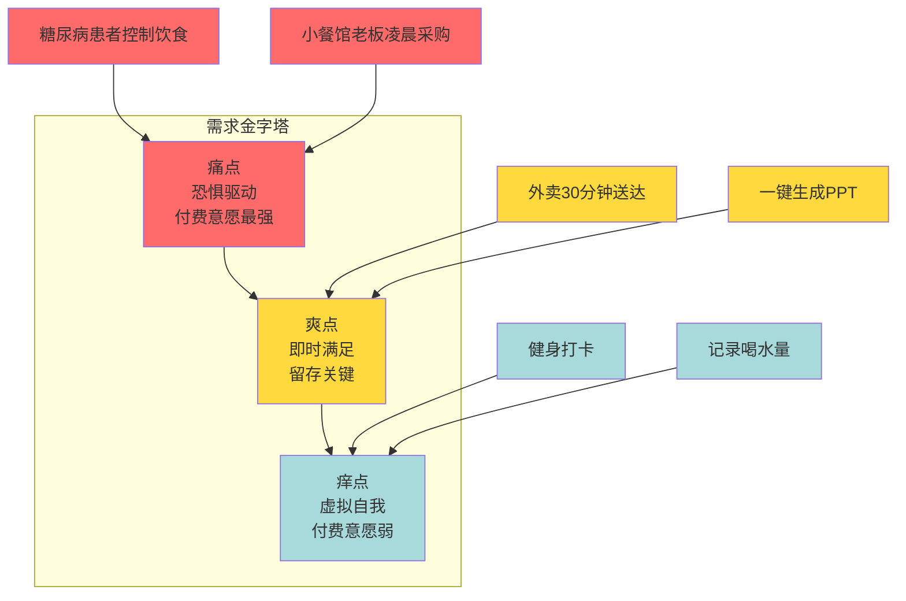
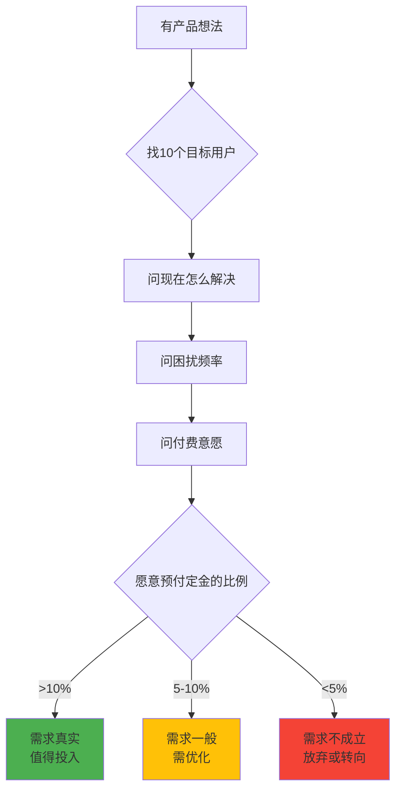
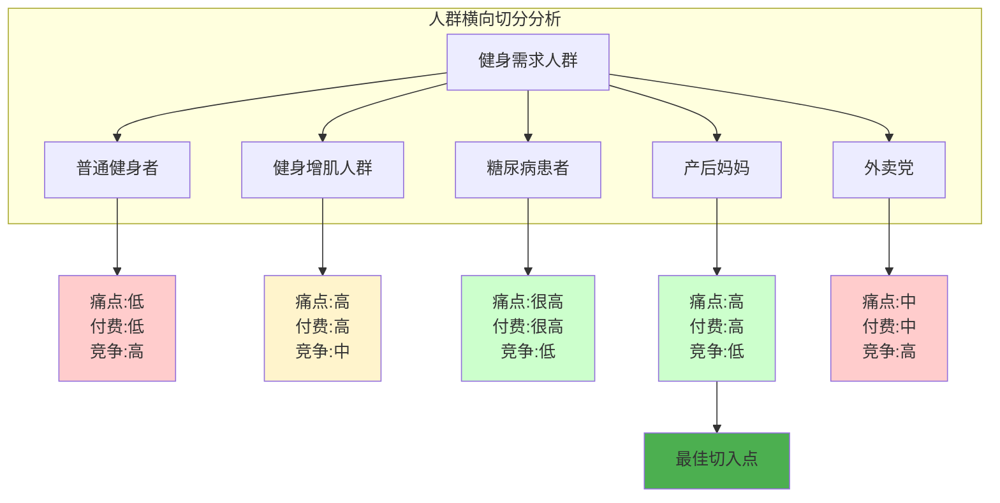

# Week 04：找到好创意 - 需求发现与痛点分析

> 小林做完前两周的练习后，兴奋地想立刻开始做产品。但她很快发现一个更根本的问题：做什么？她想过做个 AI 工具、做个社交平台，但总觉得这些想法"别人都做过了"。直到她学会了这一章的方法，才明白——好创意不是凭空想出来的，而是从真实需求中挖出来的。

🎯学习目标

需求挖掘产品思维用户分析商业模式痛点分析

前面两周我们学会了用 Claude Code 做东西，但有一个更根本的问题：**做什么？**

很多人一上来就想「做个 AI 工具」、「搞个社交平台」，结果做出来的东西没人用。问题出在哪？**没有找到真需求**。

更残酷的现实是：**很多产品虽然解决了问题，但用户就是不愿意买单。**

这一章，我们将通过小林的故事，学习如何找到值得做的产品方向。学完这一章，你将拥有一套**完整的找点子方法论**，以及 3 个经过验证的产品概念。

⏱️

预计时长

约 3 小时

📦

核心产出

3 个经过验证的产品概念，以及一套完整的需求分析方法

📋

前置条件

完成 Week 01-02 的 Claude Code 基础练习

0

① 理解真需求

什么样的需求用户愿意买单

0

② 横向切分人群

找到最痛的那个群体

0

③ 纵向深挖场景

理解完整的用户旅程

* * *

## 开篇故事：小林的困惑

小林学完前两周的课程后，迫不及待地想做点什么。她打开 Claude Code，准备开始写代码，但突然愣住了——**做什么呢？**

她想了几个方向：

-   做个健身 APP？但 Keep、薄荷健康已经很成熟了
-   做个记账工具？但支付宝账单、随手记功能都很全
-   做个学习打卡 APP？但市面上一搜一大把

每个想法都让她觉得"别人都做过了"，自己做出来也没人用。

她去找学长请教。学长是个独立开发者，做过几个小产品。

"你遇到的问题，90% 的新手都会遇到。"学长说，"问题不在于想法，而在于你不知道什么样的需求用户才愿意买单。"

学长给她讲了一个故事。

* * *

## 一个失败的案例：程序员小明的健身 APP

学长的朋友小明，是一名程序员，工作三年了。有一天他突然想到：要不做一个健身 APP 吧，帮用户制定健身计划、记录训练数据。

接下来的一年，小明几乎把所有业余时间都搭进去了。他做了一个功能很全的 APP——课程模块、打卡系统、社区功能、数据分析，该有的都有。界面也做得挺好看。

上线那天，小明满怀期待。他花了不少钱做推广，第一个月就有 5 万人下载。看起来开局不错，对吧？

但很快问题就来了。用户下载之后，用一次就卸载了，7 日留存只有 5%。他做了几个付费功能，但几乎没有用户愿意掏钱。更让他沮丧的是，Keep、薄荷健康、FitTime 这些成熟产品，功能比他全，内容比他好，用户为什么要换到他的 APP？

一年下来，小明亏了 20 万。

他坐在电脑前，看着后台惨淡的数据，心里只有一个问题：我的 APP 做得挺好的啊，为什么没人用？更没人愿意买单？

小明的失败，不是因为技术不行，也不是因为产品做得不好。说实话，他的 APP 功能挺全的，界面也挺好看的。

**问题出在起点。**

他从来没问过一个最基本的问题：用户真的需要吗？

学长说："小明的问题，就是你现在的问题。你们都在想「我能做什么」，而不是「用户需要什么」。更重要的是——**用户愿意为什么买单**。"

小林若有所思。

* * *

## 第一幕：理解真需求——什么样的需求用户愿意买单

学长继续说："在开始做任何产品之前，你必须先搞清楚一件事：什么是真需求？"

### 真需求 vs 假需求

小林问："什么是真需求？"

学长说："真需求有三个标准：**用户愿意为之付费、愿意为之改变行为、不解决会有很大损失**。"

他在纸上画了一个表格：

类型

特征

用户反应

例子

**真需求**

不解决会很痛苦

「我愿意付钱」

糖尿病患者控制饮食

**假需求**

有也挺好，没有也行

「挺有意思，但我不着急」

记录每天喝了多少水

"小明的健身 APP，解决的其实是假需求。"学长说，"普通人想健身，但不健身也不会怎么样。Keep 已经够用了，为什么要换？"

### 需求的三层：痛点、爽点、痒点

学长继续解释："需求可以分为三种类型：痛点、爽点、痒点。"



**痛点（Pain Point）—— 恐惧驱动**

**本质：** 用户正在经历的、让他们感到痛苦、焦虑、不便的问题。不解决会很难受，甚至威胁到生存或安全。

**例子：**

-   糖尿病患者不知道吃多少碳水会血糖飙升（恐惧：健康威胁）
-   小餐馆老板凌晨 4 点起床去批发市场（恐惧：生存艰辛）
-   产后妈妈担心身体恢复不好，留下后遗症（恐惧：健康焦虑）

**关键：** 用户愿意为此付费，因为不解决会「很痛」。

**爽点（Delight Point）—— 即时满足**

**本质：** 用户有一个需求，能够立即被满足，产生即时的愉悦感。

**例子：**

-   外卖 30 分钟送达（即时满足饥饿）
-   一键生成精美 PPT（省时省力的爽感）
-   拍照识别植物（即时满足好奇心）

**关键：** 让用户「爽」是留存的关键，但单独作为付费点较弱。

**痒点（Itch Point）—— 虚拟自我**

**本质：** 用户想要变得更好、更酷、更精致，但不是必须的。满足了会开心，不满足也没事。

**例子：**

-   记录每天喝了多少水（想象中的自律生活）
-   用 AI 给照片加艺术滤镜（想象中的艺术品味）
-   健身打卡（想象中的健康生活）

**关键：** 用户为「痒点」买单的意愿较弱，因为不解决也没事。

"优先级排序是：**痛点 > 爽点 > 痒点**。"学长说，"小明的健身 APP，解决的是痒点，不是痛点。所以用户不愿意付费。"

### 案例：让用户买单的产品

小林问："那有没有成功的例子？"

学长说："当然有。我给你讲两个。"

#### 案例一：美菜网——让小餐馆老板睡个好觉

"表面上看，美菜网做的事情很简单：帮餐馆买菜。"学长说，"但如果你仔细想，餐馆老板为什么要用它？"

"因为便宜？"小林猜测。

"不是。"学长摇头，"是因为小餐馆老板每天凌晨 4 点就要起床去批发市场，很辛苦，而且经常被坑。美菜网做的事情，不是简单的「电商卖菜」，而是重构了整个供应链，让小餐馆老板能睡个好觉。"

"痛点越痛，付费意愿越强。省下的时间和体力，比省下的菜钱更有价值。"

#### 案例二：小红书——解决选择困难

"小红书最开始是做什么的？"学长问。

"分享海外购物心得？"小林回答。

"对。但用户为什么愿意花时间在上面看笔记？"

小林想了想："因为不知道什么值得买？"

"没错！"学长说，"面对海量商品，用户不知道什么值得买、什么不值得买。他们需要一个信任的人帮自己筛选，节省时间，避免踩坑。"

"小红书解决的其实是两个深层痛点：**选择困难和信任缺失**。用户愿意为「省时间」和「避坑」付费，这就是为什么小红书能做起来。"

**关键洞察：用户买单的从来不是「功能」，而是「解决恐惧」和「消除焦虑」。**

-   美菜网解决的是小餐馆老板对凌晨采购艰辛的恐惧
-   小红书解决的是用户对买错东西的恐惧

**恐惧驱动付费，焦虑驱动行动。**

### 验证真需求的快速方法

小林问："那我有一个想法时，怎么快速判断它是否值得投入？"

学长说："我教你一个最简单的方法：**找 10 个目标用户聊天**。"

"但不要问「你会用我的产品吗？」这种问题，得到的都是假阳性回答。"

"要问："

-   "你现在怎么解决这个问题？"（了解真实行为）
-   "最近一周，这个问题让你困扰了几次？"（了解频率）
-   "为了解决它，你花了多少钱/时间？"（了解付费意愿）
-   "如果有个解决方案，但需要改变习惯，你愿意吗？"（了解改变成本）

📝验证需求的正确与错误方式

+12\-7

@@@ -1,8 +1,10 @@

1\-❌ 错误的问法：

2\-

3\-你：「我想做一个健身 APP，你会用吗？」

4\-用户：「会啊，听起来不错！」

5\-

6\-结果：用户说会用，但实际上不会付费。

7\-这是典型的「假阳性」回答。

1+✅ 正确的问法：

2+

3+你：「你现在怎么解决健身的问题？」

4+用户：「我用 Keep，但有些动作不适合我。」

5+

6+你：「最近一周，这个问题让你困扰了几次？」

7+用户：「几乎每次练都会遇到。」

8+

9+你：「如果有个专门针对你的健身方案，但需要付费 99 元/月，你会买吗？」

10+用户：「这个价格有点贵，我再想想。」

11+

12+结果：用户不愿意付费，说明需求不够痛。

"最好的验证方法是：**让用户预付定金**。"学长说，"说愿意付费的人很多，真正掏钱的人才是你的目标用户。"

"如果愿意付定金的用户比例超过 10%，说明需求真实，值得投入。如果低于 5%，说明需求不成立。"



* * *

## 第二幕：横向切分人群——找到最痛的那个群体

小林说："我明白了真需求的重要性。但我还是不知道从哪里开始找。"

学长说："我教你第二个方法：**横向切分人群**。"

### 从自己出发：小林的室友

"你身边有没有人经常抱怨某个问题？"学长问。

小林想了想："我室友小雨，她刚生完孩子，总是抱怨没时间健身，肚子上的赘肉减不下去，整个人很焦虑。"

"很好！"学长说，"这就是一个切入点。你去问问她，她现在怎么解决健身的问题？"

小林回去后，找小雨聊了聊。

"你现在怎么解决健身的问题？"小林问。

小雨叹了口气说："跟着 Keep 练吧，但那些动作不适合产后身体，做完腰更疼了。去健身房？没人帮忙看孩子。请私教？一节课 300 到 500 块，太贵了。自己瞎练吧，又怕受伤。"

小林听完，觉得这可能就是她要找的真需求。

### 横向切分：不同人群的需求

小林回去找学长，把小雨的情况告诉了他。

学长说："很好！但你不能只看一个人。你需要做一个**横向切分**，把「想健身的人」分成几类，看看哪个人群的需求最痛。"

他在纸上画了一个表格：

人群

痛点

付费意愿

市场规模

竞争程度

普通健身者

记录麻烦

低

大

高（Keep 等）

健身增肌人群

精确计算蛋白质摄入

高

中

中

糖尿病患者

必须严格控制碳水

很高

中

低

**产后妈妈**

想恢复身材但没时间

高

中

低

外卖党

不知道吃了多少热量

中

大

高



"你看，"学长指着表格说，"产后妈妈这个人群很有意思：痛点很痛、付费意愿高、竞争相对不激烈。"

"为什么选择产后妈妈？"小林问。

学长说："有四个原因："

1.  **你天然理解这个群体**——你室友就是产后妈妈，你能直接观察她的痛点
2.  **痛点很痛**——产后恢复的焦虑是真实的，不是「有也挺好」的痒点
3.  **付费意愿强**——妈妈们为了恢复身材，愿意花钱
4.  **竞争相对不激烈**——市面上没有专门针对产后妈妈的产品

**产品经理的切分逻辑**

为什么切分人群这么重要？

1.  **通用工具很难赢**——大平台已经占据了「通用」市场，你很难在功能上超越它们
2.  **细分人群的需求更痛**——产后妈妈对健身的需求是刚需，普通健身者只是「有也行」
3.  **更容易建立口碑**——服务好一个小群体，比讨好所有人更容易
4.  **付费意愿更强**——细分人群的痛点更具体，更愿意为解决方案付费

### 实战练习：用 Claude Code 做人群分析

学长说："现在，我们用 Claude Code 来帮你做一个更系统的人群分析。"

他打开终端，开始和 Claude Code 对话：

🤖

AI 助手

在线

我想做一个健身相关的产品，但不知道该服务哪个人群。请帮我分析：1. 列出 5 个可能的细分人群 2. 分析每个人群的痛点强度、付费意愿、市场规模 3. 推荐最值得切入的人群

👤

🤖

我来帮你做一个系统的人群分析。细分人群分析：1. 产后妈妈 - 痛点强度⭐⭐⭐⭐⭐、付费意愿⭐⭐⭐⭐⭐、市场规模约1000万/年、竞争程度低。2. 糖尿病患者 - 痛点强度⭐⭐⭐⭐⭐、付费意愿⭐⭐⭐⭐⭐、市场规模约1.4亿、竞争程度中。3. 健身增肌人群 - 痛点强度⭐⭐⭐⭐、付费意愿⭐⭐⭐⭐、市场规模约5000万、竞争程度高。4. 久坐办公族 - 痛点强度⭐⭐⭐、付费意愿⭐⭐、市场规模约2亿、竞争程度高。5. 老年人康复 - 痛点强度⭐⭐⭐⭐、付费意愿⭐⭐⭐、市场规模约2.6亿、竞争程度中。推荐：产后妈妈。理由：痛点和付费意愿都是最高级别，竞争程度低，人群特征明确，可扩展性强。

小林看着 Claude Code 的分析，恍然大悟："原来可以这样系统地分析！"

* * *

## 第三幕：纵向深挖场景——理解完整的用户旅程

学长说："找到人群后，还不够。你需要做**纵向深挖**，理解用户的完整场景。"

### 观察用户的一天

"你去观察一下小雨一天的生活，看看她在什么场景下会想到健身，遇到什么困难。"学长说。

小林花了一周时间，仔细观察小雨的日常。她发现：

**早上 6 点**

-   宝宝刚睡着，小雨有 30 分钟空闲
-   她想运动，但怕吵醒宝宝，也不知道做什么动作安全
-   **情绪：恐惧**（怕做错动作伤害身体）

**上午 10 点**

-   小雨抱着宝宝哄睡，腰很酸
-   她想做一些修复运动，但手没空
-   **情绪：焦虑**（身体不舒服但无法缓解）

**下午 3 点**

-   宝宝睡觉，小雨想运动
-   但身体很累，不知道还能不能做
-   **情绪：无助**（不知道自己的身体状态）

**晚上 8 点**

-   小雨终于有空了，但很焦虑
-   她看着镜子里的自己，觉得人生完蛋了
-   翻着以前的照片偷偷哭
-   **情绪：抑郁**（对身材的极度不满）

**长期**

-   没人理解她的痛苦
-   觉得只有自己这么难
-   **情绪：孤独**（缺乏同伴支持）

小林把这些观察告诉学长。

学长说："很好！你发现了吗？小雨的痛点不是「没有健身课程」，而是「产后恢复的恐惧和焦虑」。"

**产品经理的场景思维**

很多人以为痛点就是功能需求，其实不是。**痛点是场景中的情绪加上付费意愿。**

产后妈妈面对镜子里走样的身材时，真正的痛点不是「不知道怎么健身」，而是：

-   **恐惧**——担心身体恢复不好，留下后遗症
-   **焦虑**——看着镜子里的自己，觉得人生完蛋了
-   **无助**——不知道从何开始，也没人指导
-   **孤独**——别人随便生，我却要恢复这么久

**好的产品设计，要解决的是情绪，而不只是功能。情绪背后，是用户付费的动力。**

### 价值重构：从「健身 APP」到「产后妈妈恢复助手」

学长说："现在，我们来做一个**价值重构**。基于你的观察，重新设计这个产品。"

小林和学长一起，用 Claude Code 来打磨产品概念：

🤖

AI 助手

在线

我观察了产后妈妈的一天，发现她们的痛点不是「没有健身课程」，而是：1. 时间碎片化，没有整块时间健身 2. 身体有限制，不能剧烈运动 3. 心理很焦虑，对身材极度不满 4. 信息太混乱，不知道什么运动适合产后 5. 很孤独，没人理解她们的处境。请帮我重构产品概念，不要只是「健身工具」，而是真正解决这些痛点的「解决方案」。

👤

🤖

基于你的观察，我来帮你重构产品概念。产品定位：从「健身APP」升级为「产后妈妈恢复助手」，不只是健身工具，而是产后妈妈的「专属康复教练+心理支持者」。核心功能：1. 碎片化训练（10-15分钟）2. 产后专属课程（按阶段分级）3. AI动作纠正 4. 心理支持社区 5. 个性化方案。商业模式：基础课程免费，高级课程99元/月，一对一私教299元/月，社群会员199元/年。竞争壁垒：专业性、社区粘性、数据积累。

小林看着这个重构后的产品概念，兴奋地说："这个方向太清晰了！和小明的健身 APP 完全不一样！"

学长说："对比一下原始想法和重构后的概念："

📝从「功能」到「解决方案」的进化

+8\-8

@@@ -1,6 +1,6 @@

1\-❌ 原始想法：健身 APP

2\-

3\-目标用户：所有想健身的人（大而泛）

4\-解决痛点：记录训练数据（痒点）

5\-核心功能：课程、打卡、社区

6\-竞争壁垒：技术（容易被复制）

7\-付费意愿：低（免费替代多）

8\-扩展空间：有限

1+✅ 重构后：产后妈妈恢复助手

2+

3+目标用户：产后妈妈（精准）

4+解决痛点：产后恢复焦虑（痛点）

5+核心功能：碎片化训练 + AI 纠正 + 心理支持

6+竞争壁垒：专业性 + 社区 + 数据

7+付费意愿：高（刚需 + 情绪价值）

8+扩展空间：可扩展到孕期、备孕期

"这就是从「一个功能」到「有人买单的产品」的进化。"学长说。

* * *

## 第四幕：快速验证——用最小成本测试想法

小林问："那我现在就开始做这个产品吗？"

学长说："等等！在投入大量时间之前，你需要先**快速验证**这个想法是否真的有人愿意买单。"

### MVP（最小可行产品）规划

"我们来规划一个 MVP。"学长说，"不要一上来就做完整的 APP，而是用最小的成本验证核心假设。"

他打开 Claude Code，开始规划：

🤖

AI 助手

在线

我想做「产后妈妈恢复助手」，但担心投入太大。请帮我规划一个 MVP（最小可行产品），用最小的成本验证核心假设。

👤

🤖

我来帮你规划一个低成本的 MVP 验证方案。第一阶段：验证需求（1-2个月）- 目标：验证产后妈妈是否愿意为「专属恢复方案」付费。最小化实现：1. 不做APP，先做微信小程序 2. 只提供核心功能（产后专属课程视频、打卡社区、人工动作指导）3. 内容制作：找2-3位产后康复教练合作，用分成模式（你拿70%，他们拿30%），前期成本0元。验证指标：100个用户，付费转化率>10%。第二阶段：增加核心功能（3-6个月）- 开发AI动作纠正、增加个性化方案、优化社区功能。第三阶段：规模化（6-12个月）- 开发独立APP、与产后康复机构合作、拓展到孕期备孕期。启动成本估算：小程序开发0元（自己用Claude Code做），内容制作0元（与教练分成），推广<1000元。总成本<1000元。

小林惊讶地说："原来可以用这么低的成本验证！"

### 推广策略：如何找到产后妈妈

学长说："最后一个问题：怎么找到产后妈妈这个群体？"

"推广成本会不会很高？"小林担心。

"不会。"学长说，"产后妈妈这个群体其实很好找。"

他列出了几个低成本推广渠道：

1.  **小红书**（最推荐）

    -   搜索「产后恢复」、「腹直肌分离」等关键词
    -   找到相关博主，私信合作
    -   用「免费体验 1 个月」的方式换取推广
    -   成本：几乎为 0
2.  **妈妈群**

    -   搜索微信群、QQ 群
    -   以「产后恢复经验分享」的名义进群
    -   分享干货内容，不要直接广告
    -   逐步建立信任
3.  **医院妇产科合作**

    -   提供免费的产后恢复指导
    -   在医院发放宣传单
    -   成本：印刷费几百元
4.  **母婴店合作**

    -   放置宣传物料
    -   购买母婴产品赠送体验卡
    -   成本：体验卡制作费

"验证指标是："学长说，"第一个月 100 个用户，10 个付费用户（10% 转化率），总推广成本小于 1000 元。如果能达到，说明需求真实，可以继续投入。"

* * *

## 更多案例：从普通 idea 到好点子

小林问："这个方法是不是通用的？能不能再举几个例子？"

学长说："当然可以。我再给你讲两个例子。"

### 案例一：从「记账 APP」到「留学资金管家」

**普通想法：** 自动记账 APP，连接银行卡自动分类消费

**问题：** 市面上已经有随手记、挖财、支付宝账单……

**横向切分：**

-   留学生家长：想知道孩子在外国花了多少钱，是否超支

**纵向深挖：**

-   痛点不是「记账」，而是**「失控感」**——孩子花多少钱不知道、花在哪里不知道
-   场景：每个月看到信用卡账单，但孩子从来不主动说花了什么

**重构后：** 「留学资金管家」——不只是记账，而是让家长对孩子的海外消费「心中有数」

**核心功能：**

-   子女消费实时同步
-   超支预警
-   每月消费分析报告
-   同类学生消费对比（「你家孩子比平均水平多花 20%」）

### 案例二：从「番茄钟工具」到「远程工作证明」

**普通想法：** 番茄钟 APP，帮助用户专注工作

**问题：** 手机自带屏幕使用时间、Forest、番茄 ToDo……

**横向切分：**

-   远程工作者：需要向老板证明「我真的在工作」

**纵向深挖：**

-   痛点不是「不专注」，而是**「信任危机」**——老板看不到我，怎么证明我在工作？
-   场景：每天下班，老板问「今天工作怎么样？」，没法证明

**重构后：** 「远程工作证明」——帮远程工作者建立与雇主的信任

**核心功能：**

-   自动工作时间追踪
-   生产力报告
-   屏幕活动摘要（隐私保护版）
-   每天自动生成「工作报告」，发送给上级

**方法论总结：从普通 idea 到好点子的三步法**

1.  **横向切分**：找到一个特定人群，他们的需求更痛、更具体
2.  **纵向深挖**：理解完整场景，找到情绪触点
3.  **价值重构**：从「工具」升级为「解决方案」

* * *

## 本周回顾

小林学完这一章后，终于明白了如何找到值得做的产品方向。

Week 04 学习进度

1

理解真需求

能区分痛点、爽点、痒点，知道用户为什么买单

2

掌握横向切分

能把泛泛的想法切分成精准的目标人群

3

学会纵向深挖

能观察用户的完整场景，找到情绪触点

4

价值重构能力

能把「功能」升级为「解决方案」

5

MVP 规划能力

能用最小成本验证核心假设

### 自测问题

完成本周学习后，试着回答以下问题：

1.  **痛点、爽点、痒点有什么区别？** 为什么痛点的付费意愿最强？举一个你身边的例子。

2.  **如何验证一个需求是真需求还是假需求？** 为什么不能问「你会用我的产品吗？」应该问什么？

3.  **什么是横向切分人群？** 为什么「产后妈妈」比「所有想健身的人」更好？

4.  **什么是纵向深挖场景？** 为什么要关注用户的情绪而不只是功能需求？

5.  **什么是 MVP？** 为什么要先做 MVP 而不是直接做完整产品？


* * *

## 本周作业

选择一个你日常生活中的小麻烦，用本章的方法进行扩展：

### 作业步骤

**第一步：描述这个麻烦**（1 句话）

-   例子：「我想做一个记账 APP，帮助用户记录消费」

**第二步：横向切分——找出 3 个可能有不同需求的人群**

-   例子：小微企业主、留学生家长、自由职业者

**第三步：选择一个人群，纵向深挖——描述他们的完整场景和真实情绪**

-   例子：留学生家长的场景——想知道孩子在外国花了多少钱，但孩子不说

**第四步：重构产品概念——从「一个功能」进化为「一个解决方案」**

-   例子：「留学资金管家」——不只是记账，而是让家长对孩子的海外消费「心中有数」

**第五步：用 Claude Code 规划 MVP**

-   打开 Claude Code，把你的想法告诉它
-   让它帮你规划最小可行产品
-   估算成本和验证指标

### 提交方式

把你的分析写成一份文档，包含：

1.  原始想法
2.  横向切分的 3 个人群
3.  选择的人群 + 纵向深挖的场景
4.  重构后的产品概念
5.  MVP 规划

**把你的作业分享到课程社区，和其他学员讨论！**

* * *

## 下周预告

学完这一章，小林终于有了一个清晰的产品方向：产后妈妈恢复助手。

但她还有一个问题：**这个方向听起来不错，怎么知道它是不是真需求？**

下一周，我们将学习如何用 Mom Test、JTBD 和双钻模型验证创意，避免被"听起来不错"的假反馈骗到。

**Week 05：验证创意——Mom Test 与 JTBD**

我们将学习：

-   如何问出真实信息，而不是收集礼貌性赞美
-   如何用 JTBD 重新定义用户真正要完成的事
-   如何用双钻模型从发散走向收敛
-   如何把访谈结果变成可执行的需求判断

敬请期待！

* * *

## 附录：深度方法论

### 附录 A：需求验证的完整清单

在决定投入时间开发之前，用以下清单验证你的想法——**核心问题是：用户会为此买单吗？**

#### 1\. 用户画像清晰度

-   ☐ 能否用一句话描述目标用户？
-   ☐ 能否说出他们目前的替代方案是什么？
-   ☐ 能否描述他们使用场景的具体细节？
-   ☐ 这个人群有付费能力吗？

#### 2\. 痛点强度评估

-   ☐ 用户现在解决这个问题要付出什么代价？（时间/金钱/精力）
-   ☐ 如果不解决这个问题，会有什么后果？
-   ☐ 用户是否已经在寻找解决方案？
-   ☐ 用户愿意为解决这个问题付多少钱？

#### 3\. 解决方案差异化

-   ☐ 和现有方案相比，你的优势是什么？
-   ☐ 这个优势是否足够让用户愿意切换？
-   ☐ 大平台要复制你的功能，难度大吗？
-   ☐ 你的差异化是否足以支撑用户付费？

#### 4\. 商业模式可行性

-   ☐ 用户愿意为此付费吗？付多少？（一定要实际测试）
-   ☐ 获客成本大概是多少？
-   ☐ 用户生命周期价值（LTV）能否覆盖获客成本（CAC）？
-   ☐ 有没有其他变现方式？（广告、增值服务、B 端等）

#### 5\. 快速验证方案

-   ☐ 能否用最小成本（1-2 周）做出可测试的原型？
-   ☐ 能否找到 10 个目标用户进行访谈？
-   ☐ 能否设计一个实验验证核心假设？
-   ☐ 能否让用户预付定金验证付费意愿？

**不要问「你会用这个产品吗？」** 这种问题得到的都是假阳性回答。

**要问：**

-   「你现在怎么解决这个问题？」（了解真实行为）
-   「最近一周，这个问题让你困扰了几次？」（了解频率）
-   「如果有一个解决方案，但需要你改变现在的习惯，你愿意吗？」（了解改变成本）
-   「如果收费 XX 元，你会买吗？」（了解付费意愿）

**最好的验证：** 让用户预付定金。说愿意付费的人很多，真正掏钱的人才是你的目标用户。

### 附录 B：用户替代方案分析框架

当你有一个想法时，第一件事不是想「我的产品有什么功能」，而是问「用户现在用什么方法解决这个问题？」

替代方案类型

说明

机会判断

例子

**没有替代方案**

用户默默忍受

大机会，但需要教育市场

早期的外卖（以前只能自己做饭或出去吃）

**用很笨的方法**

Excel、手工、多人协作

好机会，用户渴望更好的方案

用 Excel 管理项目（后来有了 Trello）

**用多个工具拼凑**

A 工具 + B 工具 + C 工具

好机会，整合有价值

用多个工具做设计（后来有了 Figma）

**用成熟产品**

但用户不满意

有机会，但需要差异化

用 Keep 健身但不适合产后（产后妈妈恢复助手）

**用成熟产品**

用户很满意

机会很小，除非有颠覆式创新

用微信聊天（很难再做一个聊天工具）

**案例分析：**

-   **糖尿病患者**现在用「经验 + 猜测」控制饮食（很笨的方法）——机会大
-   **普通减肥者**用薄荷健康（成熟产品，满意度中等）——有机会做细分
-   **学生**用微信群做二手交易（多个工具拼凑）——有机会做整合

### 附录 C：市场规模估算方法

很多人觉得市场规模估算很复杂，其实有一个简单的公式：

```
潜在市场规模 = 目标用户数量 × 付费意愿 × 客单价
```

**案例：校园二手交易平台**

1.  **目标用户数量**

    -   全国大学生：4000 万
    -   有二手交易需求的：50% = 2000 万
    -   愿意用平台的：10% = 200 万
2.  **使用频次**

    -   年交易频次：2 次
3.  **客单价**

    -   平均客单价：100 元
    -   平台抽成：5%
4.  **计算**

    -   潜在市场规模 = 200 万 × 2 × 100 × 5% = **2000 万/年**

**判断标准：**

-   市场规模 > 10 亿：大赛道，值得做
-   市场规模 1-10 亿：中小赛道，可以做但天花板明显
-   市场规模 < 1 亿：小众市场，适合副业或小而美

### 附录 D：竞争壁垒（护城河）类型

**关键问题：** 如果产品做起来了，别人抄袭怎么办？

护城河类型

说明

例子

建立难度

**网络效应**

用户越多，产品价值越大

微信、滴滴

⭐⭐⭐⭐⭐

**数据积累**

数据越多，算法越准

今日头条、抖音

⭐⭐⭐⭐

**品牌认知**

用户心智占领

可口可乐、耐克

⭐⭐⭐⭐

**规模效应**

规模越大，成本越低

京东物流、亚马逊

⭐⭐⭐⭐⭐

**技术专利**

核心技术壁垒

华为、大疆

⭐⭐⭐⭐⭐

**转换成本**

用户迁移成本高

企业软件、操作系统

⭐⭐⭐⭐

**早期项目的现实：**

-   大部分早期项目没有明显的护城河
-   但不要紧，关键是**跑得快**
-   先占领市场，再建立壁垒

**产后妈妈恢复助手的护城河：**

1.  **专业性**：与产后康复机构合作，有医学背书
2.  **社区粘性**：产后妈妈的情感连接很强
3.  **数据积累**：用户身体数据越多，方案越精准

### 附录 E：AI 对话打磨产品概念的提示词模板

通过多轮 AI 对话，把普通的 idea 逐步打磨成可落地的精准产品概念。

#### 第一轮：抛出原始想法

```
我想做一个 [产品概念]，
但我发现 [问题/担忧]。

例如：
- 市场上已经有类似产品
- 不知道如何差异化
- 担心用户不愿意付费
```

#### 第二轮：规划 MVP

```
请帮我：
1. 规划一个 MVP（最小可行产品）
2. 给出具体的技术实现建议
3. 估算成本
4. 设定验证指标

要求：
- 用最小的成本验证核心假设
- 分阶段实施
- 每个阶段都有明确的验证指标
```

#### 第三轮：提出担忧

```
我担心：
1. [技术实现难度]
2. [内容制作成本]
3. [推广成本]
4. [用户获取难度]

请针对每个担忧给出具体的解决方案。
```

#### 第四轮：获取解决方案

```
针对我的担忧，请给出：
1. 多个可选方案
2. 每个方案的优缺点对比
3. 成本估算
4. 推荐方案及理由
```

#### 第五轮：确认行动计划

```
请帮我整理一个清晰的行动计划：
1. 第一阶段做什么（时间、目标、验证指标）
2. 第二阶段做什么
3. 第三阶段做什么
4. 每个阶段的成本估算
5. 如果验证失败，如何调整方向
```

**关键技巧：**

-   **多轮对话**：不要期待一次对话就得到完美答案，多轮迭代
-   **提供信息**：告诉 AI 你的观察、经历、身边人的反馈
-   **质疑 AI**：如果 AI 的建议不合理，及时指出
-   **聚焦执行**：最后一定要落到具体的行动计划

### 附录 F：更多从普通 idea 到好点子的案例

#### 案例三：从「二手书交易」到「绘本图书馆」

**普通想法：** 二手书交易平台

**问题：** 多抓鱼、闲书、孔夫子旧书网……

**横向切分：**

-   宝妈群体：孩子绘本看完就闲置，但买新的很贵

**纵向深挖：**

-   痛点不是「买书贵」，而是**「绘本生命周期短」**——孩子 3 岁看的书，4 岁就不看了
-   场景：家里堆满了绘本，孩子都不看了，但扔掉可惜

**重构后：** 「绘本图书馆送到家」——不是卖二手书，而是提供绘本的「使用权租赁」

**核心功能：**

-   绘本订阅制（每月寄 5 本适龄绘本，看完寄回换新的）
-   阅读进度追踪
-   适龄推荐
-   消毒保障

#### 案例四：从「新闻聚合」到「投研情报官」

**普通想法：** 聚合各大平台新闻，省得一个个打开

**问题：** 今日头条、腾讯新闻等已经做得很好了

**横向切分：**

-   金融分析师：需要追踪特定行业动态，但信息太分散

**纵向深挖：**

-   痛点不是「看新闻」，而是**「信息过载 + 时效性要求高」**
-   场景：
    -   早上看 overnight 美股动态、汇率变化
    -   上午追踪持仓公司的公告、行业新闻
    -   下午研究潜在投资标的，需要大量行业信息

**重构后：** 「投研情报官」——金融从业者的「信息雷达和决策助手」

**核心功能：**

-   自定义关注列表（公司、行业、关键词）
-   重要信息实时推送
-   信息分级（紧急/重要/一般）
-   自动生成每日简报
-   历史信息检索

#### 案例五：从「校园二手平台」到「毕业清仓助手」

**普通想法：** 校园二手交易平台

**问题：** 闲鱼、转转已经做得很好了

**横向切分：**

-   毕业生：东西太多，一个个卖太麻烦

**纵向深挖：**

-   痛点不是「卖东西」，而是**「时间紧迫 + 批量处理」**
-   场景：
    -   毕业前一周就要离校，没时间慢慢卖
    -   不知道谁需要我的东西
    -   议价、交货、收款，太繁琐

**重构后：** 「毕业清仓助手」——毕业生的「离校资产管家」

**核心功能：**

-   一键发布所有物品（拍照 + AI 识别 + 自动定价）
-   批量推送给学弟学妹
-   统一收款
-   上门取货（卖不掉的捐赠或回收）
-   3 天内清空宿舍

* * *

## 记忆口诀

**一人一事一切入，横切纵挖找痛点，AI 对话磨概念，五步验证再动手**

**解释：**

-   **一人**：从你自己出发，你天然理解这个群体
-   **一事**：聚焦一件具体的事情，不要贪多
-   **一切入**：找到切入点，越细分越好
-   **横切**：横向切分人群，找到最有付费意愿的用户
-   **纵挖**：纵向深挖场景，理解用户的完整旅程
-   **AI 对话**：用 AI 对话打磨产品概念
-   **五步验证**：用验证清单验证需求真伪

* * *

## 总结：小林的收获

学完这一章，小林终于明白了如何找到值得做的产品方向。

她把学到的方法总结成了一张图：

```
普通想法
    ↓
横向切分人群（找到最痛的那个群体）
    ↓
纵向深挖场景（理解完整的用户旅程）
    ↓
价值重构（从「功能」升级为「解决方案」）
    ↓
AI 对话打磨（用 Claude Code 规划 MVP）
    ↓
快速验证（用最小成本测试核心假设）
    ↓
有人买单的产品
```

**核心要点：**

1.  **真需求的三个标准**

    -   用户愿意为之付费（最重要的标准）
    -   用户愿意为之改变行为
    -   没有解决方案时用户会损失很大
2.  **从普通 idea 到有人买单的产品的路径**

    -   **横向切分**：找到特定人群，越细分付费意愿越强
    -   **纵向深挖**：理解完整场景，解决情绪而不只是功能
    -   **价值重构**：从工具进化为解决方案，建立付费理由
3.  **避开假需求的陷阱**

    -   解决伪痛点（痒点而非痛点）
    -   市场规模太小，无法支撑商业模式
    -   解决方案比问题还复杂
4.  **验证付费意愿的方法**

    -   找到 10 个目标用户深度访谈
    -   让用户预付定金验证真实意愿
    -   愿意付定金的用户比例 > 10% 才值得投入
5.  **用 AI 对话打磨产品概念**

    -   多轮迭代，不断优化
    -   聚焦执行，落到行动计划
    -   设定验证指标，及时调整

**记住：** 好的产品经理不是凭空创造需求，而是发现那些**被忽视、被低估、被错误满足**的真实需求，并找到让用户愿意为之买单的方式。

现在，小林有了一个清晰的产品方向：产后妈妈恢复助手。下一周，她将学习如何用 Claude Code 把这个想法变成可交互的产品原型。
