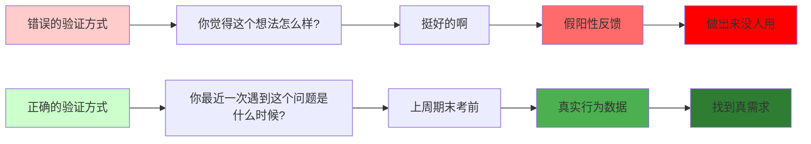
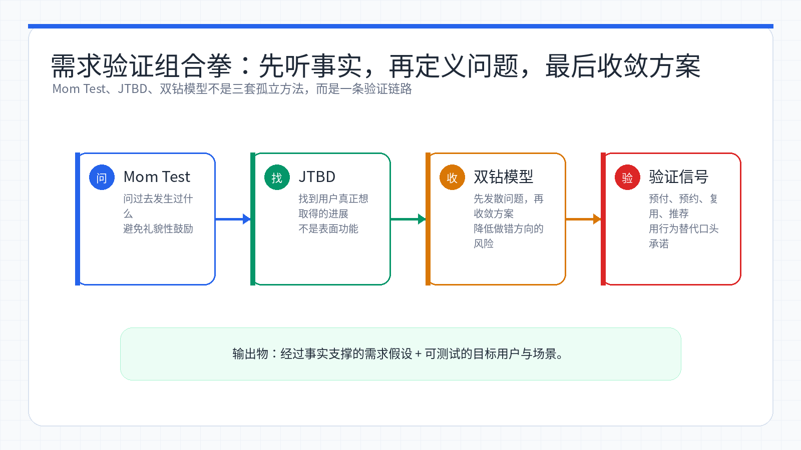

# Week 05：验证创意——Mom Test 与 JTBD

> 小林拿着自己的「AI 学习笔记助手」想法，兴冲冲地问了三个同学：「你们觉得这个点子怎么样?」三个人都说「挺好的啊」「听起来有用」。小林很开心，觉得需求验证通过了。直到她真的做出来，才发现没人用——原来那些「挺好的」只是礼貌，不是真实需求。这一章，她学会了怎么问对问题，怎么找到用户真正想完成的事。

<ChapterIntroduction duration="约 2.5 小时" output="一份经过验证的需求假设、一组能问出真实信息的访谈问题、一个清晰的问题定义" prerequisite="完成前三章，有一个想做的产品方向" :tags="['需求验证', 'Mom Test', 'JTBD', '双钻模型', '用户访谈']">

很多人做产品时最容易犯的错误，不是执行不够努力，而是方向选错了。你以为自己在「验证需求」，其实只是在收集礼貌性的鼓励；你以为自己在「做用户调研」，其实只是在寻找认可。

本章带你掌握三个关键方法：**The Mom Test**（如何通过访谈验证需求）、**Jobs to Be Done**（如何找到用户真正想完成的事）、**双钻模型**（如何先做对的事，再把事做对）。我们不只讲概念，而是把每个方法都落到小林的真实故事里，让你看到她怎么从「听到好听话就信」变成「会用事实判断方向」。

</ChapterIntroduction>

<StepBar :active="0" :items="[
  { title: '① Mom Test', description: '学会问出真实信息' },
  { title: '② JTBD', description: '找到用户真正的进展' },
  { title: '③ 双钻模型', description: '先做对的事，再把事做对' }
]" />

* * *

## 小林的故事：从「听起来不错」到「真实需求」

小林做完前几章的练习后，脑子里冒出了一个想法：「我能不能做一个 AI 学习笔记助手，帮大学生整理课堂笔记？」

她觉得这个方向很靠谱，因为：

-   自己上课时确实记笔记很累
-   AI 总结能力很强，技术上能做
-   身边同学应该都有这个需求

于是她去问了三个同学：

**小林：** 「我想做一个 AI 帮你整理课堂笔记的工具，你觉得怎么样？」

**同学 A：** 「挺好的啊，听起来很有用！」

**同学 B：** 「如果免费我应该会试试。」

**同学 C：** 「这个想法不错，你可以做做看。」

小林很开心，觉得需求验证通过了。她花了两周时间，用 Claude Code 做出了一个能上传录音、自动生成笔记的原型。

结果呢？

发给那三个同学，没人用。问为什么，得到的回答是：

-   「我其实不怎么录音」
-   「我更习惯自己手写」
-   「我课后基本不看笔记」

小林懵了：明明你们说「挺好的」，怎么不用？

这时候，她的学长告诉她：「你问错问题了。」

学长给她推荐了三个方法：**The Mom Test**、**Jobs to Be Done**、**双钻模型**。小林花了一个周末把这三个方法学完，然后重新去访谈了五个同学。

这次她问的是：

-   「你最近一次整理课堂笔记是什么时候？」
-   「当时你在做什么？哪一步最麻烦？」
-   「你现在用什么办法记笔记？」
-   「你为什么会选择这种方式？」

结果她发现：

-   大部分人根本不整理课堂笔记，只在考前临时抱佛脚
-   真正痛的不是「记笔记」，而是「考前不知道重点在哪」
-   他们现在的办法是：找学霸借笔记、看往年试卷、临时刷题

小林恍然大悟：用户真正想完成的事，不是「整理笔记」，而是「考前快速抓住重点」。

她把方向调整成：「AI 帮你从课件和笔记里提取考点」。这次，五个同学里有三个主动问她：「什么时候能用？」

这就是本章要教你的事：**如何通过正确的方法，找到用户真正的需求。**



0

① Mom Test

学会问出真实信息

0

② JTBD

找到用户真正的进展

0

③ 双钻模型

先做对的事，再把事做对

* * *

## 第一部分：The Mom Test——如何问出真实信息

### 什么是 The Mom Test？

小林第一次听到这个名字时，觉得很奇怪：「妈妈测试？这是什么？」

学长解释：「就算是你妈妈，也很难直接告诉你『这是个烂想法』。不是她不诚实，而是她不想伤害你，会下意识鼓励你。」

**The Mom Test 的核心思想：**

不是用户在故意骗你，而是你问问题的方式，天然会把对方引向好听但没用的回答。

小林的理解：The Mom Test 不是「别问妈妈」，而是「别把问题问成任何人都会顺着你回答的样子」。你要问的不是「你觉得我这个想法怎么样」，而是「你最近一次遇到这个问题是什么时候，当时你怎么处理的」。

### 为什么会得到假阳性反馈？

小林回想自己那次失败的访谈，终于明白问题出在哪了。

**她问的问题：**

-   你觉得我这个想法怎么样？
-   如果有这个工具你会用吗？
-   这个功能是不是很有价值？

**这些问题的共同特点：**

-   都在问「意见」，不是「事实」
-   都带着暗示，引导对方说好话
-   都在谈一个还没发生的未来

**人们为什么会给你好听但没用的回答：**

1.  **礼貌性回应** - 尤其是熟人，很难直接说「这个方向不行」
2.  **高估未来的自己** - 很多人真心相信自己未来会更自律、更愿意尝试新工具
3.  **被你的提问方式引导** - 当你问「这个功能是不是很有帮助」，你已经把「正确答案」塞进问题里了

🤖

AI 助手

在线

我想做一个 AI 帮大学生整理课堂笔记的工具，你觉得怎么样？如果有这个工具你会用吗？

👤

🤖

这个想法听起来不错！如果免费的话我应该会试试。

你最近一次整理课堂笔记是什么时候？当时你在做什么？

👤

🤖

呃...我想想，好像是上学期期末考前。我当时是把 PPT 和自己的手写笔记对着看，把重点标出来。

你为什么不平时就整理？

👤

🤖

平时太忙了，而且我也不确定哪些是重点。只有考前看了往年试卷，才知道该复习什么。

看到区别了吗？第一种问法得到的是礼貌性鼓励，第二种问法得到的是真实行为。

### The Mom Test 的三个核心原则

小林把学长教她的方法总结成了三条原则，贴在了笔记本第一页。

#### 原则 1：少谈你的点子，多谈用户过去的真实经历

**错误做法：**

```
你：我想做一个 AI 笔记工具，它能自动总结、分类、提取重点...
用户：听起来不错！（心里想：他好像很兴奋，我就鼓励一下吧）
```

**正确做法：**

```
你：你最近一次整理笔记是什么时候？
用户：上周期末考前。
你：当时你在做什么？
用户：我把 PPT 和手写笔记对着看，把可能考的地方标出来。
你：哪一步最麻烦？
用户：不知道哪些是重点，只能靠往年试卷猜。
```

小林的体会：一旦你讲太多自己的想法，对方就会切换到「配合你」的状态。相反，如果你把重点放在对方的经历上，对话会自然地回到现实，而不是停留在想象中的偏好。

#### 原则 2：少问抽象意见，多问具体事实

**容易问废的问题：**

-   你觉得这个功能重要吗？
-   这个工具对你有帮助吗？
-   你会不会用？

**更有价值的问题：**

-   你上次为了这件事花了多少时间？
-   你现在用什么办法解决？
-   你有没有为类似工具花过钱？

**访谈问题对比：**

```diff
@@ -1,6 +1,6 @@
- 你觉得 AI 自动提取考点这个功能重要吗？
+ 你上次考前复习时，最花时间的是哪一步？

- 如果有这个工具你会用吗？
+ 你现在用什么办法找考点？为什么选这种方式？

- 你愿意为这个功能付费吗？
+ 你有没有为考试复习买过资料或工具？花了多少钱？
```

#### 原则 3：少问用户想要什么方案，多看他现在怎么解决问题

用户很擅长描述自己的困扰，但不一定擅长设计解决方案。

**错误做法：**

```
你：你想不想要一个 AI 自动帮你做这个？
用户：想啊！（但他可能根本不会用）
```

**正确做法：**

```
你：你现在用什么方法处理这个问题？
用户：我会找学霸借笔记，或者看往年试卷。
你：为什么你会选择这种方式？
用户：因为学霸的笔记重点很清楚，往年试卷能看出老师的出题规律。
你：它哪里不够好？
用户：学霸不一定愿意借，往年试卷也不一定能找到。
```

看清现有替代方案，往往比直接问「你想要什么」更重要。

### 实战：小林的第二次访谈

小林学完 The Mom Test 后，重新约了五个同学做访谈。这次她完全改变了问法。

**访谈对象：** 大三学生，专业课比较多

**小林：** 你最近一次为考试复习是什么时候？

**同学：** 上周，数据结构期末考。

**小林：** 你当时是怎么复习的？

**同学：** 我先把老师的 PPT 过了一遍，然后看自己的笔记，最后刷了往年试卷。

**小林：** 哪一步最花时间？

**同学：** 看 PPT 和笔记。因为内容太多了，我不知道哪些是重点，只能全看一遍。

**小林：** 你有没有试过其他办法？

**同学：** 我问过学霸，他说他会把老师上课强调的地方标出来。但我上课经常走神，漏掉了很多。

**小林：** 如果有一个工具能帮你从 PPT 和笔记里提取可能的考点，你会用吗？

**同学：** 等等，你先别说工具。我想想...其实我最需要的是知道「老师上课强调了什么」。如果有工具能做到这个，我肯定用。

**小林：** 你上次为了考试复习，总共花了多少时间？

**同学：** 大概两天。如果能提前知道重点，我觉得一天就够了。

小林做完五次访谈后，整理出了这些关键信息：

访谈对象

最近一次复习

最花时间的环节

当前替代方案

已付出的成本

同学 A

上周期末考

不知道哪些是重点

全看一遍 PPT

2 天时间

同学 B

两周前

找不到老师强调的内容

问学霸借笔记

欠人情

同学 C

上个月

笔记太乱，看不懂

看往年试卷

1 天时间

同学 D

三周前

不确定自己理解对不对

临时刷题

买了题库 ¥50

同学 E

上周

来不及看完所有内容

只看重点章节

赌题，结果没押中

这次访谈和第一次完全不同：

-   **第一次：** 得到的是「听起来不错」「应该会用」
-   **第二次：** 得到的是真实行为、具体成本、明确痛点

小林终于明白了：**真正有价值的访谈，应该尽量回到用户最近一次真实经历，而不是停留在想象中的偏好。**

### 可以直接复制的访谈问题清单

小林把自己常用的问题整理成了一个清单，每次访谈前都会看一遍。

**开场问题：**

-   你最近一次遇到这个问题是什么时候？
-   当时具体发生了什么？

**行为问题：**

-   你当时是怎么处理的？
-   你为什么会选择这种方式？

**成本问题：**

-   这件事一般会花掉你多少时间或精力？
-   你有没有为了解决它花过钱？

**替代方案问题：**

-   你试过别的工具或办法吗？
-   为什么最后没有继续用？

**收尾问题：**

-   如果以后还遇到同样的问题，你觉得最理想的解决方式应该是什么样？

注意：收尾问题可以问，但最好放在后面。因为前面你更需要拿到事实，而不是愿望。小林第一次就是因为太早问「你想要什么」，结果得到的都是不靠谱的答案。

* * *

## 第二部分：Jobs to Be Done——找到用户真正想完成的事

### 什么是 JTBD？

小林做完第二次访谈后，发现了一个问题：虽然她问出了真实信息，但还是不知道该做什么。

学长告诉她：「你需要用 JTBD 的方法，找到用户真正想完成的事。」

**JTBD（Jobs to Be Done）的核心思想：**

用户不是在购买功能本身，而是在雇用某种解决方案，帮助自己完成一个进展。

小林的理解：用户不是想要「一个 AI 笔记工具」，而是想要「考前快速抓住重点，不要因为不知道考什么而浪费时间」。前者是功能，后者是 job。

### JTBD 和功能列表有什么不同？

小林一开始以为，只要把用户说的功能都做出来就行了。但学长告诉她：**功能只是 job 的一种临时翻译。**

**用户说的功能：**

-   我想要 AI 自动总结
-   我想要智能分类
-   我想要导出 PDF

**用户真正的 job：**

-   我想在考前快速知道哪些是重点，不要浪费时间看不考的内容
-   我想确认自己理解对了，不要因为理解错误而丢分
-   我想在有限时间内抓住最关键的知识点，提高复习效率

看到区别了吗？功能是表面表达，job 是背后的进展。

### JTBD 的五个要素

小林把 JTBD 拆成了五个要素，每次分析需求时都会填一遍。

#### 1\. 场景

用户是在什么时刻、什么环境里想起这个产品的？

**小林的例子：**

-   期末考前一周
-   手里有一堆 PPT 和笔记
-   不知道从哪开始复习

**没有场景的需求，通常都还不够真实。**

#### 2\. 触发

是什么让他决定立刻找解决方案？

**小林的例子：**

-   看到考试时间表，发现只剩一周
-   打开 PPT，发现有 300 多页
-   意识到如果全看一遍，时间根本不够

触发点往往带着情绪。这个情绪很重要，因为它决定了用户为什么会在这一刻产生行动。

#### 3\. 想完成的进展

他不只是想「做个动作」，而是想把自己推进到什么新状态？

**小林的例子：**

-   从「不知道考什么」到「清楚重点在哪」
-   从「焦虑」到「有把握」
-   从「盲目复习」到「高效复习」

这一步里，「进展」这个词非常关键。因为很多人真正买的不是工具，而是**状态变化**。

#### 4\. 当前替代方案

现在没有你的产品时，他怎么做？

**小林的例子：**

-   全看一遍 PPT（太慢）
-   找学霸借笔记（不一定借得到）
-   看往年试卷（不一定找得到）
-   临时刷题（可能押不中）

谁是替代方案，谁就是你的真实竞争环境。

#### 5\. 成功标准

事情怎样才算真的被解决？

**小林的例子：**

-   能在 2 小时内知道哪些是重点
-   不需要看完所有内容就能开始复习
-   复习时不会担心「我是不是漏了重要内容」

如果你连「用户怎么判断值不值」都说不清，那这个方向大概率还没有收敛好。

### 一句话 JTBD 公式

小林把 JTBD 压缩成了一个可以直接套用的句式：

> 当 \_\_\_\_\_\_\_\_\_\_ 的时候，我想要 \_\_\_\_\_\_\_\_\_\_，以便于 \_\_\_\_\_\_\_\_\_\_。
> 现在我只能通过 \_\_\_\_\_\_\_\_\_\_ 来勉强完成这件事。

**小林的例子：**

> 当我期末考前一周拿到一堆 PPT 和笔记时，我想要快速知道哪些是重点，以便于我能在有限时间内高效复习。
> 现在我只能通过全看一遍、找学霸借笔记或看往年试卷来勉强完成这件事。

**需求表达对比：**

```diff
@@ -1,1 +1,4 @@
- 我想做一个 AI 笔记工具，帮大学生整理课堂笔记。
+ 当大学生期末考前一周拿到一堆 PPT 和笔记时，
+ 他们想要快速知道哪些是重点，
+ 以便于在有限时间内高效复习。
+ 现在他们只能通过全看一遍、找学霸借笔记或看往年试卷来勉强完成。
```

看到区别了吗？第一种表达只是功能描述，第二种表达是真正的需求。

### JTBD 的三层结构

学长还告诉小林，一个 job 其实有三层：

#### 功能层：最表面的任务是什么？

-   总结笔记
-   提取重点
-   生成考点

这是用户嘴上最容易说出来的一层。

#### 情绪层：用户希望减少什么不舒服，或者获得什么感受？

-   不想那么焦虑
-   不想因为不知道考什么而慌
-   想更有把握地复习

很多付费意愿，实际上和情绪层关系很大。

#### 社会层：用户希望在别人眼里变成什么样？

-   在同学面前显得更有条理
-   在考试中不要因为复习不到位而丢脸
-   证明自己是个会学习的人

如果你只做功能层，产品很容易被替代；如果你同时理解了情绪层和社会层，你就更容易找到真正有黏性的价值。

小林的体会：她一开始只看到了功能层（整理笔记），后来才发现用户真正在意的是情绪层（不想焦虑）和社会层（不想在考试中丢脸）。这也是为什么她第一版做出来没人用——因为她只解决了表面问题，没有解决深层需求。

### 实战：小林用 JTBD 重新定义需求

小林把五次访谈的信息整理成了一个 JTBD 句子：

**原来的想法：**

> 我想做一个 AI 笔记工具，帮大学生整理课堂笔记。

**用 JTBD 重新定义：**

> 当大学生期末考前一周面对大量 PPT 和笔记时，他们想要快速知道哪些是老师强调的重点，以便于在有限时间内高效复习，不要因为不知道考什么而浪费时间。
> 现在他们只能通过全看一遍、找学霸借笔记或看往年试卷来勉强完成这件事。

**五个要素：**

-   **场景：** 期末考前一周，手里有大量 PPT 和笔记
-   **触发：** 发现时间不够，不知道从哪开始复习
-   **进展：** 从「不知道考什么」到「清楚重点在哪」
-   **替代方案：** 全看一遍、找学霸借笔记、看往年试卷
-   **成功标准：** 2 小时内知道重点，不用看完所有内容就能开始复习

有了这个 JTBD，小林的产品方向一下子清楚了：

-   **不是** 做一个通用的笔记整理工具
-   **而是** 做一个考前快速提取重点的工具
-   **第一版** 只需要做：上传 PPT 和笔记，AI 提取可能的考点

* * *

## 第三部分：双钻模型——先做对的事，再把事做对

### 什么是双钻模型？

小林现在知道怎么问对问题、怎么找到真正的 job 了。但她还有一个困惑：「我现在应该马上开始做原型吗？」

学长告诉她：「先别急。你需要用双钻模型，确保自己在做对的事。」

**双钻模型（Double Diamond）的核心思想：**

「做对的事情」和「把事情做对」，是两个完全不同的阶段。如果你还没搞清楚问题，就急着冲去做原型，通常只会把错误方向做得更完整。

小林的理解：双钻模型就像两个钻石，第一个钻石是「搞清楚要解决什么问题」，第二个钻石是「决定用什么方案去解决它」。很多人失败不是因为执行不认真，而是因为选错了问题。

### 双钻模型的四个阶段

双钻模型把一个完整的设计与创新过程，画成两个连续的钻石形状。

**第一个钻石：做对的事情**

1.  **Discover（发现）** - 广泛了解用户、问题、环境和市场
2.  **Define（定义）** - 从大量信息里提炼出真正值得解决的核心问题

**第二个钻石：把事情做对** 3. **Develop（开发）** - 围绕核心问题发散多种解决方案 4. **Deliver（交付）** - 筛选、原型、测试并交付更合适的方案

0

Discover

理解问题

0

Define

定义问题

0

Develop

探索方案

0

Deliver

验证方案

### 第一个钻石：做对的事情

#### Discover（发现）：先把问题空间打开

小林在这个阶段做的事情：

-   访谈了 5 个同学，了解他们最近一次复习的经历
-   观察他们现在怎么凑合解决（全看一遍、找学霸借笔记、看往年试卷）
-   收集了他们的痛点、成本、替代方案

**Discover 阶段的核心任务：广泛调研，而不是快速下结论。**

小林踩过的坑：她第一次做产品时，只问了 3 个同学，而且都是熟人。结果得到的都是礼貌性鼓励。这次她学乖了，找了不同专业、不同年级的同学，还特意找了几个不太熟的人，避免对方因为关系好而不好意思说真话。

#### Define（定义）：从一堆信息里提炼出核心问题

小林在这个阶段做的事情：

-   把 5 次访谈的信息整理成表格
-   找出反复出现的痛点：「不知道哪些是重点」
-   用 JTBD 公式写出一句清晰的问题定义

**Define 阶段的核心任务：从「问题很多」收敛到「这次先解决哪一个问题」。**

**小林的问题定义：**

> 大学生期末考前一周面对大量 PPT 和笔记时，不知道哪些是老师强调的重点，导致要么全看一遍浪费时间，要么盲目复习押不中题。

这时候问题就开始变清楚了：

-   用户是谁：大学生
-   场景是什么：期末考前一周
-   卡点是什么：不知道哪些是重点
-   成功标准是什么：快速知道重点，不用看完所有内容

### 第二个钻石：把事情做对

#### Develop（开发）：围绕核心问题发散方案

小林在这个阶段做的事情：

-   脑暴了 5 种可能的方案
-   和学长一起讨论每种方案的优缺点
-   选出最适合第一版的方案

**Develop 阶段的核心任务：围绕同一个问题，探索多种可能方案。**

**小林脑暴的方案：**

方案

优点

缺点

适合第一版吗？

AI 自动总结全部内容

覆盖全面

用户还是要看很多内容

❌

AI 提取老师强调的关键词

快速定位重点

需要录音，很多人不录

❌

AI 对比 PPT 和往年试卷

准确度高

往年试卷不一定有

❌

AI 提取 PPT 中的重点标记

简单直接

不是所有老师都标重点

⚠️

AI 分析 PPT 结构和内容密度

不依赖录音和试卷

准确度可能不够高

✅

小林最后选择了方案 5，因为：

-   不需要录音（很多人不录音）
-   不需要往年试卷（不一定找得到）
-   只需要 PPT（每个人都有）
-   可以快速验证（做一个简单原型就能测试）

#### Deliver（交付）：选择方案、做原型、测试和交付

小林在这个阶段做的事情：

-   用 Claude Code 做了一个最小原型
-   找 3 个同学测试
-   根据反馈调整

**Deliver 阶段的核心任务：把一个方案变成可测试、可验证、可迭代的东西。**

**小林的最小原型：**

```
输入：上传一个 PPT
输出：
1. 提取每一页的标题和关键词
2. 标注哪些页面内容密度高（可能是重点）
3. 标注哪些页面有「重要」「考试」「注意」等关键词
```

**测试结果：**

-   同学 A：「这个比我自己看快多了！」
-   同学 B：「有些重点确实被标出来了，但也有些不准。」
-   同学 C：「能不能再加上笔记？我的笔记里有老师口头强调的内容。」

小林根据反馈，决定：

-   第一版先只做 PPT 提取，把准确度做高
-   第二版再加上笔记分析
-   第三版再考虑录音和试卷对比

小林的体会：双钻模型最大的价值，是它强迫你把「理解问题」和「设计方案」拆开。如果她一开始就冲去做原型，很可能会做出一个「功能很全但没人用」的东西。现在她先搞清楚了问题，再选方案，方向就清楚多了。

### 双钻模型最常见的误区

小林总结了自己和身边同学最容易踩的坑：

#### 误区 1：还没 Discover，就直接 Deliver

很多人刚有想法就开画原型、写代码、接模型。问题不是你做得不认真，而是你可能根本还没确认问题值不值得解决。

#### 误区 2：Discover 很久，但始终不 Define

另一种极端是一直调研、一直看资料、一直访谈，却迟迟不敢收敛。双钻不是让你无限发散，而是提醒你：发散之后必须进入判断和取舍。

#### 误区 3：Define 之后，又偷偷改问题

很多人会在 Develop 时因为某个方案更容易做，就反过来修改问题定义，让它适配现有方案。这很危险，因为你可能不是在解决问题，而是在为自己偏爱的方案找理由。

#### 误区 4：把 Deliver 误解成「大而全上线」

Deliver 不是说必须把完整产品都做完才算结束。很多时候，一个可以测试的原型、一轮真实用户试用，已经是很好的 deliver。

* * *

## 三个方法如何配合使用

小林学完这三个方法后，发现它们可以完美地串起来：



*先用 Mom Test 拿到事实，再用 JTBD 定义真正的进展，最后用双钻模型收敛成可验证方案。*

**The Mom Test** → 帮你问出真实信息
**JTBD** → 帮你找到用户真正想完成的事
**双钻模型** → 帮你先做对的事，再把事做对

### 完整流程示例

小林把自己的完整流程整理成了一个可复制的模板：

#### 第一步：用 The Mom Test 做访谈（Discover）

**访谈 5-10 个潜在用户，问这些问题：**

-   你最近一次遇到这个问题是什么时候？
-   当时你在做什么？哪一步最麻烦？
-   你现在用什么办法解决？
-   你为什么会选择这种方式？
-   你有没有为了解决它花过钱或时间？

**整理访谈结果：**

-   真实行为（不是意见）
-   当前替代方案
-   已付出的成本
-   反复出现的痛点

#### 第二步：用 JTBD 定义需求（Define）

**用 JTBD 公式写出一句清晰的需求：**

> 当 \_\_\_\_\_\_\_\_\_\_ 的时候，我想要 \_\_\_\_\_\_\_\_\_\_，以便于 \_\_\_\_\_\_\_\_\_\_。
> 现在我只能通过 \_\_\_\_\_\_\_\_\_\_ 来勉强完成这件事。

**补齐五个要素：**

-   场景
-   触发
-   想完成的进展
-   当前替代方案
-   成功标准

#### 第三步：用双钻模型设计方案（Develop + Deliver）

**Develop：脑暴 3-5 种方案**

-   列出每种方案的优缺点
-   选出最适合第一版的方案

**Deliver：做最小原型**

-   只做核心功能
-   找 3-5 个用户测试
-   根据反馈迭代

**小林的完整流程：**

```diff
@@ -1,5 +1,11 @@
- 第一版（失败）：
- 1. 有个想法：AI 笔记工具
- 2. 问 3 个同学：你们觉得怎么样？
- 3. 得到回答：挺好的！
- 4. 马上开始做原型
- 5. 做出来没人用
+ 第二版（成功）：
+ 1. 用 The Mom Test 访谈 5 个同学
+ 2. 用 JTBD 定义需求：考前快速提取重点
+ 3. 用双钻模型：
+    - Discover：了解真实痛点
+    - Define：收敛到核心问题
+    - Develop：脑暴 5 种方案
+    - Deliver：做最小原型测试
+ 4. 3 个同学主动问：什么时候能用？
```

* * *

## 用 Claude Code 辅助需求验证

小林发现，Claude Code 可以在需求验证的每个环节帮上忙。

### 场景 1：改写访谈问题

小林一开始不知道怎么问对问题，她让 Claude Code 帮她改写。

🤖

AI 助手

在线

我准备做用户访谈，想问这些问题：1. 你觉得我做一个 AI 考点提取工具怎么样？2. 你会不会用？3. 你愿不愿意付费？请用 The Mom Test 的原则帮我改写成更好的问法。

👤

🤖

我来帮你改写成更能问出真实信息的问题：改写后的问题：1. 你最近一次期末考复习是什么时候？当时你是怎么准备的？2. 复习过程中，哪一步最花时间？3. 你现在用什么办法找考点？为什么选这种方式？4. 你有没有为考试复习买过资料或工具？花了多少钱？5. 如果下次考试前时间很紧，你最希望解决什么问题？改写原则：从抽象意见改为具体行为，从假设场景改为真实经历，从是否付费改为已付出成本。

\- 删掉了意见型问题（「你觉得怎么样」） - 删掉了假设未来的问题（「你会不会用」） - 改成了围绕过去真实行为的提问 - 加入了成本相关的问题（时间、金钱）

### 场景 2：整理访谈记录

小林做完 5 次访谈后，有一堆零散的笔记。她让 Claude Code 帮她整理。

🤖

AI 助手

在线

这是我和 5 个用户的访谈记录，请按 The Mom Test 的角度整理反复出现的痛点、当前替代方案和已付出的成本。

👤

🤖

反复出现的痛点：不知道哪些是重点、时间不够、现有方案不稳定。当前替代方案：全看一遍、借学霸笔记、看往年试卷、刷题、赌题。已付出成本包括时间、金钱、社交成本和机会成本。建议优先解决：如何在时间有限的情况下快速找到考试重点。

**原始访谈记录：**

【同学 A】上周期末考，复习了两天，主要是看 PPT，但不知道哪些是重点，最后全看了一遍，很累。

【同学 B】两周前考试，找学霸借了笔记，学霸的笔记很清楚，但不好意思总麻烦别人，自己的笔记太乱。

【同学 C】上个月考试，看了往年试卷，能看出老师的出题规律，但不是每门课都能找到。

【同学 D】三周前考试，买了题库刷题，花了 50 块，但押题不准。

【同学 E】上周考试，只看了重点章节，赌题，结果没押中。

### 场景 3：生成 JTBD 假设

🤖

AI 助手

在线

根据上面的访谈结果，请用 JTBD 公式帮我写出一句清晰的需求假设。

👤

🤖

JTBD 假设：当大学生期末考前一周面对大量 PPT 和笔记时，他们想要快速知道哪些是老师强调的重点，以便于在有限时间内高效复习，不要因为不知道考什么而浪费时间或押错题。现在他们只能通过全看一遍（太慢）、找学霸借笔记（不稳定）、看往年试卷（不一定有）或赌题（风险高）来勉强完成这件事。五个要素：场景-期末考前一周手里有大量 PPT 和笔记，触发-发现时间不够不知道从哪开始复习，进展-从不知道考什么到清楚重点在哪，替代方案-全看一遍借笔记看试卷刷题赌题，成功标准-2 小时内知道重点不用看完所有内容就能开始复习。

### 场景 4：脑暴解决方案

小林定义完需求后，让 Claude Code 帮她脑暴方案。

🤖

AI 助手

在线

我现在的问题定义是：大学生期末考前一周面对大量 PPT 和笔记时，不知道哪些是老师强调的重点。请帮我想 5 种不同的解决方案。

👤

🤖

我建议优先做 AI 分析 PPT 结构和内容密度。它不依赖录音和往年试卷，只需要 PPT，最适合第一版快速验证。

**AI 返回的方案摘要：**

**方案 1：AI 自动总结全部内容**

-   优点：覆盖全面，不会漏掉重点
-   缺点：用户还是要看很多内容，没有真正解决「时间不够」的问题
-   适合第一版：❌

**方案 2：AI 提取老师强调的关键词**

-   优点：快速定位重点，准确度高
-   缺点：需要录音，很多人不录音
-   适合第一版：❌

**方案 3：AI 对比 PPT 和往年试卷**

-   优点：能看出老师的出题规律，准确度高
-   缺点：往年试卷不一定有
-   适合第一版：❌

**方案 4：AI 提取 PPT 中的重点标记**

-   优点：简单直接，不需要额外输入
-   缺点：不是所有老师都标重点
-   适合第一版：⚠️ 可以作为备选

**方案 5：AI 分析 PPT 结构和内容密度**

-   优点：不依赖录音和试卷，只需要 PPT
-   缺点：准确度可能不够高
-   适合第一版：✅ 推荐

**推荐理由：** 方案 5 最适合第一版，因为：

1.  不需要录音（很多人不录音）
2.  不需要往年试卷（不一定找得到）
3.  只需要 PPT（每个人都有）
4.  可以快速验证（做一个简单原型就能测试）

小林的体会：Claude Code 不能替代真实访谈，但它可以帮你：

1.  改写访谈问题，避免问出「容易问废」的问题
2.  整理访谈记录，把零散信息变成结构化笔记
3.  生成 JTBD 假设，把模糊想法变成清晰需求
4.  脑暴解决方案，避免只盯着第一个想到的方案

关键是：让 AI 帮你整理和扩展，而不是替你臆测用户。

* * *

## 实战演练：从零到验证完成的完整流程

小林把自己的完整流程整理成了一个可复制的模板，方便以后做新项目时参考。

### 第 1 天：准备访谈（Discover 准备）

**上午：明确访谈目标**

小林先问自己三个问题：

1.  我想验证的核心假设是什么？
2.  我需要从用户那里了解什么信息？
3.  什么样的信息能帮我判断方向？

**她的答案：**

1.  核心假设：大学生考前需要快速找到重点
2.  需要了解：他们最近一次复习的真实经历、当前怎么解决、最痛的环节
3.  能帮判断的信息：真实行为、已付出的成本、替代方案的优缺点

**下午：准备访谈问题**

小林用 Claude Code 帮她改写了访谈问题，最后确定了这 8 个问题：

1.  你最近一次期末考复习是什么时候？
2.  当时你是怎么准备的？（让用户描述完整流程）
3.  复习过程中，哪一步最花时间？
4.  你为什么会选择这种方式？
5.  你有没有试过其他办法？为什么没继续用？
6.  你有没有为考试复习买过资料或工具？花了多少钱？
7.  如果下次考试前时间很紧，你最担心什么？
8.  你觉得最理想的复习方式应该是什么样？（放在最后问）

### 第 2-3 天：执行访谈（Discover 执行）

**访谈技巧：**

小林总结了几个让访谈更顺利的技巧：

1.  **开场要轻松：** 「我最近在研究大家怎么复习考试，想了解真实情况，不是来卖东西的。」
2.  **多追问细节：** 当用户说「我会看 PPT」，追问「你具体是怎么看的？从头到尾看还是只看重点？」
3.  **记录原话：** 用户的原话比你的总结更有价值，尤其是带情绪的表达
4.  **不要急着介绍方案：** 等用户说完真实经历，再问「如果有工具能帮你...」

**访谈记录模板：**

小林用这个模板记录每次访谈：

```markdown
## 访谈对象：同学 A
- 年级：大三
- 专业：计算机
- 访谈时间：2025-05-25

### 最近一次复习经历
- 时间：上周期末考
- 科目：数据结构
- 准备时间：2 天

### 复习流程
1. 先看 PPT（花了 1 天）
2. 再看自己的笔记（花了半天）
3. 最后刷往年试卷（花了半天）

### 痛点
- 不知道哪些是重点，只能全看一遍
- PPT 有 300 多页，看完很累
- 担心漏掉重要内容

### 当前替代方案
- 全看一遍 PPT（最稳定，但最慢）
- 问学霸借笔记（最准确，但不好意思总麻烦别人）

### 已付出成本
- 时间：2 天
- 情绪：很焦虑，担心考不好

### 原话摘录
- 「我最怕的就是不知道考什么，只能全看一遍，太累了。」
- 「如果能提前知道重点，我觉得一天就够了。」
```

### 第 4 天：整理访谈结果（Define 准备）

**上午：汇总信息**

小林把 5 次访谈的信息汇总成一张表：

维度

同学 A

同学 B

同学 C

同学 D

同学 E

最近一次复习

上周

两周前

上个月

三周前

上周

最花时间的环节

看 PPT

整理笔记

找试卷

刷题

看书

核心痛点

不知道重点

笔记太乱

试卷找不到

押题不准

时间不够

当前方案

全看一遍

借学霸笔记

看往年试卷

买题库

赌题

时间成本

2 天

1.5 天

1 天

1 天

0.5 天

金钱成本

0

0

0

¥50

0

**下午：提炼核心问题**

小林用 Claude Code 帮她分析，最后提炼出：

**反复出现的痛点（按频率排序）：**

1.  不知道哪些是重点（5 人中 4 人提到）⭐⭐⭐⭐
2.  时间不够，看不完所有内容（3 人提到）⭐⭐⭐
3.  现有方案不稳定（2 人提到）⭐⭐

**最值得优先解决的问题：** 「如何在时间有限的情况下，快速找到考试重点」

### 第 5 天：定义需求（Define 执行）

小林用 JTBD 公式写出了最终的需求定义：

> 当大学生期末考前一周面对大量 PPT 和笔记时，他们想要快速知道哪些是老师强调的重点，以便于在有限时间内高效复习，不要因为不知道考什么而浪费时间或押错题。
>
> 现在他们只能通过全看一遍（太慢）、找学霸借笔记（不稳定）、看往年试卷（不一定有）或赌题（风险高）来勉强完成这件事。

**五个要素：**

-   **场景：** 期末考前一周，手里有大量 PPT 和笔记
-   **触发：** 发现时间不够，不知道从哪开始复习
-   **进展：** 从「不知道考什么」到「清楚重点在哪」
-   **替代方案：** 全看一遍、借笔记、看试卷、刷题、赌题
-   **成功标准：** 2 小时内知道重点，不用看完所有内容就能开始复习

### 第 6 天：脑暴方案（Develop）

小林用 Claude Code 帮她脑暴了 5 种方案，最后选择了「AI 分析 PPT 结构和内容密度」作为第一版方案。

**选择理由：**

-   ✅ 不需要录音（很多人不录音）
-   ✅ 不需要往年试卷（不一定找得到）
-   ✅ 只需要 PPT（每个人都有）
-   ✅ 可以快速验证（做一个简单原型就能测试）

### 第 7 天：做原型（Deliver 准备）

小林用 Claude Code 做了一个最小原型：

**功能：**

1.  上传 PPT
2.  AI 提取每一页的标题和关键词
3.  标注哪些页面内容密度高（可能是重点）
4.  标注哪些页面有「重要」「考试」「注意」等关键词

**技术栈：**

-   前端：HTML + Tailwind CSS
-   后端：Claude API
-   部署：Vercel

### 第 8-9 天：用户测试（Deliver 执行）

小林找了 3 个同学测试原型，收集反馈：

**测试结果：**

-   ✅ 同学 A：「这个比我自己看快多了！」
-   ⚠️ 同学 B：「有些重点确实被标出来了，但也有些不准。」
-   💡 同学 C：「能不能再加上笔记？我的笔记里有老师口头强调的内容。」

**下一步计划：**

1.  第一版先只做 PPT 提取，把准确度做高
2.  第二版再加上笔记分析
3.  第三版再考虑录音和试卷对比

小林的收获：从有想法到验证完成，她只用了 9 天。关键不是速度快，而是方向对。如果她一开始就冲去做「AI 笔记工具」，可能做一个月也没人用。现在她先搞清楚了问题，再选方案，方向就清楚多了。

* * *

## 本周回顾

小林这一章从「听到好听话就信」走到了「会用事实判断方向」。下面对照检查你掌握得怎么样。

Week 05 学习进度

1

理解 The Mom Test

能说清为什么会得到假阳性反馈，以及如何问出真实信息

2

掌握三个核心原则

少谈点子多谈经历、少问意见多问事实、少问方案多看替代

3

理解 JTBD

能说清用户不是在买功能，而是在雇用解决方案完成进展

4

会用 JTBD 公式

能用一句话写出清晰的需求假设，补齐五个要素

5

理解双钻模型

能说清「做对的事」和「把事做对」的区别

6

会用四个阶段

能按 Discover → Define → Develop → Deliver 的顺序推进

**自测问题：**

1.  **The Mom Test：** 为什么问「你觉得我这个想法怎么样」会得到假阳性反馈？应该怎么问才能得到真实信息？
2.  **JTBD：** 用户说「我想要 AI 自动总结」和「我想在考前快速知道重点」有什么区别？哪个更接近真实需求？
3.  **双钻模型：** Discover 和 Develop 有什么区别？为什么不能跳过 Define 直接从 Discover 到 Develop？

**本周作业：**

1.  选一个你想做的产品方向，用 The Mom Test 访谈 3-5 个潜在用户
2.  整理访谈记录，找出反复出现的痛点、当前替代方案、已付出的成本
3.  用 JTBD 公式写出一句清晰的需求假设，补齐五个要素
4.  用双钻模型走一遍：Discover → Define → Develop → Deliver

* * *

## 下周预告

小林现在知道怎么验证需求了，但她还有一个问题：「我怎么把需求变成可以开始做的原型？」下一章，我们进入原型设计——如何用最小成本验证想法，如何用 Claude Code 快速搭建可交互的原型，如何通过用户测试迭代方向。
