# Week 07：接入 AI 能力——调用 API 与密钥安全

> 小林做完前几周的原型后，兴奋地给朋友演示。朋友点了「生成文案」按钮，页面显示「AI 正在思考中...」，然后——什么都没发生。小林尴尬地解释：「哦，这个按钮还没接真的 AI，只是个样子。」朋友笑了：「那不就是个假按钮吗？」那一刻小林意识到，原型再漂亮，不能真正工作就只是个空壳。这周她要让原型「活」起来。

🎯学习目标

API 调用密钥管理文本生成图像 AI安全实践

前几周我们做出了能点击、能交互的原型，但它还不能真正「工作」——按钮点了没反应，数据都是写死的。这周我们要跨过关键的一步：接入真实的 AI 能力。

你会学到什么是 API、如何安全地管理密钥、怎么让 Claude Code 帮你把 AI 服务接进原型里。我们会接入三种 AI 能力：文本生成（DeepSeek）、图像理解（Qwen3 VL）、图像生成（Seedream）。学完这周，你的原型就不再是演示品，而是真正能解决问题的应用。

⏱️

预计时长

约 3-4 小时

📦

核心产出

一个能真正调用 AI 服务的原型，包含文本生成、图像理解、图像生成功能

📋

前置条件

完成前几周的原型开发

0

① 理解 API

API 是什么、为什么需要它

0

② 接入文本 AI

DeepSeek 文本生成实战

0

③ 接入图像 AI

图像理解与生成

* * *

## 小林的故事：从假按钮到真功能

小林做完原型后特别有成就感，她把链接发给了做电商的表姐。表姐点开一看：「哇，界面挺专业的！」然后点了「生成商品文案」按钮。

页面转了几秒，显示：「暂无数据」。

表姐疑惑：「这个 AI 生成是真的吗？」

小林支支吾吾：「呃...现在还是演示版本，按钮是真的，但还没接上真的 AI...」

表姐笑了：「那不就是个假按钮？我还以为真能用呢。」

挂掉视频后，小林盯着自己的原型发呆。界面是漂亮的，交互是流畅的，但就是不能真正工作。她想起第一周老师说的话：「我们要做的是有人愿意买单的产品，不是看起来像样的原型。」

那天晚上，小林决定：这周一定要让原型「活」起来。

* * *

## 什么是 API？为什么需要它？

小林第一次听到「API」这个词时，脑子里全是问号。后来她发现，API 其实没那么神秘。

💡 小林的理解方式

想象你去餐厅吃饭：

-   **你**：顾客（你的原型）
-   **厨房**：AI 服务（DeepSeek、Qwen 等）
-   **服务员**：API（应用程序编程接口）

你不能直接冲进厨房喊「给我做个菜」，你得通过服务员。你告诉服务员「我要一份宫保鸡丁」（发送请求），服务员把单子递给厨房，厨房做好后，服务员把菜端给你（返回结果）。

API 就是这个「服务员」——它规定了你怎么点菜（请求格式）、厨房怎么回应（响应格式）。

### API 的核心要素

小林把 API 调用拆解成了几个关键部分：

**1\. API Key（通行证）**

-   就像你的会员卡号，证明「这是我在调用，请把账单记在我头上」
-   别人拿到你的 Key，就能冒充你调用并产生费用
-   **绝对不能泄露！**

**2\. Endpoint（接口地址）**

-   告诉服务器你要访问哪个功能
-   完整地址 = 基础 URL + 具体路径
-   例如：`https://api.deepseek.com` + `/v1/chat/completions`

**3\. 请求内容（Request）**

-   你要 AI 做什么
-   比如：「帮我写一段电商文案」「分析这张图片」

**4\. 响应结果（Response）**

-   AI 返回的内容
-   成功：返回生成的文字、图片等
-   失败：告诉你哪里错了（密钥错误、余额不足等）

### API 调用的完整流程

🤖

AI 助手

在线

我想知道 API 调用的完整过程是怎样的？

👤

🤖

让我用一个具体例子说明：用户点击「生成文案」按钮后，前端发起请求，请求发送到 AI 服务器，服务器验证密钥、检查余额、调用模型生成内容，然后返回结果，最后前端展示给用户。

🔐 API 密钥安全警告

**API Key 就是你的钱包钥匙！**

小林第一次拿到 API Key 时，差点把它直接写在代码里提交到 GitHub。幸好 Claude Code 提醒了她。

**绝对不能做的事：**

-   ❌ 把 Key 发到群聊、论坛
-   ❌ 截图时不打码
-   ❌ 硬编码到代码里并提交 Git
-   ❌ 分享给不信任的人

**正确做法：**

-   ✅ 使用环境变量存储
-   ✅ 添加到 `.gitignore`
-   ✅ 定期更换密钥
-   ✅ 如怀疑泄露，立即重置

**本周练习说明：** 我们会直接把 API Key 粘贴到 Claude Code 对话中让它帮我们集成。这只是为了学习方便！真实项目中绝不能这样做，要用配置文件 + 环境变量的方式。

0

① 理解 API

API 是什么、为什么需要它

0

② 接入文本 AI

DeepSeek 文本生成实战

0

③ 接入图像 AI

图像理解与生成

* * *

## 接入文本生成：DeepSeek 实战

小林决定从最常用的文本生成开始。她的原型里有个「生成商品文案」功能，现在要让它真正工作起来。

### 为什么选择 DeepSeek？

🤖 认识 DeepSeek

**DeepSeek** 是杭州深度求索人工智能公司开发的大语言模型，2025 年 1 月推出后迅速成为热门选择。

**为什么小林选它？**

-   **性价比高**：价格比 GPT-4 便宜很多
-   **中文友好**：对中文理解很好，适合国内场景
-   **开源模型**：技术透明，社区活跃
-   **性能强劲**：在多项基准测试中接近 GPT-4 水平

**GPQA 基准测试排名**（研究生级科学问答）：

-   GPT-4：第一梯队
-   Claude：第一梯队
-   DeepSeek：紧随其后，性价比最高
-   Gemini：第一梯队

对于小林这种刚起步的项目，DeepSeek 是完美的选择——便宜、好用、够强。

### 三步接入法

小林发现，接入任何 AI 服务都遵循同样的三步：

**第 1 步：获取 API Key****第 2 步：找到官方调用示例****第 3 步：让 Claude Code 帮你集成**

听起来简单，但每一步都有细节。让我们跟着小林走一遍完整流程。

### 第 1 步：获取 DeepSeek API Key

**1\. 注册账号**

访问 [DeepSeek 开放平台](https://platform.deepseek.com/)，注册账号并登录。

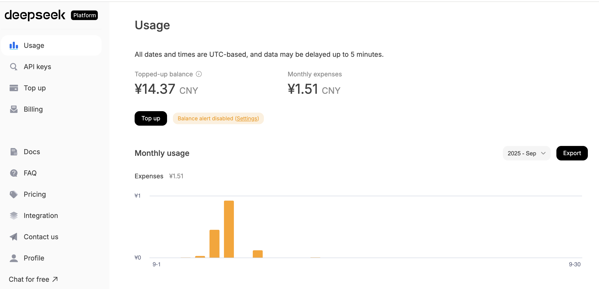

**2\. 充值少量费用**

进入「使用管理」页面，充值 10-20 元用于测试。DeepSeek 很便宜，这点钱够你测试很久了。


**3\. 创建 API Key**

-   点击左侧菜单「API Keys」
-   点击「Create new API key」
-   给 Key 起个名字（比如「学习测试」）
-   复制生成的 Key（格式类似：`sk-8573341c39fc44315aadc071c53rh7d2`）


**⚠️ 重要：** 这个 Key 只会显示一次！立即复制保存到安全的地方（比如密码管理器）。

💰 费用说明

小林第一次充值时很担心会不会很贵。实际测试后她发现：

-   生成一段 200 字的文案：约 0.002 元（不到 1 分钱）
-   充值 10 元可以生成几千条文案
-   可以随时在平台查看消费记录

对于学习和小项目来说，成本几乎可以忽略不计。

### 第 2 步：找到官方调用示例

访问 [DeepSeek API 文档](https://api-docs.deepseek.com/)，找到「Chat Completions」部分。

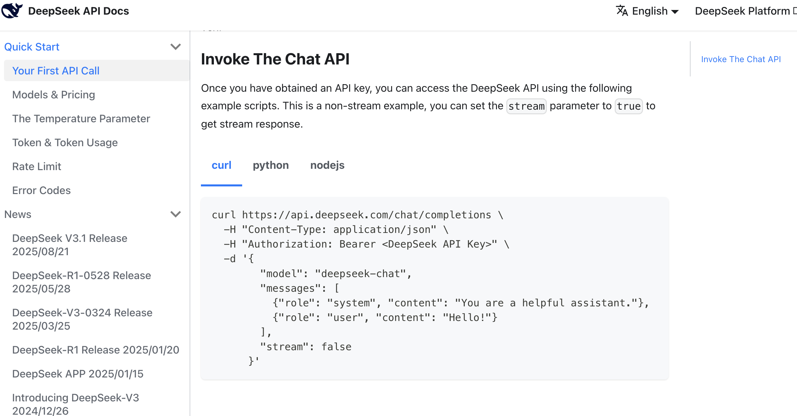

官方文档会提供多种语言的示例，比如 curl、Python、JavaScript。我们只需要复制其中一个即可。

**curl 示例：**

```bash
curl https://api.deepseek.com/v1/chat/completions \
  -H "Content-Type: application/json" \
  -H "Authorization: Bearer ${DEEPSEEK_API_KEY}" \
  -d '{
        "model": "deepseek-chat",
        "messages": [
          {"role": "system", "content": "You are a helpful assistant."},
          {"role": "user", "content": "Hello!"}
        ],
        "stream": false
      }'
```

**关键信息：**

-   **接口地址**：`https://api.deepseek.com/v1/chat/completions`
-   **模型名称**：`deepseek-chat`
-   **请求格式**：JSON，包含 `model` 和 `messages` 字段

### 第 3 步：让 Claude Code 帮你集成

这是最神奇的一步。小林不需要自己写代码，只需要把需求、API Key、官方示例一起告诉 Claude Code。

**打开 Claude Code，输入：**

```
参考这个调用方法，帮我支持文案生成功能，可以基于商品信息点击后生成对应抖音电商文案，多种风格。

以下参考资料：
api key：sk-8573341c39fc44315aadc071c53rh7d2
api 请求参考：
curl https://api.deepseek.com/v1/chat/completions \
  -H "Content-Type: application/json" \
  -H "Authorization: Bearer ${DEEPSEEK_API_KEY}" \
  -d '{
        "model": "deepseek-chat",
        "messages": [
          {"role": "system", "content": "You are a helpful assistant."},
          {"role": "user", "content": "Hello!"}
        ],
        "stream": false
      }'
```


**Claude Code 会自动：**

1.  分析你的原型结构
2.  找到合适的位置添加 API 调用代码
3.  处理请求和响应
4.  添加错误处理
5.  更新前端界面展示结果

几分钟后，你的「生成文案」按钮就真正能工作了！

### 实际效果展示

**src/api/deepseek.js - 新增 DeepSeek API 调用：**

```diff
@@ -0,0 +1,38 @@
+// DeepSeek API 配置
+const DEEPSEEK_API_KEY = 'sk-8573341c39fc44315aadc071c53rh7d2'
+const DEEPSEEK_API_URL = 'https://api.deepseek.com/v1/chat/completions'
+
+/**
+ * 调用 DeepSeek 生成文案
+ * @param {string} productInfo - 商品信息
+ * @param {string} style - 文案风格
+ * @returns {Promise<string>} 生成的文案
+ */
+export async function generateCopywriting(productInfo, style = '专业') {
+  const systemPrompt = `你是一个专业的电商文案撰写专家，擅长为抖音电商撰写吸引人的商品文案。`
+  const userPrompt = `请为以下商品生成${style}风格的抖音电商文案：\n\n${productInfo}`
+
+  try {
+    const response = await fetch(DEEPSEEK_API_URL, {
+      method: 'POST',
+      headers: {
+        'Content-Type': 'application/json',
+        'Authorization': `Bearer ${DEEPSEEK_API_KEY}`
+      },
+      body: JSON.stringify({
+        model: 'deepseek-chat',
+        messages: [
+          { role: 'system', content: systemPrompt },
+          { role: 'user', content: userPrompt }
+        ],
+        stream: false
+      })
+    })
+
+    const data = await response.json()
+    return data.choices[0].message.content
+  } catch (error) {
+    console.error('DeepSeek API 调用失败:', error)
+    throw new Error('文案生成失败，请稍后重试')
+  }
+}
```

**src/components/ProductDetail.vue - 集成 DeepSeek API：**

```diff
@@ -1,14 +1,42 @@
 <template>
   <div class="product-detail">
     <h2>{{ product.name }}</h2>
     

-    <button @click="showPlaceholder">生成文案</button>
-    <p class="placeholder">暂无数据</p>
+    <div class="style-selector">
+      <label>选择风格：</label>
+      <select v-model="selectedStyle">
+        <option>专业</option>
+        <option>活泼</option>
+        <option>高端</option>
+        <option>亲切</option>
+      </select>
+    </div>
+
+    <button @click="generateContent" :disabled="loading">
+      {{ loading ? '生成中...' : '生成文案' }}
+    </button>
+
+    <div v-if="generatedText" class="result">
+      <h3>生成的文案：</h3>
+      <p>{{ generatedText }}</p>
+    </div>
+
+    <div v-if="error" class="error">{{ error }}</div>
   </div>
 </template>

 <script>
+import { generateCopywriting } from '@/api/deepseek'
+
 export default {
   data() {
     return {
-      product: { name: '智能手表', image: '/watch.jpg' }
+      product: { name: '智能手表', image: '/watch.jpg' },
+      selectedStyle: '专业',
+      loading: false,
+      generatedText: '',
+      error: ''
     }
   },
   methods: {
-    showPlaceholder() {
-      alert('暂无数据')
+    async generateContent() {
+      this.loading = true
+      this.error = ''
+      this.generatedText = ''
+
+      try {
+        const productInfo = `商品名称：${this.product.name}\n商品类型：智能穿戴设备`
+        this.generatedText = await generateCopywriting(productInfo, this.selectedStyle)
+      } catch (err) {
+        this.error = err.message
+      } finally {
+        this.loading = false
+      }
     }
   }
 }
 </script>
```

**代码解读：**

小林看着 Claude Code 生成的代码，发现它做了这些事：

1.  **创建了 API 调用函数**（`deepseek.js`）

    -   封装了请求逻辑
    -   添加了错误处理
    -   使用了清晰的参数命名
2.  **更新了组件**（`ProductDetail.vue`）

    -   添加了风格选择器
    -   添加了加载状态
    -   添加了结果展示区域
    -   添加了错误提示

### 验证是否真正调用了 AI

小林第一次看到生成的文案时，心里还是有点怀疑：「这真的是 AI 生成的吗？会不会只是写死的文本？」

**验证方法：**

1.  **多次生成，看结果是否不同**
    -   点击 3 次「生成文案」
    -   如果每次结果都不一样，说明是真的在调用 AI

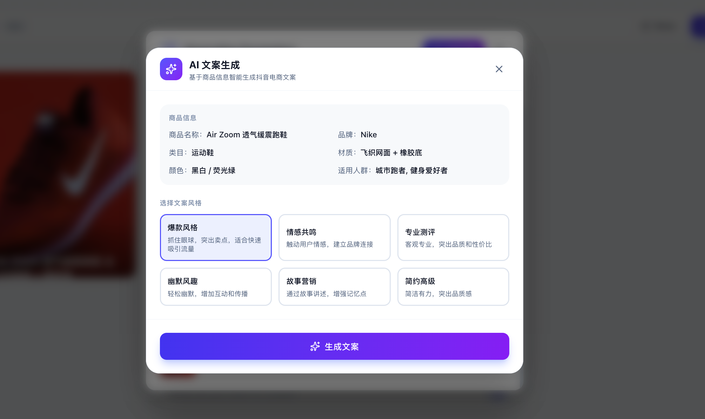

2.  **修改商品信息，看文案是否相应变化**
    -   把商品从「智能手表」改成「蓝牙耳机」
    -   生成的文案应该会提到耳机相关内容


3.  **查看平台消费记录**
    -   访问 [DeepSeek 使用管理页面](https://platform.deepseek.com/usage)
    -   几分钟后会显示调用记录和费用

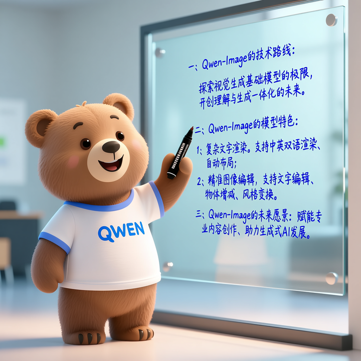

小林试了一下，发现每次生成的文案确实不同，而且都很贴合商品信息。她兴奋地截图发给表姐：「这次是真的 AI 了！」

### 其他文本模型选择：MiniMax

DeepSeek 很好用，但小林也想了解其他选择。她发现 **MiniMax** 也是个不错的选项。

🚀 认识 MiniMax

**MiniMax** 是另一家中国 AI 公司推出的大语言模型，特点是：

-   **超长上下文**：支持 204,800 tokens（约 15 万字），适合处理长文档
-   **高性价比**：价格极具竞争力
-   **OpenAI 兼容**：API 格式与 OpenAI 一致，切换方便
-   **两个版本**：
    -   `MiniMax-M2.7`：旗舰版，适合复杂任务
    -   `MiniMax-M2.7-highspeed`：高速版，响应更快

**什么时候选 MiniMax？**

-   需要处理很长的文本（比如分析整篇文章）
-   需要更快的响应速度
-   想要更低的成本

**切换到 MiniMax 很简单：**

由于 MiniMax 提供 OpenAI 兼容接口，只需要改三个地方：

1.  **API Key**：换成 MiniMax 的 Key（在 [MiniMax 平台](https://platform.minimax.io/) 获取）
2.  **接口地址**：改为 `https://api.minimax.io/v1/chat/completions`
3.  **模型名称**：改为 `MiniMax-M2.7` 或 `MiniMax-M2.7-highspeed`

告诉 Claude Code：「把 DeepSeek 换成 MiniMax」，它会自动帮你改好。

0

① 理解 API

API 是什么、为什么需要它

0

② 接入文本 AI

DeepSeek 文本生成实战

0

③ 接入图像 AI

图像理解与生成

* * *

## 接入图像理解：Qwen3 VL

文本生成搞定后，小林发现了新问题：她的原型里用户可以上传商品图片，但只用文本模型的话，AI 看不懂图片内容，生成的文案可能会文不对题。

她需要一个能「看懂图片」的 AI。

### 什么是视觉语言模型（VLM）？

👁️ VLM 能做什么？

**VLM（Vision-Language Model）** = 视觉 + 语言模型

普通的大语言模型只能处理文字，而 VLM 既能看图，又能说话。

**典型能力：**

-   📸 **图像描述**：「这是一张智能手表的产品图，表盘是圆形的，表带是黑色皮革...」
-   🔍 **视觉问答**：「图片中的手表是什么颜色？」→「黑色」
-   📝 **文字提取**：从图片中识别文字（OCR）
-   🎨 **场景理解**：「这张图的拍摄场景是室内，光线柔和，背景简洁...」

**小林的使用场景：** 用户上传商品图片 → VLM 分析图片内容 → 生成准确的商品描述和卖点

### 为什么选择 Qwen3 VL？

**Qwen3 VL** 是阿里云通义千问团队推出的视觉语言模型，小林选它的理由：

-   **中文理解好**：对中文提示词理解准确
-   **性价比高**：比国际竞品便宜
-   **速度快**：响应时间短
-   **质量稳定**：在电商场景表现可靠

### 通过 SiliconFlow 接入 Qwen3 VL

小林发现，直接调用阿里云的 API 需要复杂的认证流程。幸好有 **SiliconFlow** 这样的聚合平台，提供了更简单的接入方式。

🌐 什么是 SiliconFlow？

**SiliconFlow（硅基流动）** 是国内知名的 AI 模型聚合平台。

**优势：**

-   一个平台集成多种模型（DeepSeek、Qwen、Llama 等）
-   统一的 API 格式（兼容 OpenAI）
-   优化的推理性能（低延迟、高并发）
-   按需付费，价格透明

就像「AI 模型超市」，你不用分别去每个模型的官网注册，在这里一站式搞定。

### 接入步骤

**第 1 步：注册并获取 API Key**

1.  访问 [SiliconFlow 平台](https://cloud.siliconflow.cn/)
2.  注册账号并充值少量费用（10 元即可）
3.  进入「API 密钥」页面，创建新密钥


**第 2 步：选择模型**

1.  进入「Playground」（模型试用区）
2.  点击「筛选器」，选择「视觉」标签
3.  找到 `Qwen/Qwen3-VL-8B-Instruct` 模型


**第 3 步：获取调用示例**

访问 [SiliconFlow API 文档](https://docs.siliconflow.cn/)，找到图像理解的示例代码。


**第 4 步：让 Claude Code 集成**

```
基于下面的图生文接口 API，帮我实现：用户上传商品图片后，自动生成电商卖点文本和关键词。

以下参考资料：
API Key: sk-xxxxxx
模型: Qwen/Qwen3-VL-8B-Instruct
接口地址: https://api.siliconflow.cn/v1/chat/completions

参考代码：
[粘贴官方 Python 或 curl 示例]
```


### 实际效果

📝代码变更

+0\-0

**使用效果：**

用户上传一张智能手表图片后，Qwen3 VL 返回：

```
这是一款现代智能手表，采用圆形表盘设计，配备高清彩色触摸屏。
表带为黑色硅胶材质，佩戴舒适透气。表盘显示时间、心率、步数等信息。
适合运动健身、日常佩戴场景。主要卖点：健康监测、运动追踪、长续航、
防水设计。
```


有了这个描述,再调用 DeepSeek 生成文案就会更准确！


* * *

## 接入图像生成：Seedream

小林的原型还有一个功能：根据商品生成营销海报。这需要「文生图」能力——输入文字描述，AI 生成图片。

### 什么是图像生成模型？

🎨 图像生成 AI 能做什么？

**图像生成模型** 可以根据文字描述创造全新的图片。

**典型应用：**

-   📱 **电商主图**：「一款智能手表放在木质桌面上，柔和光线，简约风格」
-   🎭 **营销海报**：「双十一促销海报，红色主题，有礼物盒和折扣标签」
-   🖼️ **概念图**：快速出设计稿、配图
-   🎬 **社交媒体**：生成头像、表情包、配图

**小林的使用场景：** 输入「为这款智能手表生成一张电商海报」→ AI 生成专业的产品图

### 为什么选择 Seedream？

**Seedream 4.5** 是字节跳动推出的图像生成模型，小林选它的理由：

-   **国内网络稳定**：访问速度快，延迟低
-   **中文优化**：对中文提示词理解准确
-   **速度快**：生成效率高
-   **质量高**：支持 4K 高清图像
-   **功能全面**：既能文生图，也能图生图（基于参考图生成）

### 通过火山引擎接入 Seedream

**第 1 步：注册并充值**

1.  访问 [火山引擎 Seedream 页面](https://www.volcengine.com/experience/ark?launch=seedream)
2.  登录并完成实名认证
3.  充值 1-10 元用于测试

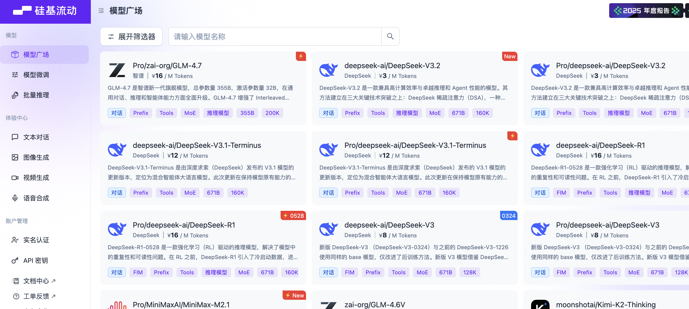

**第 2 步：创建 API Key**

1.  进入控制台，找到「API 访问」
2.  创建新的 API Key
3.  复制保存

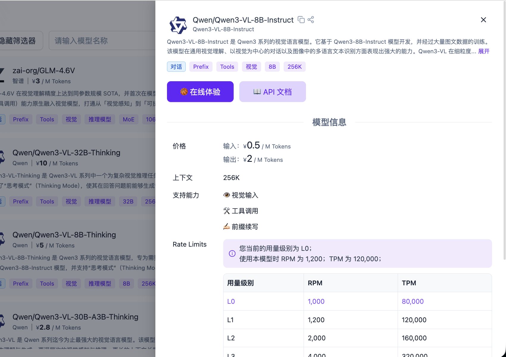

**第 3 步：获取调用示例**

在 API 文档中找到「图像生成」示例。注意有两种模式：

-   **文生图**：纯文字描述生成图片
-   **图生图**：基于参考图 + 文字描述生成新图片

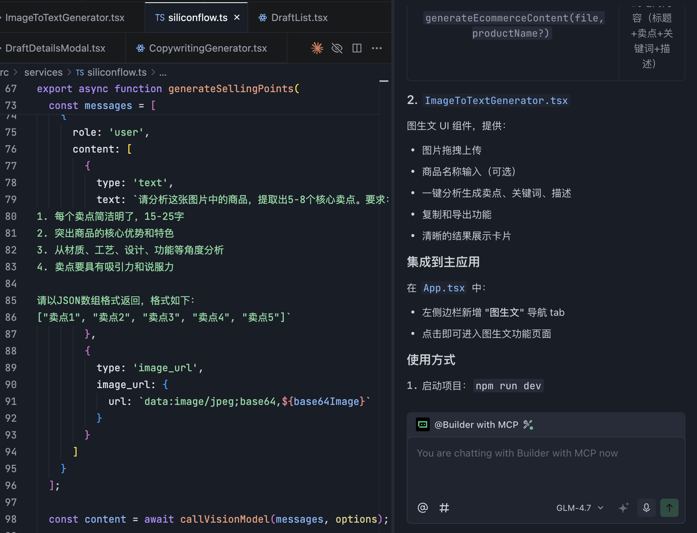

**第 4 步：让 Claude Code 集成**

```
请你基于下面 API，帮我实现电商业务的常见功能（例如海报生成、抖音电商首图生成等）

以下参考资料：
API Key: xxxxxx
模型: doubao-seedream-4-5-251128

参考代码：
curl -X POST https://ark.cn-beijing.volces.com/api/v3/images/generations \
  -H "Content-Type: application/json" \
  -H "Authorization: Bearer xxxxxxx" \
  -d '{
    "model": "doubao-seedream-4-5-251128",
    "prompt": "将图1的服装换为图2的服装",
    "image": ["图片URL1", "图片URL2"],
    "size": "2K",
    "stream": false,
    "watermark": false
  }'
```

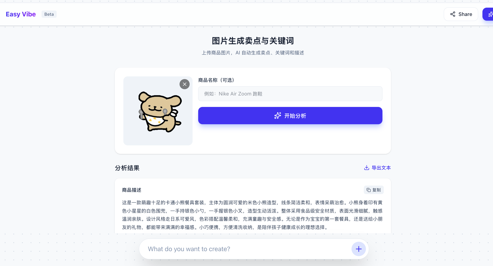

**⚠️ 重要提示：**

-   记得设置 `"watermark": false`（不添加水印）
-   设置 `"stream": false`（不使用流式响应）
-   否则可能生成失败或带水印

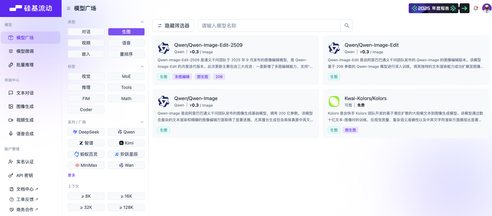

### 实际效果

**src/api/seedream.js - Seedream 图像生成 API：**

```diff
@@ -0,0 +1,45 @@
+/**
+ * 使用 Seedream 生成商品海报
+ * @param {string} prompt - 生成提示词
+ * @param {string[]} referenceImages - 参考图片 URL 数组（可选）
+ * @returns {Promise<string>} 生成的图片 URL
+ */
+export async function generateProductPoster(prompt, referenceImages = []) {
+  const API_KEY = 'xxxxxx'
+  const API_URL = 'https://ark.cn-beijing.volces.com/api/v3/images/generations'
+
+  const requestBody = {
+    model: 'doubao-seedream-4-5-251128',
+    prompt: prompt,
+    size: '2K',
+    stream: false,
+    watermark: false
+  }
+
+  // 如果有参考图，添加到请求中
+  if (referenceImages.length > 0) {
+    requestBody.image = referenceImages
+  }
+
+  try {
+    const response = await fetch(API_URL, {
+      method: 'POST',
+      headers: {
+        'Content-Type': 'application/json',
+        'Authorization': `Bearer ${API_KEY}`
+      },
+      body: JSON.stringify(requestBody)
+    })
+
+    const data = await response.json()
+
+    if (data.data && data.data[0] && data.data[0].url) {
+      return data.data[0].url
+    } else {
+      throw new Error('图片生成失败：' + JSON.stringify(data))
+    }
+  } catch (error) {
+    console.error('Seedream API 调用失败:', error)
+    throw new Error('图片生成失败，请稍后重试。详细错误：' + error.message)
+  }
+}
```

**使用示例：**

```javascript
// 文生图：纯文字描述生成
const posterUrl = await generateProductPoster(
  '一款黑色智能手表放在木质桌面上，柔和的自然光，简约现代风格，4K高清'
)

// 图生图：基于参考图生成
const posterUrl = await generateProductPoster(
  '将商品放在电商海报背景中，添加促销标签和文字',
  ['https://example.com/product.jpg', 'https://example.com/template.jpg']
)
```

### 调试技巧

小林在接入图像生成时遇到了不少问题，她总结了几个调试技巧：

**1\. 显示完整错误信息**

告诉 Claude Code：

```
不要只显示「图片生成失败」，每次都显示完整的失败原因，
比如图片不匹配、请求错误、超时等等！
```


**2\. 遇到问题时重启项目**

有时候代码改了但页面没更新，可以说：

```
请你重启这个项目
```


**3\. 检查参数格式**

常见错误：

-   图片 URL 格式不对
-   prompt 太短或太长
-   参考图数量超限（最多 3 张）


### 其他图像生成选择

除了 Seedream，小林还了解到其他选择：

**Recraft**（适合设计风格图）

-   擅长矢量风格、插画、品牌设计
-   支持精确元素定位
-   适合营销海报、品牌素材
-   官网：[https://www.recraft.ai/](https://www.recraft.ai/)


**Qwen Image**（通义万相）

-   阿里云出品，中文友好
-   支持多种艺术风格
-   价格实惠，速度快
-   通过 SiliconFlow 接入更方便


切换方法同样简单：告诉 Claude Code「把 Seedream 换成 Recraft」即可。

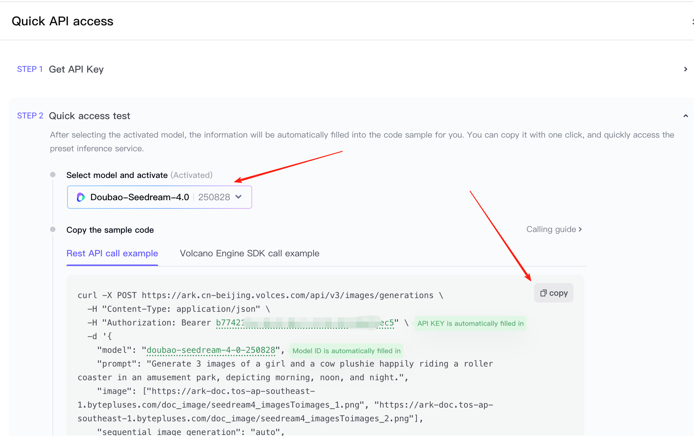

* * *

## 如何找到更好的 AI 模型？

小林学会接入 API 后，开始好奇：怎么知道哪个模型更好？有没有「模型排行榜」？

### LMArena - 模型竞技场

**网站：** [https://lmarena.ai/](https://lmarena.ai/)

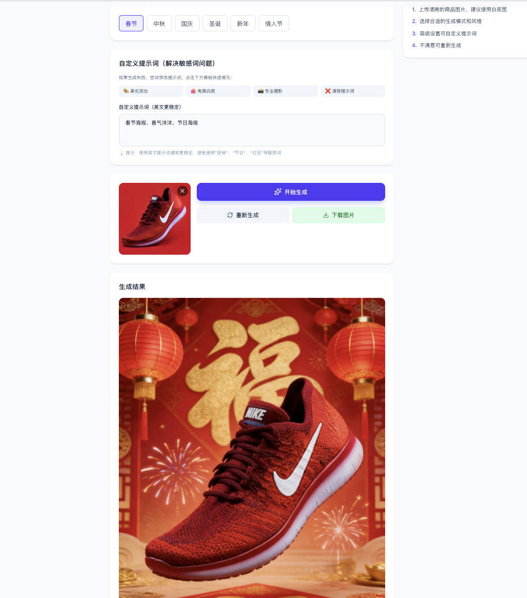

🏆 LMArena 是什么？

LMArena 是一个「模型盲测平台」：

**工作原理：**

1.  你输入一个问题
2.  平台同时调用两个匿名模型
3.  你投票选择更好的回答
4.  根据投票统计模型排名

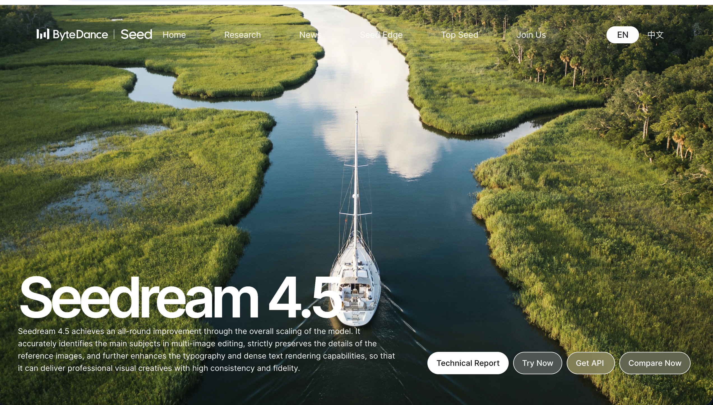

**为什么有用？**

-   真实用户投票，不是实验室跑分
-   盲测避免品牌偏见
-   能看到「大家觉得哪个更好用」

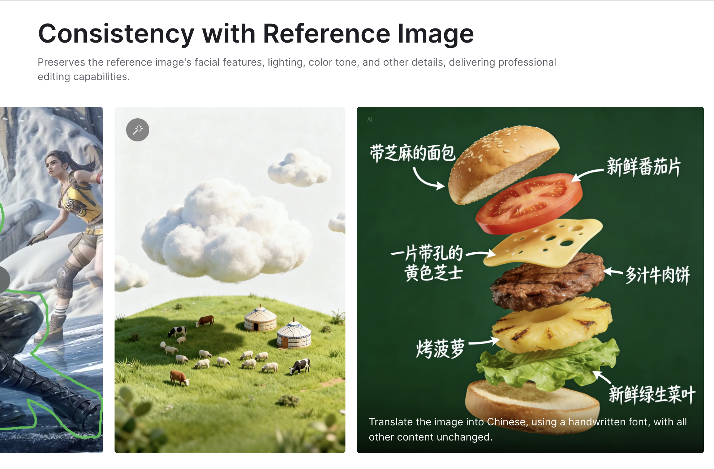

**使用方法：**

1.  访问 LMArena
2.  查看排行榜（Leaderboard）
3.  选择你关心的类别（通用对话 / 编程 / 视觉）
4.  选 Top 3 里你能用的那个

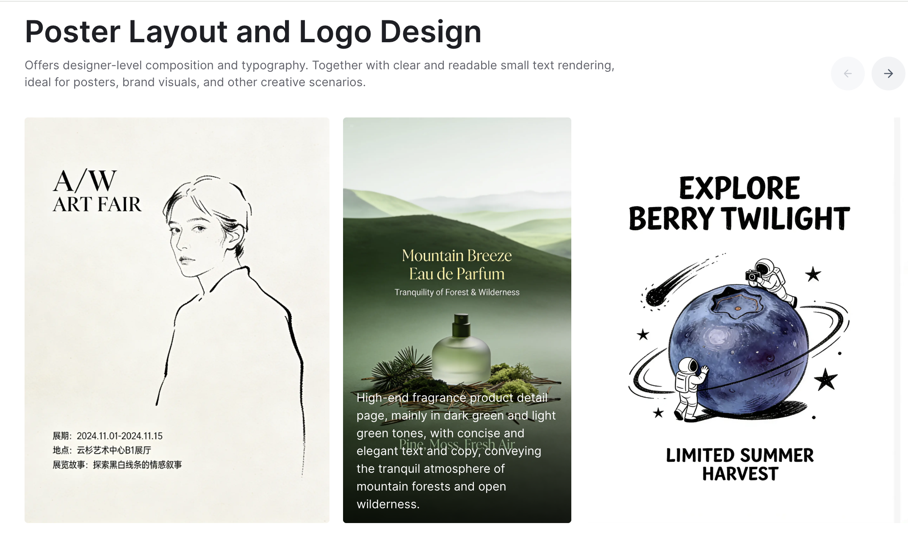

### Artificial Analysis - 模型参数对比

**网站：** [https://artificialanalysis.ai/](https://artificialanalysis.ai/)

这个网站把「效果 / 价格 / 速度」放在同一张表里对比，方便你做选型决策。

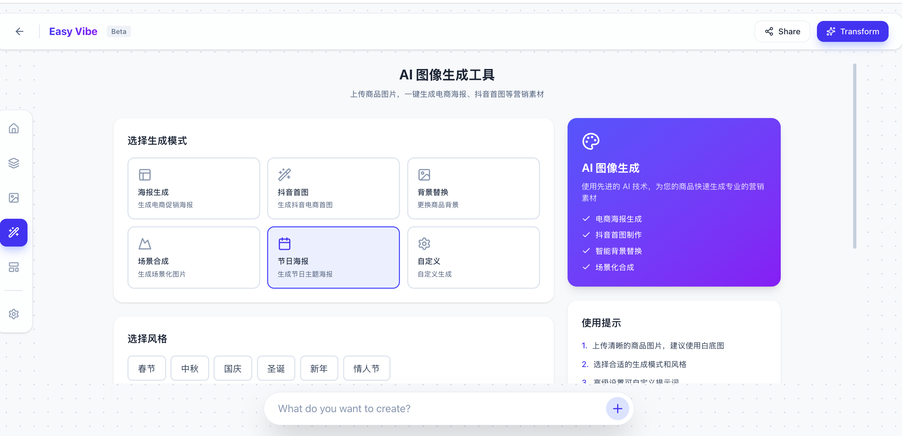

**对比维度：**

-   **Quality（质量）**：模型输出质量评分
-   **Price（价格）**：每百万 tokens 的成本
-   **Latency（延迟）**：响应速度
-   **Throughput（吞吐）**：并发处理能力


**使用建议：** 不要凭感觉争论「哪个更强」。更可靠的做法是：

1.  用同一组输入测试 2-3 个模型
2.  结合榜单与价格做决定
3.  选择「综合性价比」最符合你产品的

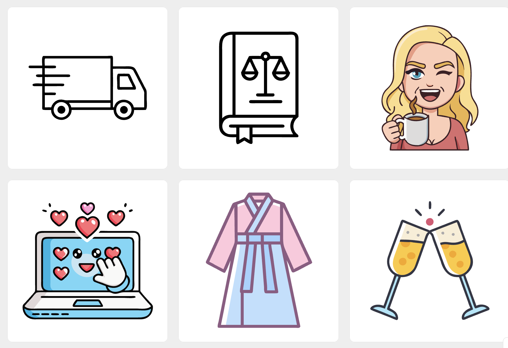

* * *

## 本周回顾与自测

Week 07 学习进度

1

理解 API 核心概念

知道什么是 API、API Key、Endpoint、请求与响应

2

掌握密钥安全实践

知道为什么不能泄露 Key，如何安全管理密钥

3

接入文本生成 API

成功接入 DeepSeek 或 MiniMax，实现文案生成功能

4

接入图像理解 API

成功接入 Qwen3 VL，实现图片分析功能

5

接入图像生成 API

成功接入 Seedream，实现海报生成功能

6

会使用模型选型工具

知道如何通过 LMArena 和 Artificial Analysis 选择模型

### 自测问题

完成本周学习后，试着回答这些问题：

**1\. API 基础理解**

-   用自己的话解释：什么是 API？它在你的原型中扮演什么角色？
-   API Key 为什么重要？如果泄露会有什么后果？

**2\. 实践操作**

-   你能独立完成「注册平台 → 获取 Key → 找到示例 → 让 Claude Code 集成」这个流程吗？
-   如何验证 API 是否真正被调用了？（至少说出 2 种方法）

**3\. 模型选择**

-   DeepSeek、MiniMax、Qwen3 VL、Seedream 各自适合什么场景？
-   如果要处理超长文本（10 万字），应该选哪个模型？
-   如果要生成设计风格的插画，应该选哪个图像模型？

**4\. 安全实践**

-   为什么本周练习中我们直接把 Key 粘贴给 Claude Code，但真实项目不能这样做？
-   正确的密钥管理方式是什么？

**5\. 调试能力**

-   如果 API 调用失败，你会从哪几个方面排查？
-   如果图片生成一直失败，可能是什么原因？

✅ 小林的学习心得

这周最大的收获是：**原型终于「活」了！**

以前做的都是「假按钮」，现在点一下真的能生成内容。虽然过程中遇到了不少问题（API Key 写错、参数格式不对、图片生成失败），但每次解决问题都让我对 API 的理解更深一层。

**最重要的三个认知：**

1.  **API 不神秘**：就是「发请求 → 等响应」，核心是理解请求格式和响应格式
2.  **Claude Code 是好帮手**：不需要自己写代码，把需求和示例给它就行
3.  **安全第一**：API Key 就是钱包钥匙，绝对不能泄露

下周要把这些 AI 能力串起来，做一个完整的业务流程！

* * *

## 本周作业

📝 实战任务

**任务目标：** 为你的原型接入至少一个 AI 能力

**必做（三选一）：**

1.  **文本生成**：接入 DeepSeek 或 MiniMax，实现文案生成功能
2.  **图像理解**：接入 Qwen3 VL，实现图片分析功能
3.  **图像生成**：接入 Seedream 或 Recraft，实现海报生成功能

**选做（加分项）：**

-   接入 2 种以上 AI 能力，并让它们协同工作
-   例如：用户上传图片 → Qwen3 VL 分析 → DeepSeek 生成文案 → Seedream 生成海报

**提交内容：**

1.  功能演示截图（至少 3 张）
    -   操作界面
    -   生成过程
    -   最终结果
2.  简短说明（100-200 字）
    -   你接入了什么 AI 能力
    -   遇到了什么问题，如何解决的
    -   有什么心得体会

**评分标准：**

-   ✅ 功能能正常工作（60 分）
-   ✅ 有错误处理和加载状态（20 分）
-   ✅ 界面友好，用户体验好（10 分）
-   ✅ 有创新点或多个 AI 协同（10 分）

### 思考题

为下周的「完整项目实践」做准备，提前思考：

1.  **业务流程设计**

    -   你的原型有哪些核心功能？
    -   这些功能之间如何串联成完整的业务流程？
    -   哪些环节可以用 AI 提升效率？
2.  **AI 能力组合**

    -   如何让文本生成、图像理解、图像生成协同工作？
    -   能否设计一个「一键生成」功能，自动完成多个步骤？
3.  **用户体验优化**

    -   如何让用户知道 AI 正在工作（加载动画、进度提示）？
    -   如果 AI 生成失败，如何友好地提示用户？
    -   能否让用户对生成结果进行调整和优化？

* * *

## 下周预告

小林现在有了能真正工作的原型，但她发现这些 AI 能力还是孤立的——用户要分别点击「分析图片」「生成文案」「生成海报」，体验不够流畅。

下周我们要做的是：**把这些 AI 能力串联成完整的业务流程**。

**下周内容预告：**

-   设计完整的电商 AI 工作台
-   实现「一键生成」功能（自动完成多个 AI 任务）
-   添加数据管理（保存生成历史、导出结果）
-   优化用户体验（进度提示、错误处理、结果编辑）
-   部署上线，让别人也能用

从「单点 AI 能力」到「完整产品流程」，小林的原型即将变成真正可用的产品！

* * *

## 附录：常见问题解答

❓ FAQ

**Q1: API 调用会很贵吗？**

A: 对于学习和小项目，成本很低。以 DeepSeek 为例：

-   生成 1000 字文案：约 0.01 元
-   充值 10 元可以测试几千次
-   可以随时查看消费记录，控制预算

**Q2: 如果 API Key 泄露了怎么办？**

A: 立即采取以下措施：

1.  登录平台，删除旧 Key
2.  创建新 Key
3.  更新代码中的 Key
4.  检查账户消费记录，看是否有异常
5.  如有异常消费，联系平台客服

**Q3: 为什么我的 API 调用总是失败？**

A: 常见原因：

-   API Key 错误或过期
-   账户余额不足
-   请求格式不对（检查 JSON 格式）
-   网络问题（检查能否访问 API 地址）
-   参数超限（比如 prompt 太长）

排查方法：查看完整的错误信息，通常会告诉你具体原因。

**Q4: 可以在前端直接调用 API 吗？**

A: 本周练习中我们在前端直接调用，但**真实项目不推荐这样做**，原因：

-   API Key 会暴露在浏览器中
-   用户可以在开发者工具中看到你的 Key
-   恶意用户可以盗用你的 Key

正确做法：通过后端服务器调用 API，前端只调用你自己的后端接口。

**Q5: 不同模型的 API 格式差别大吗？**

A: 大多数模型都提供 **OpenAI 兼容接口**，格式基本一致。切换模型通常只需要改三个地方：

1.  API Key
2.  接口地址（Base URL）
3.  模型名称

这也是为什么我们能轻松在 DeepSeek、MiniMax 之间切换。

**Q6: 如何选择合适的模型？**

A: 考虑这些因素：

-   **任务类型**：文本生成、图像理解、图像生成？
-   **语言**：中文任务优先选国产模型
-   **成本**：预算有限选性价比高的
-   **速度**：实时应用选响应快的
-   **质量**：关键任务选质量最好的

建议：先用性价比高的模型（如 DeepSeek）快速验证，确认方向后再考虑升级。
