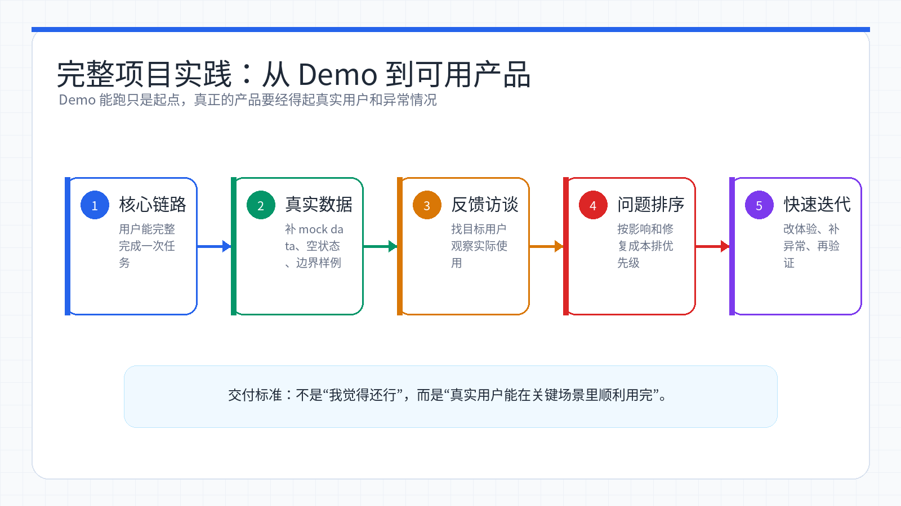
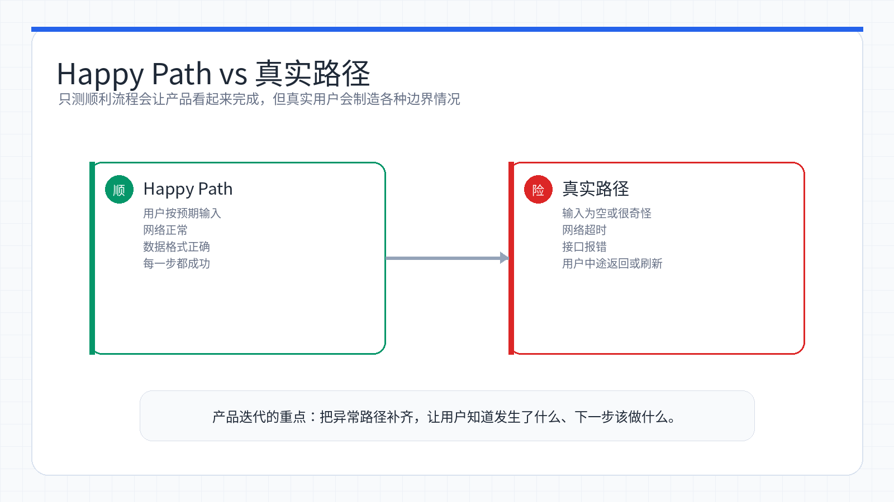

# Week 08：完整项目实践——收集反馈与迭代

> 小林的产品原型终于能跑起来了。她兴冲冲地发给朋友试用,结果朋友点了几下就卡住了:「这个按钮点了没反应啊?」「刷新一下数据就没了?」「这些测试数据看着好假...」小林这才意识到,能跑的 Demo 和真正能用的产品之间,还隔着一道巨大的鸿沟。这一周,她要学会如何收集真实反馈、快速迭代优化,把半成品打磨成拿得出手的完整作品。

<ChapterIntroduction duration="约 3-4 天" output="一个功能完备、体验流畅、数据真实的完整产品原型" prerequisite="完成前 6 周课程,已有可运行的产品 Demo" :tags="['用户反馈', '迭代优化', '数据模拟', 'LocalStorage', '产品思维']">

上一周我们接入了 AI 能力,Demo 能跑起来了。但离真正的「产品」还差得远:页面一刷新数据就没了,报错就白屏,列表里只有「测试数据 1、测试数据 2」,用户点错了也没法撤销...

这一周要把这些坑都填上:我们会补全产品的完整链路,用 AI 生成逼真的业务数据替代假数据,加上错误处理和用户反馈,最重要的是——学会如何收集真实用户反馈并快速迭代。

这是课程 A 产品原型阶段的收官之作。走完这一步,你就完成了从「完全不会编程」到「能独立做出 AI 产品原型并根据反馈迭代」的蜕变。

</ChapterIntroduction>

<StepBar :active="0" :items="[
  { title: '① 完善链路', description: '从单点功能到完整闭环' },
  { title: '② 注入灵魂', description: '模拟真实业务数据' },
  { title: '③ 收集反馈', description: '找对人、问对问题' },
  { title: '④ 快速迭代', description: '基于反馈修补体验' }
]" />

* * *

## 小林的困境:Demo 能跑 ≠ 产品能用

小林上周完成了「AI 文案生成器」的核心功能,兴奋地发给做电商的朋友小王试用。结果不到两分钟,小王就发来一连串问题:

**小王的反馈:**

-   「我点了生成按钮,等了半天没反应,是不是坏了?」
-   「生成了一次之后我想再试试,结果刷新页面历史记录全没了...」
-   「这些示例数据『测试商品 1』『测试商品 2』看着太假了,能不能换成真实的?」
-   「我不小心点错了,能不能有个撤销功能?」
-   「报错的时候直接白屏了,吓我一跳」

小林这才意识到,自己一直在「理想路径」(Happy Path) 下测试——输入正确、网络通畅、操作无误。但真实用户的使用场景要复杂得多:他们会等待、会犯错、会遇到网络问题、会刷新页面...

**Demo 和产品的区别**

-   **Demo 阶段**:核心功能能跑通就行,只考虑理想情况
-   **产品阶段**:要考虑等待、失败、异常、数据持久化、用户误操作等各种真实场景

从 Demo 到产品,不是功能的增加,而是**体验的完善**。



*完整项目实践的重点，是把“能跑”变成“真实用户能顺利用完”。*

## 第一步:拒绝「Happy Path」——完善核心链路

很多初学者做原型,往往只做「Happy Path」(最理想的路径):用户点击 → API 响应成功 → 显示结果。但在真实世界里,事情往往没那么顺利。



*只测试理想路径会高估产品完成度；真实路径里的等待、失败和误操作才是体验优化重点。*

### 1.1 增加「等待」与「反馈」

**问题场景:** 当用户点击「生成文案」时,AI 往往需要 3-5 秒才能响应。如果界面毫无反应,用户会以为程序坏了,可能会重复点击或直接关闭页面。

**解决方案:** 你需要让 Claude Code 帮你加上 Loading 状态。

🤖

AI 助手

在线

**实现效果对比:**

```diff
 <template>
   <div class="generator">
-    <button @click="generate">生成文案</button>
+    <button @click="generate" :disabled="isLoading">
+      {{ isLoading ? '生成中...' : '生成文案' }}
+    </button>
     <div class="result">
+      <div v-if="isLoading" class="loading">
+        <div class="spinner"></div>
+        <p>AI 正在思考中,请稍候...</p>
+      </div>
       <div v-else>{{ result }}</div>
     </div>
   </div>
 </template>

 <script setup>
 import { ref } from 'vue'
+const isLoading = ref(false)
 const result = ref('')

 async function generate() {
+  isLoading.value = true
   try {
     const response = await callAI()
     result.value = response
   } finally {
+    isLoading.value = false
   }
 }
 </script>
```

### 1.2 处理「失败」与「异常」

**问题场景:** API Key 可能会过期,网络可能会断开,AI 服务可能会限流。如果不处理这些异常,用户看到的就是控制台报错或白屏。

**解决方案:** 让 Claude Code 帮你添加错误处理和用户友好的提示。

🤖

AI 助手

在线

**常见错误类型及处理:**

错误类型

用户看到的提示

开发者日志

网络断开

「网络连接失败,请检查网络后重试」

`Network Error: Failed to fetch`

API Key 无效

「认证失败,请检查配置」

`401 Unauthorized: Invalid API key`

请求超时

「请求超时,请稍后重试」

`Timeout: Request exceeded 30s`

服务限流

「请求过于频繁,请稍后再试」

`429 Too Many Requests`

未知错误

「生成失败,请稍后重试」

完整错误堆栈

**小林踩过的坑**

她第一次测试时,因为 API Key 写错了,页面直接白屏。后来加了错误处理,才发现是 401 错误。记住:**永远不要让用户看到技术错误信息,但要给开发者留下调试线索**。

### 1.3 对话历史持久化

**问题场景:** 小林的 AI 文案生成器每次生成的内容都很有价值,但用户一刷新页面,之前生成的所有内容就消失了。用户抱怨:「我刚才生成的那条文案挺好的,想再看看,结果找不到了...」

**解决方案:** 在不引入数据库的情况下,可以使用 LocalStorage 保存数据。

**存储方案对比:**

方案

适用场景

优点

缺点

**LocalStorage**

纯前端项目,单用户使用

实现简单,刷新不丢失,无需后端

无法跨设备同步,容量限制 5-10MB

**SessionStorage**

临时数据,关闭标签页即清除

更安全,不会长期占用空间

关闭标签页数据就没了

**IndexedDB**

需要存储大量结构化数据

容量大(几百 MB),支持复杂查询

API 复杂,学习成本高

对于原型阶段,**LocalStorage 是最佳选择**。

🤖

AI 助手

在线

**保存的数据结构示例:**

```json
[
  {
    "id": "1640995800000",
    "timestamp": "2026-01-20 10:30:00",
    "productName": "蓝牙耳机 Pro",
    "userInput": {
      "category": "数码",
      "features": ["降噪", "长续航", "低延迟"]
    },
    "aiOutput": {
      "title": "🎧 终于被我找到了!这款耳机降噪太强了吧!🔇",
      "content": "戴上它,世界瞬间安静了。音质绝佳,听歌就像在现场。续航也很给力,充一次电用一周!学生党必入!"
    }
  }
]
```

```diff
+// 历史记录管理
+const STORAGE_KEY = 'ai_generator_history'
+
+export function saveHistory(record) {
+  const history = getHistory()
+  history.unshift({
+    id: Date.now().toString(),
+    timestamp: new Date().toLocaleString('zh-CN'),
+    ...record
+  })
+  // 只保留最近 50 条
+  if (history.length > 50) {
+    history.length = 50
+  }
+  localStorage.setItem(STORAGE_KEY, JSON.stringify(history))
+}
+
+export function getHistory() {
+  const data = localStorage.getItem(STORAGE_KEY)
+  return data ? JSON.parse(data) : []
+}
+
+export function deleteHistory(id) {
+  const history = getHistory()
+  const filtered = history.filter(item => item.id !== id)
+  localStorage.setItem(STORAGE_KEY, JSON.stringify(filtered))
+}
```

0

① 完善链路

从单点功能到完整闭环

0

② 注入灵魂

模拟真实业务数据

0

③ 收集反馈

找对人、问对问题

0

④ 快速迭代

基于反馈修补体验

* * *

## 第二步:注入灵魂——模拟真实数据 (Mock Data)

小林完善了基础链路后,把原型发给朋友看。朋友打开一看:历史记录区域空空如也,示例商品列表里只有「测试商品 1」「测试商品 2」「测试商品 3」...

朋友说:「这看着太像半成品了,能不能放点真实的数据进去?这样我才能感受到真实使用场景。」

小林意识到:**一个空荡荡的页面是无法打动人的**。想象一下,你向别人展示「电商素材工作台」,结果历史记录里空空如也,或者只有一行 "test / test / test"。

为了让演示效果最佳,我们需要「伪造」一些逼真的数据,让你的原型看起来像一个已经运营了半年的真实产品。

### 2.1 让 AI 帮你设计数据结构

我们不需要自己去想每一个字段叫什么(比如是叫 `name` 还是 `title`),这件事完全可以交给 AI。

你只需要告诉 AI 你的**业务场景**:

🤖

AI 助手

在线

AI 会根据你的描述,自动帮你构思出合理的字段名和结构。

### 2.2 让 AI 批量生产「逼真」数据

有了数据结构后,下一步就是让 AI 帮你「填空」,生成一批看起来真实的数据。

**关键技巧:** 你不能只告诉 AI「帮我生成数据」,你需要像给实习生布置任务一样,告诉它**业务背景**和**内容要求**:

🤖

AI 助手

在线

**生成的 Mock Data 示例:**

```javascript
export const mockProductTasks = [
  {
    id: 'task_001',
    productName: '夏季法式复古碎花裙',
    category: '女装',
    priceRange: '89-129',
    status: 'completed',
    input: {
      features: ['收腰', '显瘦', '气质'],
      targetAudience: '18-28岁都市女性',
      sellingPoints: '法式复古风,收腰显瘦'
    },
    output: {
      title: '✨谁穿谁好看!这条法式碎花裙真的绝绝子🔥',
      content: '姐妹们!这条裙子真的太显瘦了!收腰设计绝了,穿上立马有腰身。面料很透气,夏天穿完全不闷。约会逛街首选!法式复古风满满,拍照超级出片!👗',
      tags: ['法式复古', '显瘦神器', '夏日必备', '气质女神']
    },
    createdAt: '2026-05-25T10:30:00Z'
  },
  {
    id: 'task_002',
    productName: '超强降噪蓝牙耳机 Pro',
    category: '数码',
    priceRange: '299-399',
    status: 'completed',
    input: {
      features: ['40dB降噪', '30小时续航', '低延迟'],
      targetAudience: '学生党、通勤族',
      sellingPoints: '降噪强、续航久、音质好'
    },
    output: {
      title: '🎧 终于被我找到了!这款耳机降噪太强了吧!🔇',
      content: '戴上它,世界瞬间安静了!地铁上嘈杂的声音全部消失,只剩下纯净的音乐。音质绝佳,听歌就像在现场。续航也很给力,充一次电用一周!学生党必入!',
      tags: ['降噪神器', '学生党必备', '通勤利器', '音质炸裂']
    },
    createdAt: '2026-05-26T14:20:00Z'
  },
  {
    id: 'task_003',
    productName: '玻尿酸保湿精华液',
    category: '美妆',
    priceRange: '159-199',
    status: 'completed',
    input: {
      features: ['深层补水', '提亮肤色', '抗初老'],
      targetAudience: '25-35岁女性',
      sellingPoints: '医美级玻尿酸,补水效果立竿见影'
    },
    output: {
      title: '💕 这瓶精华真的把我脸救回来了!水润到发光✨',
      content: '干皮姐妹看过来!这瓶精华我用了一周,皮肤明显水润了!医美级玻尿酸,吸收超快不黏腻。早上起来皮肤还是水水的,上妆也服帖了。熬夜党的救星!',
      tags: ['补水神器', '干皮救星', '医美级', '提亮肤色']
    },
    createdAt: '2026-05-27T09:15:00Z'
  }
  // ... 更多数据
]
```

**小林的经验:**

她发现 AI 生成的 Mock Data 质量取决于提示词的详细程度。第一次她只说「生成 10 条数据」,结果 AI 给的都是「商品 A」「商品 B」这种。后来她加上了「业务场景」「文案风格」「具体要求」,生成的数据就非常逼真了。

**记住:对 AI 越具体,结果越好。**

### 2.3 使用 LocalStorage 实现「假增删改」

如果你希望刚才生成的「模拟数据」不仅能看,还能删、能改,甚至新生成的任务刷新页面后还在,你可以结合 `LocalStorage`。

🤖

AI 助手

在线

**实现示例:**

```javascript
// src/utils/taskStorage.js
import { mockProductTasks } from './mockData'

const STORAGE_KEY = 'product_tasks'

// 初始化数据
export function initTasks() {
  const stored = localStorage.getItem(STORAGE_KEY)
  if (!stored) {
    // 首次使用,用 Mock 数据初始化
    localStorage.setItem(STORAGE_KEY, JSON.stringify(mockProductTasks))
    return mockProductTasks
  }
  return JSON.parse(stored)
}

// 获取所有任务
export function getTasks() {
  const data = localStorage.getItem(STORAGE_KEY)
  return data ? JSON.parse(data) : []
}

// 添加新任务
export function addTask(task) {
  const tasks = getTasks()
  const newTask = {
    id: `task_${Date.now()}`,
    createdAt: new Date().toISOString(),
    status: 'completed',
    ...task
  }
  tasks.unshift(newTask) // 新任务放在最前面
  localStorage.setItem(STORAGE_KEY, JSON.stringify(tasks))
  return newTask
}

// 删除任务
export function deleteTask(taskId) {
  const tasks = getTasks()
  const filtered = tasks.filter(t => t.id !== taskId)
  localStorage.setItem(STORAGE_KEY, JSON.stringify(filtered))
}

// 更新任务
export function updateTask(taskId, updates) {
  const tasks = getTasks()
  const index = tasks.findIndex(t => t.id === taskId)
  if (index !== -1) {
    tasks[index] = { ...tasks[index], ...updates }
    localStorage.setItem(STORAGE_KEY, JSON.stringify(tasks))
  }
}
```

通过这一步,你的原型就拥有了「记忆」,用户体验几乎和真产品无异。

0

① 完善链路

从单点功能到完整闭环

0

② 注入灵魂

模拟真实业务数据

0

③ 收集反馈

找对人、问对问题

0

④ 快速迭代

基于反馈修补体验

* * *

## 第三步:收集反馈——找对人、问对问题

闭门造车是做不出好产品的。现在你的原型已经具备了「核心功能」+「完整链路」+「演示数据」,是时候拿给别人看了。

但是,**找谁测?怎么测?问什么问题?**这些都有讲究。

### 3.1 找谁测?——选对测试用户

小林第一次找人测试时,直接拉了做程序员的朋友小张。结果小张一上来就说:「你这个代码结构不太好」「这里应该用 TypeScript」「为什么不做单元测试?」

小林哭笑不得:她要的是产品反馈,不是代码审查!

**测试用户的选择原则:**

用户类型

适合测什么

不适合测什么

**目标用户** (如电商运营)

功能是否有用、流程是否顺畅、文案是否符合需求

技术实现、代码质量

**技术朋友**

性能问题、安全隐患、技术可行性

产品需求、用户体验

**完全小白**

界面是否直观、操作是否容易理解

专业功能的深度

**同行/竞品用户**

与竞品的差异、功能的创新性

基础体验(他们会有先入为主的预期)

**小林的选择:** 她最终找了三类人:

1.  **做电商的朋友小王**(目标用户):测试功能是否实用
2.  **完全不懂技术的表姐**(小白用户):测试操作是否直观
3.  **做过类似产品的同学**(同行):测试功能的完整性

**黄金法则:至少找 3 个不同类型的用户测试**

-   1 个人的反馈可能是个例
-   3 个人都提到的问题,一定要改
-   5 个人就能发现 80% 的可用性问题

### 3.2 怎么测?——观察而非引导

小林第一次让小王测试时,全程在旁边指导:「你点这里」「然后输入商品名称」「再点生成」...

测完后小王说:「挺好用的啊!」但小林心里没底:这是真好用,还是因为我全程指导?

**正确的测试方法:**

**❌ 错误示范:**

```
你:「你点这个按钮试试」
用户:「哦好」(点击)
你:「然后在这里输入商品名称」
用户:「好的」(输入)
你:「觉得怎么样?」
用户:「挺好的」
```

**✅ 正确示范:**

```
你:「这是一个 AI 文案生成工具,你试着用它给你的商品生成一条抖音文案」
用户:(自己探索)「嗯...这个按钮是干嘛的?」
你:(记录问题,不回答)
用户:「哦我懂了,应该先填这里...」
你:「你在想什么?可以说出来吗?」
用户:「我在想这个『特点』应该填什么...」
```

**关键原则:**

1.  **只给任务,不给步骤**:让用户自己探索
2.  **观察而非指导**:看他们卡在哪里、犹豫什么
3.  **鼓励思考出声**:「你现在在想什么?」「你期望点这里会发生什么?」
4.  **记录而非辩解**:用户说「这里不好用」,不要解释「其实你应该...」,而是记下来

### 3.3 问什么?——有效的反馈问题

测试结束后,不要只问「你觉得怎么样?」这种开放问题。用户往往会客气地说「挺好的」,但你得不到有用的信息。

**小林的反馈问题清单:**

**关于功能价值:**

-   「如果这个工具现在就能用,你会用它吗?为什么?」
-   「你觉得它能帮你解决什么问题?」
-   「和你现在的做法相比,它有什么优势?」

**关于使用体验:**

-   「刚才使用过程中,有哪个地方让你卡住了?」
-   「有没有哪个地方和你预期的不一样?」
-   「如果让你给朋友推荐,你会怎么介绍这个工具?」

**关于改进方向:**

-   「如果只能加一个功能,你最希望加什么?」
-   「有没有哪个地方你觉得多余的、可以去掉的?」
-   「你会给这个产品打几分(1-10)?为什么不是 10 分?」

**最后一个问题最关键**

「为什么不是 10 分?」这个问题能让用户说出真实的顾虑和不满。小林用这个问题发现了很多隐藏的问题:

-   小王:「因为生成的文案有时候太官方了,不够接地气」→ 改进提示词
-   表姐:「因为我不知道『特点』和『卖点』有什么区别」→ 简化输入项
-   同学:「因为没有批量生成功能,一个个生成太慢了」→ 新功能方向

### 3.4 特殊技巧:「绿野仙踪法」(Wizard of Oz)

有时候,你想验证一个功能是否有价值,但还没来得及实现。这时可以用「绿野仙踪法」:

**场景:** 小林想知道用户是否需要「智能推荐标签」功能,但还没接入 AI。

**做法:**

1.  在界面上加一个「智能推荐」按钮
2.  用户点击后,小林在后台手动挑选几个标签,假装是 AI 推荐的
3.  观察用户的反应:是否会用?是否觉得有价值?

**价值:**

-   快速验证需求,避免浪费时间开发无用功能
-   在原型阶段,「人工智能」可以先用「人工」代替

**注意事项:**

这个方法只能用于**内部测试和需求验证**,绝不能用于真实用户或商业场景。用户有权知道他们在使用的是真实 AI 还是人工模拟。

0

① 完善链路

从单点功能到完整闭环

0

② 注入灵魂

模拟真实业务数据

0

③ 收集反馈

找对人、问对问题

0

④ 快速迭代

基于反馈修补体验

* * *

## 第四步:快速迭代——基于反馈修补体验

收集完反馈后,小林的笔记本上记满了问题:

-   小王:「生成的文案太官方,不够接地气」
-   表姐:「不知道『特点』和『卖点』有什么区别,能不能合并?」
-   同学:「能不能一次生成多个版本,让我选最好的?」
-   小王:「手机上看,按钮太小了,点不准」
-   表姐:「我想修改生成的文案,但只能重新生成」

面对这么多问题,小林有点慌:「这么多要改的,从哪里开始?」

### 4.1 问题分类与优先级

不是所有问题都要立刻解决。小林学会了把问题分类:

**问题分类矩阵:**

类型

定义

优先级

示例

**阻断性问题**

导致功能无法使用

🔴 立即修复

点击按钮没反应、页面崩溃

**体验问题**

功能能用,但体验很差

🟡 本周修复

按钮太小、等待时间无提示

**优化建议**

锦上添花的改进

🟢 排期处理

增加快捷键、美化界面

**新功能需求**

当前没有的功能

🔵 评估后决定

批量生成、导出功能

**小林的优先级排序:**

**🔴 立即修复(当天):**

-   手机端按钮太小(影响使用)
-   输入框提示不清晰(用户不知道填什么)

**🟡 本周修复:**

-   生成的文案太官方(调整提示词)
-   合并「特点」和「卖点」输入框(简化流程)
-   增加文案编辑功能(提升体验)

**🟢 排期处理:**

-   界面美化
-   增加更多示例

**🔵 评估后决定:**

-   批量生成功能(需要评估技术成本和用户价值)
-   导出为图片功能(可能需要新的技术方案)

**小林的经验:**

她发现一个规律:**3 个人都提到的问题,一定要优先解决**。比如「输入框提示不清晰」,三个测试用户都卡在这里,说明这是真问题。而只有一个人提的「增加夜间模式」,可以先放一放。

### 4.2 快速修复:让 AI 成为你的迭代助手

确定优先级后,就可以开始修复了。在这个阶段,**AI 是你最好的修改助手**。你只需要负责发现问题,代码修改交给它。

**案例 1:调整提示词,让文案更接地气**

🤖

AI 助手

在线

**效果对比:**

```diff
- 【优化前】这款蓝牙耳机采用先进的降噪技术,能够有效隔绝外界噪音,为您带来沉浸式的听觉体验。续航时间长达30小时,满足您的日常使用需求。
+ 【优化后】姐妹们!这款耳机我真的爱了!戴上它世界瞬间安静,地铁上再吵也不怕!音质绝了,听歌就像在演唱会现场!续航超给力,充一次用一周!学生党必入!🎧✨
```

**案例 2:简化输入框,降低使用门槛**

🤖

AI 助手

在线

**案例 3:响应式优化,解决手机端按钮太小的问题**

🤖

AI 助手

在线

### 4.3 迭代节奏:小步快跑

小林发现,**改一点、测一点、再改一点**,比一次性改完所有问题效果更好。

**她的迭代节奏:**

**第 1 天:**

-   修复 2 个阻断性问题
-   发给测试用户确认是否解决

**第 2 天:**

-   修复 3 个体验问题
-   再次测试,收集新反馈

**第 3 天:**

-   根据新反馈微调
-   准备下一轮迭代

**为什么要小步快跑?**

1.  **快速验证**:改完立刻能看到效果,避免方向错误
2.  **降低风险**:一次改太多,出问题不知道是哪里导致的
3.  **保持动力**:每天都能看到进步,更有成就感

**小林的感悟:**

她以前总想「一次性做到完美」,结果憋了一周,改了一大堆,测试时发现方向错了,前功尽弃。

现在她学会了「先做到 60 分,再迭代到 80 分」。第一版不用完美,能用就行,然后根据反馈快速迭代。**完成比完美更重要。**

### 4.4 记录迭代过程

小林养成了一个好习惯:每次迭代都记录下来。

**她的迭代日志:**

```markdown
## 迭代 v0.2 (2026-05-28)

### 本次修复
- ✅ 优化提示词,文案更接地气
- ✅ 合并输入框,降低使用门槛
- ✅ 移动端按钮优化

### 用户反馈
- 小王:「这次生成的文案好多了,很抖音!」
- 表姐:「输入框清楚多了,知道该填什么了」
- 同学:「手机上好用多了」

### 新发现的问题
- 生成速度有点慢,用户等待时间较长
- 历史记录太多时,页面有点卡

### 下一步计划
- 优化加载体验,增加进度提示
- 历史记录分页显示
```

**记录的价值:**

1.  **复盘学习**:回顾哪些改进有效,哪些无效
2.  **团队协作**:如果有合作伙伴,他们能快速了解进展
3.  **成就感**:看到产品一步步变好,很有成就感

* * *

## 本周实战任务

现在轮到你了!请选择你之前做的产品原型,完成以下任务:

### 任务 1:完善产品链路 ✅

**要求:**

-   \[ \] 添加 Loading 状态(按钮禁用 + 加载动画)
-   \[ \] 添加错误处理(Toast 提示 + 控制台日志)
-   \[ \] 实现数据持久化(LocalStorage)
-   \[ \] 测试各种异常情况(网络断开、API 失败等)

### 任务 2:注入真实数据 ✅

**要求:**

-   \[ \] 让 AI 设计数据结构
-   \[ \] 生成至少 10 条逼真的 Mock Data
-   \[ \] 数据要符合业务场景,不能用「测试 1」「测试 2」
-   \[ \] 实现数据的增删改查

### 任务 3:收集真实反馈 ✅

**要求:**

-   \[ \] 找至少 3 个不同类型的用户测试
-   \[ \] 使用「观察而非引导」的方法
-   \[ \] 记录至少 5 个有效反馈
-   \[ \] 用「为什么不是 10 分?」挖掘真实问题

### 任务 4:快速迭代优化 ✅

**要求:**

-   \[ \] 对问题进行分类和优先级排序
-   \[ \] 修复至少 3 个高优先级问题
-   \[ \] 再次测试,验证修复效果
-   \[ \] 记录迭代日志

* * *

## 本周回顾

Week 08 学习进度

1

理解 Demo 和产品的区别

知道从 Demo 到产品需要完善哪些环节

2

掌握完整链路设计

会添加 Loading、错误处理、数据持久化

3

会生成逼真的 Mock Data

能让 AI 生成符合业务场景的模拟数据

4

掌握用户测试方法

知道找谁测、怎么测、问什么问题

5

会基于反馈快速迭代

能对问题分类排序,并快速修复

6

养成记录习惯

会记录迭代日志,复盘学习

**自测问题:**

1.  **Demo 和产品的核心区别是什么?** 为什么只考虑 Happy Path 是不够的?
2.  **为什么要用 Mock Data?** 如何让 AI 生成逼真的模拟数据?
3.  **用户测试时,为什么要「观察而非引导」?** 如果用户卡住了,你应该怎么做?
4.  **面对一堆反馈,如何确定优先级?** 阻断性问题、体验问题、优化建议、新功能需求,应该先解决哪个?
5.  **为什么要「小步快跑」而不是「一次性做完美」?** 这种迭代方式有什么好处?

* * *

## 小林的成长故事

完成这一周的学习后,小林的产品原型已经脱胎换骨:

**改进前:**

-   点击按钮没反应,用户以为坏了
-   刷新页面数据就没了
-   示例数据都是「测试 1」「测试 2」
-   报错就白屏
-   手机上按钮点不准

**改进后:**

-   点击后显示「生成中...」和加载动画
-   数据保存在 LocalStorage,刷新不丢失
-   15 条逼真的示例数据,看起来像真实产品
-   错误时弹出友好提示,并记录日志
-   移动端体验优化,按钮大小合适

她把优化后的原型发给小王,小王惊讶地说:「这才几天,变化这么大!现在看起来真的像个产品了!」

更重要的是,小林学会了**产品思维**:

-   不只关注功能能不能跑,还关注用户体验好不好
-   不闭门造车,而是主动收集反馈
-   不追求一次完美,而是快速迭代

**从 Demo 到产品的跨越**

这一周,小林完成了从「技术 Demo」到「产品原型」的跨越。她意识到:**做产品不只是写代码,更重要的是理解用户、收集反馈、快速迭代**。

这些能力,比任何编程技巧都更有价值。

* * *

## 下周预告:进入 Claude Code 高级技能线

恭喜你完成了课程 A 的产品原型阶段!你已经具备了「独立做出 AI 产品原型并根据反馈迭代」的能力。

从下周开始,我们将进入**课程 A 的第二阶段:Claude Code 高级技能**。你将学习:

-   **Week 09**: Workflow——建立 AI 辅助开发的标准流程
-   **Week 10**: Skills——把重复经验沉淀成可复用技能
-   **Week 11**: MCP——给 Claude Code 接上外部世界
-   **Week 12**: Superpowers——用流程纪律约束 AI 协作
-   **Week 13**: Spec Coding——规格驱动开发,让 AI 按图施工
-   **Week 14-16**: 长运行任务、Agent SDK 与 Agent Teams

这些技能将让你从「会用 AI 做原型」进化到「专业地用 AI 做开发」。

让我们下周见! 🚀
