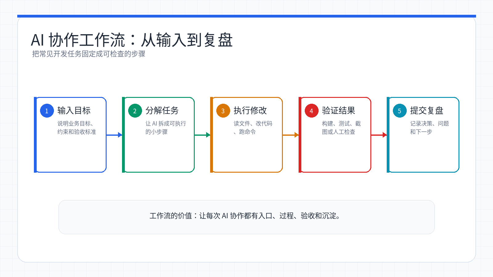
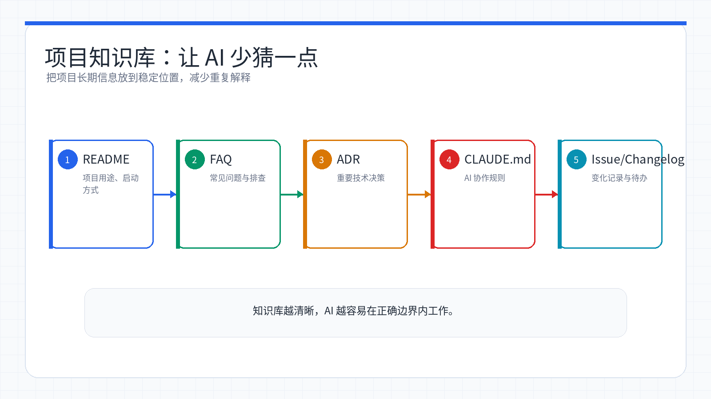

# Week 09：Workflow——AI 辅助开发工作流最佳实践

> 小林接手第一个真实项目时，面对几千个文件完全懵了。她不知道从哪下手，不知道怎么改代码才不会搞乱整个系统，也不知道该怎么和 Claude Code 配合才能高效完成任务。直到她摸索出一套系统化的工作流，才发现 AI 辅助开发不是「随便问问」，而是一门需要章法的手艺。

<ChapterIntroduction duration="约 2.5 小时" output="一套可复用的 AI 辅助开发工作流模板，以及针对新功能开发、Bug 修复、代码重构、代码审查的实战操作手册" prerequisite="学完前面章节的 Claude Code 基础和 Git 工作流" :tags="['工作流', '最佳实践', '团队协作', '代码审查', '项目管理']">

本章带你建立一套系统化的 AI 辅助开发工作流。我们不只讲概念，而是把每个开发场景（新功能、修 Bug、重构、审查）都拆解成可执行的步骤，配上真实的对话示例和代码对比。学完这章，你会知道在什么时候该让 AI 做什么、自己把关什么，让 AI 从「偶尔帮忙」变成「可靠搭档」。

</ChapterIntroduction>

<StepBar :active="0" :items="[
  { title: '① 理解边界', description: 'AI 能做什么、不能做什么' },
  { title: '② 项目策略', description: '不同项目类型的开发策略' },
  { title: '③ 常见任务', description: '新功能、Bug、重构、审查的完整流程' },
  { title: '④ 知识库', description: '建立项目知识库提升协作效率' }
]" />

---

## 小林的故事：从手忙脚乱到游刃有余

小林第一次接手公司的电商项目时，项目经理给了她一个需求：「加个优惠券功能」。她打开代码库，看到 3000 多个文件，完全不知道从哪开始。

她试着问 Claude Code：「帮我加个优惠券功能」。Claude Code 生成了一堆代码，但风格和项目完全不一样，而且不知道该放在哪个目录。她手动调整了半天，结果测试时发现和现有的订单系统对不上。

这次失败让小林意识到：**AI 不是魔法棒，挥一下就能解决问题。它需要正确的引导、清晰的上下文、以及你的把关。**

经过几个月的摸索，小林总结出了一套工作流。现在她接到新需求时，会先让 AI 帮她分析项目结构、找到参考代码、理解现有规范，然后再一步步实现。这套流程让她的开发效率提升了 3 倍，而且代码质量更稳定。

这一章，我们就来学习小林总结的这套工作流。

---

## 第一步：理解 AI 的能力边界

在开始使用 AI 辅助开发之前，我们需要先理解 AI 能做什么、不能做什么。这样才能建立正确的协作方式。

### AI 擅长什么

<InfoCard icon="✅" variant="success">

**AI 的强项：**

1. **快速生成代码框架** - 根据描述生成基础代码结构
2. **阅读和分析代码** - 几秒钟读完几千行代码，找到关键部分
3. **发现明显问题** - 语法错误、常见安全漏洞、代码规范问题
4. **重复性工作** - 批量重命名、格式化、生成文档注释
5. **提供多种方案** - 针对同一问题给出不同的实现思路

</InfoCard>

小林的理解方式：把 AI 想象成一个很聪明但需要明确指令的助手。它能根据你的描述快速生成代码框架，也能在几秒钟内读完几千行代码找到你要的部分。遇到明显的语法错误、常见的安全漏洞，它也能帮你发现。那些重复性的工作，比如批量重命名变量、格式化代码、生成文档注释，交给它最合适不过。

### AI 不擅长什么

<InfoCard icon="⚠️" variant="warning">

**AI 的局限：**

1. **不了解业务逻辑** - 除非你详细告诉它，否则它不知道你们公司的订单流程
2. **无法做技术决策** - 架构设计、技术选型需要你的经验和判断
3. **不知道团队规范** - 你们的特殊约定（如「所有 API 都要加日志」）需要明确告知
4. **生成的代码需审查** - 可能看起来对但实际有问题，可能忽略边界情况
5. **知识有时效性** - 非常新的技术可能不了解

</InfoCard>

小林踩过的坑：有一次她让 Claude Code 实现支付功能，AI 生成的代码逻辑看起来没问题，但没有做金额校验。如果用户篡改前端数据，就能用 0.01 元买任何商品。这个漏洞差点上线，幸好代码审查时被发现了。

**教训：AI 生成的代码必须审查和测试，尤其是涉及安全、金额、权限的部分。**

### 正确的协作方式

理解了 AI 的能力边界，协作方式就清楚了：

| 方式 | 对话路径 | 结果 |
|---|---|---|
| ❌ 错误方式 | 你：帮我做个电商网站 → AI 生成一堆代码 → 直接复制粘贴，没有审查 | 代码风格不统一，有安全漏洞，测试不通过 |
| ✅ 正确方式 | 你：我要加优惠券功能，先帮我分析项目结构 → AI 分析订单和促销代码 → 参考满减活动实现优惠券 → 审查、测试、确认后提交 | 代码符合项目规范，功能正确，质量有保障 |

**分工原则：**
- **你负责：** 想清楚要做什么、做决策、把关质量
- **AI 负责：** 执行具体的编码工作、查找信息、发现明显问题

就像你和一个初级开发者合作一样——你告诉他要做什么，他去实现，然后你审查代码。区别是 AI 的执行速度快得多，但判断力不如人。

---

## 第二步：不同项目类型的开发策略

不同类型的项目，开发方式和 AI 使用策略也不一样。选择合适的策略可以大大提高开发效率。

### 策略 1：全新项目（从零开始）

**项目特点：**
- 没有历史包袱，可以自由设计
- 需要建立项目结构和代码规范
- 适合快速迭代和试错

**小林的经验：** 她做毕业设计时就是从零开始。这种情况下 AI 最有用，因为没有历史代码的约束，可以让 AI 快速搭建框架。

<StepBar :active="0" :items="[
  { title: '规划结构', description: '让 AI 帮你设计项目架构' },
  { title: '搭建框架', description: '创建基础代码和配置' },
  { title: '逐个实现', description: '按优先级实现功能模块' }
]" />

**实战示例：**

<AiChat>
<AiChatMessage role="user">
我要做一个任务管理应用，功能包括：
- 用户注册和登录
- 创建、编辑、删除任务
- 任务分类和标签
- 任务提醒

请帮我：
1. 推荐合适的技术栈
2. 设计项目目录结构
3. 规划数据库表结构
</AiChatMessage>

<AiChatMessage role="assistant">
好的，我来帮你规划这个任务管理应用。

**推荐技术栈：**
- 前端：React + TypeScript + Vite
- 后端：Node.js + Express + PostgreSQL
- 认证：JWT
- 部署：Vercel（前端）+ Railway（后端）

**项目目录结构：**
```
task-manager/
├── client/              # 前端
│   ├── src/
│   │   ├── components/  # React 组件
│   │   ├── pages/       # 页面
│   │   ├── api/         # API 调用
│   │   └── types/       # TypeScript 类型
│   └── package.json
├── server/              # 后端
│   ├── src/
│   │   ├── routes/      # 路由
│   │   ├── models/      # 数据模型
│   │   ├── middleware/  # 中间件
│   │   └── utils/       # 工具函数
│   └── package.json
└── README.md
```

**数据库表结构：**
- users: 用户表（id, email, password_hash, created_at）
- tasks: 任务表（id, title, description, user_id, category_id, due_date, completed）
- categories: 分类表（id, name, user_id）
- tags: 标签表（id, name）
- task_tags: 任务标签关联表（task_id, tag_id）

需要我开始创建项目结构吗？
</AiChatMessage>
</AiChat>

**关键点：**
- 一开始就建立好代码规范，让 AI 按照规范生成代码
- 每完成一个功能模块就测试验证
- 及时更新项目文档（CLAUDE.md）

### 策略 2：成熟项目（已有大量代码）

**项目特点：**
- 代码量大，有历史规范
- 需要保持代码风格一致性
- 修改需要考虑影响范围

**小林的经验：** 她在公司接手的电商项目就是这种。有 3000+ 文件，改一个地方可能影响其他功能。这时候最重要的是**先理解再动手**。

<StepBar :active="0" :items="[
  { title: '了解结构', description: '让 AI 分析项目架构' },
  { title: '找参考代码', description: '找到类似功能的实现' },
  { title: '模仿风格', description: '保持代码风格一致' }
]" />

**实战示例：**

<AiChat>
<AiChatMessage role="user">
这是一个电商项目，我需要添加优惠券功能。
请帮我：
1. 分析项目的整体结构
2. 找到订单相关的代码
3. 看看其他促销活动（如满减、折扣）是怎么实现的
</AiChatMessage>

<AiChatMessage role="assistant">
我来帮你分析项目结构。

[分析代码中...]

**项目结构分析：**
- 这是一个前后端分离的项目
- 后端使用 Express + MySQL
- 促销相关代码在 `server/src/promotions/` 目录

**订单相关代码：**
- `server/src/orders/orderModel.js` - 订单数据模型
- `server/src/orders/orderController.js` - 订单业务逻辑
- `server/src/orders/orderRoutes.js` - 订单 API 路由

**现有促销活动实现：**

我找到了满减活动的实现（`server/src/promotions/fullReduction.js`），它的实现方式是：
1. 在 `promotions` 表存储活动配置
2. 在订单计算时调用 `applyPromotion()` 方法
3. 返回折扣金额和活动信息

优惠券功能可以参考这个模式实现。需要我按照这个风格实现优惠券功能吗？
</AiChatMessage>

<AiChatMessage role="user">
好的，参考满减活动的实现方式，帮我实现优惠券功能。保持相同的代码风格和目录结构。
</AiChatMessage>
</AiChat>

<InfoCard icon="💡" variant="tip">

小林的心得：在成熟项目中，「找参考代码」这一步特别重要。让 AI 先看看项目里类似功能是怎么实现的，然后模仿那个风格，这样生成的代码才能和项目融为一体。

</InfoCard>

### 策略 3：快速原型（验证想法）

**项目特点：**
- 追求速度，不太在意代码质量
- 用于验证产品想法或技术方案
- 可能会被丢弃或重写

**小林的经验：** 她做产品原型时就用这种方式。目标是快速验证想法，代码能跑就行。

**工作流：直接描述需求，快速实现**

```
你：做一个简单的待办事项应用，要求：
- 能添加、删除、标记完成任务
- 数据存储在本地
- 界面简洁，能用就行

[AI 快速生成代码]

你：加个搜索功能
你：改成深色主题
你：添加任务分类
```

**关键点：**
- 不用太在意代码质量和规范
- 快速验证想法，及时调整方向
- 如果原型成功，后续需要重构

### 策略 4：维护项目（修 Bug 为主）

**项目特点：**
- 代码已经稳定，主要是修复问题
- 需要快速定位问题
- 修改要谨慎，避免引入新问题

**小林的经验：** 她负责维护公司的老项目时，最怕的就是改一个 Bug 引入三个新 Bug。所以她的原则是：**小心求证，谨慎修改**。

<StepBar :active="0" :items="[
  { title: '定位问题', description: '找到出错的代码' },
  { title: '分析根因', description: '理解为什么会出错' },
  { title: '实施修复', description: '修复并添加防御性代码' }
]" />

**实战示例：**

<AiChat>
<AiChatMessage role="user">
用户反馈：点击「提交订单」按钮后，页面卡住不动
浏览器控制台报错：TypeError: Cannot read property 'id' of undefined
错误发生在 checkout.js 第 45 行

请帮我：
1. 分析可能的原因
2. 找到相关的代码
3. 检查数据流向
</AiChatMessage>

<AiChatMessage role="assistant">
我来帮你分析这个问题。

[读取 checkout.js 文件...]

**问题定位：**
第 45 行代码：`const userId = user.id;`

**可能的原因：**
1. `user` 对象为 `undefined` 或 `null`
2. 用户未登录，但代码没有检查登录状态
3. 登录状态过期，但前端没有刷新

**数据流向分析：**
- `user` 对象来自 `getUserInfo()` 函数
- 该函数从 localStorage 读取用户信息
- 如果 token 过期，会返回 null

**根本原因：**
代码没有检查用户是否登录就直接访问 `user.id`，导致报错。

需要我实施修复吗？
</AiChatMessage>

<AiChatMessage role="user">
好的，修复这个问题，要求：
1. 添加防御性代码，检查 user 是否存在
2. 如果 user 不存在，跳转到登录页
3. 添加友好的错误提示
</AiChatMessage>
</AiChat>

---

## 第三步：常见开发任务的完整工作流

在日常开发中，我们会遇到各种不同的任务。下面介绍几种最常见任务的 AI 辅助工作流。



*AI 协作工作流：把输入、分解、执行、验证和复盘串成可检查的闭环。*

### 任务 1：开发新功能

**场景：** 产品经理给了你一个新需求，需要实现一个新功能。

小林把这个流程拆成了 5 个步骤，每一步都明确了谁做什么。

<StepBar :active="0" :items="[
  { title: '① 理解需求', description: '你自己完成' },
  { title: '② 了解现有代码', description: '让 AI 帮你' },
  { title: '③ 制定计划', description: '和 AI 一起' },
  { title: '④ 实现功能', description: 'AI 生成，你审查' },
  { title: '⑤ 测试验证', description: '你自己完成' }
]" />

**步骤 1：理解需求**（你自己完成）

在开始编码之前，先搞清楚：
- 要实现什么功能？
- 输入和输出是什么？
- 有哪些边界条件和异常情况？
- 性能和安全要求是什么？

**步骤 2：了解现有代码**（让 AI 帮你）

<AiChat>
<AiChatMessage role="user">
我需要实现用户评论功能，请帮我：
1. 看看项目中有没有类似的功能
2. 找到用户数据和文章数据的存储方式
3. 了解项目的数据库操作规范
</AiChatMessage>

<AiChatMessage role="assistant">
我来帮你分析项目。

[分析代码中...]

**类似功能：**
项目中已经有「点赞」功能（`models/like.js`），实现方式可以参考。

**数据存储方式：**
- 用户数据：`models/user.js`，使用 Sequelize ORM
- 文章数据：`models/article.js`，同样使用 Sequelize

**数据库操作规范：**
- 所有模型都继承自 `BaseModel`
- 使用 `async/await` 处理异步操作
- 错误统一通过 `ApiError` 类抛出

建议评论功能也遵循这个模式。
</AiChatMessage>
</AiChat>

**步骤 3：制定实现计划**（和 AI 一起）

<AiChat>
<AiChatMessage role="user">
基于刚才的分析，实现评论功能需要：
1. 创建评论数据模型
2. 实现评论的增删改查 API
3. 在前端添加评论展示和发表功能

请帮我确认这个计划是否合理，有没有遗漏的地方
</AiChatMessage>

<AiChatMessage role="assistant">
计划整体合理，但建议补充以下内容：

**数据模型层面：**
- 添加评论嵌套回复的支持（parent_id 字段）
- 添加评论状态字段（待审核/已发布/已删除）

**API 层面：**
- 添加权限控制（只能删除自己的评论）
- 添加分页功能（避免一次加载太多评论）
- 添加评论数量统计接口

**前端层面：**
- 添加评论输入验证（长度限制、敏感词过滤）
- 添加加载状态和错误提示

完善后的计划更加完整。需要我开始实现吗？
</AiChatMessage>
</AiChat>

**步骤 4：实现功能**（AI 生成，你审查）

<AiChat>
<AiChatMessage role="user">
按照计划，先实现评论数据模型
要求：
- 包含评论内容、作者、文章 ID、创建时间
- 支持评论的嵌套回复
- 添加必要的索引
</AiChatMessage>

<AiChatMessage role="assistant">
好的，我来创建评论数据模型。

[创建 models/comment.js...]

已创建评论模型，包含以下字段：
- id: 主键
- content: 评论内容
- userId: 作者 ID（外键关联 users 表）
- articleId: 文章 ID（外键关联 articles 表）
- parentId: 父评论 ID（用于嵌套回复）
- status: 评论状态（pending/published/deleted）
- createdAt: 创建时间
- updatedAt: 更新时间

已添加索引：
- articleId（加速查询文章的所有评论）
- userId（加速查询用户的所有评论）
- parentId（加速查询子评论）

接下来实现 API 接口吗？
</AiChatMessage>
</AiChat>

**AI 生成的评论模型代码：**

```javascript
// models/comment.js
const { DataTypes } = require('sequelize');
const BaseModel = require('./base');

class Comment extends BaseModel {
  static init(sequelize) {
    return super.init({
      content: {
        type: DataTypes.TEXT,
        allowNull: false,
        validate: { len: [1, 1000] }
      },
      userId: { type: DataTypes.INTEGER, allowNull: false },
      articleId: { type: DataTypes.INTEGER, allowNull: false },
      parentId: { type: DataTypes.INTEGER, allowNull: true },
      status: {
        type: DataTypes.ENUM('pending', 'published', 'deleted'),
        defaultValue: 'published'
      }
    }, {
      sequelize,
      tableName: 'comments',
      indexes: [
        { fields: ['articleId'] },
        { fields: ['userId'] },
        { fields: ['parentId'] }
      ]
    });
  }
}

module.exports = Comment;
```

**步骤 5：测试验证**（你自己完成）

- 手动测试主要流程
- 测试边界情况（空内容、超长内容等）
- 测试权限控制（不能删除别人的评论）
- 让 AI 帮你写自动化测试

<InfoCard icon="🎯" variant="success">

小林的经验：这个五步流程她现在已经用得很熟练了。关键是**不要跳步**——尤其是第 1 步（理解需求）和第 5 步（测试验证），这两步必须自己做，不能偷懒。AI 可以帮你写代码，但不能替你理解需求和保证质量。

</InfoCard>

### 任务 2：修复 Bug

**场景：** 用户报告了一个问题，需要快速定位和修复。

小林总结的 Bug 修复流程特别强调「定位」这一步——找对地方比改代码重要得多。

<StepBar :active="0" :items="[
  { title: '① 收集信息', description: '你自己完成' },
  { title: '② 定位问题', description: '让 AI 帮你' },
  { title: '③ 分析根因', description: '和 AI 一起' },
  { title: '④ 实施修复', description: 'AI 生成，你审查' },
  { title: '⑤ 验证修复', description: '你自己完成' }
]" />

**实战案例：登录状态丢失问题**

<AiChat>
<AiChatMessage role="user">
用户反馈：登录后刷新页面就退出了

请帮我：
1. 分析可能的原因
2. 找到 token 相关的代码
3. 检查 token 的存储方式
</AiChatMessage>

<AiChatMessage role="assistant">
我来帮你分析这个问题。

[分析代码中...]

**问题定位：**
找到了 token 相关代码在 `utils/auth.js`

**当前实现：**
```javascript
// 登录时存储 token
sessionStorage.setItem('token', token);

// 获取 token
const token = sessionStorage.getItem('token');
```

**问题原因：**
token 存储在 `sessionStorage` 中，刷新页面后 sessionStorage 会清空，导致 token 丢失。

**解决方案：**
改用 `localStorage` 存储 token，这样刷新页面后 token 不会丢失。

需要我实施修复吗？
</AiChatMessage>

<AiChatMessage role="user">
好的，修复这个问题
</AiChatMessage>
</AiChat>

**修复 token 存储问题：**

```diff
- sessionStorage.setItem('token', token); // 刷新页面会丢失
+ localStorage.setItem('token', token); // 刷新页面不会丢失

+export function isTokenValid() {
+  const token = getToken();
+  if (!token) return false;
+  try {
+    const payload = JSON.parse(atob(token.split('.')[1]));
+    return payload.exp * 1000 > Date.now();
+  } catch (e) {
+    return false;
+  }
+}
```

<InfoCard icon="⚠️" variant="warning">

小林踩过的坑：修复 Bug 时最容易犯的错误是「头痛医头，脚痛医脚」。这次她不仅改了存储方式，还加了 token 过期检查，避免类似问题再次出现。这就是「防御性编程」——不只修当前的问题，还要防止未来的问题。

</InfoCard>

### 任务 3：重构代码

**场景：** 代码变得难以维护，需要重构以提高代码质量。

小林最怕重构，因为改一个地方可能影响其他功能。后来她学会了「先写测试，再重构」，就不怕了。

<StepBar :active="0" :items="[
  { title: '① 确定目标', description: '你自己完成' },
  { title: '② 制定计划', description: '和 AI 一起' },
  { title: '③ 准备安全网', description: '让 AI 帮你写测试' },
  { title: '④ 逐步重构', description: 'AI 执行，你验证' },
  { title: '⑤ 验证结果', description: '你自己完成' }
]" />

**实战案例：提取重复代码**

小林发现项目中有三个函数（getUserList、getArticleList、getCommentList）有很多重复代码，都是做分页、排序、筛选。她决定重构。

<AiChat>
<AiChatMessage role="user">
这三个函数有很多重复代码，都是做分页、排序、筛选。

```javascript
// getUserList
async function getUserList(page, pageSize, sortBy) {
  const offset = (page - 1) * pageSize;
  const users = await User.findAll({
    limit: pageSize,
    offset: offset,
    order: [[sortBy, 'DESC']]
  });
  const total = await User.count();
  return { data: users, total, page, pageSize };
}

// getArticleList
async function getArticleList(page, pageSize, sortBy) {
  const offset = (page - 1) * pageSize;
  const articles = await Article.findAll({
    limit: pageSize,
    offset: offset,
    order: [[sortBy, 'DESC']]
  });
  const total = await Article.count();
  return { data: articles, total, page, pageSize };
}

// getCommentList - 类似的重复代码
```

请帮我：
1. 分析重复的部分
2. 提出重构方案
3. 评估重构的风险
</AiChatMessage>

<AiChatMessage role="assistant">
我分析了这三个函数，它们的主要区别只是操作的模型不同（User/Article/Comment），其他逻辑完全一样。

**重复的部分：**
- 分页计算（offset）
- 查询逻辑（findAll + count）
- 返回格式

**重构方案：**
提取通用的 `getList` 函数，将模型作为参数传入：

```javascript
async function getList(Model, page, pageSize, sortBy) {
  const offset = (page - 1) * pageSize;
  const data = await Model.findAll({
    limit: pageSize,
    offset: offset,
    order: [[sortBy, 'DESC']]
  });
  const total = await Model.count();
  return { data, total, page, pageSize };
}
```

**风险评估：**
- 风险等级：低
- 影响范围：三个函数的调用方
- 建议：先写测试用例，确保重构后功能不变

需要我先帮你写测试用例吗？
</AiChatMessage>

<AiChatMessage role="user">
好的，先帮我写测试用例
</AiChatMessage>

<AiChatMessage role="assistant">
我来为这三个函数写测试用例。

[创建 tests/list.test.js...]

已创建测试用例，覆盖了：
- 正常分页查询
- 边界情况（第一页、最后一页）
- 排序功能
- 空结果处理

运行测试：`npm test tests/list.test.js`

测试通过后，我们就可以安全地重构了。
</AiChatMessage>
</AiChat>

**重构：提取通用列表函数：**

```diff
-async function getUserList(page, pageSize, sortBy) { /* 重复分页、排序、统计 */ }
-async function getArticleList(page, pageSize, sortBy) { /* 重复分页、排序、统计 */ }
-async function getCommentList(page, pageSize, sortBy) { /* 重复分页、排序、统计 */ }
+async function getList(Model, page, pageSize, sortBy = 'createdAt') {
+  const offset = (page - 1) * pageSize;
+  const data = await Model.findAll({
+    limit: pageSize,
+    offset,
+    order: [[sortBy, 'DESC']]
+  });
+  const total = await Model.count();
+  return { data, total, page, pageSize };
+}
+
+async function getUserList(page, pageSize, sortBy) {
+  return getList(User, page, pageSize, sortBy);
+}
```

<InfoCard icon="✅" variant="success">

小林的心得：重构的关键是「小步快跑」。不要一次改太多，每改一点就跑一次测试。这次重构她分了三步：1) 写测试 2) 提取通用函数 3) 更新调用方。每一步都确认测试通过，才进行下一步。

</InfoCard>

### 任务 4：代码审查

**场景：** 同事提交了代码，需要你审查。

小林刚开始做代码审查时，只看代码能不能跑。后来她学会了用 AI 帮忙检查安全、性能、规范问题，审查质量提升了很多。

<StepBar :active="0" :items="[
  { title: '① 快速了解', description: '让 AI 帮你' },
  { title: '② 检查问题', description: '让 AI 帮你' },
  { title: '③ 深入审查', description: '你自己完成' },
  { title: '④ 给出反馈', description: '你自己完成' }
]" />

**实战案例：审查用户注册功能**

<AiChat>
<AiChatMessage role="user">
帮我审查一下这个 PR 的代码：

```javascript
// routes/auth.js
router.post('/register', async (req, res) => {
  const { email, password, username } = req.body;
  
  // 检查用户是否存在
  const existingUser = await db.query(
    `SELECT * FROM users WHERE email = '${email}'`
  );
  
  if (existingUser.length > 0) {
    return res.status(400).json({ error: '用户已存在' });
  }
  
  // 创建用户
  await db.query(
    `INSERT INTO users (email, password, username) 
     VALUES ('${email}', '${password}', '${username}')`
  );
  
  res.json({ message: '注册成功' });
});
```

请检查：
1. 有没有安全问题
2. 有没有性能问题
3. 代码质量如何
</AiChatMessage>

<AiChatMessage role="assistant">
我审查了这段代码，发现了几个严重问题：

**🔴 严重安全问题：**

1. **SQL 注入风险**（第 6 行和第 14 行）
   - 直接拼接用户输入到 SQL 语句
   - 攻击者可以输入 `' OR '1'='1` 绕过检查
   - **必须修复**

2. **密码明文存储**（第 15 行）
   - 密码没有加密直接存入数据库
   - 数据库泄露会导致所有用户密码暴露
   - **必须修复**

**⚠️ 其他问题：**

3. **缺少输入验证**
   - 没有检查 email 格式
   - 没有检查密码强度
   - 没有检查必填字段

4. **缺少错误处理**
   - 数据库操作没有 try-catch
   - 出错时会导致服务器崩溃

5. **性能问题**
   - 两次数据库查询可以合并为一次

**建议的修复方案：**
[提供修复后的代码...]

这些问题必须修复后才能合并。
</AiChatMessage>
</AiChat>

**代码审查：修复安全问题：**

```diff
-const existingUser = await db.query(
-  `SELECT * FROM users WHERE email = '${email}'`
-);
-await db.query(
-  `INSERT INTO users (email, password, username) VALUES ('${email}', '${password}', '${username}')`
-);
+body('email').isEmail().normalizeEmail();
+body('password').isLength({ min: 8 }).matches(/^(?=.*[A-Za-z])(?=.*\d)/);
+const existingUser = await db.query(
+  'SELECT * FROM users WHERE email = ?',
+  [email]
+);
+const passwordHash = await bcrypt.hash(password, 10);
+await db.query(
+  'INSERT INTO users (email, password_hash, username) VALUES (?, ?, ?)',
+  [email, passwordHash, username]
+);
```

<InfoCard icon="🔍" variant="warning">

小林的经验：代码审查时，AI 特别擅长发现安全问题和常见错误。但业务逻辑是否正确、设计是否合理，还是要靠你自己判断。她的做法是：先让 AI 扫一遍技术问题，然后自己深入审查业务逻辑。

</InfoCard>

---

## 第四步：建立项目知识库

为了让 AI 更好地理解你的项目，建议在项目中建立知识库。这样 AI 就能按照你的规范和习惯工作。



*项目知识库把 README、FAQ、ADR 和 CLAUDE.md 连接起来，让 AI 既懂项目现状，也懂团队约定。*

### 创建 CLAUDE.md 文件

在项目根目录创建 `CLAUDE.md` 文件，记录项目的关键信息：

```markdown
# 项目说明

## 项目概述
这是一个在线教育平台，提供课程管理、用户学习、作业提交等功能。

## 技术栈
- 前端：React 18 + TypeScript + Vite
- 后端：Node.js + Express + PostgreSQL
- 部署：Vercel（前端）+ Railway（后端）

## 项目结构
\`\`\`
src/
├── components/     # React 组件
├── pages/         # 页面组件
├── api/           # API 调用
├── utils/         # 工具函数
└── types/         # TypeScript 类型定义
\`\`\`

## 代码规范
- 使用 ESLint 和 Prettier 格式化代码
- 组件文件使用 PascalCase（如 UserProfile.tsx）
- 工具函数使用 camelCase（如 formatDate.ts）
- 常量使用 UPPER_SNAKE_CASE（如 API_BASE_URL）

## 开发流程
1. 从 main 分支创建功能分支
2. 开发完成后提交 PR
3. 代码审查通过后合并

## 注意事项
- 所有 API 调用都要添加错误处理
- 用户输入必须做验证和转义
- 数据库操作使用参数化查询，避免 SQL 注入
- 敏感信息（密码、token）不能记录到日志
```

<InfoCard icon="📝" variant="tip">

小林的做法：她会在 CLAUDE.md 里记录团队的特殊约定。比如「所有 API 都要加日志」、「错误码必须用枚举」、「数据库字段名用下划线命名」。这样 Claude Code 生成的代码就能自动符合团队规范。

</InfoCard>

### 记录常见问题和解决方案

在项目中创建 `docs/troubleshooting.md`，记录常见问题：

```markdown
# 常见问题

## 开发环境问题

### 问题：npm install 失败
**原因：** Node 版本不兼容
**解决方案：** 使用 Node.js 18 或更高版本

### 问题：数据库连接失败
**原因：** 环境变量未配置
**解决方案：** 复制 .env.example 为 .env，填写数据库连接信息

## 功能问题

### 问题：用户登录后刷新页面就退出
**原因：** Token 存储在 sessionStorage
**解决方案：** 改用 localStorage 存储 token
```

### 维护技术决策记录

创建 `docs/decisions/` 目录，记录重要的技术决策：

```markdown
# ADR-001: 选择 PostgreSQL 作为数据库

## 状态
已采纳

## 背景
项目需要选择一个关系型数据库，候选方案有 MySQL 和 PostgreSQL。

## 决策
选择 PostgreSQL

## 理由
1. 更好的 JSON 支持，适合存储课程内容
2. 更强大的全文搜索功能
3. 团队成员更熟悉 PostgreSQL

## 后果
- 需要学习 PostgreSQL 特有的功能
- 部署时需要 PostgreSQL 环境
```

<InfoCard icon="💡" variant="success">

小林的心得：建立项目知识库最大的好处是「一次记录，多次使用」。她把常见问题、技术决策都记录下来，新人加入团队时直接看文档就能上手，不用反复问同样的问题。而且 Claude Code 也能读这些文档，生成的代码更符合项目规范。

</InfoCard>

---

## 第五步：提高 AI 协作效率的技巧

掌握一些实用技巧，可以让你和 AI 的协作更加高效。

### 技巧 1：描述要清晰具体

| ❌ 模糊描述 | ✅ 清晰描述 |
|---|---|
| 这个功能有问题 | 用户点击「提交」按钮后，表单没有提交；控制台报错；错误发生在 `form.js` 第 23 行 |
| 帮我优化一下 | 这个列表加载很慢，有 1000 条数据；请添加分页功能，每页显示 20 条 |
| 加个新功能 | 我要加用户评论功能，要求支持嵌套回复、分页加载、权限控制 |

**关键点：**
- 提供具体的错误信息
- 说明期望的结果
- 给出相关的上下文

### 技巧 2：一次只做一件事

| ❌ 贪多 | ✅ 专注 |
|---|---|
| 一次要求实现登录、注册、找回密码、个人中心、修改密码、邮箱验证 | 先实现登录功能：邮箱和密码登录、记住登录状态、错误提示 |
| 结果：代码质量差，很多细节没考虑到 | 完成后再做注册，再做找回密码；每个功能质量更有保障 |

**关键点：**
- 将大任务拆分成小任务
- 每完成一个任务就测试验证
- 确认没问题再继续下一个

### 技巧 3：及时验证结果

<InfoCard icon="⚠️" variant="warning">

**不好的做法：**
- 让 AI 连续修改了 10 个文件
- 最后发现第一个就错了
- 浪费了大量时间

**好的做法：**
- 修改一个文件，立即测试
- 确认没问题，再继续
- 发现问题及时纠正

</InfoCard>

小林的经验：她现在养成了习惯，每次让 AI 修改代码后，都会立即运行一下看看效果。这样即使出错，也能快速定位问题。不要盲目信任 AI，要保持对代码的掌控。

### 技巧 4：善用上下文

**技巧 4.1：引用之前的对话**

```
按照刚才的方案实现
参考之前的 getUserList 函数
用刚才分析的那个模式
```

**技巧 4.2：提供相关代码**

```
这是现有的用户模型代码：
[贴上代码]

请参考这个风格实现文章模型
```

**技巧 4.3：说明项目背景**

```
这是一个电商项目，使用 React + Node.js
已经有用户系统和商品系统
现在要添加购物车功能
```

### 技巧 5：学会提问的艺术

<AiChat>
<AiChatMessage role="user">
为什么这段代码会导致内存泄漏？

```javascript
useEffect(() => {
  const timer = setInterval(() => {
    fetchData();
  }, 1000);
}, []);
```
</AiChatMessage>

<AiChatMessage role="assistant">
这段代码会导致内存泄漏，原因是：

**问题：**
`setInterval` 创建的定时器没有清理。当组件卸载时，定时器仍在运行，继续调用 `fetchData()`，导致内存泄漏。

**正确写法：**
```javascript
useEffect(() => {
  const timer = setInterval(() => {
    fetchData();
  }, 1000);
  
  // 清理函数：组件卸载时清除定时器
  return () => {
    clearInterval(timer);
  };
}, []);
```

**原理：**
React 的 useEffect 可以返回一个清理函数，这个函数会在组件卸载时执行。通过在清理函数中调用 `clearInterval`，可以确保定时器被正确清理。
</AiChatMessage>
</AiChat>

**其他好问题：**
- 实现用户认证有哪几种方案？各有什么优缺点？
- 这段代码是怎么工作的？能详细解释一下吗？
- 为什么要使用 useCallback 而不是普通函数？

---

## 常见问题解答

### Q1：AI 生成的代码能直接用吗？

**A：不能直接用，需要审查和测试。**

AI 生成的代码可能存在以下问题：
- 逻辑错误或边界情况处理不当
- 不符合项目的代码规范
- 存在安全隐患
- 性能不够优化

你需要：
- 仔细阅读生成的代码
- 理解代码的逻辑
- 测试各种情况
- 确认符合项目规范

### Q2：AI 理解错了我的意思怎么办？

**A：及时纠正，重新描述需求。**

```
不是这样的，我的意思是...
这个理解不对，应该是...
让我重新描述一下需求...
```

如果多次纠正还是不对，可以：
- 提供更多上下文信息
- 给出具体的代码示例
- 拆分成更小的任务

### Q3：遇到 AI 不会的问题怎么办？

**A：AI 不是万能的，有些问题需要你自己解决。**

AI 可能无法解决的问题：
- 非常新的技术（AI 的知识有截止日期）
- 你们团队特有的业务逻辑
- 需要访问外部系统的问题
- 复杂的性能优化问题

这时你需要：
- 查阅官方文档
- 搜索相关解决方案
- 咨询有经验的同事
- 在社区提问

### Q4：怎么判断 AI 的建议是否合理？

**A：用你的经验和知识判断。**

评估标准：
- 是否符合最佳实践
- 是否考虑了边界情况
- 是否有潜在的安全风险
- 是否符合项目的技术栈
- 性能是否可接受

如果不确定，可以：
- 让 AI 解释为什么这样做
- 请求提供其他方案
- 咨询团队成员

### Q5：团队协作时怎么用 AI？

**A：建立共同的规范和知识库。**

团队协作建议：
- 共享项目的 CLAUDE.md 配置
- 统一代码规范和风格
- 记录常见问题的解决方案
- 定期分享有用的提示词
- 在代码审查时检查 AI 生成的代码

### Q6：如何避免过度依赖 AI？

**A：保持学习和思考，AI 是辅助工具而不是替代品。**

建议：
- 理解 AI 生成的代码，不要盲目复制
- 遇到不懂的概念，主动学习
- 定期复习基础知识
- 尝试自己解决问题，再用 AI 验证
- 参与代码审查，学习他人的经验

---

## 本周回顾

小林这一章从「手忙脚乱」走到了「游刃有余」。下面对照检查你掌握得怎么样。

<ProgressTracker title="Week 09 学习进度" :items="[
  { title: '理解 AI 能力边界', description: '能说清 AI 擅长什么、不擅长什么，以及正确的协作方式', done: false },
  { title: '掌握项目策略', description: '能根据项目类型（全新/成熟/原型/维护）选择合适的开发策略', done: false },
  { title: '熟练常见任务流程', description: '能独立完成新功能开发、Bug 修复、代码重构、代码审查的完整流程', done: false },
  { title: '建立项目知识库', description: '会创建 CLAUDE.md、troubleshooting.md、技术决策记录', done: false },
  { title: '掌握协作技巧', description: '能清晰描述需求、一次做一件事、及时验证、善用上下文', done: false },
  { title: '养成良好习惯', description: '不盲目信任 AI、保持学习、理解代码、把关质量', done: false }
]" />

**自测问题：**

1. **能力边界：** AI 在什么情况下最有用？什么情况下不能依赖 AI？你如何判断 AI 的建议是否合理？

2. **项目策略：** 如果你接手一个有 3000+ 文件的成熟项目，要添加新功能，你会采用什么策略？为什么要先找参考代码？

3. **工作流程：** 开发新功能的五个步骤是什么？哪些步骤必须自己做，哪些可以让 AI 帮忙？

4. **Bug 修复：** 修复 Bug 时，为什么「定位问题」比「修改代码」更重要？如何避免「头痛医头，脚痛医脚」？

5. **代码重构：** 为什么重构前要先写测试？如何降低重构的风险？

6. **代码审查：** AI 在代码审查中擅长发现什么问题？哪些问题还是要靠人来判断？

## 下周预告

掌握了工作流之后，小林开始思考：能不能把反复使用的经验沉淀下来，避免每次都重新解释项目规范和操作步骤？下一章我们将学习 **Skills**——把专业知识、工作流程和团队规范打包成可复用的技能。
