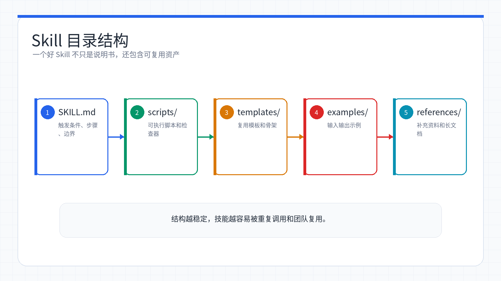
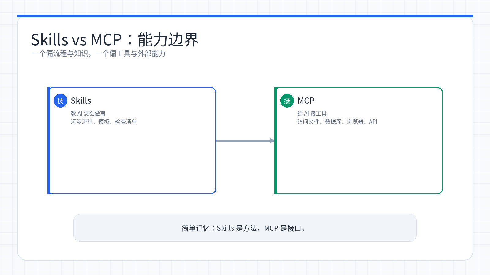

# Week 10：Skills——给 Claude Code 装上「技能包」

> 小林用了几周 Claude Code，发现每次都要重复解释「代码风格要怎样」「提交信息要符合什么规范」。直到她听说有个叫 Skills 的东西，可以把这些要求写成「技能包」，让 Claude Code 一次学会、永久记住。那一刻她意识到，AI 编程不只是对话，更是知识沉淀。

<ChapterIntroduction duration="约 2.5 小时" output="至少 3 个自定义 Skill，一份可提交到 Git 的 .claude/skills/ 目录，以及用自然语言驱动技能的实操流程" prerequisite="学完前几章 Claude Code 基础" :tags="['Skills', 'Claude Code', '知识管理', '工作流', '自动化', '团队协作']">

本章带你搞懂 Skills 到底是什么、为什么它能让 Claude Code 从「通用助手」变成「团队专家」，以及怎么一步步创建、安装、管理自己的技能包。我们不只讲概念，而是把每一个 SKILL.md 的字段、每一种触发方式、每一个实战案例都过一遍。学完这章，你的 Claude Code 就不再需要重复指令，而是一个「有经验、懂规矩」的数字员工。

</ChapterIntroduction>

<StepBar :active="0" :items="[
  { title: '① 认识 Skills', description: '理解技能包本质与价值' },
  { title: '② 安装与使用', description: 'find-skills、社区技能、实战体验' },
  { title: '③ 创建自定义 Skills', description: 'SKILL.md 结构、创建方法、最佳实践' }
]" />

* * *

## 什么是 Claude Code Skills？

小林的第一个问题很朴素：这个 Skills 到底是啥？

**Claude Code Skills** 是一种将专业知识、工作流程和最佳实践打包成「可复用技能包」的功能。

想象一下，Skills 就像是给 Claude 配备的「技能书」——当你需要它完成特定任务时，它不再需要你一遍遍地解释要求，而是直接按照预先定义好的技能标准来执行工作。

小林的理解方式：如果 Claude Code 是一个新员工，那 Skills 就是公司的「操作手册」——代码审查怎么做、Git 提交信息怎么写、测试用例怎么生成，全都写在手册里。新员工不用每次问，翻手册就行。

## 为什么需要 Skills？

在没有 Skills 之前，小林使用 Claude Code 时遇到这些问题：

-   **重复指令**：每次都要解释「代码要符合什么风格」「提交信息要怎么写」
-   **知识无法沉淀**：团队成员各自的使用经验无法共享
-   **标准不统一**：不同的人用 Claude，结果可能完全不同
-   **效率低下**：常见的任务每次都要从头解释

Skills 解决了这些问题，让 Claude 变成一个「有经验的团队成员」——它知道你的项目规范、工作流程和最佳实践。

### Skills 正在成为 AI 工程师的必备技能

小林在学习过程中发现，Skills 不是小众功能，而是整个 AI 编程社区都在推的方向：

-   **社区热度高**：GitHub 上相关仓库星标快速增长，OpenSkills 项目已收获 7.2k stars
-   **官方支持**：Anthropic 官方维护 Skills 仓库，Vercel 推出 find-skills 工具
-   **实用性强**：从代码审查、Git 操作到视频制作、PPT 生成，覆盖多种场景
-   **效率提升**：一次配置，反复使用，让 Claude 真正成为你的「数字员工」

0

① 认识 Skills

理解技能包本质与价值

0

② 安装与使用

find-skills、社区技能、实战体验

0

③ 创建自定义 Skills

SKILL.md 结构、创建方法、最佳实践

* * *

## 快速开始：安装第一个 Skill

理解了 Skills 的价值后，让我们马上动手体验！本节会带你安装第一个 Skill，并完成几个有趣的实战任务。

### 第一步：安装 find-skills（强烈推荐必装）

在开始使用 Skills 之前，强烈推荐先安装 `find-skills` —— 这是 AI Agent 领域的「技能搜索神器」。

**find-skills 是什么？**

简单来说，find-skills 就像是 AI Agent 的「应用商店搜索器」。当你需要完成某个任务但本地没有对应的 Skill 时，它会自动帮你搜索并推荐最合适的 Skill。

**安装 find-skills**：

```bash
npx skills add vercel-labs/skills@find-skills -g -y
```

安装完成后，你就可以直接告诉 Claude 你的需求，它会通过 find-skills 自动搜索相关技能。

**使用示例**：

🤖

AI 助手

在线

我需要做一个 React 组件的性能优化，帮我找找有什么技能可以用

👤

🤖

我来帮你搜索相关 Skills。可以考虑 react-performance（专注 useMemo、useCallback、代码分割等优化）或 frontend-design（官方技能，关注高质量前端实现和性能陷阱）。你想安装哪一个？

**为什么推荐先装 find-skills？**

没有 find-skills 之前：手动在 GitHub 搜索相关技能 → 逐个复制、安装、配置 → 反复调试适配

有了 find-skills 之后：一句话描述需求 → AI 自动搜索最匹配的技能 → 一键安装，立即可用

### 第二步：体验 Remotion 视频制作

安装 find-skills 后，让我们用它来搜索并安装第一个好玩的 Skill —— Remotion 视频制作工具。

**用 find-skills 搜索 Remotion**：

```
帮我找找 Remotion 相关的技能，我想做视频
```

Claude 会通过 find-skills 搜索，推荐 `remotion-dev/skills`。

**安装 Remotion Skills**：

```bash
npx skills add remotion-dev/skills -g
```

**用它做个炫酷的文字动画视频**：

```
用 Remotion 做一个视频：
- 1920x1080，5 秒
- 一行文字 "Hello World" 从左边飞进来
- 同时带旋转和缩放效果
- 背景是渐变色
```

Claude 会生成完整的 Remotion 代码，你可以运行它看到动画效果。

### 第三步：frontend-design 让界面变好看

小林的前端页面总是被吐槽「看起来很土」，她用 find-skills 找到了解决方案。

**用自然语言描述问题**：

```
我的网页看起来很土，而且加载很慢，帮我找找有什么技能可以用
```

**Claude 会推荐**：

**anthropics/skills/frontend-design**（官方技能）

这个技能专门解决 AI 生成的界面「看起来很土」的问题，让 Claude 设计出：

-   独特的视觉风格（避开千篇一律的「AI 模板感」）
-   专业的配色和字体
-   流畅的动画效果
-   生产级别的代码质量

**安装并使用**：

```bash
npx skills add anthropics/skills/frontend-design -g
```

```
帮我重新设计这个页面，要看起来很专业，别像 AI 生成的
```

### 第四步：frontend-slides 快速制作精美 PPT

小林还发现了一个超实用的技能——用自然语言创建精美的 HTML 演示文稿。

**frontend-slides** 的核心特点是「展示而非讲述」：当你描述不出想要的设计风格时，它会生成 3 个视觉预览让你选择。

**安装**：

```bash
mkdir -p ~/.claude/skills/frontend-slides
# 从 GitHub 下载 SKILL.md 和 STYLE_PRESETS.md
# https://github.com/zarazhangrui/frontend-slides
```

**使用场景**：

```
/frontend-slides

我想创建一个 AI 创业项目的融资路演 PPT，大概 10 页
```

Claude 会引导你：

1.  询问每页内容（标题、要点、图片）
2.  询问你想要的感觉（惊艳？专业？温馨？）
3.  生成 3 个视觉风格预览供你选择
4.  创建完整的 HTML 演示文稿
5.  在浏览器中打开预览

**内置的视觉风格**：

风格名称

特点

适用场景

**Neon Cyber**

未来科技感、粒子效果

技术分享、AI 产品

**Midnight Executive**

高端商务、值得信赖

商务汇报、融资路演

**Paper & Ink**

编辑风格、文学气息

内容创作、教育分享

**Swiss Modern**

简洁几何、包豪斯风格

设计作品、极简主义

**Brutalist**

原始大胆、抓人眼球

艺术展示、个性表达

生成的演示文稿是一个**单文件 HTML**，包含完整的样式和交互代码，零依赖，10 年后还能打开。

### 查看已安装的 Skills

安装完成后，你不需要做任何额外配置。当你向 Claude 提出相关任务时，它会自动调用对应的 Skill。

查看已安装的 Skills：

```bash
npx skills list
```

**小林的体会**：这三个 Skills 让她意识到，AI 编程不只是「写代码」，还能做视频、做设计、做 PPT。更重要的是，这些能力都是「装上去」的——今天装视频制作，明天装数据分析，后天装代码审查，Claude Code 就像一个可以无限扩展的工具箱。

0

① 认识 Skills

理解技能包本质与价值

0

② 安装与使用

find-skills、社区技能、实战体验

0

③ 创建自定义 Skills

SKILL.md 结构、创建方法、最佳实践

* * *

## Skills 的核心概念

体验过几个 Skills 后，小林开始想深入理解它的工作原理。



*一个 Skill 通常由入口说明、辅助脚本、模板和参考资料组成，按需加载进对话。*

### Skills 是什么？

**Skills 是存储在文件系统中的「技能包」**，包含：

-   **SKILL.md**：技能的定义文件（必需）
-   **scripts/**：辅助脚本（可选）
-   **templates/**：输出模板（可选）
-   **references/**：参考文档（可选）

### Skills vs 提示词

你可能会有疑问：Skills 和直接给 Claude 发提示词有什么区别？

对比项

传统提示词方式

使用 Skills

使用方式

每次对话都要重复审查规范、输出格式和检查清单

创建一次 `review-pr` skill，之后用 `/review-pr` 或自然语言触发

持久性

临时存在于对话历史中

存在 `~/.claude/skills/review-pr/SKILL.md`

上下文成本

反复占用 Token

按需加载，节省 Token

团队协作

难以共享和版本控制

可以用 Git 管理并在团队中共享

### Skills 的两种类型

**全局 Skills（个人）**：

-   存放位置：`~/.claude/skills/`
-   作用范围：所有项目
-   适用场景：个人通用技能（代码风格、Git 习惯）

**项目 Skills（团队）**：

-   存放位置：`项目目录/.claude/skills/`
-   作用范围：当前项目
-   适用场景：团队共享、项目特定规范

小林的选择策略：个人习惯（比如她喜欢的代码注释风格）放全局，团队规范（比如公司的 Git 提交规范）放项目级。这样换项目时不会把个人习惯带过去，也不会丢掉团队标准。

### Skills 如何工作

当 Claude Code 启动时，它会：

1.  扫描 Skills 目录（`~/.claude/skills/` 和 `.claude/skills/`）
2.  解析每个 SKILL.md 文件
3.  提取 YAML frontmatter 元数据
4.  将技能内容加入「知识库」
5.  根据 description 自动匹配触发

```
用户："帮我审查这个 PR"
         ↓
Claude 识别关键词 "审查" "PR"
         ↓
匹配到 review-pr skill 的 description
         ↓
加载 SKILL.md 完整内容
         ↓
按照技能定义的流程执行
```

## SKILL.md 文件结构

小林决定自己动手创建一个 Skill，首先要搞懂 SKILL.md 的结构。

### 基本结构

一个完整的 Skill 目录是这样的：

```
my-skill/
├── SKILL.md          # 必需：技能定义文件
├── scripts/          # 可选：辅助脚本
├── templates/        # 可选：输出模板
├── references/       # 可选：参考文档
└── examples/         # 可选：示例文件
```

### SKILL.md 模板

SKILL.md 文件分为两个部分：

**第一部分：YAML Frontmatter（元数据）**

```yaml
---
name: skill-name              # 技能名称，会变成 /skill-name 命令
description: 简短描述         # 用于 Claude 自动匹配触发
category: development         # 分类
tags:                         # 标签
  - code
  - automation
---
```

**第二部分：Markdown 内容（指令）**

```markdown
# 技能标题

## 使用场景
什么时候用这个技能

## 执行步骤
1. 第一步
2. 第二步

## 注意事项
- 注意点 1
- 注意点 2
```

### 关键字段说明

字段

必填

说明

`name`

是

技能名称，只能用小写字母、数字、连字符

`description`

是

技能描述，越具体越容易被 Claude 自动匹配

`category`

否

分类标签

`tags`

否

更多分类标签

`allowed-tools`

否

允许使用的工具，无需权限即可用

**description 字段最关键**：这是 Claude 用来判断「什么时候该用这个技能」的唯一依据。写得太模糊，技能不会被触发；写得太具体，适用场景又太窄。小林的经验是：包含 2-3 个核心关键词 + 一句使用场景描述。

## Skills vs MCP：有什么区别？

很多初学者会混淆 Skills 和 MCP，小林一开始也搞不清。后来她发现，它们是完全不同的两个东西。



*Skills 告诉 AI 怎么做，MCP 给 AI 接上能用的工具和外部服务。*

### 核心区别

维度

Skills

MCP

**本质**

知识和流程

工具和接口

**提供什么**

告诉 AI「怎么做」

给 AI「能用什么」

**存储位置**

`skills/` 目录

MCP 服务器

**配置方式**

Markdown 文件

JSON 配置文件

**触发方式**

`/skill-name` 或自动识别

通过配置自动加载

### 形象比喻

如果把 Claude 比作一个「工作人员」：

-   **MCP** 是给这个工作人员配备的「工具」（扳手、电脑、访问权限）
-   **Skills** 是给这个工作人员的「操作手册」（怎么做代码审查、怎么提交代码）

### 它们的关系

Skills 和 MCP 不是竞争关系，而是互补关系：

```
用户任务 → Claude 识别需求
               ↓
        加载相关 Skills（知道怎么做）
               ↓
        通过 MCP 调用工具（有工具可用）
               ↓
        完成任务
```

**举例说明：代码审查**

-   **Skills** 定义：审查步骤、检查清单、输出格式
-   **MCP** 提供：访问 GitHub PR、获取代码 diff 的能力

两者配合：Skills 告诉 Claude「怎么审查」，MCP 给 Claude「访问代码的能力」。

小林的记忆方法：Skills 是「大脑」（知识），MCP 是「手脚」（工具）。大脑再聪明，没有手脚也干不了活；手脚再灵活，没有大脑也不知道该干啥。

* * *

## 如何创建自己的 Skills

体验过社区 Skills 后，小林决定创建自己的第一个技能包。

### 方法一：直接让 Claude 帮你创建

这是最简单的方式，直接用自然语言告诉 Claude 你的需求。

**示例**：

🤖

AI 助手

在线

请帮我创建一个名为 format-code 的 skill，功能是自动检测编程语言、应用对应格式化规则，并返回格式化前后的 diff。

👤

🤖

好的，我会先创建 ~/.claude/skills/format-code 目录，再生成 SKILL.md。完成后可以直接输入 /format-code，或说“帮我格式化这段代码”来使用。

Claude 会自动：

1.  创建目录结构
2.  生成 SKILL.md 文件
3.  填写 YAML frontmatter
4.  编写技能内容

**适用场景**：

-   快速创建简单技能
-   你知道要什么，但不熟悉 SKILL.md 格式
-   想要快速迭代和修改

### 方法二：使用 skill-creator

skill-creator 是一个专门用来创建 Skills 的工具，会引导你一步步完成。

**安装**：

```bash
npx skills add anthropics/skills@skill-creator -g
```

**使用**：

```
/skill-creator
```

然后按提示填写：

-   技能名称
-   功能描述
-   使用场景
-   执行步骤

skill-creator 会：

1.  引导你明确技能用途
2.  生成 SKILL.md 草稿
3.  创建测试用例
4.  运行评估并优化

**适用场景**：

-   创建复杂的技能
-   需要规范的创建流程
-   想要测试和验证技能

### 两种方法对比

方法

优势

劣势

适用场景

直接创建

快速简单、直接对话完成、修改灵活

缺少引导流程，可能遗漏关键字段，没有自动测试

简单技能、快速试验

`skill-creator`

步骤引导、流程规范、有测试验证

需要额外安装，流程相对繁琐

复杂技能、需要质量验证

### 技巧：如何写好需求

**好的需求描述**：

```
创建一个「git-commit」skill，功能是自动提交代码。

执行步骤：
1. 检查有哪些文件被修改
2. 生成符合 Conventional Commits 规范的提交信息
3. 执行 git commit
4. 询问是否需要 push

注意事项：
- 提交前先检查是否有敏感信息
- 不要提交 dist/node_modules/ 等目录
```

**不好的需求描述**：

```
帮我写一个提交代码的 skill
```

太模糊了，Claude 不知道具体要做什么。

小林的经验：把需求写得像「给人类同事的工作交接文档」——步骤清晰、注意事项明确、边界条件说清楚。这样 Claude 生成的 Skill 才能真正可用。

* * *

## 实战：创建三个常用 Skills

小林根据自己的日常工作，创建了三个最实用的 Skills。

### 实战 1：代码审查 Skill

**需求分析**：

小林每次审查代码都要检查：代码风格、安全性、测试覆盖率。与其每次重复说，不如做成 Skill。

**创建步骤**：

```bash
mkdir -p ~/.claude/skills/review-pr
```

**SKILL.md 内容**：

```markdown
---
name: review-pr
description: 审查 Pull Request 的代码质量、安全性和测试覆盖率。当用户提到 PR、review、代码审查时触发。
category: development
tags:
  - code-review
  - quality
  - security
---

你是一位资深的代码审查者。

## 审查流程

1. **代码风格检查**
   - 代码是否符合团队规范
   - 命名是否清晰
   - 注释是否充分

2. **安全性检查**
   - 是否有安全漏洞
   - 敏感信息是否暴露
   - 输入验证是否完善

3. **测试检查**
   - 是否有足够的测试
   - 测试用例是否覆盖边界情况
   - 测试是否可运行

4. **总体评价**
   - 优点是什么
   - 需要改进的地方
   - 建议是否批准合并

## 输出格式

请以清晰的结构输出审查结果，使用列表形式。
```

**使用方式**：

```
/review-pr
请审查当前分支的 PR
```

或者直接说：

```
帮我审查这个 PR
```

### 实战 2：Git 自动提交 Skill

**需求分析**：

小林每次提交代码都要：检查修改 → 写提交信息 → 确认没有敏感信息 → 提交。这个流程完全可以自动化。

**创建步骤**：

```bash
mkdir -p ~/.claude/skills/git-commit
```

**SKILL.md 内容**：

```markdown
---
name: git-commit
description: 自动检测修改、生成提交信息并提交代码。当用户提到 commit、提交代码时触发。
category: git
tags:
  - git
  - automation
---

你是一位熟练的 Git 用户。

## 执行流程

1. **检查修改**
   运行 `git status` 查看修改的文件
   运行 `git diff` 查看具体改动

2. **生成提交信息**
   分析改动的性质
   生成符合 Conventional Commits 格式的提交信息
   格式：`type(scope): description`

3. **安全检查**
   检查是否有敏感信息（密钥、密码、token）
   检查是否包含了不该提交的目录

4. **确认后执行**
   显示提交信息供确认
   执行 `git add` 和 `git commit`
   询问是否需要 push

## 注意事项

- 不要提交 node_modules/、dist/、.next/ 等目录
- 提交前先运行测试确保代码可用
- 提交信息要清晰说明改动内容
```

**使用方式**：

```
/git-commit
```

或者：

```
帮我提交代码
```

### 实战 3：测试生成 Skill

**需求分析**：

小林写完功能后总是忘记写测试，或者不知道该测什么。这个 Skill 可以自动生成测试用例。

**创建步骤**：

```bash
mkdir -p ~/.claude/skills/gen-test
```

**SKILL.md 内容**：

```markdown
---
name: gen-test
description: 为代码自动生成单元测试，确保功能正确性。当用户提到测试、test、单元测试时触发。
category: testing
tags:
  - testing
  - quality
---

你是一位测试开发工程师。

## 工作流程

1. **分析代码**
   - 理解函数/类的功能
   - 识别输入和输出
   - 找出边界情况

2. **生成测试**
   - 使用合适的测试框架
   - 覆盖正常情况
   - 覆盖边界情况
   - 覆盖异常情况

3. **验证测试**
   - 确保测试可以运行
   - 确保测试能检测到问题
   - 不要过度模拟实现

## 测试框架

- JavaScript/TypeScript：Jest 或 Vitest
- Python：pytest
- Go：testing 包

## 输出格式

先输出测试代码，然后说明如何运行测试。
```

**使用方式**：

```
/gen-test
为 src/utils.ts 生成单元测试
```

**小林的实战总结**：

创建这三个 Skills 后，她的工作效率提升了至少 30%。以前每次代码审查要花 10 分钟解释要求，现在一句「/review-pr」就搞定。更重要的是，这些 Skills 可以提交到项目的 `.claude/skills/` 目录，团队其他成员也能用上同样的标准。

* * *

## 进阶技巧

掌握基础后，小林又学到了一些让 Skills 更强大的技巧。

### 技巧 1：Skills 与 Hooks 配合

Hooks 可以在特定事件时自动执行操作，结合 Skills 可以实现更强大的自动化。

**例如：代码保存后自动格式化**

```json
// .claude/hooks.json
{
  "hooks": {
    "PostToolUse": [{
      "matcher": {
        "tool_name": "Edit"
      },
      "hook": {
        "type": "command",
        "command": "/format-code"  // 调用 format-code skill
      }
    }]
  }
}
```

这样每次编辑文件后，Claude Code 会自动调用 format-code skill 格式化代码。

### 技巧 2：团队协作

**共享项目 Skills**：

1.  将 Skills 放在 `.claude/skills/` 目录
2.  提交到 Git 仓库
3.  团队成员克隆项目后即可使用

**版本控制**：

-   Skills 可以像代码一样进行版本控制
-   每个 commit 都可以记录 Skills 的变更
-   可以回滚到旧版本

**示例：团队 Git 工作流**

```bash
# 项目结构
my-project/
├── .claude/
│   └── skills/
│       ├── review-pr/
│       │   └── SKILL.md
│       ├── git-commit/
│       │   └── SKILL.md
│       └── gen-test/
│           └── SKILL.md
├── src/
└── README.md
```

团队成员克隆项目后，这三个 Skills 自动可用，确保所有人使用相同的代码审查标准、提交规范和测试生成流程。

### 技巧 3：调试 Skill

当 Skill 没有按预期工作时，小林总结了一套排查方法。

**常见问题排查**：

问题

可能原因

解决方案

Skill 没有被触发

description 不够具体

改进 description，包含具体的使用场景

YAML 解析错误

frontmatter 格式错误

检查 YAML 语法，确保缩进正确

技能不生效

Claude Code 没有重启

重启 Claude Code

找不到技能

目录位置错误

确认在 `~/.claude/skills/` 或 `.claude/skills/`

**调试步骤**：

1.  使用 `npx skills list` 查看技能是否被识别
2.  直接输入技能名称手动触发（如 `/review-pr`）
3.  检查 SKILL.md 文件内容是否正确
4.  查看 Claude Code 日志

**小林踩过的坑**：

她第一次创建的 Skill 一直不触发，后来发现是 description 写得太模糊了。原来写的是「审查代码」，改成「审查 Pull Request 的代码质量、安全性和测试覆盖率。当用户提到 PR、review、代码审查时触发」后就正常了。

关键是要在 description 里明确列出触发关键词。

* * *

## Skills 的内部机制（深入理解）

小林不满足于「会用」，她想知道 Skills 底层是怎么工作的。

### 基于提示词的动态上下文注入

首先，要理解一个关键事实：**Skills 不是可执行代码**。

Skills 本质上是高级指令（Prompt），在需要时被「植入」到 Claude 的上下文中。

```
┌─────────────┐      ┌─────────────┐      ┌──────────────┐
│  用户请求   │ ───> │  LLM 匹配   │ ───> │  触发 Skill  │
└─────────────┘      │  Skill 描述 │      └──────────────┘
                     └─────────────┘              │
                                                 ▼
                                          ┌──────────────┐
                                          │  注入完整    │
                                          │  指令内容    │
                                          └──────────────┘
                                                 │
                                                 ▼
                                          ┌──────────────┐
                                          │  执行任务    │
                                          └──────────────┘
```

### 三层渐进式加载架构（Token 优化）

为了处理大量 Skills 而不消耗过多 Token，Claude 采用了一种聪明的三层加载机制：

层级

内容

加载时机

Token 消耗

**Layer 1: 元数据**

YAML frontmatter（name + description）

Claude 启动时

~30-50 tokens/skill

**Layer 2: 指令**

完整 SKILL.md 内容

Skill 被触发时

~5,000 tokens

**Layer 3: 资源**

脚本、模板、参考文档

按需通过文件系统访问

不占上下文

**这个设计的优势**：

-   假设你有 100 个 Skills，启动时只消耗约 3,000-5,000 tokens（元数据）
-   只有被触发的 Skill 才会加载完整内容
-   参考文档等资源文件永远不会被完整加载到上下文

**对比无 Skills 的情况**：

```
无 Skills：每次对话需要 50,000+ tokens 来描述所有能力
有 Skills：启动 ~100 tokens/skill + 5,000 tokens 按需加载
节省：平均每轮对话节省 40,000+ tokens
```

### 纯 LLM 推理的路由机制

这是一个非常重要的设计决策：**Claude Skills 没有硬编码路由**。

传统方法

Claude Skills

❌ 嵌入向量匹配

✅ 纯 LLM 推理

❌ 分类器

✅ Transformer 前向传播

❌ 正则/关键词匹配

✅ 自然语言理解

❌ 单独的路由算法

✅ 统一的模型决策

**工作流程**：

```
1. 所有 Skill 的 name 和 description 被格式化到 Skill 工具的描述中

2. Claude 收到：
   - 用户消息
   - 可用工具列表（包括 Skill meta-tool）
   - Skill 列表（name + description）

3. Claude 的自然语言理解能力将用户意图匹配到 Skill description

4. 匹配成功时调用：command: "skill-name"
```

**为什么这样设计？**

**纯 LLM 推理的优势**：

-   利用 Claude 本身的语言理解能力
-   自动处理多语言、同义词、模糊描述
-   无需额外维护
-   路由决策更智能

小林的理解：这就是为什么 description 字段这么重要——它不是给人看的说明文档，而是给 Claude 的「匹配规则」。Claude 会用自己的语言理解能力判断「用户的需求」和「Skill 的 description」是否匹配。

* * *

## 常用 Skills 资源

小林把学习路上收藏的资源整理在这里。

### 官方资源

-   [Anthropic 官方 Skills 仓库](https://github.com/anthropics/skills) - 官方维护的技能集合
-   [Claude Code 官方文档 - Skills](https://docs.anthropic.com/en/docs/claude-code/configuration/skills)
-   [Agent Skills 标准](https://agentskills.io/) - 跨平台兼容标准

### GitHub 社区资源

仓库

说明

Stars

[vercel-labs/agent-skills](https://github.com/vercel-labs/agent-skills)

Vercel 官方 Agent Skills 集合（含 find-skills）

60K+ 订阅

[shanraisshan/claude-code-best-practice](https://github.com/shanraisshan/claude-code-best-practice)

Boris Cherny（Claude Code 负责人）维护

\-

[affaan-m/everything-claude-code](https://github.com/affaan-m/everything-claude-code)

综合工具包，包含预配置 Skills

\-

[jeffallan/claude-skills](https://github.com/jeffallan/claude-skills)

66 个专业技能，300+ 参考文档

\-

[JackyST0/awesome-agent-skills](https://github.com/JackyST0/awesome-agent-skills)

精选 Skills 资源列表

\-

### Skills 市场

-   [skills.sh](https://skills.sh/) - Vercel 出品的 Agent Skills 应用商店，48000+ 技能库
-   [Skills 市场（中文界面）](https://skillsmp.com/zh) - 发现和安装社区 Skills

### 如何安装社区 Skills

使用 find-skills，只需要告诉 Claude 你需要什么，它会自动搜索并推荐：

```
帮我找找有什么 React 性能优化相关的技能
```

**搜索技巧**：

-   使用具体关键词：「react testing」优于「testing」
-   组合「领域 + 动作」：「nextjs deploy」「typescript lint」
-   优先选择高安装量的技能（10K+ 说明经过实战检验）
-   关注 Trending 榜单发现新兴技能

* * *

## 本周回顾

小林这一章从「每次都要重复指令」走到了「一次配置、永久记住」。下面对照检查你掌握得怎么样。

Week 10 学习进度

1

理解 Skills 是什么

能说清 Skills 是知识和流程的打包，以及它与 MCP 的区别

2

会安装和使用 Skills

能用 find-skills 搜索、安装社区 Skills，并知道如何触发

3

掌握 SKILL.md 结构

分得清 YAML frontmatter 和 Markdown 内容，知道各字段作用

4

能创建自定义 Skills

会用两种方法创建 Skills，并写出清晰的需求描述

5

跑通实战案例

创建了代码审查、Git 提交、测试生成三个 Skills

6

理解内部机制

知道三层加载架构、纯 LLM 路由、Token 优化原理

**自测问题：**

1.  Skills 和提示词的核心区别是什么？为什么 Skills 更适合团队协作？
2.  SKILL.md 的 description 字段为什么这么重要？如何写出好的 description？
3.  Skills 和 MCP 的关系是什么？它们分别解决什么问题？
4.  三层渐进式加载架构是如何节省 Token 的？为什么不把所有 Skills 内容都加载到上下文？
5.  如何调试一个不触发的 Skill？排查顺序是怎样的？

## 下周预告

掌握了 Skills 这个「知识管理」工具后，小林开始想：能不能让 Claude Code 连接外部世界？下一章我们进入 MCP（Model Context Protocol）——给 Claude Code 接上 GitHub、数据库、浏览器等外部服务，让 AI 编程从「本地文件操作」扩展到「全栈工作流自动化」。

* * *

## 附录：完整 Skills 示例

### 示例 1：文档生成 Skill

```markdown
---
name: gen-readme
description: 为项目自动生成 README 文档。当用户提到 README、文档生成时触发。
category: documentation
tags:
  - documentation
  - readme
---

你是一位技术文档专家。

## 工作流程

1. **分析项目**
   - 扫描项目目录结构
   - 查看 package.json 或其他配置文件
   - 阅读现有代码

2. **生成内容**
   - 项目简介
   - 安装方法
   - 使用说明
   - API 文档
   - 开发指南

3. **格式化**
   - 使用清晰的章节结构
   - 添加代码示例
   - 添加适当的徽章
   - 添加许可证信息

## 标准 README 结构

- 项目标题和简介
- 功能特点
- 安装方法
- 快速开始
- 使用说明
- API 文档
- 开发指南
- 贡献指南
- 许可证
```

### 示例 2：性能优化 Skill

```markdown
---
name: optimize-performance
description: 分析和优化代码性能。当用户提到性能优化、慢、卡顿时触发。
category: performance
tags:
  - performance
  - optimization
---

你是一位性能优化专家。

## 分析流程

1. **识别瓶颈**
   - 分析代码复杂度
   - 识别重复计算
   - 检查不必要的渲染
   - 查找内存泄漏

2. **提出优化方案**
   - 算法优化
   - 缓存策略
   - 懒加载
   - 代码分割

3. **实施优化**
   - 应用最佳实践
   - 添加性能监控
   - 编写性能测试

4. **验证效果**
   - 对比优化前后
   - 提供性能报告
```

### 示例 3：安全审查 Skill

```markdown
---
name: security-audit
description: 审查代码安全性，检测常见漏洞。当用户提到安全、漏洞、审计时触发。
category: security
tags:
  - security
  - audit
---

你是一位安全专家。

## 审查清单

1. **输入验证**
   - SQL 注入风险
   - XSS 攻击风险
   - CSRF 防护

2. **认证授权**
   - 密码存储
   - Token 管理
   - 权限控制

3. **数据保护**
   - 敏感信息加密
   - 传输安全
   - 日志脱敏

4. **依赖安全**
   - 检查已知漏洞
   - 版本更新建议

## 输出格式

- 风险等级（高/中/低）
- 具体问题描述
- 修复建议
- 参考资料
```

**更多示例**：

这三个示例展示了不同类型的 Skills：文档生成（内容创作）、性能优化（技术分析）、安全审查（专业检查）。你可以根据自己的需求，创建更多专属的 Skills。

关键是要明确：

1.  这个 Skill 解决什么问题
2.  执行流程是怎样的
3.  输出格式是什么样的
