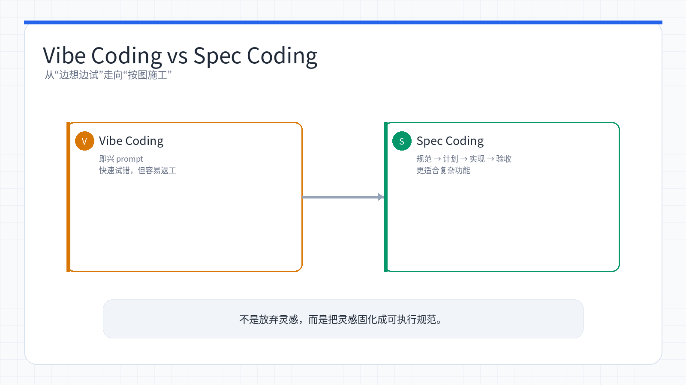
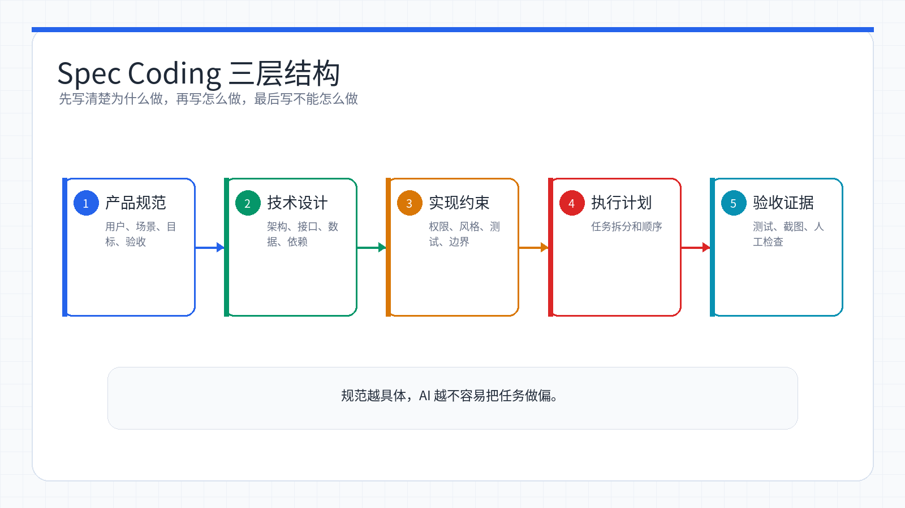

# Week 13：Spec Coding——从「碰运气」到「按图施工」

> 小林用 Claude Code 做了几个月项目后，发现一个规律：越是随口说一句就让 AI 开干，后面改起来越费劲；反而是那些她提前想清楚、写成文档的需求，AI 一次就能做对。直到她看到 OpenAI 研究员 Sean Grove 的演讲，才明白这背后有个名字——Spec Coding（规范驱动开发）。那一刻她意识到，写代码的方式正在改变：规范本身就是代码。

<ChapterIntroduction duration="约 2.5 小时" output="一份完整的功能规范文档、基于规范生成的生产级代码、以及从 Vibe Coding 到 Spec Coding 的渐进式工作流" prerequisite="学完前几章 Claude Code 基础和 MCP" :tags="['Spec Coding', '规范驱动', 'CLAUDE.md', 'Rules', '工程化开发']">

本章带你理解 Spec Coding 的核心思想——为什么「代码是意图的有损投影」、为什么规范才是真正的「新代码」，以及如何在 Claude Code 中用 CLAUDE.md、Rules 目录、/plan 命令实践这套方法论。我们不只讲理念，更会通过完整案例对比 Vibe Coding 和 Spec Coding 的差异，让你看到规范驱动如何把 AI 编程从「碰运气」变成「按图施工」。

</ChapterIntroduction>

<StepBar :active="0" :items="[
  { title: '① 理解 Spec Coding', description: 'Sean Grove 的「The New Code」与核心理念' },
  { title: '② Claude Code 实践', description: 'CLAUDE.md、Rules、/plan 工作流' },
  { title: '③ 实战与策略', description: '完整案例、混合策略、最佳实践' }
]" />

* * *

## 什么是 Spec Coding？

小林的第一个问题很直接：这个 Spec Coding 到底是啥？和我之前用的 Vibe Coding 有什么区别？

**Spec Coding**（规范编程），也叫 Spec-Driven Development（SDD），是一种以**规范文档作为开发核心产物**的方法论。

核心思路：**先写清楚规范，再让 AI 根据规范生成代码。规范是 source of truth，代码只是规范的实现产物。**

小林的理解方式：如果说 Vibe Coding 是「边走边看」——想到哪说到哪，AI 跟着你的思路即兴发挥；那 Spec Coding 就是「按图施工」——先把设计图（规范）画好，AI 照着图纸精确实现。前者快但容易跑偏，后者慢一点但一次到位。



*Vibe Coding 适合快速探索，Spec Coding 适合把探索结果沉淀成可验收的交付流程。*

## Sean Grove 的「The New Code」：一场改变思维的演讲

小林是在 Twitter 上刷到这场演讲的。2025 年，OpenAI 研究员 **Sean Grove** 在 AI Engineer World's Fair 上发表了题为 **"The New Code"** 的演讲，震动了整个开发者社区。

Grove 此前创办了 OneGraph（一个 GraphQL 开发工具公司，后被 Netlify 收购），目前在 OpenAI 从事 alignment reasoning 工作——帮助将高层意图转化为可执行的规范和评估标准。

### 核心论点：代码是意图的有损投影

Grove 演讲的核心概念可以用一句话概括：

> **Code is a lossy projection of intent.**
> 代码是意图的有损投影。

什么意思？当你脑子里有一个想法，把它变成代码的过程中，大量的上下文信息会丢失——**为什么**要这样做、**权衡了哪些方案**、**考虑了什么约束**。最终的代码只保留了「怎么做」，却丢掉了「为什么这样做」。

🤖

AI 助手

在线

小林：给我举个例子，什么叫「有损投影」？

👤

🤖

Claude：比如你看到代码里有个 \`if (retryCount > 5) { throw error; }\`，你只知道「重试超过 5 次就报错」，但你不知道：\\n\\n- 为什么是 5 次而不是 3 次或 10 次？\\n- 这个数字是根据什么业务场景定的？\\n- 是否考虑过指数退避？\\n- 有没有测试过这个阈值的合理性？\\n\\n这些「为什么」和「怎么来的」就是丢失的上下文——代码只保留了最终决策，却丢掉了决策过程。

### 编程的本质是沟通

Grove 提出了一个看似简单却深刻的观点：

> "If you can communicate effectively, you can program."
> 如果你能有效沟通,你就能编程。

他认为，实际编码工作只占开发的 **10-20%**，剩下的 80% 是围绕需求和目标的**结构化沟通**——理解用户要什么、和团队对齐方案、定义验收标准、处理边界情况。

这意味着编程能力的核心不是掌握某种语言的语法，而是**把模糊的意图转化为精确描述的能力**。

### 写规范的人就是程序员

这是 Grove 最具颠覆性的观点：

> "Whoever writes the spec — be it a PM, a lawmaker, an engineer, a marketer — is now the programmer."
> 无论是产品经理、律师、工程师还是市场人员，写规范的人就是程序员。

随着 AI 越来越擅长把规范转化为代码，**真正的编程工作**从「写代码」变成了「写规范」。谁能最精确地表达意图，谁就是最有价值的「程序员」。

小林看到这段时眼睛一亮。她本来就是从产品经理转型的，写需求文档是强项。现在 Grove 告诉她：**写清楚需求本身就是编程**——这不就是她的主场吗？她突然明白，为什么自己用 Claude Code 时，那些提前写成文档的需求总是一次就能做对。

### 规范拥有类似代码的工具链

Grove 指出，规范可以像代码一样拥有完整的工具链：

> "Specs actually give us a very similar toolchain, but it's targeted at intentions rather than syntax."

-   **组合**：规范可以模块化组合，就像代码模块
-   **测试**：规范可以嵌入单元测试，验证行为是否符合预期
-   **Lint 检查**：可以检测规范中的模糊语言，就像代码 linter 检测语法问题
-   **一致性验证**：跨部门的规范可以做一致性检查，类似类型检查器

### OpenAI Model Spec：活的证明

Grove 用 OpenAI 自己的 **Model Spec** 文档作为实证。

当 OpenAI 发现模型存在 sycophancy（过度迎合用户）问题时，他们没有重新训练模型，而是**修改了规范文档**。改动自动传播到整个系统，问题得到修正。

这证明了一个关键点：**规范本身可以作为「可执行代码」发挥作用**。修改规范就等于修改行为，不需要碰一行传统代码。

Josh Beckman 对 Grove 演讲的总结一针见血：

> "Software engineering (and lawmaking and legal review) is specification repair."
> 软件工程（以及立法和法律审查）的本质是规范修复。

* * *

## Vibe Coding vs Spec Coding：两种范式的对比

小林回想起自己这几个月的开发经历，突然发现自己一直在两种模式之间切换，只是之前没意识到它们有名字。

### 对比表格

维度

Vibe Coding

Spec Coding

**方式**

即兴 prompt，逐条迭代

先写完整规范，再生成代码

**适用场景**

原型、hackathon、探索

生产系统、团队协作、企业级

**代码质量**

快但脆弱

结构化、可测试、可审计

**首次通过率**

不稳定

目标 95%+

**可复用性**

一次性 prompt

规范可跨项目复用

**安全性**

容易遗漏

从规范层面内建

**文档**

无或滞后

规范即文档，自维护

**团队协作**

依赖个人 prompt 技巧

共享规范，统一标准

### 一个真实的对比案例

小林翻出了自己上个月做的两个功能，一个用 Vibe Coding，一个用 Spec Coding，对比很明显。

**Vibe Coding 方式：做通知功能**

```
小林：做一个通知功能
Claude：[直接开始写代码，生成了一个简单的通知列表]

小林：要支持已读未读
Claude：[修改代码，加了个 read 字段]

小林：还要支持不同类型的通知
Claude：[又改，加了 type 字段]

小林：要能推送到手机
Claude：[大改一通，之前的结构不太适配了...]
```

结果：改了 4 轮，架构被反复推翻，代码越来越乱。最后她不得不推倒重来。

**Spec Coding 方式：做退款功能**

她先花 20 分钟写了一份规范文档 `specs/refund.md`，然后一次性让 Claude Code 实现。结果第一版就能用，只改了两个小细节。

方式

过程

结果

Vibe Coding：通知功能

基础列表、已读未读、类型分类、推送功能多轮追加；推送阶段架构不对，最后推倒重来

总耗时约 4.5 小时，代码质量 ★★☆☆☆

Spec Coding：退款功能

先写规范文档 20 分钟，再让 AI 生成代码 15 分钟，最后小修小补 10 分钟

总耗时约 45 分钟，代码质量 ★★★★☆

### 两者并非对立

Brad Jolicoeur 指出：

> "Clever engineers will even use vibe coding as a first step to generate the initial draft of a specification."
> 聪明的工程师会用 Vibe Coding 作为第一步，生成规范的初始草稿。

小林深有体会：她现在的工作流是——先用 Vibe Coding 快速验证想法可行性，然后把探索过程整理成规范，最后用 Spec Coding 重新实现生产版本。**用 Vibe 的速度探索，用 Spec 的质量交付**。

* * *

## Spec Coding 的三层规范结构

小林看了几篇文章后，发现业界对规范的组织方式有个共识：分三层写，从抽象到具体。



*三层规范先回答做什么，再回答怎么设计，最后约束具体实现细节。*

0

第一层：功能规范

用自然语言描述期望结果（What）

0

第二层：技术设计

定义架构、数据模型、API（How - 架构层）

0

第三层：实现约束

版本、框架、代码规范（How - 实现层）

### 第一层：功能规范（What）

用自然语言描述期望结果，回答「做什么」：

```markdown
## 用户认证功能

### 用户故事
- 作为新用户，我希望能通过邮箱注册账号
- 作为已注册用户，我希望能用邮箱和密码登录
- 作为忘记密码的用户，我希望能通过邮件重置密码

### 验收标准
- 注册时验证邮箱格式和密码强度
- 登录失败 5 次后锁定账号 15 分钟
- 密码重置链接 30 分钟内有效
```

### 第二层：技术设计（How - 架构层）

定义数据结构、架构模式、安全要求：

```markdown
## 技术设计

### 数据模型
- users 表：id, email, password_hash, created_at, locked_until
- sessions 表：id, user_id, token, expires_at

### API 设计
- POST /api/auth/register → 201 Created
- POST /api/auth/login → 200 OK + JWT
- POST /api/auth/reset-password → 202 Accepted

### 安全要求
- 密码使用 bcrypt 加密，cost factor ≥ 12
- JWT 有效期 15 分钟，refresh token 7 天
- 所有端点启用 rate limiting
```

### 第三层：实现约束（How - 实现层）

版本要求、测试框架、文档标准：

```markdown
## 实现约束

### 技术栈
- Runtime: Node.js 20+
- Framework: Express 5
- ORM: Prisma
- Testing: Vitest

### 代码规范
- 使用 TypeScript strict mode
- 错误处理使用自定义 AppError 类
- 所有 API 端点需要 JSDoc 注释
```

小林的经验：不用每次都写三层。快速原型只写第一层就够；团队协作至少要写到第二层；生产级项目才需要第三层。她现在的习惯是：先写第一层验证需求，确认方向后再补第二层，最后根据项目规模决定要不要第三层。

* * *

## 在 Claude Code 中实践 Spec Coding

理解了理论，接下来看如何在 Claude Code 中落地。小林发现，Claude Code 的设计哲学天然契合 Spec Coding——它的 `CLAUDE.md`、Rules 目录、`/plan` 命令，本质上都是在做「规范驱动」。

### Claude Code 的「万物皆 Markdown」哲学

在深入实践之前，先理解 Claude Code 的底层哲学：**万物皆 Markdown**。

Claude Code 的设计中，所有过程记载、信息传递、甚至与模型的对话，都可以是 Markdown：

-   **CLAUDE.md**：项目规范的 Markdown 文档
-   **.claude/rules/**：分层规范的 Markdown 文件集合
-   **specs/**：功能需求的 Markdown 描述
-   **对话历史**：Claude Code 的对话记录本身就是 Markdown 格式

这正是 Spec Coding 的内核：**规范本身就是代码**。当你用 Markdown 写下需求、设计、验收标准时，你已经在写「代码」了——AI 会读取这些 Markdown，然后生成真正的代码实现。

### 第一步：用 CLAUDE.md 建立项目规范

`CLAUDE.md` 就是你项目的「活规范」。每次 Claude Code 启动时都会读取它，相当于给 AI 一份持久的项目说明书。

在前面的 [Claude Code 快速上手核心指南](/course-a/week-03) 中，我们学过如何创建 `CLAUDE.md`。在 Spec Coding 的语境下，它的角色更加重要——**它不只是配置文件，而是项目规范的入口**。

**一个好的 CLAUDE.md 应该包含什么？**

```markdown
# 电商项目规范

## 项目定位
面向中小商家的 SaaS 电商平台，支持多店铺、多支付渠道。

## 架构决策
- 前后端分离，API-first 设计
- 后端微服务架构，服务间通过消息队列通信
- 数据库读写分离

## 核心约束
- 所有金额使用整数（分）存储，避免浮点精度问题
- 订单状态机严格遵循：待支付 → 已支付 → 已发货 → 已完成
- 支付相关接口必须幂等

## 开发规范
- 使用 TypeScript strict mode
- API 响应格式：成功 { data, pagination? }，失败 { error: { code, message } }
- 所有数据库操作必须有事务保护
```

小林的心得：`CLAUDE.md` 不是一次写完就不动了。她的习惯是每次遇到 AI 犯同样的错误，就把对应的规则加进去。比如有次 AI 把金额用 float 存储导致精度问题，她就在「核心约束」里加了一条「金额用整数（分）」。久而久之，这份文档就成了项目的「避坑指南」。

### 第二步：用 Rules 目录管理分层规范

当项目变大，单个 `CLAUDE.md` 不够用。这时候用 `.claude/rules/` 目录来组织分层规范。

**为什么需要 Rules 目录？**

-   **按需加载**：只在编辑相关文件时加载对应规范，节省 token
-   **职责分离**：前端规范、后端规范、数据库规范各管各的
-   **团队协作**：不同成员可以维护不同领域的规范

**目录结构示例：**

```
.claude/rules/
├── 00-architecture.md      # 架构规范（全局）
├── 01-security.md           # 安全规范（全局）
├── 10-api-design.md         # API 设计规范
├── 11-frontend-patterns.md  # 前端模式规范
├── 12-database.md           # 数据库规范
└── 20-testing.md            # 测试规范
```

**一个具体的 Rules 文件示例：**

```markdown
---
globs:
  - "src/api/**/*.ts"
  - "src/services/**/*.ts"
---

# API 设计规范

## 路由设计
- RESTful 风格，使用名词复数：/api/v1/orders
- 嵌套资源最多两层：/api/v1/users/123/orders

## 响应格式
- 成功：{ data, pagination? }
- 错误：{ error: { code, message, details? } }

## 必须遵守
- 所有写操作需要认证
- 列表接口必须支持分页
- 敏感操作记录审计日志
```

注意 frontmatter 中的 `globs` 字段——它告诉 Claude Code：只有在编辑 `src/api/` 或 `src/services/` 下的 TypeScript 文件时，才加载这份规范。这样既保证了规范的精准性，又不会浪费 token。

组织方式

内容结构

主要问题/优势

`CLAUDE.md` 单文件

架构、API 设计、前端规范、数据库规范都放在一个文件里

每次都加载全部内容，浪费 token；文件太长，难维护；多人编辑容易冲突

`.claude/rules/` 分层

`00-architecture.md`、`01-security.md`、`10-api-design.md`、`11-frontend-patterns.md`、`12-database.md` 按领域拆分

按需加载，节省 token；职责清晰，易维护；多人协作不冲突

### 第三步：用 /plan 实现 Specify → Plan → Tasks → Implement

Spec Coding 的标准工作流是四阶段循环。GitHub Spec Kit 将其标准化为 **Specify → Plan → Tasks → Implement**，而 Claude Code 的 `/plan` 命令天然支持这个流程。

0

Specify

定义规范：写清楚要做什么

0

Plan

技术规划：AI 生成实施方案

0

Tasks

任务拆解：分解为可执行小任务

0

Implement

逐步实现：按任务执行并验证

**阶段一：Specify（定义规范）**

先写清楚要做什么，不急着写代码。小林现在的习惯是先创建一个 `specs/` 目录，把功能规范写进去。

```
/plan
我需要实现订单退款功能，规范如下：

功能需求：
- 用户可以在发货前申请全额退款
- 发货后 7 天内可以申请退货退款
- 退款需要管理员审批

验收标准：
- 退款金额不能超过订单实付金额
- 退款状态机：申请中 → 审批通过 → 退款中 → 已退款
- 退款完成后恢复库存
- 全程记录操作日志
```

**阶段二：Plan（技术规划）**

Claude 会基于你的规范生成技术方案：

```
📋 退款功能实施计划

1. 数据模型设计
   - 创建 refunds 表
   - 添加订单状态机的退款相关状态

2. API 设计
   - POST /api/orders/:id/refund - 申请退款
   - PUT /api/refunds/:id/approve - 审批退款
   - GET /api/refunds - 退款列表

3. 业务逻辑
   - 退款资格校验
   - 退款金额计算
   - 库存恢复逻辑

4. 集成
   - 对接支付渠道退款接口
   - 发送退款通知
```

**阶段三：Tasks（任务拆解）**

将计划拆分为可独立执行的小任务，每个任务有明确的完成标准。Claude Code 会自动帮你拆解，你也可以手动调整。

**阶段四：Implement（逐步实现）**

按任务逐个实现，每完成一个就验证一次。小林的习惯是让 Claude Code 做完一个任务就暂停，她确认没问题后再继续下一个。

🤖

AI 助手

在线

小林：按照刚才的计划实现退款功能，每完成一个模块暂停一下，我确认后再继续

👤

🤖

Claude：好的，我先从数据模型开始。\\n\\n\[创建 refunds 表的 migration 文件\]\\n\[更新 Order 模型，添加退款相关状态\]\\n\\n数据模型已完成，请确认：\\n- refunds 表包含所有必要字段\\n- 订单状态机已更新\\n- 外键关系正确\\n\\n确认无误后我继续实现 API 层。

小林：看起来没问题，继续吧

👤

🤖

Claude：好的，开始实现 API 层...\\n\\n\[创建退款相关的路由和控制器\]\\n\[实现业务逻辑层\]\\n\\nAPI 层已完成，我已经：\\n- 实现了三个端点\\n- 添加了权限校验\\n- 实现了退款资格验证\\n\\n要我继续实现支付渠道对接吗？

小林的经验

这种「做一步、停一步」的节奏特别适合复杂功能。她之前试过让 AI 一口气做完，结果中间某个环节出错，后面全白做了。现在她学会了分段验证——每个模块做完就跑一下测试，确保基础稳了再往上搭。

* * *

## 实战案例：用 Spec Coding 构建用户通知系统

理论讲完了，小林决定用一个完整的案例演示 Spec Coding 的全流程。她选了一个中等复杂度的功能——用户通知系统。

### 场景设定

小林的电商项目需要一个通知系统，用来推送订单状态、促销活动、系统公告等消息。她之前用 Vibe Coding 做过类似功能，这次决定用 Spec Coding 重新做一遍，看看差别有多大。

### 步骤 1：编写功能规范

她先创建 `specs/notification-system.md`：

```markdown
# 用户通知系统规范

## 功能需求

### 核心功能
1. 支持站内通知、邮件通知、推送通知三种渠道
2. 通知类型：系统公告、订单状态、促销活动、安全提醒
3. 用户可以按渠道和类型配置通知偏好
4. 支持已读/未读状态，支持批量标记已读

### 用户故事
- 作为用户，我希望在订单状态变化时收到通知
- 作为用户，我希望能关闭不想要的通知类型
- 作为用户，我希望能一键标记所有通知为已读
- 作为管理员，我希望能群发系统公告

## 验收标准
- 未读通知数实时更新
- 通知列表支持无限滚动
- 推送通知延迟 < 3 秒
- 偏好设置变更立即生效
```

### 步骤 2：补充技术设计

继续在同一个文件中补充技术层面的设计：

```markdown
## 技术设计

### 数据模型
- notifications 表：
  - id, user_id, type, channel, title, content
  - is_read, created_at, read_at
- notification_preferences 表：
  - user_id, type, channel, enabled

### API 设计
- GET /api/notifications?type=&is_read= - 获取通知列表（分页）
- PUT /api/notifications/:id/read - 标记已读
- PUT /api/notifications/read-all - 全部标记已读
- GET /api/notification-preferences - 获取偏好设置
- PUT /api/notification-preferences - 更新偏好设置

### 架构决策
- 使用消息队列异步发送通知，避免阻塞主流程
- 站内通知存储在数据库，邮件和推送只记录发送日志
- WebSocket 实时推送未读数变化
```

### 步骤 3：在 Claude Code 中执行

现在她打开 Claude Code，引用这份规范：

```
@specs/notification-system.md
按照这份规范实现用户通知系统。
先从数据模型开始，然后实现 API，最后做前端组件。
每完成一个模块暂停一下，我确认后再继续。
```

🤖

AI 助手

在线

🤖

Claude：好的，我已经读取了通知系统的规范。让我先创建数据模型。\\n\\n\[创建 Prisma schema\]\\n\[生成 migration\]\\n\\n数据模型已完成：\\n- notifications 表包含所有必要字段\\n- notification\_preferences 表用于存储用户偏好\\n- 已添加索引优化查询性能\\n\\n请确认数据模型是否符合预期？

小林：看起来不错，继续实现 API 吧

👤

🤖

Claude：开始实现 API 层...\\n\\n\[创建路由文件\]\\n\[实现控制器逻辑\]\\n\[添加权限中间件\]\\n\\nAPI 层已完成，我已经：\\n- 实现了 5 个端点\\n- 添加了分页支持\\n- 实现了权限校验\\n- 添加了输入验证\\n\\n要我继续实现前端组件吗？

### 步骤 4：结果对比

小林做完后对比了一下数据：

指标

Vibe Coding（之前）

Spec Coding（这次）

规范编写时间

0 分钟

25 分钟

开发时间

4.5 小时

1 小时

返工次数

4 次

0 次

代码质量

★★☆☆☆

★★★★☆

文档完整度

无

规范即文档

**她的感受：**

> 写规范的 25 分钟看起来是「额外成本」，但实际上是投资。因为写规范的过程中，我把所有边界情况、数据结构、API 设计都想清楚了。AI 拿到这份规范后，就像拿到了施工图纸，一次就能做对。反而是之前的 Vibe Coding，看起来「立刻开始」，实际上在反复返工中浪费了更多时间。

* * *

## 混合策略：从 Vibe 到 Spec 的渐进式过渡

小林现在明白了：行业共识并非「抛弃 Vibe Coding」，而是**根据场景选择合适的方式**。她总结了一套自己的混合策略。

### 什么时候用 Vibe Coding

**快速探索场景：**

-   验证一个想法是否可行（30 分钟内的原型）
-   探索不熟悉的技术或框架
-   Hackathon 或内部 demo
-   一次性脚本或工具

**小林的例子：** 她想试试能不能用 WebSocket 实现实时通知，就直接让 Claude Code 写了个最简单的 demo。10 分钟跑通了，证明可行，然后再用 Spec Coding 做生产版本。

### 什么时候用 Spec Coding

**生产级开发场景：**

-   生产级功能开发
-   多人协作的项目
-   需要长期维护的代码
-   涉及安全、支付、数据等敏感领域
-   API 设计和系统集成

**小林的例子：** 支付模块、用户认证、订单系统这些核心功能，她现在都用 Spec Coding。因为这些模块出错的代价太高，必须一次做对。

### 推荐的渐进式工作流

小林现在的标准流程是三步走：

0

① Vibe 探索

快速验证想法可行性

0

② 提炼规范

把探索成果整理成规范

0

③ Spec 重建

基于规范实现生产版本

**阶段一：Vibe 探索**

用 Vibe Coding 快速验证想法，不写规范，不管代码质量：

```
小林：做一个简单的通知弹窗，看看效果

Claude：[10 分钟生成一个基础原型]
```

**阶段二：提炼规范**

验证可行后，把探索中的发现整理成规范。你甚至可以让 AI 帮你：

```
小林：基于我们刚才做的通知功能原型，
帮我整理一份正式的功能规范文档，
包括数据模型、API 设计和验收标准
```

🤖

AI 助手

在线

🤖

Claude：好的，我来整理规范文档。基于刚才的原型，我建议：\\n\\n\[生成完整的规范文档\]\\n\\n这份规范涵盖了：\\n- 功能需求和用户故事\\n- 数据模型设计\\n- API 端点定义\\n- 验收标准\\n\\n你可以在此基础上补充或调整。

**阶段三：Spec 重建**

基于规范，用 Spec Coding 方式重新实现生产级版本：

```
@specs/notification-system.md
按照这份规范从零实现，不要参考之前的原型代码
```

**这个流程的好处：** 用 Vibe Coding 的速度验证方向，用 Spec Coding 的质量交付产品。小林发现这样做的成功率最高——既不会在错误方向上浪费时间写规范，也不会因为没规范而反复返工。

* * *

## 规范的版本控制与持续演进

小林在团队协作中发现，规范和代码一样需要版本管理。她把这套经验整理成了最佳实践。

### 规范也是代码

既然规范是代码，就应该像代码一样管理：

-   **版本控制**：规范文件放在 Git 仓库中，和代码一起提交
-   **变更追踪**：每次修改规范都有 commit 记录，知道谁改了什么、为什么改
-   **Code Review**：规范的修改也需要 PR 审查，确保团队对齐
-   **CI 集成**：规范变更触发自动化测试，验证实现是否仍然符合规范

### 在 Claude Code 中的实践

在 Claude Code 中，这意味着你的 `CLAUDE.md`、`.claude/rules/` 和 `specs/` 目录都应该纳入版本控制。

**小林的 Git 工作流：**

```bash
# 1. 修改规范
vim specs/notification-system.md

# 2. 让 Claude Code 根据新规范更新代码
@specs/notification-system.md
规范已更新，请同步更新代码实现

# 3. 一起提交
git add specs/notification-system.md src/
git commit -m "feat: 通知系统支持批量操作

- 更新规范：添加批量标记已读功能
- 实现 PUT /api/notifications/read-all 端点
- 添加前端批量操作按钮"
```

**规范的自我修复循环：** OpenAI 的 Harness Engineering 实践验证了一个有趣的现象——他们的 `AGENTS.md` 文件本身就是由 Codex 编写的，并且随着项目演进持续更新。当 agent 遇到困难时，修复方案不是改代码，而是**让 Codex 自己更新规范**——形成规范的自我修复循环。

小林也在尝试这个模式：当 Claude Code 遇到重复问题时，她会让它自己更新 `CLAUDE.md` 或 Rules 文件，把解决方案固化到规范中。

* * *

## 常见问题与最佳实践

小林在实践 Spec Coding 的过程中，遇到了一些典型问题。她把这些问题和解决方案整理在一起。

### Q1：Spec Coding 会不会太慢了？

**小林的回答：** 前期写规范确实需要时间投入，但这个时间会在后期通过减少返工、减少 bug、减少沟通成本来回收。

Greg Ceccarelli 的团队用 Spec Coding 方式，**3 个人在 4 周内交付了一个完整的 macOS 产品**——这在传统开发中几乎不可能。

**小林的数据：**

项目

方式

前期时间

开发时间

返工时间

总时间

通知系统

Vibe

0 分钟

2 小时

2.5 小时

4.5 小时

退款系统

Spec

25 分钟

1 小时

0 分钟

1.4 小时

结论：**Spec Coding 在中等复杂度以上的功能中，总时间反而更短。**

### Q2：规范写多详细才够？

**小林的经验：** 一份高质量的规范可以只有一页。关键是回答 8 个问题：

1.  我们在做什么？（功能描述）
2.  输入是什么？（数据来源）
3.  输出是什么？（期望结果）
4.  约束条件是什么？（技术限制、业务规则）
5.  失败模式有哪些？（错误处理）
6.  安全要求是什么？（权限、加密）
7.  性能要求是什么？（响应时间、并发量）
8.  什么测试能证明它工作？（验收标准）

**小林的模板：** 她现在有一个规范模板，每次开始新功能就复制一份，填空式完成。这个模板包含上面 8 个问题的结构化提示，确保不会遗漏关键信息。

### Q3：AI 只做规范说的事，遗漏了「显而易见」的功能怎么办？

**小林的解决方案：** 在规范中加一个「非功能性需求」部分，列出通用期望。或者在 `CLAUDE.md` 中设置全局规则。

**她的 CLAUDE.md 中有这样一段：**

```markdown
## 默认行为（除非规范明确说明不需要）

所有 API 端点必须：
- 添加错误处理和日志记录
- 实现输入验证
- 添加单元测试
- 编写 JSDoc 注释

所有前端组件必须：
- 支持响应式布局
- 添加加载状态
- 实现错误提示
- 考虑无障碍访问
```

这样即使规范里没写，AI 也会自动加上这些「显而易见」的东西。

### Q4：小项目也需要 Spec Coding 吗？

**小林的判断标准：**

-   **不需要 Spec Coding：** 快速原型、一次性脚本、学习实验、个人项目
-   **需要 Spec Coding：** 生产级项目、多人协作项目、需要长期维护的项目

她的经验法则：**如果这个功能 3 个月后还要改，就用 Spec Coding。**

### Q5：怎么让团队接受 Spec Coding？

**小林的推广策略：**

1.  **从一个小功能开始试点**：选一个中等复杂度的功能，用 Spec Coding 做，记录数据
2.  **展示对比结果**：用数据说话——返工次数、开发时间、代码质量
3.  **提供模板和工具**：降低上手门槛，让团队成员复制模板就能开始
4.  **建立规范库**：把常见功能的规范整理成库，可以直接复用

Stack Overflow 2025 调查显示，84% 的开发者使用或计划使用 AI 工具，但只有 22% 对结果满意——Spec Coding 正是提升满意度的关键。

* * *

## 结合 Superpowers 强化 Spec Coding

在前面的 [Superpowers 工程级开发](/course-a/week-12) 章节中，我们学过 Superpowers 的技能体系。小林发现，Spec Coding 和 Superpowers 是天然的搭档。

### Spec Coding 各阶段对应的 Superpowers 技能

Spec Coding 阶段

对应 Superpowers 技能

作用

定义规范

`brainstorming`

苏格拉底式提问澄清需求

技术规划

`writing-plans`

将规范拆解为小任务

逐步实现

`test-driven-development`

TDD 红绿重构

质量验证

`code-review` + `verification-before-completion`

代码审查和验证

### 组合使用示例

小林现在的标准指令是这样的：

```
@specs/notification-system.md
用 TDD 方式按照这份规范实现通知系统，
完成后帮我做代码审查
```

这条指令同时触发了：

-   **Spec Coding 工作流**：基于规范生成代码
-   **TDD 技能**：先写测试再写实现
-   **Code Review 技能**：自动审查代码质量

使用方式

指令示例

结果

只用 Spec Coding

`@specs/notification-system.md`，按照这份规范实现

代码符合规范，但可能缺少测试，可能有代码质量问题，需要手动验证

Spec + Superpowers

`@specs/notification-system.md`，用 TDD 方式实现，完成后做代码审查

代码符合规范，测试覆盖完整，代码质量有保障，并能自动验证

**小林的心得：** Spec Coding 解决「做什么」的问题，Superpowers 解决「怎么做好」的问题。两者结合，就是完整的工程级开发流程。她现在做任何生产级功能，都是这套组合拳。

* * *

## 本周回顾

小林这一章从「随口说一句就让 AI 开干」走到了「先写规范再按图施工」。下面对照检查你掌握得怎么样。

Week 13 学习进度

1

理解 Spec Coding 核心理念

能说清「代码是意图的有损投影」，理解为什么规范才是真正的「新代码」

2

掌握三层规范结构

会写功能规范（What）、技术设计（How-架构）、实现约束（How-实现）

3

会用 CLAUDE.md 和 Rules

能建立项目规范入口，用 Rules 目录管理分层规范

4

掌握 Specify → Plan → Tasks → Implement 流程

会用 /plan 命令实现四阶段工作流

5

理解混合策略

知道什么时候用 Vibe、什么时候用 Spec，会用渐进式工作流

6

能结合 Superpowers

会组合使用 Spec Coding 和 Superpowers 技能实现工程级开发

**自测问题：**

1.  **理解核心概念：** 什么叫「代码是意图的有损投影」？举一个你自己项目中的例子，说明代码丢失了哪些上下文信息。

2.  **对比两种范式：** Vibe Coding 和 Spec Coding 各自适合什么场景？如果你要做一个支付模块，你会选哪种方式？为什么？

3.  **实践工作流：** 描述一下 Specify → Plan → Tasks → Implement 四阶段的具体操作。在 Claude Code 中，你会用什么命令和工具来实现这个流程？

4.  **规范编写：** 一份好的功能规范应该回答哪 8 个问题？选择你正在做的一个功能，尝试用这 8 个问题写一份简单的规范。

5.  **混合策略：** 描述一下「Vibe 探索 → 提炼规范 → Spec 重建」的渐进式工作流。什么时候应该用这个流程？


## 下周预告

掌握了 Spec Coding 之后，小林开始思考：能不能让多个 AI 实例像真正的开发团队一样协同工作？一个负责前端、一个负责后端、一个负责测试？下一章我们进入 Agent Teams——让 AI 团队协作开发，把「一个人的 AI 助手」升级为「AI 开发团队」。

* * *

## 参考资料

### Sean Grove "The New Code" 演讲相关

-   [Code is just a lossy projection of intent — The Decoder](https://the-decoder.com/code-is-just-a-lossy-projection-of-intent-according-to-openai-researcher-sean-grove/)
-   [The End of Coding? How Specifications Are Becoming the New Source Code — Implicator](https://www.implicator.ai/the-end-of-coding-how-specifications-are-becoming-the-new-source-code/)
-   [OpenAI: Intent, Not Code, Drives Future Software Development — AI Tech Suite](https://www.aitechsuite.com/ai-news/openai-intent-not-code-drives-future-software-development)
-   [Note on The New Code — Josh Beckman](https://www.joshbeckman.org/notes/914234100)
-   [The New Code 演讲完整文字稿](https://lawwu.github.io/transcripts/8rABwKRsec4.html)

### Spec Coding 方法论

-   [How spec-driven development improves AI coding quality — Red Hat](https://developers.redhat.com/articles/2025/10/22/how-spec-driven-development-improves-ai-coding-quality)
-   [Spec-Driven Development with AI: Complete 2025 Guide — Dplooy](https://www.dplooy.com/blog/spec-driven-development-with-ai-complete-2025-guide)
-   [Spec-Driven Development: Building Production-Ready Software with AI — Orchestrator.dev](https://orchestrator.dev/blog/2025-12-16-spec_driven_dev_article)
-   [Agents Code but the Problem of Clear Specification Remains — Greg Ceccarelli](https://www.gregceccarelli.com/writing/beyond-code-centric)

### Vibe Coding vs Spec Coding

-   [Vibe Coding vs Spec Driven — Cosmo Edge](https://cosmo-edge.com/vibe-coding-vs-spec-driven-ai-development/)
-   [Master AI in Software Engineering: Vibe vs. Spec Coding — Brad Jolicoeur](https://bradjolicoeur.com/article/ai-software-engineering-vibe-spec-prompting)
-   [From Vibe Coding to Spec-Driven Development — Tessl](https://tessl.io/blog/from-vibe-coding-to-spec-driven-development/)
-   [Spec first approach for enterprise — Robomotion](https://robomotion.io/blog/spec-first-approach-the-way-to-adapt-vibe-coding-for-enterprise-work)

### 工具与实践

-   [GitHub Spec Kit vs Vibe Coding — Ossels](https://ossels.ai/github-spec-kit-spec-driven-development/)
-   [A spec-first workflow for agentic AI — LogRocket](https://blog.logrocket.com/spec-first-workflow-agentic-ai/)
-   [Specs Are Now Code — The Vibe Coding Substack](https://thevibecoding.substack.com/p/specs-are-now-code)
-   [Harness Engineering — Martin Fowler](https://martinfowler.com/articles/exploring-gen-ai/harness-engineering.html)
-   [Spec-Driven Development & AI Agents Explained — Augment Code](https://www.augmentcode.com/guides/spec-driven-development-ai-agents-explained)
-   [Spec-Driven Development: The Key to Scalable AI Agents — Aviator](https://www.aviator.co/blog/spec-driven-development/)
