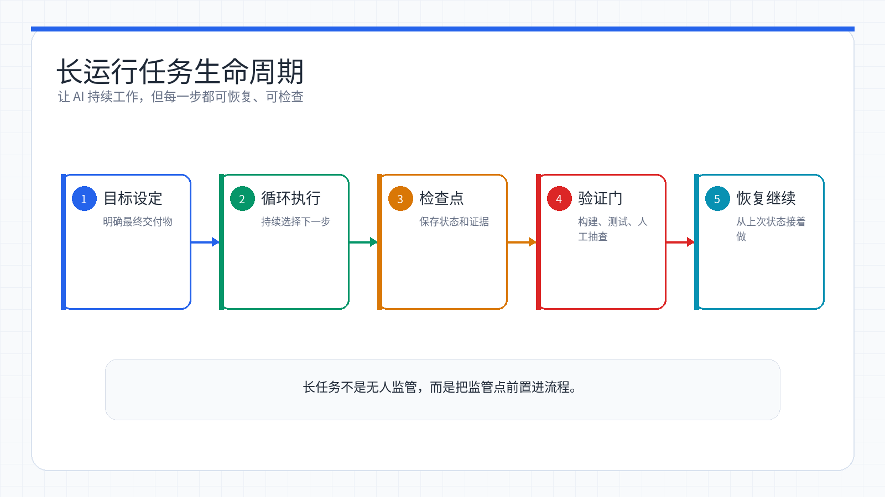
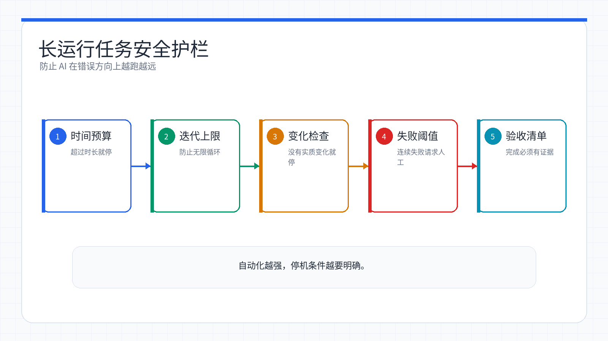

# Week 14：长运行任务——让 Claude Code 在边界内持续工作

> 小林接到一个小重构任务：把项目里 8 个测试文件从旧断言写法改成新断言写法。她让 Claude Code 开始干活，写了几个文件后它说「完成了」。小林一看——才改了 3 个，还有 5 个没动。她这才意识到：AI 会「过早停止」。这周她不再让 AI 无人值守跑到天亮，而是学会给一个 10-30 分钟的任务设置检查点、完成标记和停止条件。

<ChapterIntroduction duration="约 3 小时" output="一套 10-30 分钟受控长任务方案，包括 Prompt 模板、检查点、停止规则和风险清单" prerequisite="学完前几章 Claude Code 基础，了解基本的命令行操作" :tags="['长运行任务', 'Ralph Loop', '自动化', '检查点', '验收']">

本章解决一个核心问题：如何让 Claude Code 在**明确边界内**持续工作，直到任务真正完成，而不是写几个文件就说「我完成了」。我们会从问题根源讲起，介绍从简单循环到 Ralph Loop 的思路，重点讲解 Prompt 编写技巧、安全机制、适用场景，最后用受控的小任务演示：自动化可以帮你坚持迭代，但不能替你放弃监控、预算和人工验收。

</ChapterIntroduction>

<StepBar :active="0" :items="[
  { title: '① 理解问题', description: '为什么 AI 会过早停止' },
  { title: '② 解决方案', description: '从 bash 循环到 Ralph Loop' },
  { title: '③ 实战演练', description: '10-30 分钟受控任务' }
]" />

* * *

## 小林的困境：AI 总是「差不多就行」

小林那天的任务看起来很明确：把项目的测试框架从 Jest 迁移到 Vitest。她打开 Claude Code，输入：

```
帮我把所有测试从 Jest 迁移到 Vitest
```

Claude Code 开始工作，修改了几个测试文件，更新了配置，然后输出：

```
✓ 已将测试迁移到 Vitest
✓ 更新了 vite.config.js
✓ 修改了 5 个测试文件
任务完成！
```

小林松了口气，运行 `npm test`——结果一堆报错。她打开项目一看，发现还有 50 多个测试文件根本没动，依然在用 Jest 的 API。

**这就是 AI 的「过早停止」问题。**

小林的反思：AI 不是偷懒，而是它真的「觉得」自己完成了。它看到几个文件改好了、配置更新了、测试能跑了，就判断「任务差不多了」。但人类的完成标准是客观的——所有 55 个测试文件都迁移完、所有测试都通过、没有遗留的 Jest 依赖。AI 缺的就是这种「客观验证」能力。

* * *

## 核心原理：为什么 AI 会「过早停止」？

在介绍解决方案之前，先理解问题的根源。



*长运行任务需要目标、循环、检查点、验证和恢复机制一起工作，不能只靠 AI 自己判断完成。*

### AI 的「完成判断」不可靠

LLM（大语言模型）有一个根本缺陷：**它无法准确判断自己的工作是否真正完成。**

人类的完成标准是客观的：

-   所有测试通过 ✓
-   功能完整可用 ✓
-   代码质量达标 ✓
-   文档更新完成 ✓

但 AI 只能基于「感觉」来判断：

-   「看起来差不多了」→ 停止
-   「输出够多了」→ 停止
-   「不知道接下来该干什么」→ 停止

这就是为什么我们需要一个**外部系统**来判断任务是否真正完成，而不是依赖 AI 自己的感觉。

### 解决方案的核心思想

解决方案的核心是：**让 AI 在一个「循环」中工作。**

```diff
@@ -1,7 +1,11 @@
 你：帮我重构认证模块

 Claude：
 1. 抽取 AuthService 类
 2. 添加几个测试
 3. 更新文档
-完成！（实际只做了 30%）
+
+循环系统：
+第 1 轮：抽取 AuthService
+第 2 轮：发现测试失败，修复
+第 3 轮：补充遗漏的测试
+第 4 轮：更新文档
+第 5 轮：所有测试通过 ✓ 真正完成！
```

每次 AI 想退出时，外部系统会检查三个问题：

1.  **真的完成了吗？** 有没有明确的完成标记？
2.  **符合客观标准了吗？** 测试通过了吗？构建成功了吗？
3.  **还有没有遗漏？** 有没有文件没处理？有没有功能没实现？

如果没有，就重新注入任务，继续下一轮。

* * *

## 方法一：While True Bash Loop（最原始的方法）

这是最简单、最直接的实现方式。本质上就是写一个无限循环，每次循环都重新启动 Claude Code 并喂给它同样的任务描述。

### 最简单的实现

最简单的实现只需要 5 行代码：

```bash
#!/bin/bash
while true; do
    cat PROMPT.md | claude
done
```

### 工作原理

这个脚本的工作流程很直接：

0

读取任务

读取 PROMPT.md 文件中的任务描述

0

启动 Claude

启动 Claude Code 并传递任务

0

Claude 工作

Claude 开始工作并输出结果

0

Claude 退出

Claude 完成后退出

0

循环重启

循环自动重新启动，回到第 1 步

除非你手动按 `Ctrl+C` 中断，否则这个循环会一直运行下去。

### 优缺点

**优点：**

-   ✓ 极其简单，任何人都能看懂
-   ✓ 不需要任何配置，立即可用
-   ✓ 适合快速实验

**缺点：**

-   ✗ 无法判断任务是否真的完成
-   ✗ 可能无限空转，浪费 API 调用
-   ✗ 没有安全保护机制

### 实际使用示例

首先创建一个 `PROMPT.md` 文件来描述任务：

```markdown
# 任务：重构用户认证模块

要求：
1. 将所有认证逻辑抽取到独立的 AuthService 类
2. 添加单元测试，覆盖率 > 80%
3. 更新相关文档

当所有测试通过且文档更新完成后，输出：任务完成
```

然后创建循环脚本并运行：

```bash
chmod +x loop.sh
./loop.sh
```

### 安全改进版

为了避免无限循环，可以添加迭代次数限制：

```bash
#!/bin/bash
MAX_ITERATIONS=50
iteration=0

while true; do
    iteration=$((iteration + 1))
    echo "=== 迭代 $iteration/$MAX_ITERATIONS ==="

    cat PROMPT.md | claude

    if [ $iteration -ge $MAX_ITERATIONS ]; then
        echo "达到最大迭代次数，停止"
        break
    fi

    sleep 5  # 稍作等待，避免 API 限流
done
```

这个改进版本添加了：

-   最大迭代次数限制
-   每次循环显示当前进度
-   达到限制后自动停止
-   每次循环之间添加 5 秒延迟，避免触发 API 限流

小林的笔记：这个方法虽然简陋，但她第一次用就感受到了威力。她让 Claude Code 批量重命名项目里的组件文件（从 PascalCase 改成 kebab-case），设置了 30 次迭代上限。跑了 18 轮后，所有 42 个组件文件都改完了，导入路径也全部更新了。要是手动改，至少得一个小时。

* * *

## 方法二：Ralph Loop（官方推荐）

Ralph Loop 是 Anthropic 官方推出的插件，专门解决长时间任务问题。它以《辛普森一家》中的角色 Ralph Wiggum 命名，象征着「尽管失败，仍坚持尝试」的精神。

### 核心机制：Stop Hook

Ralph 的核心机制是 **Stop Hook**（停止钩子）。

```diff
@@ -1,7 +1,15 @@
 你：重构认证模块

 Claude：
 1. 写了几个文件
 2. 觉得差不多了
 3. 退出 ✓
-（实际只完成 30%）
+
+有 Ralph（Stop Hook）：
+1. 写了几个文件
+2. 想退出 → Stop Hook 拦截
+3. 检查：有 DONE 标记吗？没有
+4. 重新注入任务，继续
+5. 修复测试，想退出 → Stop Hook 拦截
+6. 检查：有 DONE 标记吗？没有，继续...
+7. 所有测试通过，输出 DONE
+8. Stop Hook：找到标记，允许退出 ✓
```

**工作流程：**

1.  Claude 想要退出时，Stop Hook 拦截这个退出信号
2.  系统检查：输出了特定的完成标记吗？
3.  如果没有找到完成标记，重新注入原始 prompt，开始下一轮迭代
4.  如果找到了完成标记，才允许 Claude 退出

这个机制保证了 Claude 不会因为「感觉差不多了」就停下来，而是必须真正完成明确标记的任务。

### 安装 Ralph Loop

Ralph Loop 是 Claude Code 的官方插件，安装非常简单。

在 Claude Code 中直接用自然语言：

```
你：帮我安装 Ralph Loop 插件

Claude：我来帮你安装 ralph-loop 插件...
[自动安装]
安装完成！现在你可以使用 /ralph-loop 命令了。
```

或者手动安装：

```bash
# 在 Claude Code 中运行
/plugin install ralph-loop
```

安装完成后，你可以使用以下命令：

-   `/ralph-loop` - 启动循环
-   `/cancel-ralph` - 取消循环
-   `/help ralph` - 查看帮助

### 基本使用

使用 Ralph Loop 的基本语法：

```bash
/ralph-loop "任务描述，完成后输出 <promise>完成标记</promise>" \
  --max-iterations 50 \
  --completion-promise "完成标记"
```

**实际示例：**

```bash
/ralph-loop "构建一个待办事项 API，包含 CRUD 操作、输入验证、测试。
             全部完成后输出 <promise>COMPLETE</promise>" \
  --max-iterations 50 \
  --completion-promise "COMPLETE"
```

### 参数说明

**`--max-iterations`（最大迭代次数）**

这是安全机制，推荐值在 20-100 之间。即使任务没有完成，达到这个次数后也会停止，防止无限循环消耗 API 额度。

任务类型

推荐迭代次数

简单重构

20-30

测试迁移

30-50

功能开发

50-80

大型项目

80-150

**`--completion-promise`（完成标记）**

指定完成标记文本，需要是一个明确唯一的标识。当 Claude 的输出中包含这个标记时，Ralph 才会认为任务完成并允许退出。

推荐使用清晰的标记：

-   ✓ `COMPLETE`
-   ✓ `TASK_DONE`
-   ✓ `MIGRATION_FINISHED`
-   ✗ `完成`（太模糊，可能误触发）
-   ✗ `done`（太常见，可能误触发）

小林踩过的坑：她第一次用 Ralph Loop 时，完成标记设成了「完成」。结果 Claude 在第 2 轮输出「配置文件更新完成」时就被判定为任务完成，实际上代码才写了一半。后来她改成 `<promise>TODO_API_COMPLETE</promise>` 这种明确的标记，就再也没出过问题。

### Prompt 编写最佳实践

编写好的 Prompt 是 Ralph 成功的关键。

**❌ 不好的 Prompt：**

```
写一个 todo API
```

问题：没有明确的完成标准，AI 可能写个基础框架就说完成了。

**✅ 好的 Prompt：**

```
/ralph-loop "
请从零开始构建一个 Todo API，使用 TDD 方式开发。

阶段 1：基础功能
- POST /todos - 创建任务
- GET /todos - 获取列表
- GET /todos/:id - 获取单个
- PUT /todos/:id - 更新
- DELETE /todos/:id - 删除

阶段 2：输入验证
- 标题不能为空
- 完成状态必须是布尔值

阶段 3：测试
- 为每个端点编写测试
- 覆盖率 > 80%

验收标准：
- 所有测试通过（npm test）
- 代码通过 linter 检查（npm run lint）
- README 包含 API 文档

完成后输出：<promise>TODO_API_COMPLETE</promise>
" --max-iterations 40 --completion-promise "TODO_API_COMPLETE"
```

**好的 Prompt 包含：**

1.  **分阶段的任务描述** - 让 AI 知道要做什么
2.  **明确的验收标准** - 让 AI 知道什么叫「完成」
3.  **唯一的完成标记** - 让系统知道何时停止

### 更多 Prompt 模板示例

这里有一些常见任务的 Prompt 模板，你可以直接使用或根据需要修改。

**模板 1：测试迁移（Jest → Vitest）**

```bash
/ralph-loop "
将项目中所有测试从 Jest 迁移到 Vitest：
- 保持所有测试逻辑不变
- 更新配置文件（vite.config.js、vitest.config.js）
- 替换 Jest 特有的 API（如 jest.mock → vi.mock）
- 确保所有测试通过
- 移除 Jest 相关依赖

验收标准：
- npm test 全部通过
- package.json 中无 jest 依赖
- 项目能正常构建

完成后输出：<promise>VITEST_MIGRATION_COMPLETE</promise>
" --max-iterations 40 --completion-promise "VITEST_MIGRATION_COMPLETE"
```

**模板 2：批量添加 TypeScript 类型**

```bash
/ralph-loop "
给项目中所有函数添加 TypeScript 类型注解：
- 优先处理 src/ 目录
- 为函数参数和返回值添加类型
- 避免使用 any，使用具体类型或 unknown
- 添加必要的类型定义

验收标准：
- npm run typecheck 通过
- 无 @ts-ignore 或 @ts-any 注释
- 代码能正常运行

完成后输出：<promise>TYPES_ADDED</promise>
" --max-iterations 30 --completion-promise "TYPES_ADDED"
```

**模板 3：代码风格统一**

```bash
/ralph-loop "
统一项目代码风格：
- 使用 Prettier 格式化所有文件
- 统一命名规范（变量 camelCase，组件 PascalCase）
- 移除未使用的导入和变量
- 统一字符串引号（单引号）
- 统一分号使用（不使用）

验收标准：
- npm run lint 通过
- 代码风格一致
- 构建成功

完成后输出：<promise>STYLE_UNIFIED</promise>
" --max-iterations 20 --completion-promise "STYLE_UNIFIED"
```

### 什么时候适合/不适合使用 Ralph Loop

了解 Ralph 的适用场景很重要，这能帮你节省时间和成本。

**✅ 适合使用 Ralph Loop 的场景**

场景

原因

测试迁移

有明确目标（新框架），测试通过即可验证

大规模重构

可以定义具体的重构规则

框架迁移

迁移完成后代码能正常运行

批量添加类型

typecheck 通过即完成

测试覆盖率提升

覆盖率百分比是客观指标

文档生成

API 文档可以自动验证

Bug 修复（有复现步骤）

测试通过即修复成功

**❌ 不适合使用 Ralph Loop 的场景**

场景

原因

架构设计决策

需要权衡多种方案

安全相关代码

安全漏洞可能很隐蔽

需求模糊的任务

没有明确完成标准

探索性工作

需要不断调整方向

创意性设计

需要人类审美判断

简单一次性任务

使用 Ralph 是浪费

**💡 判断标准**

问自己三个问题：

1.  **我能定义明确的完成标准吗？** 如果不能，不适合
2.  **有客观的验证方法吗？**（测试、构建、类型检查）如果没有，不适合
3.  **这个任务需要我持续反馈吗？** 如果是，不适合

如果三个答案都是「是、是、否」，那就放手让 Ralph 去做吧！

* * *

## 安全机制：防止无限循环

任何自动循环系统都必须有安全保护，否则可能出现失控的情况。



*预算、超时、停止条件和人工检查点构成四道护栏，把自动循环限制在可控范围内。*

### 硬性限制

**1\. 最大迭代次数（必须设置）**

```bash
--max-iterations 50  # 无论任务是否完成，达到 50 次后都会停止
```

这是最基本的保护，防止无限循环消耗 API 额度。

**2\. 时间限制**

```bash
# 最长运行 4 小时后自动停止
timeout 4h /ralph-loop "任务描述" --max-iterations 100
```

**3\. API 预算警告**

在 `.claude/settings.json` 中配置：

```json
{
  "costAlertThresholds": [10, 50, 100],
  "alertAction": "pause_and_notify"
}
```

当花费达到 10、50、100 美元时，系统会暂停任务并发送通知。

### 智能检测

可以添加智能检测来发现死循环：

```bash
# 检查最近几次提交有没有实质变化
if [ $(git diff HEAD~5 | wc -l) -eq 0 ]; then
    echo "最近 5 次提交没有实质变化，可能陷入循环"
    exit 1
fi
```

如果最近 5 次提交的代码差异很小，说明可能陷入了死循环，应该停止并报警。

### 人工检查点

对于特别重要的任务，可以设置人工检查点：

```bash
if [ $((iteration % 10)) -eq 0 ]; then
    read -p "已完成 $iteration 次迭代，继续吗？(y/n)" answer
    if [ "$answer" != "y" ]; then
        break
    fi
fi
```

这样每 10 次迭代暂停一次，等待你确认是否继续。

小林的成本控制经验：她第一次用 Ralph Loop 时没设预算警告，一个复杂任务跑了 80 轮，花了 45 美元。虽然任务完成了，但超出了她的预期。后来她养成习惯：每次启动 Ralph Loop 前先估算成本（每轮约 0.5-1 美元），设好迭代上限和预算警告。

* * *

## 实战：10-30 分钟受控长任务

让我们通过一个小例子来展示长运行任务的正确边界。Course A 不要求从零构建 BBS 论坛，也不建议把任务无人值守跑一整夜。课堂练习只做 10-30 分钟、可监控、可停止的任务。

### 推荐任务

选择下面任意一种：

-   批量把 6-10 个按钮文案统一成同一风格
-   为 5 个已有函数补充 JSDoc 注释
-   把 8 个测试文件里的旧断言写法改成新写法
-   扫描项目里未处理的 TODO，整理成 Markdown 清单

这些任务有共同特点：范围小、完成标准清楚、能通过搜索或测试验证，不涉及支付、真实用户数据、生产密钥和大规模架构决策。

### 启动前检查

启动长任务前，小林先写下这张卡：

```
任务：把 tests/ 目录里 8 个旧断言改成新断言
范围：只允许修改 tests/**/*.test.ts
最大时长：30 分钟
最大迭代：8 轮
验证方式：rg "oldAssert" tests/ 返回 0；npm test 通过
停止规则：连续 2 轮没有 diff、测试连续 2 次同样失败、出现权限/密钥/删除文件操作，立即停止人工检查
完成标记：<promise>ASSERTION_MIGRATION_DONE</promise>
```

### 启动 Ralph Loop

现在启动 Ralph Loop，让它完成这个受控任务：

🤖

AI 助手

在线

启动 Ralph Loop，把 tests/ 目录里旧断言迁移成新断言，只允许修改 tests/**/*.test.ts，最多 8 轮，超过 30 分钟或连续 2 轮无实质 diff 就停止。

👤

🤖

好的，我将按范围限制处理测试断言。迭代 1/8：先搜索 oldAssert 的出现位置...

🤖

迭代 2/8：已修改 3 个测试文件，运行相关测试，发现 1 个导入名需要同步调整...

🤖

迭代 4/8：`rg "oldAssert" tests/` 只剩 1 处，继续处理遗漏文件...

🤖

迭代 5/8：搜索结果为 0，开始运行 `npm test` 验证...

🤖

迭代 6/8：测试通过，修改范围只包含 tests/ 目录。<promise>ASSERTION_MIGRATION_DONE</promise>

Ralph Loop 检测到完成标记，任务停止。总迭代次数 6/8，总耗时约 18 分钟。接下来由小林人工检查 diff 和测试输出。

### 预计时间与成本

Course A 的推荐范围：

-   时间：10-30 分钟
-   最大迭代：5-10 轮
-   成本：学习账号可承受的小额测试；超过预算立即停止
-   人工监控：全程看日志，至少每 10 分钟检查一次 diff 和命令输出

### 监控进度

Ralph Loop 运行时，你可以通过几个方式监控进度：

**1\. 查看迭代次数**

```
=== 迭代 5/8 ===
```

Ralph 会显示当前迭代次数和最大次数，你可以估算剩余时间。

**2\. 查看日志**

你可以看到 Claude 正在做什么：

-   「设计数据库表结构...」
-   「编写用户注册 API...」
-   「实现前端登录组件...」
-   「修复测试失败...」

**3\. 测试状态**

每次测试运行的结果会显示：

-   第 5 轮：10 passed, 3 failed
-   第 12 轮：25 passed, 1 failed
-   第 18 轮：35 passed, 0 failed ✓

当搜索结果变少、测试失败数减少、diff 仍在目标范围内，说明任务接近完成。如果连续两轮没有变化，说明可能卡住了，要停止。

### 完成后验证

当 Ralph Loop 输出完成标记后，你需要手动验证：

```bash
# 后端测试
cd backend
npm test

# 前端测试
cd frontend
npm test

# 启动后端
cd backend
npm start

# 启动前端（另一个终端）
cd frontend
npm run dev
```

人工检查以下证据：

0

修改范围

只改了允许修改的文件

0

搜索验证

`rg "oldAssert" tests/` 返回 0

0

测试验证

相关测试或全量测试通过

0

停止规则

没有触发删除文件、真实密钥、生产数据等危险动作

### 注意事项

Ralph Loop 虽然强大，但有几个注意事项：

**1\. Prompt 越详细，结果越好**

模糊的 Prompt 导致需要更多迭代来修正。小林的经验是：宁可 Prompt 写长一点，也要把需求说清楚。

**2\. 设置合理的迭代次数**

Course A 练习建议 5-10 次迭代。超过 30 分钟仍未完成，就先停下来复盘任务是否太大。

**3\. TDD 是推荐方式**

先写测试可以大幅减少调试时间。Ralph Loop 特别适合 TDD，因为测试失败会自动触发下一轮修复。

**4\. 最终需要人工验证**

AI 可能遗漏边界情况或特殊场景，特别是安全相关的功能。完成后一定要手动测试关键流程。

**5\. 数据库设计要仔细**

Ralph 可能需要几次迭代才能设计出合理的数据库结构。如果你对数据库设计有明确想法，最好在 Prompt 中详细说明。

小林的实战体会：受控长任务最有价值的地方不是「无人值守」，而是把重复验证、遗漏扫描和小范围修复交给 AI。她现在的习惯是：任务越长，边界越清楚；越想自动化，越要写停止规则。

* * *

## 方法对比与选择

各种方法各有特点，适合不同场景。

方法

复杂度

完成检测

安全机制

适用场景

**While True Loop**

⭐ 极简

✗ 无

✗ 基础

快速实验、原型验证

**Ralph Loop**

⭐⭐ 简单

✓ Stop Hook

✓ 完善

通用推荐、大部分场景

**后台任务（Ctrl+B）**

⭐ 极简

✗ 无

✗ 无

简单的非阻塞执行

**选择建议：**

-   **想要简单快速？** 用 While True Loop。5 行代码就能工作，但功能有限。
-   **想要通用推荐？** 用 Ralph Loop。官方支持，功能完整，适合大部分场景。
-   **只是想后台运行？** 按 `Ctrl+B`。适合长时间测试、构建等不需要循环的任务。

* * *

## Ralph Loop 的真实案例（选读，不作为 Course A 要求）

下面这些是社区或团队级项目案例，用来理解长运行任务的上限，不是本课程的课堂练习模板。Course A 的要求仍然是：10-30 分钟、有人监控、明确停止规则、无真实密钥和生产数据。

### 案例 1：Y Combinator 黑客松

一个团队在 Y Combinator 黑客松上使用 Ralph Loop：

**时间：** 夜间长时间运行 **任务：** 根据 specs 目录下的 6 个产品需求，依次实现每个项目的 MVP **设置：** 最大迭代次数 200 次 **结果：** 生成了 6 个可演示项目 **成本：** $297

这类案例说明 Ralph 可以持续推进任务，但也提醒我们：成本、质量、安全和最终验收都必须有人负责。不要把「能长时间运行」理解成「可以无人监管」。

### 案例 2：Boris Cherny 的 30 天实验

Boris Cherny（Claude Code 负责人）使用 Ralph Loop + Opus 4.5 模型：

**时间：** 30 天 **成果：**

-   259 个 PR
-   497 次提交
-   新增 40,000 行代码
-   删除 38,000 行代码
-   **100% 由 Claude Code 完成**，没有人工编写一行代码

### 案例 3：CURSED 编程语言

Geoffrey Huntley（Ralph 的创作者）用 Ralph Loop 在 3 个月内自主构建了一门完整编程语言：

**项目：** CURSED 编程语言 **特点：** 使用 Gen Z 俚语作为关键字（`slay`、`sus`、`based`） **包含：**

-   完整的 LLVM 编译器实现
-   标准库
-   部分编辑器支持

这个项目展示了 Ralph Loop 的真正潜力——给它一个清晰的目标，它就能持续工作几个月，直到把复杂的项目真正完成。

### 案例 4：自动重构遗留项目

一个开发者用 Ralph 重构一个遗留项目：

**初始状态：**

-   代码混乱，没有测试
-   文档缺失
-   技术债务严重

**任务设置：**

1.  为现有代码添加测试
2.  逐步重构，每次重构后确保测试通过
3.  更新文档

**结果：**

-   长时间运行（生产团队案例，不建议课堂模仿）
-   47 次提交
-   测试覆盖率达到 75%
-   完整的 API 文档
-   成本约 $12

小林看完这些案例后的感悟：Ralph Loop 不是魔法，它的本质是「持续尝试 + 客观验证」。人类开发者也是这样工作的——写代码、跑测试、发现问题、修复、再测试，循环往复直到完成。Ralph Loop 只是把这个过程自动化了一部分；越长的任务，越需要预算、日志、检查点和人工验收。

* * *

## Ralph Loop 的哲学

Ralph 体现了三个核心哲学思想：

### 1\. 迭代大于完美

不要指望一次就完美，让循环来改进：

-   第 1 次：写个框架
-   第 2 次：修复 bug
-   第 3 次：优化代码
-   第 4 次：添加测试
-   每次都比上一次更好

### 2\. 失败是数据

每次测试失败都是改进的机会：

-   测试失败 → 知道哪里有问题
-   修复问题 → 再次测试
-   不要害怕失败，要从失败中学习

### 3\. 持续尝试

**Keep trying until it works** — 这就是 Ralph 的精神。

就像《辛普森一家》中的 Ralph Wiggum，虽然经常失败，但从不放弃。这正是 AI 需要的工作方式。

* * *

## 总结

让 Claude Code 长时间工作的核心思想很简单：**不要让它「一次完成」，而是让它「持续尝试直到真正完成」。**

所有方法本质上都是在做同一件事：

1.  给 Claude 一个任务
2.  让它工作
3.  检查是否真的完成
4.  如果没有，继续下一轮

```diff
@@ -1,12 +1,8 @@
 小林：帮我迁移测试框架

 Claude：
 ✓ 改了 5 个文件
 ✓ 更新了配置
-完成！
-
-小林：（运行测试）
-❌ 还有 50 个文件没改
-❌ 还有很多 bug
-
-小林：继续改...
-（重复 N 次，耗时 2 天）
+
+Ralph Loop：
+第 1-5 轮：持续迁移目标文件
+第 6 轮：搜索和测试通过 ✓
+耗时：约 18 分钟
```

## 本周回顾

1.  **明确的任务描述** - 让 AI 知道要做什么
2.  **客观的验收标准** - 测试通过、构建成功、类型检查通过
3.  **唯一的完成标记** - 让系统知道何时停止
4.  **安全机制** - 最大迭代次数、成本预警、人工检查点

希望这一章的内容能帮助你更好地利用 Claude Code，让 AI 真正成为你的生产力工具，而不仅仅是聊天机器人。

* * *

## 本周回顾

小林这一章从「AI 总是过早停止」走到了「让 AI 在边界内持续工作」。下面对照检查你掌握得怎么样。

Week 14 学习进度

1

理解过早停止问题

能说清为什么 AI 会「差不多就行」，以及为什么需要外部循环系统

2

掌握 While True Loop

会写最简单的 bash 循环，理解其优缺点和适用场景

3

掌握 Ralph Loop

理解 Stop Hook 机制，会安装和使用 Ralph Loop 插件

4

会写好的 Prompt

能写出包含分阶段任务、验收标准、完成标记的高质量 Prompt

5

理解适用场景

能判断什么任务适合用 Ralph Loop，什么任务不适合

6

掌握安全机制

会设置迭代上限、成本预警、智能检测等安全保护

7

完成实战案例

跟着教程完成了一个 10-30 分钟的受控任务，留下日志、diff 和验证证据

**自测问题：**

1.  **为什么 AI 会「过早停止」？** 它是偷懒吗？还是真的觉得自己完成了？人类的完成标准和 AI 的完成判断有什么本质区别？

2.  **Ralph Loop 的 Stop Hook 机制是如何工作的？** 当 Claude 想退出时会发生什么？什么情况下才会真正允许退出？

3.  **写一个好的 Ralph Loop Prompt 需要包含哪三个关键要素？** 为什么完成标记要用 `<promise>COMPLETE</promise>` 而不是简单的「完成」？

4.  **判断以下任务是否适合用 Ralph Loop：**

    -   a) 把项目中所有 var 改成 let/const
    -   b) 设计一个新的微服务架构
    -   c) 修复一个有明确复现步骤的 bug
    -   d) 为产品选择一个 UI 设计风格
    -   e) 把测试覆盖率从 40% 提升到 80%
5.  **如果 Ralph Loop 跑了 50 轮还没完成，你会怎么排查？** 可能是什么原因？应该检查什么？


## 下周预告

掌握了让 Claude Code 持续工作的能力后，小林开始思考：如果要把这些能力接进自己的系统或自动化流水线里，应该怎么做？下一章我们将进入 Claude Agent SDK，学习如何用代码创建可控的 Agent、配置工具权限，并把 AI 能力接入真实业务流程。

* * *

## 下周预告

掌握了让 Claude Code 持续工作的能力后，小林开始思考：如果要把这些能力接进自己的系统或自动化流水线里，应该怎么做？下一章我们将进入 Claude Agent SDK，学习如何用代码创建可控的 Agent、配置工具权限，并把 AI 能力接入真实业务流程。

* * *

## 参考资料
