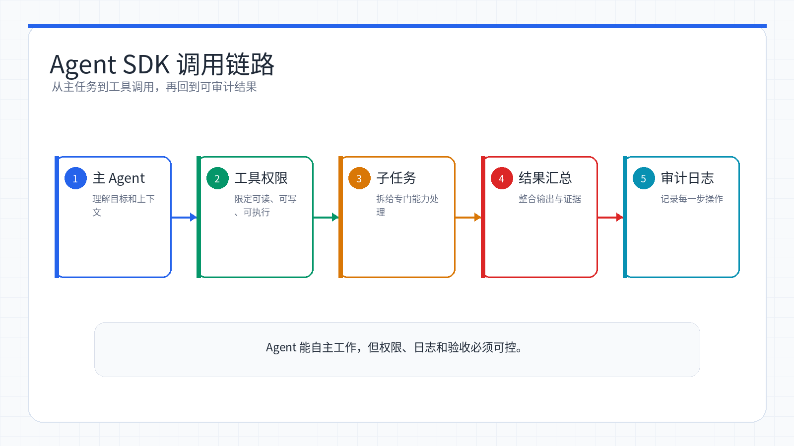
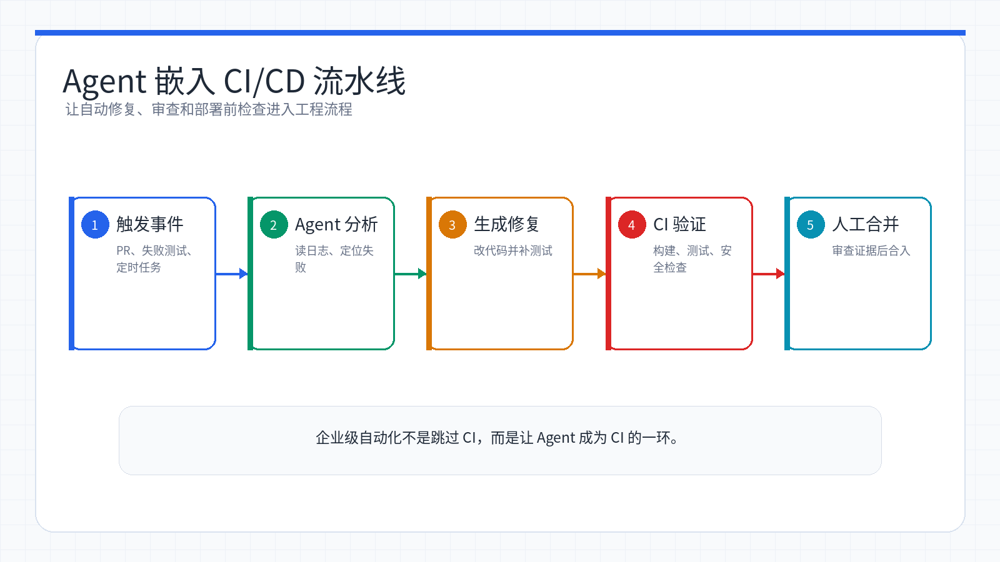

# Week 15：Claude Agent SDK——让 AI 自主完成任务

> 小林用了几个月 Claude Code，一直觉得它就是个「超级终端助手」——你说一句，它做一件事。直到有天她想把「每次 PR 提交后自动跑代码审查」这个流程自动化，才发现 Claude Code 背后有个叫 Agent SDK 的东西，能让 AI 真正「自主干活」：读文件、找 bug、改代码、跑测试、生成报告，一气呵成，不用人盯着。那一刻她意识到，AI 编程不只是「对话式开发」，还能是「任务式自动化」。

<ChapterIntroduction duration="约 3 小时" output="一个 Agent SDK 场景设计：角色边界、工具权限、交接记录、人工门禁与日志方案" prerequisite="学完前几章 Claude Code 使用；能读懂基础脚本更好，但不要求实现 SDK 代码" :tags="['Agent SDK', 'AI 自动化', '工具编排', '权限', '人工门禁']">

本章带你搞懂 Claude Agent SDK 到底是什么、它和 Claude Code CLI 有什么区别、为什么它能让 AI「自主完成任务」而不只是「回答问题」。Course A 的目标不是要求每位同学写出 Python/TypeScript SDK 程序，而是学会设计一个可控 Agent：它能做什么、不能做什么、什么时候必须停下来请人确认、留下哪些交接和审计证据。

</ChapterIntroduction>

<StepBar :active="0" :items="[
  { title: '① 认识 Agent SDK', description: '理解它是什么、为什么需要它' },
  { title: '② 安全设计', description: '角色、工具、权限、日志' },
  { title: '③ 场景草稿', description: '交接记录与人工门禁' }
]" />

* * *

## 什么是 Claude Agent SDK？

小林的第一个问题很朴素：我已经有 Claude Code CLI 了，为什么还需要 Agent SDK？

**Claude Code CLI** 是 Anthropic 官方推出的命令行工具，适合人坐在终端前交互式开发。而 **Claude Agent SDK** 则是把 Claude Code 的全部能力封装成了一个可编程的库，让你能把 AI 嵌入到自己的脚本、流水线、自动化系统中。

小林的理解方式：CLI 是「你和 AI 对话」，SDK 是「你的程序调用 AI」。CLI 适合日常开发，SDK 适合自动化场景——比如每次 PR 提交后自动触发代码审查，或者定时让 AI 巡检系统日志找异常。

### 一句话对比

工具

使用方式

适合场景

**Claude Code CLI**

终端交互，人工输入指令

日常开发、快速任务

**Claude Agent SDK**

代码调用，程序化执行

CI/CD、自动化、批量任务

**基础 anthropic SDK**

API 调用，你自己处理工具循环

聊天、生成、简单 tool use

### 代码对比：一目了然

```diff
@@ -1,16 +1,9 @@
-# 基础 anthropic SDK：你得自己写循环处理工具调用
+# Agent SDK：一行搞定，Claude 自己读文件、找 bug、改代码
-import anthropic
+from claude_agent_sdk import query, ClaudeAgentOptions

-client = anthropic.Anthropic()
-response = client.messages.create(
-    model="claude-sonnet-4-6",
-    max_tokens=1024,
-    messages=[{"role": "user", "content": "修复 auth.py 的 bug"}],
-    tools=[...]  # 你得自己定义工具
-)
-while response.stop_reason == "tool_use":
-    result = your_tool_executor(response.tool_use)
+async for message in query(
+    prompt="修复 auth.py 的 bug",
+    options=ClaudeAgentOptions(allowed_tools=["Read", "Edit", "Bash"]),
+):
+    print(message)
```

区别很明显：基础 SDK 需要你自己实现工具循环、工具执行、上下文管理，而 Agent SDK 把这些全部内置了。

<InfoCard icon="🧭" variant="warning">

**Course A 学习边界**

本周必交不是 SDK 程序，而是一份 Agent 设计卡：

1. **角色边界**：Agent 的职责、输入、输出和禁止事项。
2. **工具权限**：只读工具、可写工具、Bash/MCP 是否允许，用什么权限模式。
3. **交接痕迹**：每一步留下什么日志、报告、diff、测试结果或截图。
4. **人工门禁**：改依赖、删文件、访问生产数据、使用真实 token、自动提交/部署前必须人工确认。
5. **失败退出**：超过轮数、连续失败、成本异常、遇到权限问题时如何停止。

下面的 Python/TypeScript 代码用于理解 Agent SDK 的能力。会写代码的同学可以选做实现；Course A 基础评分看设计证据是否清楚。

</InfoCard>

* * *

## 为什么需要 Agent SDK？

小林把使用场景分成了三类，帮自己理清什么时候该用什么工具。

### 场景一：简单对话和生成

**需求：** 翻译文本、写文案、回答问题

**用什么：** 基础 `anthropic` SDK

```python
import anthropic
client = anthropic.Anthropic()
response = client.messages.create(
    model="claude-sonnet-4-6",
    max_tokens=1024,
    messages=[{"role": "user", "content": "翻译这段话"}]
)
print(response.content[0].text)
```

### 场景二：交互式开发

**需求：** 日常写代码、改 bug、快速任务

**用什么：** Claude Code CLI

```bash
# 终端里直接对话
$ claude
你：帮我重构这个函数
Claude：[读代码、分析、重构、验证]
```

### 场景三：自动化任务

**需求：** CI/CD 流水线、定时巡检、批量处理

**用什么：** Claude Agent SDK

```python
# 嵌入到 GitHub Actions 或定时任务
async for message in query(
    prompt="审查最新 PR 的代码质量",
    options=ClaudeAgentOptions(allowed_tools=["Read", "Grep"])
):
    print(message)
```

小林的判断标准：如果任务需要「人盯着」，用 CLI；如果任务能「自己跑」，用 SDK。比如她每天早上想让 AI 自动检查昨晚的系统日志有没有异常，这就是典型的 SDK 场景——写个脚本，定时触发，不用她守着。

* * *

0

① 认识 Agent SDK

理解它是什么、为什么需要它

0

② 核心能力

工具系统、执行模式、配置选项

0

③ 实战场景

从修 bug 到 CI/CD 流水线

## 安装和配置（选做）

小林决定先把环境搭起来，边学边动手。对于 Course A，同学可以只阅读本节，知道 SDK 程序大概如何启动；作业不要求安装 SDK。

### 安装

Python 需要 3.10+，TypeScript 需要 Node.js 18+：

```bash
# Python
pip install claude-agent-sdk

# TypeScript
npm install @anthropic-ai/claude-agent-sdk
```

### 认证

设置 API Key 环境变量即可：

```bash
export ANTHROPIC_API_KEY=your-api-key
```

也支持云平台认证：

-   **AWS Bedrock**：设置 `CLAUDE_CODE_USE_BEDROCK=1` + AWS 凭证
-   **Google Vertex AI**：设置 `CLAUDE_CODE_USE_VERTEX=1` + GCP 凭证
-   **Microsoft Azure**：设置 `CLAUDE_CODE_USE_FOUNDRY=1` + Azure 凭证

### 第一个 Agent：Hello World

```python
import asyncio
from claude_agent_sdk import query, ClaudeAgentOptions

async def main():
    async for message in query(
        prompt="这个目录下有哪些文件？",
        options=ClaudeAgentOptions(allowed_tools=["Bash", "Glob"]),
    ):
        if hasattr(message, "result"):
            print(message.result)

asyncio.run(main())
```

运行后，Claude 会自己执行 `ls` 或 `find` 命令，然后把结果告诉你。

小林第一次跑通这段代码时最惊讶的是：她没写任何「执行 ls 命令」的代码，只是说了「有哪些文件」，Claude 自己决定用什么工具、怎么执行。这就是 Agent SDK 的核心——你描述任务，AI 自己编排工具。

* * *

## 核心概念：Agent 是怎么工作的？

小林想搞清楚底层原理，于是画了一张图。



*Agent Loop 的关键是让模型在上下文、工具调用、结果验证和下一步决策之间循环。*

### Agent Loop：收集上下文 → 执行动作 → 验证结果 → 重复

```
┌─────────────────────────────────────────┐
│  你：修复 auth.py 的 bug                  │
└─────────────────┬───────────────────────┘
                  │
                  ▼
         ┌────────────────┐
         │  Claude 思考：   │
         │  需要先看代码    │
         └────────┬───────┘
                  │
                  ▼
         ┌────────────────┐
         │  调用 Read 工具  │
         │  读取 auth.py   │
         └────────┬───────┘
                  │
                  ▼
         ┌────────────────┐
         │  Claude 分析：   │
         │  发现空指针问题  │
         └────────┬───────┘
                  │
                  ▼
         ┌────────────────┐
         │  调用 Edit 工具  │
         │  修改代码       │
         └────────┬───────┘
                  │
                  ▼
         ┌────────────────┐
         │  调用 Bash 工具  │
         │  运行测试       │
         └────────┬───────┘
                  │
                  ▼
         ┌────────────────┐
         │  测试通过，任务  │
         │  完成           │
         └────────────────┘
```

这和人类开发者的工作方式一模一样——先看代码，再改代码，然后跑测试看结果，不对就继续改。Agent SDK 把这个循环自动化了。

### 两种使用模式

Agent SDK 提供了两种模式，小林把它们的区别整理成了表格。

模式

适合场景

是否保持上下文

**`query()` 函数**

单次任务，执行完就结束

✗ 无状态

**`resume` 参数**

多轮对话，需要记住之前的内容

✓ 有状态

**模式一：`query()` 函数 —— 无状态，适合单次任务**

```python
import asyncio
from claude_agent_sdk import query, ClaudeAgentOptions

async def main():
    async for message in query(
        prompt="这个目录下有哪些 Python 文件？",
        options=ClaudeAgentOptions(allowed_tools=["Bash", "Glob"]),
    ):
        if hasattr(message, "result"):
            print(message.result)

asyncio.run(main())
```

**模式二：多轮对话 —— 有状态，记住上下文**

当你需要保持上下文、多轮交互时使用。比如先让 Claude 读一个模块，再让它找所有调用这个模块的地方——第二轮它还记得第一轮读了什么。

```python
import asyncio
from claude_agent_sdk import query, ClaudeAgentOptions

async def main():
    session_id = None

    # 第一轮：读认证模块
    async for message in query(
        prompt="读一下 auth.py 的代码",
        options=ClaudeAgentOptions(allowed_tools=["Read"]),
    ):
        if hasattr(message, "subtype") and message.subtype == "init":
            session_id = message.session_id

    # 第二轮：基于上下文继续工作
    async for message in query(
        prompt="找出所有调用它的地方",
        options=ClaudeAgentOptions(resume=session_id),
    ):
        if hasattr(message, "result"):
            print(message.result)

asyncio.run(main())
```

小林的使用经验：绝大多数自动化场景用无状态的 `query()` 就够了。只有当任务真的需要「记住之前说了什么」时，才用 `resume` 参数保持上下文。比如她写过一个「先分析代码架构，再根据架构生成文档」的脚本，这种就需要多轮对话。

* * *

## 内置工具：开箱即用

这是 Agent SDK 最爽的地方——你不需要自己实现任何工具，Claude 直接就能用。小林把常用工具整理成了速查表。

工具

功能

典型用途

**Read**

读取文件

看代码、读配置

**Write**

创建文件

生成新文件

**Edit**

精确编辑文件

改 bug、重构

**Bash**

执行终端命令

跑测试、装依赖、git 操作

**Glob**

按模式找文件

`**/*.py`、`src/**/*.ts`

**Grep**

正则搜索文件内容

找函数定义、找 TODO

**WebSearch**

搜索网页

查文档、找方案

**WebFetch**

抓取网页内容

读在线文档

**Task**

启动子 agent

并行处理子任务

通过 `allowed_tools` 参数控制 agent 能用哪些工具：

```python
# 只读 agent：只能看，不能改
options = ClaudeAgentOptions(
    allowed_tools=["Read", "Glob", "Grep"],
    permission_mode="bypassPermissions"
)

# 全能 agent：能读能写能跑命令
options = ClaudeAgentOptions(
    allowed_tools=["Read", "Write", "Edit", "Bash", "Glob", "Grep"]
)
```

### 权限模式：控制 Agent 的行为边界

小林第一次让 Agent 自动改代码时心里有点慌——万一它改错了怎么办？后来她发现 Agent SDK 提供了三种权限模式，可以精确控制 Agent 的行为边界。

权限模式

行为

适合场景

**`bypassPermissions`**

所有操作都不需要确认

只读任务、可信环境

**`acceptEdits`**

文件修改自动通过，危险操作需确认

代码审查、自动修复

**`requirePermissions`**

所有操作都需要人工确认

生产环境、高风险操作

```python
# 只读 agent：不会修改任何东西
options = ClaudeAgentOptions(
    allowed_tools=["Read", "Grep"],
    permission_mode="bypassPermissions"
)

# 自动修复 agent：可以改代码，但不能删库
options = ClaudeAgentOptions(
    allowed_tools=["Read", "Edit", "Bash"],
    permission_mode="acceptEdits"
)
```

小林的安全原则：第一次跑新 Agent 时，永远先用 `requirePermissions` 模式，看它到底会做什么操作。确认没问题后，再改成 `acceptEdits` 或 `bypassPermissions`。她见过有人直接用 `bypassPermissions` 跑「清理临时文件」的 Agent，结果把整个项目目录都删了。

* * *

0

① 认识 Agent SDK

理解它是什么、为什么需要它

0

② 核心能力

工具系统、执行模式、配置选项

0

③ 实战场景

从修 bug 到 CI/CD 流水线

## 实战场景一：自动修 Bug Agent（选读代码）

理论讲完了，小林决定动手写第一个真正有用的 Agent——给它一个 bug 描述，让它自己找代码、定位问题、修复、跑测试验证。

### 需求

用户反馈登录时偶尔报 500 错误，需要排查 `src/auth/` 目录下的代码并修复。

### 实现（选做）

```python
import asyncio
from claude_agent_sdk import query, ClaudeAgentOptions

async def auto_fix_bug():
    """自动修复 bug 的 Agent"""
    async for message in query(
        prompt="""
用户反馈登录时偶尔报 500 错误，请排查 src/auth/ 目录下的代码并修复。

步骤：
1. 先用 Grep 搜索错误日志和异常处理
2. 读取相关代码文件
3. 定位问题根因
4. 修改代码
5. 运行测试确认修复
        """,
        options=ClaudeAgentOptions(
            allowed_tools=["Read", "Edit", "Bash", "Glob", "Grep"],
            permission_mode="acceptEdits",
            max_turns=20,
        ),
    ):
        # 打印 Agent 的每一步操作
        if hasattr(message, "type"):
            print(f"[{message.type}] {message}")

asyncio.run(auto_fix_bug())
```

### 运行效果

🤖

AI 助手

在线

用户反馈登录时偶尔报 500 错误，请排查 src/auth/ 目录下的代码并修复

👤

🤖

我来帮你排查这个问题。首先搜索一下错误日志和异常处理。

🤖

找到了！在 auth.py 第 45 行，当数据库连接失败时没有正确处理异常，导致返回 500。我来修复这个问题。

🤖

修复完成，现在运行测试验证一下。

🤖

✓ 所有测试通过！问题已修复：根因是数据库连接失败时未捕获异常，导致返回 500。修复方法是添加异常处理，返回 503 状态码并记录日志。所有测试通过。

小林的体会：这个 Agent 最厉害的地方不是「会改代码」，而是「会自己编排步骤」。她没有告诉它「先 grep 再 read 再 edit 再 bash」，只是描述了任务，Agent 自己决定了执行顺序。这就是 Agent SDK 和基础 API 的本质区别——你描述目标，AI 自己规划路径。

* * *

## 实战场景二：代码审查 Agent（推荐设计题）

小林的第二个需求是：每次 PR 提交后，自动审查代码质量，但不做任何修改——只输出报告。

### 需求

审查 `src/` 目录下的代码，关注安全漏洞、性能问题和代码规范，输出结构化报告。

### 实现（选做）

```python
import asyncio
from claude_agent_sdk import query, ClaudeAgentOptions

async def code_review():
    """只读代码审查 Agent"""
    result_text = ""
    async for message in query(
        prompt="""
审查 src/ 目录下的代码，从这几个维度分析：
1. 代码规范：命名、格式、注释
2. 逻辑问题：边界条件、空指针、竞态
3. 性能隐患：N+1 查询、内存泄漏、不必要的循环
4. 可维护性：函数过长、职责不清、魔法数字

输出 JSON 格式：
{
  "issues": [
    {
      "severity": "high/medium/low",
      "file": "...",
      "line": ...,
      "description": "..."
    }
  ],
  "summary": "..."
}
        """,
        options=ClaudeAgentOptions(
            allowed_tools=["Read", "Glob", "Grep"],
            permission_mode="bypassPermissions",
            max_turns=15,
        ),
    ):
        if hasattr(message, "result"):
            result_text = message.result

    print(result_text)

asyncio.run(code_review())
```

### 关键设计

设计点

实现方式

原因

**只读权限**

`allowed_tools=["Read", "Glob", "Grep"]`

审查不应修改代码

**跳过确认**

`permission_mode="bypassPermissions"`

只读操作无风险

**结构化输出**

要求输出 JSON 格式

方便后续处理

小林的经验：只读 Agent 可以放心用 `bypassPermissions` 模式，因为它不会修改任何东西。但如果 Agent 有写权限，永远不要用这个模式——哪怕是「看起来很安全」的操作，也可能出意外。

* * *

## 实战场景三：企业级 CI/CD 流水线（选读，不作为 Course A 实现要求）

前面的场景都是单个 Agent 做单件事。但在真实的企业环境中，小林需要的是一条完整的流水线——多个 Agent 串联协作，每个环节有明确的输入输出，有审计、有回滚、有通知。

### 需求

每次 PR 提交后，自动触发：**代码审查 → 安全扫描 → 自动修复 → 测试验证 → 生成报告**

### 架构设计

```
PR 提交
  │
  ▼
┌─────────────┐    ┌─────────────┐    ┌─────────────┐
│  代码审查     │───▶│  安全扫描     │───▶│  自动修复     │
│  Agent       │    │  Agent       │    │  Agent       │
│ (只读)       │    │ (只读)       │    │ (可写)       │
└─────────────┘    └─────────────┘    └─────────────┘
                                            │
                                            ▼
                                     ┌─────────────┐
                                     │  测试验证     │
                                     │  Agent       │
                                     │ (Bash)       │
                                     └──────┬──────┘
                                            │
                                            ▼
                                     生成报告 + 通知
```

核心思想：**每个 Agent 只做一件事，权限最小化，结果串联传递**。



*企业级流水线把审查、安全、修复、测试和报告拆给不同 Agent，每一步都有明确权限和输出。*

### 完整实现（进阶参考）

```python
import asyncio
import json
import subprocess
from datetime import datetime
from claude_agent_sdk import query, ClaudeAgentOptions, HookMatcher

# 审计日志：记录每个 Agent 的每一步操作
audit_log = []

async def audit_hook(input_data, tool_use_id, context):
    """审计 Hook：记录所有工具调用"""
    audit_log.append({
        "time": datetime.now().isoformat(),
        "tool": input_data.get("tool_name"),
        "input": input_data.get("tool_input", {}),
    })
    return {}

# 通用 Hook 配置：所有 Agent 共享审计能力
audit_hooks = {
    "PostToolUse": [HookMatcher(matcher=".*", hooks=[audit_hook])]
}

async def run_code_review(pr_diff: str) -> str:
    """阶段 1：代码审查 Agent（只读）"""
    result_text = ""
    async for message in query(
        prompt=f"""审查以下 PR diff，从这几个维度分析：
1. 代码规范：命名、格式、注释
2. 逻辑问题：边界条件、空指针、竞态
3. 性能隐患：N+1 查询、内存泄漏
4. 可维护性：函数过长、职责不清

PR Diff:
{pr_diff}

输出 JSON 格式：
{{"issues": [{{"severity": "high/medium/low", "file": "...", "line": ..., "description": "..."}}], "summary": "..."}}""",
        options=ClaudeAgentOptions(
            allowed_tools=["Read", "Glob", "Grep"],
            permission_mode="bypassPermissions",
            hooks=audit_hooks,
            max_turns=10,
        ),
    ):
        if hasattr(message, "result"):
            result_text = message.result
    return result_text

async def run_security_scan() -> str:
    """阶段 2：安全扫描 Agent（只读）"""
    result_text = ""
    async for message in query(
        prompt="""扫描项目代码中的安全漏洞：
1. SQL 注入、XSS、CSRF
2. 硬编码的密钥或凭证
3. 不安全的依赖版本
4. 权限校验缺失

输出 JSON：
{{"vulnerabilities": [{{"severity": "critical/high/medium", "type": "...", "file": "...", "description": "...", "fix_suggestion": "..."}}]}}""",
        options=ClaudeAgentOptions(
            allowed_tools=["Read", "Glob", "Grep", "Bash"],
            permission_mode="bypassPermissions",
            hooks=audit_hooks,
            max_turns=15,
        ),
    ):
        if hasattr(message, "result"):
            result_text = message.result
    return result_text

async def run_auto_fix(review_result: str, security_result: str) -> str:
    """阶段 3：自动修复 Agent（可写）"""
    result_text = ""
    async for message in query(
        prompt=f"""根据以下审查结果修复代码：

代码审查报告：
{review_result}

安全扫描报告：
{security_result}

修复规则：
1. 只修复 severity 为 high 或 critical 的问题
2. 每次修改后运行相关测试确认没有破坏现有功能
3. 不要重构无关代码，只做最小修复
4. 修复完成后输出修改文件列表""",
        options=ClaudeAgentOptions(
            allowed_tools=["Read", "Edit", "Bash", "Glob", "Grep"],
            permission_mode="acceptEdits",
            hooks=audit_hooks,
            max_turns=30,
        ),
    ):
        if hasattr(message, "result"):
            result_text = message.result
    return result_text

async def run_pipeline():
    """完整的 PR 质量守护流水线"""
    print("🔍 阶段 1/3：代码审查...")
    pr_diff = subprocess.run(
        ["git", "diff", "main...HEAD"],
        capture_output=True,
        text=True
    ).stdout
    review_result = await run_code_review(pr_diff)

    print("🛡️ 阶段 2/3：安全扫描...")
    security_result = await run_security_scan()

    print("🔧 阶段 3/3：自动修复...")
    fix_result = await run_auto_fix(review_result, security_result)

    # 保存审计日志
    with open("audit-log.json", "w") as f:
        json.dump(audit_log, f, indent=2, ensure_ascii=False)

    print(f"✅ 流水线完成，审计日志已保存（共 {len(audit_log)} 条操作记录）")
    return fix_result

asyncio.run(run_pipeline())
```

### 企业级设计思考

这条流水线体现了几个关键的企业级设计原则，小林把它们总结成了检查清单。

**权限最小化**

代码审查和安全扫描 Agent 只有只读权限，不可能误改代码。只有自动修复 Agent 才有写权限，而且限定了 `acceptEdits` 模式。

**可审计**

每个 Agent 的每一步操作都通过 Hook 记录到审计日志。出了问题可以回溯是哪个 Agent 在什么时间做了什么操作。

**结果串联**

上一个 Agent 的输出是下一个 Agent 的输入。代码审查的结果喂给自动修复，自动修复的结果喂给测试验证。每个环节都有明确的输入输出契约。

**成本可控**

每个 Agent 都设置了 `max_turns` 限制，防止某个环节失控空转。生产环境中还可以加上 `max_budget_usd` 做预算控制。

这个模式可以直接嵌入 GitHub Actions 或 GitLab CI，每次 PR 自动触发，真正实现「AI 驱动的代码质量守护」。

* * *

## 高级功能：Hooks 和子 Agent

小林跑通基础流水线后，开始探索更高级的功能。

### Hooks：在关键节点插入你的逻辑

Hooks 让你在 Agent 执行的关键时刻插入自定义代码——比如记录日志、拦截危险操作、审计文件变更。

支持的 Hook 类型：

-   **`PreToolUse`**：工具执行前
-   **`PostToolUse`**：工具执行后
-   **`Stop`**：Agent 停止时
-   **`SessionStart`**、**`SessionEnd`**：会话开始/结束

**示例：每次文件被修改时，记录到审计日志**

```python
from datetime import datetime
from claude_agent_sdk import query, ClaudeAgentOptions, HookMatcher

async def log_file_change(input_data, tool_use_id, context):
    """审计 Hook：记录文件修改"""
    file_path = input_data.get("tool_input", {}).get("file_path", "unknown")
    with open("./audit.log", "a") as f:
        f.write(f"{datetime.now()}: modified {file_path}\n")
    return {}

async def main():
    async for message in query(
        prompt="重构 utils.py 提升可读性",
        options=ClaudeAgentOptions(
            permission_mode="acceptEdits",
            hooks={
                "PostToolUse": [
                    HookMatcher(matcher="Edit|Write", hooks=[log_file_change])
                ]
            },
        ),
    ):
        if hasattr(message, "result"):
            print(message.result)
```

**实际用途：**

-   审计日志：记录 Agent 的每一步操作
-   安全拦截：阻止 Agent 修改某些关键文件
-   通知推送：Agent 完成任务时发送消息
-   成本监控：统计工具调用次数和 token 消耗

### 子 Agent：把大任务拆给专家

当任务足够复杂时，你可以定义多个专门的子 Agent，让主 Agent 把子任务分配给它们。每个子 Agent 有自己的指令和工具权限，互不干扰。

```python
from claude_agent_sdk import query, ClaudeAgentOptions, AgentDefinition

async for message in query(
    prompt="用 code-reviewer agent 审查这个项目的代码质量",
    options=ClaudeAgentOptions(
        allowed_tools=["Read", "Glob", "Grep", "Task"],
        agents={
            "code-reviewer": AgentDefinition(
                description="专业代码审查员，负责质量和安全审查",
                prompt="分析代码质量，找出潜在问题并给出改进建议。",
                tools=["Read", "Glob", "Grep"],
            ),
            "test-writer": AgentDefinition(
                description="测试专家，负责编写单元测试",
                prompt="为缺少测试的函数编写单元测试。",
                tools=["Read", "Write", "Bash"],
            ),
        },
    ),
):
    if hasattr(message, "result"):
        print(message.result)
```

小林的使用场景：她用子 Agent 实现了「并行处理」——主 Agent 把「审查前端代码」和「审查后端代码」两个任务分给两个子 Agent，它们同时工作，最后主 Agent 汇总结果。这比串行执行快了一倍。

* * *

## MCP 集成：接入外部世界

学完前面的 MCP 章节后，小林发现 Agent SDK 也能无缝接入 MCP 服务器——让 Agent 不仅能操作本地文件，还能连接数据库、浏览器、第三方 API。

### 接入 Playwright：让 Agent 操作浏览器

```python
async for message in query(
    prompt="打开 example.com 并描述你看到了什么",
    options=ClaudeAgentOptions(
        mcp_servers={
            "playwright": {
                "command": "npx",
                "args": ["@playwright/mcp@latest"]
            }
        }
    ),
):
    if hasattr(message, "result"):
        print(message.result)
```

### 接入数据库：让 Agent 查询和操作数据

```python
async for message in query(
    prompt="查询数据库中最近注册的 10 个用户",
    options=ClaudeAgentOptions(
        mcp_servers={
            "sqlite": {
                "command": "npx",
                "args": ["-y", "@modelcontextprotocol/server-sqlite",
                        "--db-path", "./data/app.db"]
            }
        }
    ),
):
    if hasattr(message, "result"):
        print(message.result)
```

### 常见的 MCP 集成场景

MCP 服务器

用途

典型场景

**Playwright**

浏览器自动化

E2E 测试、截图、爬虫

**PostgreSQL/MySQL**

数据库操作

数据查询、迁移、备份

**Slack/Email**

通知推送

Agent 完成任务后发送通知

**GitHub**

代码仓库操作

自动创建 PR、管理 Issue

小林的实战经验：她把 Agent SDK + MCP 组合用在了「全栈验证」场景——Agent 改完后端代码后，自动通过 Playwright MCP 打开浏览器，测试前端功能是否正常。这比只跑单元测试更接近真实用户体验。

* * *

## 错误处理和调试

Agent 跑不通时怎么办？小林总结了一套排查方法。

### 异常类型

Agent SDK 提供了清晰的异常类型，方便你在生产环境中做好容错：

```python
from claude_agent_sdk import query, CLINotFoundError, ProcessError

try:
    async for msg in query(prompt="分析代码"):
        print(msg)
except CLINotFoundError:
    print("Claude Code CLI 未安装，请先安装")
except ProcessError as e:
    print(f"进程异常退出，退出码: {e.exit_code}")
```

### 常见问题排查

问题

可能原因

解决方案

`CLINotFoundError`

Claude Code CLI 未安装

`npm install -g @anthropic-ai/claude-code`

`ProcessError`

Agent 执行失败

检查 `exit_code` 和日志

Agent 一直不停止

`max_turns` 设置过大

降低 `max_turns` 或优化 prompt

工具调用失败

权限不足

检查 `allowed_tools` 和 `permission_mode`

### 调试技巧

**1\. 打印所有消息**

```python
async for message in query(prompt="...", options=options):
    print(f"[{message.type}] {message}")  # 打印每一步
```

**2\. 使用 Hooks 记录日志**

```python
async def debug_hook(input_data, tool_use_id, context):
    print(f"Tool: {input_data.get('tool_name')}")
    print(f"Input: {input_data.get('tool_input')}")
    return {}

options = ClaudeAgentOptions(
    hooks={"PreToolUse": [HookMatcher(matcher=".*", hooks=[debug_hook])]}
)
```

**3\. 限制执行轮数**

```python
options = ClaudeAgentOptions(
    max_turns=5,  # 最多执行 5 轮，防止死循环
)
```

小林踩过的坑：她第一次写 Agent 时，prompt 写得太模糊（「优化代码」），结果 Agent 一直在改来改去，跑了 50 轮还没停。后来她学会了两招：1) prompt 要具体（「重构 utils.py 的 parse 函数，提取重复逻辑」），2) 设置 `max_turns=10` 防止失控。

* * *

## Agent SDK vs 其他 Agent 框架

小林还用过 LangChain、CrewAI 这些框架，于是好奇 Agent SDK 和它们有什么区别。

### 框架对比

框架

最适合的场景

核心优势

学习曲线

**Claude Agent SDK**

代码开发、文件操作、命令执行

开箱即用的开发工具，无需自己实现

低

**LangChain**

构建复杂的通用 AI 应用

高度自定义，生态丰富

高

**CrewAI**

模拟多角色协作场景

角色扮演、任务分配

中

**LlamaIndex**

知识库问答系统

连接企业数据与 LLM

中

```diff
@@ -1,18 +1,9 @@
-# LangChain：需要自己定义工具、配置 agent
+# Agent SDK：工具已内置，直接用
-from langchain.agents import initialize_agent, Tool
-from langchain.llms import Anthropic
-from langchain.tools import BaseTool
+from claude_agent_sdk import query, ClaudeAgentOptions

-class ReadFileTool(BaseTool):
-    name = "read_file"
-    description = "读取文件内容"
-    def _run(self, file_path: str) -> str:
-        with open(file_path, 'r') as f:
-            return f.read()
-tools = [ReadFileTool()]
-agent = initialize_agent(tools, llm, agent="zero-shot-react-description")
-result = agent.run("读取 README.md 并总结")
+async for message in query(
+    prompt="读取 README.md 并总结",
+    options=ClaudeAgentOptions(allowed_tools=["Read"]),
+):
+    print(message)
```

### 什么时候该用 Agent SDK？

小林的选择标准：

你想做的事

该用什么

简单对话、文本生成、翻译

基础 `anthropic` SDK

单次 tool use（查天气、算数）

基础 `anthropic` SDK

自主完成多步骤开发任务

**Agent SDK**

嵌入 CI/CD 流水线

**Agent SDK**

构建能操作文件系统的应用

**Agent SDK**

日常交互式开发

Claude Code CLI

构建复杂的多模型应用

LangChain

知识库问答系统

LlamaIndex

小林的总结：如果你的任务需要 Claude「自己动手干活」（读文件、改代码、跑命令），用 Agent SDK。如果只是「问答」，用基础 SDK 就够了。如果需要「多模型编排」或「复杂工作流」，考虑 LangChain。

* * *

## 最佳实践

跑通之后，小林又回头整理了几条「让 Agent 不出乱子」的规矩。

### 1\. Prompt 要具体

**❌ 不好的 Prompt**

```python
prompt="优化代码"
```

**✅ 好的 Prompt**

```python
prompt="""
重构 src/utils.py 的 parse_config 函数：
1. 提取重复的 JSON 解析逻辑
2. 添加错误处理
3. 补充单元测试
"""
```

### 2\. 限制执行轮数

```python
options = ClaudeAgentOptions(
    max_turns=15,  # 防止死循环
)
```

### 3\. 权限最小化

```python
# 只读任务：不给写权限
options = ClaudeAgentOptions(
    allowed_tools=["Read", "Grep"],
    permission_mode="bypassPermissions"
)

# 写任务：限定工具范围
options = ClaudeAgentOptions(
    allowed_tools=["Read", "Edit"],  # 不给 Bash 权限
    permission_mode="acceptEdits"
)
```

### 4\. 使用 Hooks 做审计

```python
audit_log = []

async def audit_hook(input_data, tool_use_id, context):
    audit_log.append({
        "time": datetime.now().isoformat(),
        "tool": input_data.get("tool_name"),
        "input": input_data.get("tool_input"),
    })
    return {}

options = ClaudeAgentOptions(
    hooks={"PostToolUse": [HookMatcher(matcher=".*", hooks=[audit_hook])]}
)
```

### 5\. 结构化输出

```python
prompt="""
分析代码质量，输出 JSON 格式：
{
  "issues": [...],
  "summary": "..."
}
"""
```

这样方便后续处理和解析。

* * *

## 场景速查表

小林把自己用过的场景整理成了速查表，方便日后复制粘贴。

场景

核心工具

权限模式

难度

代码示例

**自动修 Bug**

Read, Edit, Bash, Grep

acceptEdits

入门

见「实战场景一」

**代码审查**

Read, Glob, Grep

bypassPermissions

入门

见「实战场景二」

**CI/CD 自动修复**

Read, Edit, Bash

acceptEdits

中级

见「实战场景三」

**技术调研报告**

WebSearch, WebFetch, Write

acceptEdits

入门

`prompt="调研 2026 年主流的 Python Web 框架"`

**浏览器自动化**

MCP (Playwright)

acceptEdits

中级

见「MCP 集成」

**多 Agent 协作**

Task + AgentDefinition

混合

高级

见「子 Agent」

**数据库操作**

MCP (PostgreSQL/MySQL)

bypassPermissions

中级

见「MCP 集成」

**邮件/通知助手**

MCP (Slack/Email)

bypassPermissions

中级

配置 Slack MCP 服务器

* * *

## 参考资源

小林把学习路上收藏的链接都留在这里，方便日后深挖。

### 官方资源

-   [Agent SDK 官方文档](https://platform.claude.com/docs/en/agent-sdk/overview) - 最权威的参考
-   [GitHub - claude-agent-sdk-python](https://github.com/anthropics/claude-code-sdk-python) - Python SDK 源码
-   [GitHub - claude-agent-sdk-typescript](https://github.com/anthropics/claude-agent-sdk-typescript) - TypeScript SDK 源码
-   [示例 Agent 项目](https://github.com/anthropics/claude-agent-sdk-demos) - 邮件助手、研究 agent 等

### 博客与教程

-   [Building agents with the Claude Agent SDK](https://claude.com/blog/building-agents-with-the-claude-agent-sdk) - Anthropic 官方工程博客，讲解设计哲学和架构
-   [Claude Agent SDK Python 学习指南](https://redreamality.com/blog/claude-agent-sdk-python-) - 中文友好，从零开始的完整教程
-   [Claude Agent SDK 完整教程](https://blog.wenhaofree.com/en/posts/articles/claude-agent-sdk-tutorial/) - 工具系统、Agent Loop、可控执行实战
-   [12 个 Agent SDK 实用场景](https://skywork.ai/blog/claude-agent-sdk-use-cases-2025/) - 覆盖编码、数据、自动化等
-   [Step-by-Step Agent 教程](https://skywork.ai/blog/how-to-use-claude-agent-sdk-step-by-step-ai-agent-tutorial/) - TypeScript + Python 双轨教程

* * *

## 本周回顾

小林这一章从「Claude Code 就是个终端助手」走到了「AI 能自主完成任务、嵌入自动化流程」。下面对照检查你掌握得怎么样。

Week 15 学习进度

1

理解 Agent SDK 是什么

能说清 Agent SDK 和 CLI、基础 SDK 的区别，知道什么场景该用什么工具

2

掌握核心概念

理解 Agent Loop、工具系统、权限模式、执行轮数控制

3

会设计单个 Agent

能写出「自动修 bug」或「代码审查」这样的角色边界、输入输出和禁止事项

4

会设计交接流程

能说明「审查 → 扫描 → 修复 → 测试」每一步交接什么证据

5

知道哪些是进阶能力

Hooks、子 Agent、MCP 集成作为选读，理解它们分别用于审计、分工和外部工具接入

6

记住最佳实践

Prompt 具体化、限制轮数、权限最小化、审计日志、结构化输出、人工门禁

**自测问题：**

1.  **场景判断题**：以下场景分别该用什么工具？

    -   翻译一段文本 → ？
    -   日常写代码、改 bug → ？
    -   每次 PR 提交后自动跑代码审查 → ？
2.  **权限模式题**：以下任务分别该用什么权限模式？

    -   只读代码审查 → ？
    -   自动修复 bug → ？
    -   生产环境操作 → ？
3.  **设计题**：如果要构建一个「每天早上自动检查系统日志，发现异常就发 Slack 通知」的 Agent，你会怎么设计？写出角色边界、允许工具、交接日志和人工门禁。

4.  **调试题**：你的 Agent 一直不停止，跑了 50 轮还在改代码，可能是什么原因？怎么解决？


点击查看答案

**1\. 场景判断题**

-   翻译一段文本 → 基础 `anthropic` SDK
-   日常写代码、改 bug → Claude Code CLI
-   每次 PR 提交后自动跑代码审查 → Agent SDK

**2\. 权限模式题**

-   只读代码审查 → `bypassPermissions`（只读无风险）
-   自动修复 bug → `acceptEdits`（可以改代码，但危险操作需确认）
-   生产环境操作 → `requirePermissions`（所有操作都需确认）

**3\. 设计题**

-   角色边界：只读日志、识别异常、生成报告；不自动修生产系统
-   工具：`Read`（读日志）、`Grep`（搜索异常）
-   MCP 服务器：Slack MCP（发通知），token 只用环境变量
-   权限模式：`bypassPermissions` 仅限只读日志；发通知前可设置人工确认
-   交接痕迹：异常摘要、命中文件、时间范围、通知记录
-   人工门禁：删除日志、重启服务、访问生产密钥、修改配置前必须停下确认
-   定时触发：用 cron 或 GitHub Actions 定时运行脚本（选做实现）

**4\. 调试题**

-   可能原因：Prompt 太模糊（如「优化代码」），Agent 不知道什么时候算完成
-   解决方案：
    1.  设置 `max_turns=10` 限制执行轮数
    2.  把 Prompt 改具体（如「重构 utils.py 的 parse 函数，提取重复逻辑」）
    3.  要求输出明确的完成标志（如「修复完成后输出修改文件列表」）

* * *

## 下周预告

掌握了 Agent SDK 之后，小林开始思考：能不能把 AI 的能力再往前推一步，让它不只是「执行任务」，而是「理解业务逻辑、自主决策、持续学习」？下一章我们进入 AI Agent 的进阶话题——记忆系统、决策树、反思机制，让 Agent 真正变成「会思考的助手」。
