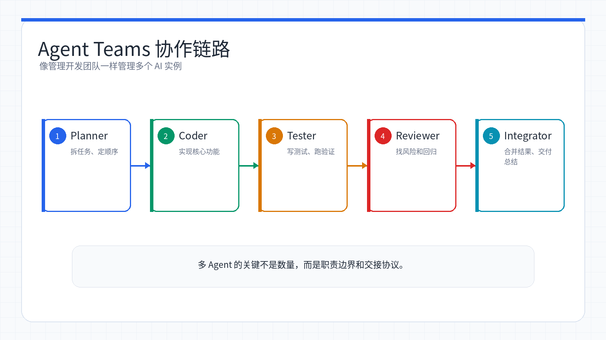
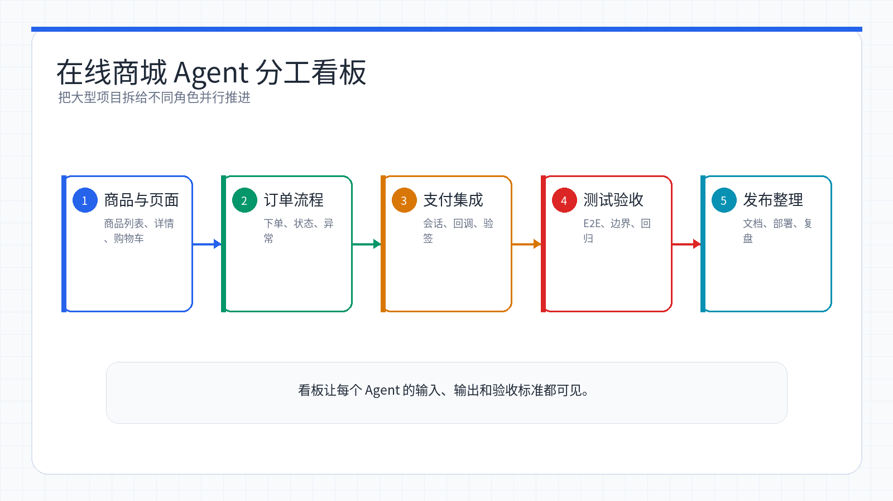

# Week 16：Agent Teams - 多智能体协作的终极挑战

<ChapterIntroduction 
  title="小林的最终蜕变"
  description="从非技术小白到能设计 AI 协作流程的学习者"
  :objectives="[
    '理解多智能体协作的核心原理',
    '学会设计 Agent Teams 的角色边界和交接方式',
    '学会用任务看板、人工门禁和验收证据管理 AI 协作',
    '完成课程 A 的终极项目挑战'
  ]"
  :duration="180"
/>

## 小林的故事：从零到英雄

还记得 16 周前的小林吗？那个连命令行都不敢碰的产品经理，现在已经成长为能够设计 AI 协作流程、看懂风险边界、组织项目证据的「准开发者」。

让我们回顾一下小林的成长历程：

**Week 1-3：先会用工具**
- 用小游戏消除编程畏惧
- 学会 AI IDE 的本地项目流程
- 掌握 Claude Code 的终端协作基础

**Week 4-8：做出产品原型**
- 从真实人群和真实场景里找到创意
- 用 Mom Test、JTBD 和双钻模型验证需求
- 搭建原型、接入真实 AI 能力，并根据反馈迭代

**Week 9-13：沉淀工程流程**
- 用 Workflow 固定 AI 辅助开发步骤
- 用 Skills 和 MCP 扩展 Claude Code 能力
- 用 Superpowers 和 Spec Coding 提升复杂任务的可控性

**Week 14-15：进入 Agent 自动化**
- 学会设计长运行任务、检查点和验收标准
- 理解 Claude Agent SDK 的工具、权限与自动化边界

现在，小林即将迎来课程 A 的最终挑战：**Agent Teams - 多智能体协作**。

<InfoCard
  type="warning"
  title="Course A 期末边界"
  icon="⚠️"
>

本周不要求你真的创建多个 Agent、实现 SDK、开发 3000+ 行应用或无人值守跑完整项目。Course A 必交证据是：

- **角色边界**：Team Lead、Teammates 各自负责什么、不允许做什么。
- **交接痕迹**：任务分配、消息记录、接口/文档/截图/diff/测试输出等证据。
- **人工门禁**：涉及密钥、生产数据、删除文件、提交部署、付费调用时，必须由人确认。
- **最终看板**：每个任务的状态、负责人、验收标准和完成证据。
- **课程复盘**：说明 16 周里你的产品原型和 AI 协作流程如何演进。

后文的大型商城、项目管理系统案例用于理解协作方法，不是基础评分要求。

</InfoCard>



*多 Agent 团队把规划、实现、测试、审查和整合拆给不同角色，并行推进但统一验收。*

---

## 什么是 Agent Teams？

<InfoCard 
  type="concept"
  title="Agent Teams 核心概念"
  icon="🤖"
>

**Agent Teams** 是 Claude Code 的革命性功能，它让多个独立的 AI 实例可以像真正的开发团队一样协同工作。

想象一下：
- 以前：你带着一个超级能干的助手工作
- 现在：你带领一支完整的 AI 开发团队

团队成员可以：
- ✅ 同时工作（真正的并行）
- ✅ 互相交流（直接通信）
- ✅ 协同完成复杂任务
- ✅ 各自拥有独立的上下文空间

</InfoCard>

### 小林的困惑

周一早上，小林接到一个课程练习：「为一个在线商城系统设计多 Agent 协作方案」。

小林心想：「这个项目太大了！需要前端、后端、数据库、测试...如果只靠一句 prompt 让 AI 开写，肯定会乱。先把团队分工、接口合同和人工门禁设计出来，才有可能安全推进。」

正当小林发愁时，技术总监走过来说：「听说过 Agent Teams 吗？可以让多个 AI 同时工作，就像组建一个开发团队一样。」

小林眼前一亮：「这不就是期末看板要练的能力吗？」

### Agent Teams vs Subagent：有什么不同？

小林想起之前学过的 Subagent，疑惑地问：「Agent Teams 和 Subagent 不都是多个 AI 协作吗？有什么区别？」

| 模式 | 通信结构 | 适合场景 |
|---|---|---|
| Subagent | 你 → 主代理 → 子代理 A/B → 主代理汇总；子代理之间不直接交流 | 快速、明确、依赖少的任务分发 |
| Agent Teams | 你 → Team Lead → 多个 Teammate；成员之间可以直接通信和审查 | 复杂系统开发，需要持续协作的任务 |

<InfoCard 
  type="tip"
  title="选择建议"
  icon="💡"
>

**使用 Subagent 的场景：**
- 快速、明确的单一任务
- 任务之间没有太多依赖
- 不需要成员之间持续讨论

**使用 Agent Teams 的场景：**
- 复杂的系统重构
- 需要多角度分析和讨论
- 真正的并行开发（前端、后端同时进行）
- 任务之间需要频繁协调

</InfoCard>

---

## Agent Teams 核心架构

小林开始深入研究 Agent Teams 的工作原理。技术总监给他画了一张架构图。

### 团队组成

一个 Agent Team 由四种核心组件构成：

<StepBar 
  :steps="[
    { title: 'Team Lead', description: '团队负责人，负责任务拆解和结果综合' },
    { title: 'Teammates', description: '团队成员，真正干活的开发者' },
    { title: 'TaskList', description: '共享任务板，管理任务状态和依赖' },
    { title: 'Messaging', description: '消息系统，成员之间的通信工具' }
  ]"
  :currentStep="0"
/>

#### 1. Team Lead（团队负责人）

Team Lead 是整个团队的「大脑」和「协调者」：

```
职责：
✅ 需求分析与任务拆解
✅ 团队创建与管理
✅ 任务分配与调度
✅ 结果综合与质量把控

特点：
- 不直接执行编码任务
- 通常使用 Opus 模型（需要强大推理能力）
- 拥有全局视角
```

#### 2. Teammates（团队成员）

Teammates 是真正干活的「开发者」：

```
能力：
✅ 独立的 200K token 上下文窗口
✅ 完整的工具权限（Read、Write、Edit、Bash 等）
✅ 自主任务认领
✅ 直接通信能力

特点：
- 每个成员都是独立的 Claude 实例
- 可以使用 Sonnet 模型（性价比高）
- 专注于具体实现
```

#### 3. TaskList（共享任务板）

TaskList 是团队的「项目管理工具」，类似于 Jira 或 Trello：

```
功能：
✅ 任务状态管理（pending、in_progress、completed）
✅ 依赖关系管理（任务 B 依赖任务 A）
✅ 自动解锁机制（任务 A 完成后，任务 B 自动解锁）
✅ 文件锁机制（防止多个成员同时修改同一文件）

存储位置：
~/.claude/tasks/{team-name}/
├── task-1.json
├── task-2.json
└── current_tasks/
    └── task-lock-file.txt
```

#### 4. Messaging System（消息系统）

消息系统是团队成员之间的「聊天工具」：

```
特性：
✅ 点对点通信（成员 A → 成员 B）
✅ 群发广播（Team Lead → 所有成员）
✅ 基于文件系统（无需网络连接）
✅ 完全透明（可以查看所有通信记录）

存储位置：
~/.claude/teams/{team-name}/inboxes/
├── team-lead.json
├── teammate-1.json
└── teammate-2.json
```

### 协作流程

小林看着架构图，逐渐理解了整个协作流程：

```
用户提出需求
    ↓
Team Lead 分析需求，拆解任务
    ↓
创建团队成员，初始化 TaskList
    ↓
    ├─→ Teammate A 认领任务 1 ─┐
    ├─→ Teammate B 认领任务 2 ─┼→ 并行执行
    ├─→ Teammate C 认领任务 3 ─┤
    │                           ↓
    └────────────────────────── 成员间通过消息系统协调
                                ↓
                       所有任务完成后，Team Lead 综合结果
                                ↓
                       向用户输出最终成果
```

---

## 快速开始：开启 Agent Teams

小林迫不及待地想要尝试 Agent Teams。第一步是开启这个实验性功能。

### 步骤 1：开启实验性功能

Agent Teams 目前是实验性功能，默认关闭。小林需要先开启它。

<AiChat
  :initial-messages="[
    {
      role: 'user',
      content: '帮我在 settings.json 中开启 Agent Teams 功能'
    },
    {
      role: 'assistant',
      content: '好的！我来帮你开启 Agent Teams 功能。我会修改 ~/.claude/settings.json 文件，添加配置。配置已完成！请完全退出并重启 Claude Code，功能就会生效。'
    },
    {
      role: 'user',
      content: '好的，我重启了。怎么验证是否开启成功？'
    },
    {
      role: 'assistant',
      content: '你可以尝试这样的对话来验证：「你可以帮我创建一个 Agent Team 吗？」如果我能够理解并响应创建团队的需求，说明功能已经成功开启。'
    }
  ]"
  :show-input="false"
/>

<InfoCard 
  type="warning"
  title="重要提示"
  icon="⚠️"
>

修改配置后，**必须完全退出并重启 Claude Code**，功能才会生效。

如果自动配置不工作，可以手动编辑 `~/.claude/settings.json` 文件：

```json
{
  "experimental": {
    "agentTeams": true
  }
}
```

</InfoCard>

### 步骤 2：配置可视化模式（可选）

小林想实时看到团队成员的工作状态，于是配置了分屏显示模式。

```bash
# 安装 tmux（如果还没有）
# macOS
brew install tmux

# Ubuntu/Debian
sudo apt-get install tmux

# 配置分屏模式
# 让 Claude Code 帮你配置
```

配置后的效果：

```
┌─────────────────┬─────────────────┬─────────────────┐
│  Teammate 1     │  Teammate 2     │  Teammate 3     │
│  正在分析代码... │  正在实现 API... │  正在编写测试... │
│                 │                 │                 │
└─────────────────┴─────────────────┴─────────────────┘
```

<InfoCard 
  type="tip"
  title="配置建议"
  icon="💡"
>

如果你想使用分屏模式，可以让 Claude Code 帮你配置：

```
帮我在 settings.json 中开启 Agent Teams 的分屏显示模式，使用 tmux
```

手动配置：

```json
{
  "experimental": {
    "agentTeams": true
  },
  "agent-teams": {
    "displayMode": "split-panes",
    "terminalMultiplexer": "tmux"
  }
}
```

</InfoCard>

---

## 示例项目：小林的在线商城（方法演示）

小林用一个在线商城来演示 Agent Teams 的分工方法。这里重点看**如何拆角色、定义接口、记录交接和设置人工门禁**，不是要求 Course A 学生在期末真的开发完整商城。



*看板让每个 Agent 的负责模块、交付物和验收标准一眼可见。*

### 项目需求

**功能需求：**
- 用户系统（注册、登录、个人中心）
- 商品展示（列表、详情、搜索、分类）
- 购物车（添加、删除、修改数量）
- 订单系统（下单、支付、订单查询）
- 后台管理（商品管理、订单管理）

**技术要求：**
- 前端：React + TypeScript + Tailwind CSS
- 后端：Node.js + Express + PostgreSQL
- 状态管理：Zustand
- API 设计：RESTful

### 小林的团队规划

小林仔细思考后，决定这样组建团队：

<StepBar 
  :steps="[
    { title: '架构设计', description: 'Teammate A 设计整体架构' },
    { title: '前端开发', description: 'Teammate B 实现前端界面' },
    { title: '后端开发', description: 'Teammate C 实现后端 API' },
    { title: '数据库设计', description: 'Teammate D 设计数据库' },
    { title: '测试编写', description: 'Teammate E 编写测试' }
  ]"
  :currentStep="0"
/>

小林在 Claude Code 中输入了详细的需求：

```
我想开发一个在线商城系统。

创建一个团队来协作开发：

团队成员分工：
- Teammate A（架构师）：设计整体架构，定义 API 接口，规划数据结构
- Teammate B（前端工程师）：实现 React 前端，包括商品列表、购物车、订单页面
- Teammate C（后端工程师）：实现 Express API，包括用户认证、商品管理、订单处理
- Teammate D（数据库工程师）：设计 PostgreSQL 数据库表结构，编写迁移脚本
- Teammate E（测试工程师）：编写单元测试和集成测试

技术要求：
- 前端：React + TypeScript + Vite + Tailwind CSS + Zustand
- 后端：Node.js + Express + TypeScript + Prisma
- 数据库：PostgreSQL
- 认证：JWT
- API 风格：RESTful

每个成员使用 Sonnet 模型，Team Lead 使用 Opus。

请先让架构师设计整体方案，定义好接口和数据结构后，其他成员再并行开发。
```

### 第一阶段：架构设计

Team Lead 首先让 Teammate A（架构师）进行整体设计。

**Teammate A 的输出：**

```
项目结构设计：

online-shop/
├── frontend/                 # React 前端
│   ├── src/
│   │   ├── components/      # 组件
│   │   │   ├── ProductCard.tsx
│   │   │   ├── CartItem.tsx
│   │   │   └── OrderList.tsx
│   │   ├── pages/           # 页面
│   │   │   ├── Home.tsx
│   │   │   ├── ProductDetail.tsx
│   │   │   ├── Cart.tsx
│   │   │   └── Checkout.tsx
│   │   ├── stores/          # Zustand 状态管理
│   │   │   ├── authStore.ts
│   │   │   ├── cartStore.ts
│   │   │   └── productStore.ts
│   │   ├── api/             # API 调用
│   │   │   └── client.ts
│   │   └── types/           # TypeScript 类型
│   │       └── index.ts
│   └── package.json
│
├── backend/                  # Node.js 后端
│   ├── src/
│   │   ├── routes/          # 路由
│   │   │   ├── auth.ts
│   │   │   ├── products.ts
│   │   │   └── orders.ts
│   │   ├── controllers/     # 控制器
│   │   ├── middleware/      # 中间件
│   │   │   └── auth.ts
│   │   ├── services/        # 业务逻辑
│   │   └── types/           # TypeScript 类型
│   ├── prisma/
│   │   └── schema.prisma    # 数据库模型
│   └── package.json
│
└── README.md

核心数据结构：

// 用户
interface User {
  id: string;
  email: string;
  password: string;  // 加密存储
  name: string;
  createdAt: Date;
}

// 商品
interface Product {
  id: string;
  name: string;
  description: string;
  price: number;
  stock: number;
  imageUrl: string;
  categoryId: string;
  createdAt: Date;
}

// 订单
interface Order {
  id: string;
  userId: string;
  items: OrderItem[];
  totalAmount: number;
  status: 'pending' | 'paid' | 'shipped' | 'completed';
  createdAt: Date;
}

// 订单项
interface OrderItem {
  id: string;
  orderId: string;
  productId: string;
  quantity: number;
  price: number;
}
```

**API 接口设计（合同优先）：**

```typescript
// 认证 API
POST   /api/auth/register      // 注册
POST   /api/auth/login         // 登录
GET    /api/auth/me            // 获取当前用户信息

// 商品 API
GET    /api/products           // 获取商品列表
GET    /api/products/:id       // 获取商品详情
POST   /api/products           // 创建商品（管理员）
PUT    /api/products/:id       // 更新商品（管理员）
DELETE /api/products/:id       // 删除商品（管理员）

// 购物车 API（前端本地管理，不需要后端 API）

// 订单 API
POST   /api/orders             // 创建订单
GET    /api/orders             // 获取用户订单列表
GET    /api/orders/:id         // 获取订单详情
PUT    /api/orders/:id/status  // 更新订单状态（管理员）

// 请求/响应格式示例
POST /api/auth/login
Request:
{
  "email": "user@example.com",
  "password": "password123"
}

Response (成功):
{
  "success": true,
  "data": {
    "token": "eyJhbGciOiJIUzI1NiIsInR5cCI6IkpXVCJ9...",
    "user": {
      "id": "user-123",
      "email": "user@example.com",
      "name": "张三"
    }
  }
}

Response (失败):
{
  "success": false,
  "error": {
    "code": "INVALID_CREDENTIALS",
    "message": "邮箱或密码错误"
  }
}
```

<InfoCard 
  type="concept"
  title="合同优先原则"
  icon="📋"
>

**为什么要先定义接口？**

在多人协作开发中，如果前后端同时开工但没有事先约定接口格式，很容易出现对不上的情况：

- 前端发送 `{user, pass}`
- 后端期望 `{email, password}`
- 结果：对不上，需要返工

**合同优先的好处：**
- ✅ 前后端可以并行开发
- ✅ 减少集成时的问题
- ✅ 接口文档自然形成
- ✅ 测试可以提前编写

</InfoCard>

### 第二阶段：并行开发

架构确定后，Team Lead 创建任务列表，其他成员开始并行工作。

**任务分配：**

```
任务列表：
├── [Teammate B] 实现前端商品列表和详情页 (进行中...)
├── [Teammate C] 实现后端认证和商品 API (进行中...)
├── [Teammate D] 设计数据库表结构和迁移脚本 (进行中...)
└── [Teammate E] 编写 API 测试用例 (等待后端完成...)
```

小林打开 tmux 分屏模式，看到了激动人心的场景：

```
┌─────────────────────┬─────────────────────┬─────────────────────┐
│  Teammate B         │  Teammate C         │  Teammate D         │
│  [前端工程师]        │  [后端工程师]        │  [数据库工程师]      │
│                     │                     │                     │
│  正在创建           │  正在实现           │  正在设计           │
│  ProductCard.tsx... │  auth.ts 路由...    │  Prisma schema...   │
│                     │                     │                     │
│  ✓ 创建组件目录     │  ✓ 安装依赖         │  ✓ 初始化 Prisma    │
│  ✓ 定义 Props 类型  │  ✓ 配置 JWT         │  ✓ 定义 User 模型   │
│  → 实现商品卡片     │  → 实现登录逻辑     │  → 定义 Product 模型│
└─────────────────────┴─────────────────────┴─────────────────────┘
```

**成员之间的协作对话：**

<AiChat
  :initial-messages="[
    {
      role: 'assistant',
      content: 'Teammate C → Teammate D：数据库表结构设计好了吗？我需要知道 User 表的字段名称，这样才能在后端代码中正确引用。',
      name: 'Teammate C'
    },
    {
      role: 'assistant',
      content: 'Teammate D → Teammate C：已经完成了！User 表的字段是：id, email, password, name, createdAt。我已经把 Prisma schema 提交了，你可以运行 npx prisma generate 生成类型。',
      name: 'Teammate D'
    },
    {
      role: 'assistant',
      content: 'Teammate B → Teammate C：后端的商品列表 API 完成了吗？我前端需要调用 GET /api/products 来获取数据。',
      name: 'Teammate B'
    },
    {
      role: 'assistant',
      content: 'Teammate C → Teammate B：商品列表 API 已经完成了！返回格式包含 products 数组、total、page、pageSize 字段。支持分页参数 ?page=1&pageSize=20',
      name: 'Teammate C'
    }
  ]"
  :show-input="false"
/>

### 关键代码展示

让我们看看团队成员产出的核心代码。

**Teammate D 的数据库设计：**

```prisma
// prisma/schema.prisma
generator client {
  provider = "prisma-client-js"
}

datasource db {
  provider = "postgresql"
  url      = env("DATABASE_URL")
}

model User {
  id        String   @id @default(uuid())
  email     String   @unique
  password  String
  name      String
  createdAt DateTime @default(now())
  orders    Order[]
}

model Product {
  id          String      @id @default(uuid())
  name        String
  description String
  price       Float
  stock       Int
  imageUrl    String
  categoryId  String
  category    Category    @relation(fields: [categoryId], references: [id])
  orderItems  OrderItem[]
  createdAt   DateTime    @default(now())
}

model Category {
  id       String    @id @default(uuid())
  name     String
  products Product[]
}

model Order {
  id          String      @id @default(uuid())
  userId      String
  user        User        @relation(fields: [userId], references: [id])
  items       OrderItem[]
  totalAmount Float
  status      String      @default("pending")
  createdAt   DateTime    @default(now())
}

model OrderItem {
  id        String  @id @default(uuid())
  orderId   String
  order     Order   @relation(fields: [orderId], references: [id])
  productId String
  product   Product @relation(fields: [productId], references: [id])
  quantity  Int
  price     Float
}
```

**Teammate C 的后端 API：**

**认证中间件实现对比：**

```diff
-const token = req.headers.authorization;
-const decoded = jwt.verify(token, process.env.JWT_SECRET);
-req.user = decoded;
-next();
+try {
+  const authHeader = req.headers.authorization;
+  if (!authHeader || !authHeader.startsWith('Bearer ')) {
+    return res.status(401).json({ success: false, error: { code: 'NO_TOKEN' } });
+  }
+  const token = authHeader.substring(7);
+  req.user = jwt.verify(token, process.env.JWT_SECRET);
+  next();
+} catch (error) {
+  return res.status(401).json({ success: false, error: { code: 'INVALID_TOKEN' } });
+}
```

**Teammate B 的前端组件：**

```tsx
// frontend/src/components/ProductCard.tsx
import { useState } from 'react';
import { useCartStore } from '../stores/cartStore';

interface ProductCardProps {
  id: string;
  name: string;
  description: string;
  price: number;
  imageUrl: string;
  stock: number;
}

export function ProductCard({ id, name, description, price, imageUrl, stock }: ProductCardProps) {
  const [quantity, setQuantity] = useState(1);
  const addToCart = useCartStore((state) => state.addItem);

  const handleAddToCart = () => {
    addToCart({ id, name, price, quantity, imageUrl });
  };

  return (
    <div className="bg-white rounded-lg shadow-md overflow-hidden hover:shadow-xl transition-shadow">
      
      <div className="p-4">
        <h3 className="text-lg font-semibold text-gray-800">{name}</h3>
        <p className="text-sm text-gray-600 mt-2 line-clamp-2">{description}</p>
        <div className="mt-4 flex items-center justify-between">
          <span className="text-2xl font-bold text-blue-600">¥{price}</span>
          <span className="text-sm text-gray-500">库存: {stock}</span>
        </div>
        <div className="mt-4 flex items-center gap-2">
          <input
            type="number"
            min="1"
            max={stock}
            value={quantity}
            onChange={(e) => setQuantity(Number(e.target.value))}
            className="w-16 px-2 py-1 border rounded"
          />
          <button
            onClick={handleAddToCart}
            disabled={stock === 0}
            className="flex-1 bg-blue-600 text-white py-2 rounded hover:bg-blue-700 disabled:bg-gray-300"
          >
            {stock === 0 ? '已售罄' : '加入购物车'}
          </button>
        </div>
      </div>
    </div>
  );
}
```

**Teammate E 的测试代码：**

```typescript
// backend/tests/auth.test.ts
import request from 'supertest';
import app from '../src/app';
import { prisma } from '../src/lib/prisma';

describe('Authentication API', () => {
  beforeEach(async () => {
    // 清理测试数据
    await prisma.user.deleteMany();
  });

  describe('POST /api/auth/register', () => {
    it('应该成功注册新用户', async () => {
      const response = await request(app)
        .post('/api/auth/register')
        .send({
          email: 'test@example.com',
          password: 'password123',
          name: '测试用户'
        });

      expect(response.status).toBe(201);
      expect(response.body.success).toBe(true);
      expect(response.body.data.user.email).toBe('test@example.com');
      expect(response.body.data.token).toBeDefined();
    });

    it('应该拒绝重复的邮箱', async () => {
      // 先注册一个用户
      await request(app)
        .post('/api/auth/register')
        .send({
          email: 'test@example.com',
          password: 'password123',
          name: '测试用户'
        });

      // 尝试用相同邮箱再次注册
      const response = await request(app)
        .post('/api/auth/register')
        .send({
          email: 'test@example.com',
          password: 'password456',
          name: '另一个用户'
        });

      expect(response.status).toBe(400);
      expect(response.body.success).toBe(false);
      expect(response.body.error.code).toBe('EMAIL_EXISTS');
    });
  });

  describe('POST /api/auth/login', () => {
    it('应该成功登录', async () => {
      // 先注册
      await request(app)
        .post('/api/auth/register')
        .send({
          email: 'test@example.com',
          password: 'password123',
          name: '测试用户'
        });

      // 登录
      const response = await request(app)
        .post('/api/auth/login')
        .send({
          email: 'test@example.com',
          password: 'password123'
        });

      expect(response.status).toBe(200);
      expect(response.body.success).toBe(true);
      expect(response.body.data.token).toBeDefined();
    });

    it('应该拒绝错误的密码', async () => {
      await request(app)
        .post('/api/auth/register')
        .send({
          email: 'test@example.com',
          password: 'password123',
          name: '测试用户'
        });

      const response = await request(app)
        .post('/api/auth/login')
        .send({
          email: 'test@example.com',
          password: 'wrongpassword'
        });

      expect(response.status).toBe(401);
      expect(response.body.success).toBe(false);
      expect(response.body.error.code).toBe('INVALID_CREDENTIALS');
    });
  });
});
```

### 第三阶段：集成和测试

所有组件完成后，Team Lead 负责整合和最终测试。

**项目完成总结（示例口径）：**

```
✅ 数据库设计 - Teammate D
   - User、Product、Order、OrderItem 表
   - Prisma 迁移脚本
   - 数据库关系定义

✅ 后端 API - Teammate C
   - 用户认证（注册、登录）
   - 商品管理（CRUD）
   - 订单处理
   - JWT 中间件

✅ 前端界面 - Teammate B
   - 商品列表页
   - 商品详情页
   - 购物车页面
   - 订单页面
   - Zustand 状态管理

✅ 测试用例 - Teammate E
   - 认证 API 测试
   - 商品 API 测试
   - 订单 API 测试
   - 覆盖率 85%+

项目证据：
- 最终看板：每个模块的负责人、状态和完成证据
- 交接记录：接口合同、消息记录、关键决策
- 验收证据：测试输出、截图、走查记录
- 人工门禁：密钥、部署、删除文件、生产数据访问均由人确认
```

<InfoCard 
  type="success"
  title="小林的感悟"
  icon="🎉"
>

小林看着完成的项目，激动地说：

「太神奇了！以前我一个人做这样的项目，至少要一周时间。现在用 Agent Teams，两天就完成了！」

「更重要的是，代码质量更高了。每个成员都专注于自己的领域，前端工程师写的前端代码、后端工程师写的后端代码，都比我一个人写的要专业。」

「而且成员之间会互相检查接口，减少了很多集成问题。这就是团队协作的力量！」

</InfoCard>

---

## Agent Teams 最佳实践

通过这个项目，小林总结了一些使用 Agent Teams 的最佳实践。

### 实践 1：合同优先（Contract-First）

在团队开始并行工作之前，先定义清晰的「合同」——也就是接口契约。

<InfoCard 
  type="tip"
  title="为什么重要？"
  icon="📋"
>

**反面案例：**
- Teammate A 实现了 `POST /api/login`，接收 `{username, password}`
- Teammate B 实现了前端调用，发送 `{email, pass}`
- 结果：对不上，需要返工

**正确做法：**
1. 先让架构师设计接口
2. 定义请求/响应格式
3. 所有成员确认后再开始开发

</InfoCard>

**合同应该包含：**
- ✅ 函数签名和数据结构
- ✅ HTTP 状态码的含义
- ✅ 错误处理的约定
- ✅ 字段验证规则

### 实践 2：合理分配模型

不同的任务需要不同能力的模型，合理分配可以平衡效果和成本。

| 角色 | 推荐模型 | 原因 |
|------|---------|------|
| Team Lead | Opus | 需要强大的推理能力进行任务拆解和结果综合 |
| Teammates | Sonnet | 具体编码任务，性价比高 |
| 简单任务 | Haiku | 文档更新、简单测试，成本最低 |

**成本对比：**
- Opus 4.6：约 $15/百万输出 tokens
- Sonnet 4.5：约 $3/百万输出 tokens
- Haiku：约 $0.80/百万输出 tokens

### 实践 3：控制任务粒度

任务太大或太小都会影响效率。

**经验法则：** 每个任务应该让一个成员在 **15-30 分钟内**独立完成。

```
❌ 任务太大：实现用户认证系统
   （包含多个子任务，失去并行优势）

❌ 任务太小：创建一个名为 auth.js 的空文件
   （协调时间比干活时间还多）

✅ 合适粒度：实现登录 API 接口
   - POST /api/login 接口
   - 验证用户名密码
   - 返回 JWT token
   - 错误处理
```

### 实践 4：避免文件冲突

多个成员同时修改同一个文件会导致合并冲突。

**分配原则：** 尽量让不同成员负责**不同的文件**。

```
✅ 好的分配：
- Teammate A：负责 src/auth/ 目录下的所有文件
- Teammate B：负责 src/api/ 目录下的所有文件
- Teammate C：负责 tests/auth/ 目录下的所有文件

❌ 不好的分配：
- Teammate A 和 Teammate B 都要修改 src/app.js
```

**如果必须修改同一文件：** 设计串行修改阶段。

### 实践 5：提供丰富的初始上下文

Teammates 启动时，对话历史是空的——它们不知道之前讨论了什么。

| ❌ 错误做法 | ✅ 正确做法 |
|---|---|
| 只说“创建团队，让成员开始干活” | 先说明这是 React + Node.js + TypeScript 电商项目 |
| 成员不知道项目、技术栈和目标 | 提供 `src/frontend/`、`src/backend/`、`prisma/` 等目录说明 |
| 容易各做各的 | 明确代码风格、数据库、后端框架和本次任务范围 |

### 实践 6：先研究再实现

不要让成员直接开始编码，先让它们研究和设计方案。

**两阶段流程：**

```
阶段 1：研究和设计
├─ 成员 A：调研现有的认证方案（JWT vs Session）
├─ 成员 B：分析项目技术栈，确定最佳实践
└─ 成员 C：设计数据库表结构

成员们通过消息系统讨论，确定最终方案
    ↓
阶段 2：实现
├─ 成员 A：实现后端认证逻辑
├─ 成员 B：实现前端登录页面
└─ 成员 C：编写测试
```

**好处：** 提前发现架构不匹配的问题，避免写到一半发现方案行不通。

---

## 适用场景与成本分析

小林学会了 Agent Teams 后，开始思考：什么时候应该用它？什么时候不应该用？

### 适合 Agent Teams 的场景

<InfoCard 
  type="success"
  title="最佳使用场景"
  icon="✅"
>

**1. 复杂系统重构**
- 涉及多个模块
- 模块之间有明确边界
- 例：将单体应用拆分为微服务

**2. 多角度代码审查**
- 需要从多个维度审查代码
- 例：安全、性能、测试覆盖率同时审查

**3. 前后端并行开发**
- 前后端可以同时开发
- 前提：API 接口事先定义好

**4. 大型项目开发**
- 功能模块多
- 开发时间紧张
- 例：完整的电商系统、管理后台

</InfoCard>

### 不适合 Agent Teams 的场景

<InfoCard 
  type="warning"
  title="不推荐使用场景"
  icon="❌"
>

**1. 简单修改任务**
- 变量重命名
- 单个 bug 修复
- 小功能添加
- 原因：启动团队的开销比实际干活时间还长

**2. 高度串行的任务**
- 任务 B 必须等任务 A 完成
- 没有并行空间
- 原因：失去并行优势

**3. 成本敏感的任务**
- Token 预算有限
- 原因：Agent Teams 的成本是单实例的 2-4 倍

</InfoCard>

### 成本分析

小林仔细计算了使用 Agent Teams 的成本：

**Token 消耗与团队规模：**

| 团队规模 | 相对成本 | 适用场景 |
|---------|---------|---------|
| 1 人（单实例） | 1x | 简单任务 |
| 2 人团队 | 2-2.5x | 中等复杂度 |
| 3 人团队 | 3-4x | 复杂任务 |
| 5+ 人团队 | 5-6x+ | 大型项目 |

**具体案例（在线商城项目）：**

```
Agent Teams 方式（5 人团队）：
- Team Lead (Opus)：50K 输入 + 20K 输出 ≈ $2.25
- 4 个 Teammates (Sonnet)：各 30K 输入 + 15K 输出 ≈ $2.7 × 4 = $10.8
- 总计：约 $13

单实例方式（Sonnet）：
- 150K 输入 + 80K 输出 ≈ $1.65

成本倍数：约 8 倍
时间节省：从 5 天缩短到 2 天（节省 60%）
```

**决策流程图：**

```
是否有多个独立的子任务？
    │
    ├─ 否 → 使用单实例
    │
    └─ 是 →
         │
         子任务是否可以分配给不同文件？
         │
         ├─ 否 → 考虑串行执行或拆分任务
         │
         └─ 是 →
              │
              成本是否可接受（2-4x）？
              │
              ├─ 否 → 使用单实例
              │
              └─ 是 → 使用 Agent Teams ✓
```

<InfoCard 
  type="tip"
  title="小林的建议"
  icon="💡"
>

「我的经验是：如果项目预计需要 3 天以上，且可以拆分成多个独立模块，就值得用 Agent Teams。」

「虽然成本高了几倍，但时间节省了 50-60%，而且代码质量更高。对于紧急项目来说，这个投资是值得的。」

「但如果只是改个变量名、修个小 bug，就别用 Agent Teams 了，杀鸡用牛刀。」

</InfoCard>

---

## 常见问题解答

小林在使用 Agent Teams 的过程中，遇到了一些问题。让我们看看他是如何解决的。

### Q1：Agent Teams 稳定吗？

**小林的经历：**

「第一次用的时候，确实遇到了一些小问题。有一次 Teammate 突然卡住了，不知道在干什么。」

「后来我学会了主动监控团队状态，用 tmux 分屏模式实时查看每个成员的输出。发现问题后及时干预，就没问题了。」

<InfoCard 
  type="warning"
  title="稳定性建议"
  icon="⚠️"
>

Agent Teams 目前是**实验性功能**，建议：
- ✅ 重要项目先做好备份
- ✅ 先在小项目上测试和熟悉
- ✅ 使用分屏模式监控团队状态
- ✅ 遇到问题及时反馈给官方

</InfoCard>

### Q2：最多可以创建多少个成员？

**小林的实践：**

「我试过创建 7 个成员，但发现协调开销太大了。成员之间的通信变得很混乱。」

「现在我一般用 3-5 个成员，这个规模最合适。」

**推荐团队规模：**
- 小项目：2-3 人
- 中等项目：3-5 人
- 大型项目：5-7 人
- 超大项目：可以考虑 10+ 人，但需要更细致的任务规划

### Q3：团队成员可以互相看到对方的上下文吗？

**答案：** 不能。

每个 Teammate 有完全独立的上下文窗口，它们通过消息系统通信。

**这样设计的好处：**
- ✅ 每个成员的思路不会被其他成员污染
- ✅ 上下文不会因为对话过长而混乱
- ✅ 更接近真实团队的协作方式

### Q4：任务失败了怎么办？

**小林的经历：**

「有一次 Teammate C 在实现 API 时卡住了，一直报错。我查看了它的输出日志，发现是数据库连接配置错误。」

「我直接介入，帮它修正了配置，然后让它继续。问题就解决了。」

**处理方法：**
1. 查看失败原因：读取该成员的输出日志
2. 重新分配任务：可以将任务重新分配给其他成员
3. 手动干预：你可以直接介入，帮助解决卡住的问题

### Q5：Agent Teams 和之前学的 MCP、Skills 能一起用吗？

**答案：** 完全可以！而且配合使用效果更好。

**小林的实践：**

```
创建一个团队：
- Teammate A：携带 frontend-design Skill，负责 UI
- Teammate B：通过 GitHub MCP 访问仓库，负责 PR 管理
- Teammate C：通过 Database MCP 查询数据，负责数据分析
```

「我发现 Agent Teams + Skills + MCP 的组合非常强大。每个成员可以有自己的专属工具，就像真正的开发团队一样。」

---

## 小林的终极挑战（期末看板示例）

学完 Agent Teams 后，小林决定为一个更大的项目制作协作方案：**项目管理系统的 Agent Team 看板**。她不把重点放在写多少行代码，而是放在角色边界、任务合同、交接痕迹和人工验收。

### 项目需求

这是一个类似 Jira 的项目管理系统，包含：

- 用户系统（多角色：管理员、项目经理、开发者）
- 项目管理（创建项目、成员管理、权限控制）
- 任务管理（看板视图、列表视图、甘特图）
- 评论系统（任务评论、@提醒、附件上传）
- 通知系统（邮件通知、站内通知）
- 数据统计（项目进度、成员工作量、燃尽图）

### 小林的团队规划

小林组建了一个 7 人团队：

```
Team Lead (Opus)：总体协调

Teammate A（架构师，Sonnet）：
- 设计整体架构
- 定义数据模型
- 设计 API 接口

Teammate B（前端 - 核心功能，Sonnet）：
- 项目列表页
- 任务看板
- 任务详情页

Teammate C（前端 - 高级功能，Sonnet）：
- 甘特图
- 数据统计图表
- 通知中心

Teammate D（后端 - 核心 API，Sonnet）：
- 用户认证
- 项目管理 API
- 任务管理 API

Teammate E（后端 - 高级功能，Sonnet）：
- 评论系统
- 通知系统
- 文件上传

Teammate F（数据库 + 测试，Sonnet）：
- 数据库设计
- 编写测试用例

Teammate G（DevOps，Haiku）：
- Docker 配置
- CI/CD 流程
- 部署脚本
```

### 看板推进过程

**第 1 天：架构设计**

Teammate A 完成了整体架构设计，定义了所有 API 接口和数据模型。

**第 2-3 步：并行任务设计**

所有成员同时开工：

```
┌──────────────┬──────────────┬──────────────┬──────────────┐
│ Teammate B   │ Teammate C   │ Teammate D   │ Teammate E   │
│ 前端核心功能  │ 前端高级功能  │ 后端核心 API  │ 后端高级功能  │
│              │              │              │              │
│ ✓ 项目列表   │ → 甘特图实现  │ ✓ 用户认证   │ ✓ 评论系统   │
│ ✓ 任务看板   │ → 图表组件   │ ✓ 项目 API   │ → 通知系统   │
│ → 任务详情   │              │ → 任务 API   │              │
└──────────────┴──────────────┴──────────────┴──────────────┘

┌──────────────┬──────────────┐
│ Teammate F   │ Teammate G   │
│ 数据库+测试   │ DevOps       │
│              │              │
│ ✓ 数据库设计  │ ✓ Docker配置 │
│ → 编写测试   │ → CI/CD流程  │
└──────────────┴──────────────┘
```

**第 4 步：集成和测试计划**

Team Lead 协调所有成员的交付物，确认接口、测试清单和截图证据。

**第 5 步：优化和发布门禁**

列出优化项和发布前门禁：真实密钥、部署、数据库迁移、删除文件、付费 API 调用都必须人工确认。

### 最终成果

```
期末证据统计：
✅ 7 个角色的职责边界
✅ 15 个任务卡片及依赖关系
✅ 6 条接口合同
✅ 8 条成员交接记录
✅ 5 个关键人工门禁
✅ 课程复盘 1 份

功能设计覆盖：
✅ 用户系统
✅ 项目管理
✅ 任务管理
✅ 评论系统
✅ 通知系统
✅ 数据统计
✅ 部署前检查
```

<InfoCard 
  type="success"
  title="小林的成就"
  icon="🏆"
>

小林成功完成了这个终极挑战！

「16 周前，我连命令行都不敢碰。现在，我可以为一个复杂项目设计 AI 团队分工、任务看板、交接记录和人工门禁！」

「这就是 AI 时代的力量。不需要成为专业开发者，只要学会如何与 AI 协作，就能完成以前不敢想象的项目。」

「感谢课程 A 的所有内容，从 Week 1 的 Hello World，到 Week 16 的 Agent Teams，我完成了从害怕工具到会管理 AI 协作流程的转变！」

</InfoCard>

---

## 本周回顾与总结

<ProgressTracker
  :weeks="[
    { week: 1, title: '游戏热身', status: 'completed' },
    { week: 2, title: 'AI IDE 入门', status: 'completed' },
    { week: 3, title: 'Claude Code 快速上手', status: 'completed' },
    { week: 4, title: '找到好创意', status: 'completed' },
    { week: 5, title: '验证创意', status: 'completed' },
    { week: 6, title: '搭建产品原型', status: 'completed' },
    { week: 7, title: '接入 AI 能力', status: 'completed' },
    { week: 8, title: '完整项目实践', status: 'completed' },
    { week: 9, title: 'Workflow', status: 'completed' },
    { week: 10, title: 'Skills', status: 'completed' },
    { week: 11, title: 'MCP', status: 'completed' },
    { week: 12, title: 'Superpowers', status: 'completed' },
    { week: 13, title: 'Spec Coding', status: 'completed' },
    { week: 14, title: '长运行任务', status: 'completed' },
    { week: 15, title: 'Claude Agent SDK', status: 'completed' },
    { week: 16, title: 'Agent Teams', status: 'current' }
  ]"
  :currentWeek="16"
/>

### 本周核心知识点

**1. Agent Teams 核心概念**
- 多智能体协作系统
- 真正的并行开发
- 成员之间可以直接通信
- 每个成员拥有独立的上下文空间

**2. 团队组成**
- Team Lead：任务拆解和结果综合
- Teammates：具体实现
- TaskList：任务管理
- Messaging System：成员通信

**3. 最佳实践**
- 合同优先：先定义接口再开发
- 合理分配模型：Opus 做 Lead，Sonnet 做成员
- 控制任务粒度：15-30 分钟完成一个任务
- 避免文件冲突：不同成员负责不同文件
- 提供丰富上下文：让成员知道项目背景
- 先研究再实现：避免方案错误

**4. 适用场景**
- ✅ 复杂系统重构
- ✅ 多角度代码审查
- ✅ 前后端并行开发
- ✅ 大型项目开发
- ❌ 简单修改任务
- ❌ 高度串行的任务
- ❌ 成本敏感的任务

**5. 成本与效率**
- 成本：单实例的 2-4 倍
- 效率提升：50-70%
- 适合紧急项目和大型项目

### 自测题

**1. Agent Teams 和 Subagent 的核心区别是什么？**

<details>
<summary>点击查看答案</summary>

**核心区别：**
- **Subagent**：星型拓扑，所有子代理向主代理汇报，子代理之间不直接交流
- **Agent Teams**：网状拓扑，成员之间可以直接通信和协作

**适用场景：**
- **Subagent**：快速、明确的单一任务，任务之间没有太多依赖
- **Agent Teams**：复杂的系统开发，需要多角度分析和频繁协调

</details>

**2. 为什么要采用「合同优先」原则？**

<details>
<summary>点击查看答案</summary>

**原因：**
- 前后端可以并行开发
- 减少集成时的问题
- 接口文档自然形成
- 测试可以提前编写

**反面案例：**
如果没有事先约定接口格式，前端发送 `{user, pass}`，后端期望 `{email, password}`，结果对不上，需要返工。

</details>

**3. 如何合理分配团队成员的模型？**

<details>
<summary>点击查看答案</summary>

**推荐配置：**
- **Team Lead**：使用 Opus（需要强大推理能力）
- **Teammates**：使用 Sonnet（性价比高）
- **简单任务**：使用 Haiku（成本最低）

**成本对比：**
- Opus 4.6：约 $15/百万输出 tokens
- Sonnet 4.5：约 $3/百万输出 tokens
- Haiku：约 $0.80/百万输出 tokens

</details>

**4. 什么样的任务粒度最合适？**

<details>
<summary>点击查看答案</summary>

**经验法则：** 每个任务应该让一个成员在 **15-30 分钟内**独立完成。

**不好的例子：**
- ❌ 任务太大：「实现用户认证系统」（包含多个子任务）
- ❌ 任务太小：「创建一个名为 auth.js 的空文件」（协调时间比干活时间还多）

**好的例子：**
- ✅ 「实现登录 API 接口，包括验证用户名密码、返回 JWT token、错误处理」

</details>

**5. 在什么情况下应该使用 Agent Teams？**

<details>
<summary>点击查看答案</summary>

**决策流程：**
1. 是否有多个独立的子任务？（否 → 单实例）
2. 子任务是否可以分配给不同文件？（否 → 串行执行）
3. 成本是否可接受（2-4x）？（否 → 单实例）
4. 如果以上都是「是」→ 使用 Agent Teams

**适合的场景：**
- 复杂系统重构
- 多角度代码审查
- 前后端并行开发
- 大型项目开发

**不适合的场景：**
- 简单修改任务（变量重命名、单个 bug 修复）
- 高度串行的任务
- 成本敏感的任务

</details>

---

## 课程 A 总结：小林的完整蜕变

16 周的学习旅程结束了。让我们回顾小林的完整成长历程。

### 小林的成长轨迹

**Week 1-3：从零开始使用 AI 工具**
- 完成 AI 原生小游戏
- 跑通本地 AI IDE 项目
- 掌握 Claude Code 终端协作基础

**Week 4-8：从创意到产品原型**
- 发现并验证真实需求
- 把需求转成可交互原型
- 接入真实 AI 能力
- 通过反馈完成一次迭代

**Week 9-13：把经验变成流程**
- 建立 Workflow
- 使用 Skills 和 MCP 扩展能力
- 用 Superpowers 约束协作纪律
- 用 Spec Coding 降低返工

**Week 14-16：进入 Agent 协作**
- 设计长运行任务
- 使用 Claude Agent SDK 做自动化
- 精通 Agent Teams 多智能体协作

### 小林的能力图谱

```
技能等级：
━━━━━━━━━━━━━━━━━━━━━━━━━━━━━━━━━━━━━━━━━━━━━━━━━━

AI 工具使用        ████████████████████ 100%
产品需求发现       █████████████████    85%
原型搭建           ████████████████     80%
API 调用           ████████████████     80%
Workflow           ███████████████      75%
Skills 扩展        ███████████████      75%
MCP 协议           ███████████████      75%
Spec Coding        ████████████████     80%
Agent SDK          ██████████████       70%
Agent Teams        ██████████████████   90%
项目管理           ███████████████      75%
风险控制           █████████████        65%
```

### 小林的项目作品集

**1. AI 原生小游戏**（Week 1）
- 从一句话生成可运行游戏
- 理解 AI 编程的能力边界

**2. 本地 AI IDE 项目**（Week 2-3）
- 在本地运行和修改项目
- 用 Claude Code 读取文件、生成文档和修改代码

**3. 产品概念与验证包**（Week 4-5）
- 目标用户、人群切分、场景分析
- Mom Test 访谈和 JTBD 需求假设

**4. AI 产品原型**（Week 6-8）
- 可交互页面
- 真实 AI 能力接入
- 反馈记录和迭代版本

**5. Agent Teams 终极挑战**（Week 16）
- 多角色分工
- 合同优先协作
- 集成、测试和课程复盘

### 小林的感悟

<InfoCard 
  type="success"
  title="小林的毕业感言"
  icon="🎓"
>

「16 周前，我是一个连命令行都不敢碰的产品经理。我以为编程是一件遥不可及的事情。」

「但通过课程 A 的学习，我发现 AI 时代的编程完全不同了。我不需要记住所有的语法，不需要成为算法专家，只需要学会如何与 AI 协作。」

「现在，我可以：」
- ✅ 用自然语言描述需求，让 AI 帮我写代码
- ✅ 理解前端开发的核心概念
- ✅ 使用 MCP 和 Skills 扩展 AI 能力
- ✅ 设计 AI 团队的角色、任务和交接流程
- ✅ 独立展示一个可演示的 Web 原型和协作证据

「最重要的是，我学会了一种新的思维方式：不是「我要学会所有技术」，而是「我要学会如何利用 AI 工具解决问题」。」

「这就是 AI 时代的核心能力：不是替代开发者，而是让每个人都能成为开发者。」

</InfoCard>

---

## 下一步学习方向

完成课程 A 后，小林有了多个学习方向可以选择。

### 方向 1：深入前端开发（课程 B）

如果你想成为专业的前端开发者，可以继续学习：

**课程 B 内容预览：**
- 高级 React 模式（Hooks、Context、性能优化）
- TypeScript 深入
- 前端工程化（Webpack、Vite、构建优化）
- 测试驱动开发（Jest、React Testing Library）
- 前端架构设计
- 微前端架构
- 性能优化和监控

### 方向 2：全栈开发

如果你想成为全栈开发者，可以学习：

**后端技术栈：**
- Node.js + Express 深入
- 数据库设计（PostgreSQL、MongoDB）
- API 设计和 RESTful 最佳实践
- 认证和授权（JWT、OAuth）
- 微服务架构
- Docker 和 Kubernetes

### 方向 3：AI 应用开发

如果你对 AI 应用开发感兴趣，可以学习：

**AI 开发方向：**
- LangChain 和 AI Agent 开发
- RAG（检索增强生成）应用
- 向量数据库（Pinecone、Weaviate）
- Fine-tuning 和模型训练
- AI 产品设计和落地

### 方向 4：独立开发者

如果你想成为独立开发者，可以学习：

**独立开发技能：**
- 产品设计和用户研究
- MVP 快速验证
- 营销和增长
- 变现策略
- 社区运营

<InfoCard 
  type="tip"
  title="小林的建议"
  icon="💡"
>

「我的计划是先深入学习全栈开发，然后尝试做一些独立项目。」

「课程 A 给了我坚实的基础，现在我有信心去探索更广阔的技术世界。」

「最重要的是：不要停止学习。AI 工具在快速进化，我们也要不断进化。」

</InfoCard>

---

## 实战练习

### 练习 1：创建你的第一个 Agent Team

**任务：** 为一个简单博客系统设计 Agent Team 协作方案。

**要求：**
- 3 人团队（前端、后端、测试）
- 前端：React + Tailwind CSS
- 后端：Node.js + Express + SQLite
- 功能：文章列表、文章详情、创建文章、编辑文章
- 提交角色边界、任务看板、接口合同和人工门禁，不要求实际写完整代码

**提示：**
1. 先让架构师设计 API 接口
2. 前后端并行前先确认请求/响应格式
3. 测试工程师写验收清单或测试用例草稿

### 练习 2：优化现有项目

**任务：** 为你之前的一个项目设计 Agent Team 优化方案。

**要求：**
- 组建 3-5 人团队
- 一个成员负责代码审查
- 一个成员负责性能优化
- 一个成员负责测试补充
- 一个成员负责文档编写
- 提交每个成员的输入、输出、禁止事项和交接证据

### 练习 3：终极挑战

**任务：** 为你自己设计的应用制作期末 Agent Team 看板。

**要求：**
- 自己定义需求
- 自己规划团队分工
- 完成从设计到验收的任务看板
- 标出每个任务的负责人、状态、验收标准和完成证据
- 标出所有人工门禁：密钥、付费 API、删除文件、提交部署、生产数据
- 附上课程复盘：你的产品原型、AI 能力接入和协作流程分别进步在哪里

**建议主题：**
- 在线教育平台
- 社交媒体应用
- 电商系统
- 项目管理工具
- 内容管理系统

---

## 参考资料

### 官方文档

- [Claude Code 官方文档](https://docs.anthropic.com/en/docs/claude-code)
- [Anthropic 官方博客](https://www.anthropic.com/engineering)

### 社区资源

- [Agent Teams 完全指南](https://m.blog.csdn.net/u010634066/article/details/157903022)
- [Agent Teams 实战案例](https://m.blog.csdn.net/u010028049/article/details/158126612)
- [Agent Teams 最佳实践](https://blog.csdn.net/sinat_37574187/article/details/144727588)

### 推荐阅读

- 《Building Effective Agents》- Anthropic 官方指南
- 《AI-Assisted Development》- 实战手册
- 《The Future of Programming》- AI 时代的编程思维

---

## 结语

恭喜你完成了课程 A 的全部内容！

从 Week 1 的 Hello World，到 Week 16 的 Agent Teams，你已经掌握了 AI 时代编程的核心技能。

记住：
- 🎯 AI 工具是你的助手，不是替代品
- 🚀 持续学习，保持好奇心
- 💪 多实践，多尝试，多犯错
- 🤝 与 AI 协作，而不是对抗

**小林的最后寄语：**

「16 周前，我不敢想象自己能把想法做成可演示的 Web 原型。现在，我不仅做到了，还学会了如何用看板、交接记录和人工门禁管理 AI 协作。」

「如果我可以，你也可以。」

「AI 时代，每个人都可以成为创造者。」

「加油！期待看到你的作品！」

---

**课程 A 完结 🎉**

准备好迎接下一个挑战了吗？

→ [课程 B：全栈开发进阶](../course-b/index.md)

→ [最终项目展示](./final-project.md)
