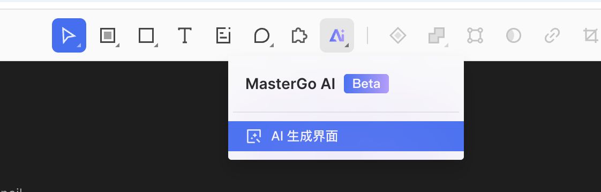
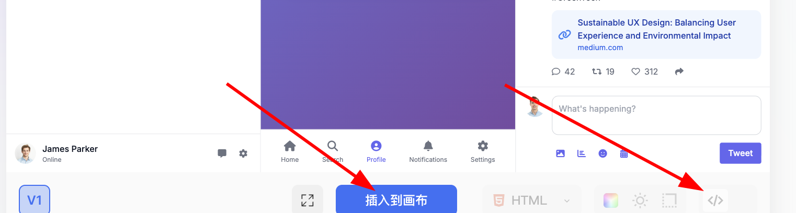
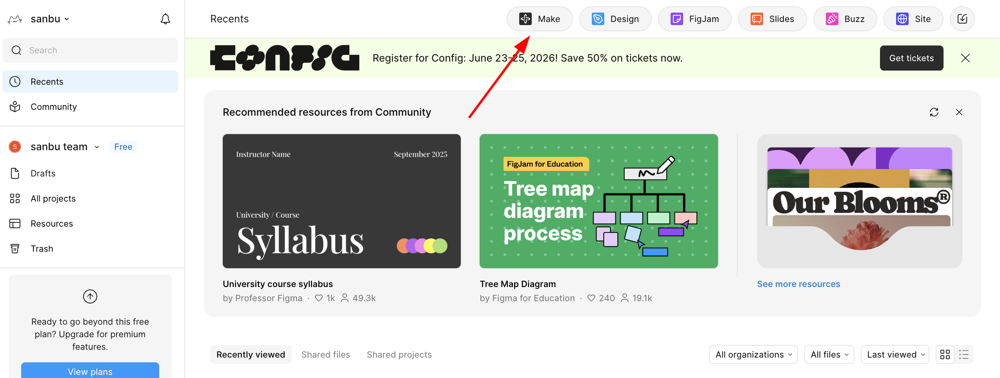
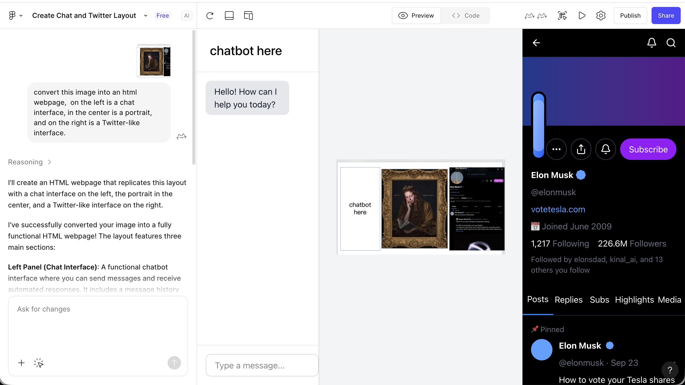

# 第 1 周：从设计原型到项目代码，前端的第一道关

> 小哲是软件工程专业的学生，会写 HTML/CSS、用过 Git。可每次照着设计稿手敲页面，他都得磨上大半天。这周他要学的不是「写得更快」，而是换一种思路：**如何将设计工具里的原型，转化成真正能在浏览器里运行的前端代码——让 AI 负责生成，自己负责把关。** 这是 vibe coding 全栈线的起点。

<ChapterIntroduction duration="1 课时（约 2 小时）" output="一个从设计稿还原出来的可运行页面 + 一份「三种路径」对比笔记" prerequisite="能手写基础 HTML/CSS；用过浏览器开发者工具；装好了一个支持 AI 的编辑器" :tags="['Design to Code', '多模态 AI', 'Figma', 'MasterGo', 'MCP', 'Figma Make', '前端基础']">

你会跟着小哲走一遍「看到设计稿 → 得到可运行代码」的完整流程，把从原型到代码的三条典型路径一条条走透：多模态 AI 直接还原、平台自身能力与插件导出、平台结合 MCP 直连。重点不是死记工具操作，而是建立一套判断力：**每条路径强在哪、弱在哪、什么场景该用哪一条，以及 AI 生成的页面哪里靠谱、哪里得自己接管。**

</ChapterIntroduction>

<StepBar :active="0" :items="[
  { title: '① 三种路径概览', description: '从原型到代码有哪几条路' },
  { title: '② 路径一：多模态 AI', description: '一张图直接出代码' },
  { title: '③ 路径二：平台与插件', description: 'Figma Make / 导出插件' },
  { title: '④ 路径三：MCP 直连', description: '让 AI 读懂设计文件' },
  { title: '⑤ 导出后与选型', description: '本地测试 + 三条路怎么选' }
]" />

---

## 引子：小哲的老办法慢在哪

小哲接到一个小任务：照着一张登录页的设计稿，做出能在浏览器里跑的页面。

他像往常一样打开编辑器，对着设计稿一个元素一个元素地敲：量间距、调 `padding`、试 `flex`、改颜色、再刷新看效果……两个小时过去，页面八九不离十了，但他自己都觉得累——大部分时间不是在思考，而是在做机械的「翻译」工作：把眼睛看到的视觉，一行行翻译成 CSS。

::: warning 小哲的卡点
真正消耗他的不是「不会写」，而是**重复的体力活**：对齐、配色、响应式断点这些事，规律性很强，却要反复手动试错。把这些交给 AI，他就能省下时间去想真正重要的问题——交互逻辑、可访问性、组件怎么拆。
:::

这周要解决的核心问题就一句话：**如何将设计工具中的原型，转化成真正能在浏览器里运行的前端代码？** 而落地这件事，本质上有三种典型路径。

---

## 1. 从原型到代码的三种路径

在使用 Figma、MasterGo 等现代前端设计工具完成界面设计后，一个很实际的问题自然会浮现：这些看起来结构完整的设计稿，要怎么转化成真正能在浏览器里运行的前端代码？

一般而言，从原型到代码的落地，本质上有三种典型路径：

| 路径 | 方法 | 特点 | 适用场景 |
|------|------|------|----------|
| **路径一** | 根据图片，使用多模态大模型直接还原出代码 | 灵活、无需特定工具 | 快速原型验证、简单页面 |
| **路径二** | 通过平台自身能力或插件导出可用代码 | 还原度高、可编辑性强 | Figma/MasterGo 用户 |
| **路径三** | 平台结合 MCP 能力导出可用代码 | 自动化程度高、可定制 | 需要深度集成的工作流 |

下面跟着小哲，把这三种路径的具体实现方法一条条走一遍，帮你根据项目需求选择最合适的工作流。

::: tip 📚 前置知识
在开始本节之前，建议你先掌握 Figma 与 MasterGo 这类前端设计工具的基础操作。本周默认你已经能在设计工具里画出一张完整的页面稿，我们从「拿到设计稿之后」讲起。
:::

<InfoCard icon="🧭" variant="tip">
**为什么先讲「三条路」，而不是直接教一种？**

小哲一开始也想问「到底哪个最好用」。但三条路其实对应三种场景：快速验证、高还原协作、稳定自动化工作流。先建立全景认知，再根据手头任务挑路径，比死记一种工具更顶用——这也是这周想让你养成的判断力。
</InfoCard>

---

## 2. 路径一：多模态 AI 直接还原代码

小哲先试最低门槛的一条：**截图丢给 AI**。

拥有视觉能力的大模型天生具备将图片转为代码的能力。我们只需要将设计稿截图直接导入对话框，随后让大模型生成完整的结果代码。

### 2.1 操作流程

1. **截取设计稿图片**
   - 在 Figma 或 MasterGo 中，将设计好的页面导出为 PNG 或 JPG
   - 确保截图包含完整的页面布局

2. **选择多模态 AI 模型**
   - 可以使用 Gemini、Qwen、Claude 等支持图像输入的模型
   - 这里以 Gemini 为例进行演示

3. **编写提示词**

   ```
   请根据这张设计图生成对应的 HTML/CSS 代码。
   要求：
   - 使用现代 CSS 布局（Flexbox/Grid）
   - 响应式设计，适配不同屏幕尺寸
   - 包含所有可见的 UI 元素
   - 颜色、字体大小尽量还原设计稿
   ```


4. **获取并保存代码**
   - 要求模型返回完整的 HTML 代码
   - 保存为单个 `.html` 文件，方便本地测试
   - 后续可以在本地 IDE 中将其转换为 React 等框架

::: tip 小哲学到的提示词技巧
明确说「先给单文件 HTML」很关键。先拿到能直接打开的 HTML，验证视觉对了，再让 AI 转成 React / Vue 组件，比一上来就要框架代码可控得多——出问题时排查范围小。
:::

### 2.2 常见问题与解决方案

生成页面并非简单的任务，在具体过程中你可能会遇到很多问题。小哲生成的第一版页面，输入框就偏左、主色调比设计稿浅了一截。这很正常——AI 是在「看图猜值」，不是在读精确数据。重点是学会**把问题描述清楚再回给它**：

| 问题 | 解决方案 |
|------|----------|
| 界面排布不均 | 向 AI 描述具体的布局问题，要求调整 CSS 的 margin/padding |
| 界面显示不全 | 检查是否设置了正确的 viewport，要求添加响应式断点 |
| 颜色还原不准 | 使用取色工具获取设计稿的精确色值，提供给 AI |
| 字体不匹配 | 指定具体的字体名称或要求使用 Google Fonts 替代 |

::: tip 💡 小技巧
推荐先生成 HTML 代码，获取后再使用本地 IDE 将其转换为 React 框架。这样可以获得多个独立的 HTML 文件，统一进行框架转换。
:::

<InfoCard icon="🎯" variant="tip">
**别让 AI 猜，给它能直接用的数据。**

「颜色不太对」这种话，AI 只能继续猜；「主色改成 `#3b82f6`」它就能一次改对。小哲把「主色应该是 `#3b82f6`、输入框需要水平居中」这两条精确反馈发回去，第二版就对齐了。从设计稿里取精确色值、量准间距，再把这些事实喂给 AI，是这条路径上最省时间的习惯。
</InfoCard>

### 2.3 MasterGo AI 生成页面

除了把图丢给通用大模型，MasterGo 同样提供了强大的 AI 页面生成功能，可以根据参考图直接生成可用的网页代码。

#### 找到 AI 功能入口

在 MasterGo 编辑界面的上方工具栏中，可以找到 AI 工具按钮：



#### 生成流程

1. **上传参考图**
   - 使用与多模态 AI 相同的方式上传设计参考图
   - 添加文字描述需求

2. **查看生成结果**


3. **获取代码**
   - 点击蓝色按钮「插入到画布」，可直接编辑生成后的网页
   - 或点击右侧的「代码」按钮，复制代码内容到本地



对小哲来说，平台内置 AI 和通用大模型的差别在于：**平台更懂自己的设计数据**，所以下面的路径二会更进一步。

---

## 3. 路径二：平台自身能力或插件导出代码

路径一够快，但还原度看运气。当小哲需要更稳的结果时，他转向**设计平台自己的能力**。

### 3.1 Figma Make 生成代码

Figma Make 是 Figma 官方推出的 AI 设计工具，能够根据用户输入的提示词或者参考图，高精度地还原网页原型 UI 界面。

#### 功能特点

- **高精度还原**：相比原生 AI 生成代码，效果更佳。它读的是 Figma 自己的设计结构，不是一张截图。
- **可编辑性**：生成结果可以转换为可编辑的 Figma Design 文件继续改。
- **GitHub 集成**：支持直接将代码同步到 GitHub。

::: tip 🔑 权限说明
使用 Figma Make 的完整功能需要 Pro 用户权限，学生可以通过教育认证免费获得 Pro 权限。小哲就是这么开通的——这条对学生几乎零成本。
:::

#### 操作步骤

1. **进入 Figma Make**
   - 在 Figma 首页点击 Make 按钮
   - 或者访问 [Figma Make](https://www.figma.com/make)

2. **上传参考图**
   - 将你想要还原的设计图上传到对话框
   - 添加描述需求的提示词



3. **查看生成结果**
   - 稍等片刻后即可看到渲染结果
   - 点击右上角的播放按钮可进行全屏预览



4. **细节调整**
   - 点击右上角的编辑器图标（鼠标和尺子图标）
   - 回到熟悉的 Figma Editor 界面进行详细调整


5. **导出代码**
   - 调整满意后，选择导出代码
   - 可以直接连接到 GitHub 保存代码


### 3.2 插件导出代码

除了平台原生的 AI 功能，Figma 和 MasterGo 都支持通过插件导出代码：

**常用 Figma 插件：**
- **Figma to Code**：将设计稿转换为 React、Vue、HTML 等代码
- **Anima**：高保真代码生成，支持交互效果
- **Locofy**：AI 驱动的设计转代码工具

**使用步骤：**
1. 在 Figma 中打开插件面板（Plugins）
2. 搜索并安装需要的代码导出插件
3. 选中要导出的设计元素
4. 运行插件，选择目标框架和代码格式
5. 复制或下载生成的代码

::: warning 插件代码不能照单全收
插件生成的代码常常**层级很深、类名是自动编号**（比如一堆 `frame-1`、`group-23`）。能跑，但不好维护。小哲的做法是：先用它快速拿到结构，再让 AI 帮忙重命名、拆组件、清理冗余的嵌套。生成只是起点，整理才是你的活。
:::

---

## 4. 路径三：平台结合 MCP 能力导出代码

走到这里小哲发现一个共同的天花板：前两条路里，AI 要么靠截图猜、要么隔着导出这一层。**有没有办法让 AI 直接读设计文件的原始数据？** 这就是路径三——MCP。

### 4.1 什么是 MCP？

MCP（Model Context Protocol，模型上下文协议）是一套开放标准协议，它允许 AI 模型安全、可控地访问外部工具和数据源。在前端设计工具的场景中，MCP 让大模型能够直接读取设计文件的结构、样式和组件信息，从而更精准地生成代码。

### 4.2 MCP 的工作原理

```
┌─────────────┐     ┌─────────────┐     ┌─────────────┐
│   AI 模型    │ ←→  │  MCP 服务器  │ ←→  │  设计工具    │
│  (Claude等)  │     │  (协议适配)  │     │(Figma/MasterGo)│
└─────────────┘     └─────────────┘     └─────────────┘
```

**工作流程：**
1. AI 模型通过 MCP 协议向设计工具发送请求
2. 设计工具返回结构化的设计数据（图层、样式、组件等）
3. AI 模型理解设计结构并生成对应代码
4. 代码可以直接导出或同步到开发环境

### 4.3 Figma + MCP 实战

#### 环境准备

1. **安装 MCP 服务器**

   ```bash
   # 使用 npx 安装 Figma MCP 服务器
   npx figma-mcp-server
   ```

2. **配置 Claude Desktop 或其他支持 MCP 的 AI 工具**

   ```json
   {
     "mcpServers": {
       "figma": {
         "command": "npx",
         "args": ["figma-mcp-server"],
         "env": {
           "FIGMA_ACCESS_TOKEN": "your-figma-token"
         }
       }
     }
   }
   ```

3. **获取 Figma Access Token**
   - 登录 Figma → Settings → Personal Access Tokens
   - 生成新的 Token 并保存

::: warning Token 是密钥，别提交进仓库
`FIGMA_ACCESS_TOKEN` 等同于你账号的访问凭证。配置时放到本地环境变量或 `.env` 里，并确认 `.env` 已被 `.gitignore` 忽略。把它写进会提交的文件，等于把钥匙挂在门外。
:::

#### 使用流程

1. **在 AI 工具中启用 MCP 连接**
   - 打开 Claude Code 或其他支持 MCP 的 IDE
   - 确认 MCP 服务器已连接

2. **提供设计文件链接**

   ```
   用户：请帮我将这个 Figma 设计转换为 React 代码
   链接：https://www.figma.com/file/xxxxx

   AI：我已通过 MCP 连接到 Figma，正在读取设计文件结构...
   ```

3. **AI 自动分析并生成代码**
   - MCP 服务器获取设计文件的图层树
   - AI 理解组件结构和样式属性
   - 生成带有正确命名和结构的 React/Vue 组件

4. **迭代优化**

   ```
   用户：请将按钮组件提取为独立的可复用组件

   AI：好的，我已通过 MCP 识别到设计系统中的 Button 组件，
       正在生成带有 props 接口的 React 组件...
   ```

### 4.4 MCP 的优势

| 特性 | 传统方式 | MCP 方式 |
|------|----------|----------|
| **数据精度** | 依赖截图，可能丢失细节 | 直接读取原始设计数据 |
| **组件识别** | AI 需要猜测组件边界 | 精确获取组件定义 |
| **样式还原** | 基于像素估算 | 获取精确的设计 token |
| **迭代效率** | 每次修改需重新截图 | 实时同步设计变更 |
| **自动化程度** | 手动复制粘贴 | 可直接写入项目文件 |

### 4.5 当前可用的 MCP 工具

**设计工具 MCP：**
- **Figma MCP Server**：官方支持的 MCP 实现
- **MasterGo MCP**：社区开发的 MasterGo 适配器

**开发环境 MCP：**
- **Claude Code**：原生支持 MCP 协议
- **Cline**：VS Code 插件，支持 MCP 连接
- **Trae**：可通过配置启用 MCP 功能

::: tip 🔮 未来展望
MCP 协议正在快速发展，未来设计工具与开发环境的集成将更加紧密。预计会出现更多一键同步设计到代码的解决方案，进一步缩短设计与开发之间的距离。
:::

---

## 5. 代码导出后的工作

无论走哪条路径，代码生成出来都只是第一步。拿到代码后，小哲还得在本地把它跑起来、测一遍、再补上 AI 漏掉的细节。

### 5.1 本地测试

获取代码后，在本地 IDE 中打开并进行测试：

1. **创建新项目**

   ```bash
   # 如果是 HTML 文件，直接用浏览器打开
   open index.html

   # 如果是 React/Vue 项目
   npm install
   npm run dev
   ```

2. **与 AI IDE 协作**
   - 将生成的代码导入 Trae 或其他 AI IDE
   - 让 AI 帮助修复布局问题、添加交互功能

### 5.2 常见问题处理

| 阶段 | 问题 | 解决方案 |
|------|------|----------|
| 布局 | 元素错位 | 检查 CSS 的 display 和 position 属性 |
| 样式 | 颜色不一致 | 使用浏览器开发者工具检查实际应用的色值 |
| 响应式 | 移动端显示异常 | 添加 media query 断点 |
| 交互 | 按钮无响应 | 检查 JavaScript 事件绑定 |

### 5.3 一次真实的打磨：AI 出代码，小哲改对

小哲拿到路径一生成的登录表单，跑起来发现一个问题：**用户没填邮箱直接点登录，页面没有任何提示。** 这是 AI 很容易漏掉的——它还原了视觉，却没顾上交互的边界情况。

小哲没有重新生成，而是精准地让 AI 补一段校验逻辑，然后审查它给的 diff：

<DiffViewer title="登录表单：补上空值校验" diff="@@ -1,3 +1,7 @@
 function handleLogin(email, password) {
+  if (!email || !password) {
+    showError('邮箱和密码不能为空')
+    return
+  }
   submit(email, password)
 }" />

改动很小，但小哲学到的是这周的核心心法：**AI 负责把大块工作生成出来，人负责在它够不到的地方接管——交互细节、边界情况、可访问性。** 这正是 vibe coding 的协作方式，不是甩给 AI，也不是全靠自己。

---

## 6. 三种路径对比与选择建议

### 6.1 路径对比

| 维度 | 路径一：多模态 AI | 路径二：平台能力 | 路径三：MCP |
|------|------------------|------------------|-------------|
| **上手难度** | ⭐ 简单 | ⭐⭐ 中等 | ⭐⭐⭐ 较复杂 |
| **还原精度** | ⭐⭐⭐ 中等 | ⭐⭐⭐⭐ 高 | ⭐⭐⭐⭐⭐ 最高 |
| **灵活性** | ⭐⭐⭐⭐⭐ 高 | ⭐⭐⭐ 中等 | ⭐⭐⭐⭐ 较高 |
| **自动化程度** | ⭐⭐ 低 | ⭐⭐⭐ 中等 | ⭐⭐⭐⭐⭐ 高 |
| **成本** | 低（按 API 调用） | 中（可能需要 Pro） | 低（开源工具） |

### 6.2 选择建议

**选择路径一（多模态 AI）如果：**
- 需要快速验证想法
- 设计工具不固定，经常切换
- 对还原精度要求不高
- 预算有限

**选择路径二（平台能力）如果：**
- 团队主要使用 Figma 或 MasterGo
- 需要高精度的代码还原
- 设计师和开发者需要频繁协作
- 愿意投资 Pro 版本

**选择路径三（MCP）如果：**
- 追求最高程度的自动化
- 有技术能力配置 MCP 环境
- 项目需要频繁迭代设计到代码
- 希望建立标准化的设计开发工作流

---

## 7. 总结：三条路径的取舍

通过本周的学习，小哲（也包括你）已经掌握了从设计原型到代码的三种核心路径：

1. **多模态 AI 直接转换**：灵活快速，适合原型验证
2. **平台原生能力**：还原度高，适合专业设计工作流
3. **MCP 协议集成**：自动化程度最高，代表未来趋势

::: tip 💡 最佳实践
- **新手推荐**：从路径一（多模态 AI）开始，快速上手
- **团队协作**：使用路径二（平台能力），保证设计一致性
- **效率优先**：尝试路径三（MCP），建立自动化工作流
- **混合使用**：根据项目阶段灵活切换不同路径
:::

小哲的结论：**先用路径一快速验证想法，团队协作和高还原度上路径二，要建稳定工作流再投入路径三。** 三条路不是替代关系，是按阶段切换。

---

## 8. 动手任务

### 课堂练习（不提交）

挑一张简单的登录页或卡片设计稿，用**路径一**走一遍：截图 → 写提示词 → 生成 → 本地打开。记下三件事：

1. 第一版哪里还原得不准？
2. 你用什么数据（色值、间距）把它喂回去修正的？
3. AI 漏掉了哪些交互或边界情况？

### 课后作业

把上面那个页面继续打磨到可运行，并写一份 **300 字的「三种路径」对比笔记**：结合自己的体验，说说这次你为什么选了这条路径，下次遇到什么场景你会换另一条。

---

## 9. 小哲这周的转变

> 小哲回看自己以前手敲页面的两个小时，发现真正有价值的部分其实很少——大多是机械的视觉翻译。
>
> 他在笔记里写下一句话：**「AI 能把设计稿翻译成代码，但它不知道用户没填邮箱会怎样、不知道这个按钮该不该能被键盘选中。生成交给它，判断留给我——这才是我该花时间的地方。」**

而真正让他踏实的，是这周建立的全景认知：从原型到代码不止一条路，截图直出、平台导出、MCP 直连各有取舍。**先把『三条路怎么选』想清楚，再动手生成；生成完不撒手，亲自跑一遍、补上 AI 够不到的细节**——这套节奏，就是这周最值钱的收获。

---

## 本周回顾

<ProgressTracker title="第 1 周学习进度" :items="[
  { title: '看清了老办法的卡点', description: '手敲页面慢在重复的视觉翻译', done: false },
  { title: '掌握了三种路径全景', description: '多模态 AI / 平台与插件 / MCP 直连各自的特点与场景', done: false },
  { title: '走通了路径一', description: '多模态 AI 与 MasterGo AI 截图直接出代码 + 喂反馈修正', done: false },
  { title: '了解了路径二与路径三', description: 'Figma Make 与导出插件，以及 MCP 配置与直连', done: false },
  { title: '建立了协作心法', description: 'AI 负责生成，人负责把关交互、边界与可访问性', done: false }
]" />

**自测问题：**

1. 路径一（多模态 AI）和路径三（MCP）在「数据来源」上最关键的差别是什么？为什么这会直接影响还原精度？
2. 为什么 AI 生成的页面常常漏掉空值校验、键盘可访问性这类东西？这说明人该在哪一步接管？
3. 如果你要做一个需要反复迭代、还原度要求高的团队项目，你会选哪条路径，为什么？
4. 配置 Figma + MCP 时，`FIGMA_ACCESS_TOKEN` 为什么绝对不能写进会提交的文件？应该放在哪里？

---

## 参考资源

- [MCP 官方文档](https://modelcontextprotocol.io/) - 了解协议详情
- [Figma Make 官方文档](https://help.figma.com/hc/en-us/sections/360007453634-Figma-Make)
- [MasterGo AI 教程](https://mastergo.com/tutorials)

---

## 下周预告

页面能从设计稿生成出来了，但一个真实产品不会只有一个页面。下周小哲要面对新问题：**组件库与多产品 UI。** 当按钮、卡片、表单要在好几个页面、甚至好几个产品里复用时，怎么让 AI 帮你建立一套统一、可维护的组件体系，而不是每个页面各写一套？我们下周见。
