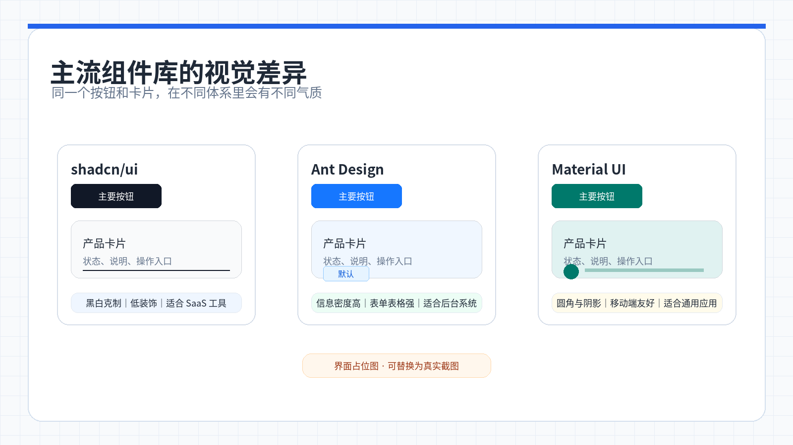
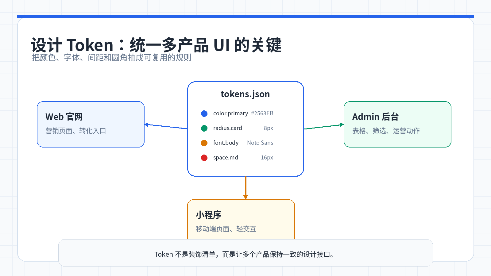

# 第 2 周:组件库与多产品 UI——从「各画各的」到「一套体系喂多个产品」

> 小哲手上同时有两个小项目:一个是「AI 写作助手」的网页端,一个是给社团做的「任务看板」。两个都是他自己从零手写的 CSS,刚开始写得挺爽,想怎么调就怎么调。但做着做着,问题来了——写作助手里的主按钮是圆角 8px 的蓝色,任务看板里的主按钮是圆角 4px 的另一种蓝;产品经理说「主色调换成品牌紫」,小哲翻了十几个文件,改了二十多处颜色值,还是漏了两个地方。这周他要补上那块真正的「工程」门槛:用现代组件库快速搭 UI,再用设计 token 把同一套视觉语言复用到多个产品上。

<ChapterIntroduction duration="1 课时(约 2 小时)+ 1-2 小时练习" output="一套可复用的设计 token + 两个产品共用的组件清单" prerequisite="会写基础 HTML/CSS;用过一次 AI IDE 生成页面;了解什么是前端框架" :tags="['组件库', '设计 token', 'shadcn/ui', '多产品复用', '设计体系']">

你会先看清小哲「手写样式」的真实代价,然后用 AI IDE + 组件库快速搭出一个像样的产品界面,最后把颜色、间距、圆角这些视觉决策抽成设计 token,让同一套语言喂给多个产品。

</ChapterIntroduction>

<StepBar :active="0" :items="[
  { title: '① 看小哲的样式困境', description: '两个项目,样式全不一致' },
  { title: '② 认识组件库', description: '界面世界的「宜家」' },
  { title: '③ 用组件库搭第一个 UI', description: 'AI IDE + 组件库' },
  { title: '④ 抽出设计 token', description: '颜色/间距/圆角统一' },
  { title: '⑤ 一套体系喂多产品', description: '复用而不是重写' }
]" />

---

## 1. 小哲的故事:两个项目,两套样式,一团乱麻

小哲这学期接了两个小项目。一个是帮学长做的「AI 写作助手」网页端,用户可以在线写文章、让 AI 续写、导出 Markdown。另一个是给社团做的「任务看板」,类似简化版的 Trello,可以拖拽任务卡片、标记完成状态。

两个项目都是小哲自己从零手写的 HTML + CSS + JavaScript。刚开始写得挺爽——想要什么样式就写什么,想怎么调就怎么调,完全自由。

但做着做着,问题来了。

### 1.1 第一个问题:样式不一致

写作助手里的主按钮是这样的:

```css
.btn-primary {
  background: #2563eb;
  border-radius: 8px;
  padding: 10px 16px;
  font-size: 14px;
  color: white;
}
```

任务看板里的主按钮是这样的:

```css
.main-button {
  background: #3b82f6;
  border-radius: 4px;
  padding: 12px 20px;
  font-size: 15px;
  color: #fff;
}
```

小哲自己都说不清当初为什么不一样。可能是写作助手那天心情好,觉得 8px 圆角更柔和;任务看板那天赶进度,随手写了个 4px。

结果就是:两个产品虽然都是他做的,但放在一起看,完全不像出自同一个人之手。

### 1.2 第二个问题:改一次主色,翻十几个文件

学长突然说:「我们要统一品牌色,把蓝色改成紫色,#8b5cf6 这个色值。」

小哲心想,不就是改个颜色吗,简单。

然后他开始翻文件:

- `header.css` 里的导航栏背景色
- `button.css` 里的主按钮背景色
- `sidebar.css` 里的选中项高亮色
- `form.css` 里的输入框聚焦边框色
- `modal.css` 里的确认按钮背景色
- `link.css` 里的链接文字颜色
- ...

翻了十几个文件,改了二十多处 `#2563eb`,以为大功告成。结果学长一看:「这个下拉菜单的选中项怎么还是蓝色?」

小哲一查,原来 `dropdown.css` 里还有一处漏了。

他突然意识到:这样下去不行。每次改一个全局决策,都要翻遍所有文件,还容易漏。

### 1.3 第三个问题:同一个弹窗,写了两遍

写作助手里有个「确认删除」弹窗:

```html
<div class="delete-modal">
  <div class="modal-header">确认删除</div>
  <div class="modal-body">确定要删除这篇文档吗?此操作不可恢复。</div>
  <div class="modal-footer">
    <button class="btn-cancel">取消</button>
    <button class="btn-danger">删除</button>
  </div>
</div>
```

任务看板里也有个「确认删除」弹窗:

```html
<div class="confirm-dialog">
  <h3>确认删除</h3>
  <p>确定要删除这个任务吗?删除后无法恢复。</p>
  <div class="actions">
    <button class="cancel-btn">取消</button>
    <button class="delete-btn">确定删除</button>
  </div>
</div>
```

功能一模一样,但 HTML 结构不同、CSS 类名不同、样式也不同。小哲写了两遍,维护起来也是两份工作量。

### 1.4 第四个问题:手机上一看,到处错位

学长用手机打开写作助手,发现侧边栏把编辑器挤没了、按钮文字换行了、表单输入框超出屏幕了。

小哲又得为每个页面单独写一堆媒体查询:

```css
@media (max-width: 768px) {
  .sidebar { width: 100%; }
  .editor { margin-left: 0; }
  .btn-primary { padding: 8px 12px; font-size: 13px; }
}
```

写完写作助手的,还得去任务看板再写一遍类似的。

<InfoCard icon="💡" variant="warning">
**小哲的「啊哈」时刻**

小哲第一次意识到:问题不是「样式写得不好」,而是「根本没有体系」。每个按钮、每个间距都是临时决定的,没有统一来源,所以一改就乱、一多就崩。手写样式在单个小页面上没问题,但只要项目变多、需求一变,维护成本会指数级上升。
</InfoCard>

---

## 2. 组件库:界面世界的「宜家」

小哲把问题跟室友吐槽。室友是计算机系的,听完笑了:「你这是在重复造轮子啊。现在谁还从零手写按钮?都用组件库。」

「组件库?」小哲第一次听到这个词。

室友解释:「想象你要在家里添一把椅子。你可以自己从木头开始做,但更常见的做法是去宜家买——设计好看、质量稳定、说明书清晰,拿回家组装就行。组件库就是前端开发里的宜家。」

### 2.1 什么是组件库?

**组件库是一套预先设计好、开发好的 UI 零件集合。** 按钮、输入框、下拉菜单、对话框、表格……这些你在任何产品中都会反复用到的界面元素,组件库已经帮你做好了,而且经过了大量用户的验证和打磨。

你只需要像搭积木一样把它们组合起来,就能快速构建出专业级的界面。

### 2.2 小哲手写时踩的坑,组件库都帮你绕过了

| 小哲自己手写 | 使用组件库 |
| :--- | :--- |
| 样式、交互、动画都要自己处理 | 开箱即用,细节已经打磨好 |
| 两个项目的按钮长得不一样 | 全局风格统一,自动保持一致 |
| 适配手机、平板要额外写媒体查询 | 大多数组件库内置响应式 |
| 容易漏掉键盘导航、屏幕阅读器等无障碍支持 | 专业组件库已处理好 accessibility |
| 改一次主色翻十几个文件 | 改一处主题配置,全局生效 |
| 同一个弹窗写两遍 | 一个组件到处复用 |

一句话:**组件库让你把时间花在「做什么」上,而不是「怎么画」上。**

### 2.3 眼见为实:加不加组件库的差距

光说不练没有说服力。小哲决定做个对比实验。

他在 AI IDE 里用几乎相同的需求,分别不指定和指定组件库,看看生成结果的差距。

<AiChat title="对比实验:不使用组件库" :initial-messages="[
  { role: 'user', content: '请帮我做一个 AI 写作助手的数据仪表盘页面,包含:顶部标题栏和导出按钮、四张统计卡片显示用户数、活跃用户、文档数、收入,还要显示涨跌趋势、一个折线图和一个饼图、用户列表表格,带分页功能、左侧导航侧边栏' },
  { role: 'assistant', content: '好的,我会用基础的 HTML + CSS + JavaScript 来实现。生成的页面会包含这些元素,但样式比较基础,需要你自己调整很多细节:卡片的阴影、圆角、间距、表格的边框、斑马纹、悬停效果、按钮的不同状态、响应式布局的断点、图表需要你自己集成第三方库。预计需要额外花 2-3 小时调整样式和交互细节。' }
]" :show-input="false" />

<AiChat title="对比实验:使用 shadcn/ui 组件库" :initial-messages="[
  { role: 'user', content: '请帮我做一个 AI 写作助手的数据仪表盘页面,用 shadcn/ui 组件库来做,包含:顶部标题栏和导出按钮、四张统计卡片显示用户数、活跃用户、文档数、收入,还要显示涨跌趋势、一个折线图和一个饼图、用户列表表格,带分页功能、左侧导航侧边栏' },
  { role: 'assistant', content: '好的,我会用 shadcn/ui 组件库来实现。我会使用这些组件:Card 组件做统计卡片,内置阴影和圆角、Table 组件做用户列表,自带排序、分页、筛选、Button 组件做导出按钮,支持 loading 状态、Sidebar 组件做导航,自动适配移动端、图表用 Recharts。生成的页面开箱即用,样式统一、交互流畅、自动响应式。你只需要接入真实数据就行。' }
]" :show-input="false" />

同样的需求,唯一的区别只是在提示词里加上了「用 shadcn/ui 组件库来做」,AI 生成的结果在视觉一致性、交互细节、整体打磨程度上就完全不在一个层级。

<InfoCard icon="🎯" variant="tip">
**vibe coding 的「免费升级」**

最妙的是:你不需要背下每个组件的 API。在 AI IDE 里描述你想要的界面时,只要在提示词里多写一句「用 shadcn/ui + Tailwind 来做」,生成结果在视觉一致性、交互细节、整体打磨上就完全不在一个层级。这是你能花最小代价拿到的最大提升。
</InfoCard>

---

## 3. 认识主流组件库:选一个顺手的

组件库数量很多,但小哲只需要先认识这几个最具代表性的。他用 React,所以重点看这一栏:



*同样是按钮和卡片，不同组件库会带来不同的信息密度、定制空间和视觉气质。*

| 组件库 | 框架 | 一句话定位 | 官网 |
| :--- | :--- | :--- | :--- |
| [Ant Design](https://ant.design) | React | 蚂蚁集团出品,企业级中后台的事实标准,组件覆盖面极广 | ant.design |
| [shadcn/ui](https://ui.shadcn.com) | React | 不装 npm 包,把代码直接复制进项目,基于 Tailwind,定制自由度最高 | ui.shadcn.com |
| [HeroUI](https://heroui.com) | React | 默认样式精美、动画流畅,适合落地页和产品展示 | heroui.com |
| [Material UI](https://mui.com) | React | 最老牌的 React 组件库,生态最成熟 | mui.com |

> 用 Vue 的同学同样有丰富选择:[Element Plus](https://element-plus.org)(国内最流行)、[Ant Design Vue](https://antdv.com)、[Naive UI](https://www.naiveui.com) 等。

### 3.1 不同库擅长不同场景

小哲问室友:「这么多组件库,我该选哪个?」

室友说:「看你做什么。」

| 场景 | 推荐组件库 | 为什么 |
| :--- | :--- | :--- |
| 企业级后台管理系统 | Ant Design | 表格、表单、图表等业务组件最全,开箱即用 |
| 需要深度定制的产品界面 | shadcn/ui | 代码直接放进项目,想怎么改就怎么改 |
| 视觉要求高的落地页 | HeroUI | 默认样式精美,动画流畅,省去大量调样式时间 |
| 快速原型验证 | Material UI | 生态最成熟,文档最全,上手最快 |

小哲想了想:「我的写作助手和任务看板都需要深度定制,而且我想学会怎么抽设计 token。那就选 shadcn/ui 吧——它把组件源码直接放进项目,方便后面深度定制。」

### 3.2 shadcn/ui 的独特之处

大多数组件库是通过 npm 安装的,比如:

```bash
npm install antd
```

然后在代码里引入:

```jsx
import { Button } from 'antd'
```

但 shadcn/ui 不一样。它不是一个 npm 包,而是一套「组件代码生成器」。你每次需要一个组件,就运行:

```bash
npx shadcn@latest add button
```

它会把 `Button` 组件的源代码**复制到你项目的 `components/ui/` 目录下**。

这意味着:

- ✅ 你完全拥有这些代码,想怎么改就怎么改
- ✅ 不依赖外部 npm 包,不用担心版本冲突
- ✅ 可以直接看到组件是怎么实现的,学习价值高
- ✅ 方便后面抽设计 token(因为代码就在你项目里)

小哲决定就用它了。

---

## 4. 实战:用 AI IDE + shadcn/ui 搭出第一个像样的 UI

小哲先拿「AI 写作助手」的主界面练手:左侧文档列表,右侧编辑器,顶部工具栏。

### 4.1 创建项目并初始化组件库

```bash
# 创建 Next.js 项目
npx create-next-app@latest ai-writer-app --typescript --tailwind --app
cd ai-writer-app

# 初始化 shadcn/ui
npx shadcn@latest init

# 按需添加组件(而不是一次性全装)
npx shadcn@latest add button card input sidebar sheet dialog dropdown-menu
```

运行 `init` 时,shadcn/ui 会问你几个问题:

```
✔ Which style would you like to use? › Default
✔ Which color would you like to use as base color? › Slate
✔ Would you like to use CSS variables for colors? › yes
```

小哲全选默认就行。

### 4.2 在 AI IDE 里描述界面

打开 AI IDE(Cursor、Trae 等),把需求讲清楚:

<AiChat title="让 AI 生成写作助手主界面" :initial-messages="[
  { role: 'user', content: '请帮我做一个 AI 写作助手的主界面,用 shadcn/ui 组件库来做:整体布局:左边是可折叠侧边栏,宽约 280px:顶部放「新建文档」按钮,下面是文档列表,每个文档显示标题和最后编辑时间;右边是主编辑区,分上下两部分:上面工具栏(编辑标题、字数统计、「AI 续写」按钮、「导出」下拉菜单),下面是占满剩余空间的编辑框。交互细节:点「AI 续写」后按钮显示加载状态、手机上侧边栏改成从左滑出的抽屉、当前选中的文档要高亮' },
  { role: 'assistant', content: '好的,我会用 shadcn/ui 的这些组件:Sidebar: 左侧可折叠侧边栏、Sheet: 移动端抽屉(手机上替代 Sidebar)、Button: 各种操作按钮,支持 loading 状态、Card: 文档列表项、DropdownMenu: 「导出」下拉菜单、Dialog: 重命名、删除确认弹窗、Textarea: 编辑器输入框。我会先生成桌面端布局,然后用媒体查询在移动端切换到 Sheet。' }
]" :show-input="false" />

### 4.3 AI 生成的代码长什么样

几秒钟后,AI 生成了完整的代码。小哲打开 `app/page.tsx`,看到了这样的结构:

```tsx
import { Button } from '@/components/ui/button'
import { Card } from '@/components/ui/card'
import { Sidebar, SidebarContent, SidebarHeader } from '@/components/ui/sidebar'
import { Sheet, SheetContent, SheetTrigger } from '@/components/ui/sheet'
import { DropdownMenu, DropdownMenuContent, DropdownMenuItem, DropdownMenuTrigger } from '@/components/ui/dropdown-menu'

export default function WriterApp() {
  return (
    <div className="flex h-screen">
      {/* 桌面端侧边栏 */}
      <Sidebar className="hidden md:flex">
        <SidebarHeader>
          <Button className="w-full">+ 新建文档</Button>
        </SidebarHeader>
        <SidebarContent>
          {/* 文档列表 */}
        </SidebarContent>
      </Sidebar>

      {/* 移动端抽屉 */}
      <Sheet>
        <SheetTrigger className="md:hidden">
          <Button variant="ghost">☰</Button>
        </SheetTrigger>
        <SheetContent side="left">
          {/* 同样的文档列表 */}
        </SheetContent>
      </Sheet>

      {/* 主编辑区 */}
      <main className="flex-1 flex flex-col">
        {/* 工具栏 */}
        <header className="border-b p-4 flex items-center gap-4">
          <input className="flex-1 text-2xl font-bold" placeholder="无标题文档" />
          <span className="text-sm text-muted-foreground">字数: 0</span>
          <Button>AI 续写</Button>
          <DropdownMenu>
            <DropdownMenuTrigger asChild>
              <Button variant="outline">导出</Button>
            </DropdownMenuTrigger>
            <DropdownMenuContent>
              <DropdownMenuItem>导出为 Markdown</DropdownMenuItem>
              <DropdownMenuItem>导出为 PDF</DropdownMenuItem>
            </DropdownMenuContent>
          </DropdownMenu>
        </header>

        {/* 编辑器 */}
        <textarea className="flex-1 p-8 resize-none" placeholder="开始写作..." />
      </main>
    </div>
  )
}
```

小哲运行 `npm run dev`,打开浏览器一看——哇,已经有模有样了!

### 4.4 关键组件的作用

| 组件 | 用途 | 界面中的位置 |
| :--- | :--- | :--- |
| `Sidebar` | 可折叠侧边栏 | 左侧文档列表(桌面端) |
| `Sheet` | 移动端抽屉 | 手机上的侧边栏替代 |
| `DropdownMenu` | 下拉菜单 | 「导出」按钮 |
| `Dialog` | 对话框 | 重命名、删除确认(后面会加) |
| `Button` | 按钮,支持 variant 和 loading | 各种操作按钮 |
| `Card` | 卡片容器 | 文档列表项 |

### 4.5 不满意就继续聊

初版生成的界面不可能一步到位。小哲看到几个地方想调整:

<AiChat title="迭代优化界面" :initial-messages="[
  { role: 'user', content: '请帮我优化一下:1. 侧边栏再窄一点,改成 240px;2. 选中的文档项要有明显的背景色高亮;3. 「导出」菜单加个分隔线,把 Markdown 和 PDF 分开;4. 「AI 续写」按钮点击后显示 loading 状态,按钮文字改成「生成中...」' },
  { role: 'assistant', content: '好的,我会:1. 修改 Sidebar 的 className,加上 w-60(240px);2. 给选中的文档 Card 加上 bg-accent 类;3. 在 DropdownMenu 里加 DropdownMenuSeparator 组件;4. 给 Button 加 loading 状态,用 shadcn/ui 的 Button 组件自带的 disabled + loading icon。正在修改代码...' }
]" :show-input="false" />

几轮对话下来,界面越来越符合小哲的预期。

<InfoCard icon="💡" variant="tip">
**vibe coding 的核心**

你不需要记住每个组件的 API,只需要用自然语言描述你想要的效果,AI 会帮你找到合适的组件和写法。遇到不满意的地方,继续对话迭代就好。这就是 vibe coding 的魅力——把「查文档、写代码」的时间,变成「描述需求、验证效果」的时间。
</InfoCard>

---

## 5. 光有组件库还不够:设计 token 才是统一的关键

小哲的写作助手界面搭好了,看起来很专业。他很满意。



*设计 token 把颜色、字体、间距和圆角变成统一规则，再喂给不同产品。*

然后他打开第二个项目「任务看板」,准备用同样的方法搭界面。

但很快,老问题又冒出来了:

- 写作助手的主色是 Slate(灰蓝色)
- 任务看板他想用 Blue(纯蓝色)
- 两个产品的按钮圆角、间距、字号又开始不一样了

**组件库解决了「搭得快」,但没解决「长得一致」。**

### 5.1 什么是设计 token?

室友又来救场了:「你需要设计 token。」

「又是新词?」小哲问。

室友解释:「组件库给了你零件,但零件的颜色、尺寸、圆角到底用什么值,还是得有人定。如果每个产品都临时拍脑袋决定,就又回到了你一开始的混乱。」

「成熟团队的做法是把这些视觉决策抽成**设计 token**——给每一个颜色、间距、圆角、字号起一个语义化的名字,统一管理。」

| token 类别 | 例子 | 它统一了什么 |
| :--- | :--- | :--- |
| 颜色 token | `--color-primary`、`--color-danger` | 主色、危险色不再到处硬编码 |
| 间距 token | `--space-2`、`--space-4` | 内外边距用同一套节奏 |
| 圆角 token | `--radius-md`、`--radius-lg` | 所有卡片、按钮圆角一致 |
| 字号 token | `--font-size-base`、`--font-size-lg` | 文字层级统一 |

### 5.2 硬编码 vs 设计 token:一个按钮的对比

小哲之前写的按钮样式是这样的:

```css
.btn-primary {
  background: #2563eb;
  border-radius: 8px;
  padding: 10px 16px;
  font-size: 14px;
}
```

每个值都是硬编码的。如果要改主色,得翻遍所有文件找 `#2563eb`。

用设计 token 改写后:

```css
.btn-primary {
  background: var(--color-primary);
  border-radius: var(--radius-md);
  padding: var(--space-2) var(--space-3);
  font-size: var(--font-size-base);
}
```

现在,那个「把主色换成品牌紫」的需求,小哲只要改一行:

```css
:root {
  --color-primary: #8b5cf6; /* 从蓝色改成紫色 */
}
```

两个产品的所有主按钮、链接、高亮全部一起变。再也不用翻十几个文件了。

```diff
.btn-primary {
-  background: #2563eb;
-  border-radius: 8px;
-  padding: 10px 16px;
-  font-size: 14px;
+  background: var(--color-primary);
+  border-radius: var(--radius-md);
+  padding: var(--space-2) var(--space-3);
+  font-size: var(--font-size-base);
}
```

### 5.3 shadcn/ui 已经内置了 token 系统

好消息是:shadcn/ui 已经帮你做好了设计 token 的基础架构。

当你运行 `npx shadcn@latest init` 时,它会在项目里生成一个 `app/globals.css` 文件,里面定义了一套完整的 token:

```css
@layer base {
  :root {
    --background: 0 0% 100%;
    --foreground: 222.2 84% 4.9%;
    --card: 0 0% 100%;
    --card-foreground: 222.2 84% 4.9%;
    --primary: 222.2 47.4% 11.2%;
    --primary-foreground: 210 40% 98%;
    --secondary: 210 40% 96.1%;
    --secondary-foreground: 222.2 47.4% 11.2%;
    --muted: 210 40% 96.1%;
    --muted-foreground: 215.4 16.3% 46.9%;
    --accent: 210 40% 96.1%;
    --accent-foreground: 222.2 47.4% 11.2%;
    --destructive: 0 84.2% 60.2%;
    --destructive-foreground: 210 40% 98%;
    --border: 214.3 31.8% 91.4%;
    --input: 214.3 31.8% 91.4%;
    --ring: 222.2 84% 4.9%;
    --radius: 0.5rem;
  }
}
```

这些 token 已经被所有 shadcn/ui 组件使用了。比如 `Button` 组件的源码里:

```tsx
// components/ui/button.tsx
const buttonVariants = cva(
  "inline-flex items-center justify-center rounded-md text-sm font-medium",
  {
    variants: {
      variant: {
        default: "bg-primary text-primary-foreground hover:bg-primary/90",
        destructive: "bg-destructive text-destructive-foreground hover:bg-destructive/90",
        // ...
      }
    }
  }
)
```

`bg-primary` 对应的就是 `--primary` 这个 token。

### 5.4 为两个产品定制不同的 token

小哲现在明白了:他可以为「写作助手」和「任务看板」各定义一套 token,但两套 token 的**结构是一样的**,只是具体的值不同。

**写作助手的 token(app/globals.css):**

```css
:root {
  --color-primary: #2563eb; /* 蓝色,专业感 */
  --color-secondary: #64748b; /* 灰色,低调 */
  --radius-md: 0.5rem; /* 8px,柔和 */
  --space-2: 0.5rem; /* 8px */
  --space-3: 0.75rem; /* 12px */
  --font-size-base: 0.875rem; /* 14px,适合长文阅读 */
}
```

**任务看板的 token(app/globals.css):**

```css
:root {
  --color-primary: #3b82f6; /* 更亮的蓝色,活力感 */
  --color-secondary: #10b981; /* 绿色,完成状态 */
  --radius-md: 0.375rem; /* 6px,更紧凑 */
  --space-2: 0.5rem; /* 8px */
  --space-3: 0.75rem; /* 12px */
  --font-size-base: 0.875rem; /* 14px */
}
```

两个产品的按钮、卡片、表单都用同样的 token 名称(`--color-primary`、`--radius-md` 等),但具体的颜色和尺寸不同。

这样做的好处:

- ✅ 每个产品内部保持一致(所有主按钮都用 `--color-primary`)
- ✅ 两个产品可以有不同的视觉风格(一个专业、一个活力)
- ✅ 改一个产品的主色,只改一行 CSS
- ✅ 如果以后要统一两个产品的风格,只需要把 token 值对齐

<InfoCard icon="🎨" variant="tip">
**token 是「视觉决策的单一来源」**

设计 token 真正的价值不是少写几个颜色值,而是把「这个产品的主色是什么」这种决策**集中到一个地方**。决策集中了,一致性就是自然结果,而不是靠人工对齐。这也是 Atlassian、Ant Design 这些设计系统的共同地基。
</InfoCard>

---

## 6. 顺带学一招:按钮先分语义,再分样式

抽 token 时,小哲顺手把按钮也理清了。

他发现自己之前犯了一个新手常见的错误:**先想颜色,再想用途。**

比如他会想:「这个按钮用蓝色还是黑色?」

但正确的顺序应该是:**先想这个按钮是什么角色,再决定样式。**

### 6.1 按钮的语义分级

| 按钮类型 | 作用 | 样式策略 | 例子 |
| :--- | :--- | :--- | :--- |
| **Primary** | 当前区域最关键的动作 | 实心、高对比、最显眼 | 「保存」「提交」「确认」 |
| **Secondary** | 支持性动作 | 描边或低一级强调 | 「取消」「返回」「预览」 |
| **Tertiary / Text** | 弱操作 | 文字按钮,视觉占比低 | 「了解更多」「跳过」 |
| **Destructive** | 删除、清空等风险操作 | 用危险色明确标识 | 「删除」「清空」「停用」 |

### 6.2 一个页面不要有太多 Primary

小哲之前的任务看板,有个表单页面长这样:

```html
<form>
  <input placeholder="任务标题" />
  <textarea placeholder="任务描述"></textarea>
  <button class="btn-primary">保存</button>
  <button class="btn-primary">保存并新建</button>
  <button class="btn-primary">保存为模板</button>
  <button class="btn-primary">取消</button>
</form>
```

四个按钮都是 Primary 样式,用户根本不知道该点哪个。

室友看了摇头:「如果一个页面上有 4 个主按钮,那等于没有主按钮。主按钮的意义就是告诉用户『现在最该做什么』。」

小哲改成这样:

```html
<form>
  <input placeholder="任务标题" />
  <textarea placeholder="任务描述"></textarea>
  <button class="btn-primary">保存</button>
  <button class="btn-secondary">保存并新建</button>
  <button class="btn-text">保存为模板</button>
  <button class="btn-secondary">取消</button>
</form>
```

现在一眼就能看出:「保存」是主要动作,其他是辅助选项。

<InfoCard icon="⚠️" variant="warning">
**一个区域只保留一个 Primary**

这是很多设计系统的共同规则。把这条规则写进 token 和组件约定里,AI 生成页面时也会跟着遵守。你可以在提示词里加一句:「每个区域只保留一个主按钮,其他用次级或文字按钮」。
</InfoCard>

### 6.3 用 shadcn/ui 的 Button variant

shadcn/ui 的 Button 组件已经内置了这些语义分级:

```tsx
import { Button } from '@/components/ui/button'

<Button variant="default">保存</Button>        {/* Primary */}
<Button variant="secondary">取消</Button>      {/* Secondary */}
<Button variant="ghost">了解更多</Button>      {/* Tertiary */}
<Button variant="destructive">删除</Button>    {/* Destructive */}
<Button variant="outline">导出</Button>        {/* 描边按钮 */}
```

小哲只需要在提示词里说清楚每个按钮的角色,AI 就会自动选对 variant。

---

## 7. 一套设计体系,喂给多个产品

现在小哲手里有了两样东西:

1. **一套设计 token**(视觉决策的单一来源)
2. **一套基于 shadcn/ui 的组件**(已经接好了 token)

把它们打包,就是他自己的**设计体系**。

### 7.1 第二个产品不再从零开始

接下来对第二个产品「任务看板」,小哲不再从零开始,而是:

1. **复用同一套 token 文件**(颜色、间距、圆角全部继承)
2. **复用已经封装好的组件**(Button、Card、Dialog 等)
3. **只针对看板特有的部分做增量开发**(比如拖拽列、任务卡)

具体操作:

```bash
# 在任务看板项目里
cd task-board-app

# 初始化 shadcn/ui(和写作助手一样的配置)
npx shadcn@latest init

# 复制写作助手的 token 文件
cp ../ai-writer-app/app/globals.css ./app/globals.css

# 根据任务看板的品牌色,微调 token 值
# 只改 --color-primary、--color-secondary 等几个关键值
```

然后在 AI IDE 里:

<AiChat title="复用设计体系搭建任务看板" :initial-messages="[
  { role: 'user', content: '请帮我做一个任务看板应用,用 shadcn/ui 组件库来做:整体布局:顶部导航栏:左边放看板标题,右边放「添加列」按钮和用户头像;主区域:横向排列多个任务列,每列包含列标题、任务卡片列表、「添加任务」按钮;任务卡片:显示任务标题、标签、截止日期、负责人头像。交互细节:任务卡片可以在列之间拖拽、点击任务卡片打开详情弹窗、点击「添加任务」弹出表单。注意:按钮分级要清晰,主按钮只用在最关键的动作上' },
  { role: 'assistant', content: '好的,我会复用 shadcn/ui 的组件:Button 用 variant 区分主次,Card 做任务卡片,Dialog 做任务详情弹窗和添加任务表单,Badge 做任务标签,Avatar 做用户头像。拖拽功能我会用 @dnd-kit/core。保存和创建使用 default 主按钮,取消和关闭使用 secondary,删除使用 destructive。' }
]" :show-input="false" />

### 7.2 效果立竿见影

对比一下小哲前后两个阶段:

| 手写样式时代 | 设计体系时代 |
| :--- | :--- |
| 每个产品的按钮各画各的 | 所有产品共用同一套按钮语义 |
| 改主色要翻十几个文件 | 改一个 token 全产品生效 |
| 删除确认弹窗写了两遍 | 一个 Dialog 组件到处复用 |
| 新产品从空白页起步 | 新产品继承整套体系,只做增量 |
| 一致性靠记忆和自觉 | 一致性是体系的自然结果 |
| 手机适配每个页面单独写 | 组件库内置响应式,自动适配 |

小哲算了一下:

- 写作助手从零搭界面花了 2 天
- 任务看板复用设计体系,只花了半天

而且两个产品虽然功能不同,但视觉语言高度一致——按钮分级清晰、颜色用法统一、间距节奏一致。

<InfoCard icon="🧩" variant="tip">
**复用的不是代码,是判断**

小哲复用到第二个产品的,表面上是 token 和组件,本质上是一整套「什么场景用什么、主色是什么、按钮怎么分级」的判断标准。这正是为什么团队做的产品越多,设计体系的价值越大——它让不同产品虽然功能不同,但说着同一种视觉语言。
</InfoCard>

---

## 8. 参考大厂设计规范,让 AI 生成更专业的界面

小哲的设计体系已经建立起来了,但他还想更进一步:「怎么让 AI 生成的界面更专业、更符合行业标准?」

室友说:「参考大厂的设计规范。」

### 8.1 设计规范不是「皮肤」,是判断标准

很多人以为设计规范就是「Apple 风格」「Google 风格」,其实不是。

**设计规范真正提供的,是一套判断标准:**

- 页面先突出什么、后突出什么
- 按钮如何分级
- 操作怎么强调
- 哪个组件该用在什么场景

比如,同样是很多团队口中的「菜单」或「下拉框」,Apple 会继续往下拆:

| 平时随口说的话 | Apple 官方定义 | 区别在哪 |
| :--- | :--- | :--- |
| 「做个菜单」 | Menu | 拿来做操作的 |
| 「菜单栏里放功能」 | Menu bar menu | 应用顶部的命令菜单 |
| 「做个下拉框」 | Pop-up button | 从列表里选一个值 |
| 「也做个下拉框」 | Pull-down button | 点开做当前操作 |

这种精确的定义,会直接影响:

- 这个组件是拿来选值,还是拿来做动作
- 它属于页面局部,还是属于应用级
- 它应该长期显示当前选中值,还是只临时展开命令

### 8.2 主流设计规范速查

| 设计规范 | 擅长什么 | 最值得学的点 | 官网 |
| :--- | :--- | :--- | :--- |
| [Apple HIG](https://developer.apple.com/design/human-interface-guidelines/) | 页面层级、克制感 | 如何建立清晰层级,控件如何不喧宾夺主 | developer.apple.com/design |
| [Material Design](https://m3.material.io) | 页面结构、任务流 | 页面是怎么组织任务流的 | m3.material.io |
| [Fluent 2](https://fluent2.microsoft.design) | 组件边界、按钮层级 | 明确告诉你「不要混用概念」 | fluent2.microsoft.design |
| [Atlassian](https://atlassian.design) | 系统化管理 | 如何用 tokens 统一视觉决策 | atlassian.design |

### 8.3 怎样用 AI 参考别人的规范来设计页面

这一节最实用。

很多人让 AI 设计页面时,只会说:

```text
帮我做一个设置页面,要高级一点,参考苹果风格
```

这类提示词太模糊了,AI 最后通常只能模仿「白底、圆角、阴影」。

**更实用的方式是:直接把规范原文里的关键句贴给 AI。**

#### 例子一:让 AI 参考 Apple 设计一个设置页面

先找一句 Apple 原文:

> "Establish a clear visual hierarchy that helps people understand the relative importance of onscreen elements."
> 
> —— Apple Human Interface Guidelines

你可以直接这样贴给 AI:

<AiChat title="参考 Apple 规范设计设置页面" :initial-messages="[
  { role: 'user', content: '参考 Apple Human Interface Guidelines 里的这句话:「Establish a clear visual hierarchy that helps people understand the relative importance of onscreen elements.」帮我设计一个账号安全设置页面,用 shadcn/ui 来做。要求页面层级清楚,重要信息放前面,分组整齐一点。' },
  { role: 'assistant', content: '好的,我会按照 Apple 的层级原则来设计:1. 最重要的信息(账号状态、安全等级)放在顶部,用大字号和醒目颜色;2. 次要信息(密码、两步验证、登录设备)分组展示,用 Card 组件;3. 危险操作(注销账号、删除数据)放在最底部,用 destructive 样式明确标识。我会用留白、字号、分组建立秩序,而不是靠堆很多边框。' }
]" :show-input="false" />

#### 例子二:让 AI 参考 Fluent 设计后台页面按钮

先找一句 Fluent 原文:

> "Only use one primary button in a layout. If multiple buttons have equal importance, use secondary buttons."
> 
> —— Fluent 2 Button Usage

你可以直接这样贴给 AI:

<AiChat title="参考 Fluent 规范设计按钮" :initial-messages="[
  { role: 'user', content: '参考 Fluent 2 里的这句话:「Only use one primary button in a layout. If multiple buttons have equal importance, use secondary buttons.」帮我设计一个团队管理后台的按钮布局,用 shadcn/ui 来做。添加成员按钮最明显,导出、筛选、更多操作弱一点,删除按钮单独突出。' },
  { role: 'assistant', content: '好的,我会严格遵守「一个区域只有一个主按钮」的原则:「添加成员」用 default 主按钮,「导出」「筛选」用 outline 次级按钮,「更多操作」用 ghost 弱按钮,「删除」用 destructive 危险按钮并在视觉上独立。这样用户一眼就能看出最该做什么。' }
]" :show-input="false" />

#### 例子三:同时参考页面规范和按钮规范

你也可以一次贴两句原文,让 AI 同时参考:

<AiChat title="同时参考多条规范" :initial-messages="[
  { role: 'user', content: '参考下面两句设计规范原文:Apple: Establish a clear visual hierarchy... Fluent: Only use one primary button in a layout... 帮我设计一个项目详情页,用 shadcn/ui 来做。页面包含项目介绍、成员、最近活动和设置入口。页面层级清楚一点,主按钮只保留一个,其他按钮弱一点。' },
  { role: 'assistant', content: '好的,我会同时遵守两条原则:层级设计(Apple):顶部:项目标题(大字号)+ 状态标签、中间:三个 Card 分组(介绍、成员、活动)、底部:设置入口(弱化处理)。按钮分级(Fluent):主按钮:「编辑项目」(最关键动作)、次级按钮:「邀请成员」「查看全部活动」、弱按钮:「分享」「导出」、危险按钮:「归档项目」(放在设置区)。这样页面既有清晰的信息层级,又有明确的操作优先级。' }
]" :show-input="false" />

<InfoCard icon="💡" variant="tip">
**为什么直接贴原文这么有效?**

因为你不用自己先「翻译」一遍设计思想,AI 更容易按官方定义去理解页面和按钮。这种方式特别适合新手——你只要会复制原文,再加两句自己的需求就够了。
</InfoCard>

---

## 9. 小哲这周的转变

> 小哲回头看了看自己那两个「各画各的」的项目。他发现问题从来不是 CSS 写得不够熟,而是他一直在「画界面」,而不是在「建体系」。
>
> 他在练习记录里写下一句话:**「会用组件库,让我搭得更快;但把决策抽成 token,才让我搭得更稳。一个产品靠手感,多个产品必须靠体系。」**

这周小哲学会了三件事:

1. **用组件库快速搭 UI** —— 不再从零手写按钮、表单、弹窗
2. **用设计 token 统一视觉决策** —— 改一处,全局生效
3. **参考大厂规范让 AI 生成更专业的界面** —— 把判断标准喂给 AI

更重要的是,他建立了一套可以复用的设计体系。以后每做一个新产品,都不用从零开始,而是继承这套体系,只做增量开发。

---

## 本周回顾

<ProgressTracker title="第 2 周学习进度" :items="[
  { title: '看清了手写样式的代价', description: '不是 CSS 不熟,是缺体系', done: false },
  { title: '会用组件库快速搭 UI', description: 'AI IDE + shadcn/ui 提示词', done: false },
  { title: '理解了设计 token', description: '视觉决策的单一来源', done: false },
  { title: '会按语义给按钮分级', description: 'Primary / Secondary / Destructive', done: false },
  { title: '能把一套体系复用到多产品', description: '复用而不是重写', done: false }
]" />

**自测问题:**

1. 组件库解决了哪个问题,设计 token 又解决了哪个问题?两者为什么要配合用?
2. 为什么说「改一次主色要翻十几个文件」是一种体系缺失,而不是技术不熟?
3. 给一个有「保存」「导出」「删除」三个操作的工具栏,你会怎么用按钮分级?为什么一个区域不该有多个 Primary?
4. 如果你要让 AI 参考 Apple 的设计规范来生成一个设置页面,你会怎么写提示词?

---

## 练习作业

### 作业一:用组件库重构你的项目

选择你之前做过的一个小项目(或者从零开始做一个新的),用 shadcn/ui 组件库重新搭建界面。

**要求:**

1. 至少使用 5 个不同的组件(Button、Card、Dialog、Input、DropdownMenu 等)
2. 按钮要有明确的语义分级(Primary、Secondary、Destructive)
3. 手机上要能正常使用(组件库会自动处理大部分响应式,但你要测试一下)

**提示:**

- 在 AI IDE 里描述界面时,记得加上「用 shadcn/ui 组件库来做」
- 不满意就继续对话迭代,不要一次就想做到完美
- 可以参考 shadcn/ui 官网的示例:https://ui.shadcn.com/examples

### 作业二:抽取你的设计 token

为你的项目定义一套设计 token,至少包含:

**颜色 token:**

```css
:root {
  --color-primary: #???;      /* 主色 */
  --color-secondary: #???;    /* 次要色 */
  --color-accent: #???;       /* 强调色 */
  --color-danger: #???;       /* 危险色 */
  --color-success: #???;      /* 成功色 */
}
```

**间距 token:**

```css
:root {
  --space-1: 0.25rem;  /* 4px */
  --space-2: 0.5rem;   /* 8px */
  --space-3: 0.75rem;  /* 12px */
  --space-4: 1rem;     /* 16px */
  --space-6: 1.5rem;   /* 24px */
  --space-8: 2rem;     /* 32px */
}
```

**圆角 token:**

```css
:root {
  --radius-sm: 0.25rem;  /* 4px */
  --radius-md: 0.5rem;   /* 8px */
  --radius-lg: 1rem;     /* 16px */
}
```

**要求:**

1. 把项目里所有硬编码的颜色、间距、圆角都改成 token
2. 试着改一次主色,看看是不是全局生效
3. 如果你有两个项目,试着让它们共用同一套 token 结构(但具体值可以不同)

### 作业三:参考设计规范优化界面

选择一个大厂设计规范(Apple HIG、Material Design、Fluent 2、Atlassian),找到 1-2 句你觉得有用的原文,贴给 AI,让它帮你优化界面。

**例子:**

```text
参考 Fluent 2 的这句话:
"Only use one primary button in a layout."

请帮我检查我的项目,找出所有「一个页面有多个主按钮」的地方,
并给出优化建议。
```

**要求:**

1. 至少找到 1 句设计规范原文
2. 让 AI 根据这句话优化你的界面
3. 记录优化前后的对比(截图或代码)

---

## 下周预告

下周小哲会往上游再走一步:**从 Figma / MasterGo 的设计资产直接生成代码。** 当设计师交付一份带有组件、token、标注的设计稿时,怎么让 AI IDE 读懂它,并产出和你本周这套设计体系对得上的代码?你会发现,本周建立的 token 思维,正是衔接「设计稿」和「代码」最关键的那座桥。

我们下周见。

---

## 附录:更多组件库一览

除了正文介绍的四个核心库,前端生态中还有大量优秀的组件库。下面按框架分类列出,方便你根据项目需求选择。

### React 生态

| 组件库 | Stars | 简介 | 适用场景 |
| :--- | :--- | :--- | :--- |
| [Material UI (MUI)](https://mui.com) | ~95k | Google Material Design 规范的老牌实现,组件最全面,生态最成熟 | 快速构建企业级应用 |
| [Ant Design](https://ant.design) | ~94k | 蚂蚁集团出品,内置大量高质量业务组件,中文开发者社区主导地位 | 企业级中后台 |
| [shadcn/ui](https://ui.shadcn.com) | ~83k | 代码复制到项目中而非 npm 安装,基于 Radix UI + Tailwind CSS,完全可控 | 需要高度定制的项目 |
| [Chakra UI](https://chakra-ui.com) | ~39k | 以开发体验为核心,API 简洁,内置无障碍访问支持 | 快速原型开发 |
| [Mantine](https://mantine.dev) | ~28k | 100+ 组件和 50+ hooks,涵盖日期选择器、富文本编辑器等高级组件 | 需要开箱即用的全功能方案 |
| [HeroUI](https://heroui.com) | ~24k | 基于 Tailwind CSS + React Aria,默认样式精美,动画流畅 | 追求视觉品质的项目 |

### Vue 生态

| 组件库 | Stars | 简介 | 适用场景 |
| :--- | :--- | :--- | :--- |
| [Element Plus](https://element-plus.org) | ~27k | 饿了么团队打造的 Vue 3 企业级组件库,国内使用最广泛,中文生态极佳 | 中后台管理系统 |
| [Vuetify](https://vuetifyjs.com) | ~41k | 最流行的 Vue Material Design 组件库,80+ 组件,文档完善 | Google 设计风格项目 |
| [Ant Design Vue](https://antdv.com) | ~21k | 基于蚂蚁设计体系的 Vue 3 组件库,设计规范统一 | 企业级中后台 |
| [Naive UI](https://www.naiveui.com) | ~18k | TypeScript 编写,主题定制性极强,不依赖 CSS 预处理器 | 对设计有独特要求的项目 |
| [Vant](https://vant-ui.github.io/vant) | ~24k | 有赞团队开发的轻量级移动端组件库,覆盖电商常见需求 | 移动端 H5 页面 |

### shadcn/ui 扩展生态

除了通用组件库,shadcn/ui 生态中还涌现了大量基于其理念的扩展库,为特定场景提供差异化选择。

| 组件库 | 简介 | 适用场景 |
| :--- | :--- | :--- |
| [Aceternity UI](https://ui.aceternity.com) | 200+ 生产级组件,主打发光卡片、文字渐变、3D 地球等特色视觉组件 | 高质感落地页、SaaS 产品 |
| [Magic UI](https://magicui.design) | 50+ 动画组件,专注于微交互和视觉特效 | 需要炫酷动画的产品 |
| [Cult UI](https://cult-ui.com) | 更细的交互/视觉打磨,数据表格、筛选面板等复合组件 | 高质感商业项目 |
| [shadcnblocks](https://shadcnblocks.com) | 1373 个 UI 块 + 13 套完整模板,资源最全面 | 所有场景 |

> **为什么选择 shadcn/ui 扩展?** 这些扩展继承了 shadcn/ui「代码所有权」的理念,同时为特定场景做了深度定制。vibe coding 时代,它们让你能快速找到符合设计需求的组件,跳出主流 UI 库的同质化,做出更具差异化的产品。
