# 第 3 周：Figma 与设计资产生成——从原型到可用素材

> 前两周，小哲学会了把设计稿"看成代码"，也摸过了组件库。可真到了动手那一刻他才发现：自己连一个像样的设计工具都没正经用过，更别提怎么快速生成一套风格统一的图标、按钮、配图。这周他要补上两块——**第一块是把现代设计平台（Figma / MasterGo）真正用起来：从 Frame、Auto Layout 到可复用组件，亲手把脑子里的页面搭成结构清晰的原型；第二块是用 AI 生成模型（如 NanoBanana）快速产出设计素材，并搭建一个能自动生成配图的 Agent。** 设计稿不是一张图，而是一份带着代码结构的数据；设计素材也不是手绘一张张，而是可以用 AI 批量生成、保持风格一致的资产库。

<ChapterIntroduction duration="3 课时（约 6 小时）+ 课后实操" output="一个用 Figma / MasterGo 亲手搭出的页面原型 + 一套 AI 生成的设计素材 + 一个能自动为文章配图的 Agent" prerequisite="完成第 1-2 周；了解 HTML/CSS 基础；手头有一个能跑起来的前端项目；能用 Python 跑简单脚本" :tags="['Figma', 'MasterGo', 'Frame', 'Auto Layout', '组件化', '设计工具', 'AI 生成页面', 'NanoBanana', 'AI 绘图', 'Agent', '素材生产']">

你会跟着小哲走两条线：**第一条是设计平台工作流**——先搞清楚为什么写代码之前先要用设计工具，再亲手在 Figma 和 MasterGo 里搭出页面、用 Auto Layout 做自适应、把按钮做成可复用组件，最后体验 MasterGo 的 AI 生成页面。**第二条是 AI 素材生产流**——从最简单的「一句话生成一张图」起步，到「用参考图保持风格一致」，再到「搭一个 Agent 自动为长文章生成配图」。重点不是把每个按钮记下来，而是建立两种认知：设计稿是一份结构化信息（Frame 是容器、Auto Layout 是 Flex、组件就是组件），设计素材是可以用 AI 批量生成、可复用、可迭代的资产。

</ChapterIntroduction>

<StepBar :active="0" :items="[
  { title: '① 为什么先用设计工具', description: '设计工具到底解决什么问题' },
  { title: '② Figma 入门', description: 'Frame / Auto Layout / 组件实操' },
  { title: '③ MasterGo 入门', description: '中国版 Figma + AI 生成页面' },
  { title: '④ AI 生成设计素材', description: '从一句话到一套图' },
  { title: '⑤ 搭建素材生产 Agent', description: '自动为文章配图' }
]" />

---

## 上节课回顾

在前两周里，我们已经接触了 AI 辅助开发的整体流程，理解了设计与代码的关系，也认识了现代组件库的价值。为了帮助大家更好地衔接，在进入本周新内容前，先用几个问题快速回顾一下：

1. 为什么说设计稿本质上是一份「结构化信息」，而不只是一张图片？
2. 前端代码里的"容器""结构块""组件"分别是什么意思，它们之间是什么关系？
3. 组件化的价值在哪里——为什么反复出现的元素要抽象成组件？

如果对以上任何一个问题还有印象模糊的地方，建议先回顾一下前两周的文档和讲义。

在本周，我们会把视角真正放到「设计平台」和「AI 素材生产」上：先理解为什么在写代码之前值得先用设计工具，再分别动手学习 Figma 和 MasterGo 的基本操作——Frame、Auto Layout、可复用组件，最后体验 MasterGo 的 AI 生成页面。接着，我们会进入 AI 绘图的世界：从最简单的「输入一句话，生成一张图」开始，到「用参考图保持风格一致」，再到「搭建一个能自动为文章生成配图的 Agent」。我们要把两个认知打牢：**设计稿不是一张图，而是一份带着结构的数据**；**设计素材不是手绘一张张，而是可以用 AI 批量生成、保持风格一致的资产库**。

::: tip 🎯 本周核心问题
**如何从零开始用现代设计工具（Figma / MasterGo）创建一个结构清晰、可复用的网页原型？如何用 AI 生成模型快速产出一套风格统一的设计素材？**
:::

::: tip 你将学到
1. 为什么写代码之前要先学前端设计工具，它们到底解决什么问题
2. Figma 的基础操作：Frame、文字与元素、Auto Layout、可复用组件
3. MasterGo 的基础操作：与 Figma 的异同、AI 生成页面
4. AI 生成图片的基础流程：文生图与图生图
5. 如何用 AI 生成一套风格一致的设计素材（图标、按钮、配图）
6. 如何搭建一个能自动为文章生成配图的 Agent

最终产出：
- 一个你亲手在 Figma / MasterGo 里搭出来的页面原型
- 一套对 Auto Layout、组件化的实操手感
- 「设计稿 = 结构化数据」的认知，能看出一份设计稿背后的代码结构
- 一套用 AI 生成的、风格统一的设计素材（图标/按钮/配图）
- 一个能自动为长文章生成配图的 Agent（Python 实现）
:::

---

## 1. 为什么要学前端设计工具？

在开始之前，小哲先卡在一个朴素的疑问上：为什么需要学"前端设计工具"？反正直接写 HTML / CSS 代码也能把页面搭出来，多学一个软件和技术，真的有必要吗？

实际上，把页面运行起来，和把产品设计好根本是两个概念。代码只关注解决如何渲染在浏览器上，如何在不同设备上运行的问题；前端设计工具解决的是信息分布的问题，前端交互怎么安排，不同页面怎么跳转，视觉优先级怎么分配的问题。只需要在设计工具里搭一块画布，就能把版式、信息层级、交互方式在一块屏幕上对比确定，选择最适当的呈现效果。

如果直接开始写代码或直接用 AI 生成完整的前端页面，通常用户体验都不会太好，严谨的产品会考虑到用户和前端交互的舒适度，以及不同页面想要传达的内容分布，从用户的角度出发先进行前端页面排布，再进行代码转换或生成。

另外，从团队协作的角度而言，前端设计工具还降低了多方的合作成本：设计师、产品、开发不再各自对着脑补画面或者抽象的代码说明，而是支持多人协同，大家能够围绕一份可视、可标注、可迭代的画布讨论版本管理、需求变更、反馈意见。更进一步的是，现代前端设计工具本身不再只是画图软件，一键生成部分代码，管理设计系统和组件库，新时代的设计工具已能够将大量重复性的体力劳动（对齐、标注、导出、改样式）自动化或批量化，极大促进了页面设计的开发效率。

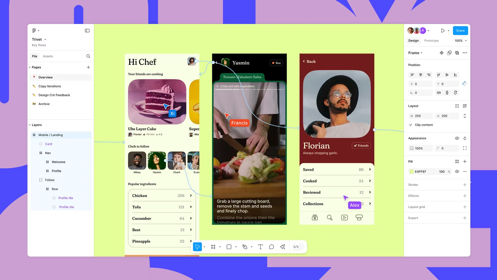

### 1.1 前端设计工具的演变

在时间的长河中，所谓前端设计工具其实是一条持续演化的技术。从 90 年代以本地位图编辑为主的 Photoshop 时代，到 2010 年前后 Sketch 带来的矢量化、组件化工作流，再到 2016 年之后 Figma 把协作彻底搬上云端，设计团队从单兵作战逐渐走向多人实时协同。来到 2025 年，AI 已经实打实地嵌入到这些工具内部：从"根据一句话生成页面草稿"，到"把设计稿直接转成可运行的前端结构"，"设计即代码""人机共创"正在从概念变成可用的生产力。

本节中，我们会选取最具代表的两种现代前端设计工具进行介绍，Figma 和 MasterGo。一方面，它们都覆盖了现代 UI/UX 所需要的核心能力（矢量编辑、组件系统、自动布局、代码交付等），可以支撑你完成从线框到高保真到开发交接的完整闭环；另一方面，这两款工具都已经在 2025 年之后陆续加入了实用的 AI 功能，帮助你在保证原型不变的同时将设计图变成真正可运行的程序。

### 1.2 诞生之旅


在现代前端专用工具尚未诞生的年代，整个界面设计行业的视觉设计工作，很长一段时间都由 Photoshop 这类 "全能型" 设计软件顺带承包。设计师会在本地通过一层层叠加的图层，细致完成页面整体视觉效果的设计，最终将体积不小的 .psd 源文件交付给前端工程师 —— 而前端要精准还原设计图，还必须手动完成三项繁琐且关键的工作：

一是 "切图"：需要从 .psd 文件的多层结构里，把按钮、图标、Logo、背景模块等独立视觉元素逐一拆分提取，再导出为 PNG、JPG 等网页能直接加载的图片格式（毕竟网页无法直接识别 PSD 的图层信息，只能依赖这些拆分后的图片呈现细节）；

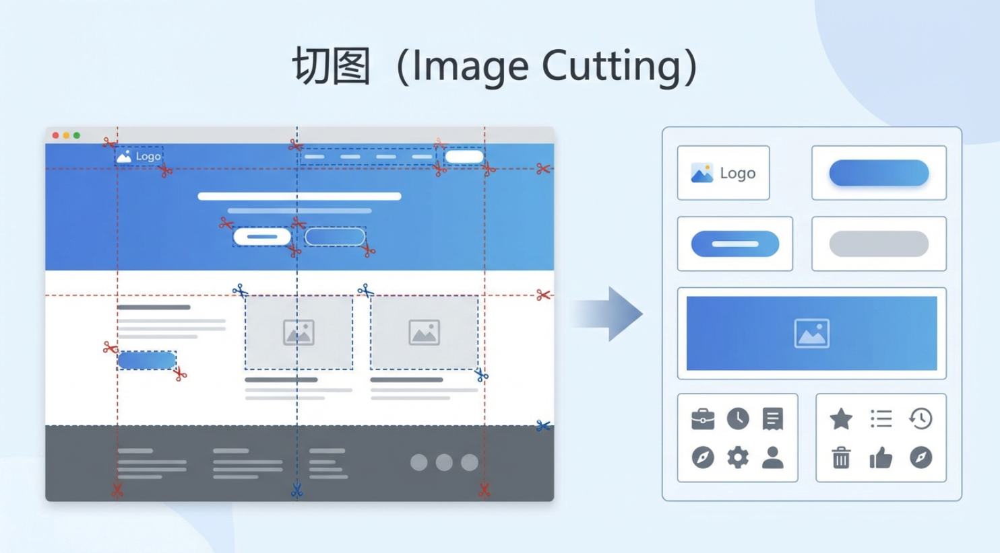

二是 "量尺寸"：得用软件自带的测量工具，逐一确认每个元素的宽高、不同模块间的间距（margin/padding）等数据，确保所有尺寸都精准到像素；

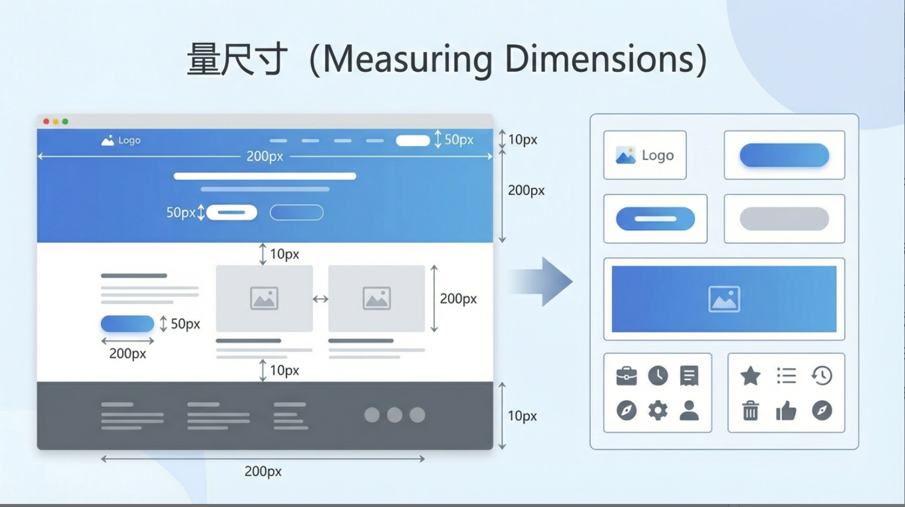

三是 "抠标注"：要从设计图中提取那些 "看不见却必须有的" 隐性参数 —— 比如文字的字号、字重、行距，每个色块的 RGB 或 HEX 色值等，相当于把设计师没写在纸上的 "设计规格" 手动 "抠" 出来记录。


::: warning 小哲的教训
小哲第一次还原设计稿时，正是这么干的：切图、量尺寸、抠标注，整整忙了一下午才还原出半个页面。第二天设计师改了主色调和按钮圆角，他又得把这三步全部重来。问题出在他一直把设计稿当成"一张图"，所以只能用眼睛去搬——可设计师那边的文件里，**每个元素的尺寸、颜色、层级、间距本来就是结构化数据**。信息在传递中被压扁了，他做的全是无用功。
:::

在此之后，前端的实现阶段才真正展开。无论使用的是原生 HTML/CSS/JS，还是基于 Vue、React 等框架，本质过程是一致的。前端会以 "容器为核心载体"，根据设计中各模块的层级与语义重建页面结构。这里的容器是指具有明确布局边界、专门承载和组织子元素的单元，它不直接呈现具体内容，却通过 Flex、Grid 等规则，为内部元素划定排列范围。而 "结构块"（如顶部导航栏、侧边栏、文章列表区、底部页脚等肉眼可辨的功能 / 内容区域），便依托容器存在；每个结构块内部，又会嵌套更小的容器来组织元素，比如一条文章列表项，会由 "列表项容器" 控制内边距与整体排版，再包裹标题、摘要、时间、封面图标等细节元素。

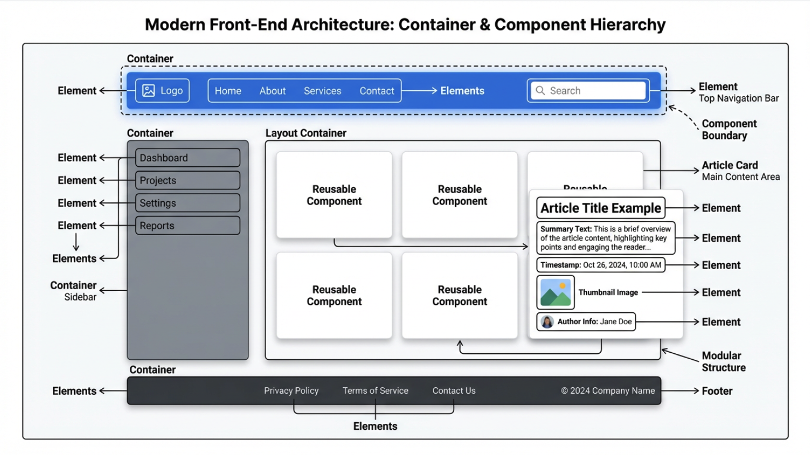

在现代前端框架里，这些 "结构块（及关联的容器与元素）" 通常会被实现为 "组件"。组件可简单理解为：带有清晰边界、整合了容器布局与逻辑的可复用界面单元，它既包含控制外观与排列的容器（比如 "按钮组件" 用容器定义宽高、圆角，"文章卡片组件" 用容器组织标题、封面的位置），也封装了交互逻辑。设计稿中重复出现、形态一致的部分（如统一风格的按钮、反复使用的文章卡片），在代码中会被抽象成组件：既能在不同页面 / 场景复用，减少重复开发，也能通过组件内容器的统一规则，确保所有复用处的布局与风格高度一致

随后，前端会使用样式系统还原视觉和布局。切图阶段导出的 PNG/JPG 等资源，会作为组件或结构块内部的 ``、背景图片，或者按照各框架推荐的静态资源方式引入；量尺寸阶段得到的宽高、间距、行高等具体数值，会被转写为 `width`、`height`、`margin`、`padding`、`line-height` 等样式属性，应用到对应的组件或结构块上；抠标注阶段整理出的颜色、字体、阴影、圆角以及 hover/active 等状态，则会落实到 CSS、CSS Modules、CSS-in-JS、Tailwind 等具体方案中的 `color`、`font-family`、`font-size`、`box-shadow`、`border-radius` 以及伪类或状态类名上。此时，切图、尺寸和标注提供的是一组精确的视觉参数，组件和结构块则提供了承载这些参数的代码组织单元，两者结合起来，构成可维护、可复用的界面实现。

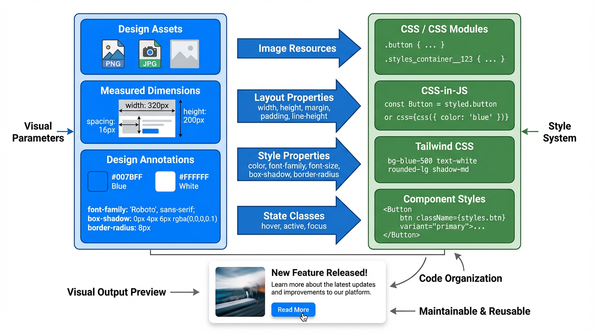

但是，以本地文件为中心的模式天然是低效率的。版本通过邮件和网盘传输，新旧稿件容易混淆，设计和开发之间大量依赖上述的复杂交互方法，协作成本和出错概率都不低。

移动互联网兴起后界面复杂度和迭代速度需求快速上升，Photoshop 的"大而全"逐渐显得笨重。这个阶段，出现了 Sketch。Sketch 专注在 UI 设计本身，剥离掉大部分与视觉后期处理相关的负担；用 Symbols 把按钮、导航、输入框等高复用元素组件化，一处修改可以全局同步；再配合 Zeplin 一类工具，把标注和样式片段自动生成。Sketch 把"组件思维"引入了设计工作流。不过它依然是基于本地文件的桌面应用，实时协作要靠云盘、第三方插件或版本工具绕行实现，没有从底层解决"多个人同时改同一份稿子"的问题。


真正改变游戏规则的是 Figma。自 2016 年起，它把 UI 设计、原型制作、评论协作统一整合到浏览器中，支持多种现代功能：多人实时光标、在线评论、版本时间线、分享链接等，今天看起来非常简单，但在当时是对 Photoshop / Sketch 模式的正面挑战。


至此，界面设计不再是散落在各自电脑里的文件，而是集中在一份在线、实时更新的云端画布上。围绕这块画布，我们可以想象更进一步，用自动化或 AI 的方式模糊设计和前端代码的边界。

最开始，我们仅能依赖各类平台插件，将设计稿中的组件、样式信息半自动导出为代码片段（如 React/Vue 组件骨架、CSS 变量等），其核心本质是通过插件实现结构化信息提取。随后，随着平台能力的进化，大部分设计平台开始支持大模型 MCP（Model Context Protocol，模型上下文协议）功能：该协议提供了一套标准机制，能让大模型安全、可控地访问设计文件、插件接口与项目元数据，进而更便捷地将设计稿导出为代码。

再往后，在插件与 MCP 的基础上，前端代码自动化进一步迈入到原生支持从设计稿直接推导代码结构的阶段。我们可在设计工具内一键生成前端项目骨架、组件层次、样式体系及对应的代码结果。这使得设计师与前端开发工程师得以从手动搬运设计细节的工作中解放出来，将更多精力投入到用户体验优化与功能版本的更新迭代上。

<InfoCard icon="💡" variant="tip">
**小哲的「啊哈」时刻**

当小哲发现 Frame 就是容器、Auto Layout 就是 Flex、组件就是组件，他立刻明白了：设计稿不需要"还原"，它本来就**带着代码结构**。设计师用 Auto Layout 搭好的页面，导出时这套布局规则可以直接变成 CSS。工具能转码，正是因为这层结构一直都在——而这一周，他要做的就是亲手把这层结构搭出来，再让工具替他转成代码。
</InfoCard>

---

## 2. Figma 入门

接下来我们从抽象的概念部分来到实际的操作环节。由于时间关系，我们只会学习 Figma 的基本操作逻辑，确保即便你完全没用过设计工具，也能跟着完成练习。如果你想进行完整的 Figma 功能学习，请你参考 Figma 提供的详细官方教程进行学习：https://help.figma.com/hc/en-us/sections/30880632542743-Figma-Design-for-beginners

或者参考如下教程，进行类似个人作品集简单网页的快速搭建：https://help.figma.com/hc/en-us/sections/35895585621655-Figma-Sites-collectio


左侧是项目的新建和资源管理入口，右上角的几个按钮是 Figma 的常见功能。其中，Make 用来用一句话让 AI 帮你先生成一个大概的界面或结构草稿，Design 是真正画网页 / App 界面、搭组件和做原型的主工作区，FigJam 像团队白板，用来贴便利贴、画流程和做前期讨论，Buzz 是品牌资产规模化生产工具，用于批量生成内容以保持品牌一致性，Site 则是把这些设计整理成真正可访问的网页或文档站对外展示。

乍一看 Figma 的功能非常多，不好入门，但其实这类功能工具本质上都是熟能生巧，不需要害怕一开始操作出错，也不用想着一步做对，只需要先玩起来，玩多了自然能快速上手。

本篇教程中，为了快速入门，我们会对 Design 功能做简单讲解。

### 2.1 新建 Design 文件

在首页或者右上角的入口里，选择 **Design** ，新建一个文件，你会进入一个空白的设计画布。
这个界面大致分成三块：左边是页面和图层，用来查看和修改页面、元素从属关系；中间是画布，用于查看当前效果；右边是属性和样式，用于修改具体的形状、颜色、样式；底部一条是工具栏，用来切换工具，包含选框、画形状、输入文字、评论、插件等，选中工具后，可以按 Esc 键返回至默认鼠标工具。

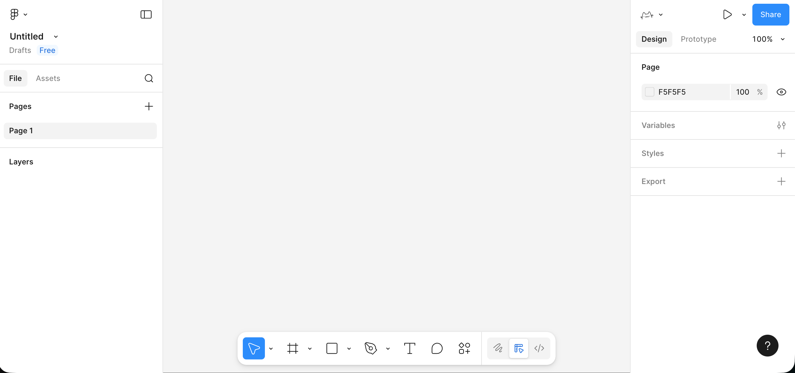

### 2.2 创建你的第一个 Frame（画板）

在正式放置元素之前，需要先为页面确定一个清晰的边界，这个边界由 Frame 来承担。你可以在底部工具栏中选择 Frame 工具，或者直接按键盘 F，然后在画布上拖出一个矩形区域。

1. 使用底部工具栏里的 Frame 工具，或者直接按键盘 `F`。
2. 在画布中拖出一个矩形区域，右侧属性栏里把宽度改成比如 `1440`，高度改成 `900`。
3. 在左侧图层栏，把这个 Frame 重命名，比如叫 `My First Page` 或者你项目的名字。

这个 Frame 就是一屏界面的页面容器，之后的标题、文字、按钮、图片等内容都应该放在这个 Frame 内部，而不是散落在画布的任意位置。以 Frame 为边界来组织内容，有助于在后续进行滚动设置、适配不同设备尺寸、导出画面及制作原型时，保持结构可控。


### 2.3 在 Frame 里放文字和简单元素

有了容器，接下来我们来学习如何放置最基本的组件，例如：标题、副标题、按钮、占位图块。

1. 选择文字工具（底部工具栏中的 `T`），在 Frame 里点击一下，输入页面标题，比如：`My Portfolio`。
   在右侧属性里，把字体大小调大一点（例如 96），字重调粗一点。
2. 在标题下面，再用文字工具输入一行简单说明，比如一两句描述这个页面要做什么。
   字号可以小一些，行高略放大一点，读起来不那么挤。
3. 画一个按钮雏形：
   用矩形工具在标题下面画一个大概 `200 × 48` 的矩形，右侧给它一个比较明显的填充颜色，再适当加一点圆角。
   
4. 然后用文字工具在矩形上方输入按钮文字，比如 `Get Started`，把矩形和文字一并选中，用顶部的对齐工具让文字水平、垂直都居中。
5. 在按钮一侧或下方，再画一个较大的浅灰色矩形作为"图片占位区"，后面可以用来放展示图片。

做到这里，其实你已经有了一个非常简陋但结构完整的"首页草稿"：一个标题、一段话、一个按钮、一个主要展示区域。

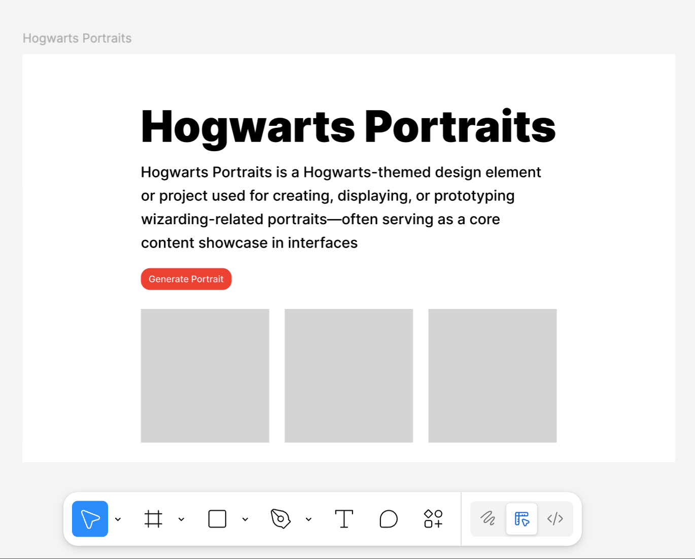

### 2.4 善用 Auto Layout 整合元素

如果所有元素只是随手拖拽，页面很快会乱。Figma 里一个很重要的概念就是 **Auto Layout** ，它可以把一组元素变成一个带规则的容器。

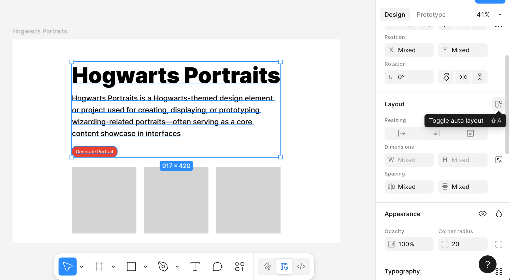

你可以选中"主标题 + 副标题 + 按钮"这三样，在右侧属性栏里点击 **Add Auto layout** 。

这时这三样会被包在一个容器里，你可以在右侧调整参数，其中的元素布局会根据参数自动适应调整：

- 它们是竖着排还是横着排。
- 元素之间的间距是多少。
- 整个这一块离容器边缘有多少内边距（padding）。

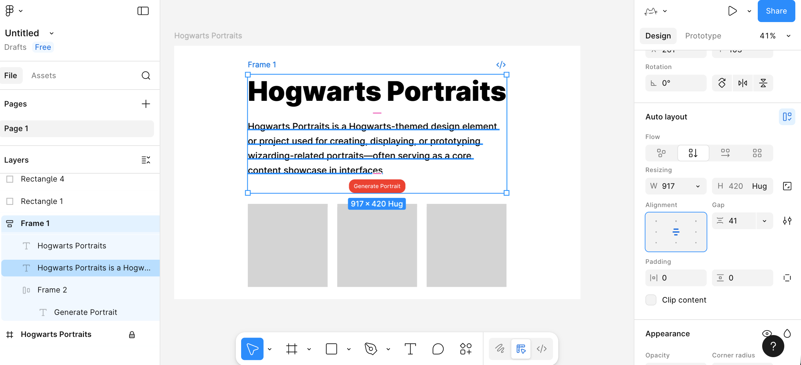

同样，按钮内部也可以用 Auto Layout，我们能够实现这样的一个效果：当我调整了文字，按钮的长度也会自动调整。

先把按钮背景的矩形和按钮文字选中，添加 Auto Layout，让这两个东西变成一个"按钮容器"。接着选中这个按钮容器，把宽高都设置成 **Hug contents** 。这样一来，文字会一直保持在按钮正中间，文字多一点、少一点，按钮的宽度都会自动跟着变化。

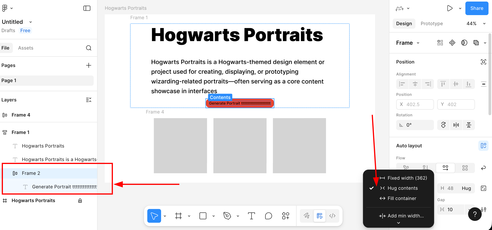

::: tip Auto Layout 就是 Flexbox
小哲在这里第一次有了"我在写代码"的感觉：竖排还是横排，对应 `flex-direction`；间距对应 `gap`；内边距对应 `padding`；"Hug contents"对应的就是宽度由内容撑开。换句话说，你在 Figma 里调的每一个 Auto Layout 参数，几乎都能在 CSS 里找到对应项——这正是设计稿能转码的根本原因。
:::

### 2.5 将按钮变为可复用组件

现在我们要学习一个新的概念，组件。组件的意思就是可以被反复利用的元素，比如按钮这种元素，只要你预感之后还会反复用到，就可以考虑把它做成组件。我们在刚才已经加好 Auto Layout 的按钮基础操作：

1. 选中整个按钮容器。
2. 右键选择 Create component（创建组件）。
   

这样，这个按钮就从一组普通图层，变成了一个组件母版。之后如果你在其他页面或 Frame 里需要同样风格的按钮，可以直接从左侧的 Assets 面板里拖出来使用。


此时所有用到的按钮，都是这个母版的同步拷贝。当你修改母版的颜色、圆角或间距时，所有实例都会自动保持同步更新。

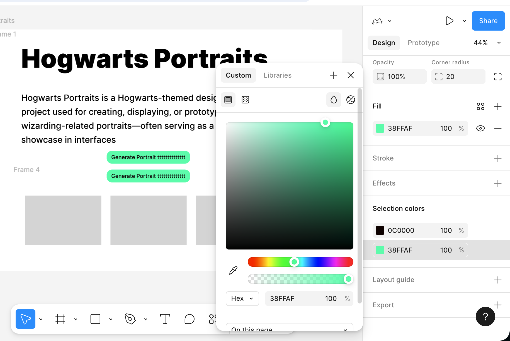

至此，你已经初步掌握了 Figma 的简单用法。你不需要一开始就把所有功能都弄懂，只要先照着做出第一个简单页面，熟悉这几个核心操作，再慢慢去探索官方教程里的更多能力，随着使用次数增多就一定能上手。

---

## 3. MasterGo 入门

在理解了 Figma 的基础工作流程之后，我们再来看 MasterGo，你可以把 MasterGo 简单看做是中国版的 Figma，但在部分功能上有一定区别。整体上，它延续了与 Figma 相似的界面布局和操作理念：同样有画布、图层树和属性面板，同样支持组件、样式、自动布局和多人协作。更详细的内容可参考 MasterGO 的官方教程：https://mastergo.com/tutorials/12?%E5%85%A8%E7%A8%8B%E9%AB%98%E8%83%BD%EF%BC%8CMasterGo%20%E6%9C%80%E5%AE%8C%E6%95%B4%E5%AE%9E%E7%94%A8%E6%95%99%E7%A8%8B%EF%BC%8C%E8%AE%A9%E4%BD%A0%E4%BB%8E%E9%9B%B6%E5%88%B0%E7%B2%BE%E9%80%9A%EF%BC%81

### 3.1 新建设计文件

1. **进入 MasterGo 后台**
   1. 打开 MasterGo 官网并登录账号。
   2. 进入后，你会看到类似「文件列表 / 项目列表」的首页区域，用来管理你的设计文件。
      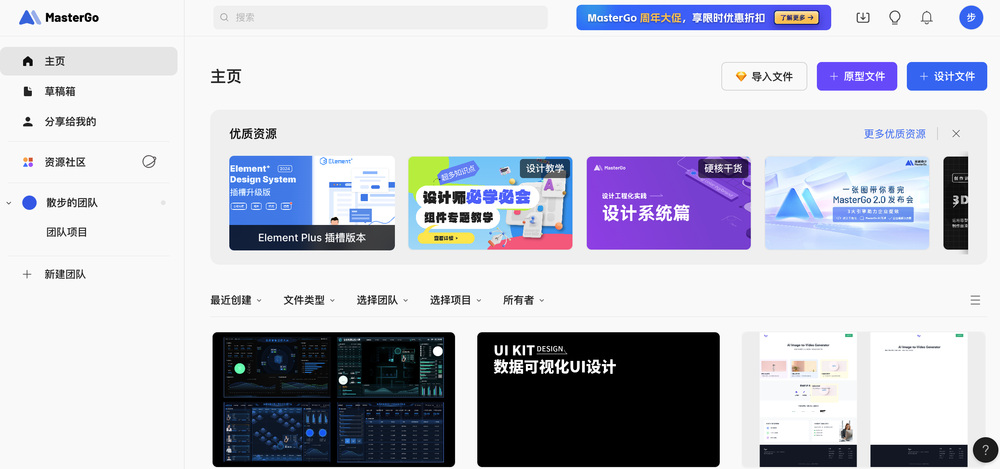

2. **创建新文件**
   1. 在右上角看到 + 设计文件的按钮选项进行点击，或者选择导入 Figma 等文件。
   2. 点击后，你会进入一个空白画布，这就是 MasterGo 的设计工作区。

3. **认识基本界面区块**
   当你学会使用 Figma 后，MasterGo 的使用方式大同小异，主要分为几个区域：

   
   1. 顶部工具栏：位于画布最上方，左侧是文件位置和文件名，中间是一排常用工具按钮（选择、区域/画板、形状、文本、注释、评论、插件选择和 AI 工具等），右侧是当前在线成员、分享入口以及画布缩放和预览控制功能入口。
   2. 左侧面板：主要分为图层和资源，当前停留在图层标签，可看到页面列表，以及该页面下所有图层的结构和层级。
   3. 中间画布区：具体绘制和排版的工作区，所有 Frame、组件和图形都会展示在这里。
   4. 右侧属性面板：用于查看和编辑选中对象的属性，例如大小、位置、对齐方式、背景填充、描边、圆角等。如果没有选中任何对象，会显示画布相关设置，如画布背景色、标签和导出选项。

### 3.2 创建你的第一个 Frame

在正式放东西之前，我们需要一个页面容器用来确定界面的边界和尺寸。这个容器在 MasterGo 里，通常叫 Frame。

**步骤：**

1. **选择 Frame 工具**
   1. 在工具栏中找到 Frame / 画板工具，点击后可使用预设参数直接将内容创建到画板。
   2. 或者使用快捷键（通常是 `F`，如果有差异以实际界面为准）。
2. **在画布中拖出一个矩形区域**
   1. 拖出后，你会看到一个带选中框的区域。
   2. 右侧属性面板里，可以看到这个 Frame 的宽度和高度。
   3. 把宽度改成比如 `1440`，高度改成 `900`（一屏网页常用尺寸之一）。
3. **重命名 Frame**
   1. 在左侧图层面板里找到这个 Frame。
   2. 双击名称，把它改成你项目的名字，比如：`My First Page`，或者你自己随便起的页面名。


### 3.3 创建画板内容

有了容器，使用与 Figma 中我们已教过的类似方式，很容易可以得到相似的展示页面。（你可以尝试复制 Figma 画板中的文字元素，能够支持文本组件的直接粘贴导入）

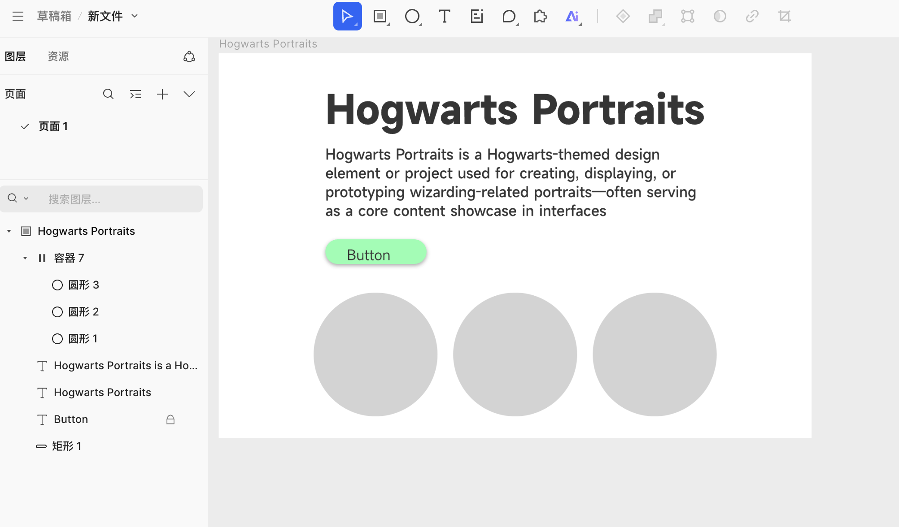

值得注意的是 Auto Layout 功能行为稍微的不一致性，在 MasterGo 中，如果你想实现和 Figma 相似的按钮长度随着文字的长度变化，你需要先在对应矩形元素的基础上创建一个容器或组件，如图所示：


成功创建容器后，将按钮矩形和文字放到对应并列的容器中，再在右侧找到 Auto Layout 的按钮启用自动功能，即可成功实现按钮宽度能够随着文字长度变化的功能。


### 3.4 AI 生成页面

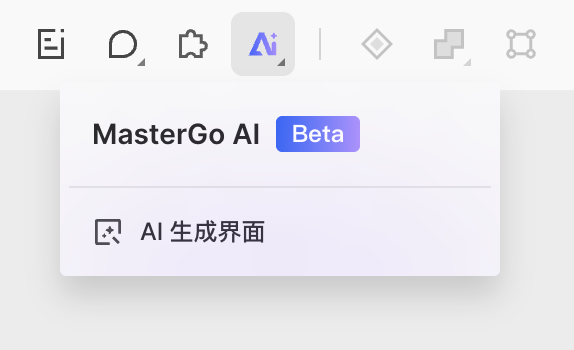

在 MasterGo 中，一个值得注意的有趣功能是 AI 生成页面。你可以用一句话或携带参考图，生成对应的 MasterGo 可编辑版组件，并得到可直接使用的代码。你可以使用中文或者英文直接输入需求，页面会根据需求返回结构清晰的页面排布文档，效果如下：


设计文档生成结束后，点击开始生成，稍作等待便能获取对应的实际网页效果：


此时你有两种操作选择：一是点击蓝色按钮将生成结果直接插入画布，二是点击代码预览功能，直接获取当前完整页面的代码，具体操作界面如下：

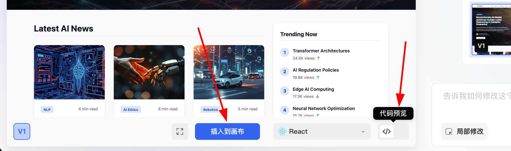


将结果插入画布后，你还能对网页的整体布局、元素细节（如字体、颜色、间距等）进行更精细的调整，直至最终效果完全符合你的预期。


<InfoCard icon="🤖" variant="info">
**AI 生成页面，本质是"先规划再生成"的工作流**

MasterGo 的 AI 生成页面，本质上就是"输入一句话需求，模型先规划再生成"的过程：它会先给出一份结构化的页面排布文档让你确认，再据此生成可编辑的页面。能力越强，越要给它边界——生成出来的结果是初稿，不是成品。这跟小哲后面要学的「让 AI 写代码」是同一套思路：你负责定方向、做审查，AI 负责出第一版。
</InfoCard>

---

## 4. AI 生成设计素材：从一句话到一套图

前面三节，小哲学会了用 Figma 和 MasterGo 搭页面原型。但他很快发现一个新问题：页面结构搭好了，可里面的图标、按钮、配图从哪来？手绘？外包？还是去图库里一张张找？

这一节，我们要解决的就是**设计素材的生产问题**。小哲会学到：用 AI 生成模型（如 NanoBanana）快速产出设计素材，并且保持风格一致。

### 4.1 认识 NanoBanana：你的第一个 AI 绘图工具

在开始讨论设计风格、提示词工程之前，我们先解决一件更重要的事：**确认你真的可以生成一张图片。**

当前主流的大模型已经具备图像生成与编辑能力，这类模型通常被称为**生成式模型**。为了把流程尽量简化，本教程选择了一个已经具备稳定图像生成与编辑能力的模型作为示例——**NanoBanana**。它是 Google 推出的图像生成模型，正式名称为 **Gemini 3.1 Flash Image Preview**，支持通过自然语言直接生成图片，也支持在已有图片基础上进行修改。


在能力层面，它和你可能听说过的其他模型（如 GPT-4o、Claude、Qwen、Midjourney 等）并没有本质区别：**输入描述，模型负责生成结果。**

你可以把它理解为一支"画笔"。我们在这一章只关心一件事：
👉 **这支画笔能不能在你手里画出第一笔。**

在实际使用中，NanoBanana 可以通过 **Google AI Studio** 等官方平台直接使用，也可以通过 **API** 的方式集成到开发流程中。本教程采用 API 调用方式。

### 4.2 "Hello World" 级别的生成

在开始之前，你只需要完成下面三步：

1. **在 Trae 中新建一个文件夹**
2. **新建一个 Python 文件**
3. **将下面的代码完整粘贴进去**

Trae 会自动完成所需的环境部署与依赖安装，不需要额外配置。

代码中会用到 NanoBanana 的 API Key。这里不展开申请流程——只要你能获取并填入对应参数即可。**这一阶段不追求理解每一行代码，只要它能成功运行。**

**第一个 AI 绘图脚本：**

```python
# /// script
# dependencies = [
#   "gradio>=4.0.0",
#   "pillow>=10.0.0",
#   "requests>=2.31.0",
# ]
# ///

import gradio as gr
import requests

NANOBANANA_API_URL: str = "YOUR API URL"
NANOBANANA_API_KEY: str = "YOUR API KEY"

def synthesize(prompt: str):
    if not prompt:
        return None

    headers = {
        "Content-Type": "application/json",
        "Authorization": f"Bearer {NANOBANANA_API_KEY}"
    }
    payload = {
        "messages": [{"role": "user", "content": prompt}],
        "model": "gemini-2.5-flash-image"
    }
    response = requests.post(NANOBANANA_API_URL, headers=headers, json=payload)
    # 解析返回的图片数据
    return output_image

with gr.Blocks() as app:
    gr.Markdown("# NanoBanana 文生图")
    prompt_input = gr.Textbox(label="提示词", lines=3)
    image_output = gr.Image(label="生成结果")
    submit_btn = gr.Button("生成")
    submit_btn.click(synthesize, [prompt_input], image_output)

app.launch()
```

当 Trae 提示运行成功后，点击它提供的本地链接（通常是 http://127.0.0.1:7860）。

如果一切正常，你会看到一个已经可以工作的 AI 绘图界面。这个界面看起来很简单，但它已经具备了商业级绘图工具中最核心的两项能力：**文生图**和**图生图**。

现在我们可以尝试生成你的第一张图片了！本示例使用的 prompt 如下：

> **A red apple**

这是一个刻意简化的示例，不包含任何风格或参数描述。

<AiChat 
  :initial-messages="[
    { role: 'user', content: 'A red apple' },
    { role: 'assistant', content: '正在生成图片...' }
  ]"
  :show-input="false"
  title="第一次 AI 绘图"
/>

几秒钟后，你会在本地看到生成结果。而模型生成具有随机性，所以相同的 prompt 会有不同的生成结果，你可以多次生成，选择你心仪的图片。

也可以丰富你的提示词，给予它更多的描述和限定。例如以下提示词，得到的图片就会更加特殊一些：

```
"A hyper-realistic close-up of a fresh red apple with water droplets on its skin, 
sitting on a dark rustic wooden table. Cinematic dramatic lighting, rim light, 
shallow depth of field, bokeh background, 8k resolution, macro photography."

（一个超写实的带水珠的新鲜红苹果特写，放在深色粗糙木桌上。电影级戏剧光效，
轮廓光，浅景深，背景虚化，8k分辨率，微距摄影。）
```

<InfoCard icon="💡" variant="tip">
**小哲的第一张图**

当小哲看到第一张 AI 生成的苹果出现在屏幕上时，他立刻明白了：**设计素材不再是「找」或「画」，而是「生成」。** 只要提示词写得清楚，AI 就能在几秒钟内产出一张可用的图片。这意味着他可以快速迭代、快速试错，而不用等外包设计师或自己慢慢画。
</InfoCard>

### 4.3 生图模型常见的素材生成场景

在实际工作中，大模型生成图片更多用于 **高效产出设计素材**，而不是创作单张艺术作品。

当你观察一些设计类营销账号的高赞案例时会发现，它们的产出大多集中在两类场景：

- **文生图（从 0 到 1）**
- **有图参考生图（从 1 到 N）**

#### 场景一：文生图——快速获取设计物料

这一类场景关注效率。当需要填补设计中的空白（如空状态、头像、配图）时，AI 本质上充当的是一个 **即时生成的图库**。

##### 1. 生成 UI 设计物料

**流行趋势**：Dribbble 上常见的毛玻璃、黏土风 3D 图标
**常见表现**：通透材质、边缘发光、糖果配色的功能或天气图标

**示例 Prompt：**

> A set of 3D weather icons (sun, cloud, rain), glassmorphism style, frosted glass texture, soft pastel gradient colors, soft studio lighting, isometric view, transparent background, 4k.

（一套 3D 天气图标，毛玻璃风格，磨砂质感，柔和渐变色，影棚光，等轴视图）

##### 2. 生成 Logo

**流行趋势**：极简线条、几何组合的科技感 Logo
**常见表现**：黑白配色、负空间设计、品牌感明确

**示例 Prompt：**

> Minimalist vector logo design for a tech brand "Coffee Code", combining a coffee cup with coding brackets < >, flat design, solid black lines, white background, Paul Rand style, svg.

（极简矢量 Logo，结合咖啡杯与代码符号，扁平设计，纯黑线条）

##### 3. 生成官网用户图片

**流行趋势**：SaaS 官网常用 3D 虚拟头像，用于规避真人版权
**常见表现**：友好表情、卡通比例、偏 Pixar 或 Memoji 风格

**示例 Prompt：**

> Close-up portrait of a friendly young tech professional, smiling, Memoji 3D style, clay render, bright colors, soft lighting, solid plain background, Pixar character design.

（友好的年轻科技从业者，3D Memoji 风格，黏土渲染）

##### 4. 生成文章配图

**流行趋势**：科技公司博客中常见的抽象扁平插画
**常见表现**：紫蓝配色、夸张人物比例、漂浮 UI 元素

**示例 Prompt：**

> Editorial flat illustration representing remote work, a person sitting on a giant globe using a laptop, corporate memphis art style, vibrant colors (purple and teal), vector texture.

（远程办公主题扁平插画，企业孟菲斯风格）

#### 场景二：有图参考生图——保持视觉一致性

这一类场景更关注 **扩展性**。当你已经有一张满意的主视觉，需要生成一整套风格一致的素材时使用。

##### 5. 主视觉相似的一套按钮或交互素材图

在游戏开发中，UI 的一致性非常关键。假设你已经有了主界面的 **"PLAY"** 按钮，现在需要扩展出一整套风格统一的功能按钮（如暂停、设置、主页）。仅靠手绘很难保证每个按钮在光泽、透视和色值上的完全一致。

**基本操作流程：**

1. 保存已有的蓝色 "PLAY" 按钮图片
2. 将其拖入界面的 **Input Image** 区域，作为后续生成的参考母版
3. 保持 prompt 中的风格描述不变，仅修改主体内容

在这一流程下，只要替换主体描述，就可以得到不同功能但风格一致的按钮。

**示例 Prompt：**

**变体 A：暂停按钮（图标类）**

> A capsule-shaped game UI button with a white pause icon (two vertical bars) inside. Same glossy blue jelly style, shiny plastic texture, white thick outline, vector illustration, high quality.

（胶囊形游戏 UI 按钮，白色暂停图标，蓝色果冻质感）

**变体 B：设置按钮（复杂图标）**

> A capsule-shaped game UI button with a white gear icon (settings symbol) inside. Same glossy blue jelly style, shiny plastic texture, white thick outline, vector illustration, high quality.

（胶囊形游戏 UI 按钮，白色齿轮图标，蓝色果冻质感）

**变体 C：重玩按钮（形状变化）**

如果需要调整按钮外形，可以在 prompt 中直接描述形状，模型会在保留材质特征的同时尝试改变结构。

> A round game UI button with a white circular arrow icon (replay symbol) inside. Same glossy blue jelly style, shiny plastic texture, white thick outline, vector illustration, high quality.

（圆形游戏 UI 按钮，循环箭头图标，蓝色果冻质感）

通过这一组操作，你不仅可以替换按钮功能和图标，甚至改变按钮形状，但所有生成结果在材质、配色和光影上仍保持高度一致。这正是大模型在设计素材裂变场景中的核心价值。

<InfoCard icon="🎨" variant="success">
**小哲的素材库**

小哲用这套方法，在一个下午内生成了 20 多个风格统一的按钮、图标和配图。他把这些素材整理成一个文件夹，命名为「项目素材库 v1」。下次做新页面时，他可以直接从这个库里拿，而不用每次都重新生成。这就是 **AI 素材生产的核心价值：可复用、可迭代、可扩展**。
</InfoCard>

---

通过本周的学习，小哲已经掌握了：

1. **前端设计工具的价值**：理解了为什么需要设计工具，以及它们如何解决信息分布、团队协作的问题。

2. **Figma 基础操作**：
   - 创建 Design 文件和 Frame 画板
   - 添加文字、形状等基础元素
   - 使用 Auto Layout 实现自适应布局
   - 创建可复用的组件系统

3. **MasterGo 基础操作**：
   - 熟悉与 Figma 相似的界面布局
   - 创建 Frame 和基础画板内容
   - 使用 AI 生成页面功能快速创建原型

4. **「设计稿即结构化数据」的认知**：
   - 看懂 Frame 是容器、Auto Layout 是 Flex、组件就是组件
   - 明白设计稿背后藏着一层代码结构，这正是「设计稿转代码」能成立的前提

::: tip 💡 下一步
现在你已经掌握了前端设计工具的基础使用方法，可以尝试：
- 为自己设计一个个人作品集页面的原型，把 Auto Layout 和组件化用起来
- 为接下来的项目设计界面原型，理清页面的结构层次
- 留意你搭出的每个 Frame 和组件，想想它会对应成什么样的前端代码——理解了这层对应，把设计稿交给 AI 转码时你才看得懂结果
:::

---

## 6. 小哲这周的转变

> 小哲回头看自己第一天还原设计稿的那个下午：切图、量尺寸、抠标注，忙了半天还被一次改稿全部推翻。
>
> 这周结束时他在笔记里写：**「设计稿从来不是一张图，而是一份结构化数据。我先在 Figma 和 MasterGo 里亲手把这层结构搭出来——Frame 是容器、Auto Layout 是 Flex、组件就是组件。等到要让工具把它转成代码时，我心里会有底：因为这层结构是我自己搭的，工具转出来对不对、漏没漏，我一眼就能看出来。」**

---

## 本周回顾

<ProgressTracker title="第 3 周学习进度" :items="[
  { title: '搞懂了为什么先用设计工具', description: '设计工具解决信息分布与协作，写代码之前先想清楚', done: false },
  { title: '会用 Figma 搭页面', description: 'Frame / 文字与元素 / Auto Layout / 可复用组件', done: false },
  { title: '会用 MasterGo 搭页面', description: '与 Figma 的异同 + AI 生成页面', done: false },
  { title: '看懂设计稿背后的结构', description: 'Frame 是容器、Auto Layout 是 Flex、组件就是组件，为把设计稿转代码打底', done: false }
]" />

**自测问题：**

1. 为什么在写代码之前值得先用设计工具？它解决的到底是什么问题，和直接写 HTML/CSS 有什么区别？
2. Figma 里的 Frame、Auto Layout、组件，分别对应前端代码里的什么？为什么说"设计稿本来就带着代码结构"？
3. MasterGo 的 AI 生成页面是怎么工作的？它给出的结果为什么只能当初稿、还需要你来确认和调整？

---

## 7. 小哲这周的转变

> 小哲回头看自己第一天还原设计稿的那个下午：切图、量尺寸、抠标注，忙了半天还被一次改稿全部推翻。
>
> 这周结束时他在笔记里写了两段话：
>
> **第一段，关于设计工具：**「设计稿从来不是一张图，而是一份结构化数据。我先在 Figma 和 MasterGo 里亲手把这层结构搭出来——Frame 是容器、Auto Layout 是 Flex、组件就是组件。等到要让工具把它转成代码时，我心里会有底：因为这层结构是我自己搭的，工具转出来对不对、漏没漏，我一眼就能看出来。」
>
> **第二段，关于 AI 素材生产：**「设计素材不再是『找』或『画』，而是『生成』、『复用』、『迭代』。我用 AI 生成了一套风格统一的图标和按钮，整理成『项目素材库 v1』；我还搭了一个 Agent，能自动为文章生成配图，效率提升了 20 倍。更重要的是，我明白了 Agent 的核心价值：不是替代人，而是把人从重复劳动中解放出来，让人专注于更有创造性的工作。」

---

## 本周回顾

<ProgressTracker title="第 3 周学习进度" :items="[
  { title: '搞懂了为什么先用设计工具', description: '设计工具解决信息分布与协作，写代码之前先想清楚', done: false },
  { title: '会用 Figma 搭页面', description: 'Frame / 文字与元素 / Auto Layout / 可复用组件', done: false },
  { title: '会用 MasterGo 搭页面', description: '与 Figma 的异同 + AI 生成页面', done: false },
  { title: '会用 AI 生成设计素材', description: '文生图 / 图生图 / 保持风格一致 / 批量生成', done: false },
  { title: '搭建了素材生产 Agent', description: 'LLM 意图识别 + 提示词生成 + 图像模型渲染', done: false },
  { title: '看懂设计稿背后的结构', description: 'Frame 是容器、Auto Layout 是 Flex、组件就是组件，为把设计稿转代码打底', done: false }
]" />

**自测问题：**

1. 为什么在写代码之前值得先用设计工具？它解决的到底是什么问题，和直接写 HTML/CSS 有什么区别？
2. Figma 里的 Frame、Auto Layout、组件，分别对应前端代码里的什么？为什么说"设计稿本来就带着代码结构"？
3. MasterGo 的 AI 生成页面是怎么工作的？它给出的结果为什么只能当初稿、还需要你来确认和调整？
4. 文生图和图生图有什么区别？什么时候用文生图，什么时候用图生图？
5. 为什么直接把长文章发给画图模型效果不好？我们搭建的 Agent 是怎么解决这个问题的？
6. 在素材生产 Agent 中，LLM 和图像模型分别扮演什么角色？为什么要把「理解」和「执行」分开？

---

## 下周预告

前三周你一直在前端这一侧打转：从设计稿、组件库，到这周亲手用 Figma / MasterGo 把页面结构搭出来，再到用 AI 生成设计素材。下周小哲要往下走一层：**现代 CLI 与 Git 工作流。** 你会离开图形界面，开始真正在终端里干活——用命令行管理项目、用 Git 记录每一次改动、用分支和提交把每一步操作变得可审计、可回滚。你会发现，这正是让 AI 协作不再"一改就乱"的地基。我们下周见。
