# 第 7 周：支付与部署——给应用接上 Stripe 并部署上线

> 应用在本地能跑，不等于产品成立。这周小哲要跨过两道坎：让应用能**收到钱**，让应用能**被任何人访问**。前者靠 Stripe 支付链路，后者靠 Zeabur 部署上线。两件事做完，他手里那堆"只有自己能跑"的代码，才第一次变成一个真正的产品。

<ChapterIntroduction duration="2 课时（约 4 小时）+ 2-3 小时实验" output="可跑通的 Stripe 支付链路（Checkout + Webhook）+ 部署到公网的全栈应用 + 一份部署踩坑复盘" prerequisite="完成第 6 周后端接口与数据库；本地能启动全栈应用；会用 Git 基础命令" :tags="['Stripe', 'Checkout', 'Webhook', '订阅', 'Zeabur', '部署上线', '环境变量', '端口']">

你会先想清楚一条收费链路里「谁定价、谁确认、谁记账」，用最快的方式把 Stripe 接进项目并在本地跑通；然后把整个全栈应用部署到 Zeabur，处理端口、环境变量、域名回填这些真实世界的坑，最后拿到一个所有人都能打开的公网地址。重点不是背 API，而是建立两个判断力：**真收钱时，边界该划在哪；真上线时，本地和线上差在哪。**

</ChapterIntroduction>

<StepBar :active="0" :items="[
  { title: '① 本地能跑但没人用', description: '小哲的产品卡在哪' },
  { title: '② 支付的三条铁律', description: '定价/确认/记账归谁' },
  { title: '③ 接通 Stripe 链路', description: 'Checkout + Webhook' },
  { title: '④ 部署上线 Zeabur', description: '拿到公网地址' },
  { title: '⑤ 进阶与选型', description: '其他平台与支付方案' }
]" />

---

## 1. 本地能跑，但没人用

第 6 周结束时，小哲挺得意：登录有了，数据库（Supabase）有了，AI 接口也通了，本地 `npm run dev` 一启动，应用跑得好好的。

但他给同学发了一句"来用用我的产品"，对方回了三个字：链接呢？

小哲愣住了。他的应用只活在 `localhost:5173` 里——那是他自己电脑上的地址，别人根本打不开。更别提收费了：就算有人想付费成为会员，他的项目里连"怎么收钱"这件事都还没有。

::: warning 小哲的卡点
能在本地跑起来，只证明代码逻辑没大问题。但一个产品要成立，还差两件事：**别人能访问**（部署），以及**它能产生收入**（支付）。这周就补齐这两块。真正决定一个支付系统稳不稳的，不是那个"购买"按钮，而是整条收费链路：谁决定价格、谁确认支付成功、谁更新数据库、谁回收权限。
:::

小哲列了个清单，把这周要干的事拆成两条线：

| 目标 | 缺什么 | 这周怎么补 |
|---|---|---|
| 让产品能收费 | 没有支付链路 | 接入 Stripe Checkout + Webhook |
| 让产品能被访问 | 只在本地跑 | 部署到 Zeabur，拿公网地址 |

他决定**先做支付，再做部署**——因为支付逻辑要先在本地写好、跑通，部署只是把它搬到线上。整周的主线就一句话：**让产品先能收钱，再能上线。**

<InfoCard icon="🗺️" variant="info">
**这周的两半，是一条因果链**

前半学 Stripe 支付：把"收钱"这件事在本地跑通，重点是**边界**——价格、确认、记账分别归谁。后半学 Zeabur 部署：把跑通的东西搬上公网，重点是**差异**——本地和线上在端口、环境变量、回调地址上有哪些不一样。支付里配好的那串环境变量，部署时会原封不动再用一次，这就是两半之间的接力棒。
</InfoCard>

---

# 第一部分：支付——让产品能收钱

## 2. 支付的三条铁律

小哲第一反应是：前端不是已经有"升级会员"按钮了吗？让按钮直接连 Stripe，把钱收了不就完了。

他把这个想法发给 Agent，Agent 没急着写代码，先给他泼了盆冷水：**只要是真收钱，就不能让前端说了算。** 如果只是做一个假的演示页面，前端直连当然没问题；但真要收钱，这条路通常会把事情做坏。

最常见的问题有这几个：

1. **价格容易被改**：浏览器里的请求，是用户自己电脑上发出去的，别人可以改请求内容。把"299 元"改成"1 元"对懂行的人不难。
2. **敏感信息容易暴露**：真正重要的密钥、价格逻辑、会员开通逻辑，本来就不该放在前端。
3. **你没法可靠确认"这笔钱到底算不算成功"**：用户跳到成功页，不代表你的数据库已经同步对了。
4. **数据库状态会乱**：用户可能说"我明明已经付钱了"，但你自己的系统里根本没记上。

Agent 给他总结了三条铁律，小哲抄在了便签上：

<SummaryCard title="支付系统的三条铁律" :sections="[
  { number: '1', title: '价格由后端决定', items: ['后端用预先配好的 price_id 创建支付会话', '绝不相信前端传来的金额', '前端只能说「我要买哪个套餐」，不能说「这个套餐多少钱」'] },
  { number: '2', title: '权限由 Webhook 确认', items: ['真正让会员生效的是 Stripe 的 Webhook 事件', 'success 页面只是给用户看的，不能拿它开通权限', 'Webhook 必须校验签名，确认事件真的来自 Stripe'] },
  { number: '3', title: '状态写进自己的数据库', items: ['订单和会员状态要存在自己的库里', '不能只依赖 Stripe 后台查账', '用户说「我付过了」时，你得能在自己系统里查到'] }
]" />

这三条是支付系统最核心的边界。只要边界没错，后面换 Stripe、PayPal、支付宝、微信支付，本质上都只是"接口换了，架构不变"。

<InfoCard icon="💡" variant="tip">
**一句话记住分工**

前端可以负责跳转，后端必须负责定价和确认。只要是真收钱，就不要把"最终价格决定权"和"支付成功后的开通逻辑"放在前端。
</InfoCard>

### 2.1 正确的分工长什么样

把上面的反面教材翻过来，正确的分工其实很清爽：

- **前端负责**：展示按钮、发起购买、跳转页面。
- **后端负责**：决定价格、创建支付会话、接收 Webhook、更新数据库。

::: info 这一段可以直接记成一句话
**前端可以负责跳转，后端必须负责定价和确认。**

只要是真收钱，就不要把"最终价格决定权"和"支付成功后的开通逻辑"放在前端。
:::

### 2.2 什么时候适合先用 Stripe

小哲做的是面向海外用户的 SaaS，Stripe 正好是最顺手的起点。一般来说，下面这些场景 Stripe 都很合适：

- 面向海外用户的 SaaS
- 订阅制会员产品
- 数字产品、模板、AI 积分包
- 想先快速验证商业化，而不是一开始就处理太多本地支付细节

如果你的主要用户在中国大陆，那通常不会把 Stripe 当第一选择——这部分小哲放到了本周最后的"支付方案选型"里统一讲。

---

## 3. 最小可行支付链路

理清了边界，小哲先画出支付系统真正的骨架。只要这条链路能跑通，支付系统就立住了——那个按钮反而是最不重要的部分。

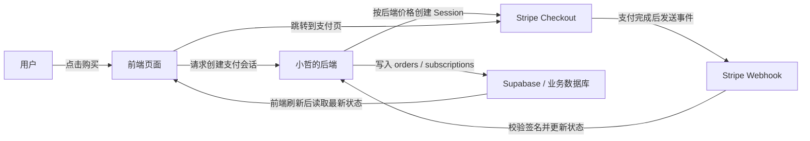
```mermaid
flowchart LR
  user["用户"]
  frontend["前端页面"]
  backend["小哲的后端"]
  checkout["Stripe Checkout"]
  webhook["Stripe Webhook"]
  db["Supabase / 业务数据库"]

  user -->|"点击购买"| frontend
  frontend -->|"请求创建支付会话"| backend
  backend -->|"按后端价格创建 Session"| checkout
  frontend -->|"跳转到支付页"| checkout
  checkout -->|"支付完成后发送事件"| webhook
  webhook -->|"校验签名并更新状态"| backend
  backend -->|"写入 orders / subscriptions"| db
  db -->|"前端刷新后读取最新状态"| frontend
```

把它翻译成人话就是六步：

1. 用户点按钮。
2. 前端找后端要支付链接。
3. 后端用 Stripe 密钥创建支付会话。
4. 用户去 Stripe 页面付款。
5. Stripe 把"付款真的成功了"这件事通过 Webhook 通知你。
6. 你的后端再去更新数据库。

### 3.1 发起付款的标准时序图

如果你习惯看更规范的系统图，这张时序图把"发起付款"这一段拆得更细：

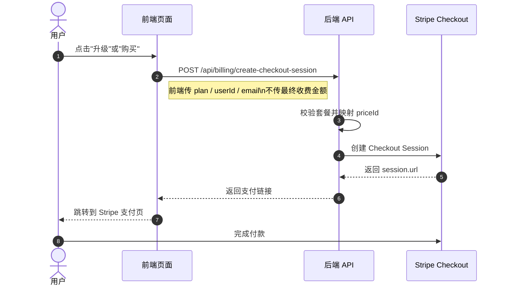
```mermaid
sequenceDiagram
  autonumber
  actor User as 用户
  participant Frontend as 前端页面
  participant Backend as 后端 API
  participant Stripe as Stripe Checkout

  User->>Frontend: 点击"升级"或"购买"
  Frontend->>Backend: POST /api/billing/create-checkout-session
  Note right of Frontend: 前端传 plan / userId / email\n不传最终收费金额
  Backend->>Backend: 校验套餐并映射 priceId
  Backend->>Stripe: 创建 Checkout Session
  Stripe-->>Backend: 返回 session.url
  Backend-->>Frontend: 返回支付链接
  Frontend-->>User: 跳转到 Stripe 支付页
  User->>Stripe: 完成付款
```

注意那条备注：**前端只传 `plan`、`userId`、`email`，不传金额**。金额由后端根据 `plan` 查到对应的 `price_id` 决定——这就是第一条铁律落到代码里的样子。

---

## 4. 快速开始：把 Stripe 接进项目

小哲想最快把支付接进项目。他没有一上来就让 Agent"把支付加上"，而是按 Stripe 的实际流程拆成 5 步，每步都先想清楚再交给 Agent。照着下面这 5 步做就够了。

### 4.1 第一步：在 Stripe 后台创建商品和价格

这一步的目的，不是"先随便配点东西"，而是先把 **你到底在卖什么、打算怎么收费** 这件事在 Stripe 里定义清楚。

在 Stripe 的模型里：

- **Product** 表示"你卖的是什么"，比如 `Pro 会员`。
- **Price** 表示"这个东西卖多少钱、按什么周期卖"，比如 `月付 9.9 美元`、`年付 99 美元`。

为什么要先做这一步？因为后面当你的后端创建 Checkout Session 时，并不是直接传一个金额给 Stripe，而是要传一个已经存在的 `price_id`。Stripe 再根据这个 `price_id` 去生成真正的支付页、金额、币种和订阅周期。如果你跳过这一步，后面的"创建支付链接"其实就没法做。

::: info 为什么这里要先停一下
很多新手看到 `Product`、`Price` 这两个词会有点烦，觉得像是在学 Stripe 的内部术语。

但实际上，这一步是在做一件很朴素的事：
- 把"卖什么"定义清楚
- 把"卖多少钱"定义清楚
- 让后端之后能拿一个稳定的 `price_id` 去创建支付链接

只要把这层想明白，后面的 Checkout Session 就不会觉得抽象。
:::

对于一个最小可行的订阅系统，你至少先建这两个层级：

- 一个 `Product`
- 一个或多个 `Price`

你可以直接打开这些页面：

- Stripe Dashboard 登录页：[Dashboard Login](https://dashboard.stripe.com/login)
- Stripe 商品与价格管理文档：[Manage products and prices](https://docs.stripe.com/products-prices/manage-prices)
- Stripe Checkout 快速开始文档：[Build a Stripe-hosted checkout page](https://docs.stripe.com/checkout/quickstart?lang=node)
- Stripe Dashboard 商品页：[Product catalog](https://dashboard.stripe.com/test/products)

推荐你先在 **Test mode（测试模式）** 下操作，不要一开始就在正式环境里建。

小哲建的最小配置是：

- `Product`: `Pro Plan`
- `Price 1`: `pro_monthly`（月付）
- `Price 2`: `pro_yearly`（年付）

你在后台操作时，可以按这个顺序理解：

1. 先创建一个商品 `Pro Plan`。
2. 再在这个商品下面挂两个价格。
3. 月付和年付其实是同一个商品的两种收费方式。

完成后，你至少要记下这些信息：

- 月付价格的 `price_id`
- 年付价格的 `price_id`
- 你自己的套餐名，例如 `pro_monthly`、`pro_yearly`

::: info 真正要记下来的值
这一页里最重要的不是商品名称，而是 `price_id`。

后面无论是让 AI 帮你接后端，还是你自己排查问题，真正会频繁用到的，通常都是：
- `STRIPE_PRICE_PRO_MONTHLY`
- `STRIPE_PRICE_PRO_YEARLY`
- 它们背后对应的两个 `price_id`
:::

如果你想让 AI 先带你把后台配置做完，可以直接用这个 prompt（小哲就是让 Agent 当向导，先别碰代码，只带他把后台配好）：

```text
我现在是第一次用 Stripe，你先不要改代码，先带我在 Stripe 后台把最基本的付费配置做好。

请基于这些官方文档给我一步一步的操作说明：
- https://docs.stripe.com/products-prices/manage-prices
- https://docs.stripe.com/checkout/quickstart?lang=node

我的情况是：
- 我想做一个最简单的会员付费
- 只有两个套餐：月付和年付
- 我现在还不懂 Product、Price 这些词

请你：
1. 先用最简单的话告诉我 Product 和 Price 分别是什么。
2. 再按"先打开哪个页面 -> 点哪里 -> 填什么"的顺序教我操作。
3. 最后提醒我，做完以后我需要从后台复制哪些内容给后端使用。
4. 如果我容易走错，请顺便提醒我应该一直在测试模式里操作。
```

### 4.2 第二步：准备环境变量

你通常至少需要准备这些环境变量。这一步很关键——这些值待会儿部署到 Zeabur 时还要再用一次：

| 环境变量 | 作用 |
|---|---|
| `STRIPE_SECRET_KEY` | 后端调用 Stripe 的密钥，绝不能进前端 |
| `STRIPE_WEBHOOK_SECRET` | 校验 Webhook 签名，确认事件真来自 Stripe |
| `STRIPE_PRICE_PRO_MONTHLY` | 月付套餐的 `price_id` |
| `STRIPE_PRICE_PRO_YEARLY` | 年付套餐的 `price_id` |
| `APP_URL` | 支付完成后跳回的地址（本地是 localhost，上线后要换成公网地址）|
| `SUPABASE_URL` | 你的 Supabase 项目地址 |
| `SUPABASE_SERVICE_ROLE_KEY` | 后端写订单、更新会员状态用的服务端密钥 |

你可以直接打开这些页面：

- Stripe API Keys 文档：[API keys](https://docs.stripe.com/keys)
- Stripe Dashboard API Keys 页面：[API Keys](https://dashboard.stripe.com/test/apikeys)
- Stripe Webhooks 文档：[Receive Stripe events in your webhook endpoint](https://docs.stripe.com/webhooks)
- Stripe Dashboard Webhooks 页面：[Workbench Webhooks](https://dashboard.stripe.com/test/workbench/webhooks)

::: warning 密钥只放后端
`STRIPE_SECRET_KEY` 和 `SUPABASE_SERVICE_ROLE_KEY` 都只能放在后端。它们一旦进了前端代码，等于把保险柜钥匙贴在玻璃门上。
:::

::: info 环境变量这一步的目的
这一步不是为了"先把 `.env` 填满"，而是为了把支付系统里最敏感的几样东西放到后端保管：

- Stripe 的后端密钥
- Webhook 验签密钥
- 你自己的价格映射

简单理解：前端只负责发起购买，真正的秘密和定价逻辑都应该留在服务端。
:::

这一步也可以直接让 AI 帮你整理：

```text
请你先看看我这个项目现在是怎么放环境变量的，然后帮我把 Stripe 需要的环境变量整理出来。

请参考这些文档：
- https://docs.stripe.com/keys
- https://docs.stripe.com/webhooks

我的情况是：
- 我是零基础
- 我分不清哪些变量应该放前端，哪些应该放后端
- 我也不确定当前项目应该改 `.env`、`.env.local` 还是别的文件

请你：
1. 先搜索当前项目里环境变量通常写在哪。
2. 帮我列出 Stripe 接入最少需要哪些变量。
3. 用最简单的话告诉我每个变量是干什么的。
4. 告诉我每个变量应该去哪一个 Stripe 页面复制。
5. 如果项目里有示例环境变量文件，请直接帮我补上变量名。
```

### 4.3 第三步：后端创建 Checkout Session

这是"前端负责跳转、后端负责定价"的落地点。前端只传"用户要买哪个套餐"，后端自己把套餐映射成 `price_id`，再去 Stripe 创建会话。这一步你不用自己写接口，直接让 AI 参考官方文档帮你实现。

先把这些文档给它：

- Stripe Checkout 快速开始：[Build a Stripe-hosted checkout page](https://docs.stripe.com/checkout/quickstart?lang=node)
- Checkout Sessions API：[Create a Checkout Session](https://docs.stripe.com/api/checkout/sessions/create)
- 订阅说明：[Subscriptions](https://docs.stripe.com/payments/subscriptions)

然后直接贴这个 prompt：

```text
请你先看看我当前项目的后端代码是怎么组织的，然后帮我把 Stripe 支付接进去。

请参考这些官方文档：
- https://docs.stripe.com/checkout/quickstart?lang=node
- https://docs.stripe.com/api/checkout/sessions/create
- https://docs.stripe.com/payments/subscriptions

我的目标很简单：
- 用户点购买按钮后，能跳到 Stripe 的付款页面
- 套餐只有月付和年付两种
- 不要让我自己决定代码该放在哪，你先看项目再帮我放到合适的位置

请你：
1. 先搜索项目，弄清楚后端入口文件、路由文件、环境变量写法分别在哪里。
2. 再参考官方文档，帮我把"创建 Stripe 支付链接"这一步接进去。
3. 不要让我自己传金额，价格请用后端环境变量来决定。
4. 做完后告诉我你改了哪些文件。
5. 最后告诉我，我还需要去 Stripe 后台补哪些配置。
```

### 4.4 第四步：前端跳转到支付页

这一步的目标非常简单：让定价页按钮调用你的后端接口，再跳转到 Stripe Checkout。

参考文档：

- Stripe Checkout 集成说明：[Build an integration with Checkout](https://docs.stripe.com/payments/checkout/build-integration)

给 AI 的 prompt：

```text
帮我把项目里的"购买"按钮接上 Stripe。

要求：
- 不动现有页面，只改按钮点击后的逻辑
- 点击后调用后端接口获取支付链接，然后跳转到 Stripe
- 如果出错，给用户一个简单提示（比如"支付暂时不可用，请稍后再试"）

参考文档：https://docs.stripe.com/payments/checkout/build-integration
```

### 4.5 第五步：Webhook 更新数据库状态

这是最关键的一步。付款成功后，Stripe 会向后端的 Webhook 地址发一个事件。后端要做三件事：校验签名（确认事件真来自 Stripe）、解析出是哪个用户买了哪个套餐、把会员状态写进数据库。

::: info 为什么这一步最关键
很多人会以为"用户付完款并且跳转到了 success 页面"就算完成了。

不是。

对你的系统来说，真正重要的是：**Stripe 有没有正式把事件打到你的 Webhook，而你的后端有没有把数据库状态更新成功。**
:::

小哲特意问 Agent：能不能在 success 页面直接开通会员？Agent 的回答让他记住了第二条铁律——**不能**。用户完全可能不跳转 success 页（比如付完直接关掉标签页），也可能伪造一个 success 页面的访问。只有 Webhook 是 Stripe 主动、可校验地告诉你"钱真到账了"。

你也可以让 AI 按 Stripe 官方 Webhook 文档直接实现，不要自己手写。

参考文档：

- Stripe Webhooks：[Receive Stripe events in your webhook endpoint](https://docs.stripe.com/webhooks)
- Stripe CLI：[Stripe CLI](https://docs.stripe.com/stripe-cli)
- Stripe CLI 用法：[Use the Stripe CLI](https://docs.stripe.com/stripe-cli/use-cli)

给 AI 的 prompt：

```text
请继续帮我把 Stripe 的"付款成功后自动生效"这一步接好。

请参考这些官方文档：
- https://docs.stripe.com/webhooks
- https://docs.stripe.com/stripe-cli
- https://docs.stripe.com/stripe-cli/use-cli

我的目标是：
- 用户付完钱后，不只是跳转到成功页面
- 而是真的把我数据库里的会员状态改成已开通

请你：
1. 先搜索当前项目里数据库相关代码和用户状态是怎么存的。
2. 再帮我加 Stripe webhook。
3. 支付成功后，把对应用户改成 active，或者更新成项目里现在已经在用的会员状态字段。
4. 如果项目里已经有订阅表、订单表、用户表，请优先沿用现有结构。
5. 做完后告诉我你改了哪些文件。
6. 顺便告诉我本地怎么测试这一步有没有真的生效。
```

::: warning Webhook 验签需要原始请求体
有一个新手极易踩的坑：如果你的后端用了 `express.json()` 这类中间件，它会在 Webhook 路由之前就把请求体解析成 JSON。但 Stripe 验签需要的是**原始请求体（raw body）**，被提前解析过签名就对不上了。解决办法是给 Webhook 路由单独用 `express.raw({ type: 'application/json' })`，让它拿到原始字节流。
:::

---

## 5. 让 AI 一把接入 + 本地联调

### 5.1 一次性把支付接进项目的提示词

如果你用的是 Codex、Claude Code、Trae、Cursor 一类工具，可以直接把下面这个提示词贴给它，让它在你的项目里一次把支付接入做完：

```text
请你帮我把当前项目接上 Stripe 支付，我希望做一个最简单能跑起来的会员收费功能。

我的要求：
1. 我是零基础，请你先自己看项目，再决定代码应该改哪里。
2. 不要让我自己判断目录结构、路由结构、数据库结构。
3. 我只想先做最简单版本：月付和年付两个套餐。
4. 用户点击购买后，能跳到 Stripe 付款页面。
5. 付款成功后，我数据库里的会员状态能变成已开通。
6. 不要一开始加太多复杂功能，比如优惠券、升级降级、复杂发票。

输出要求：
1. 先给我一个改动计划。
2. 然后直接修改代码。
3. 最后告诉我怎么一步一步本地测试。
4. 如果有哪个步骤还需要我去 Stripe 后台操作，请直接把链接和要点告诉我。
```

如果你希望 AI 更贴近你的项目，还可以在开头补上：

- 你的前端框架
- 你的后端目录结构
- 你的数据库表名
- 你现在的用户系统是 Supabase Auth 还是自建 Auth

### 5.2 本地联调也尽量交给 AI

如果你希望连本地联调都让 AI 帮你串起来，可以直接用下面这段：

```text
请继续帮我把 Stripe 支付真正跑通，我想一步一步照着做，不想自己猜。

请参考官方文档：
- https://docs.stripe.com/webhooks
- https://docs.stripe.com/stripe-cli
- https://docs.stripe.com/stripe-cli/use-cli

我的目标：
1. 告诉我先打开哪些 Stripe 页面。
2. 告诉我如何拿到 STRIPE_WEBHOOK_SECRET。
3. 告诉我如何使用 stripe login 和 stripe listen。
4. 告诉我怎样验证 checkout.session.completed 已经成功打到本地 webhook。
5. 如果当前项目需要先启动前端和后端，也请顺带告诉我具体命令。
6. 不要只讲原理，请按实际操作步骤输出。
7. 如果我某一步做错了，也请告诉我最常见的报错会长什么样。
```

::: tip 本地怎么测 Webhook
Stripe 提供了 CLI，可以把线上事件转发到本地的 `localhost`，让你在部署前就把整条链路跑通。核心就两条命令：`stripe login` 登录，`stripe listen --forward-to localhost:你的端口/api/webhook` 把事件转发到本地。先在本地用测试卡号（Stripe 文档里有）走一遍支付，确认 `checkout.session.completed` 事件真的打到了本地、数据库里的会员状态真的变了，再考虑上线。
:::

到这里，小哲的应用在本地已经能完整跑通一次支付了。但它还活在 `localhost` 里——接下来要让它上线。在那之前，先把最容易踩的几个坑钉死。

---

## 6. 最容易踩坑的 4 件事

小哲把 Agent 提醒过、文档里反复强调的坑列成一张表，贴在显示器边上：

1. **把 `success` 页面当成支付成功**：真正决定状态的是 Webhook，不是前端跳转。
2. **让前端传金额**：这会带来严重的价格篡改风险。
3. **Webhook 路由被 `express.json()` 提前处理**：Stripe 验签需要原始请求体。
4. **没有做幂等处理**：Webhook 可能重试，如果你每次都重复加会员或积分，就会出事故。

下面这一节，专门把第 1 个坑讲透——它是新手最容易掉进去的。

### 6.1 为什么 success 页面不等于支付成功

很多人以为"用户付完钱，跳到了 success 页面"就算支付成功了。这是最容易踩的坑。

先讲一个真实场景。假设你做了一个会员网站：

1. 用户点击"购买会员"
2. 跳转到 Stripe 付款页面
3. 用户输入信用卡，点击付款
4. 页面跳转到你的 `success.html`
5. 你在 success 页面写代码："既然到了这页，就给用户开通会员"

**问题在哪？** 用户可能根本没付钱，或者付到一半关页面了，也能直接访问 `success.html`。

这里其实有两条完全不同的路径：

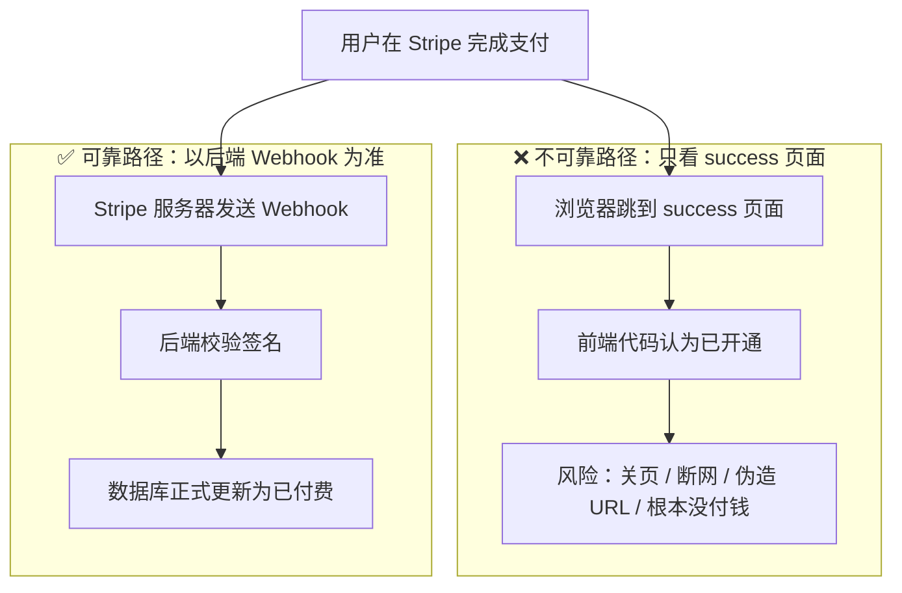
```mermaid
flowchart TB
  pay["用户在 Stripe 完成支付"]

  subgraph unreliable["❌ 不可靠路径：只看 success 页面"]
    success["浏览器跳到 success 页面"]
    fake["前端代码认为已开通"]
    risk["风险：关页 / 断网 / 伪造 URL / 根本没付钱"]
    success --> fake --> risk
  end

  subgraph reliable["✅ 可靠路径：以后端 Webhook 为准"]
    event["Stripe 服务器发送 Webhook"]
    verify["后端校验签名"]
    active["数据库正式更新为已付费"]
    event --> verify --> active
  end

  pay --> success
  pay --> event
```

**关键区别：**

| | success 页面跳转 | Webhook 通知 |
| :--- | :--- | :--- |
| 谁发起的 | 用户的浏览器 | Stripe 的服务器 |
| 能伪造吗 | 能，直接访问 URL 就行 | 不能，有签名验证 |
| 一定代表付款成功吗 | 不一定 | 一定 |
| 你的系统怎么知道 | 前端代码猜的 | Stripe 正式通知的 |

完整流程应该是这样的：

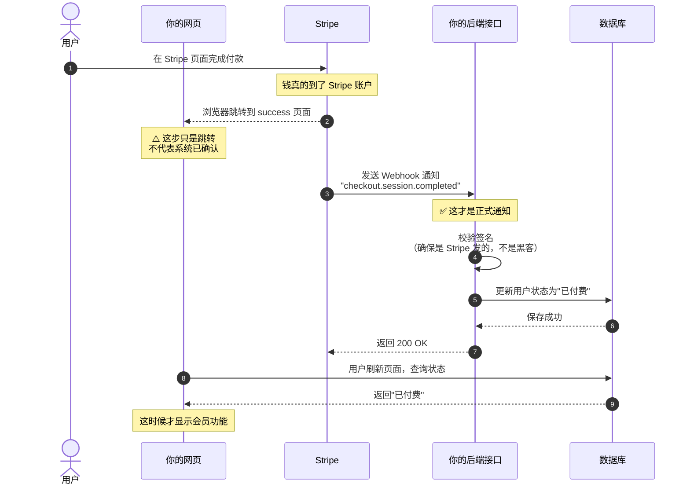
```mermaid
sequenceDiagram
  autonumber
  actor User as 用户
  participant Frontend as 你的网页
  participant Stripe as Stripe
  participant Webhook as 你的后端接口
  participant DB as 数据库

  User->>Stripe: 在 Stripe 页面完成付款
  Note over Stripe: 钱真的到了 Stripe 账户

  Stripe-->>Frontend: 浏览器跳转到 success 页面
  Note over Frontend: ⚠️ 这步只是跳转<br/>不代表系统已确认

  Stripe->>Webhook: 发送 Webhook 通知<br/>"checkout.session.completed"
  Note over Webhook: ✅ 这才是正式通知

  Webhook->>Webhook: 校验签名<br/>（确保是 Stripe 发的，不是黑客）

  Webhook->>DB: 更新用户状态为"已付费"
  DB-->>Webhook: 保存成功
  Webhook-->>Stripe: 返回 200 OK

  Frontend->>DB: 用户刷新页面，查询状态
  DB-->>Frontend: 返回"已付费"
  Note over Frontend: 这时候才显示会员功能
```

### 6.2 每个环节的卡点

**第 1 步：用户在 Stripe 付款。** 这是唯一确定"钱真的付了"的时刻：用户输入信用卡信息点击确认，银行从卡里扣款，Stripe 确认收到这笔钱。

**第 2 步：浏览器跳转到 success 页面（问题最大）。** 这一步完全不可靠，因为：

- 用户可以直接在浏览器输入 `yoursite.com/success`，根本没付钱也能访问。
- 用户付到一半关页面了，但之前复制了 success 链接，之后直接打开。
- 网络问题导致跳转失败，但钱已经扣了（用户付了钱却没看到成功页面）。
- 用户点返回键，又付了一次钱，但两次都跳转到同一个 success 页面。

**第 3 步：Stripe 发送 Webhook。** 这是 Stripe 主动通知你的服务器"这笔款到账了"：只有 Stripe 的服务器能发起这个请求；请求里带有签名，你的后端可以验证是不是真的 Stripe 发的；即使 success 页面没打开、用户断网了，Webhook 也会发送。

**第 4 步：后端校验签名。** 为什么要校验？防止黑客伪造通知。假设没有校验，黑客可以直接给你的服务器发一个假通知："用户 A 付了 1000 元"，你的系统就会给黑客开通会员。校验的过程是：Stripe 用你们约定的密钥对通知内容生成签名，你的后端用同样的密钥验证签名是否匹配——匹配 = 100% 是 Stripe 发的，不匹配 = 直接拒绝。

**第 5 步：更新数据库。** 只有校验通过后，才更新数据库：把用户状态从"待付款"改成"已付费"，记录订单号、金额、付款时间，开通对应的会员权限。

**第 6 步：前端查询状态。** success 页面不要自己判断"到了这页就是成功了"。正确做法是：页面加载时向后端发请求"这个用户付费了吗？"，后端查数据库返回真实状态，再根据返回结果显示"开通成功"或"等待确认"。

### 6.3 一个常见的错误做法 vs 正确做法

```javascript
// 错误：在 success 页面直接开通
// success.html
if (window.location.pathname === '/success') {
  // 危险！任何人都能访问 /success
  activateMembership();
}
```

```javascript
// 正确：每次刷新都查后端
// success.html
async function checkStatus() {
  const response = await fetch('/api/user/status');
  const data = await response.json();

  if (data.paymentStatus === 'paid') {
    showMemberFeatures();
  } else {
    showPendingMessage();
  }
}
```

::: tip 总结一句话
**success 页面只是"浏览器跳转成功"，Webhook 才是"Stripe 正式确认收款"。** 你的系统必须以 Webhook 为准，不能相信前端的跳转。
:::

到这里，小哲的应用在本地已经能完整、可靠地跑通一次支付了。是时候把它搬上公网了。

---

# 第二部分：部署——让产品能上线

## 7. "部署"到底在做什么

小哲先搞清楚一件事：为什么本地能跑的应用，别人就是打不开？

任何一个网站想要被外部用户访问，都必须有一个可以公开访问的网络地址（可以是 IP 地址，比如 `123.45.67.89`，也可以是域名，比如 `google.com`）。但只有地址是不够的——你写好的网页代码（HTML、CSS、JavaScript，或者 React、Vue 写的项目），以及图片 / 视频资源，都必须"放"在一台 24 小时在线的服务器上，由它来响应网络请求，这样任何人的浏览器才能访问并下载这些资源。

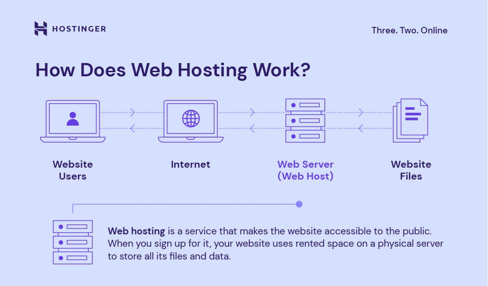

图片来源：https://www.hostinger.com/tutorials/what-is-cloud-hosting

把资源上传、配置好环境并让服务"跑起来"的整个过程，就被称为 **部署（Deployment）**。

简单来说：你在自己电脑上写好的网页，只要在本机启动程序，就只能通过本地地址（`localhost`）在自己的浏览器里访问，因为这些代码只存在于你的硬盘上。"部署"就是把你的代码和资源转移到一台连接着公网的专业服务器上，并做好配置，让这台服务器知道"别人访问时我要怎么响应"——当有人在浏览器中输入你的域名时，服务器会立刻找到对应的网页文件，把内容传回给对方的设备，从而让用户看到你的页面。

### 7.1 如果纯手动部署，要踩多少坑

如果手动部署，一个项目往往需要好几个步骤，每一步都可能踩坑。常见关键步骤包括：

1. **服务器准备**：你需要先购买云服务器（比如阿里云、腾讯云、或 AWS EC2），选择服务器所在地区（如上海、新加坡）、配置（CPU、内存、磁盘大小等），还要学会如何远程连接服务器（例如通过 SSH 工具登录）。

   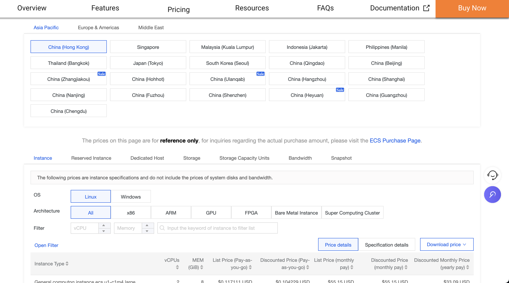

2. **环境配置**：Web 应用需要在特定"环境"中才能运行——例如运行 Node.js 项目必须先安装 Node.js；运行 Python 项目必须安装 Python 以及对应的第三方库。如果环境版本不匹配，程序就可能报错、无法启动。
3. **上传资源**：你需要把本地的代码和资源上传到服务器上，常用的方法包括 FTP 或 Git。如果项目体积比较大（比如包含视频文件），中途一旦断线，有时需要重新上传。

   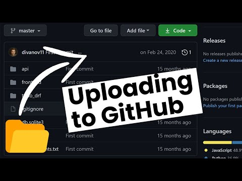

4. **启动服务并测试**：上传完成后，你还需要在服务器上执行命令启动应用，并测试"分配的网络地址是否能访问"。如果访问不了，有可能是服务器防火墙没有放行对应端口（比如你的应用监听 3000 端口，但该端口被防火墙拦截），也可能是程序本身有 Bug，这时就需要查看服务器日志进行排查。

   > 💡 可以把端口理解为区分同一台设备上不同应用的"房间号"，而 IP 则是这台设备的"门牌号"。IP 和端口合在一起（IP:port），就可以精确定位到某一个网络服务。

5. **维护与更新**：后续每次你修改代码，都要重新上传并重启服务。如果服务器宕机（例如断电、网络故障），还需要手动重启应用，有时还要额外配置"进程守护工具"，让程序在异常退出后自动拉起。

像 CloudBase、Vercel、Zeabur 这样的"低代码部署平台"，就是为了解决上述复杂问题而诞生的。它们会帮你自动完成"买服务器、配环境、上传代码、启动服务、监控运行"等步骤。你只需要把自己的代码仓库（比如 GitHub 或 GitLab）连接到平台，或者直接上传代码，它就会自动拉取代码、识别应用类型、配置对应的运行时环境，最后给你一个可以被任何人访问的公网地址。它甚至可以一键绑定你自己的域名。


::: info 小哲为什么不自己买服务器
对一个刚要上线第一个产品的学生来说，手动运维那一长串步骤每一步都能卡上半天。低代码平台把"买服务器、配环境、上传、起进程、监控"全包了，他只要管好两件自己该管的事：**代码本身**和**环境变量**。把基础设施交给平台，把判断力留给自己，这正是 vibe coding 的思路。
:::

---

## 8. 部署平台对比

接下来要选平台。小哲对比了几个主流选项：

| 平台 | 特点 | 适用场景 | 免费额度 |
|------|------|----------|----------|
| **腾讯云 CloudBase** | 国内访问速度快，与微信生态深度整合 | 国内用户为主、需要微信小程序支持的项目 | 有免费额度 |
| **Vercel** | 前端框架支持好，与 GitHub 集成紧密 | React/Vue/Next.js 等现代前端项目 | 有免费额度 |
| **Netlify** | 功能全面，支持表单处理和身份验证，与 Git 集成好 | 需要表单处理、身份验证等高级功能的静态网站 | 有免费额度 |
| **Zeabur** | 支持多种语言和服务模板，配置灵活 | 需要部署多种服务（如 Dify、n8n）的复杂项目 | 每月约 5 美元免费额度 |

小哲的项目是全栈的——前端、后端、数据库可能要一起部署，甚至以后还想接 Dify、n8n 这类服务。**Zeabur 在"部署多个相互关联的服务"上更灵活**，所以他选了 Zeabur 当主力。其他三个平台（CloudBase / Vercel / Netlify）的用法，他也顺手记了下来，放在本周进阶部分备查。

::: tip 选型不必纠结
- 主要面向国内用户 → 优先 **CloudBase**
- 纯前端项目（React / Vue / Next.js）→ **Vercel** 或 **Netlify**
- 需要表单处理、身份验证等开箱功能 → **Netlify**
- 全栈、要部署多种服务（Dify、n8n、数据库）→ **Zeabur**

无论选哪个，部署的核心流程都相似：准备代码 → 选择平台 → 配置构建设置 → 部署上线。
:::

---

## 9. 用 Zeabur 部署：先认识控制台

在之前的课程里我们已经简单接触过 Dify。小哲先拿 Dify 当例子熟悉 Zeabur 的操作，再把自己的全栈应用搬上去。首先打开 [Zeabur 控制台页面](https://zeabur.com/projects)，先看一下上面的各个区域。


在这个页面上，你首先能看到许多方块，这些就是已经启动的服务。在顶部菜单中，你会看到 Agent、Servers、Docs、Templates 等几个选项，它们分别代表：

1. **Agent**：可以打开 Zeabur 内置的智能助手（Agent），向它提问如何操作，或者查询当前服务器的状态。
2. **Servers**：在这里可以添加你自己购买的云服务器，或者直接通过 Zeabur 购买服务器。
3. **Docs**：查看 Zeabur 的完整文档说明。
4. **Templates**：这里列出了所有内置的模板镜像。

> 这里提到的"镜像（Image）"，可以理解为"包含代码和运行环境的压缩包"。当某个服务在一台服务器上成功跑起来之后，我们可以选择把"这套运行环境 + 代码"打包成镜像。之后，在任何新服务器上，只要把这个压缩包解压并运行，就不需要重新配置环境和代码，服务就能直接跑起来。

在页面右上角，你还能看到自己的余额。默认情况下，每个月会有 5 美元左右的免费额度。关于细节计费规则暂时可以不用太在意，只需要知道：只要服务器在运行，就会消耗额度。

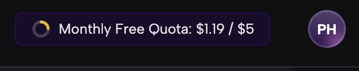

点击余额可以查看每日的消耗明细。

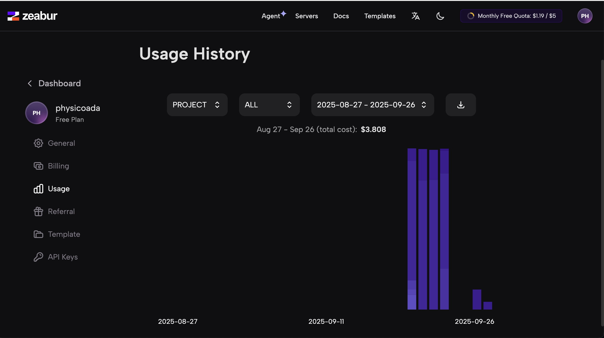

### 9.1 New Project：七种创建方式

现在我们来创建服务。首先，在 [控制台首页](https://zeabur.com/projects) 点击 "New Project"。


接下来是各个创建方式的解释：

1. **GitHub**
   可以连接到你的 GitHub 账号。绑定之后，就可以直接从 GitHub 仓库里选择项目部署（GitHub 是目前全球最大的代码托管平台）。**推荐用这种，以后每次推代码会自动重新部署。**
2. **Template（模板）**
   可以基于模板来部署服务。Zeabur 内置了很多预设项目模板（例如 Dify、n8n 等），你可以基于这些模板快速创建并部署应用。

   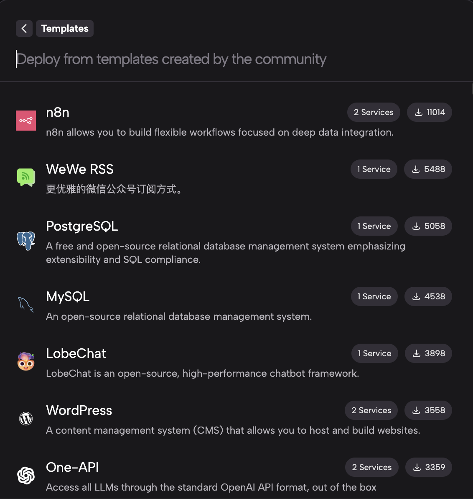

3. **Databases（数据库）**
   用于部署数据库服务，比如 MySQL、MongoDB 等常见数据库。

   

4. **Functions（函数）**
   可以部署函数服务，你可以编写 JavaScript 或 Python 代码，让它们以函数的形式被调用。

   

   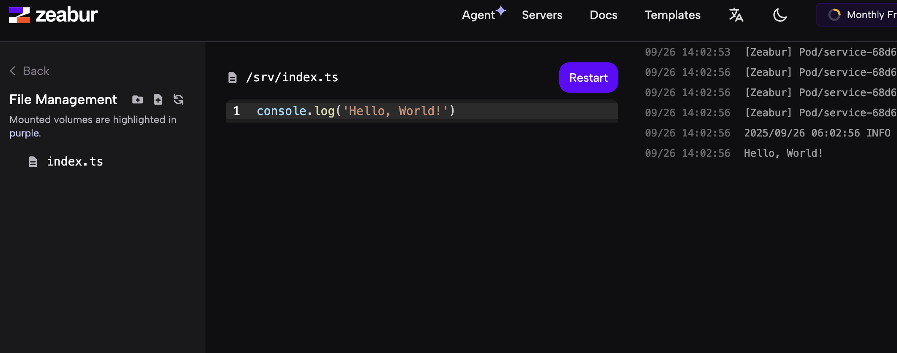

5. **Local Project（本地项目）**
   上传一个本地文件夹，Zeabur 会自动识别其中的启动脚本。这适合将你已经在本地开发好的项目快速部署到 Zeabur 上。

   

6. **Docker Image**
   部署已经打包好的 Docker 镜像。如果你的项目已经被打成了 Docker 镜像（例如存放在 Docker Hub 或其他镜像仓库中），可以在这里直接部署。

   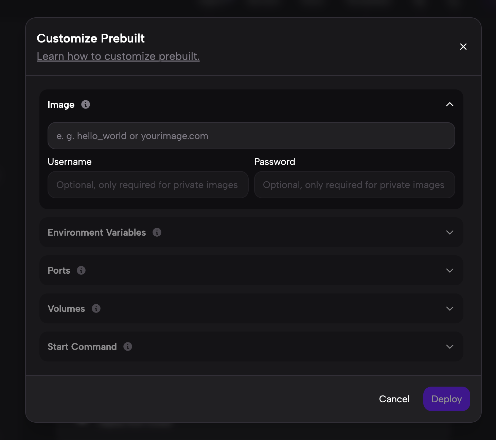

7. **Cursor**
   如果你安装了 Cursor（例如 Cursor IDE），可以通过这个入口将 Cursor 中的项目直接部署到 Zeabur。

### 9.2 用模板一键起一个 Dify 服务

如果你想部署自己的 Dify 服务，推荐选择 **Template** 方式，然后在搜索框中输入 "dify"。可以看到很多由不同作者维护的版本，你可以任选其一（比如 v1.6.0 版本）。

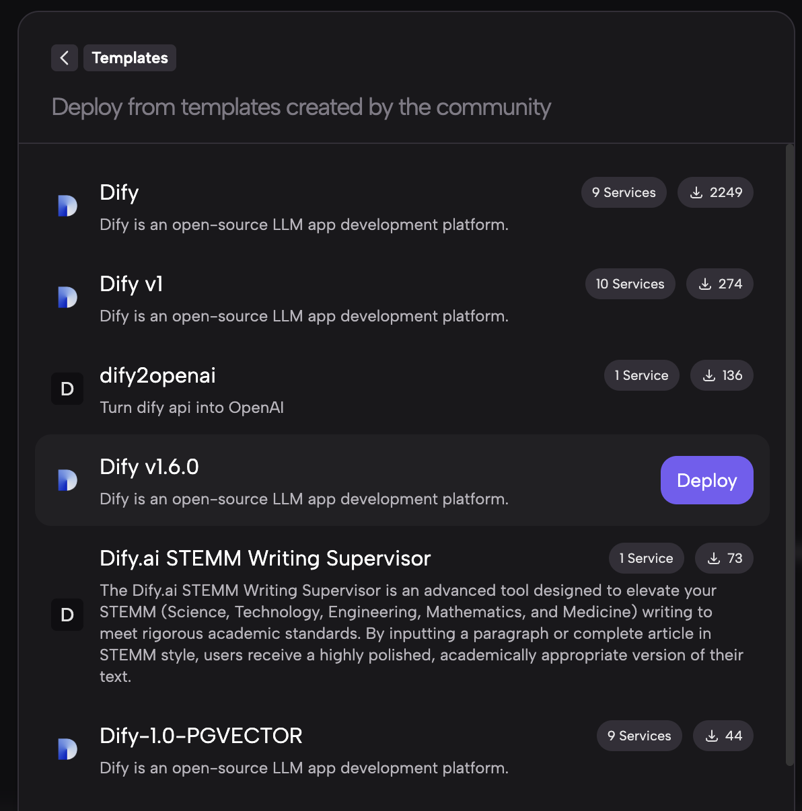

接着，输入任意一个名称，Zeabur 会基于这个名称生成一个临时的自定义域名。之后所有人都可以通过这个网址访问你的服务。

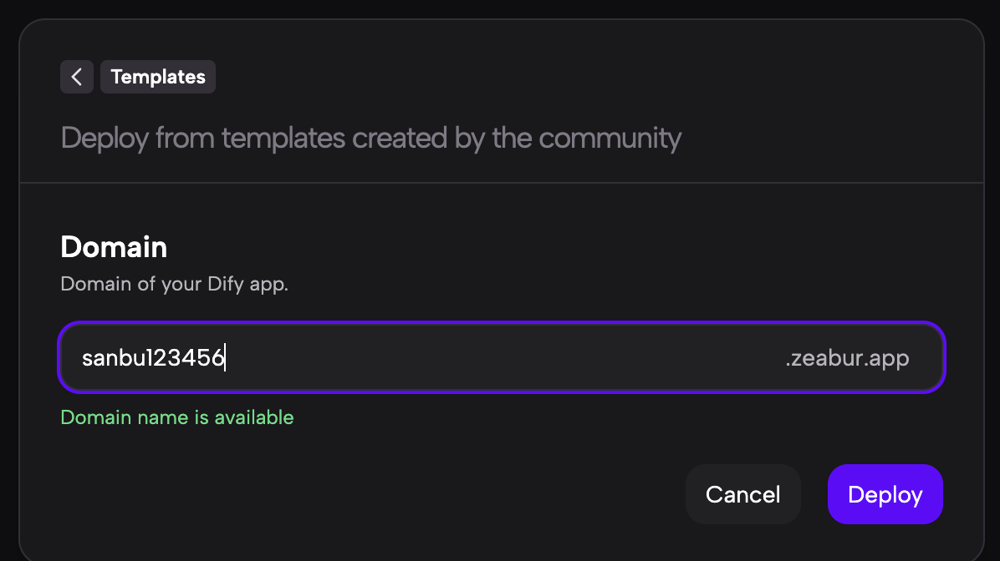

创建完成后，你会看到多个程序（服务）依次启动。需要耐心等待所有服务都进入"已启动"状态。（Dify 服务是由多个程序组成的，每个程序负责不同的功能，它们之间会相互协作。）

一般来说，你只需要点击左侧的 Dify 应用，就可以看到默认的访问入口地址。但在本例中，由于前面还套了一层 nginx，你需要点击 nginx 服务来获取最终访问地址。可以理解为：nginx 就是负责对外统一"收发请求"的主程序，它会把外部访问的地址分发给内部各个服务。点击左侧的 Nginx，在详情页中可以看到当前的服务地址，然后在浏览器里打开这个地址，等待服务完全启动。


稍等片刻后，你就能看到 Dify 的登录界面了。输入邮箱地址和注册密码，就可以开始使用你自己的 Dify 服务了。

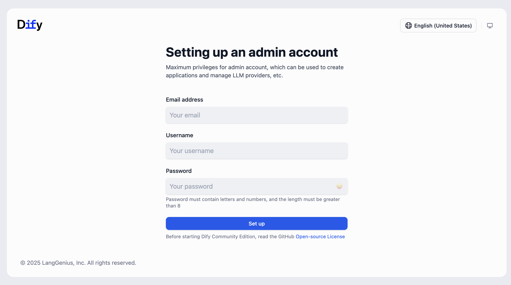

如果你有兴趣，还可以顺便启动一个 n8n 服务。n8n 也是海外非常流行的一款 AI 工作流平台。

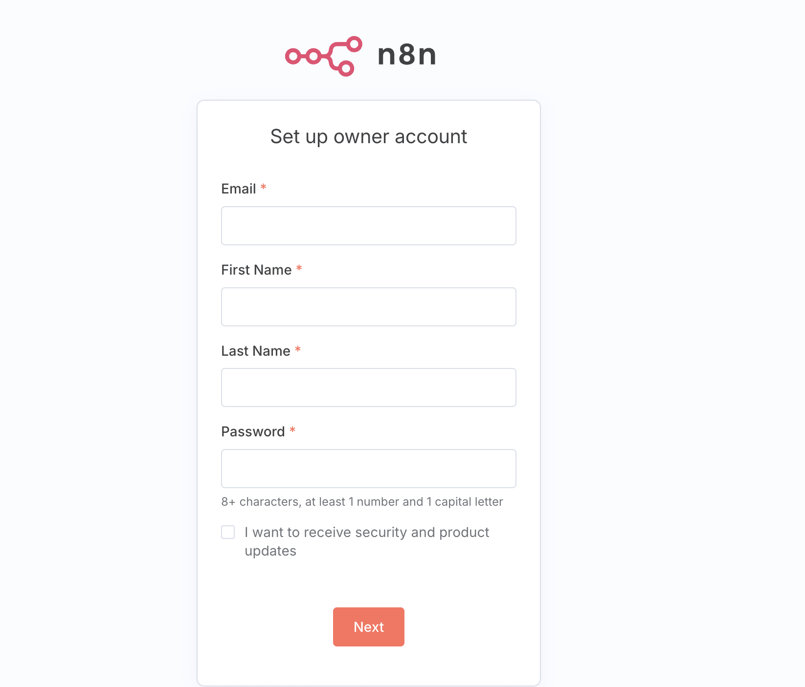

::: tip 模板部署的意义
Dify 由多个服务组成，手动搭一套要配数据库、向量库、Redis、nginx……一堆东西。模板把这套"多服务组合"一键拉起来，正好展示了 Zeabur 最擅长的事：**部署多个相互关联的服务**。这也是小哲选它做全栈部署主力的原因——下周学 Dify 知识库时，你就能用上自己这套 Dify 服务。
:::

---

## 10. 部署自己的应用：从 HTML 到 React

熟悉了控制台，小哲开始练习部署自己写的 Web 应用。我们先用 Trae 生成一个贪吃蛇小游戏，再把它部署到 Zeabur，并配置一个可公开访问的链接，让任何人都能打开。第一步，是在本地用 Trae 创建一个贪吃蛇项目。

### 10.1 用 HTML 框架实现并部署


对于 Trae 来说，生成一个基于 HTML 的贪吃蛇网页游戏非常简单。游戏生成完成后，你只需要按照前面介绍的 Zeabur 本地部署方式（New Project → Local Project），把包含所有文件的文件夹上传上去即可。

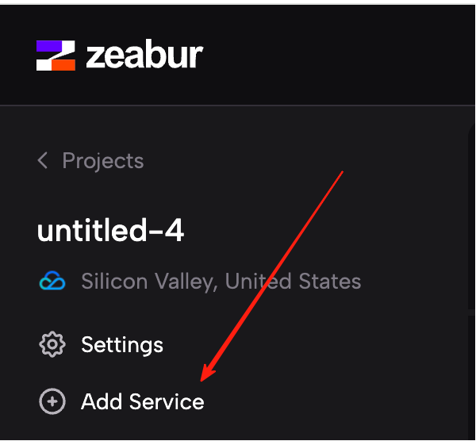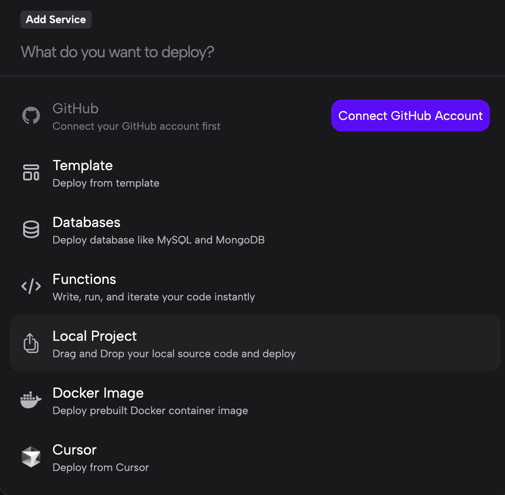

完成后，你就会进入该服务的详情界面：

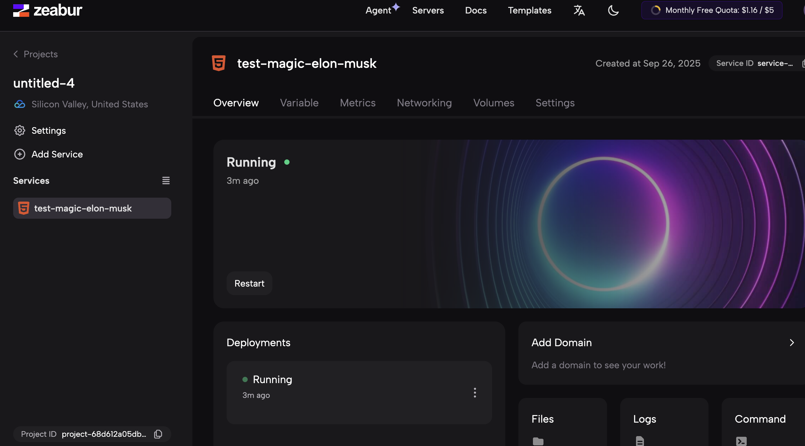

点击左侧的 "Network" 选项，在页面中找到 "Public Address" 区域。点击 "Generate Domain"，即可生成一个对外访问地址，你可以输入任意喜欢的名称。


生成完成后，只要在浏览器中打开这个地址，就可以运行你自己的贪吃蛇游戏了。其它 HTML 类型的 Web 应用也可以用完全相同的方式来部署。


### 10.2 用 React 框架实现并部署

前面学了如何部署基于 HTML 的 Web 应用。接下来再尝试部署一个目前更常用的前端框架：React 应用。相比纯 HTML，React 是一种更成熟、现代的前端开发框架，它通过组件化的方式组织页面结构，能够显著加快复杂页面的开发，是企业级项目中非常主流的选择。

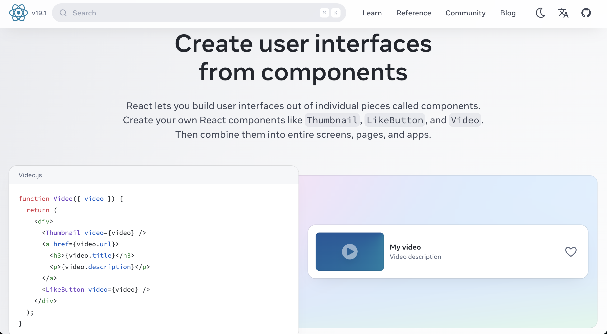

**重构为 React 架构。** 在 Trae 中，你只需要向 Agent 说明："帮我把这份代码重构成 React 架构"，就可以比较轻松地把原本基于 HTML 的结构重构成 React 项目。


不过，相比简单的 HTML 文件，React 应用依赖更复杂的构建工具和项目结构，因此部署过程也会稍微麻烦一些。一个典型的问题体现在端口设置上：默认情况下，React 应用一般会监听 3000 端口（你也可以在配置文件或启动日志中看到这一点）。

然而，在 Zeabur 上这样部署会失败——因为 **Zeabur 只支持监听 8080 端口的应用**。也就是说，如果想让 React 应用在 Zeabur 上正常运行，我们必须先把默认监听端口从 3000 改成 8080。

这正是小哲第一次部署后端时踩的坑：看日志发现服务起不来，问题就出在端口对不上。要正确做这一步，得先弄清两个概念：什么是"端口"，以及"监听端口"是什么意思。

---

## 11. 把端口这件事彻底搞懂

### 11.1 什么是端口？

> 在计算机网络中，端口可以理解为一个"逻辑通信端点"，用来区分同一台设备上运行的不同网络服务。简单类比的话，如果 IP 地址好比一个"门牌号"（例如 `162.128.1.1`），那端口号就像这栋楼里不同房间的"房间号"——每个房间对应一个服务（例如 Web 服务器、邮箱服务，或者你的 React 应用）。
>
> 端口号用 16 位整型表示，取值范围是 0 到 65535。

如果不想记这些细节，可以简单理解：端口是构成"网络访问地址"的一个必要部分。

我们平时访问网站或 IP 地址时，通常不会手动加端口号，是因为 Web 的默认端口是 80 或 443（HTTPS），大多数浏览器会自动使用这些标准端口。而对于一些特殊端口，比如 React 默认的 3000、Zeabur 要求的 8080，我们就必须在地址后面加上 `:3000` 或 `:8080` 才能访问到对应的内容。

### 11.2 什么是"监听端口号"？

> "监听端口号"指的是某个程序在一台设备上主动"打开并监控"的端口。当一个应用设置了监听端口时，其实就是在告诉操作系统："我会一直在这个端口上等待网络请求——只要有请求进来，就请转发给我。"

再形象一点理解：假设你的电脑是一栋写字楼，IP 地址是这栋楼的地址。楼里开了很多公司或部门，分别占用不同的房间，房间号就是端口号。

当默认的 React 开发服务器启动时，它会"打开"某个房间的门，并安排"前台"在门口值班，这个房间号就是它的监听端口——3000。同时，React 程序还会告诉这栋楼的"物业管理"（操作系统）："我在 3000 号房间，请把所有寄给 3000 的信件（网络请求）都转给我。"

这样，当你访问 React 网站时，请求首先会到达这栋楼；物业看到请求要送到 3000 号房间，就会立刻把请求交给 React 的"前台"，由它来处理并返回结果——这就是访问 React 应用的过程。

当你在本地执行 `npm start`（本地启动 React 开发服务器的默认命令，也可以在 Vibe Coding 的 Agent 侧边栏中执行）时，React 开发服务器就会自动把监听端口设置为 3000。而 Zeabur 的平台设计决定了它只会"识别"监听 8080 端口的应用。如果你的 React 应用仍然使用默认的 3000 端口，Zeabur 就无法将请求正确转发给你的应用，最终导致部署失败。

### 11.3 修改默认监听端口

要把 React 默认监听端口（3000）改成 Zeabur 所要求的 8080，有很多做法。最简单的方式，就是直接在 Trae 里对 Agent 下指令："请帮我把这个 React 项目的默认端口改为 8080。"Trae 就会帮你修改项目中对应的配置文件。修改完成后，你只需重新打包并按前面的方式上传到 Zeabur 即可。


小哲实际给 Agent 的指令更稳一点——让端口优先读环境变量，这样本地和平台都能用：

```text
请帮我把这个项目的默认监听端口从 3000 改成 8080，
最好是读环境变量 PORT，没有的话再回退到 8080，
这样本地和 Zeabur 都能用。
```

在网络设置中指定一个访问 URL，方式和部署 HTML 项目时基本相同，就可以启动 React 版本的服务。


对于其它需要修改端口号的程序，你也可以采用同样的思路：先改默认端口，再上传到 Zeabur 部署。

::: tip 一个好习惯：端口从环境变量读
不要把端口写死成某个数字。让代码 `const PORT = process.env.PORT || 8080` 这样读——本地用一个值、平台用平台给的值，不用每次手改代码再重新部署。很多平台（包括 Zeabur）也会通过 `PORT` 环境变量把它期望的端口注入进来。
:::

至此，你已经掌握了将常见 Web 应用部署到服务器的基础技能。你可以尝试让 Trae 帮你构建不同类型的应用，并把它们部署到 Zeabur 的默认服务器上。

---

## 12. 全栈应用的完整部署流程

练手游戏跑通后，小哲回到自己真正要上线的全栈应用。它比贪吃蛇复杂：有前端、有后端、要连 Supabase、还要回填 Stripe 的地址。他把整个部署拆成几步，哪些自己做、哪些 Zeabur 自动完成，一目了然：

<WorkflowDiagram title="小哲把全栈应用部署到 Zeabur 的流程" :steps="[
  { name: '代码推到 Git 仓库', description: '把项目推到 GitHub', type: 'human' },
  { name: '连接仓库 / 选部署方式', description: 'New Project 选 GitHub 或 Local Project', type: 'human' },
  { name: '识别类型并构建', description: 'Zeabur 自动识别应用、配环境、跑构建', type: 'assist' },
  { name: '配置环境变量', description: '把 Stripe / Supabase 密钥填进 Zeabur', type: 'human' },
  { name: '生成公网域名', description: 'Network 里 Generate Domain 拿到地址', type: 'assist' },
  { name: '回填地址并验证', description: '更新 APP_URL 和 Stripe Webhook 地址', type: 'human' }
]" />

### 12.1 配环境变量 + 回填地址

服务起来后还差最后一步。本地那些环境变量（`STRIPE_SECRET_KEY`、`STRIPE_WEBHOOK_SECRET`、`SUPABASE_*` 等）都要在 Zeabur 的服务设置里**重新填一遍**——线上环境不会读你本地的 `.env` 文件。这就是第二部分一开始说的"接力棒"：支付那一节配好的变量，在这里原封不动再用一次。

填完后小哲拿到了公网域名，但支付还没真正打通，还有两处地址要回填：

1. 把 `APP_URL` 从 `localhost` 改成 Zeabur 给的公网地址，支付完成后才能正确跳回（他第一次就栽在这里：上线后忘了改，付完款跳回了 `localhost`，页面直接打不开）。
2. 在 Stripe 后台把 Webhook 地址指向线上的 Webhook 接口，并把新生成的 `STRIPE_WEBHOOK_SECRET` 更新到 Zeabur。

<InfoCard icon="🔌" variant="warning">
**部署不是终点，验证才是**

域名拿到不代表万事大吉。小哲又在线上用测试卡走了一遍完整支付，确认 Webhook 收到了事件、数据库里的会员状态真的变了，才算这周的任务真正完成。**部署上线后没有亲自验证一次支付，等于没做。** 这正是这门课第一周立下的规矩——AI 相关的每一个行为，都要自己验证过才算数。
</InfoCard>

---

## 13. 用完记得关：如何停止和删除项目

由于启用服务器相关资源都会产生费用，我们在使用时一定要养成"及时关闭不用服务"的习惯，避免把每个月的免费额度消耗完。Zeabur 按用量计费，服务一直跑就一直耗额度。

如果要找到项目的管理入口，首先点击项目中的 "Settings" 选项。


进入设置页面后，将页面拉到最下方，你会看到类似下面的界面：


你可以：

- 点击 "Suspend All Services" 来**暂停所有服务**以降低费用；
- 如果服务出现问题，点击 "Restart All Services" 对全部服务进行**重启**；
- 如果确定不再需要这个项目，点击 "Delete Project" 将整个项目**彻底删除**。

::: warning 别让空跑的服务烧光额度
小哲做完实验，习惯性地在 Settings 里把暂时不用的服务 "Suspend All Services" 挂起。养成"用完即停"的习惯，免得月底发现免费额度被空跑的服务烧光了。删除是不可逆操作，确认不再需要再点 "Delete Project"。
:::

---

# 第三部分：进阶——其他平台与支付方案选型

小哲这周的主线（Stripe + Zeabur）已经走完了。下面这部分是他顺手整理的"备查手册"：换个场景该用哪个部署平台、换个市场该用哪种支付方案。你可以现在快速扫一遍，真正遇到问题时再回来细看。

## 14. 其他部署平台速查

### 14.1 腾讯云 CloudBase（国内首选）

腾讯云 CloudBase（云开发）是腾讯云提供的一站式后端云服务，特别适合国内开发者：国内访问速度快、与微信生态整合好、提供静态托管 / 云函数 / 数据库 / 存储全套服务、个人开发者免费额度充足。

部署 Web 应用的步骤：

1. **注册并登录**：访问 [腾讯云 CloudBase 控制台](https://console.cloud.tencent.com/tcb)，使用微信或 QQ 登录。
2. **创建环境**：点击"新建环境"，选择一个环境名称（如 `my-web-app`）。
   > ⚠️ CloudBase 的免费体验版需要兑换码才能开通。关注腾讯云 CloudBase 公众号，输入"领取兑换码"获取，然后在创建环境时填写即可开通（免费试用期 6 个月）。
3. **开通静态网站托管**：在环境管理页面找到"静态网站托管"并开通，开通后会获得一个默认访问域名。
4. **部署代码**，提供三种方式：
   - **本地项目部署**：直接上传构建好的静态文件（HTML、CSS、JS），选你本地构建好的 `dist` 或 `build` 目录，等待上传完成即可访问。
   - **模板部署**：使用预设模板（React / Vue Web 应用模板等）快速创建并部署。
   - **Git 仓库部署**：绑定 GitHub 等仓库，配置自动构建命令（如 `npm run build`），每次推送代码会自动重新部署。
5. **配置自定义域名（可选）**：在静态网站托管设置中绑定自己的域名，并申请免费的 HTTPS 证书。

> 💡 你也可以用 CLI 工具部署：
> ```bash
> # 安装 CloudBase CLI
> npm install -g @cloudbase/cli
> # 登录
> tcb login
> # 部署
> tcb hosting deploy ./dist -e your-env-id
> ```

### 14.2 Vercel（前端项目首选）

Vercel 是全球最流行的前端部署平台之一，特别适合 React、Vue、Next.js 等现代前端框架：与 GitHub 深度集成（推送即部署）、每个 PR 自动生成预览链接、全球 CDN、支持 Serverless 函数。

> ⚠️ Vercel 在部分网络环境下访问可能不太稳定，国内用户建议优先考虑 CloudBase。

部署步骤：

1. **注册账号**：访问 [Vercel 官网](https://vercel.com)，用 GitHub 账号登录。
2. **导入项目**：点击 "Add New Project"，选择要部署的 GitHub 仓库；没看到想要的仓库就点 "Adjust GitHub App Permissions" 授权。
3. **配置构建设置**：Vercel 会自动识别项目类型并配置构建命令：

   | 框架 | 构建命令 | 输出目录 |
   |------|----------|----------|
   | React | `npm run build` | `build` |
   | Vue | `npm run build` | `dist` |
   | Next.js | `next build` | - |
   | 纯 HTML | - | 项目根目录 |

   如果自动识别不正确，可以手动改 **Build Command**、**Output Directory**、**Install Command**。
4. **部署**：点 "Deploy"，构建成功后获得一个 `xxx.vercel.app` 域名。
5. **自定义域名（可选）**：在项目设置的 "Domains" 页面添加自己的域名，Vercel 自动配置 HTTPS。

### 14.3 Netlify（功能全面的静态托管）

Netlify 与 Vercel 类似，特别适合静态网站和单页应用（SPA）：功能全面（表单处理、身份验证、边缘函数）、与 Git 深度集成、分支预览、全球 CDN。

> ⚠️ Netlify 的国内访问速度可能不如 CloudBase，建议主要面向海外用户的项目使用。

部署步骤：

1. **注册账号**：访问 [Netlify 官网](https://www.netlify.com) 注册（支持 GitHub、GitLab、Bitbucket 或邮箱）。
2. **导入项目**：点击 "Add new site" → "Import an existing project"，选择代码托管平台并授权，选要部署的仓库。
3. **配置构建设置**：Netlify 自动识别常见框架：

   | 框架 | 构建命令 | 发布目录 |
   |------|----------|----------|
   | React | `npm run build` | `build` |
   | Vue | `npm run build` | `dist` |
   | Angular | `ng build` | `dist/<project-name>` |
   | Next.js | `next build` | `out` |
   | 纯 HTML | - | `.`（项目根目录） |

   识别不正确时可手动配置 **Build command** 和 **Publish directory**。
4. **部署**：点 "Deploy site"，成功后获得 `xxx.netlify.app` 域名。
5. **配置自定义域名（可选）**：进入站点设置 → "Domain management" → "Add custom domain"，按提示配置 DNS，Netlify 自动申请并配置 HTTPS。

#### Netlify 的三个特色功能

**1. 表单处理。** 无需后端代码即可处理表单提交，只需在 HTML 表单中加 `netlify` 属性：

```html
<form name="contact" netlify>
  <p>
    <label>姓名: <input type="text" name="name" /></label>
  </p>
  <p>
    <label>邮箱: <input type="email" name="email" /></label>
  </p>
  <p>
    <label>留言: <textarea name="message"></textarea></label>
  </p>
  <p>
    <button type="submit">发送</button>
  </p>
</form>
```

部署后，表单数据会自动发送到 Netlify 后台，可在 "Forms" 页面查看所有提交记录，也可设置邮件通知或转发到其他服务。

**2. Netlify Functions（边缘函数）。** 支持部署无服务器函数，让你不搭完整后端就能实现简单 API。例如创建一个 `hello.js`：

```javascript
exports.handler = async (event, context) => {
  return {
    statusCode: 200,
    body: JSON.stringify({ message: "Hello from Netlify!" })
  };
};
```

部署后可通过 `https://你的域名/.netlify/functions/hello` 访问这个函数。

**3. 本地开发支持。** Netlify 提供 CLI，方便本地开发和测试：

```bash
# 安装 Netlify CLI
npm install -g netlify-cli

# 登录账号
netlify login

# 本地启动开发服务器
netlify dev

# 本地测试函数
netlify functions:serve
```

使用 CLI 可以在本地模拟 Netlify 环境（包括表单提交、函数调用），方便在部署前测试。

---

## 15. Stripe 进阶：常见对象与订阅事件

支付跑通后，如果你要做的是**订阅制**（而不是一次性买断），还得多懂几件事。这部分是给小哲这种"已经接通、想做得更稳"的人准备的。

### 15.1 Stripe 里最常见的几个对象

第一次看 Stripe 文档，最容易被这些对象名绕晕。你其实只需要先理解下面几个：

| 对象 | 作用 | 你可以把它理解成什么 |
| :--- | :--- | :--- |
| `Product` | 描述卖的是什么 | 商品或会员套餐 |
| `Price` | 描述卖多少钱、周期怎么收费 | 月付、年付、买断 |
| `Checkout Session` | Stripe 托管的支付流程 | 付款页 |
| `Subscription` | 周期订阅关系 | 自动续费会员 |
| `Customer` | 付款用户 | Stripe 中的客户档案 |
| `Webhook` | 异步通知 | Stripe 告诉你"这笔款怎么样了" |

### 15.2 订阅系统最值得监听的事件

做订阅，光监听"首次开通"是不够的，还要处理续费、失败、取消：

| 事件 | 含义 | 你通常要做什么 |
| :--- | :--- | :--- |
| `checkout.session.completed` | 首次开通成功 | 创建本地订阅记录 |
| `invoice.paid` | 自动续费成功 | 延长有效期 |
| `invoice.payment_failed` | 自动扣费失败 | 标记风险状态并提醒用户 |
| `customer.subscription.deleted` | 订阅取消 | 回收权限或标记到期后失效 |

### 15.3 订阅状态机

把这些事件串起来，一个会员的生命周期就是一台状态机：

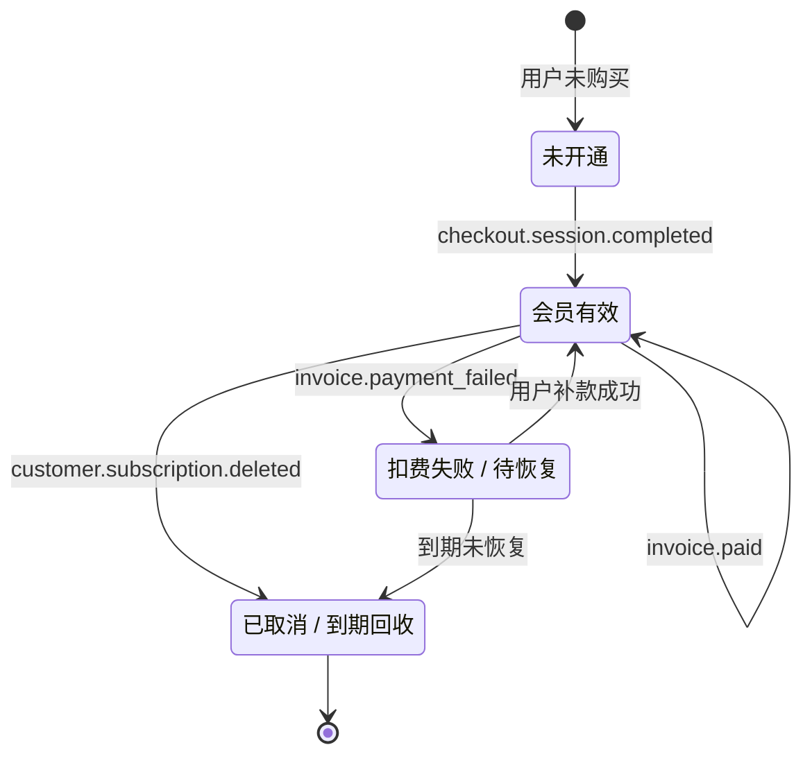
```mermaid
stateDiagram-v2
  [*] --> NotStarted: 用户未购买
  NotStarted --> Active: checkout.session.completed
  Active --> Active: invoice.paid
  Active --> PastDue: invoice.payment_failed
  PastDue --> Active: 用户补款成功
  Active --> Canceled: customer.subscription.deleted
  PastDue --> Canceled: 到期未恢复
  Canceled --> [*]

  state "未开通" as NotStarted
  state "会员有效" as Active
  state "扣费失败 / 待恢复" as PastDue
  state "已取消 / 到期回收" as Canceled
```

### 15.4 续费 / 失败 / 取消时序图

每种事件进来，后端的动作都不一样：

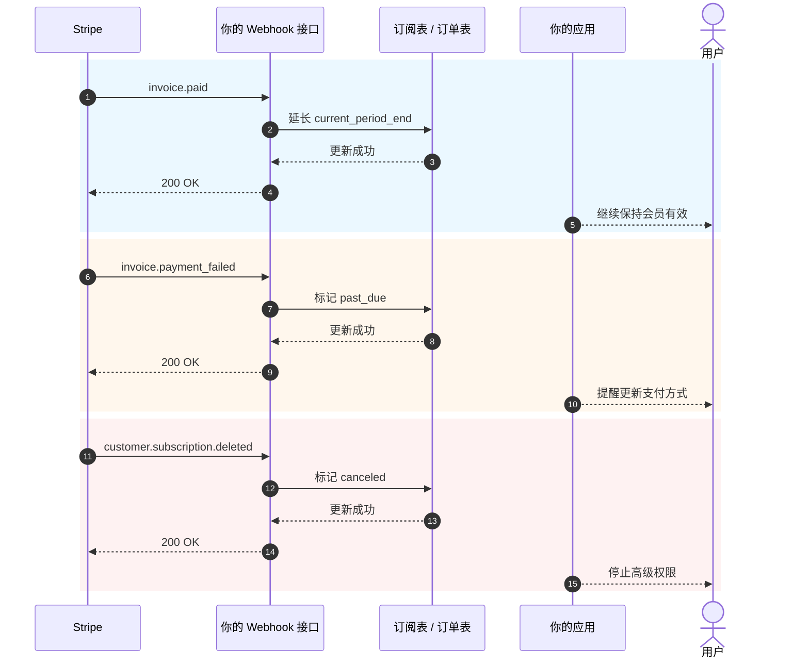
```mermaid
sequenceDiagram
  autonumber
  participant Stripe as Stripe
  participant Webhook as 你的 Webhook 接口
  participant DB as 订阅表 / 订单表
  participant App as 你的应用
  actor User as 用户

  rect rgb(235, 248, 255)
    Stripe->>Webhook: invoice.paid
    Webhook->>DB: 延长 current_period_end
    DB-->>Webhook: 更新成功
    Webhook-->>Stripe: 200 OK
    App-->>User: 继续保持会员有效
  end

  rect rgb(255, 247, 237)
    Stripe->>Webhook: invoice.payment_failed
    Webhook->>DB: 标记 past_due
    DB-->>Webhook: 更新成功
    Webhook-->>Stripe: 200 OK
    App-->>User: 提醒更新支付方式
  end

  rect rgb(254, 242, 242)
    Stripe->>Webhook: customer.subscription.deleted
    Webhook->>DB: 标记 canceled
    DB-->>Webhook: 更新成功
    Webhook-->>Stripe: 200 OK
    App-->>User: 停止高级权限
  end
```

::: warning 订阅一定要做幂等
Webhook 可能因为网络原因被 Stripe 重试，同一个 `invoice.paid` 事件你可能收到两次。如果你每次都无脑"有效期 +1 个月"，用户就白赚时长了。正确做法是用事件里的唯一 ID（如 `event.id` 或 `invoice.id`）做去重：处理过的事件直接跳过。这就是前面"4 件踩坑"里的第 4 条——**没有幂等处理**。
:::

---

## 16. 支付方案选型：不做海外 Stripe 怎么办

小哲做的是海外 SaaS，所以选了 Stripe。但如果你的用户在别的地区，第一选择往往不是 Stripe。这一节按地区和模式把常见方案理一遍。

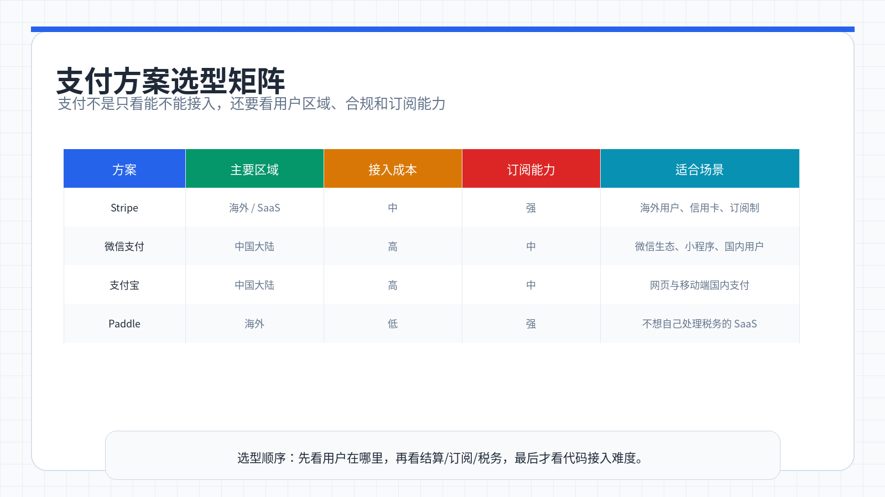

*支付选型先看用户所在区域，再看结算、订阅、税务和代码接入难度。*

::: info 最简单的选型思路
不要一开始就想"我要把全球支付方式一次全接完"。更实际的顺序是：先按主要用户所在地区选一条**主支付链路**，先把最小可行支付跑通，再根据真实用户来源补第二、第三种支付方式。
:::

### 16.1 中国大陆：支付宝 / 微信支付

主要用户在大陆的话，首选是 **[支付宝](https://open.alipay.com/)** 和 **[微信支付](https://pay.wechatpay.cn/)**。

**业务模式：** 两者都是"支付网关"模式。你需要申请商户资质（营业执照、对公账户），用户付的钱直接到你的商户账户，你自己负责税务、退款、对账。

**技术模式：** 两者都是"后端下单 + 前端调起 + 后端通知"的模型，跟 Stripe 思路一样。

- **支付宝接入流程**：① 在支付宝开放平台创建应用 → ② 配置公私钥和回调地址 → ③ 后端调用统一下单接口，生成支付链接或二维码 → ④ 用户扫码或跳转付款 → ⑤ 支付宝异步通知你的后端，更新订单状态。
- **微信支付接入方式**：JSAPI 支付（适合公众号、小程序，用户在微信内付款）、Native 支付（PC 端生成二维码扫码付款）、H5 支付（手机浏览器内拉起微信 App）。流程：后端下单 → 拿到 `prepay_id` 或 `code_url` → 前端调起支付 → 后端接收通知确认成功。

参考链接：支付宝开放平台 https://open.alipay.com/ ；微信支付商户文档 https://pay.wechatpay.cn/doc/v3/merchant/

### 16.2 香港：混合方案

香港市场比较混合，常见支付方式：银行卡（Visa / Mastercard）、FPS（转数快，本地即时转账）、AlipayHK / WeChat Pay HK（香港版支付宝和微信）。

**推荐组合：** 用 **[Stripe](https://stripe.com/hk)** 覆盖国际卡和订阅，用 **[Airwallex](https://www.airwallex.com/)** 或 **[Adyen](https://www.adyen.com/)** 补本地钱包和 FPS。

### 16.3 海外 / 国际 SaaS

**[Stripe](https://stripe.com/)** —— 业务模式：支付网关。你需要自己申请商户资质（部分国家 Stripe 可帮你搞定），用户付的钱到你的 Stripe 账户再结算到银行，你自己负责税务。技术上 API 体验最好、文档清晰，支持 Checkout（托管页面）、Elements（自定义表单）、Payment Links（无代码），Webhook 通知，支持订阅、发票、多币种。**适合：** 海外 SaaS、独立开发者、需要灵活定制的团队。参考：https://docs.stripe.com/

**[PayPal](https://www.paypal.com/)** —— 业务模式：支付网关。用户付的钱到你的 PayPal 账户再提现到银行，你自己负责税务。技术上：一次性支付（前端放按钮，后端创建/确认订单）、订阅制（先建 Product 和 Plan，再用 SDK 拉起），同样需要后端和 Webhook，不要只看前端回调。**适合：** 需要补充渠道的海外业务。参考：https://developer.paypal.com/docs/

**[Paddle](https://www.paddle.com/)** —— 业务模式：Merchant of Record（MoR，记录商家）。法律上由 Paddle 向用户收款，帮你处理全球税务、VAT、退款、合规，用户付的钱到 Paddle，扣除税费手续费后结算给你，你不需要在每个国家注册公司或处理税务。技术上：Paddle.js（前端嵌入托管结账页）、后端 API（创建 transaction）、Webhook 同步订阅状态。**适合：** 不想处理全球税务的 SaaS 团队，尤其 B2B SaaS。参考：https://developer.paddle.com/

**[Lemon Squeezy](https://www.lemonsqueezy.com/)** —— 业务模式：MoR。和 Paddle 类似，帮你处理全球税务、VAT、合规，2024 年被 Stripe 收购但独立运营。技术上：Hosted Checkout（直接生成付款链接，最简单）、Checkout Overlay（浮层嵌入页面）、后端 API（灵活控制）。**适合：** 独立开发者、数字产品、软件授权。参考：https://docs.lemonsqueezy.com/

### 16.4 企业级方案

**[Airwallex（空中云汇）](https://www.airwallex.com/)** —— 业务模式：支付网关 + 全球账户。提供全球收款账户（类似虚拟银行账户），支持多币种收款、换汇、付款，你自己负责税务。技术上：Payment Links（几乎不用代码）、Hosted Payment Page、Drop-in / Embedded / Native API（深度接入），支持 Alipay HK、FPS、WeChat Pay 等本地支付。**适合：** 香港团队、跨境业务、需要多币种账户的公司。参考：https://www.airwallex.com/docs/

**[Adyen](https://www.adyen.com/)** —— 业务模式：支付网关。企业级支付平台，年处理交易额万亿欧元，支持线上、线下、移动端全渠道，你自己负责税务。技术上：Pay by Link（最简单）、Drop-in / Components（标准线上接入），后台可启用 Alipay、Alipay HK、PayMe 等本地支付。**适合：** 大型企业、需要全渠道支付的公司。参考：https://docs.adyen.com/

### 16.5 方案对比与按地区选型

| 方案 | 业务模式 | 税务处理 | 适合谁 |
| :--- | :--- | :--- | :--- |
| Stripe | 支付网关 | 自己处理 | 海外 SaaS、开发者 |
| PayPal | 支付网关 | 自己处理 | 海外补充渠道 |
| Paddle | MoR | Paddle 代处理 | B2B SaaS、不想管税务 |
| Lemon Squeezy | MoR | LS 代处理 | 独立开发者、数字产品 |
| Adyen | 支付网关 | 自己处理 | 大型企业 |
| Airwallex | 支付网关 + 账户 | 自己处理 | 跨境业务、香港团队 |
| 支付宝/微信 | 支付网关 | 自己处理 | 大陆用户 |

| 你的市场 | 推荐方案 |
| :--- | :--- |
| 中国大陆 | 支付宝 / 微信支付 |
| 香港 | Stripe + Airwallex / Adyen |
| 海外 SaaS | Stripe（自己管税务）或 Paddle（MoR 代管） |
| 海外数字产品 | Stripe / Lemon Squeezy / Paddle |
| 多地区企业级 | Adyen / Airwallex / Stripe 组合 |

---

## 17. 小哲这周的转变

> 上线那天，小哲把公网地址发给同学，对方点开就用上了，还真的走通了一笔测试支付。那一刻他第一次觉得，自己写的不再是一堆"只有我能跑"的代码，而是一个产品。
>
> 但他也踩了实打实的坑：第一次部署因为端口写死成 3000 起不来；支付一开始想图省事在 success 页面开通会员，被 Agent 拦了下来；上线后忘了改 `APP_URL`，付完款跳回了 `localhost`，页面直接打不开。
>
> 他在复盘里写：**"本地能跑只是开始。支付的边界、部署的端口、上线后要回填的地址——这些都不是 Agent 一句话能替我想全的。它能帮我写代码、改配置，但'这条收费链路对不对、这个地址该填哪个'，得我自己一步步验过才算数。"**

---

## 本周回顾

<ProgressTracker title="第 7 周学习进度" :items="[
  { title: '想清楚了支付三条铁律', description: '定价归后端、确认归 Webhook、记账归自己的库', done: false },
  { title: '接通了 Stripe 支付链路', description: 'Checkout 创建会话 + Webhook 确认开通 + 本地联调', done: false },
  { title: '搞懂了 success 页面为什么不可靠', description: '只有签名校验过的 Webhook 才算数', done: false },
  { title: '把全栈应用部署到了 Zeabur', description: '处理端口、配环境变量、拿到公网地址', done: false },
  { title: '上线后亲自验证了一次支付', description: '确认 Webhook 与数据库状态都对', done: false }
]" />

**自测问题：**

1. 为什么"价格必须由后端决定"？如果让前端直连 Stripe 并自己传金额，会带来哪些风险？
2. 为什么开通会员的逻辑要放在 Webhook，而不是 success 页面？success 页面跳转和 Webhook 通知在"谁发起、能否伪造、是否一定代表付款成功"上分别有什么区别？
3. 部署到 Zeabur 时，为什么要把监听端口改成 8080（且最好从环境变量 `PORT` 读）？为什么本地的环境变量必须在平台上重新填一遍？

---

## 下周预告

应用能收费、能访问了，下周小哲要给它加"大脑"：用 **Dify** 搭一个 AI 知识库。你会学到怎么把自己的文档喂给大模型、用检索增强（RAG）让 AI 基于你的资料回答，而不是张口就编——而且正好可以用上这周在 Zeabur 上跑起来的那套 Dify 服务，让产品从"能用"走向"够聪明"。我们下周见。
