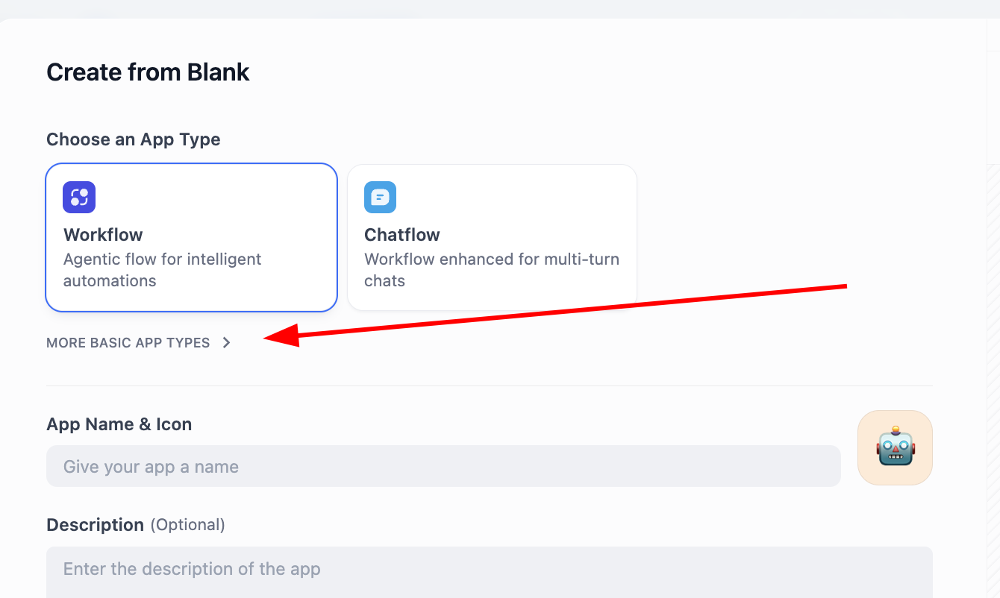
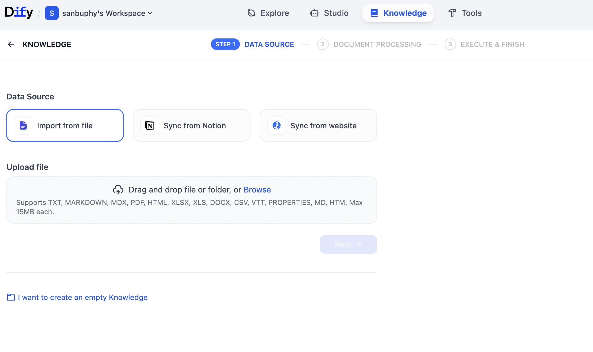
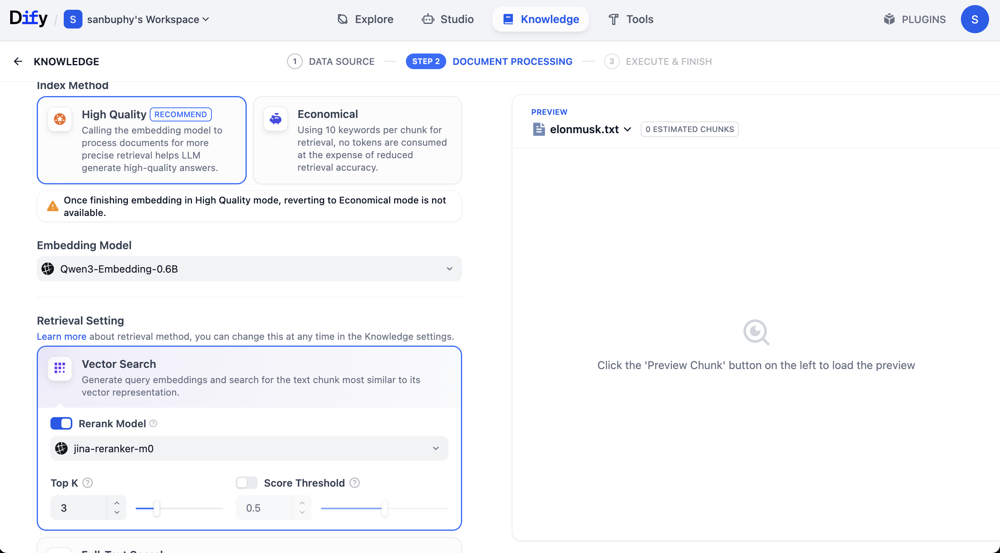
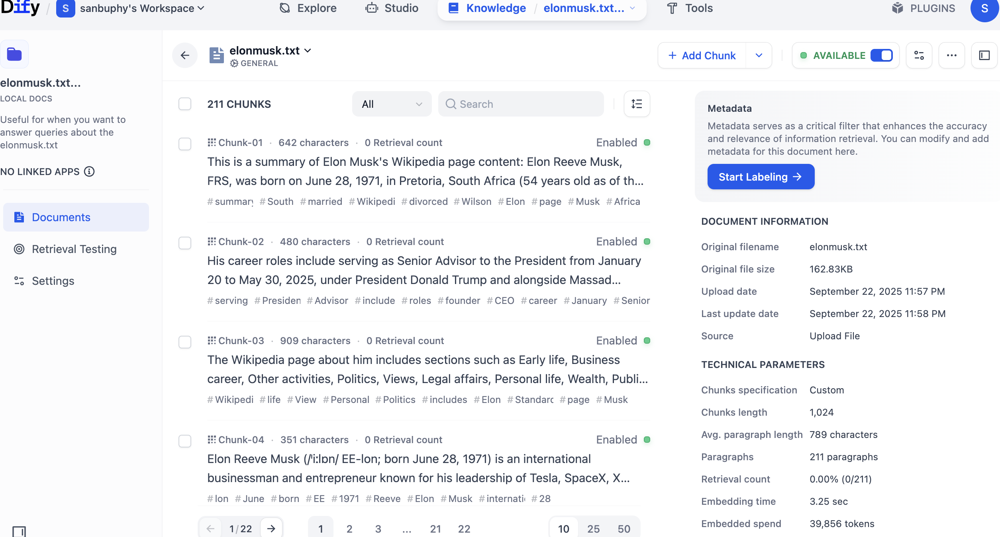
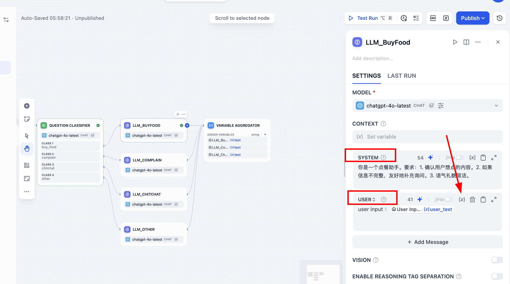

# 第 8 周：AI 知识库——用 Dify 搭建知识库应用

> 小哲已经能用代码接通大模型了。可这周他遇到一个尴尬：助手回答"我们产品的退款政策"时，张口就编。代码没问题，模型也没坏——AI 只是**根本不认识他的业务**。这周他要换一种姿势：不再一行行写代码喂数据,而是用 Dify 这样的平台，把文档灌成知识库，让 AI 答得「有据可依」。

<ChapterIntroduction duration="1 课时（约 2 小时）" output="一个能回答产品专业问题的 Dify 知识库助手 + 一份召回测试记录" prerequisite="完成前几周用 API 接大模型；理解大模型与提示词的基本概念" :tags="['Dify', '知识库', 'RAG', 'Embedding', '低代码编排', '工作流']">

你会先看清「模型不懂业务数据」这个真实痛点，理解知识库和 RAG 为什么能治幻觉，然后亲手在 Dify 上传文档、配置检索、把知识库接进一个对话应用，最后用 API 把它对接到自己的产品里。这周也是一次身份切换：从**写代码接 AI**，走向**用平台编排 AI 能力**。

</ChapterIntroduction>

<StepBar :active="0" :items="[
  { title: '① 小哲的新难题', description: 'AI 答不出业务问题，还会瞎编' },
  { title: '② 知识库与 RAG', description: '把外部资料喂给模型再回答' },
  { title: '③ 为什么用平台编排', description: '低代码平台 Dify 登场' },
  { title: '④ 动手搭知识库应用', description: '上传 / 切分 / 检索 / 对接' },
  { title: '⑤ 进阶：工作流编排', description: '意图分类与多路径处理' }
]" />

---

## 上节课回顾

在上节课中，我们学会了如何通过 API 直接调用大模型，掌握了提示词工程的基本技巧，能够让 AI 扮演不同角色、完成各种文本生成任务。

为了帮助大家更好地衔接知识，在开始本节课的新内容前，让我们一起通过几道简单的题目快速回顾一下上节课的核心知识点：

1. 什么是 API？如何使用 API Key 调用大模型服务？
2. 什么是提示词工程？如何编写一个有效的系统提示词？
3. 大模型的「幻觉」问题是什么？为什么会产生幻觉？
4. 如何在代码中处理大模型的流式响应？

如果对以上任何一个问题还有印象模糊的地方，建议先回顾一下上节课的文档和讲义。

在本节课中，我们将学习如何让 AI 从「能聊天」变为「懂业务」：除了用知识库管理企业专属资料外，还要掌握 RAG（检索增强生成）的核心原理，以及如何用 Dify 这样的低代码平台快速搭建、测试和部署知识库应用。

::: tip 你将学到
1. 为什么大模型会「幻觉」，知识库如何解决这个问题
2. 什么是 RAG（检索增强生成），它的工作原理是什么
3. 什么是 Dify，如何使用 Dify 创建知识库和对话应用
4. 如何配置 Embedding 模型、Rerank 模型和检索参数
5. 如何进行召回测试，优化检索效果
6. 如何用 Dify 搭建意图分类工作流
7. 如何将 Dify 应用通过 API 对接到自己的产品

最终产出：
- 一个能准确回答业务问题的 Dify 知识库助手
- 一份完整的召回测试记录和优化方案
- 一个带意图分类的餐饮场景工作流
:::

---

## 1. 小哲的新难题：AI 不懂我的业务

### 1.1 一次翻车的演示

前几周小哲学得很顺。他用 API 接通了大模型，写了个客服助手的小 demo，提示词调得也不错。直到他把它拿给做电商的学长试用。

学长问了一句：「你们这款耳机的保修期多久？」

助手非常自信地回答：「本产品享受**两年**全国联保，凭购买凭证可在全国任意授权服务点享受免费维修服务。」

学长愣了一下：「我们店里写的明明是**一年**啊。」

小哲翻了半天代码也没找到 bug。他检查了 API 调用、提示词、参数设置——一切都正常。问题不在代码，而在于：**这个保修信息从来没进过模型的脑子。**

<AiChat :initial-messages="[
  { role: 'user', content: '你们这款耳机的保修期多久？' },
  { role: 'assistant', content: '本产品享受两年全国联保，凭购买凭证可在全国任意授权服务点享受免费维修服务。如有质量问题，我们将提供免费维修或更换。' },
  { role: 'system', content: '❌ 错误：实际保修期是一年，模型编造了错误信息' }
]" :show-input="false" />

### 1.2 问题的根源：模型的知识边界

大模型只学过公开语料，它不认识小哲学长的店铺、不认识这款耳机、更不知道那张藏在后台的售后政策表。被问到时，它不会说「我不知道」，而是顺着语气**编一个听起来很合理的答案**——这就是所谓的「幻觉」（Hallucination）。

<InfoCard icon="⚠️" variant="warning">
**小哲的教训**

小哲第一次意识到：**模型聪明，不等于它懂你的事。** 凡是涉及「我们公司」「我们产品」「我们最新版本」的专业问题，靠提示词硬塞几句根本不够——资料一多就塞不下，更新一次就得改代码。他需要一种办法，让 AI 在回答前**先去查一份属于业务自己的资料**。
</InfoCard>

让我们看看不同场景下，模型的知识边界在哪里：

| 问题类型 | 模型能否回答 | 原因 |
|---------|------------|------|
| 「Python 的列表推导式怎么写？」 | ✅ 能准确回答 | 公开知识，训练数据中大量存在 |
| 「2024 年诺贝尔文学奖得主是谁？」 | ❌ 可能过时或错误 | 训练数据截止日期之后的信息 |
| 「我们公司的年假制度是什么？」 | ❌ 会编造答案 | 企业内部资料，模型从未见过 |
| 「这款耳机的保修期多久？」 | ❌ 会编造答案 | 特定产品信息，不在训练数据中 |

这就是这周要解决的事：给 AI 配一个**知识库**，让它在回答前先查资料。

---

## 2. 知识库与 RAG：让回答有据可依

### 2.1 什么是知识库

要让模型回答得准，思路其实很朴素：**别让它凭记忆答，让它先查资料再答。**

知识库（Knowledge Base）就是一个专门存放企业专属资料的地方。你可以把产品手册、售后政策、FAQ、内部文档等各种资料上传进去，系统会自动处理这些文档，让 AI 能够在需要时快速找到相关内容。

想象一下，如果你是一个客服，面对客户的问题：
1. **没有知识库**：凭记忆回答，可能记错或遗漏
2. **有知识库**：先翻查手册找到准确条款，再用自己的话解释给客户

AI 的知识库就是这个道理。

### 2.2 RAG：检索增强生成

这套机制有个名字，叫 **RAG（Retrieval-Augmented Generation，检索增强生成）**。拆开看就三步：

1. **检索（Retrieval）**：用户提问时，系统先从你的资料库里找出**最相关的几段文字**，比如售后政策里关于「保修期」的那一条。
2. **增强（Augmented）**：把这几段原文，连同用户的问题，一起拼进发给模型的提示词里。
3. **生成（Generation）**：模型基于这些**真实资料**组织语言作答，而不是凭空发挥。

```diff
 你是一个专业的客服助手。

+参考资料：
+「本产品自购买之日起提供一年全国联保。保修期内如出现非人为损坏的质量问题，可凭购买凭证到授权服务点免费维修。保修不含：人为损坏、进水、私自拆修。」
+
 用户问题：这款耳机的保修期多久？

-请回答用户的问题。
+请基于参考资料回答用户的问题。如果资料中没有相关信息，请明确告知用户。
```

看到区别了吗？RAG 不是改模型，而是**改喂给模型的上下文**。同一个模型，给对资料，答案就对了。

### 2.3 RAG 的核心优势

| | 没有知识库的 AI | 接了知识库（RAG）的 AI |
|---|---|---|
| 回答依据 | 训练时见过的泛化知识 | 你提供的权威资料 |
| 遇到没学过的业务 | 自信地编一个 | 检索原文，照实回答 |
| 资料更新了 | 得重新训练或改提示词 | 换掉知识库文档即可 |
| 能否说清来源 | 说不清 | 可以指出命中了哪段 |
| 成本 | 低（只调用模型） | 中（需要向量化和检索） |

<InfoCard icon="💡" variant="tip">
**RAG 不改模型，只改「喂给它的上下文」**

很多新手以为治幻觉要去「训练模型」，那既贵又慢。RAG 的高明之处是：模型一个字都不用动，只是在每次提问时，临时把对的资料塞进它的视野。换知识库就像换教材——同一个学生，给对课本，答案就对了。
</InfoCard>

### 2.4 Embedding：让机器理解语义

那「找出最相关的几段」是怎么做到的？关键靠 **Embedding（向量化）**。

简单来说，Embedding 就是把文字转成一串数字（向量）。神奇的是，**语义相近的文字，向量也相近**。比如：

```text
「保修期多久」 → [0.2, 0.8, 0.1, ...]
「质保时间」   → [0.3, 0.7, 0.2, ...]  ← 向量很接近
「退款流程」   → [0.9, 0.1, 0.8, ...]  ← 向量差很远
```

检索时，系统把用户的问题也转成向量，然后去知识库里找「向量距离最近」的几段文字——这就是语义检索。

<AiChat :initial-messages="[
  { role: 'system', content: '💡 小哲的理解：Embedding 就像给每句话打上「语义指纹」，意思越像，指纹越像。检索时就是在比对指纹，找最匹配的那几条。' }
]" />

这一步，平台都替你封装好了——你很快就会在 Dify 里点到它。

---

## 3. 为什么用平台编排，而不是全自己写

### 3.1 自己写 RAG 要做多少事

小哲第一反应是：「那我自己写代码做 RAG 不就行了？」

理论上可以，但他得自己搞定一长串活儿：

1. **文档解析**：支持 PDF、Word、Markdown 等格式
2. **文本切分**：把长文档切成合适大小的片段（chunk）
3. **向量化**：调用 Embedding 模型，把每个片段转成向量
4. **向量存储**：搭建向量数据库（如 Pinecone、Weaviate）
5. **检索逻辑**：实现相似度计算和排序
6. **提示词拼接**：把检索结果和用户问题组合成提示词
7. **模型调用**：调用大模型生成回答
8. **管理后台**：做一个能上传文档、配置参数的界面

这些**每个 RAG 应用都要重复造一遍的轮子**，正是低代码平台帮你省掉的部分。

| 方式 | 需要做什么 |
|---|---|
| 自己写 RAG | 文档切分、向量化、向量库、相似度检索、提示词拼接、模型调用、后台管理 |
| 用 Dify 平台 | 上传文档、创建知识库、配置切分规则、选择 Embedding 模型、挂载知识库、发布 API |

### 3.2 低代码平台的价值

这类平台用**可视化拖拽 + 预置模块**替代手写代码，让你把精力放在「业务怎么编排」上，而不是「轮子怎么造」。常见的有这几个：

| 平台 | 特点 | 适用场景 |
|---|---|---|
| **Dify** | 开源、支持知识库 RAG、可一键发布 API、中文友好 | 企业知识库问答、定制 Agent、API 服务 |
| **Coze（字节）** | 上手极简、集成飞书/抖音生态、插件多 | 社交机器人、国内小程序集成 |
| **n8n** | 通用自动化、强在 API 编排、可自托管 | 跨系统数据同步、AI + 传统 SaaS |

这周小哲选 **Dify**：它开源、能私有部署、知识库功能成熟，而且搭好的应用能直接发布成 API，方便他后面**对接回自己的产品**。

<InfoCard icon="🎯" variant="tip">
**这是一次身份切换**

前几周小哲是「写代码接 AI 的工程师」，盯着请求和响应。这周他更像一个「**AI 能力的编排者**」：上传哪些资料、怎么切分、检索召回几条、命中后怎么回答——这些决定回答质量的关键旋钮，都在平台上拧。会写代码仍是优势，但主战场从 IDE 挪到了编排画布。
</InfoCard>

---

## 4. 动手（一）：创建第一个 Dify 对话应用

### 4.1 注册并创建项目

访问 Dify 官网（`cloud.dify.ai`，或在 Zeabur 等平台自部署一份），注册并登录后，进入 **Studio**。

按下面的路走：

1. 找到 `CREATE APP`，点击 `Create from Blank`
2. App Type 选 **Chatbot**（没看到就点「查看更多类型」）
3. 填上应用名称（如「汉堡店客服助手」）和描述
4. 点击创建



### 4.2 认识应用界面

进入应用后，小哲注意到几个关键区域：

- **INSTRUCTIONS**：内置指令，相当于系统提示词，决定助手的人设和口径
- **Knowledge**：知识库挂载区——稍后他要把售后资料挂在这里
- **右侧调试窗口**：改完提示词能立刻对话试效果
- **右上角模型选择**：可以随时切换不同模型，对比语气和推理表现

他先在 INSTRUCTIONS 里写了句人设：

```text
你是一家汉堡店的专业客服助手。你的任务是：
1. 基于知识库中的资料回答用户问题
2. 如果知识库中没有相关信息，明确告知用户
3. 保持友好、专业的语气
4. 不要编造任何信息
```

然后故意又问了一遍保修期。果然，**没挂知识库的助手照样在编**。

<AiChat :initial-messages="[
  { role: 'user', content: '你们汉堡的保质期是多久？' },
  { role: 'assistant', content: '我们的汉堡采用新鲜食材现做，建议在制作完成后2小时内食用，以保证最佳口感和食品安全。如果需要保存，请放入冰箱冷藏，并在24小时内食用完毕。' },
  { role: 'system', content: '❌ 没有知识库，模型又开始编造了' }
]" />

这正好说明：提示词管「怎么说」，知识库管「说什么是对的」，两者缺一不可。

---

## 5. 动手（二）：把文档灌成知识库

### 5.1 创建知识库

点击顶部菜单 `Knowledge` → `Create Knowledge`，进入知识库创建页。

小哲把汉堡店的资料整理成几个文件：
- `menu.txt`：菜单和价格
- `policy.txt`：退款政策、营业时间
- `faq.txt`：常见问题解答

他把这些文件上传上去，然后点 Next 进入设置页。



### 5.2 配置切分规则

这里几个旋钮值得理解：

#### General（切分规则）

长文档要先切成小块（chunk）才好检索。入门阶段重点看两个参数：

**Maximum chunk length（最大切分长度）**
- 决定每个片段最多包含多少字符
- 可以试 512 / 2048 / 4096
- 点 **Preview Chunk** 看效果

**Chunk overlap（切片重叠）**
- 让相邻片段保留一点重叠
- 避免一句话被拦腰切断后两边都看不懂
- 一般设置为 chunk length 的 10-20%

| 切分方式 | 示例 |
|---|---|
| 无重叠 | Chunk 1：我们的牛肉汉堡采用 100% 纯牛肉，新鲜制作。Chunk 2：保质期为制作后 2 小时内食用最佳。 |
| 有重叠 | Chunk 1 保留完整句子；Chunk 2 带上「新鲜制作」作为上下文，避免断句后看不懂。 |

<InfoCard icon="⚠️" variant="warning">
**切分不是越大越好**

小哲一开始把 chunk 设到 4096，图省事。结果检索时命中的片段太长、夹了无关内容，回答反而变啰嗦。切片太小又会让一条政策被拆散。**合适的切分要看资料形态**：条款型短文本切小一点更精准，长篇叙述适当放大。多用 Preview Chunk 试，别凭感觉定。
</InfoCard>

### 5.3 配置 Embedding 模型

**Embedding 模型**负责把每个切片转成向量。模型选得好，检索就更准。

Dify 支持多种 Embedding 模型：
- **OpenAI text-embedding-3-small**：性价比高，适合大多数场景
- **Qwen Embedding**：中文效果好，有 0.6B / 4B / 8B 多个版本
- **BGE 系列**：开源模型，可私有部署

小哲选了 **Qwen 0.6B**，后面可以换 4B / 8B 直观对比差异。



### 5.4 配置 Rerank 模型

**Rerank 模型**对初步检索出的候选做**二次精排**，把最相关的顶上来。

可以这样理解它的分工：

| 阶段 | 角色 | 干的活 | 速度 |
|---|---|---|---|
| Embedding 检索 | 粗筛 | 从成百上千个切片里快速捞出一批「大概相关」的 | 快 |
| Rerank 精排 | 细选 | 在这批里挑出「最相关」的几条排到最前 | 慢但准 |

常用的 Rerank 模型：
- **Jina Rerank**：多语言支持好
- **Cohere Rerank**：英文效果优秀
- **BGE Rerank**：开源，可私有部署

小哲选了 **Jina-rerank-m0**，默认配置就够用。

### 5.5 开始处理

设置完点 **Save & Process**，Embedding 模型开始把切片向量化。

处理过程中可以看到进度条：
```text
Processing documents... 
├─ menu.txt: 15 chunks ✓
├─ policy.txt: 8 chunks ✓
└─ faq.txt: 12 chunks ✓

Total: 35 chunks processed
```

处理完点 **Go to document**，就能看到一条条切好、存好的内容。



点击任意切片，可以看到：
- 原始文本内容
- 所属文档
- 切片位置
- 还能逐条编辑或删除不合适的片段

---

## 6. 动手（三）：召回测试与检索调优

### 6.1 为什么要做召回测试

知识库建好，先别急着上线。小哲学到一个好习惯：**先做召回测试，确认能查得准。**

回答错了，未必是模型笨，很可能是**根本没检索到对的资料**。先在 Retrieval Testing 里确认「该命中的命中了、该排除的排除了」，再去看模型怎么组织语言。把检索和生成分开排查，问题定位会快很多。

<InfoCard icon="🔍" variant="tip">
**召回测试是验证的第一道关**

就像考试前先检查答题卡有没有涂错位置，召回测试是在验证「AI 拿到的资料对不对」。如果这一步就错了，后面模型再聪明也白搭。
</InfoCard>

### 6.2 进行召回测试

在知识库左侧选 **Retrieval Testing**，输入一句用户可能会问的话。

小哲测试了几个问题：

**测试 1：「牛肉汉堡多少钱？」**

```text
查询：牛肉汉堡多少钱
─────────────────────────────
命中 1  相似度 0.89  
「经典牛肉汉堡 18元 - 采用100%纯牛肉，新鲜制作，配生菜、番茄、洋葱」

命中 2  相似度 0.72  
「套餐优惠：牛肉汉堡+薯条+可乐 = 28元（原价32元）」

命中 3  相似度 0.45  
「鸡肉汉堡 15元 - 香嫩鸡腿肉，特制酱料」
```

✅ 结果很好！最相关的信息排在最前面。

**测试 2：「可以退款吗？」**

```text
查询：可以退款吗
─────────────────────────────
命中 1  相似度 0.91  
「退款政策：未食用的商品在购买后30分钟内可全额退款，需出示小票」

命中 2  相似度 0.68  
「已食用或超过30分钟的商品不支持退款，但可以换货」

命中 3  相似度 0.38  
「营业时间：周一至周日 10:00-22:00」
```

⚠️ 第 3 条相似度太低，跟问题无关。需要调整阈值过滤掉。

### 6.3 调整检索参数

点击 `VECTOR SEARCH` 设置，有两个关键参数：

**Top K（返回数量）**
- 返回相似度最高的前 K 个切片
- 设为 3 就只返回最相关的 3 段
- 太少可能漏掉重要信息，太多会引入噪声

**Score Threshold（得分阈值）**
- 低于这个相似度的切片直接丢掉
- 比如设 0.5，能过滤掉勉强沾边的噪声
- 太高会「查不到」，太低会「查到一堆没用的」

小哲把阈值调到 0.5，再测试一次：

```text
查询：可以退款吗
─────────────────────────────
命中 1  相似度 0.91  
「退款政策：未食用的商品在购买后30分钟内可全额退款，需出示小票」

命中 2  相似度 0.68  
「已食用或超过30分钟的商品不支持退款，但可以换货」

（第 3 条因低于阈值 0.5 被过滤）
```

✅ 完美！只保留了真正相关的信息。

| 设置 | 命中结果 |
|---|---|
| Top K: 3，Score Threshold: 0.3 | 命中退款政策、换货说明，也混入了营业时间这类无关片段 |
| Top K: 3，Score Threshold: 0.5 | 保留退款政策和换货说明，过滤 0.38 的无关命中 |

### 6.4 记录测试结果

小哲把测试过程记录下来，这就是本周的产出之一：

| 测试问题 | Top K | 阈值 | 命中数 | 是否准确 | 备注 |
|---------|-------|------|--------|---------|------|
| 牛肉汉堡多少钱 | 3 | 0.5 | 2 | ✅ | 准确命中价格信息 |
| 可以退款吗 | 3 | 0.5 | 2 | ✅ | 过滤掉无关的营业时间 |
| 有什么优惠 | 3 | 0.5 | 3 | ✅ | 召回了套餐优惠信息 |
| 营业到几点 | 3 | 0.5 | 1 | ✅ | 准确命中营业时间 |

---

## 7. 动手（四）：接回应用，并对接到自己的产品

### 7.1 挂载知识库到应用

回到 **Studio** 里那个 Chatbot 应用，在 **Knowledge** 区域挂上刚建好的知识库，保存。

现在小哲再问一遍：

<AiChat :initial-messages="[
  { role: 'user', content: '牛肉汉堡多少钱？' },
  { role: 'assistant', content: '我们的经典牛肉汉堡是 18 元。这款汉堡采用 100% 纯牛肉，新鲜制作，配有生菜、番茄和洋葱。如果您想要套餐，牛肉汉堡+薯条+可乐的组合是 28 元，比单点优惠 4 元哦！' },
  { role: 'system', content: '✅ 回答准确，基于知识库内容' }
]" />

助手老老实实答了「18 元」，下面还标出了命中的知识库来源，点开就能看到检索到的原文片段。**有据可依，从此不靠编。**

### 7.2 发布 API 并对接

最后一步，把它对接到自己的产品。Dify 应用可以一键发布成 **API**。

在应用页面点击右上角 **Publish**，然后进入 **API Access**，拿到：
- API Endpoint（服务地址）
- API Key（密钥）

前端直接调用就行：

**前端调用 Dify API 的安全写法：**

```diff
-const DIFY_API_KEY = 'app-abc123...' // 不要把密钥写在前端
-await fetch('https://api.dify.ai/v1/chat-messages', {
-  headers: { Authorization: `Bearer ${DIFY_API_KEY}` }
-})
+// 前端只调用自己的后端
+await fetch('/api/chat', {
+  method: 'POST',
+  headers: { 'Content-Type': 'application/json' },
+  body: JSON.stringify({ question })
+})
+
+// 后端再用环境变量里的 Dify Key 调用 Dify
+headers: { Authorization: `Bearer ${process.env.DIFY_API_KEY}` }
```

<InfoCard icon="🔑" variant="warning">
**API Key 是钥匙，别塞进前端**

Dify 的 API Key 能直接调用你的应用、消耗你的额度。**绝不要把它写死在前端代码或提交进仓库**——应该放在后端环境变量里，由后端代理转发请求。上面的示例展示了正确的做法：前端只跟自己的后端说话，后端拿着密钥去调 Dify。
</InfoCard>

到这里，小哲完成了一条完整链路：**整理资料 → 灌成知识库 → 调好检索 → 接进应用 → 发布 API → 对接产品**。整个过程他几乎没写 RAG 的底层代码，全靠在平台上编排。

---

## 8. 进阶：用工作流实现意图分类

### 8.1 为什么需要工作流

小哲的知识库助手跑得不错，但他发现一个新问题：用户的输入千奇百怪。

有人来下单：「给我来一份牛肉汉堡」
有人来抱怨：「等了半小时还没做好！」
有人只是闲聊：「今天吃什么好呢？」

如果把所有输入都直接交给同一个 LLM 处理，系统会出现两个问题：
1. **回复风格不稳定**：同样是抱怨，有时能道歉安抚，有时却在「解释原因」
2. **业务逻辑不可控**：你希望「抱怨必须先道歉」，但模型未必每次都遵守

更工程化的做法是：**先做意图分类，然后按意图分流，不同场景使用不同的提示词与角色。**

这就需要用到 Dify 的 **Workflow（工作流）** 功能。

### 8.2 创建意图分类工作流

回到 Dify Studio，点击 `CREATE APP`，这次选择 **Workflow**。

**场景设定：餐饮店客服**

我们要处理四种意图：
- **下单购买 (buy_food)**：用户表达明确的购买意愿
- **抱怨投诉 (complain)**：用户在表达不满、催促或负面反馈
- **闲聊咨询 (chitchat)**：用户在进行开放式询问、寻求建议
- **其他意图 (other)**：用户的输入与餐饮场景无关

针对这四种意图，我们为系统预设四种不同的「沟通人格」：
- **下单助手**：专业、高效，核心任务是确认订单细节
- **客服专家**：共情、稳重，首要任务是安抚用户情绪
- **聊天伙伴**：轻松、友好，旨在提供个性化推荐
- **礼貌门卫**：专注、边界清晰，负责将偏离主题的对话引导回核心业务

### 8.3 工作流节点设计

工作流的核心节点结构：

1. **Start（起点）**：接收用户输入 `user_text`
2. **Question Classifier（意图分类器）**：分析输入，选择最匹配的意图标签
3. **Condition（条件分支）**：根据意图标签，导向不同的处理路径
4. **四个并行的 LLM 节点**：每个节点对应一种意图，使用不同的提示词
5. **Variable Aggregator（变量聚合器）**：收束结果成统一变量
6. **Output（终点）**：输出意图标签、原始问题和最终回复



### 8.4 配置意图分类器

点击 Start 节点后的 `+`，添加 **Question Classifier** 节点。

配置四类标签：

```text
buy_food: 用户明确想买吃的、点餐、下单
示例：「给我来一份炸鸡」「我要两个汉堡」

complain: 用户在抱怨、吐槽、发脾气，通常带有不满情绪
示例：「怎么这么慢」「等了半小时了」

chitchat: 用户在闲聊、讨论吃什么、咨询推荐
示例：「今天吃什么好」「有什么推荐吗」

other: 与餐饮场景无关，或难以判断的内容
示例：「帮我写个文案」「今天天气怎么样」
```

在 ADVANCED SETTING 中写入提示词：

```text
从 buy_food / complain / chitchat / other 中选择一个最合适的标签。
如果用户在抱怨的同时也点了餐，请优先判断其核心情绪，
若重点在于表达不满，应归为 complain。
如果只是轻微吐槽但主要意图是下单，则归为 buy_food。
若实在难以判断，使用 other 作为兜底。
```

测试一下：

<AiChat :initial-messages="[
  { role: 'user', content: '给我来一份炸鸡，再加一杯可乐' },
  { role: 'system', content: '分类结果：buy_food ✅' },
  { role: 'user', content: '你们也太慢了吧？等一个小时了' },
  { role: 'system', content: '分类结果：complain ✅' },
  { role: 'user', content: '今天吃什么好呢，你有什么推荐吗' },
  { role: 'system', content: '分类结果：chitchat ✅' }
]" />

### 8.5 配置四个 LLM 节点

为每种意图创建一个 LLM 节点，使用不同的 System Prompt：

**LLM_BuyFood（点餐助手）**
```text
你是一个点餐助手。要求：
1. 确认用户想点的内容
2. 如果信息不完整，友好地补充询问
3. 语气礼貌简洁
```

**LLM_Complain（客服专家）**
```text
你是一个餐饮客服，专门处理抱怨。要求：
1. 真诚道歉
2. 简要说明可能的原因（不推卸责任）
3. 给出清晰的下一步解决方案
```

**LLM_Chitchat（聊天伙伴）**
```text
你是一个帮人选吃的的聊天小助手。要求：
1. 用轻松友好的语气
2. 给出 1~3 个简单推荐
3. 如果用户没有偏好，就给出不同风格的选择
```

**LLM_Other（礼貌门卫）**
```text
你是一个餐饮点餐小助手，只擅长跟「吃」相关的话题。当用户说的话无关时：
1. 礼貌说明自己的能力范围
2. 引导用户回到主场景
```

每个节点的 USER 提示词都要引用 `user_text` 变量：

```text
user input: {{user_text}}
```

| 用户输入 | 无分类统一回复 | 分类后的专业回复 |
|---|---|---|
| 给我来一份炸鸡 | 好的，我帮您记录一份炸鸡。请问还需要其他的吗？ | 意图 `buy_food`：一份炸鸡已为您记录，并主动询问是否搭配饮料 |
| 等了半小时还没做好！ | 普通客服回复，容易显得敷衍 | 意图 `complain`：先道歉和共情，再承诺核实订单并申请补偿 |

### 8.6 聚合输出

添加 **Variable Aggregator** 节点，将四个 LLM 的输出聚合成一个变量 `final_reply`。

然后添加 **Template** 节点，配置输出格式：

```json
{
  "intent": "{{class_name}}",
  "original_text": "{{user_text}}",
  "reply": {{final_reply}}
}
```

最后添加 **Output** 节点，完成工作流。

### 8.7 测试工作流

点击右上角 **Test Run**，输入不同的测试用例：

| 输入 | 意图 | 回复节点 | 回复质量 |
|------|------|---------|---------|
| 「给我来一份香辣鸡腿堡套餐」 | buy_food | LLM_BuyFood | ✅ 确认订单，询问配料 |
| 「你们也太慢了吧」 | complain | LLM_Complain | ✅ 真诚道歉，提供解决方案 |
| 「今天吃什么比较健康」 | chitchat | LLM_Chitchat | ✅ 推荐轻食沙拉 |
| 「帮我想个明天开会的笑话」 | other | LLM_Other | ✅ 礼貌引导回主题 |

<AiChat :initial-messages="[
  { role: 'user', content: '等了半小时还没做好！' },
  { role: 'assistant', content: '非常抱歉让您等了这么久，这确实是我们的疏忽，给您带来了很不好的体验。我们正在紧急核实您的订单配送情况，并会为您申请相应的补偿，感谢您的耐心与反馈。' },
  { role: 'system', content: '✅ 意图：complain → 触发客服专家模式' }
]" />

---

## 9. 小哲这周的转变

小哲重看了那次「两年保修」的翻车记录。他发现自己之前的思路一直困在「怎么把代码写得更对」，却忽略了一个更根本的问题：**AI 手里压根没有正确的资料。**

他在学习笔记里写下：

> **「以前我以为接 AI 就是调好接口、写好提示词。这周才明白，真正决定回答质量的，往往不是模型多强，而是我喂给它的知识对不对、查得准不准。平台帮我省了造轮子的力气，但『喂什么、怎么查』的判断，还得我自己来。」**

他还发现了一个有趣的现象：**用平台编排 AI，和写代码接 AI，是两种完全不同的思维方式。**

写代码时，他盯着的是「请求格式对不对」「参数传没传」「错误怎么处理」。
用平台时，他关注的是「资料怎么切分」「检索召回几条」「不同意图怎么分流」。

前者是**工程师思维**，后者是**产品思维**。这周他体验了一次角色切换。

---

## 本周回顾

<ProgressTracker title="第 8 周学习进度" :items="[
  { title: '看懂了模型为什么会编', description: '它不认识你的业务数据，缺资料就会幻觉', done: false },
  { title: '理解了知识库与 RAG', description: '检索 → 增强 → 生成，让回答有据可依', done: false },
  { title: '学会了用平台编排 AI', description: '在 Dify 上传文档、配置切分与检索', done: false },
  { title: '掌握了召回测试方法', description: '调整 Top K 和阈值，优化检索效果', done: false },
  { title: '搭建了意图分类工作流', description: '不同场景使用不同的提示词和角色', done: false },
  { title: '跑通了完整链路', description: '建库 → 召回测试 → 接进应用 → 发布 API', done: false }
]" />

**自测问题：**

1. 为什么给模型挂一个知识库，往往比反复调提示词更能解决「答错业务问题」？
2. Embedding 检索和 Rerank 精排分别解决什么问题？Top K 和 Score Threshold 又各自控制什么？
3. 把 Dify 应用对接到自己的产品时，API Key 应该放在哪里？为什么不能放前端？
4. 为什么要做召回测试？如果回答错了，应该先检查什么？
5. 意图分类工作流的核心价值是什么？为什么不能把所有输入都交给同一个 LLM？

---

## 📚 课后作业

### 作业 1：搭建自己的知识库应用

**任务：** 选择一个你熟悉的领域（如你的专业、兴趣爱好、学校社团等），创建一个 Dify 知识库应用。

**要求：**
1. 准备至少 3 个文档（可以是 txt、pdf、md 格式）
2. 配置合适的切分规则和 Embedding 模型
3. 进行至少 5 个问题的召回测试，记录结果
4. 调整 Top K 和 Score Threshold，优化检索效果
5. 将知识库挂载到对话应用，测试实际效果

**提交内容：**
- 知识库配置截图（切分规则、模型选择）
- 召回测试记录表格（问题、命中数、相似度、是否准确）
- 优化前后的对比（调整了哪些参数，效果如何改善）
- 最终对话效果截图（至少 3 轮对话）

### 作业 2：搭建意图分类工作流

**任务：** 参考课程中的餐饮场景，为另一个场景搭建意图分类工作流。

**可选场景：**
- 电商客服（咨询商品、下单、退换货、投诉）
- 图书馆助手（查书、借还书、咨询规则、闲聊）
- 健身教练（制定计划、动作指导、饮食建议、闲聊）

**要求：**
1. 定义至少 3 种意图，每种意图写清楚示例
2. 为每种意图配置不同的 LLM 节点和提示词
3. 测试至少 6 个不同的输入，验证分类准确性
4. 记录每个意图的回复风格差异

**提交内容：**
- 工作流结构截图
- 意图定义和示例
- 每个 LLM 节点的提示词
- 测试结果表格（输入、意图、回复、评价）

### 作业 3：API 对接实践

**任务：** 将你的 Dify 应用通过 API 对接到一个简单的前端页面。

**要求：**
1. 使用 HTML + JavaScript 创建一个简单的对话界面
2. 通过后端代理调用 Dify API（不要把密钥写在前端）
3. 实现基本的对话功能（发送消息、显示回复）
4. 处理错误情况（API 调用失败、超时等）

**提示：** 可以使用 Node.js + Express 作为后端，或者用 Python + Flask。

**提交内容：**
- 前端页面截图
- 后端代码（隐藏真实的 API Key）
- 实际运行效果的录屏或截图

---

## 下周预告

这周小哲是「用平台把知识库搭起来」，但很多旋钮他还只是照着调——切分、向量、召回背后到底发生了什么，还没真正看透。

下周进入 **RAG 深入：理解检索增强背后的原理**，把这周点过的按钮一个个拆开：
- 文本怎么变成向量？向量空间是什么？
- 相似度怎么算？为什么余弦相似度最常用？
- 检索到底为什么会「准」或「不准」？
- 如何用代码实现一个最简 RAG？

从「会用」走向「懂原理」，才能在效果不好时知道该拧哪颗螺丝。

---

## 附录：常见问题

### Q1：知识库支持哪些文件格式？

Dify 支持：
- 文本文件：txt、md
- 文档文件：pdf、doc、docx
- 表格文件：csv、xlsx
- 网页：可以直接输入 URL 抓取内容

### Q2：切分长度设置多少合适？

没有固定答案，取决于你的资料类型：
- **短条款型**（如 FAQ、政策）：512-1024 字符
- **中等文章**（如产品介绍）：1024-2048 字符
- **长篇文档**（如技术手册）：2048-4096 字符

建议多用 Preview Chunk 试，看切分效果是否合理。

### Q3：为什么我的检索总是不准？

可能的原因：
1. **切分不合理**：一句话被拆成两半，或者无关内容混在一起
2. **阈值设置不当**：太低会召回噪声，太高会漏掉正确答案
3. **Embedding 模型不匹配**：中文资料用英文模型效果会差
4. **资料质量问题**：文档本身就写得模糊、矛盾

建议先做召回测试，定位是哪个环节出了问题。

### Q4：Dify 免费版有什么限制？

免费版限制：
- 知识库文档数量有限制
- API 调用次数有限制
- 不支持私有部署

如果需要更多资源，可以：
1. 升级付费版
2. 自己部署开源版（需要服务器）

### Q5：如何优化 API 调用成本？

几个省钱技巧：
1. **调整 Top K**：不要召回太多无用片段
2. **提高阈值**：过滤掉低相关度的结果
3. **选择合适的模型**：不是所有场景都需要最强的模型
4. **缓存常见问题**：对高频问题做缓存，避免重复调用

---

**恭喜你完成第 8 周的学习！** 🎉

你已经掌握了：
- ✅ 知识库和 RAG 的核心原理
- ✅ 用 Dify 搭建知识库应用的完整流程
- ✅ 召回测试和检索优化的方法
- ✅ 意图分类工作流的设计思路
- ✅ API 对接的安全实践

下周我们将深入 RAG 的底层原理，理解向量、相似度和检索算法。继续加油！💪
