# 第 9 周：RAG 入门——检索增强生成原理与实现

> **把黑盒拆开看一遍。** 上周小哲在 Dify 里建了知识库，问什么答什么，准得离谱。可他心里一直有个疙瘩：模型明明没学过我上传的文档，凭什么答得出来？这周不再当甩手掌柜，小哲要把 Dify 背后那套 RAG 从原理到代码彻底搞懂——为什么需要它、它怎么工作、它怎么从最简单的 Naive RAG 演进到企业级系统、模型怎么选、效果怎么评、未来往哪走。从这周起，课程正式进入「高级开发」阶段。

<ChapterIntroduction duration="1 课时（约 2.5 小时）" output="一份 RAG 全链路拆解笔记 + 一个可运行的最小 RAG 脚本" prerequisite="完成第 8 周 Dify 知识库实践；会写基础 Python；理解什么是大模型调用" :tags="['RAG', 'Embedding 向量化', '向量检索', '余弦相似度', '增强生成', '模型选型', '效果评测']">

随着大型语言模型（LLM）的广泛应用，企业面临一个现实问题：如何让模型准确回答基于内部文档、实时数据或专业知识的问题？毕竟，模型的训练数据有限且存在时效性，无法覆盖企业特有的业务知识和不断更新的信息。这周你会跟着小哲，把上周当成黑盒用的 RAG 系统地拆开：从它诞生的背景与核心原理，到从基础到进阶的演化路径，再到模型选型、效果评测与未来方向，最后亲手用一百多行 Python 实现一个最小可跑的 RAG。

</ChapterIntroduction>

<StepBar :active="0" :items="[
  { title: '① 拆开 Dify 黑盒', description: '小哲的疑问从哪来' },
  { title: '② 为什么需要 RAG', description: '长上下文解决不了的事' },
  { title: '③ RAG 如何工作', description: '向量化 / 检索 / 生成' },
  { title: '④ 演进 / 选型 / 评测', description: '从 Demo 到企业级' },
  { title: '⑤ 亲手实现一遍', description: '最小 RAG 脚本跑起来' }
]" />

---

## 1. 先拆开上周那个黑盒

上周小哲把公司实习手册、几篇产品文档丢进 Dify 知识库，搭了个问答机器人。效果好得吓人：问「报销流程怎么走」，它一字不差地照着手册回答，还附带了出处。

但小哲是软件工程的学生，越用越不踏实。他列了几个想不通的点：

- 模型训练时根本没见过我这份手册，它怎么「知道」答案的？
- 我换个说法问「钱怎么报」，它照样能命中讲报销的那一段——它是怎么判断两句话讲的是同一件事的？
- 为什么问「今天天气如何」，它会老老实实说「资料里没有」，而不是瞎编？

::: tip 小哲的转折点
小哲意识到，自己一直把 Dify 当成一个「会查资料的聪明模型」。但真相是：**模型本身没变聪明，是它身后那套叫 RAG（Retrieval-Augmented Generation，检索增强生成）的流程，在它回答前先帮它把对的资料找了出来。** 想真正掌握它，就得把这套流程从原理到代码拆个明白。
:::

完成本周学习后，小哲（也包括你）会建立起对 RAG 技术入门级的系统性理解，不仅知其然，更知其所以然：

- **RAG 的核心价值**：理解它如何解决长上下文在成本、注意力、知识更新上的核心难题
- **RAG 的工作原理**：通过具体案例看它如何完成从检索到生成的闭环
- **RAG 的技术演进脉络**：从基础的 Naive RAG 到 Advanced RAG 再到模块化的 Modular RAG
- **RAG 的模型选型建议**：掌握 Embedding、Rerank 和 LLM 三大关键模型的评估与选择策略
- **RAG 的企业级实践**：从数据预处理到系统上线评估的全链路构建思路
- **RAG 的效果评估与调优**：核心评测指标、主流框架与持续优化的方法
- **RAG 的前沿趋势**：探索它与智能体、多模态等技术融合的未来方向

这周的目标很明确：把 RAG 从一个名词，变成小哲能画出流程图、能用代码复现、还能讲清演进与选型的东西。

---

## 2. 为什么需要 RAG

检索增强生成（Retrieval-Augmented Generation，RAG）是当前生成式 AI 中非常重要的一种技术方式。它的基本思路是：在让大模型生成回答之前，先从外部知识库中检索出与问题相关的信息，再把这些检索结果连同用户的问题一起交给模型，让模型在参考真实资料的基础上作答。这个外部知识库可以是企业内部的制度与流程文档、产品知识库，也可以是行业数据库、法规标准库等。

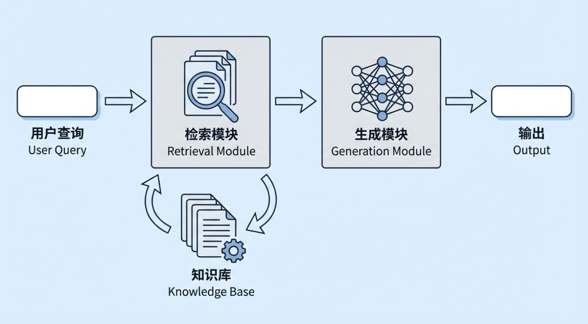

小哲的第一个念头很自然：既然大模型本身已经可以「直接回答问题」，为什么还需要额外增加「检索增强生成」这一层？尤其是现在大模型的上下文窗口越来越大，从 8K、128K 到如今突破百万 token，似乎只要把相关资料都提供给模型，让它先理解再回答，也能解决大部分需求。

真正的区别在于：**「能给出一个回答」** 和 **「在真实业务环境中，持续、稳定、可控地给出正确答案」**，是两件完全不同的事情。如果只是依赖模型参数中的「记忆」，或者仅仅把大量文档放进长上下文中，在企业实际应用中，依然会暴露出至少三类典型问题。

### 2.1 成本与效率的问题

即便大模型的上下文持续扩容，试图将所有文档「一股脑通通塞进去」的做法，在实际应用中依然不现实。核心矛盾集中在两点：

- **推理成本与上下文长度呈强正相关**：上下文越长，推理成本几乎呈线性甚至超线性上升。以单次调用为例，8K Token 与 200K Token 对应的价格、响应延迟，完全处于不同量级，长上下文的成本门槛显著更高；


> 上下文（context）从意义上指模型在回答当前问题时所「参考」的背景信息与对话历史；从技术上则是指一次推理时输入给模型的 Token 序列（如 system/user 指令、历史消息、检索片段等）的总和。
>
> 「上下文窗口」是这批输入内容的**容量上限**：模型一次最多只能「看到」这么多 Token。在当前主流的大模型架构（例如 Transformer）中，这些 Token 会在模型的每一层里彼此做注意力计算、反复参与运算，因此一旦窗口变长、Token 变多，计算量和成本都会成倍甚至指数级增加。

- **计算资源存在大量浪费**：绝大多数任务仅需极少量与当前问题高度相关的信息，将全量文档塞入上下文，会造成严重的计算资源闲置与浪费，进而降低系统吞吐量，拖慢响应速度，最终影响用户体验。

### 2.2 注意力与聚焦的问题

大模型虽能「覆盖」超长上下文，却无法对每一段信息都实现同等质量的利用。当上下文长度达到一定阈值时，模型会出现明显的「注意力偏差」：

- **注意力衰减**：模型对上下文前端、中端的信息关注度会逐渐减弱，更倾向于依赖刚读取的后端文本，导致早期关键信息被「忽略」；
- **信息干扰**：模型容易被上下文内无关、重复甚至冲突的信息「带偏」，即便最终回答看似逻辑自洽，实际也可能与核心问题脱节，准确性难以保证。

可见，若缺乏检索环节进行信息过滤与相关性排序，上下文越长，反而越难确保回答聚焦于真正关键的证据，长上下文的优势会被信息干扰完全抵消。

### 2.3 知识更新与可控性的问题

若将所有知识完全依赖模型参数存储，或手动复制到提示词中调用，会存在两个难以规避的天然缺陷：

- **知识更新困难**：一旦知识发生变更（如政策调整、产品迭代、价格更新等），要么需要重新训练或微调模型——投入高、周期长；要么需要人工逐次维护提示词模板——不仅成本高，还容易因人工操作失误导致信息偏差；
- **可追溯性差**：模型回答时究竟依据了哪些具体信息，人们往往难以从「黑盒化的参数」或冗长的提示词中定位核心证据，这使得合规审计、风控解释等需要明确「决策依据」的工作，面临极大的操作困难。

在这些现实约束下，RAG 的优势就更加清晰。它的核心做法是：在模型生成答案之前，先通过检索精准定位相关、可靠的信息，让模型只基于必要的知识生成回答。知识可以独立存储在外部知识库中，便于更新与管理；同时，生成结果可以附带引用来源，提升回答的可解释性与可信度。即便未来模型的上下文窗口继续扩大，RAG 依旧能够以较低成本实现知识的高效管理与利用，从而支撑起一个过程可观测、行为可追踪的企业级知识应用体系。

<InfoCard icon="💡" variant="tip">
**「能答出来」和「在真实业务里稳定答对」是两回事**

把资料一股脑塞进上下文，模型确实「能答出来」。但企业要的是：成本可控、答案聚焦、知识能更新、依据能追溯。RAG 的核心思路就一句话——**在模型生成之前，先精准检索出相关知识，让模型只基于必要的、可靠的资料作答。** 哪怕未来窗口再大，这套「按需检索」依然比「全文硬塞」更省、更准、更可控。
</InfoCard>

从企业需求出发，相比只依赖模型自身参数的传统 LLM，RAG 主要解决了企业在落地应用中面临的以下现实问题：

1. **时效性问题**：传统模型对 2024 年之后的新规、新产品、新流程往往不了解，而 RAG 可以直接读取最新的制度文件、业务数据库和知识库内容，无需频繁重新训练模型，就能让回答保持与最新业务同步。
2. **专业性问题**：通用大模型在医疗、化工、金融等垂直领域，常常存在「懂得不够深、说得不够准」的情况。接入企业自有专业文档和行业标准之后，模型回答可以基于权威资料，显著更贴近真实业务实践。
3. **「幻觉」问题**：通过要求回答尽量基于检索到的文档片段，并能够给出对应的出处引用，可以在机制上减少无依据编造内容的概率，让「说得像真的」更接近「确实是真的」。
4. **可解释与可审计问题**：纯参数模型给出结论时，往往难以回答「这是从哪条规定推导出来的」。RAG 让每条回答都可以回溯到具体的制度条款、业务文档或历史案例，既方便业务人员抽查和纠错，也为审计、风控、合规部门提供了必要的溯源依据。
5. **算力成本与资源效率问题**：让大模型在参数中「背下」所有企业知识，往往意味着更大的模型、更高的推理成本。RAG 通过「按需检索」把大部分知识存放在外部向量库和文档库中，使企业可以在较小模型和有限算力条件下，依然获得覆盖面更广、细节更准确的回答能力。

因此，对希望在真实业务场景中长期、稳定、可控地使用大模型的企业而言，RAG 不是一个可有可无的增强选项，而是构建高质量企业知识应用体系时几乎不可缺少的基础技术。想通这一点，小哲就明白了：Dify 知识库不是把他的手册「教」给了模型，而是在每次提问时，临时把相关段落找出来递给模型看。

---

## 3. 什么是 RAG：一个完整流程

RAG 的核心思路是让大模型在回答问题时，不仅依赖训练阶段学到的静态知识，更能够实时调用外部知识库中的最新、可靠信息。

在典型的 RAG 系统中，用户的问题不会被直接丢给大模型，而是先由检索模块从企业知识库中找到最相关的文档片段，再将这些内容与原始提问一起组合成完整的上下文，输入给大模型生成回答。这种「先检索、再生成」的方式，让模型能够基于真实参考资料进行推理，而不是仅凭参数中「记住」的知识进行推测。我们可以参考一个典型案例：


**① 索引阶段**

在索引阶段，系统会先处理企业内部文档、网页文章、报告等原始资料，将它们拆分成较小的语义片段（chunks），再用向量模型为每个片段生成向量表示并建立索引。这样，后续接收到用户问题时，就可以在向量空间中快速找到「语义最相近」的几段内容。

在图中，这一阶段对应右上角紫色区域「Indexing」。从「Documents」出发，经由「Chunks / Vectors」到「embeddings」的那一部分，就是在说明文档被切块并转换为向量、写入索引的过程。具体过程如下：

- 文档被划分为若干个语义相对完整的 chunks，每个 chunk 可能对应一小段新闻、一段说明或一段分析。
- 每个 chunk 会通过 embedding 模型转换成高维向量，并存入向量索引中。
- 这个索引支持后续基于相似度的检索，为回答问题提前准备好「可被查阅的知识库」。

**② 检索阶段 + 基于检索结果生成答案**

当用户提出问题后，系统会先从索引中检索相关内容，再把问题和检索到的文本一并交给大模型生成答案。图中从上到下、从右到左的几个关键区域，正好对应这一整条流程。

（1）用户输入问题——图中黄色区域 Input – Query

> "How do you evaluate the fact that OpenAI's CEO, Sam Altman, went through a sudden dismissal by the board in just three days, and then was rehired by the company, resembling a real-life version of 'Game of Thrones' in terms of power dynamics?"
>
> 「你如何评价这样一件事：OpenAI 的 CEO Sam Altman 被董事会突然解职，仅仅三天后又被公司重新聘回，在权力博弈上几乎像现实版《权力的游戏》？」

这一大段文字就是图中「Query」方框里的内容，对应「用户发起的自然语言提问」。系统会将这段话向量化，并据此去右上角的索引里查找相关文档片段。

（2）检索到的相关文档——图中右下角粉色区域 Relevant Documents

检索完成后，系统会得到若干个与问题最相关的文档块，它们在图中以三个 Chunk 的形式展示：

> "Sam Altman Returns to OpenAI as CEO, Silicon Valley Drama Resembles the 'Zhen Huan' Comedy"
> 「Sam Altman 回归担任 OpenAI CEO，这场硅谷大戏宛如一出《甄嬛传》式的宫斗喜剧。」
>
> "The Drama Concludes? Sam Altman to Return as CEO of OpenAI, Board to Undergo Restructuring"
> 「大戏要落幕了吗？Sam Altman 将重返 OpenAI CEO 职位，董事会则将进行重组。」
>
> "The Personnel Turmoil at OpenAI Comes to an End: Who Won and Who Lost?"
> 「OpenAI 的人事动荡告一段落：谁赢了，谁输了？」

（3）组合 Prompt 并生成回答——图中蓝色区域 LLM / Combine Context and Prompts

系统随后会将「用户原始问题 + 检索到的 chunks」组合成一个完整的 Prompt，发给大模型。图中中下部、靠中央的虚线框，就是这个 Prompt 的示例内容：

> "Question:
> How do you evaluate the fact that the OpenAI's CEO, … … dynamics?
>
> Please answer the above questions based on the following information :
> Chunk 1 :
> Chunk 2 :
> Chunk 3 :"
>
> 「问题：
> 你如何评价 OpenAI 的 CEO …… 这件事中的权力博弈？
>
> 请基于下面提供的信息来回答上述问题：
> Chunk 1：
> Chunk 2：
> Chunk 3：」

（4）有无 RAG 的回答对比——图中左下角灰色 / 黄色区域 Output – Answer

最后，大模型基于这些信息生成答案，结果展示在图的左下角「Answer」区域。这里同时给出了「未使用 RAG」和「使用 RAG」两种情况下的输出示例。不用 RAG 时，模型缺乏外部资料，只能给出非常模糊的回应，对应灰色框里那段话：

> "… I am unable to provide comments on future events. Currently, I do not have any information regarding the dismissal and rehiring of OpenAI's CEO …"
>
> 「……我无法就未来事件发表评论。目前我没有关于 OpenAI CEO 被解雇和重新聘用的任何信息……」

使用 RAG 时，模型可以利用刚才检索到的新闻和分析，给出更有信息量的回答，对应黄色框中那段文本：

> "… This suggests significant internal disagreements within OpenAI regarding the company's future direction and strategic decisions. All of these twists and turns reflect power struggles and corporate governance issues within OpenAI …"
>
> 「……这表明 OpenAI 内部在公司未来方向和战略决策上存在重大分歧。这一连串的反复与曲折，反映出 OpenAI 内部的权力斗争以及公司治理方面的问题……」

以上展示了一个典型 RAG 系统的完整流程，让小哲从整体上理解了系统包含哪些核心环节、信息如何在各阶段流转。但是，检索时如何进行向量匹配？提示词如何组织才能让模型更好地利用检索到的内容？这些决定 RAG 实际效果的技术细节，目前仍是「黑盒」。接下来，我们将深入 RAG 的内部机制，从向量化原理、相似度计算、到提示词工程等关键环节，逐步拆解 RAG 究竟是如何工作的。

<SummaryCard title="RAG 的三步全景" :sections="[
  { number: '1', title: '切分 + 向量化（入库时做一次）', items: ['把长文档切成语义完整的小片段 chunk', '用 Embedding 模型把每个 chunk 变成一串数字（向量）', '把向量连同原文存进向量数据库'] },
  { number: '2', title: '检索（每次提问实时做）', items: ['把用户问题也用同一个 Embedding 模型变成向量', '算问题向量和库里所有向量的相似度', '取相似度最高的 Top-K 段，过滤掉太低的'] },
  { number: '3', title: '增强生成（每次提问实时做）', items: ['把检索到的片段 + 用户问题拼成一个完整提示词', '要求模型只依据这些片段作答、注明出处', '模型输出有据可循的答案'] }
]" />

---

## 4. RAG 如何工作：一个「苹果」知识库的逐步拆解

小哲跟着教程，用一个「苹果」的知识库问答案例，逐步拆解 RAG 的关键环节。

### 4.1 文档向量化阶段

假设我们有一个简化的知识库，包含以下三个文档片段：

1. **文档片段 A**：苹果公司于 1976 年 4 月 1 日由史蒂夫·乔布斯、史蒂夫·沃兹尼亚克和罗纳德·韦恩创立，总部位于加利福尼亚州库比蒂诺。
2. **文档片段 B**：苹果是一种水果，富含维生素 C 和膳食纤维，有助于消化和免疫系统健康。
3. **文档片段 C**：苹果公司在 2007 年推出了第一款 iPhone，彻底改变了智能手机行业。

当我们使用嵌入模型（如 OpenAI 的 text-embedding-ada-002 或开源的 BGE 模型）处理文档时，每个文档片段会被转换为高维向量（通常含 768、1024 或 1536 个维度）。

> 「向量」本质是由多个数值组成的数组，每个维度的数值都对应文本某一维度的语义特征，比如「猫」的向量中，可能有维度对应「哺乳动物」「家养宠物」「有毛」等属性，最终通过整体数值组合精准捕捉文本的语义含义，让计算机能「读懂」文本间的关联。

简化示例（实际向量维度高得多，这里仅示意）：

- 文档 A 向量（关于苹果公司创立）：`[0.85, -0.23, 0.41, -0.56, 0.12, 0.78, ...]`
- 文档 B 向量（关于水果苹果）：`[-0.12, 0.95, -0.34, 0.67, -0.89, 0.05, ...]`
- 文档 C 向量（关于 iPhone 发布）：`[0.79, -0.18, 0.52, -0.61, 0.23, 0.81, ...]`

注意看：A 和 C 的数值走势明显接近（都是科技公司话题），B 跟它俩差得很远（水果话题）。相关向量需存入向量数据库（如 Pinecone、Weaviate、FAISS）用于之后的检索召回工作。

> 数据库是按特定结构存储、管理数据的系统，核心功能是实现数据的有序存储与高效存取，常见于通讯录、电商商品库等场景。
>
> 而向量数据库是数据库的细分类型，区别于传统数据库存储文本、表格等数据的逻辑，它专门用于存储「向量」（高维数值数组），并优化了向量相似性检索能力，以适配 AI 场景下的高维数据管理需求。

<InfoCard icon="🧭" variant="info">
**向量到底是什么？**

向量本质就是一个数字数组，每个维度对应文本的某种语义特征。你可以粗略想象：某些维度代表「跟科技公司有关吗」，某些代表「跟食物有关吗」。讲苹果公司的文档 A 和讲 iPhone 的文档 C，在「科技公司」那些维度上数值接近；讲水果的文档 B 则在「食物」维度上突出。**语义越接近的文本，向量在空间里靠得越近**——这正是后面能「按意思检索」的基础。
</InfoCard>

::: warning 切分不是随便切
真实文档很长，要先按语义切成一段段 chunk，每段尽量讲一个相对完整的意思。chunk 切太大，一段里混了好几个主题，检索会不精准；切太小，又会把一句完整的话拦腰斩断，丢失上下文。chunk 大小和重叠（overlap）是 RAG 里最影响效果的工程参数之一，下周会专门讲。这周先记住：**切分质量直接决定检索质量。**
:::

### 4.2 用户查询检索、回复阶段

在知识库完成向量化存储后，RAG 系统便能够支持用户的实时查询操作。当用户提出问题时，系统会执行一套连贯的流程：先将问题转化为向量，再通过相似度计算从知识库中召回最相关的信息片段，最终将这些片段作为生成答案的依据。我们通过三个具体查询来完整呈现这一过程。

#### 查询一：「苹果公司是什么时候创立的？」

在查询向量化阶段，此问题被嵌入模型转换为一个语义向量，例如 `[0.82, -0.21, 0.38, -0.58, 0.15, 0.76, ...]`。该向量在数值模式上，与之前存储的「文档 A 向量」（关于公司创立）`[0.85, -0.23, 0.41, -0.56, 0.12, 0.78, ...]` 高度相似。

接下来系统将进行相似度检索（Top-K, K=2）操作，计算该查询向量与知识库中所有文档向量的余弦相似度（一种衡量向量方向接近程度的指标）。结果如下：

- 与文档 A（公司创立）相似度：0.97（高度相关）
- 与文档 C（iPhone 发布）相似度：0.88（相关，同属公司主题）
- 与文档 B（水果营养）相似度：0.12（几乎不相关）

> Top-K 是向量检索场景中常用的筛选策略，核心含义是「从所有匹配结果中，按相似度从高到低排序后，选取排名前 K 个的结果」；而 K=2 则是对该策略的具体数值定义，即明确要求系统仅保留相似度排名前 2 的文档向量，过滤掉其余相似度更低的结果，以确保后续仅基于最相关的 2 个文档片段生成答案。

此时根据相似度值过滤后的返回结果我们叫做召回结果。系统根据相似度分数从高到低，返回 Top-2 的文档片段作为证据：

1. 文档 A（相似度 0.97）：「苹果公司于 1976 年 4 月 1 日由史蒂夫·乔布斯、史蒂夫·沃兹尼亚克和罗纳德·韦恩创立，总部位于加利福尼亚州库比蒂诺。」
2. 文档 C（相似度 0.88）：「苹果公司在 2007 年推出了第一款 iPhone，彻底改变了智能手机行业。」

在根据检索结果对话的大模型回复阶段，系统会构建如下所示的完整对话输入，将召回的结果放入参考信息中，和系统提示一起发送给 LLM：

```text
【系统指令 (System Prompt)】
你是一个专业的问答助手。请严格根据用户提供的“参考信息”来回答问题。
如果参考信息中包含问题答案，请直接基于该信息进行回答。
如果参考信息中不包含问题答案，请明确告知用户“根据现有资料无法回答该问题”，切勿自行编造信息。
请在回答中注明依据的信息点。
【参考信息 (Retrieved Context)】
苹果公司于1976年4月1日由史蒂夫·乔布斯、史蒂夫·沃兹尼亚克和罗纳德·韦恩创立，总部位于加利福尼亚州库比蒂诺。
苹果公司在2007年推出了第一款iPhone，彻底改变了智能手机行业。
【用户问题 (User Query)】
苹果公司是什么时候创立的？
```

LLM 接收到上述结构化输入后，会遵循系统指令，将「参考信息」视为回答问题的唯一可信来源。其最终回复将类似：

> 根据提供的参考信息，苹果公司于 1976 年 4 月 1 日创立。【依据：信息 1】

#### 查询二：「吃苹果有什么好处？」

在查询向量化阶段，此问题被嵌入模型转换为一个语义向量，例如 `[-0.08, 0.92, -0.31, 0.71, -0.85, 0.08, ...]`。该向量在数值模式上，与之前存储的「文档 B 向量」（关于水果营养）`[-0.12, 0.95, -0.34, 0.67, -0.89, 0.05, ...]` 高度相似。

接下来系统将进行相似度检索（Top-K, K=2）操作，计算该查询向量与知识库中所有文档向量的余弦相似度。结果如下：

- 与文档 B（水果营养）相似度：0.95（高度相关）
- 与文档 C（iPhone 发布）相似度：0.18（几乎不相关）
- 与文档 A（公司创立）相似度：0.15（几乎不相关）

系统根据相似度分数从高到低，返回 Top-2 的文档片段作为证据：

1. 文档 B（相似度 0.95）：「苹果是一种水果，富含维生素 C 和膳食纤维，有助于消化和免疫系统健康。」
2. 文档 C（相似度 0.18）：「苹果公司在 2007 年推出了第一款 iPhone，彻底改变了智能手机行业。」（相关性极弱，实际可能被阈值过滤）

在根据检索结果对话的大模型回复阶段，系统会构建如下所示的完整对话输入，将召回的结果放入参考信息中，和系统提示一起发送给 LLM：

```text
【系统指令 (System Prompt)】
 你是一个专业的问答助手。请严格根据用户提供的“参考信息”来回答问题。
 如果参考信息中包含问题答案，请直接基于该信息进行回答。
 如果参考信息中不包含问题答案，请明确告知用户“根据现有资料无法回答该问题”，切勿自行编造信息。
 请在回答中注明依据的信息点。
【参考信息 (Retrieved Context)】
 苹果是一种水果，富含维生素C和膳食纤维，有助于消化和免疫系统健康。
 苹果公司在2007年推出了第一款iPhone，彻底改变了智能手机行业。
【用户问题 (User Query)】
 吃苹果有什么好处？
```

LLM 接收到上述结构化输入后，其最终回复将类似：

> 根据提供的参考信息，苹果富含维生素 C 和膳食纤维，食用苹果有助于消化以及免疫系统健康。【依据：信息 1】

#### 查询三：「今天天气怎么样」

在查询向量化阶段，此问题被嵌入模型转换为一个与气象、天气相关的语义向量，例如 `[0.10, -0.05, 0.30, -0.12, 0.21, 0.08, ...]`。该向量在数值模式上，与知识库中所有关于「苹果（公司/水果）」的文档向量在语义空间中距离较远，因此不会出现显著相似性。

接下来系统将进行相似度检索（Top-K, K=2）操作，计算余弦相似度。由于问题主题与知识库内容无关，整体相似度得分都很低。结果如下：

- 与文档 B（水果营养）相似度：0.18（极低）
- 与文档 C（iPhone 发布）相似度：0.10（几乎不相关）
- 与文档 A（公司创立）相似度：0.08（几乎不相关）

Top-K 仍会返回相似度排名前 K 个结果，但在该场景下，这些结果并不能提供有效证据。实际系统常会结合「最低相似度阈值」直接返回空召回，即没有任何召回的结果，参考信息为 0，以减少无关信息干扰。

1. 文档 B（相似度 0.18）：「苹果是一种水果，富含维生素 C 和膳食纤维，有助于消化和免疫系统健康。」
2. 文档 C（相似度 0.10）：「苹果公司在 2007 年推出了第一款 iPhone，彻底改变了智能手机行业。」

在根据检索结果对话的大模型回复阶段，系统会构建如下完整输入：

```text
【系统指令 (System Prompt)】
 你是一个专业的问答助手。请严格根据用户提供的“参考信息”来回答问题。
 如果参考信息中包含问题答案，请直接基于该信息进行回答。
 如果参考信息中不包含问题答案，请明确告知用户“根据现有资料无法回答该问题”，切勿自行编造信息。
 请在回答中注明依据的信息点。
【参考信息 (Retrieved Context)】
 苹果是一种水果，富含维生素C和膳食纤维，有助于消化和免疫系统健康。
 苹果公司在2007年推出了第一款iPhone，彻底改变了智能手机行业。
【用户问题 (User Query)】
 今天天气怎么样？
```

LLM 接收到上述结构化输入后，会先判断参考信息是否包含「天气/气象/实时数据」等直接信息；在确认参考信息与问题无关后，会遵循系统指令执行「无法回答」。其最终回复将类似：

> 根据现有资料无法回答「今天天气怎么样」，因为参考信息仅包含与苹果（水果营养、苹果公司产品）相关内容，不包含天气信息或实时气象数据。【依据：参考信息中无天气相关信息】

::: tip 阈值过滤是「不瞎编」的关键
Top-K 总会返回 K 个结果，哪怕它们其实都不相关。所以真实系统通常再加一道**最低相似度阈值**：分数低于阈值的一律不算证据。问题三因为没有任何片段过阈值，召回结果为空——这就是上周小哲看到的「资料里没有」**为什么不瞎编**的原因：没检索到证据，就明确告诉用户答不了。
:::

通过以上三个实例可以看出，在检索增强生成的大模型对话阶段中，系统指令设定了 LLM 的角色和回答规则，检索证据提供了具体、可信的作答素材，用户问题则明确了任务目标。这种结构化的输入方式，正是 RAG 技术能够有效引导并约束原本可能产生「幻觉」的大模型，使其输出稳定、可靠答案的关键所在。它确保了大模型的能力被精准地应用于理解与组织已有信息，而非无根据地创造信息。

<InfoCard icon="🛡️" variant="tip">
**提示词里的三件套，缺一不可**

- **系统指令**：给模型定规矩——只依据参考信息、查不到就说查不到、要注明出处。这是约束幻觉的「紧箍咒」。
- **检索证据**：提供具体、可信的作答素材，模型只负责理解和组织，而不是凭空创造。
- **用户问题**：明确这次要回答什么。

正是这种结构化输入，把一个可能胡说八道的模型，约束成了一个有据可循的答题者。
</InfoCard>

到这里小哲恍然大悟：换个说法也能命中，是因为「钱怎么报」和「报销流程」向量化后方向接近；老老实实说没有，是因为阈值过滤拦住了无关问题。**整套判断靠的是向量相似度，不是模型「记得」。**

---

## 5. RAG 技术演进史

RAG 技术并非诞生于大模型时代，在更早期的研究中就已有雏形。从发展脉络来看，RAG 的出现源于对传统 LLM 局限性的认识。早期的大语言模型主要依赖预训练数据，这些数据往往在模型训练完成后就固定下来，无法获取后续更新的信息。例如，GPT-3 等模型的知识截止点通常在训练数据收集的日期之后，无法获取新知识。此外，重新训练或微调 LLM 以适应特定领域需要大量资源和专业知识，成本高昂且难以快速迭代。

RAG 技术的起源可以追溯到 2017 年的 DrQA 框架，该框架首次尝试将检索机制与语言模型相结合。随后，2020 年引入的 Dense Passage Retrieval (DPR) 标志着 RAG 技术的重大突破，它利用预训练的神经网络模型进行语义检索，而非传统的 TF-IDF 或 BM25 等基于词频的方法。2021 年，RAG 被正式提出并系统化，成为解决 LLM 知识截止和幻觉问题的标准方法。

整体来看，RAG 的演进大致可以分为三个阶段：

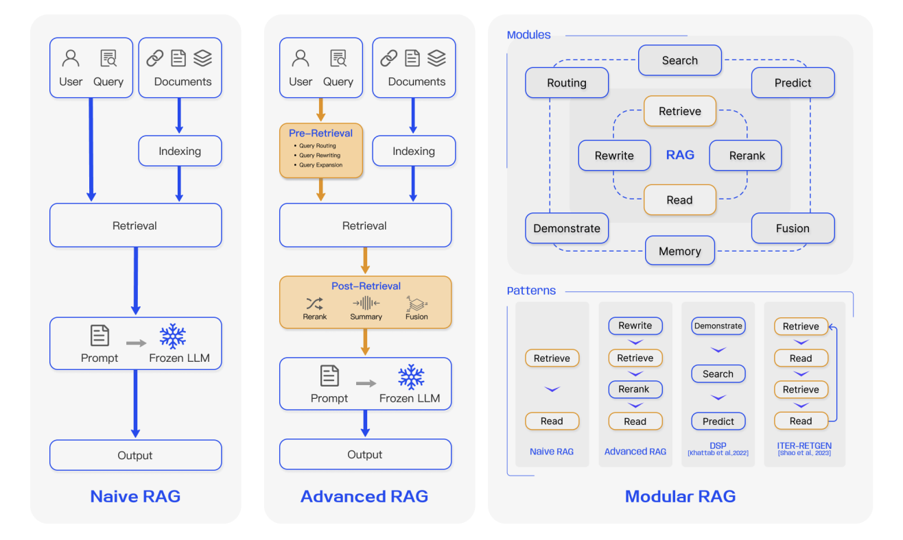

### 5.1 第一代 RAG：Naive RAG（基础检索增强）

Naive RAG 可以理解为基础的 RAG 形态，它在工程上非常直接，典型流程可以概括为「三步走」：第一步是文档预处理与索引，将原始文档经过清洗之后，按固定长度切分成若干文本块（chunks），再用嵌入模型将每个文本块编码为向量，写入向量数据库；第二步是基于相似度的检索，将用户的自然语言问题编码成向量，在向量库中执行 Top-K 相似度搜索，取回相似度最高的若干文本块；第三步则是简单拼接后的增强生成，把这些检索出来的文本块和原始问题直接拼在一起，构成一个长提示词交给 LLM，由模型在这个上下文基础上生成回答。

这一阶段的价值在于，以极低门槛验证了「先查再答」的思路确实有效：相比完全依赖模型内部记忆，已经能明显缓解知识截止和部分幻觉问题，在早期的原型系统和示例工程中发挥了重要作用。这使得 RAG 从一开始就具备了很强的实用性，成为大量 Demo、原型系统和入门教程的首选方案。

然而，这一代 RAG 的局限同样非常明显。首先，文本分块策略通常比较粗糙，大多采用固定长度切分，容易把一个完整的语义段落从中间「截断」，也可能把多个主题混杂在同一个块里，既影响检索准确性，也会给 LLM 的理解带来额外负担。其次，检索信号非常单一，往往只依赖向量相似度进行排序，没有利用关键词、时间戳、来源可信度、访问权限等更丰富的结构化线索。再次，检索结果几乎不经过筛选和治理，噪音、重复甚至彼此矛盾的片段都会原样塞进上下文，使得本来就紧张的上下文窗口被大量「低价值信息」占据。

可以说，第一代 RAG 解决了「要不要检索」的问题，但在「如何更好地检索」和「检回来的东西如何更合理地用起来」这两个问题上，还停留在相当原始的阶段。

::: tip 小哲的对照
小哲发现，自己第 7 节里手写的那个最小 RAG，正好就是一个标准的 Naive RAG：固定切分、纯向量相似度、检索结果直接拼提示词。这说明他已经亲手走完了 RAG 的「第一代」，下一步要理解的是工业界怎么把它优化得更稳。
:::

### 5.2 第二代 RAG：Advanced RAG（检索与上下文的精细化优化）

随着 RAG 应用从 Demo 走向真实业务场景，系统对稳定性、可控性以及结果质量的要求迅速提高。此时出现的第二代 RAG，通常可以笼统地称作 Advanced RAG，它仍然遵循先检索、再生成的方法，但在检索前和检索后两个环节引入了系统化的精细化优化策略。换句话说，不再满足于「能不能检到东西」，而是要「把该存的东西存好，把该问的问题问清，把检回来的上下文治理好」。

**在检索前**，重点是把「存什么」和「怎么问」处理好：

- 在索引端，从固定长度切分演进到语义感知分块与分层索引，例如按章节、小节、段落或句子边界进行切分，辅以滑动窗口和多粒度索引结构。
- 为每个文档块附加丰富的元数据，例如来源、时间、作者、主题、文档类型等，为后续的过滤和排序提供更多维度。
- 在查询端，对用户原始问题进行重写、扩展和拆分，例如通过 Query Rewrite、多路查询（Multi-Query）、子问题分解（Sub-Query）、Step-back Prompting 等方式，将含糊或口语化的问题转换为更利于检索理解的表达。

  > **1. Query Rewrite（查询重写）**
  >
  > 核心是将用户模糊、口语化或不规范的原始查询，转化为检索系统更易理解的标准化表述，补充关键信息、修正歧义。
  >
  > - 用户原始问题为「咋查明天北京的天气啊」，会去除「咋」「啊」等口语化词汇，补充「实时」「全天」等关键限定，重写为「查询北京市明日全天实时天气」；
  > - 用户原始问题为「推荐好看的电影」，若结合用户历史行为发现其常看悬疑片，会补充「2024 年高分」「悬疑题材」等信息，重写为「推荐 2024 年高分悬疑题材电影」。
  >
  > **2. Multi-Query（多路查询）**
  >
  > 基于原始问题生成多个「语义相关但角度不同」的查询语句，避免单一查询遗漏潜在结果，覆盖用户未明确的潜在需求。
  >
  > - 用户原始问题为「如何给刚满月的宝宝拍嗝」，会生成聚焦「姿势」的查询：「新生儿拍嗝的正确姿势」；
  >   - 生成聚焦「防吐奶」的查询：「满月宝宝拍嗝避免吐奶的方法」；
  >   - 生成聚焦「月龄适配」的查询：「婴儿拍嗝的步骤（0-1 个月）」；
  >   - 生成聚焦「新手场景」的查询：「新手爸妈给满月宝宝拍嗝技巧」。
  >
  > **3. Sub-Query（子问题分解）**
  >
  > 针对包含多个诉求的复合问题，拆分为独立、简单的子查询，让检索系统针对单一诉求精准匹配数据，避免信息混杂缺失。
  >
  > - 用户原始复合问题为「北京到上海的高铁，明天有哪些班次？票价多少？需要坐多久？」，会拆解出聚焦「班次」的子查询：「北京市至上海市 明日高铁班次表」；
  >   - 拆解出聚焦「票价」的子查询：「北京到上海高铁 二等座 / 一等座票价」；
  >   - 拆解出聚焦「时长」的子查询：「北京到上海高铁 行驶时长（最快 / 平均）」。
  >
  > **4. Step-back Prompting（回溯提示）**
  >
  > 先生成「比原始问题更宏观的上位问题」，再基于上位逻辑回推检索方向，解决原始问题因聚焦细节导致的理解偏差。
  >
  > - 用户原始问题为「为什么 2024 年某国产新能源汽车品牌的销量突然下降？」，第一步生成宏观上位问题：「影响新能源汽车品牌短期销量波动的核心因素有哪些？」（如产品迭代、竞品动作、政策变化、市场需求等）；
  > - 第二步基于上位问题逻辑，生成具体检索方向：「2024 年某国产新能源品牌 产品更新情况」「2024 年新能源汽车市场 竞品定价策略」「2024 年新能源汽车补贴政策调整」。

**在检索后**，重点是把「取回来的内容」治理好：

- 使用专门的 Rerank 模型或 LLM 对候选文档进行重新排序，确保最关键、最贴近问题的内容优先进入上下文。

  > Rerank 模型是信息检索流程中的关键组件，主要用于对「召回阶段」初步筛选出的候选结果进行二次排序——它会借助更复杂的语义理解能力（常基于 Transformer 等深度学习架构），分析用户需求与候选结果的深层关联，修正初步排序中可能存在的语义偏差，最终让更贴合用户需求的结果排在更靠前的位置，提升用户获取有效信息的效率。

- 对检索结果进行筛选、去重与压缩，去掉明显无关或高度重复的片段，缓解长上下文中部信息被忽略的问题。
- 在必要时，结合轻量的模型微调，使 LLM 更倾向于依据检索证据作答，并在回答中附带引用或出处信息。

总体来看，第二代检索增强生成技术其关注点不再局限于「是否需要检索」「能否检索到信息」这两个基础问题，而是进一步聚焦于三个更大的挑战：「能否精准定位到真正关键的段落内容」「传递给大模型的上下文是否简洁有序、具备清晰结构且易于高效利用」「当面临信息噪音、内容冲突或多资料源查找需求时，系统整体性能是否依然稳健可靠」。

从大量实验验证与工程落地实践来看，Advanced RAG 在问答准确率、幻觉抑制能力、系统鲁棒性及结果可解释性等关键指标上，均显著优于 Naive RAG。也正因此，Advanced RAG 已逐步取代传统方案，成为当前工业界构建 RAG 系统的主流技术范式。

### 5.3 第三代 RAG：Modular RAG

在企业级的复杂应用场景中，需求往往跨越多个领域。在这种情况下，RAG 系统若仅采用检索、重排、生成这样的单一线性处理方式，常常难以应对：

1. 同一系统既要支持简单 FAQ，又要生成长篇报告、进行代码检索或调用数据库。
2. 需要同时接入向量库、全文检索、关系数据库、知识图谱以及外部搜索引擎等多种数据源。
3. 需要在多轮交互中保持对用户偏好、历史决策的记忆，并对输出结果实施合规审核和溯源。

在这样的背景下，RAG 的系统形态开始向模块化演进。Modular RAG 不再被看作一条固定的流水线，而是由一组可插拔、可替换、可组合的功能模块组成，通过编排逻辑按需组合执行。典型模块包括：

1. **查询理解与路由模块**
   用于意图识别、问题重写、子任务拆解和路径选择，决定一条请求是主要依赖内部知识，还是外部检索，抑或需要调用特定工具或数据库。
   例如，用户问「这条错误日志代表什么问题？」系统会将其路由到代码与日志知识库；而问「最近该行业的监管新规有哪些变化？」则更适合走互联网搜索或合规法规库。
2. **多源检索与融合模块**
   同时连接向量数据库、全文检索系统、结构化数据库与知识图谱，对不同数据源进行查询，并将结果进行统一的融合与排序。
   例如，在做「客户年度分析报告」时，一部分信息来自 CRM 数据库（如客户成交额），一部分来自文档库（如项目复盘），还可能需要从知识图谱中补充行业关系，最终由该模块将多源结果合并成一份有序的证据集。
3. **记忆与个性化模块**
   维护长期用户画像、短期会话记忆和领域知识缓存，使系统能够在长期交互中不断积累和利用历史信息。
   比如，系统记住某位用户偏好「先给结论再给细节」，以及他所在的业务线与常用术语，下次回答时会自动采用对应风格，并优先使用与该业务线相关的案例和数据。
4. **任务适配与治理模块**
   面向不同任务加载对应的适配器，对输出格式、语气、风格进行约束，并结合事实核查、风险过滤和引用对齐等机制，对生成结果进行治理。
   例如，同样是基于同一批检索结果，为产品经理生成的是结构化 PRD 模板，为法务人员则是正式合规审查意见；在此过程中，该模块会对关键事实进行二次核查，并强制要求给出引用来源。

总的来说，传统 RAG 往往是一轮检索配合一轮生成就结束，而 Modular RAG 则打破了这种单一流程。当系统在生成过程中发现信息不足时，可以主动触发新的检索轮次，甚至多次往返检索与生成，以完成更复杂的任务。

进一步地，模型还可以学习自我决策：对于把握较大的问题直接基于内部知识或短上下文作答；遇到不确定的情况时才发起检索或调用外部工具，从而在保证质量的前提下提高效率、节约资源。对于那些表达不清、信息缺失严重的查询，系统甚至可以先由大模型生成一个假设性的答案或中间文档，再以此作为「线索」去检索真实文档，不断逼近可靠信息源。

在这一阶段，RAG 已经不再只是给大模型补几段参考资料的简单组件，而逐步演变为企业级智能应用的中枢式知识编排层，负责在多数据源、多工具、多任务之间进行协调与调度。

---

## 6. 从 Demo 到企业级的 RAG 系统

从企业工程实践的角度来看，RAG 系统的构建不能仅局限于检索增强生成技术本身，前面提到的内容更多是一个 Demo 级别的介绍。由于实际业务场景中的数据往往存在质量参差不齐、格式混乱等问题，因此需要在数据预处理、清洗及导入环节投入更多精力，同时在各个关键节点做好模型选型。

一个完整的企业级 RAG 系统通常可以划分为三个核心模块：版面分析与知识采集、知识库构建、以及基于 RAG 的知识问答服务。在整个技术链路中，涉及多个关键模型的选型决策，包括 Embedding 模型、Rerank 模型和 LLM 模型。只有在每个环节都做出合理的技术选型，才能确保系统达成最佳效果。

1. **版面分析与本地知识文件读取**

   这一模块负责将各种格式的本地知识资产转换为可用于检索的文本。输入可能包括 PDF、TXT、HTML、Word、Excel、PPT 等文档，也包括 PNG、JPG 等图片类扫描文件，甚至是语音录音。

   系统需要针对不同格式做解析，对文本文档做版面分析与结构抽取，区分标题、正文、表格、页眉页脚等元素，恢复合理的阅读顺序。对图片类文件进行 OCR 识别，对语音进行语音转写（ASR），最终统一转换为较为干净的知识文本，并尽量保留一些基础元信息，如文档名、章节、页码、时间等，为后续切分和索引打下基础。

2. **知识库构建（切分、Embedding、索引）**

   在拿到清洗后的知识文本后，需要先进行合理的文本切分（Chunking），把长文档拆成若干语义相对完整、长度适中的文本块，通常按段落、标题结构或滑动窗口切分，同时保留每个块对应的文档来源和元数据。

   随后，使用选定的 Embedding 模型，如 text-embedding-3-small、Sentence Transformers、BGE 等，对每个文本块计算向量表示，并基于这些向量构建向量索引，如使用 Faiss、Milvus、向量搜索服务等，就得到一个可按语义相似度进行快速查询的知识库。至此，我们完成了知识转换为可检索向量的核心步骤。

3. **基于 RAG 的知识问答（召回、排序、拼接、生成）**

   在在线问答阶段，用户首先发出查询请求，系统会对查询进行 Embedding，得到查询向量，并在向量索引中检索出一批最相似的文本块（Top N），这是粗排阶段。在此基础上，可以选用 Rerank 模型，如 BGE Reranker 或 LLM 充当 Reranker，对查询与文档对进行精排打分，从中选出 Top K 个真正最相关的文档作为知识上下文。

   接着，结合精心设计的系统提示词如「请严格基于以下资料回答」等等，将用户查询和检索出的文档片段进行拼接，把这个合并后的提示发给 LLM，由它在检索得到的证据基础上生成最终答案，并在需要时附上引用或出处。

### 6.1 模型选型

接下来我们关注各环节的模型选型，一个完整的 RAG 系统通常涉及三类核心模型：即 Embedding 模型、Rerank 模型和大语言模型。这三类模型各司其职，共同构成了从知识检索到答案生成的完整流程。其中，Embedding 模型负责将文本转化为可检索的语义向量，Rerank 模型对初步检索结果进行精细筛选与重排序，大语言模型则基于筛选后的知识上下文生成最终答案。

#### 6.1.1 Embedding model

在 RAG 系统中，Embedding 模型的作用是将文本，如用户查询和知识库内容，转换为高维向量。语义相近的文本，其向量在空间中的位置也更接近，这使得系统能够通过向量相似度快速定位相关知识。因此，选择合适的 Embedding 模型是构建高性能 RAG 系统的关键一步，直接决定了召回阶段的质量。

为了选出好的模型，我们在这里介绍一个系统化的评价基准：MTEB（大规模文本嵌入评测基准）。

MTEB 为各类 Embedding 模型提供了一个统一、客观的评估框架。它通过 8 大类任务、56 个数据集，全面评测模型在检索、聚类、分类、重排序、文本匹配、语义相似度等多种场景下的表现。模型在 MTEB 上的整体得分，能够反映其向量表示能力的通用性和稳健性，可作为选型的重要数据参考。最新排名和详细结果可通过 [HuggingFace MTEB Leaderboard](https://huggingface.co/spaces/mteb/leaderboard) 查看。

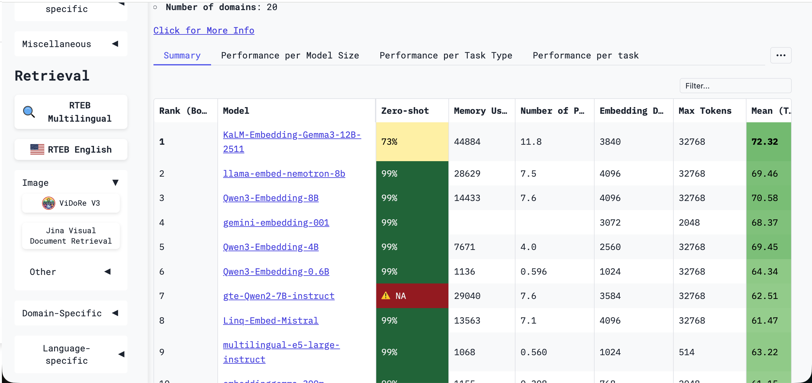

尽管榜单上存在大量模型，你可以根据实际需求进行选择，并不需要掌握所有的模型（一般来说，选择大模型厂商自带的 Embedding 模型，或者使用云服务平台部署对外使用的模型就大概率不会错，因为这个是大多人检验后的标准），你还可以在侧边栏中选择具体的类别或者语言进行筛选：

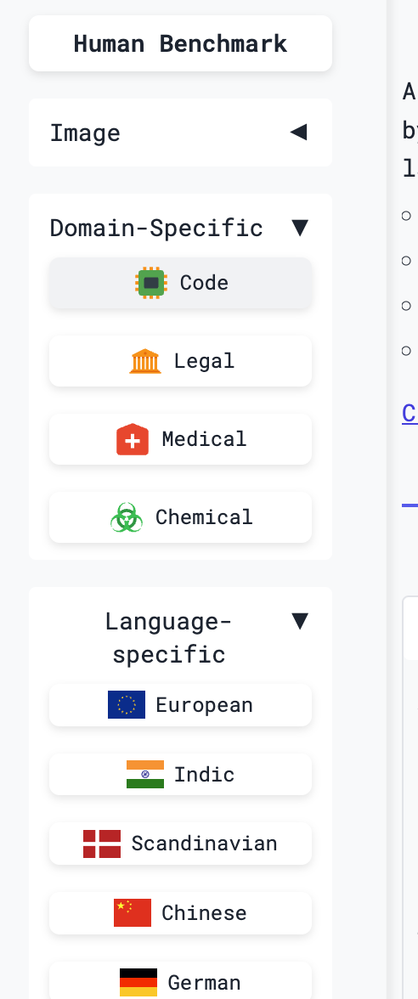

此外，在筛选 Embedding 模型时，需重点关注直接影响 RAG 性能的两个核心参数：**维度**和**上下文长度**。其中，维度是指模型输出向量的维度数（如 128 维、768 维），它本质上反映了描述语义信息时所使用的「特征数量」。维度越高，向量能刻画的语义细节越丰富、区分度越强，例如一个 768 维的向量可以从品种、口感、产地等数百个角度精细表征「苹果」，从而更适用于医疗、法律等需要精准检索的专业场景；维度越低，则计算与存储成本越小、检索速度越快，适合千万级文档等高并发、强实时性要求的通用场景。

另一个参数 Context Length（上下文长度），指 Embedding 模型单次可处理的最大文本长度（以 token 为单位，1 英文 token 约 0.75 个单词、1 中文 token 约 1 个汉字），超出部分会被截断：它直接决定模型能否完整理解文本，若长度不足导致信息丢失，会大幅降低检索准确性。因此处理用户短句、问答对这类短文本时，选 512-1024 token 的模型即可；处理论文、报告等长文本时，需选 2048 token 及以上的模型以避免关键信息丢失。

以下是几种常见 Embedding 模型的横向对比，你需要在实际调用过程中综合成本、性能进行选择最佳模型，没有最好的模型，只有对比多个模型的效果选出最合适的模型。

| 模型名称                      | 模型规模                         | 核心优势                                       | 适用场景                                                    |
| ----------------------------- | -------------------------------- | ---------------------------------------------- | ----------------------------------------------------------- |
| OpenAI text-embedding-3-large | 闭源 API                         | MTEB 测试集上长期领先，成熟稳定                | 追求极致性能且预算充足的云端 API 场景，适合对延迟不敏感的应用 |
| jina-embeddings-v2            | 支持长文本（最高 8K 上下文）     | 异步编码设计，处理长文档检索时强有力           | 需要长上下文理解的文档分析、法律合规、学术文献检索          |
| multilingual-e5-large         | Large 规模                       | 经典的多语言备选方案                           | 跨语言 RAG、国际化产品、多语种客服系统                      |
| Qwen/Qwen2-Embedding-8B       | 8B 参数，支持最高 4096 维自定义  | 曾 MTEB 多语言榜第一，长文本、多语言与代码能力强 | 高精度中英文 RAG、长文档分析、代码检索                    |
| Qwen/Qwen2-Embedding-4B       | 4B 参数                          | 性能与效率平衡                                 | 大规模生产级 RAG 系统，性价比高                             |
| Qwen/Qwen2-Embedding-0.6B     | 0.6B                             | 适用于边缘端                                   | 资源不够的场景，需要速度优先的场景                          |
| BAAI/bge-m3                   | 支持混合检索（密集+稀疏+多向量） | 在 MIRACL 等跨语言基准领先                     | 需要混合检索策略的复杂多语言场景                            |
| BAAI/bge-large-zh-v1.5        | Large 规模                       | 中文 RAG 的稳定基线，社区验证充分              | 纯中文且文档较短、追求稳定性的项目                          |
| 智谱 AI Embedding-3           | 闭源云端 API                     | 支持自定义维度（256-2048 维）                  | 注重中文且偏好云端 API 服务的应用                           |

#### 6.1.2 Rerank model

在 RAG 系统中，Rerank 模型的作用是对初步检索结果进行精细化重排序。它接收用户查询和候选文档作为输入，为每对（查询-文档）计算精确的相关性分数，分数越高表示文档与查询的匹配度越好。因此，在 Embedding 召回的基础上引入 Rerank 模型，是提升 RAG 系统检索精度的关键一步。

在选择 Embedding 模型时，我们可以用 MTEB 这样的 benchmark。而对于 Rerank 模型我们可以参考 Agentset 的 [Reranker Leaderboard](https://agentset.ai/rerankers)，该网站针对 RAG 场景下的重排能力做了系统测试。

| Model Name↑                                                                                            | ELO  | nDCG@10 | Latency (ms) | Price / 1M | License      |
| ------------------------------------------------------------------------------------------------------ | ---- | ------- | ------------ | ---------- | ------------ |
| [BAAI/BGE Reranker v2 M3](https://agentset.ai/rerankers/baaibge-reranker-v2-m3)                        | 1314 | 0.201   | 2383         | $0.02      | Apache 2.0   |
| [Cohere Rerank 3.5](https://agentset.ai/rerankers/cohere-rerank-35)                                    | 1452 | 0.2     | 392          | $0.05      | Proprietary  |
| [Cohere Rerank 4 Fast](https://agentset.ai/rerankers/cohere-rerank-4-fast)                             | 1506 | 0.216   | 447          | $0.05      | Proprietary  |
| [Cohere Rerank 4 Pro](https://agentset.ai/rerankers/cohere-rerank-4-pro)                               | 1627 | 0.219   | 614          | $0.05      | Proprietary  |
| [Contextual AI Rerank v2 Instruct](https://agentset.ai/rerankers/contextual-ai-rerank-v2-instruct)     | 1461 | 0.23    | 3333         | $0.05      | cc-by-nc-4.0 |
| [Jina Reranker v2 Base Multilingual](https://agentset.ai/rerankers/jina-reranker-v2-base-multilingual) | 1306 | 0.193   | 746          | $0.05      | cc-by-nc-4.0 |
| [Voyage AI Rerank 2.5](https://agentset.ai/rerankers/voyage-ai-rerank-25)                              | 1547 | 0.235   | 613          | $0.05      | Proprietary  |
| [Voyage AI Rerank 2.5 Lite](https://agentset.ai/rerankers/voyage-ai-rerank-25-lite)                    | 1528 | 0.226   | 616          | $0.02      | Proprietary  |
| [Zerank 1](https://agentset.ai/rerankers/zerank-1)                                                     | 1574 | 0.192   | 266          | $0.03      | cc-by-nc-4.0 |
| [Zerank 1 Small](https://agentset.ai/rerankers/zerank-1-small)                                         | 1541 | 0.202   | 248          | $0.03      | Apache 2.0   |
| [Zerank 2](https://agentset.ai/rerankers/zerank-2)                                                     | 1644 | 0.195   | 265          | $0.03      | cc-by-nc-4.0 |

在评估 Rerank 模型性能时，Agentset 基准测试采用以下流程：首先依据向量数据库 FAISS 从大规模文档库中检索出与查询最相关的前 50 个候选结果，随后由待评估的 Rerank 模型对这 50 个文档进行重新排序。评估过程同时关注排序质量和推理延迟两个关键维度。实际应用场景中，仅追求高精度而忽视响应速度将损害用户体验，而仅追求速度却牺牲排序质量则会导致结果实用性下降。

为进一步对比模型能力，Agentset 基准测试额外引入 ELO 评分机制：针对每次查询，会以 GPT-5 作为客观「裁判」，对两个不同 Rerank 模型输出的排序结果展开成对比较，核心判定标准是哪个模型能将真正相关的文档排列得更合理、更靠前。经过海量查询的持续对比，获胜频率更高的模型将获得更高的 ELO 分数，从而直观体现模型综合性能差异。

在此基础上，基准测试还设计了两组互补性指标，用于对模型进行多维度综合评估：

- **nDCG@5/10**：聚焦排序精准度，重点衡量相关文档是否被合理置于结果前列，直接反映「排得准」的能力；
- **Recall@5/10**：侧重结果覆盖面，核心评估系统能否识别出所有与查询相关的文档，对应「找得全」的能力。

这两组指标相辅相成，共同构建起对 Rerank 模型的完整评估体系，确保评估结果更具全面性与参考价值。

但在实际使用中，我们不一定需要仅是参考 LeaderBoard 进行模型选型，除去刷榜的因素，主要还是因为工业上的好用和分数高不一定是一回事，我们可以根据各个云服务厂商推荐的 Rerank 模型进行选择（比如大模型厂商的默认 Rerank API，或可以尝试 Qwen 对应的 Rerank 模型，在当前 2025 年的情况下作为多参数支持的 Rerank 模型效果尚可）。

#### 6.1.3 LLM

经过 Embedding 模型的语义检索和 Rerank 模型的精准筛选后，相关文档片段会与用户的原始问题一同被整合进 prompt，最终由 LLM 完成阅读理解、信息整合与自然语言生成，向用户输出连贯、准确且符合上下文的答案。

在实现层面，RAG 中的 LLM 使用方式主要分为两类：

1. **私有化部署的大模型**。适用于注重数据隐私、成本可控或需要深度定制的场景。当前主流开源 LLM 如 Qwen 系列、Llama 系列、GLM 系列等在 RAG 任务中表现优异。以 Qwen2.5 为例，7B 或 14B 参数版本在保持较小资源占用的同时，展现出良好的指令遵循能力和中文理解能力，特别适合企业级 RAG 应用的本地化部署。KIMI、Minimax、DeepSeek 等模型也在不同语言和领域展现出各自优势，可根据具体业务需求灵活选型。
2. **作为云端 API 服务的大模型**。适合追求快速上线、弹性扩展和持续模型迭代的场景。主流提供商如 OpenAI（GPT-4 系列）、Anthropic（Claude 系列）、Google（Gemini 系列）以及国内的阿里（通义千问）、智谱 AI（GLM 系列）等都提供稳定的 API 服务。这些模型普遍具备强大的语言理解和生成能力，能够高质量完成 RAG 场景下的答案合成任务。
   在选择云端模型时，需要关注几个关键点：回答质量是否准确流畅、价格是否合理、响应速度是否够快、上下文窗口是否足够大（能放下检索到的多个文档）。实际使用时，可以先拿几个候选模型做对比测试，看看哪个回答得更准确完整。如果对成本敏感，可以用「大小模型搭配」的方式：简单问题用便宜的小模型，复杂问题才调用贵的大模型，这样既省钱又保证效果。另外，大模型更新很快，建议定期测试新模型，及时替换表现更好的版本。

对于大语言模型在对话和问答场景下的综合能力评估，[LMSYS Chatbot Arena (LMArena)](https://lmarena.ai/) 提供了业界认可的黄金评测基准。该平台采用创新的「盲测对战」机制——人类评估者在不知晓模型身份的情况下，对两个匿名模型针对同一提示的回复进行质量比较，通过大量这样的两两对比为各模型排名。

以下是竞技场排名的示例（截止至 2025 年 12 月 15 日）

| Rank | Model                                                                                       | Score | Votes  | Organization | License     |
| ---- | ------------------------------------------------------------------------------------------- | ----- | ------ | ------------ | ----------- |
| 1    | [gemini-3-pro](http://aistudio.google.com/app/prompts/new_chat?model=gemini-3-pro-preview)  | 1492  | 15,871 | Google       | Proprietary |
| 2    | [grok-4.1-thinking](https://x.ai/news/grok-4-1)                                             | 1478  | 16,660 | xAI          | Proprietary |
| 3    | [claude-opus-4-5-20251101-thinking-32k](https://www.anthropic.com/news/claude-opus-4-5)     | 1470  | 9,879  | Anthropic    | Proprietary |
| 4    | [claude-opus-4-5-20251101](https://www.anthropic.com/news/claude-opus-4-5)                  | 1467  | 10,659 | Anthropic    | Proprietary |
| 5    | [grok-4.1](https://x.ai/news/grok-4-1)                                                      | 1465  | 16,501 | xAI          | Proprietary |
| 6    | [gpt-5.1-high](https://openai.com/index/gpt-5-1/)                                           | 1457  | 13,953 | OpenAI       | Proprietary |
| 7    | [gemini-2.5-pro](http://aistudio.google.com/app/prompts/new_chat?model=gemini-2.5-pro)      | 1451  | 76,975 | Google       | Proprietary |
| 8    | [claude-sonnet-4-5-20250929-thinking-32k](https://www.anthropic.com/news/claude-sonnet-4-5) | 1450  | 28,019 | Anthropic    | Proprietary |
| 9    | [claude-opus-4-1-20250805-thinking-16k](https://www.anthropic.com/news/claude-opus-4-1)     | 1448  | 43,836 | Anthropic    | Proprietary |
| 10   | [claude-sonnet-4-5-20250929](https://www.anthropic.com/news/claude-sonnet-4-5)              | 1445  | 23,185 | Anthropic    | Proprietary |

LMArena 的独特价值在于其评估方式更贴近真实用户体验，而非单纯依赖自动化指标。排行榜不仅展示整体排名，还细分为不同能力维度（如推理能力、创造能力、多语言支持等），帮助开发者根据实际应用场景选择最适合的模型。截至 2025 年，该平台已累计超过 100 万次人类评估，涵盖 50+ 主流开源与闭源模型，成为 LLM 选型的重要参考。

访问 LMArena 官网可查看实时排行榜、详细能力分析和模型间的直接对比数据。但在实际选型中，建议将 LMArena 排名作为初步筛选依据，再结合企业特定数据进行 A/B 测试。特别是在专业领域（如医疗、法律、金融），通用榜单排名与实际表现可能存在较大差异，针对性测试尤为重要。

对于 LLM 选型的最佳实践是构建一个小型但代表性的测试集，包含 20-30 个典型业务问题，对候选模型进行端到端的 RAG 流程评估，而非仅评估 LLM 单点性能，比如使用推理模型还是非推理模型，使用什么参数的模型能平衡 RAG 效果和速度；这些都需要在实际的使用过程中测试得到最佳结论。

<InfoCard icon="🎯" variant="tip">
**别迷信榜单，端到端测才算数**

MTEB、Reranker Leaderboard、LMArena 这些榜单是很好的「初筛」工具，但「刷榜分高」和「在你的业务里好用」常常是两回事。小哲记下一条选型铁律：**用 20-30 个真实业务问题，跑完整条 RAG 流程做端到端对比**，比单看任何一个模型的榜单分数都靠谱。
</InfoCard>

### 6.2 运行框架

在实际工程实践中，通常不需要从零开始构建整个 RAG 系统。目前业界已有多个成熟的开源框架可供选择，它们在架构设计、模块集成和开发效率等方面各有特色。企业可以根据自身的技术储备和业务场景，选择合适的框架快速搭建系统。常见的框架类型包括：

**低代码 / 可视化平台**

- [Dify](https://dify.ai)：提供直观的可视化界面，支持快速搭建 RAG 应用，适合非技术团队或快速原型验证场景。内置多模型接入、工作流编排和 prompt 管理功能。
- [Coze](https://www.coze.cn/)：字节跳动推出的 AI Bot 开发平台，提供零代码的可视化搭建能力。特色在于与豆包等字节系大模型深度集成，支持插件市场、定时任务和多渠道发布（飞书、微信等），适合快速构建面向 C 端用户的对话应用或企业内部智能助手。
- [n8n](https://n8n.io/)：一个开源的、基于节点的工作流自动化平台。它通过可视化的方式连接各类应用、API 和数据源。在 RAG 场景中，可以利用 n8n 编排复杂的业务逻辑，将数据预处理、向量数据库操作、大模型调用以及后续动作（如发送邮件、更新工单）串联成一个自动化流程。
- [RAGFlow](https://ragflow.io/)：专注于深度版面分析和知识抽取能力，对复杂文档（如多栏 PDF、表格密集型文档）的处理效果较好，适合文档结构复杂的企业知识库场景。
- [FastGPT](https://fastgpt.io/en)：中国国内开源方案，集成了知识库管理、对话流程编排和应用发布功能，中文文档完善，适合快速部署中文 RAG 应用。

**代码框架 / 开发库**

以下介绍的软件通常都有不同平台（前后端）语言的实现方式，你可以根据当前应用的语言选择下列对应软件的语言版本（例如 Python 或 Java 版）。

- [LlamaIndex](https://www.llamaindex.ai/)：专为 RAG 场景设计的 Python 框架，提供丰富的数据连接器（Connector）、索引结构和查询引擎，模块化程度高，适合需要深度定制检索策略或集成多种数据源的场景。
- [LangChain](https://www.langchain.com/)：通用 LLM 应用开发框架，RAG 只是其中一个应用方向。优势在于生态丰富、组件齐全，支持复杂的 Agent 和工作流编排，但学习曲线相对陡峭，适合构建复杂的多模块 LLM 应用。

如果团队技术储备有限、追求快速上线，可优先考虑 Dify、Coze 或 FastGPT 等低代码平台；如果需要深度定制检索框架、对接特殊数据源或优化性能细节，LlamaIndex 和 LangChain 提供了更大的灵活性。实际项目中，也可以采用「混合方案」：用低代码平台快速验证可行性，再用代码框架实现生产级部署和性能优化。此外，这些框架大多支持主流 Embedding、Rerank 和 LLM 模型的快速接入，可以基于前文提到的模型选型标准灵活组合最后使用的模型型号。

### 6.3 效果评测

企业在 RAG 系统落地过程中，最大的挑战往往不是构建而是调优，对大型企业来说，生产级的大型 RAG 系统需要可监测可量化评估效果。RAG 涉及检索和生成两个非确定性环节，传统的软件测试方法不再适用，建立科学的评测体系（RAG Evaluation）至关重要，我们需要了解如何对 RAG 的效果进行系统化的评估。

#### 6.3.1 入门示例：基于 LLM 的 RAG 效果评测

为帮助大家快速建立对 RAG 效果评测的直观理解，本节将以一个基于 LLM 的 RAG 效果自动化评测流程为例进行说明。该方案核心是「LLM-as-a-judge」，即利用大模型本身作为裁判，来量化评估 RAG 系统的输出质量（参考 https://huggingface.co/learn/cookbook/rag_evaluation ）。

具体而言，该流程通常包含三个关键步骤：

- 首先**合成评测数据集**，我们需要从知识库中采样文档，并指令 LLM 生成与之对应的、高质量的「问题-参考答案」对，再经过相关性、事实 groundedness 等过滤，形成基准测试集；
- 其次，**运行 RAG 系统并收集答案**，让待评估的系统处理测试集中的每个问题，得到其生成的答案；
- 最后，**进行自动化判分**，调用另一个作为「裁判」的 LLM，将系统生成的答案与参考答案进行对比，从准确性、完整性等维度给出量化评分。

可以用一个简单的例子展示其过程：

1. **出题（合成评测集）**：我们有一份知识库，例如一段产品说明书：「本设备支持无线充电，电池容量为 5000mAh。」我们让一个大模型（如 GPT-4）扮演「出题官」，根据这段文本自动生成一道测试题，例如：「这个设备的电池容量是多少？」并记录标准答案：「5000mAh」。这就构成了一条评测数据。
2. **答题（运行 RAG 系统）**：将这道题输入到待评测的 RAG 系统中。系统会从知识库检索相关信息，并生成一个答案。假设它回答：「该设备电池容量是 5000mAh。」
3. **批改（LLM-as-a-Judge）**：我们请另一个大模型（如 Claude 3）扮演「批改老师」。将「问题」「RAG 生成的答案」和「标准答案」一起交给它，并指令：「请判断生成的答案是否正确，只需输出『正确』或『错误』。」「批改老师」经过对比，输出：「正确」。

通过自动化批量测试，我们能够得到 RAG 系统的准确率等具体指标。这就形成了一个「评测、优化、再评测」的实用循环：先看数据找出问题，再调整检索方法或优化模型，然后重新测试验证效果。系统就在这样一次次的迭代中，实现持续改进和性能提升。

你已经知道了评测在 RAG 中意味着什么，接下来我们将聚焦 RAG 评测的核心组成部分：常见的评测指标（如检索阶段的 Recall@K、生成阶段的 Faithfulness）、主流评测框架（如 RAGAS、ARES）与基准数据集（如 WikiEval、MedRAG）。鉴于这些内容覆盖面广、细节庞杂，此处暂先进行概览性介绍，帮助你建立整体认知框架。

若你需要深入掌握具体细节（如指标的数学计算逻辑、框架的实操部署步骤、不同基准数据集的适用场景等），建议参考以下两篇 RAG 评测领域的论文：

- [arxiv.org/pdf/2504.14891](https://arxiv.org/pdf/2504.14891)（《Retrieval Augmented Generation Evaluation in the Era of Large Language Models: A Comprehensive Survey》）：系统梳理了 LLM 时代 RAG 的内外部评测方法，涵盖组件级与系统级评估，还汇总了海量评测数据集与框架，并分析了当前研究趋势与挑战。
- [arxiv.org/pdf/2405.07437](https://arxiv.org/pdf/2405.07437)（《Evaluation of Retrieval-Augmented Generation: A Survey》）：提出了统一的 RAG 评测流程（Auepora），从「评测目标、数据集、指标」三维度拆解评测逻辑，同时对比了不同基准的优劣，为实践提供了清晰指引。

#### 6.3.2 评测指标

RAG 系统的评估本质上围绕两个核心问题：检索模块能否准确找到相关资料，生成模块能否基于这些资料给出高质量回答。因此，评测体系相应分为检索效果评估、生成质量评估两大模块，并辅以 LLM 裁判进行综合评分。下面我们逐一展开。

**检索效果评估：召回准确性与排序质量**

检索模块是 RAG 系统的第一道关口，其评估重点在于三个维度：找得准不准、找得全不全、排序好不好。

*基础召回质量指标*：首先是一组衡量召回基本质量的经典指标：Recall@K、Precision@K 和 F1。

- **Recall@K** 衡量在前 K 条检索结果中，相关文档被找回的比例。比如知识库中有 5 篇相关文档，前 10 条结果找回了 3 篇，则 Recall@10 为 60%。这个指标告诉我们检索的「覆盖面」如何。
- **Precision@K** 衡量前 K 条结果中真正相关文档的占比。同样是前 10 条结果，如果其中有 3 篇相关、7 篇不相关，则 Precision@10 为 30%。这个指标反映检索的「准确度」。
- **F1** 则是 Recall 和 Precision 的调和平均，在两者间寻求平衡。

这组指标适合快速发现召回阶段的基础问题，比如向量化模型是否有效、检索策略是否合理、Query 改写是否到位等。如果 Recall 很低，说明相关文档根本没被找到；如果 Precision 很低，说明检索噪声太大。

*排序质量指标*：找到相关文档只是第一步，更重要的是把最相关的文档排在前面。这就需要关注排序质量的指标：MRR、NDCG@K 和 MAP。

- **MRR（Mean Reciprocal Rank）** 计算第一个相关文档出现位置的倒数均值。如果第一个相关文档出现在第 3 位，该条查询的 RR 就是 1/3。MRR 适合那些只需要一个正确答案的场景，比如问答系统。
- **NDCG@K（Normalized Discounted Cumulative Gain）** 考虑了相关性分级和位置衰减两个因素。它不仅关注文档是否相关，还关注相关程度；同时，越相关的文档排在越前面，得分越高。这使得 NDCG 成为衡量排序质量最全面的指标之一。
- **MAP（Mean Average Precision）** 综合考虑所有相关文档的位置，对整体排序质量更为敏感。

在实际工程中，我们通常采用 Recall@K + MRR@K 的组合，既保证召回覆盖面又约束排序质量。举个例子，如果发现 Recall@10 达到 80% 但 MRR@10 只有 0.3，说明相关文档虽然被找到了但都埋在后面，这时就需要优化重排序策略，比如引入交叉编码器或调整多路召回的权重分配。必要时，还可以补充 Coverage 指标来监控知识库覆盖情况，发现系统性的召回盲区。

**生成质量评估：准确性与事实忠实度**

检索为生成提供了「原材料」，接下来要评估的是：基于这些材料，生成模块能否给出高质量的答案？生成质量评估的核心维度有两个：答案是否准确，是否忠于检索到的证据。

*精确匹配与文本相似度*：最直接的评估方式是 **EM（Exact Match）**，要求生成答案与参考答案完全一致。这个指标适合答案唯一、形式固定的场景，比如「成立日期是什么时候？」「总部在哪里？」这类事实性问答。但 EM 过于严格，同样正确的「2020 年 1 月 1 日」和「2020-01-01」会被判为不匹配。

因此，更常用的是基于 n-gram 重叠的相似度指标：**ROUGE、BLEU、METEOR**。它们通过计算生成内容与参考答案的词汇重叠程度来打分。其中，ROUGE-L 关注最长公共子序列，对答案的流畅性更敏感；BLEU 源自机器翻译领域，注重精确匹配；METEOR 则加入了同义词和词干的考量。这些指标的优势是计算简单、易于理解，但也有明显局限——它们只看表面词汇匹配，对语义理解不够深入。

为了弥补这一不足，我们可以引入 **BertScore** 或直接的 **向量相似度**。它们利用预训练模型的向量表示来计算语义相似度，更能容忍表述差异。比如「这款产品很受欢迎」和「该设备广受好评」在词汇上几乎没有重叠，但向量相似度会很高。这对于需要改写、总结、解释的生成任务特别有效。

*事实忠实度与幻觉检测*：对于 RAG 系统而言，仅仅评估答案与参考标准的相似度还不够，更关键的问题是：生成的答案是否基于检索到的文档，有没有「无中生有」的幻觉？

这就需要专门的 **Hallucination（幻觉率）** 和 **Faithfulness（忠实度）** 指标。具体做法是让另一个 LLM 扮演「事实核查员」，逐句检查生成答案，判断每句话是否能在检索文档中找到依据。比如，检索文档说「产品重量为 500 克」，但生成答案写「该产品轻巧便携，仅重 300 克」，这就是一个典型的幻觉。通过统计有依据的语句占比，我们可以量化系统的忠实度。这个指标对监控事实性错误至关重要，特别是在医疗、法律、金融等对准确性要求极高的领域。实践中，许多企业会设置幻觉率阈值作为上线标准，比如要求准确度必须达到 95% 以上。

**LLM 裁判：多维度综合评分**

前面介绍的指标各有侧重，但都存在一定局限性：自动化指标往往只看表面特征，难以把握语义深层含义和整体质量。这时，**LLM-as-a-Judge** 机制就显得尤为重要。具体做法是：将问题、检索文档、系统回答、参考答案一并输入一个独立的大模型（通常选择能力较强的模型如 GPT-4 或 Claude），让它按多个维度进行综合评分：

- **问题相关性**：答案是否真正回应了用户问题，有没有答非所问？
- **信息完整性**：该涵盖的要点是否都说到了，有没有遗漏关键信息？
- **事实忠实性**：答案是否出现了检索文档中不存在的内容，有没有幻觉？
- **整体正确性**：与参考答案相比，生成答案的质量如何？

LLM 裁判的优势在于能进行更接近人类的整体性判断——它可以理解上下文、把握语义、识别逻辑，甚至能发现一些自动化指标捕捉不到的细微问题，比如语气不当、逻辑矛盾、表述含糊等。当然，裁判本身也需要精心设计 prompt，并用人工标注样本进行校准，确保评分标准的一致性和可靠性。

**构建实用的评测组合**：面对如此多的评测指标，一个务实的建议是 **从精简组合开始，逐步完善**：

- **检索评估**：采用 Recall@K + MRR@K 的核心组合，快速把握召回覆盖和排序质量
- **生成评估**：根据任务特点，从 EM、ROUGE-L、BertScore 中选择一到两个作为基线
- **综合评估**：引入 LLM 裁判，重点关注相关性、完整性、忠实性三个维度

在此基础上，采用「评测→发现问题→调整策略→再评测」的循环迭代。比如，发现召回率不错但 MRR 很低，就重点优化重排序；发现幻觉率偏高，就加强对检索文档的忠实度约束。这种渐进式构建方式既能让团队快速起步，又能随着理解的深入逐步完善评估体系，最终形成一套适合自己业务场景的评测方案。

#### 6.3.3 评测框架与评测基准

随着 RAG 技术的快速发展，学术界和工业界涌现出了大量优秀的评测框架，它们不仅封装了常用的评测指标，还提供了标准化的数据集、基准测试和端到端的评估流程。根据评测目标和使用场景，我们可以将 RAG 评测框架分为三大类：**研究型框架、基准测试框架和工具型框架**。

- **研究型框架**主要服务于学术研究和前沿探索，特点是评测维度细致、方法创新性强。代表性的如 FiD-Light 和 Diversity Reranker，它们专注于检索阶段的细粒度评估，前者关注召回的延迟性（Latency），后者强调结果的多样性（Diversity）。
- **基准测试框架**则提供了标准化的测试集和评测流程，用于横向比较不同 RAG 系统的性能。这类框架数量最多、影响最广。例如：**RAGAS**（2023.09）是最早的综合性 RAG 评测框架之一，采用 LLM-as-a-Judge 模式，同时评估检索和生成两个环节；**ARES**（2023.11）引入了分类器辅助的评测方法；**RGB**（2023.12）专注于生成阶段的评估，提出了信息整合、噪声鲁棒性、负样本拒绝、反事实鲁棒性等细分维度；**MultiHop-RAG**（2024.01）针对多跳推理场景；**CRUD-RAG**（2024.02）模拟真实的知识管理场景，评估系统在 Create、Read、Update、Delete 四种操作下的表现。进入 2024 年后，评测框架呈现出明显的专业化和细分化趋势：医疗领域有 MedRAG，法律领域有 LegalBench-RAG，金融领域有相关的 domain-specific 框架。
- **工具型框架**则侧重于工程实践，提供了易用的评测工具和集成方案。TruEra RAG Triad、LangChain Benchmarks、RECALL 等都属于这一类。它们通常与主流的 RAG 开发框架深度集成，支持快速接入现有系统。

在具体实战中该如何选择？不妨先选取 GitHub 星标数量较多的几款进行初步测试；而当企业面临丰富的框架选择、需要落地决策时，可从以下几方面着手：**快速上手需求**（可选 RAGAS、RAGEval 等综合性框架），**深入诊断某一环节**（检索效果不佳用 MultiHop-RAG，幻觉问题突出用 CoURAGE），**结合行业进行选择**（医疗、法律、金融等专业领域优先选适配框架），**根据集成成本选择**（如 LangChain Benchmarks、TruEra RAG Triad 已与主流框架深度集成）。社区中还公认推荐了一批工具：Ragas 提供丰富指标且不绑定特定框架；Continuous Eval 以轻量和低成本为特点；TruLens-Eval 与 LangChain、Llama-Index 集成良好并提供可视化分析；还有 Phoenix、DeepEval、LangSmith 和 OpenAI Evals 等工具也在持续迭代中。

**评测基准**的重要性在实践中常常被低估。许多团队在搭建 RAG 系统时，往往仅依靠少量人工编写的测试问题便匆忙开始评估，导致上线后的实际效果与测试阶段的表现差距显著。一个能够有效支撑系统迭代的评测基准，通常具备三个核心特征：**代表性**（测试数据需要全面覆盖真实业务中的各种场景）、**标准化**（问题和答案的格式、难度系数、评分标准需要统一规范）、**可演化性**（基准应能随着系统能力提升和业务需求变化而持续更新）。

对于大多数企业而言，由于业务场景存在独特性，最终往往需要构建自己的评测数据集：可以从业务日志中提取真实用户问题入手，并依据类型、频率和难度进行分层采样；对简单问题由领域专家直接标注，复杂问题先用高质量 LLM 生成候选答案再由专家审核修改（「机器生成 + 人工校准」）；定期从线上反馈中补充新的测试用例，尤其是系统回答不好的问题，让评测数据与系统能力同步演进。当然，如果团队资源有限或希望快速建立基线，参考业界成熟的公开评测基准也是一个可行的起点。截至 2025 年，已有诸多涵盖通用领域和垂直行业的基准可供选择（见下图）。

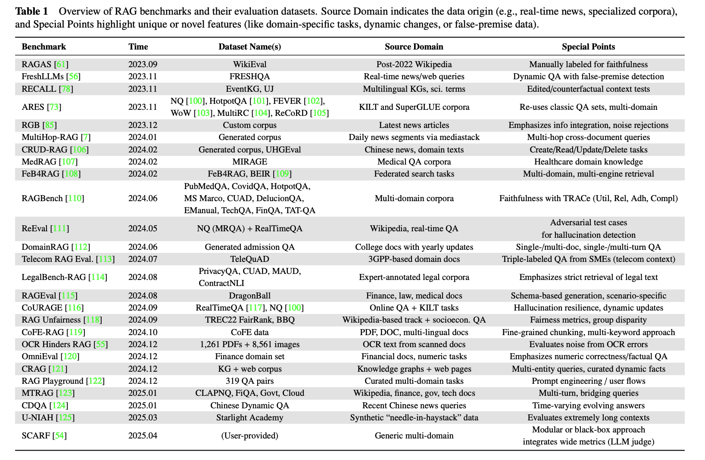

将自建数据与公开基准结合使用，既能确保评测贴近业务实际，又能借助公共标准进行横向比对，是构建稳健评测体系的务实路径。

---

## 7. 小哲亲手实现一个最小 RAG

讲清原理和选型还不够，课程的规矩是：**能讲清楚，还得能跑起来。** 小哲决定不用任何 RAG 框架，纯手写一遍，把前面拆解的「切分向量化 → 检索 → 增强生成」三步都落到代码上。环境只需要一个 Embedding 接口和一个对话模型接口（用你上周配好的任意 API 即可）。

```python
import numpy as np
from openai import OpenAI

client = OpenAI()  # 用你自己的 API Key / base_url

# ---------- 第一步：切分 + 向量化（入库时做一次）----------
documents = [
    "苹果公司于 1976 年由乔布斯、沃兹尼亚克和韦恩创立，总部在加州库比蒂诺。",
    "苹果是一种水果，富含维生素 C 和膳食纤维，有助于消化。",
    "苹果公司在 2007 年推出第一代 iPhone，重塑了智能手机行业。",
]

def embed(text: str) -> np.ndarray:
    """把一段文本变成向量"""
    resp = client.embeddings.create(model="text-embedding-3-small", input=text)
    return np.array(resp.data[0].embedding)

# 建立「知识库」：每条原文配一个向量
knowledge_base = [(doc, embed(doc)) for doc in documents]

# ---------- 第二步：检索（每次提问实时做）----------
def cosine_similarity(a: np.ndarray, b: np.ndarray) -> float:
    return float(np.dot(a, b) / (np.linalg.norm(a) * np.linalg.norm(b)))

def retrieve(question: str, top_k: int = 2, threshold: float = 0.3):
    q_vec = embed(question)
    scored = [(doc, cosine_similarity(q_vec, vec)) for doc, vec in knowledge_base]
    scored.sort(key=lambda x: x[1], reverse=True)
    # Top-K + 阈值过滤：分数太低的不算证据
    return [(doc, score) for doc, score in scored[:top_k] if score >= threshold]

# ---------- 第三步：增强生成（每次提问实时做）----------
def answer(question: str) -> str:
    hits = retrieve(question)
    if not hits:
        return "根据现有资料无法回答这个问题。"

    context = "\n".join(f"{i + 1}. {doc}" for i, (doc, _) in enumerate(hits))
    system_prompt = (
        "你是一个严谨的问答助手。请只依据下面的「参考信息」回答问题。\n"
        "若参考信息能回答，就基于它作答并注明依据；"
        "若没有答案，必须说「根据现有资料无法回答」，绝不编造。\n\n"
        f"【参考信息】\n{context}"
    )
    resp = client.chat.completions.create(
        model="gpt-4o-mini",
        messages=[
            {"role": "system", "content": system_prompt},
            {"role": "user", "content": question},
        ],
    )
    return resp.choices[0].message.content

# ---------- 跑起来 ----------
print(answer("苹果公司是什么时候创立的？"))  # 命中 A、C，答出 1976 年
print(answer("吃苹果有什么好处？"))          # 命中 B，答出营养价值
print(answer("今天天气怎么样？"))            # 无证据过阈值，老实说答不了
```

小哲跑完三个问题，结果和他在第 4 节手推的一模一样：前两个有据可循，第三个老老实实拒答。这段代码正是教程里讲的第一代 **Naive RAG**——固定切分、纯向量相似度、检索结果直接拼提示词，一行框架都没用。

::: warning 把课程规矩用上：AI 输出必须验证
小哲没止步于「跑通了」。他特意改了阈值：把 `threshold` 调到 0.0，问题三立刻开始瞎编天气；调回 0.3，又恢复正常。**他用一次真实实验确认了阈值的作用，而不是听别人说。** 这正是课程第一周那条规则——AI 相关的每一个行为，都要自己验证过才算数。
:::

<InfoCard icon="🔑" variant="warning">
**这只是「能理解原理」的玩具版**

这段代码每次检索都遍历全部文档、算全部相似度，几条数据没问题，文档一多就慢得没法用。真实系统会用**向量数据库**做近似最近邻检索（ANN），还要处理切分策略、重排序、混合检索等一堆工程问题——也就是前面 Advanced RAG 和 Modular RAG 讲的那些。这些是下周的内容。这周的目标只有一个：**把 RAG 三步彻底搞懂，能自己实现一遍。**
</InfoCard>

---

## 8. 深度研究：从比赛与开源教程中学习（选学）

前面介绍的 RAG 系统原理和基础实现，虽然能帮助你快速搭建起一个可用的原型，但距离真正解决生产环境中的复杂问题还有不小的距离。如果你想深入理解更落地、更有实战价值的 RAG 技术，参考各大比赛的获奖方案和优质开源教程是最高效的学习路径，这些方案往往集中了优秀团队在真实场景下反复尝试后的最佳实践。

需要强调的是，本节列举的案例并非全部，而是挑选了几个有代表性的方案。当你在实践中遇到特定问题时，建议采用这样的学习策略：先根据问题类型（如「PDF 解析」「多模态检索」「低延迟优化」等关键词）查找相关竞赛，再深入研究获奖队伍的技术报告或开源代码，往往能找到直接可用的解决思路。

### 8.1 语义缓存：优化高频查询场景

Hugging Face 提供了一个基于 Chroma 向量数据库的语义缓存实现方案，教程地址：[huggingface.co/learn/cookbook/semantic_cache_chroma_vector_database](https://huggingface.co/learn/cookbook/semantic_cache_chroma_vector_database)

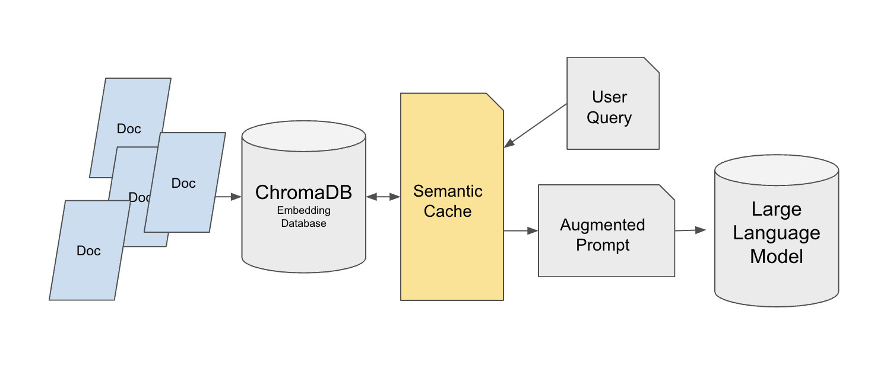

**背景**：大多数教程搭建的 RAG 系统只适合单用户测试，当系统部署到生产环境后，面对几十到几千次的重复查询（比如客服场景中用户反复询问「如何退款」），每次都要执行向量数据库检索和 LLM 调用，响应时间会明显增加，成本也会快速上升。通过引入语义缓存层，可以在保证答案质量的前提下，大幅减少对原始数据源的访问压力。

该方案采用了双层检索架构。基础层使用 Chroma 向量数据库存储原始知识库（以 MedQuad 医疗问答数据集为例），为每条数据添加唯一 ID 方便精确引用。缓存层则基于 FAISS 构建，选择 FlatL2 索引来处理小数据集和高维向量。语义缓存被放在用户查询与 Chroma 之间，而不是缓存 LLM 的最终回答——这个设计很重要，因为直接缓存回答会导致用户的个性化要求（如「用简单语言解释」）失效。

缓存系统使用 SentenceTransformer 的 all-mpnet-base-v2 模型生成查询向量，通过欧氏距离（设定阈值为 0.35）来判断查询是否相似。当缓存满了（max_response 参数控制容量）时，采用先进先出策略删除最早的条目。为了支持跨会话使用，缓存数据会保存到 JSON 文件中。

在小规模测试中，首次查询「How do vaccines work?」从 Chroma 获取结果耗时 0.057 秒，而相似查询「Briefly explain me what is a Sydenham chorea.」从缓存获取仅需 0.016 秒，检索时间减半。在大规模生产环境中，这个方案可以实现 90%-95% 的性能优化，有效降低了向量数据库的访问压力和 API 调用成本。

### 8.2 非结构化数据处理：统一多格式文档解析

Hugging Face 的另一个教程展示了如何使用 Unstructured 库构建完整的非结构化数据处理流程，教程地址：[huggingface.co/learn/cookbook/rag_with_unstructured_data](https://huggingface.co/learn/cookbook/rag_with_unstructured_data)

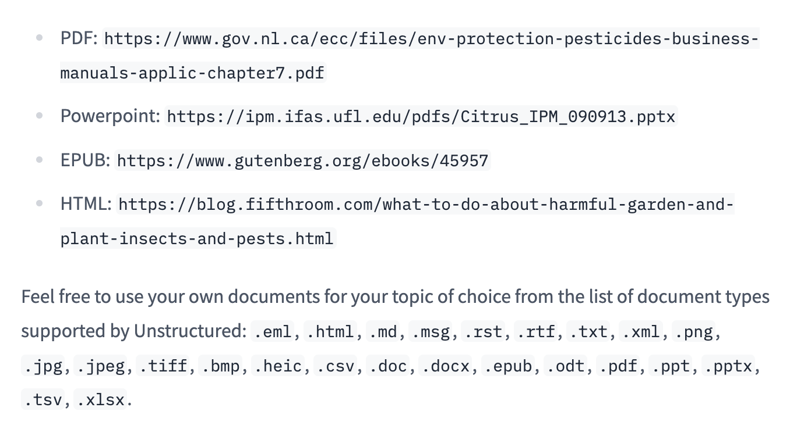

**背景**：企业场景中的知识往往分散在 PDF、PowerPoint、EPUB、HTML 等多种格式中，传统的数据预处理方法要么只能处理单一格式（比如只支持 PDF），要么在格式转换过程中丢失关键信息（特别是表格、标题层级等结构化内容），导致 RAG 系统无法准确理解和检索这些信息。

该方案首先下载多格式测试文档作为示例，包括加拿大环境部农药手册 PDF（包含大量表格数据）、佛罗里达大学柑橘 IPM PowerPoint（包含图表和多层级标题）等真实文档。然后使用 Unstructured 库的 Local Runner 完成解析。配置分为三个部分：ProcessorConfig 指定输出目录和并行进程数（2 个进程），PartitionConfig 可选择 API 分区模式（需要 Unstructured 密钥，OCR 效果更好，特别适合扫描版 PDF），SimpleLocalConfig 定义文档输入路径。解析后的文档会转换为 JSON 格式，包含正文、标题、表格等元素类型。

系统使用 chunk_by_title 方法进行分块，设置最大字符数为 512，并将 200 字符以下的连续片段合并以保持语义完整性。在转换为 LangChain Document 格式时，会过滤掉复杂的元数据字段以适配 Chroma 向量数据库。向量化阶段采用 BAAI/bge-base-en-v1.5 嵌入模型，结合 4bit 量化的 Llama-3-8B-Instruct 模型和 LangChain 的 RetrievalQA 链构建完整的 RAG 系统。

系统能够准确处理多格式文档。测试「Are aphids a pest?」等问题时，可以从解析后的文档中提取蚜虫危害、吸引蚂蚁等关键信息，生成符合需求的回答。这个方案成功实现了从非结构化数据到 RAG 可用数据的完整转化，特别适合需要处理多种文档格式的企业知识库场景。

### 8.3 企业级文档问答：高精准可追溯的 RAG 实现

Enterprise RAG Challenge 的冠军方案展示了如何在严格的时间和精度要求下构建生产级 RAG 系统，相关技术文章：[abdullin.com/ilya/how-to-build-best-rag](https://abdullin.com/ilya/how-to-build-best-rag/) 与 [hustyichi.github.io/2025/07/03/rag-complete](https://hustyichi.github.io/2025/07/03/rag-complete/)

**背景**：参赛者需要在 2.5 小时内完成 100 份真实企业年度报告 PDF 的解析，这些报告每份最多 1000 页，包含复杂的财务表格、多栏布局、图表等内容。解析完成后，系统需要回答 100 个精确的业务问题，这些问题要求明确的答案类型（比如 Yes/No 判断、公司名称、具体数值指标、高管职位名称等），并且必须给出答案来源的页码引用，以便业务人员验证。整个过程模拟的是投资分析师或财务审计人员的实际工作场景。

冠军团队选择 IBM 开源的 Docling 作为 PDF 解析工具，因为它在处理复杂表格（比如跨页表格、嵌套表格）和多列文本方面表现最好。团队对 Docling 代码进行了改进，使其生成包含元数据的 JSON 和 Markdown+HTML 格式，特别修复了表格结构的解析问题（比如单元格合并、表头识别等）。为了加速处理，团队租用 RTX 4090 GPU，在 40 分钟内完成了 100 份报告的解析。

文本分块采用 300 token 长度，重叠 50 token，使用递归分割策略保持语义完整。为了避免跨公司信息混淆（比如查询 A 公司 CEO 时检索到 B 公司的信息），为每个公司单独构建 FAISS 向量库，采用 IndexFlatIP 索引（不压缩以保证精度）。检索阶段采用三步走策略：首先通过向量检索找到 Top30 文本块，然后提取这些块所在的父页面并去重（因为多个块可能来自同一页），最后使用 GPT-4o-mini 对页面进行重新排序。向量检索分数与 LLM 重排序分数按 0.3:0.7 的权重混合。

生成阶段根据答案类型（数字/布尔/字符串等）使用不同的 prompt 模板。对于数字类问题（比如「2023 年营收是多少」），设计了 5 步分析流程来确保指标匹配的准确性：识别问题中的指标类型、在文档中定位相关表格、提取数值、验证单位一致性、交叉验证。系统输出采用结构化格式，包含分析过程、相关页码等字段，确保答案可追溯。对于涉及多公司比较的问题（比如「哪家公司营收最高」），会拆分为单公司子查询后再合并结果。

该方案在竞赛中获得双奖项及排行榜第一。值得注意的是，即使使用小模型（如 Llama 8B）也能超过 80% 的参与者，使用 Llama 3.3 70B 时仅比 GPT-4o-mini 稍差一点，成功实现了准确性、效率与成本的平衡。

### 8.4 AIOps 场景：图文混合数据的智能处理

AIOps RAG 竞赛的 EasyRAG 项目专注于运维场景下的问答任务，技术文章：[blog.csdn.net/hustyichi/article/details/143323746](http://blog.csdn.net/hustyichi/article/details/143323746)


**背景**：运维工程师日常工作中需要查阅大量技术文档，这些文档不仅包含文字说明，还包含监控图表、系统架构图、性能曲线等图片信息。比如当系统出现性能问题时，工程师需要快速查询「CPU 使用率超过 80% 时应该如何处理」，答案可能分散在文字说明和监控图表中。传统 RAG 系统只能处理文字，无法理解图表中的趋势和数值，导致答案不完整。该项目最终获得初赛第一、复赛第二的成绩。

索引阶段使用改进过的 SentenceSplitter（修复了原版块大小计算问题），按 1024 token 分块，重叠 200 token。关键创新在于为每个文本块添加知识库路径、文件路径等元信息，这个改进使召回率提升了 2%。对于图片数据，先使用 PaddleOCR 提取图片中的文字（比如图表的标题、坐标轴标签），再调用 GLM-4V-9B 多模态模型生成图片的自然语言描述（比如「该折线图显示 CPU 使用率在下午 3 点达到峰值 90%」），将文字和描述一起入库，实现了图文信息的统一检索。

检索阶段采用「双路 BM25 + 向量检索」策略进行广泛召回。BM25 包含文档块检索（召回 192 条）和路径检索（通过文件路径过滤无关文档，比如只检索运维手册而不检索开发文档），使用哈工大停用词表进行去噪。向量检索使用 gte-Qwen2-7B-instruct 模型，召回 288 条候选结果。重排序阶段使用 bge-reranker-v2-minicpm-layerwise 模型，经过测试发现 28 层配置效果最好。

答案生成采用两步策略——先基于 Top6 文档生成初步结果（覆盖多个相关知识点），再结合 Top1 最相关文档进行二次优化（突出最核心的答案）。为了应对长文本场景（比如一份完整的运维手册可能有几百页），系统实现了基于 BM25 的上下文压缩方法：将文档拆分为句子级别，计算每个句子与查询的相似度，然后按比例拼接高相关句子。实验表明，在 50% 压缩率下，该方法耗时仅 7.7 秒，准确率达 86.48%，优于 LLMLingua 等现有压缩工具。

### 8.5 多源数据融合：结构化与非结构化知识的协同

KDD Cup 2024 Meta RAG 挑战赛的冠军方案展示了如何整合非结构化 Web 数据和结构化知识图谱，技术文章：[blog.csdn.net/m0_59164520/article/details/143694213](https://blog.csdn.net/m0_59164520/article/details/143694213) 与 https://arxiv.org/pdf/2410.00005

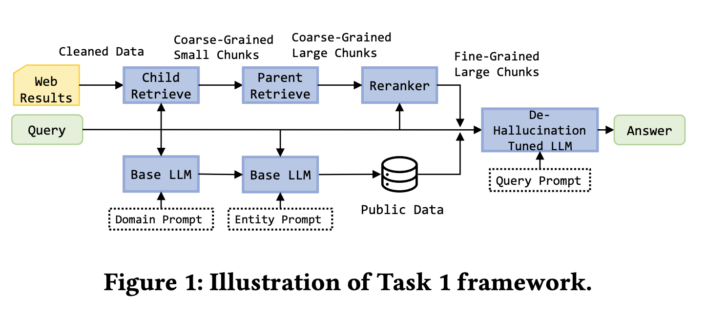

**背景**：任务 1 要求基于 5 个网页做检索摘要，比如用户搜索「星际穿越导演是谁」，系统需要从给定的网页中提取答案。任务 2 在任务 1 基础上增加了 Mock API（模拟访问结构化知识图谱），系统可以调用 API 查询电影数据库、人物关系等结构化信息。任务 3 进一步扩大难度，基于 50 个网页与 Mock API 处理复杂查询，比如「哪些由诺兰导演的电影票房超过 5 亿美元」，这需要同时查询知识图谱（导演作品关系）和网页（票房数据）。每个查询需在 30 秒内完成，核心目标是提升多源数据整合的准确性并减少幻觉。

北大 db3 团队针对任务 1 设计了精细化的 Web 数据处理流程。使用 BeautifulSoup 提取网页文本，ParentDocumentRetriever 管理父子块关系（子块 200 token 用于检索、父块 500-2000 token 用于生成），确保检索准确性和生成完整性。嵌入模型选用 bge-base-en-v1.5，向量库使用 Chroma，重排序采用 bge-reranker-v2-m3。团队还补充了电影、金融等领域的公开数据，转换为规范格式后入库。模型层面使用 LoRA 微调 Llama-3-8B-instruct，训练数据包括无效问题标注、正确答案等。

任务 2-3 的关键创新在于优先使用知识图谱。团队设计了规范化的 API 调用机制，包括 get_person（查询人物信息）、get_movie（查询电影信息）等接口，支持条件过滤（比如 cmp 操作符筛选票房 >5 亿的电影）和排序（按票房降序）。系统执行时先调用知识图谱 API，只有在知识图谱结果无效时才回退到 Web 检索，这个设计大幅提升了查询效率和答案准确性。

该方案在三个任务中均获第一，得分分别达到 28.4%、42.7% 和 47.8%。这个案例的核心启示在于，对于包含结构化和非结构化数据的企业场景，应该根据数据特点设计不同的检索策略，优先使用确定性强的结构化数据，用非结构化数据作为补充。

深入分析这几个实践案例，我们可以总结出构建高质量 RAG 系统的几个共同原则：在架构设计上，应该根据业务场景选择合适的缓存、检索和生成策略；在数据处理上，需要针对不同格式和模态设计专门的解析和索引方案；在检索优化上，**混合检索加重排序已成为标准配置**；在答案生成上，分类型的 prompt 和结构化输出能明显提升准确性和可追溯性。这些来自真实竞赛和开源项目的经验，为搭建更好的企业级 RAG 系统提供了宝贵的参考。

---

## 9. 广度探索：RAG 的未来演化（选学）

在深入掌握了 RAG 的实战技巧与优化方法后，要全面把握 RAG 技术，仅靠对局部的深入钻研还不够，我们还需拓展视野，从更广阔的维度理解其演进方向与扩展空间。当前，RAG 技术正在迅速突破传统基于文档分块的检索生成范式，朝着更多样化的方向发展。本节将重点探讨几个演进路径：从简单的分块检索转向对图数据结构的检索；融合图像、音频等多模态信息；利用向量化技术优化长文档的分块处理策略；以及 RAG 如何逐步演化为智能体（Agent）系统。

### 9.1 Graph RAG：用关系网络重塑深度检索

相关研究：https://arxiv.org/pdf/2410.05779 、https://arxiv.org/pdf/2502.11371 、https://arxiv.org/pdf/2404.16130


传统 RAG 依靠寻找和问题相似的文本段落来工作，这就像在一堆材料里挑出看起来最相关的几段话。对于直接查找某个具体信息，这种方法很有效。但如果一个问题需要联系多份文档、结合不同线索才能回答，它的表现就会打折扣。

比如，医生可能想问：「根据这些病例和最新的治疗指南，如何评估某种药物对老年患者的好处和风险？」又或者，项目团队可能关心：「综合过去两年的需求文档、评审记录和线上问题报告，我们这个系统架构最常出问题的环节是什么？」这类问题的关键，不是找到某一句原话，而是要从各种分散的材料中，找出其中提到的人、事、物以及它们之间的联系，理清头绪，形成一幅完整的全景图。

Graph RAG 的做法，就是先主动画出这幅全景图。系统会利用大模型从文本中识别出关键元素（比如人物、机构、功能模块、事件、数据等）以及它们之间的关系（比如谁导致了什么、什么依赖于什么、如何变化、有何矛盾等），从而构建一个随着资料增加而不断丰富的知识网络。接着，通过自动分组，把联系紧密的元素和关系归类到不同的主题下，并为每个主题提前生成一段概括性描述。这样，当用户提问时，系统不再仅仅是寻找字面上最相似的段落，而是会先在知识网络里找到与问题最相关的元素和局部结构，再顺着连接线扩展到相关的主题组，最后将这些分析路径、节点说明和对应的原始文本片段，一起交给大模型进行推理并组织答案。

在这样的框架下，Graph RAG 和传统 RAG 形成了很好的分工与配合：传统 RAG 仍然擅长回答直接的、一步就能找到答案的细节问题；而 Graph RAG 则更像人在做研究或写报告时的思路——先梳理出整体结构和主题（构建网络与分组），再填充具体依据（引用原文），最后给出有逻辑、有条件限制的结论。已有的系统对比也显示，在需要联系多个信息点进行推理的任务中，Graph RAG 通常能涵盖更关键的内容，提供更全面的视角。

### 9.2 Multimodal RAG：多模态 RAG

相关研究：https://arxiv.org/pdf/2502.08826

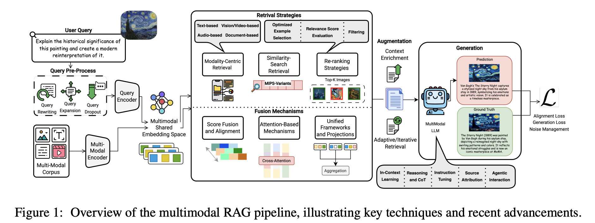

现实世界的数据从来不是单一文本。工程师排查服务器故障时，需要同时看温度监控曲线、设备面板截图和系统日志；医生做诊断时，需要把 CT / MRI 影像、检查报告和电子病历放在一起看。传统的文本 RAG 最多只能检索到「温度异常」「怀疑肺结节」这样的文字描述，却难以把这些描述与具体的曲线走势、影像病灶形态对应起来，更做不到用「图/音/视频」去反向检索相关文档和知识。

Multimodal RAG（多模态 RAG）解决的是这种「模态之间互相看不见」的问题。它的核心在于跨模态语义对齐：为图像、视频、音频、文本等分别配置合适的编码器（如 ViT/CLIP 编图像和视频帧，Whisper 编音频，BGE-M3 等编码文本），配合 OCR、ASR、版面分析等工具，把视觉和音频里的关键信息抽取出来，再通过模型把不同模态的表示映射到一个共享的语义空间中，构建统一的多模态索引。

在检索和生成阶段，不管用户是问「找一张显示 2023 年 Q3 销售峰值的图表」，还是上传一张产品草图或一段操作视频发起查询，系统都会先在这个统一空间里找到一批最相近的多模态内容，然后根据文本相似度、图像相似度等信号，筛掉明显无关的结果，保留几条最有用的证据。最后，把这些经过筛选的图、文、表格等，一并交给多模态大模型，由它综合不同模态的信息给出答案，并尽量标明信息来源，或在截图、文档中高亮相关位置。这样一来，相比只看文本的 RAG，系统既能利用更多模态的线索，又更容易减少幻觉，让答案更完整也更容易核实。

### 9.3 Late Chunking：为长文档保留完整上下文

相关介绍：https://jina.ai/news/late-chunking-in-long-context-embedding-models/

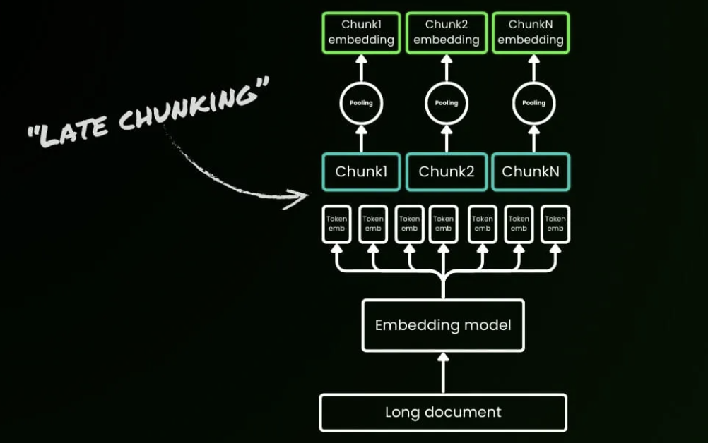

想象你正在阅读一篇关于柏林的维基百科文章，传统 RAG 系统会先将其切成独立段落再生成向量。当第一句提到「柏林是德国首都」后，后续段落中的「该城市」「它的人口」等指代词就失去了与「柏林」的关联。此时若查询「柏林的人口是多少」，系统会因为「柏林」和「人口数据」从未在同一文本块出现而检索失败。这个问题在长文档场景更为严重：一份 200 页的保险合同中，「免赔额」的定义在第 5 页，具体适用条件在第 30 页，传统的固定长度切分（如每 512 tokens 一块）会将这些相关信息分散到 40 多个独立文本块中，实验数据显示这种割裂会导致语义相似度从 0.85 暴跌至 0.71。

Late Chunking 颠覆了「先切后编」的传统流程，改为「先编后切」：利用支持 8192 tokens（约 10 页文本）的长上下文嵌入模型（如 Jina Embeddings v2），首先将整个文档输入 Transformer 层，生成每个 token 的向量表示——此时每个 token 的嵌入已经「看到」了全文信息，捕获了跨段落的指代关系和概念关联。随后，再对这些已经全局感知的 token 向量进行分块平均池化（mean pooling），生成最终的块嵌入。这样生成的文本块不再是独立同分布的孤岛，而是「条件依赖」的上下文链：当处理「该城市有 385 万居民」这句话时，向量中已经包含了前文「柏林」的语义信息，使相似度从 0.71 提升至 0.83。关键区别在于边界标记的使用时机：传统方法在预处理阶段就用句号、段落符切分文本，而 Late Chunking 仅在获得全局 token 嵌入后，才应用边界线索进行智能分块。

在 BEIR 基准测试的 5 个数据集上，Late Chunking 全面超越传统切分方法。最显著的案例是 NFCorpus 数据集（平均文档长度 1590 字符），检索准确率从 23.46% 飙升至 29.98%，相对提升 27.8%；而在短文本场景（如 Quora 的 62 字符问题）两者表现相同，验证了一个关键规律：**文档长度与 Late Chunking 的优势呈正相关**。该方法现已集成到 Jina Embeddings v3 API 中，虽然需要先编码整个长文档，推理时间增加 10-20%，但在医疗病历、法律文档、技术手册等场景中，检索准确率的大幅提升远超过这点性能开销。Late Chunking 代表了从「先切后编」到「先编后切」的范式转变。

### 9.4 从 RAG 到 Agent 时代的 RAG

相关讨论：[ragflow.io/blog/rag-at-the-crossroads-mid-2025](https://ragflow.io/blog/rag-at-the-crossroads-mid-2025-reflections-on-ai-evolution) 、https://arxiv.org/pdf/2501.09136 、[letta.com/blog/rag-vs-agent-memory](https://www.letta.com/blog/rag-vs-agent-memory) 、[llamaindex.ai/blog/rag-is-dead-long-live-agentic-retrieval](https://www.llamaindex.ai/blog/rag-is-dead-long-live-agentic-retrieval)

RAG 技术已从最初的检索增强生成工具，发展为构建智能体认知架构的关键部分。传统 RAG 系统基于提问、检索、回答的简单模式，本质是被动接受查询，不具备主动行动的能力。为了突破这种被动性并处理更复杂的认知任务，RAG 与智能体能力进行了深度融合，由此诞生了 **Agentic RAG** 这一新范式。在此范式中，RAG 的角色发生了根本转变：它不再仅仅是外部知识的被动提供者，而是在智能体的主动规划、目标指引和反思能力驱动下，成为支撑智能行为的核心处理单元。这种融合使系统整体具备了目标导向、迭代优化和自主决策的能力。具体而言，Agentic RAG 能够理解复杂任务，自主拆解问题，规划检索策略，并在获取初步信息后评估结果质量，决定是否深入探索，从而胜任传统 RAG 难以应对的多步骤复杂任务。

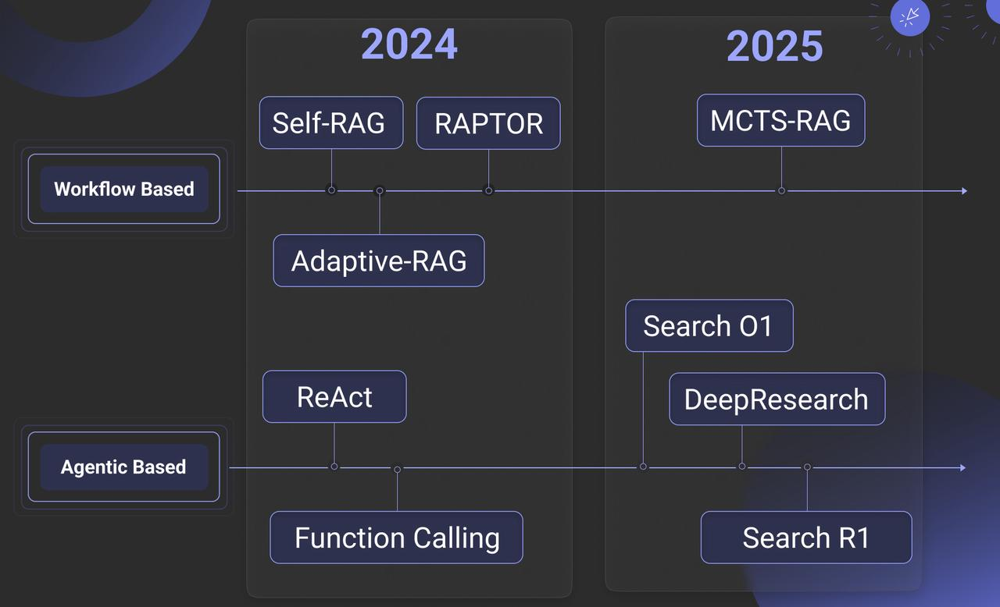

Agentic RAG 实现上述复杂任务处理的关键，在于其建立了一个多层次的主动循环工作机制。面对复杂查询，智能体首先分析问题本质，将其拆解为子问题，并为每个子问题设计精准的检索策略。获得初步结果后，智能体进行评估与反思，判断信息的完整性和相关性，识别知识缺口，并动态生成更精确的新查询。这种迭代过程常包含多跳检索，即基于前一轮结果发现新的检索方向，形成类似人类研究者的知识探索链条。然而，要支撑这种持续的、迭代的智能行为，尤其是实现长期交互中的个性化和知识积累，仅依赖单次会话的短期上下文（短期记忆）是远远不够的。这引出了对长期、结构化记忆能力的需求。

正是为了满足这一需求，RAG 被赋予了作为智能体长期记忆系统的角色，构建了一个完整的外部记忆架构。该长期记忆系统的核心运作依赖于三项关键机制：

- **第一，结构化索引能力**：使智能体能够为海量非结构化数据建立多维索引体系（如按时间、主题或实体关系），支持多角度高效检索，模拟人脑通过不同线索回忆信息的方式。
- **第二，智能遗忘机制**：通过价值评估算法，系统对使用频率低、相关性弱或过时的信息进行权重衰减或选择性剔除，维持记忆系统的精炼高效，防止信息过载。
- **第三，知识巩固过程**：系统将零散对话和交互经验提炼为结构化知识，利用实体识别、关系抽取和语义聚类等技术，将碎片信息整合连接成知识图谱，完成从短期经验到长期知识的转化与沉淀。

这种由 RAG 构建的外部记忆系统，不仅极大地扩展了智能体的认知边界，更重要的是赋予了其持续学习和知识进化的能力。它使得智能体能够在长期互动中积累经验，形成个性化的处理模式和领域专业知识体系，从而为执行更复杂、更持久的任务提供了坚实的基础。

---

## 10. 小哲这周的转变

> 小哲把跑通的脚本、那张三步流程图，和满满几页的演进/选型/评测笔记并排放在一起，忽然觉得 Dify 不再神秘了。他在笔记里写下：
>
> **「上周我以为我在用一个很聪明的模型，这周我才发现，聪明的不是模型，是它身后那套先检索再回答的流程。从为什么需要它，到它怎么一步步从 Naive 进化到 Modular，再到怎么选模型、怎么评效果——把黑盒彻底拆开自己拼一遍之后，我才算真的会用它，而不是只会点按钮。」**

---

## 本周回顾

<ProgressTracker title="第 9 周学习进度" :items="[
  { title: '想通了为什么需要 RAG', description: '长上下文在成本/注意力/更新溯源上的硬伤', done: false },
  { title: '看懂了 RAG 如何工作', description: '向量化 → 检索 → 增强生成，三个查询走一遍', done: false },
  { title: '梳理了 RAG 技术演进', description: 'Naive → Advanced → Modular 三代', done: false },
  { title: '了解了企业级实践', description: '模型选型 / 运行框架 / 效果评测全链路', done: false },
  { title: '亲手实现了最小 RAG', description: '余弦相似度 + Top-K + 阈值 + 结构化提示词', done: false }
]" />

**自测问题：**

1. 上下文窗口已经很大了，为什么企业级场景还需要 RAG？至少说出两类问题。
2. RAG 的三代演进（Naive / Advanced / Modular）各自解决了什么？Advanced RAG 在「检索前」和「检索后」分别做了哪些优化？
3. 在最小 RAG 里，「最低相似度阈值」起什么作用？去掉它会发生什么？这对应到企业级评测里的哪个指标？

---

## 下周预告

最小 RAG 能跑，但离「企业级」还很远：文档一多就检索变慢、固定切分导致召回不准、单纯向量检索答不好复杂问题——也就是这周讲的 Naive RAG 的那些局限。下周进入 **高级 RAG 与企业知识库**——用 **LlamaIndex** 接管切分、索引与检索流水线，用 **LangGraph** 把检索、判断、生成编排成可控的多步流程，把这周讲的 Advanced / Modular RAG 思路真正落地。小哲会把这周的玩具脚本，升级成一个像样的知识库应用。
