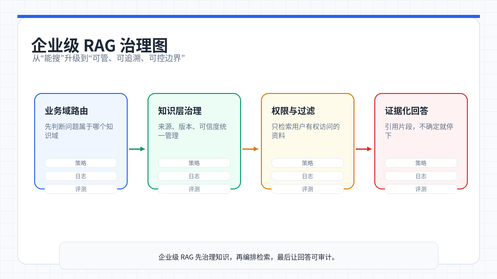
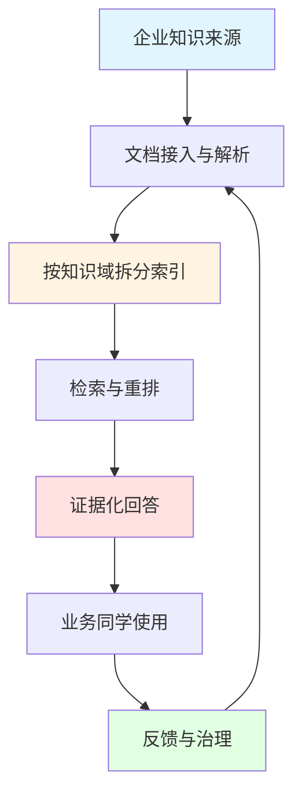
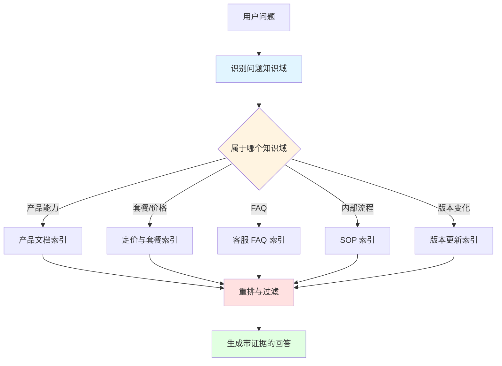
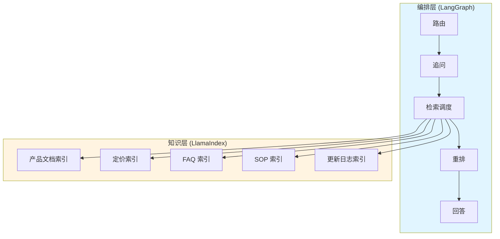
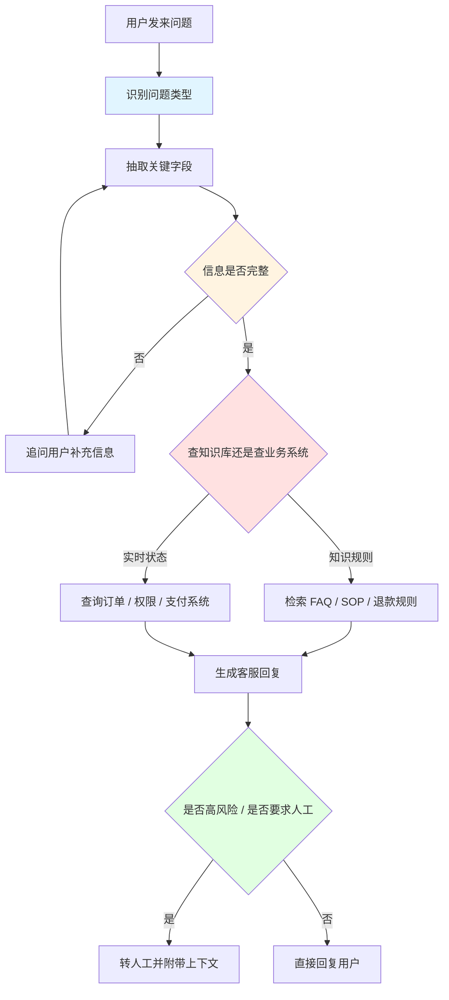

# 第 10 周:高级 RAG 与企业知识库——从玩具到生产级系统

> 上周小哲拼出了一个最小 RAG,演示时答得挺好。这周他把它丢进真实场景:几十份文档、新旧版本打架、用户问法五花八门——最小 RAG 当场翻车。老板问他:「为什么同一个问题,昨天答对了今天答错?为什么用户说我们给的答案自相矛盾?」小哲这才意识到,把「能搜」的玩具升级成「能管、能查、能追溯」的企业级知识库,要解决的根本不是技术问题,而是**知识治理问题**。

<ChapterIntroduction duration="2 课时(约 4 小时)" output="知识域拆分方案 + LangGraph 检索流程图 + 证据化回答规则 + 可落地的企业知识库架构" prerequisite="完成第 9 周;做过一个最小 RAG(能切块、能向量检索、能拼答案)" :tags="['LangGraph', 'LlamaIndex', '知识域拆分', '检索编排', '证据化回答', '版本治理', '企业级架构']">

你会先看清最小 RAG 在真实业务里为什么不够用,然后用两件工具补上短板:**LlamaIndex 负责把分散知识组织成可治理的知识层,LangGraph 负责把检索编排成可控、可审计的状态流。**核心不是写更多代码,而是理解一个能落地的高级 RAG 到底要解决什么——不只是「答得对」,还要「答得稳」「能追溯」「知道边界」。

本周你会学到:
- 为什么企业知识库的核心是「治理」而不是「检索」
- 如何用知识域拆分解决「去错地方找」的问题
- 如何用 LangGraph 把检索编排成可审计的状态流
- 如何让系统在证据不足时「会停下来」而不是硬编
- 如何处理版本冲突、权威来源、系统边界三大治理难题

</ChapterIntroduction>



*企业级 RAG 不是把文档全塞进去，而是先治理知识，再编排检索，最后让回答可追溯。*

<StepBar :active="0" :items="[
  { title: '① 最小 RAG 为什么翻车', description: '演示能用 ≠ 真实能用' },
  { title: '② 业务侧:先想清楚要解决什么', description: '知识库不是上传页面' },
  { title: '③ 用 LlamaIndex 拆知识域', description: '不是一个超级大索引' },
  { title: '④ 用 LangGraph 编排检索', description: '把流程拆成状态流' },
  { title: '⑤ 治理与证据化', description: '版本、权威、何时停下来' },
  { title: '⑥ 客服场景实战', description: 'LangGraph 处理复杂对话流' }
]" />

---

## 上节课回顾

在上节课中,我们学会了构建最小 RAG 系统:文档切块、向量化、检索、拼接 prompt 让模型回答。这套流程在干净数据、简单问题上表现不错,但距离企业级应用还有很大差距。

为了帮助大家更好地衔接知识,在开始本节课的新内容前,让我们一起通过几道简单的题目快速回顾一下上节课的核心知识点:

1. 什么是 RAG,它解决了大模型的什么问题?
2. 向量检索的基本流程是什么(Embedding → 存储 → 检索 → 重排)?
3. 为什么要做文档切块,切块大小如何影响检索质量?
4. 最小 RAG 在真实场景中会遇到哪些问题?

如果对以上任何一个问题还有印象模糊的地方,建议先回顾一下上节课的文档和讲义。

::: tip 你将学到
1. 企业知识库与最小 RAG 的本质区别
2. 如何用 LlamaIndex 组织多知识域索引
3. 如何用 LangGraph 编排复杂检索流程
4. 知识治理的三大核心:版本、权威、边界
5. 证据化回答与 badcase 管理
6. 客服场景下的状态流转与人工升级

最终产出:
- 一套可落地的企业知识库架构设计
- 知识域拆分方案与路由逻辑
- LangGraph 检索流程图(含异常处理)
- 证据化回答规则与 badcase 清单
:::

---

## 1. 上周那个最小 RAG,一上真实场景就翻车

小哲上周的 RAG 很直接:把所有文档切块、塞进一个向量库、用户来问就检索 Top-K、拼进 prompt 让模型回答。演示时他只放了三篇干净的文档,效果不错。产品经理看完说:「可以,下周就上线。」

这周他把公司产品的真实资料都倒了进去:产品手册(50 页)、套餐定价(8 个版本)、客服 FAQ(200 条)、内部 SOP(15 份)、十几个版本的更新日志。然后问题就来了。

### 1.1 翻车现场

<InfoCard icon="💥" variant="warning">
**第一天上线,客服主管就来找小哲了**

「你这系统是不是有问题?同一个客户问『企业版能不能配多个审批流』,昨天答『可以』,今天答『不支持』。客户都懵了,我们也不知道该信哪个。」

小哲一查日志,发现昨天检索到的是最新版本文档(v3.5,确实支持),今天检索到的是旧版本文档(v2.1,当时不支持)。**系统没有版本意识,旧文档和新文档混在一起,检索时随机命中。**
</InfoCard>

小哲整理了一周内出现的典型 badcase:

| 用户问的 | 最小 RAG 的表现 | 真正的毛病 |
|---|---|---|
| 「企业版能不能配多个审批流?」 | 检索到一段旧版本文档,自信地说「不支持」 | 检索到了,但检索到的是**过期规则** |
| 「以前文档写 100 人上限,现在还是吗?」 | 把新旧两份文档混在一起,给了个矛盾的答案 | 没有**版本意识**,旧文档覆盖了当前规则 |
| 「退款规则是什么?」 | 去产品手册里翻,没翻到,硬编了一段 | 没有**知识域路由**,去错了地方找 |
| 「这个客户的退款现在到哪一步了?」 | 一本正经地编了个进度 | 越界了,这是**业务系统**的实时状态,不是文档能答的 |
| 「为什么我付了钱课程还是打不开?」 | 直接给了个通用答案「请联系客服」 | 没有**追问机制**,信息不全就该先问订单号、账号 |

**最小 RAG 的逻辑:**

```ts
// 最小 RAG:一把梭
function simpleRag(question: string) {
  const chunks = vectorSearch(question, topK: 5)
  const prompt = `根据以下内容回答:\n${chunks}\n\n问题:${question}`
  return llm.generate(prompt)
}

// 问题:
// 1. 所有文档混在一个索引里
// 2. 不管新旧版本,检索到什么用什么
// 3. 不管信息够不够,直接让模型答
// 4. 不管能不能答,模型总会编点什么
```

**企业级知识库的逻辑:**

```ts
// 企业级知识库:分层治理
function enterpriseRag(question: string) {
  // 1. 先路由:判断去哪个知识域找
  const domain = routeToKnowledgeDomain(question)

  // 2. 再追问:信息不全先停下来
  const missingInfo = checkRequiredInfo(question, domain)
  if (missingInfo.length > 0) return askForMore(missingInfo)

  // 3. 检索:在选定域里找,优先最新版本
  const docs = retrieveFromDomain(domain, question, preferLatest: true)

  // 4. 重排:把最权威的提上来
  const ranked = rerankByAuthority(docs)

  // 5. 回答:证据不足就说不知道
  if (ranked.length === 0) return '根据当前资料无法确认'
  return generateGroundedAnswer(question, ranked)
}
```

### 1.2 小哲的顿悟时刻

小哲一开始以为是模型不够强,想换个更大的 embedding 模型救场。结果换完该错的还是错——旧文档照样覆盖新规则,退款问题照样去产品手册里乱翻。

他停下来重新看那些 badcase,才发现根本不是模型的问题:**是他没把知识库当成一个需要治理的知识系统。**

<AiChat 
  title="小哲向 Claude 请教"
  :messages="[
    { role: 'user', content: '我的 RAG 系统一上真实数据就翻车,是不是该换更强的 embedding 模型?' },
    { role: 'assistant', content: '先别急着换模型。旧文档覆盖新规则、去错地方找答案、信息不全就硬答,这些都是知识治理问题。' }
  ]"
/>

AI 给出的诊断重点是:企业知识库效果差,最常见的原因不是模型太弱,而是**所有文档被混成了一锅**。用户问退款,结果检索把产品手册、SOP、销售话术全捞上来,模型再强也分不清该信谁。

你需要的不是更强的模型,而是:

1. **知识域拆分**:不同类型的知识分开索引
2. **版本治理**:优先最新版本,标记历史文档
3. **路由机制**:先判断去哪找,再检索
4. **边界意识**:知道什么能答、什么不能答

这些都是「知识治理」层面的问题,不是「检索技术」层面的问题。

::: warning 小哲的教训
最小 RAG 的逻辑是「把文档塞给模型,让它自己搜」。但真实企业知识有四个特点它完全没处理:**来源很多、更新很频繁、可信度不一样、有些问题文档根本答不了。**演示时能用,是因为数据干净;真实场景翻车,是因为它只会「搜」,不会「管」。
:::

一句话点醒了他:

> **企业级知识库不是「把 PDF 塞给模型」,而是「把分散知识变成一个可维护、可检索、可追溯的入口」。**

---

## 2. 业务侧:先决定这个知识库要解决什么问题

小哲意识到,企业知识库不是先从「接哪种检索框架」开始设计的,而是先从「业务团队每天到底在反复问什么」开始设计的。

如果这些问题没想清楚,后面无论你用 LlamaIndex、别的 RAG 框架,还是自建方案,系统都很容易做成「能搜,但不好用」的样子。

### 2.1 先把知识库当成知识系统,而不是上传页面

很多人第一次做知识库,会很自然地想:

> 「把文档都上传进去,不就行了吗?」

但真实企业环境里,知识至少有这些特点:

1. **来源很多**,不只是一堆 PDF(文档、数据库、配置表、API 文档、历史工单...)
2. **更新很频繁**,旧答案很快会过时(产品迭代、政策调整、价格变动...)
3. **不同文档可信度不一样**(产品手册 > 销售话术 > 客服个人经验)
4. **有些是文档,有些是数据库或配置表**(静态知识 vs 动态数据)
5. **有些问题只靠文档回答不了**,还要结合实时系统(订单状态、库存、用户权限...)

所以企业级知识库真正要解决的,不是「有没有文档」,而是:

<StepBar :active="-1" :items="[
  { title: '去哪里找', description: '不同问题该查哪个知识域' },
  { title: '找哪份最可信', description: '多份资料冲突时以谁为准' },
  { title: '如何避免旧版本干扰', description: '优先最新版本,标记历史文档' },
  { title: '找到之后怎么稳定组织成回答', description: '证据化回答,不硬编' }
]" />

下面是一张非常适合企业知识库入门的结构图:



这张图最重要的信号是:**企业知识库不是一次性工程,而是一个持续治理的循环。**

### 2.2 用一个真实业务场景来设计

为了避免太抽象,我们设定一个很常见的企业知识库场景:

你要做的是一个**企业内部产品知识助手**,服务对象包括客服、销售和实施团队。

它要回答的问题通常像这样:

- 「企业版到底能不能配置多个审批流?」
- 「客户问我们和基础版相比,多出来的权限管理具体是什么?」
- 「这个功能是只有管理员能看到,还是普通成员也能用?」
- 「为什么我记得以前文档里写的是 100 人上限,现在好像不是了?」
- 「能不能整理一段适合发给客户的更新说明?」

这些问题都很像真实工作语言,而不是数据库查询语句。

也正因为如此,企业知识库的第一步不是「向量化」,而是先承认:

> **用户怎么问,和企业文档怎么写,往往不是同一种语言。**

你可以先用一个 prompt,把问题理解和知识路由做出来:

```text
你是企业知识库系统里的「问题理解与知识路由助手」。

你的任务:
1. 判断用户问题属于哪个知识域:产品功能、套餐定价、FAQ、内部 SOP、版本更新。
2. 判断问题更适合查文档、FAQ,还是需要结合业务系统。
3. 如果问题涉及旧版本与新版本冲突,优先提醒系统关注最新版本文档。
4. 如果问题超出知识库能力,不要编造,明确说明需要查业务系统或人工确认。

输出格式:
- 问题所属知识域:
- 推荐查询来源:
- 是否可能涉及版本冲突:
- 是否需要业务系统补充:
- 给上层系统的检索提示:
```

这个 prompt 的价值,在于先把「知识去哪找」这件事做对。

### 2.3 企业级知识库最核心的设计,不是检索,而是拆分

企业知识库效果差,最常见的原因不是模型太弱,而是所有文档都被混成了一锅。

一个更像企业项目的做法,通常会先按知识域拆开,例如:

<InfoCard icon="🗂️" variant="tip">
**典型的知识域拆分方案**

1. **产品功能文档** - 功能说明、使用指南、技术规格
2. **套餐与定价说明** - 价格表、套餐对比、升级规则
3. **客服 FAQ** - 高频问题、标准答案、话术模板
4. **内部 SOP** - 操作流程、审批规则、权限说明
5. **版本更新日志** - 新功能、改进、已知问题

为什么这样更好?因为用户问「最新版增加了什么能力?」和「退款规则是什么?」显然不该优先查同一份资料。
</InfoCard>

下面是一张更接近企业知识库检索设计的路由图:



这就是为什么 LlamaIndex 很适合企业知识库。它不是只帮你「做向量检索」,而是更方便你把不同来源、不同主题、不同规则的知识组织起来。

---

## 3. 用 LlamaIndex 拆知识域:核心不是检索,是拆分

小哲先动手改最明显的毛病——所有文档混成了一锅。他发现 LlamaIndex 适合企业知识库,不是因为它「更会做向量检索」,而是因为它方便你把不同来源、不同主题、不同规则的知识**分门别类组织起来**。

### 3.1 知识域拆分的实战方案

他按知识域把文档拆成了五个独立索引:

```typescript
// 知识域定义
type KnowledgeDomain = 
  | "product"        // 产品功能文档
  | "pricing"        // 套餐与定价说明
  | "faq"            // 客服 FAQ
  | "sop"            // 内部 SOP
  | "release_notes"  // 版本更新日志

// 知识查询结构
type KnowledgeQuery = {
  question: string
  domain?: KnowledgeDomain
  needsBusinessData?: boolean
  version?: string  // 指定版本,默认最新
}
```

为什么这样更好?因为「最新版增加了什么能力?」和「退款规则是什么?」显然不该优先查同一份资料。先尽量**去对的地方找**,比把所有文档搜一遍更稳、更快。

### 3.2 最小的知识域路由

小哲写了一个最小的知识域路由,先体会一下「先路由再检索」的思路:

**最小 RAG:全局搜索**

```ts
// 最小 RAG:所有文档混在一起搜
function simpleSearch(question: string) {
  // 在一个大索引里搜 Top-K
  const results = vectorDB.search(question, topK: 5)
  return results
}

// 问题:
// - 产品手册、FAQ、SOP 全混在一起
// - 检索到什么用什么,没有优先级
// - 用户问退款,可能检索到产品功能说明
```

**企业级:先路由再检索**

```ts
// 企业级:先判断去哪个知识域找
function routeQuery(query: KnowledgeQuery): KnowledgeQuery {
  const q = query.question.toLowerCase()

  // 价格相关 → 定价索引
  if (q.includes('价格') || q.includes('套餐') || q.includes('多少钱')) {
    return { ...query, domain: 'pricing' }
  }

  // 版本更新 → 更新日志索引
  if (q.includes('更新') || q.includes('最新版') || q.includes('新功能')) {
    return { ...query, domain: 'release_notes' }
  }

  // 退款/FAQ → FAQ 索引
  if (q.includes('退款') || q.includes('怎么办') || q.includes('为什么')) {
    return { ...query, domain: 'faq' }
  }

  // 默认 → 产品文档索引
  return { ...query, domain: 'product' }
}
```

::: tip 这段代码的重点不是关键词
真实项目当然不会只靠 `includes` 匹配关键词(可以用分类模型或 LLM 做路由)。这个最小例子的价值在于说清一件事:**企业知识库的关键,不是把所有文档都搜一遍,而是先尽量去对的地方找。**路由对了,后面的检索和回答才稳得住。
:::

### 3.3 用 LlamaIndex 组织多知识域索引

LlamaIndex 的核心优势是让你方便地管理多个独立索引。下面是一个简化的实现思路:

```typescript
import { VectorStoreIndex, Document } from 'llamaindex'

// 为每个知识域创建独立索引
class MultiDomainKnowledgeBase {
  private indexes: Map<KnowledgeDomain, VectorStoreIndex>
  
  constructor() {
    this.indexes = new Map()
  }
  
  // 为某个知识域加载文档
  async loadDomain(domain: KnowledgeDomain, documents: Document[]) {
    const index = await VectorStoreIndex.fromDocuments(documents)
    this.indexes.set(domain, index)
  }
  
  // 在指定知识域检索
  async retrieve(query: KnowledgeQuery, topK: number = 5) {
    const domain = query.domain || 'product'
    const index = this.indexes.get(domain)
    
    if (!index) {
      throw new Error(`知识域 ${domain} 未加载`)
    }
    
    const retriever = index.asRetriever({ similarityTopK: topK })
    const results = await retriever.retrieve(query.question)
    
    return results
  }
}
```

### 3.4 版本治理:优先最新版本

小哲还加了一个关键能力:**版本过滤**。每份文档在入库时打上版本标签,检索时优先最新版本:

```typescript
// 文档元数据结构
interface DocumentMetadata {
  domain: KnowledgeDomain
  version: string      // 如 "v3.5"
  createdAt: Date
  authority: 'official' | 'internal' | 'draft'  // 权威等级
  isLatest: boolean    // 是否最新版本
}

// 检索时过滤版本
async function retrieveWithVersionControl(
  query: KnowledgeQuery, 
  topK: number = 5
) {
  const allResults = await retrieve(query, topK * 2)  // 多检索一些
  
  // 优先最新版本
  const filtered = allResults.filter(doc => {
    if (query.version) {
      return doc.metadata.version === query.version
    }
    return doc.metadata.isLatest === true
  })
  
  return filtered.slice(0, topK)
}
```

<InfoCard icon="🔒" variant="warning">
**为什么「拆分」比「换更强的模型」更重要**

小哲一开始想换个更大的 embedding 模型来救场。但企业知识库效果差,最常见的原因不是模型太弱,而是所有文档被混成了一锅——用户问退款,结果检索把产品手册、SOP、销售话术全捞上来,模型再强也分不清该信谁。

**先做知识域拆分,再谈复杂检索,这是企业项目的正确顺序。**
</InfoCard>

---

## 4. 用 LangGraph 把检索编排成可控的状态流

知识域拆开后,小哲遇到第二个问题:真实提问往往不是一次就能答的。

用户问「我付了钱课程还是打不开」,系统得先判断:
- 信息够不够(订单号?账号?支付时间?)
- 该查文档还是查业务系统
- 要不要追问

这已经不是「检索一次」,而是**状态在多个步骤之间流转**。这正是 LangGraph 擅长的。

### 4.1 为什么需要状态流转

最小 RAG 的逻辑是线性的:

```text
问题 → 检索 → 拼接 → 回答
```

但真实场景的逻辑是带分叉的:

```text
问题 → 理解意图 → 判断知识域
              ↓
         信息够不够?
         ├─ 不够 → 追问 → 回到理解意图
         └─ 够 → 检索
                  ↓
             找到证据了吗?
             ├─ 没找到 → 说「无法确认」
             └─ 找到了 → 重排
                          ↓
                     证据充分吗?
                     ├─ 不充分 → 说「证据不足」
                     └─ 充分 → 生成回答
```

LangGraph 适合高级 RAG,不是因为更会聊天,而是因为它能把检索流程拆成清楚的节点:先理解问题、再路由、信息不全就追问、检索后重排、最后基于证据回答。

### 4.2 状态流转的简化骨架

小哲把整个流程写成一个简化的状态流转骨架,先抓主干,不纠结框架 API:

```typescript
// RAG 状态定义
type RagState = {
  question: string
  domain?: KnowledgeDomain
  missingInfo: string[]        // 缺失的信息
  docs: string[]               // 检索到的文档
  needsBusinessData: boolean   // 是否需要查业务系统
  answer?: string
  confidence: 'high' | 'medium' | 'low'
}

// 高级 RAG 流程
function runAdvancedRag(state: RagState): RagState {
  // 1. 先判断去哪个知识域找
  state = routeQuery(state)
  
  // 2. 检查信息是否完整
  state = checkMissingInfo(state)
  if (state.missingInfo.length > 0) {
    return askForMoreInfo(state)  // 信息不全就先停下来追问
  }
  
  // 3. 在选定的知识域里检索
  state = retrieveDocuments(state)
  
  // 4. 重排:把最权威/最新的提上来
  state = rerankDocuments(state)
  
  // 5. 只基于证据回答
  return generateGroundedAnswer(state)
}
```

这段代码故意写得很省略。小哲先看懂一件事就够了:**高级 RAG 的本质不是「模型回答一次」,而是「状态在路由、追问、检索、重排、回答几个模块之间流转」。**把流程画成节点,每一步该做什么、出问题往哪走,就都能审查了。

### 4.3 关键节点的分叉逻辑

他把这条流程的关键分叉整理成一张表:

| 节点 | 它判断什么 | 不满足时往哪走 |
|---|---|---|
| **路由** | 这个问题属于哪个知识域 | 实在判断不了 → 走默认域 + 标记低置信 |
| **追问** | 信息够不够回答 | 不够 → 生成一句最短的追问,先停下来 |
| **检索** | 在选定域里找证据 | 找不到 → 不硬编,进入「无法确认」分支 |
| **重排** | 哪份资料最新、最权威 | 多份冲突 → 标记版本冲突,交回答节点处理 |
| **回答** | 证据是否充分 | 不充分 → 明确说「根据当前资料无法确认」 |

::: warning 别把流程画成一条直线
新手画检索流程,常画成「问题 → 检索 → 回答」一条直线,假设每一步都成功。但高级 RAG 的核心恰恰是**失败和不确定时往哪走**:信息不全要会追问,证据不足要会说不知道,越界问题要会转交业务系统。没有这些分叉的流程,遇到第一个边界情况就开始编。
:::

---

## 5. 两者怎么配合:知识层 + 编排层

小哲到这里把两件工具的分工想清楚了,它们不是二选一,而是**两层**:



<InfoCard icon="🧱" variant="tip">
**高级 RAG 的两层结构**

**第一层:LlamaIndex — 知识与数据访问层**
- 按知识域拆分索引,不做一个超级大索引
- 管理文档的来源、版本、更新时间、权威等级
- 负责回答「去哪找、找哪份最可信」

**第二层:LangGraph — 编排与控制层**
- 把检索流程拆成路由、追问、检索、重排、回答的状态流
- 决定何时追问、何时查业务系统、何时停下来
- 负责回答「这次请求应该怎么跑」

用一句话区分:**LlamaIndex 解决「知识怎么被组织和检索」,LangGraph 解决「一次请求应该怎么流转」。**
</InfoCard>

知识层把资料整理干净,编排层在上面跑可控的流程。小哲上周的最小 RAG,相当于把这两层揉成了一个 `检索 + 拼接`,所以既不会管知识,也不会控流程。

### 5.1 完整的流程代码示例

下面是一个更完整的实现示例,展示两层如何配合:

```typescript
// ============ 知识层 (LlamaIndex) ============
class KnowledgeLayer {
  private indexes: Map<KnowledgeDomain, VectorStoreIndex>
  
  async retrieve(domain: KnowledgeDomain, question: string, options: {
    topK?: number
    preferLatest?: boolean
    minAuthority?: 'official' | 'internal' | 'draft'
  } = {}) {
    const index = this.indexes.get(domain)
    if (!index) return []
    
    const retriever = index.asRetriever({ 
      similarityTopK: options.topK || 5 
    })
    let results = await retriever.retrieve(question)
    
    // 版本过滤
    if (options.preferLatest) {
      results = results.filter(r => r.metadata.isLatest)
    }
    
    // 权威等级过滤
    if (options.minAuthority) {
      const authorityLevel = { 'official': 3, 'internal': 2, 'draft': 1 }
      const minLevel = authorityLevel[options.minAuthority]
      results = results.filter(r => 
        authorityLevel[r.metadata.authority] >= minLevel
      )
    }
    
    return results
  }
}

// ============ 编排层 (LangGraph) ============
class RagOrchestrator {
  constructor(private knowledgeLayer: KnowledgeLayer) {}
  
  async run(question: string): Promise<string> {
    let state: RagState = {
      question,
      missingInfo: [],
      docs: [],
      needsBusinessData: false,
      confidence: 'low'
    }
    
    // 节点 1: 路由
    state = await this.routeNode(state)
    
    // 节点 2: 追问检查
    state = await this.checkInfoNode(state)
    if (state.missingInfo.length > 0) {
      return this.generateAskForMore(state)
    }
    
    // 节点 3: 检索
    state = await this.retrieveNode(state)
    
    // 节点 4: 重排
    state = await this.rerankNode(state)
    
    // 节点 5: 回答
    return this.answerNode(state)
  }
  
  private async routeNode(state: RagState): Promise<RagState> {
    // 调用 LLM 或分类模型判断知识域
    const domain = await this.classifyDomain(state.question)
    return { ...state, domain }
  }
  
  private async retrieveNode(state: RagState): Promise<RagState> {
    // 调用知识层检索
    const results = await this.knowledgeLayer.retrieve(
      state.domain!,
      state.question,
      { preferLatest: true, minAuthority: 'internal' }
    )
    
    return { 
      ...state, 
      docs: results.map(r => r.text),
      confidence: results.length > 0 ? 'high' : 'low'
    }
  }
  
  private answerNode(state: RagState): string {
    if (state.docs.length === 0) {
      return '根据当前资料无法确认,需要补充知识源或转人工确认。'
    }
    
    if (state.needsBusinessData) {
      return '这属于实时业务状态,需要结合业务系统查询,我只能先确认规则。'
    }
    
    // 调用 LLM 生成证据化回答
    return this.generateGroundedAnswer(state.question, state.docs)
  }
}
```

### 5.2 为什么要分两层

如果检索逻辑、版本判断、追问、回答规则全挤在一个函数里,改一个地方就牵动全身,出了错也没法定位是「找错了」还是「答错了」。

分层之后:
- **知识层的问题**去查索引和文档治理(检索不到?版本标记错了?权威等级设置不对?)
- **编排层的问题**去查节点和路由(路由错了?追问逻辑不对?回答规则太宽松?)

和软件工程里「数据层 / 业务层分离」是同一个道理。

---

## 6. 治理与证据化:让系统知道什么时候停下来

小哲发现,高级 RAG 真正难的不是回答本身,而是**治理**。一个企业级知识库至少要有三种意识:

### 6.1 版本意识

用户问「以前写的是 100 人上限,现在还是吗?」最大的风险不是检索不到,而是检索到了旧规则。

系统必须:
1. **优先最新版本** - 检索时默认过滤 `isLatest: true`
2. **区分历史文档** - 旧版本打上 `archived: true` 标签
3. **不让旧文档覆盖当前规则** - 重排时降低历史文档权重

**无版本意识:**

```ts
// 检索时不管版本,新旧混在一起
const results = await index.retrieve(question, topK: 5)

// 问题:
// - 可能检索到 v2.1 的旧规则
// - 用户看到的答案和当前版本不一致
// - 无法追溯答案来自哪个版本
```

**有版本意识:**

```ts
// 检索时优先最新版本
const results = await index.retrieve(question, topK: 10)

// 过滤:只保留最新版本
const latestResults = results.filter(r => r.metadata.isLatest)

// 如果用户明确问历史版本
if (question.includes('以前') || question.includes('旧版')) {
  // 同时返回历史版本,但明确标注
  const historicalResults = results.filter(r => !r.metadata.isLatest)
  return {
    current: latestResults,
    historical: historicalResults,
    note: '以下是历史版本信息,当前规则以最新版本为准'
  }
}

return latestResults.slice(0, 5)
```

### 6.2 权威来源意识

同一个问题,FAQ、产品手册、销售话术、内部 SOP 可能写得不一样。

系统必须定义清楚:
1. **默认以谁为准** - 产品手册 > FAQ > 销售话术
2. **哪类只能内部参考** - SOP 不能直接发给客户
3. **哪类可以对外表达** - 产品手册、FAQ 可以对外

```typescript
// 权威等级定义
enum Authority {
  OFFICIAL = 'official',    // 官方文档,可对外
  INTERNAL = 'internal',    // 内部资料,仅内部
  DRAFT = 'draft'           // 草稿,需审核
}

// 重排时考虑权威等级
function rerankByAuthority(docs: Document[]): Document[] {
  const authorityScore = {
    'official': 3,
    'internal': 2,
    'draft': 1
  }
  
  return docs.sort((a, b) => {
    // 先按权威等级排序
    const authDiff = authorityScore[b.metadata.authority] - 
                     authorityScore[a.metadata.authority]
    if (authDiff !== 0) return authDiff
    
    // 权威等级相同,按相似度排序
    return b.score - a.score
  })
}
```

### 6.3 系统边界意识

知识库能回答:
- ✅ 规则(「退款规则是什么?」)
- ✅ 定义(「企业版和基础版的区别?」)
- ✅ 功能说明(「审批流怎么配置?」)
- ✅ 流程解释(「升级流程是怎样的?」)

但不该单独回答:
- ❌ 某客户是否已开通功能(实时状态,需查业务系统)
- ❌ 某笔退款走到哪一步(实时进度,需查业务系统)
- ❌ 某账号当前权限状态(实时数据,需查业务系统)

成熟知识库最重要的能力之一,是知道什么时候该说:

> **「这个问题需要结合业务系统查询,我现在只能确认规则,不能确认当前状态。」**

### 6.4 证据化回答的约束 Prompt

小哲把这些意识落成一段证据化回答的约束 prompt,挂在回答节点上:

```text
你是企业知识库系统里的「证据化回答助手」。

请严格根据检索到的参考内容回答问题:

1. **优先使用最新、最权威的资料**
   - 如果有多份资料,优先引用标记为「官方文档」的内容
   - 如果涉及版本,优先使用最新版本的规则

2. **如果不同资料之间冲突,明确指出冲突**
   - 不要自行编造统一结论
   - 示例:「产品手册(v3.5)说支持,但 FAQ(未更新)说不支持,以产品手册为准」

3. **如果证据不足,明确说明「根据当前资料无法确认」**
   - 不要猜测或编造
   - 可以建议用户补充信息或转人工

4. **如果问题属于实时业务状态,明确说明需要查业务系统**
   - 示例:「退款规则我可以确认,但您这笔订单的具体进度需要查询业务系统」

输出格式:
- 核心结论:
- 依据来源:(文档名称 + 版本 + 权威等级)
- 是否存在版本冲突:
- 是否需要业务系统补充:
- 给用户的话:
```

### 6.5 证据化回答的代码实现

落到代码里,最关键的也不是实现,而是那条「证据不足就停下来」的原则:

```typescript
function generateGroundedAnswer(state: RagState): string {
  // 1. 没有检索到任何文档
  if (state.docs.length === 0) {
    return '根据当前资料无法确认,需要补充知识源或转人工确认。'
  }
  
  // 2. 问题涉及实时业务状态
  if (state.needsBusinessData) {
    return '这属于实时业务状态,需要结合业务系统查询,我只能先确认规则。'
  }
  
  // 3. 检索到的文档置信度太低
  if (state.confidence === 'low') {
    return '检索到的资料与问题相关性较低,建议您换个问法或转人工确认。'
  }
  
  // 4. 检测到版本冲突
  const versions = new Set(state.docs.map(d => d.metadata?.version))
  if (versions.size > 1) {
    return `检测到多个版本的资料(${Array.from(versions).join(', ')}),` +
           `建议以最新版本为准,或转人工确认。`
  }
  
  // 5. 证据充分,生成回答
  return llmAnswer({
    question: state.question,
    evidence: state.docs,
    rule: '只根据证据回答;证据不足时明确说不知道。'
  })
}
```

::: tip 企业级的专业感体现在哪
不是答得长,而是答得稳。一个能被企业长期用的知识库,通常要满足:
- ✅ 有知识治理而不只是上传文档
- ✅ 有知识域拆分而不是一个大索引
- ✅ 有版本意识不让历史规则覆盖当前规则
- ✅ 有评测和回溯能持续知道哪里答错了

少了这些,系统最多是个「文档问答 Demo」。
:::

---

## 7. 客服场景实战:用 LangGraph 处理复杂对话流

小哲把知识库做稳之后,产品经理又提了个新需求:「能不能把这套系统接到客服场景里?用户晚上 10 点发来『我明明付了钱,为什么课程还是打不开?』,系统能不能自动处理?」

这个需求让小哲意识到,客服场景比纯知识库更复杂:不只是「查文档回答」,还要「判断信息够不够」「该查文档还是查业务系统」「要不要转人工」。

这正是 LangGraph 的另一个典型应用场景。

### 7.1 客服 Agent 的核心逻辑

一个真正能上线的客服 Agent,不是立刻编个答案,而是先判断:



这张图里最重要的不是节点名字,而是它表达的企业逻辑:
1. **信息不完整时先停下来**
2. **文档问题和实时数据问题分开处理**
3. **高风险问题不要硬答**

### 7.2 客服状态定义

```typescript
type CustomerServiceState = {
  userMessage: string
  intent?: 'faq' | 'order' | 'refund' | 'complaint' | 'human_request'
  missingFields: string[]      // 缺失的字段:订单号、账号、时间等
  riskLevel?: 'low' | 'medium' | 'high'
  knowledgeResult?: string     // 知识库检索结果
  businessResult?: string      // 业务系统查询结果
  finalReply?: string
  handoffToHuman: boolean      // 是否需要转人工
  context: {                   // 上下文信息
    userId?: string
    orderId?: string
    productName?: string
    paymentTime?: string
  }
}
```

### 7.3 客服流程的完整实现

```typescript
class CustomerServiceAgent {
  constructor(
    private knowledgeBase: KnowledgeLayer,
    private businessSystem: BusinessSystemAPI
  ) {}
  
  async handle(message: string, userId: string): Promise<string> {
    let state: CustomerServiceState = {
      userMessage: message,
      missingFields: [],
      handoffToHuman: false,
      context: { userId }
    }
    
    // 节点 1: 识别意图
    state = await this.classifyIntent(state)
    
    // 节点 2: 抽取关键信息
    state = await this.extractFields(state)
    
    // 节点 3: 检查信息完整性
    if (state.missingFields.length > 0) {
      return this.askForMoreInfo(state)
    }
    
    // 节点 4: 风险评估(提前判断)
    state = await this.evaluateRisk(state)
    if (state.handoffToHuman) {
      return this.handoffWithContext(state)
    }
    
    // 节点 5: 路由到知识库或业务系统
    if (state.intent === 'faq' || state.intent === 'refund') {
      state = await this.searchKnowledgeBase(state)
    } else {
      state = await this.queryBusinessSystems(state)
    }
    
    // 节点 6: 再次风险评估
    state = await this.evaluateRisk(state)
    if (state.handoffToHuman) {
      return this.handoffWithContext(state)
    }
    
    // 节点 7: 生成回复
    return this.generateReply(state)
  }
  
  // 意图识别
  private async classifyIntent(state: CustomerServiceState) {
    const prompt = `
判断用户问题的类型:
- faq: 常见问题(如何使用、功能说明)
- order: 订单查询(支付成功但未到账、订单状态)
- refund: 退款相关(退款规则、退款进度)
- complaint: 投诉(重复扣费、服务不满)
- human_request: 明确要求人工

用户消息: ${state.userMessage}
`
    const intent = await llm.classify(prompt)
    return { ...state, intent }
  }
  
  // 抽取关键字段
  private async extractFields(state: CustomerServiceState) {
    const requiredFields = {
      'order': ['orderId', 'paymentTime'],
      'refund': ['orderId'],
      'complaint': ['orderId', 'issueDescription']
    }
    
    const required = requiredFields[state.intent!] || []
    const extracted = await llm.extract(state.userMessage, required)
    
    const missing = required.filter(f => !extracted[f])
    
    return {
      ...state,
      context: { ...state.context, ...extracted },
      missingFields: missing
    }
  }
  
  // 风险评估
  private async evaluateRisk(state: CustomerServiceState) {
    let riskLevel: 'low' | 'medium' | 'high' = 'low'
    let handoff = false
    
    // 高风险关键词
    const highRiskKeywords = [
      '投诉', '重复扣费', '欺诈', '律师', '工商局',
      '退款不到账', '盗刷', '封号'
    ]
    
    if (highRiskKeywords.some(kw => state.userMessage.includes(kw))) {
      riskLevel = 'high'
      handoff = true
    }
    
    // 明确要求人工
    if (state.intent === 'human_request') {
      handoff = true
    }
    
    // 连续失败(需要从历史记录判断)
    // 这里简化处理
    
    return { ...state, riskLevel, handoffToHuman: handoff }
  }
  
  // 查询知识库
  private async searchKnowledgeBase(state: CustomerServiceState) {
    const domain = state.intent === 'refund' ? 'faq' : 'product'
    const results = await this.knowledgeBase.retrieve(
      domain,
      state.userMessage,
      { preferLatest: true }
    )
    
    return {
      ...state,
      knowledgeResult: results.map(r => r.text).join('\n\n')
    }
  }
  
  // 查询业务系统
  private async queryBusinessSystems(state: CustomerServiceState) {
    if (!state.context.orderId) {
      return { ...state, businessResult: '需要订单号才能查询' }
    }
    
    const orderInfo = await this.businessSystem.getOrder(
      state.context.orderId
    )
    
    return {
      ...state,
      businessResult: JSON.stringify(orderInfo, null, 2)
    }
  }
  
  // 生成回复
  private generateReply(state: CustomerServiceState): string {
    if (!state.knowledgeResult && !state.businessResult) {
      return '抱歉,我暂时无法回答您的问题,已为您转接人工客服。'
    }
    
    const prompt = `
你是客服助手,根据以下信息回答用户问题:

用户问题: ${state.userMessage}

知识库信息:
${state.knowledgeResult || '无'}

业务系统信息:
${state.businessResult || '无'}

要求:
1. 语气友好、专业
2. 只根据提供的信息回答
3. 如果信息不足,明确说明并建议转人工
`
    return llm.generate(prompt)
  }
  
  // 追问
  private askForMoreInfo(state: CustomerServiceState): string {
    const fieldNames = {
      'orderId': '订单号',
      'paymentTime': '支付时间',
      'issueDescription': '具体问题描述'
    }
    
    const missing = state.missingFields
      .map(f => fieldNames[f] || f)
      .join('、')
    
    return `为了更好地帮助您,请提供以下信息:${missing}`
  }
  
  // 转人工
  private handoffWithContext(state: CustomerServiceState): string {
    // 记录上下文,供人工客服查看
    this.logHandoff({
      userId: state.context.userId,
      message: state.userMessage,
      intent: state.intent,
      riskLevel: state.riskLevel,
      context: state.context
    })
    
    return '您的问题已转接人工客服,请稍候。'
  }
}
```

### 7.4 关键节点的处理逻辑

<InfoCard icon="🎯" variant="tip">
**客服 Agent 的四个关键判断点**

1. **信息完整性检查**
   - 订单问题必须有订单号
   - 退款问题必须有订单号
   - 投诉问题必须有具体描述
   - 信息不全 → 先追问,不要猜

2. **风险等级评估**
   - 高风险关键词(投诉、重复扣费、欺诈) → 立即转人工
   - 明确要求人工 → 立即转人工
   - 连续失败(用户反复提问) → 转人工
   - 情绪激烈 → 转人工

3. **知识库 vs 业务系统路由**
   - 规则类问题(退款规则、功能说明) → 查知识库
   - 状态类问题(订单状态、退款进度) → 查业务系统
   - 混合问题 → 两者都查,综合回答

4. **回答质量检查**
   - 证据不足 → 说「无法确认」
   - 业务系统查询失败 → 转人工
   - 用户继续不满 → 转人工
</InfoCard>

### 7.5 客服场景的 badcase 管理

小哲还顺手列了几类最该盯住的 badcase,作为以后做评测的清单:

| badcase 类型 | 为什么危险 | 如何避免 |
|---|---|---|
| **信息不全却强行回答** | 用户问「我的订单怎么还没到」,系统没问订单号就编了个答案 | 先抽取字段,缺失就追问 |
| **系统超时却假装查到了结果** | 业务系统查询超时,系统说「您的订单正常」 | 捕获异常,超时就转人工 |
| **用户已经明显不满,却继续自动回复** | 用户说「你们这什么破系统」,系统还在解释功能 | 情绪识别,激烈情绪 → 转人工 |
| **高风险问题仍然走普通 FAQ 流程** | 用户说「重复扣费」,系统回复「请查看退款规则」 | 关键词匹配,高风险 → 立即转人工 |
| **引用了旧文档** | 用户问退款规则,系统引用了 6 个月前的旧规则 | 版本过滤,优先最新 |

---

## 8. 动手任务

围绕你期末项目的知识库方向,完成下面四件事(重设计、轻实现):

### 任务 1: 拆知识域

列出你的知识库要服务的真实问题,然后把知识源拆成 3 到 5 个知识域,说明每个域回答什么。

**示例:**

| 知识域 | 包含内容 | 回答什么问题 |
|---|---|---|
| product | 产品手册、功能说明 | 「这个功能怎么用?」「支持哪些平台?」 |
| pricing | 价格表、套餐对比 | 「企业版多少钱?」「升级要加钱吗?」 |
| faq | 客服 FAQ、常见问题 | 「忘记密码怎么办?」「退款规则是什么?」 |

### 任务 2: 画检索流程

用节点的方式画出「路由 → 追问 → 检索 → 重排 → 回答」的状态流,标出每个节点不满足条件时往哪走。

可以用 Mermaid 语法或手绘,重点是把**分叉逻辑**画清楚。

### 任务 3: 写证据化规则

参考本周的证据化 prompt,写一版属于你项目的回答约束,明确「证据不足」和「越界」时怎么回应。

**必须包含:**
- 优先使用什么资料
- 冲突时怎么处理
- 证据不足时怎么说
- 越界问题怎么识别

### 任务 4: 列 badcase 清单

写出你这个领域最可能出现的 3 个 badcase,作为以后评测的起点。

**格式:**

| badcase | 为什么危险 | 如何避免 |
|---|---|---|
| ... | ... | ... |

::: warning 落地顺序提醒
别一上来就追求「回答更自然」。建议的顺序是:
1. 先选一个窄业务对象
2. 先收集真实问题再决定接哪些知识源
3. 先做知识域拆分再做复杂检索
4. 先解决证据与版本问题
5. 最后才考虑和 Agent、业务系统做更深整合
:::

---

## 9. 小哲这周的转变

> 小哲一开始以为,上周的 RAG 翻车是因为模型不够强,想换个更大的 embedding 模型救场。结果换完该错的还是错——旧文档照样覆盖新规则,退款问题照样去产品手册里乱翻。
>
> 他停下来重新看那些 badcase,才发现根本不是模型的问题:是他没把知识库当成一个要治理的系统。于是他做了两件事:
>
> **第一件事:用 LlamaIndex 把文档按知识域拆开。**不再做一个超级大索引,而是按「产品功能、套餐定价、FAQ、SOP、版本更新」拆成五个独立索引,让系统先去对的地方找。这一改,「去错地方找」的问题少了一大半。
>
> **第二件事:用 LangGraph 把检索拆成状态流。**不再是「问题 → 检索 → 回答」一条直线,而是「路由 → 追问 → 检索 → 重排 → 回答」,每个节点都有「不满足条件往哪走」的分叉。信息不全时会停下来追问,证据不足时会说「不知道」,越界问题会说「需要查业务系统」。
>
> 复盘里他写:**「最小 RAG 教会我的是『怎么搜』,这周教会我的是『怎么管』。一个会搜不会管的系统,数据一脏、版本一多就崩。真正企业级的本事,不是答得多,而是知道什么时候该停下来说『我不确定』。」**

<AiChat 
  title="小哲的复盘对话"
  :messages="[
    { role: 'user', content: '这周最大的收获是什么?' },
    { role: 'assistant', content: '最大的收获是理解了「治理」比「检索」更重要。系统不一定答得更多,但要答得更稳。' },
    { role: 'user', content: '如果给下一个做 RAG 的同学一个建议,你会说什么?' },
    { role: 'assistant', content: '别急着追求回答更自然,先把知识怎么管想清楚。' }
  ]"
/>

复盘中,小哲把建议拆成五步:

1. 先收集真实问题,别拿着技术找场景
2. 先做知识域拆分,别做一个超级大索引
3. 先解决版本和权威问题,别让旧文档覆盖新规则
4. 先定义系统边界,别什么问题都硬答
5. 先做证据化回答,别让模型编

等这些都稳了,再去优化检索技术、调 prompt、追求回答质量。

---

## 10. 更多公开案例与延伸阅读

如果你想继续往企业级方向深入,下面这些资料最值得看:

### LlamaIndex 相关

1. **Jeppesen (Boeing 旗下)**
   - 适合看工程知识场景下,知识库为什么首先是生产力基础设施
   - [案例链接](https://www.llamaindex.ai/customers/jeppesen-a-boeing-company-saves-2-000-engineering-hours-with-unified-chat-framework)

2. **Microsoft + LlamaIndex**
   - 适合看企业知识入口如何成为企业 AI 平台的一部分
   - [案例链接](https://www.microsoft.com/en/customers/story/23695-llamaindex-azure-open-ai-service)

3. **LlamaIndex Customers 与官网案例集合**
   - 适合看知识库在 KPMG、Rakuten、Salesforce、Cemex 等不同场景里的落地差异
   - [客户案例](https://www.llamaindex.ai/customers)

4. **LlamaCloud**
   - 适合看企业文档接入、解析、同步和长期维护层面的问题
   - [文档链接](https://docs.cloud.llamaindex.ai/)

### LangGraph 相关

1. **LangChain 官方『Thinking in LangGraph』**
   - 最适合拿来理解「客服流程为什么应该先拆状态,再写节点」
   - [文档链接](https://docs.langchain.com/oss/python/langgraph/thinking-in-langgraph)

2. **Klarna**
   - 适合看大规模客服场景里,自动化、升级率和响应效率为什么比「语气自然」更重要
   - [案例链接](https://blog.langchain.dev/customers-klarna/)

3. **Minimal**
   - 适合看多 Agent 如何真正接进 Zendesk、Front、Gorgias 这类客服平台
   - [案例链接](https://blog.langchain.dev/how-minimal-built-a-multi-agent-customer-support-system-with-langgraph-langsmith/)

4. **Podium**
   - 适合看企业级客服为什么离不开 trace、评测和回归测试
   - [案例链接](https://blog.langchain.dev/customers-podium/)

### 商业客服平台参考

5. **Zendesk / Intercom / Salesforce**
   - 适合看商业产品如何处理 handoff、sentiment、VIP 路由、procedure handoff 和运营指标
   - [Zendesk AI](https://www.zendesk.com/service/ai/)
   - [Intercom Fin](https://www.intercom.com/fin)
   - [Salesforce AI](https://www.salesforce.com/service/ai/)

6. **CFPB (美国消费者金融保护局)**
   - 适合看监管视角下,为什么糟糕的 chatbot 会把用户困进「doom loops」
   - [指南链接](https://www.consumerfinance.gov/about-us/newsroom/cfpb-issues-guidance-to-prevent-harmful-chatbot-practices/)

---

## 本周回顾

<ProgressTracker title="第 10 周学习进度" :items="[
  { title: '看懂最小 RAG 为什么翻车', description: '来源多、更新频、可信度不一、有些问题文档答不了', done: false },
  { title: '理解企业知识库的核心是治理', description: '不是「把 PDF 塞给模型」,而是「可维护、可检索、可追溯」', done: false },
  { title: '会用 LlamaIndex 拆知识域', description: '不做一个超级大索引,先去对的地方找', done: false },
  { title: '会用 LangGraph 编排检索', description: '把流程拆成路由/追问/检索/重排/回答的状态流', done: false },
  { title: '理解治理与证据化', description: '版本意识、权威来源、证据不足时停下来', done: false },
  { title: '掌握客服场景的状态流转', description: '信息追问、风险评估、人工升级', done: false }
]" />

**自测问题:**

1. 同样一份资料库,为什么「知识域拆分」往往比「换更强的模型」更能提升回答质量?
2. LlamaIndex 和 LangGraph 在高级 RAG 里各负责哪一层?它们的分工怎么用一句话区分?
3. 一个高级 RAG 系统在「证据不足」和「问题涉及实时业务状态」这两种情况下,分别应该怎么回应?
4. 客服场景中,什么情况下应该立即转人工,而不是继续自动回复?
5. 为什么说「企业级知识库的专业感不是答得长,而是答得稳」?

**本周核心要点:**

<InfoCard icon="📚" variant="tip">
**企业级 RAG 的五个关键认知**

1. **治理比检索更重要** - 数据脏了、版本乱了,模型再强也没用
2. **拆分比全局搜索更稳** - 先去对的地方找,比把所有文档搜一遍更可控
3. **状态流比一次回答更真实** - 真实场景需要追问、路由、重排、判断边界
4. **证据化比自然更关键** - 企业要的不是「聊得像人」,而是「答得有据可查」
5. **知道边界比什么都答更专业** - 会说「不知道」「需要查业务系统」的系统,才是成熟的系统
</InfoCard>

---

## 下周预告

知识库这条线告一段落。下周小哲要把视野从「后端能力」转向「用户在哪用」——进入**跨平台开发:选平台 + 小程序 / 移动端**。

你会先学怎么根据场景选对平台(Web、小程序、还是移动端),再动手把功能落到一个具体平台上。重点不是把每个平台都学一遍,而是学会「按场景选平台」这件事本身。

下周见!
