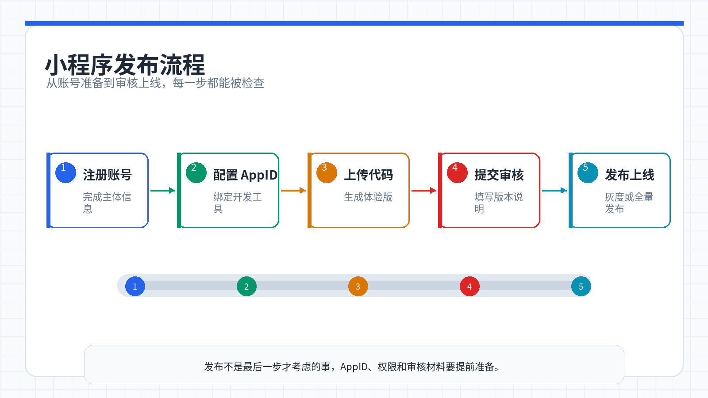

# 第 12 周：平台选择与小程序入门

> **从想法到真实产品，第一步是选对舞台。** 小哲的汉堡店网站已经能跑了，但他发现一个问题：用户更习惯在微信里点单，而不是打开浏览器输入网址。这周他要学会两件事——第一，如何根据用户习惯和产品特点选择开发平台；第二，如何把一个想法真正做成微信小程序，从注册账号到上线发布，完整跑通一次。

<ChapterIntroduction duration="实战课（约 4 小时）" output="平台选择决策框架 + 一个可在微信搜到的真实小程序" prerequisite="完成第 11 周 Supabase 数据库接入；会用 Figma 出原型；配过 GitHub 和 Zeabur" :tags="['平台选择', '微信小程序', 'uni-app', 'HBuilderX', '小程序发布', '跨平台开发']">

你会先建立一套判断力：什么场景该做小程序、什么时候该做 App、什么时候网站就够了。然后跟着小哲从零搭建一个贪吃蛇小程序，用 Trae 和 AI 完成开发，在微信开发者工具里调试，最后真正发布到微信，让任何人都能搜到、玩到。

</ChapterIntroduction>

<StepBar :active="0" :items="[
  { title: '① 认识开发平台', description: '移动端、桌面端、Web、小程序生态' },
  { title: '② 平台选择决策', description: '用户在哪、需要什么能力、资源有多少' },
  { title: '③ 小程序开发环境', description: '注册账号、装工具、创建项目' },
  { title: '④ Vibe Coding 实战', description: '用 AI 写贪吃蛇小程序' },
  { title: '⑤ 发布上线', description: '从体验版到正式发布' }
]" />

---

## 1. 小哲的困惑：我该做什么平台？

> 小哲的汉堡店网站已经部署在 Zeabur 上，数据存进了 Supabase，用户可以注册登录、下单支付。功能都有了，但他发现一个尴尬的事实：**真正的顾客更习惯在微信里完成一切。**
>
> 他们不会主动打开浏览器、输入网址、注册账号，而是希望扫个码、点个链接，直接在微信里点餐。小哲意识到，技术能力不是问题，**选对平台才是关键**。

这一周，我们先解决「选平台」这个更本质的问题，再用微信小程序作为具体案例，完整跑通一次从想法到上线的全流程。

---

## 2. 先认识这些平台

在讨论「选哪个」之前，先搞清楚「有哪些」。下面是目前主流的开发平台分类：

### 2.1 移动端平台

<InfoCard icon="📱" variant="info">
**iOS 原生 App**

你 iPhone 上从 App Store 下载的软件。特点是打开速度快、用起来丝滑、能调用手机的所有功能（相机、定位、健康数据等）。但开发必须用苹果电脑，而且要经过苹果审核才能上架。

**常见案例**：微信、抖音、小红书、Keep、美团、支付宝
</InfoCard>

<InfoCard icon="🤖" variant="info">
**Android 原生 App**

安卓手机上从应用商店下载的软件，或者朋友发给你一个 APK 文件安装的。和 iOS App 类似，但安卓用户更多、分发渠道更多样。缺点是安卓手机型号太多，开发者要适配各种屏幕和系统版本。

**常见案例**：Tasker（自动化工具）、MX Player（视频播放器）、AirDroid（手机管理）
</InfoCard>

<InfoCard icon="💬" variant="success">
**微信小程序**

你在微信里扫个码、搜个名字就能直接用的「小应用」，不用下载安装。好处是用户门槛低——大家都有微信，点开就能用。坏处是功能有限，而且只能在微信里跑，离开微信就用不了。

**常见案例**：拼多多（拼团电商）、美团外卖（本地生活）、摩拜单车（扫码骑车）、跳一跳（小游戏）
</InfoCard>

<InfoCard icon="🌐" variant="info">
**PWA（渐进式 Web 应用）**

听起来很技术，其实就是「能像 App 一样安装的网页」。你在手机浏览器里打开某个网站，它会弹出一个「添加到主屏幕」的提示，点一下，桌面上就多了一个图标，点开看起来就像一个 App。好处是一套代码手机电脑都能用，坏处是很多人不知道还能这么用。

**常见案例**：Twitter Lite、星巴克、Pinterest、Uber、Spotify Web Player
</InfoCard>

### 2.2 桌面端平台

<InfoCard icon="💻" variant="info">
**Electron 桌面程序**

你可能每天都在用：VS Code、Slack、Discord、Notion、Figma——这些软件都是用 Electron 开发的。特点是：用写网页的技术（HTML、CSS、JavaScript）来写桌面软件，一套代码就能在 Windows、Mac、Linux 上运行。缺点是安装包比较大，运行时占内存多一些。

**常见案例**：VS Code、Slack、Discord、Notion、Figma、微信开发者工具
</InfoCard>

<InfoCard icon="⚙️" variant="info">
**Qt 桌面应用**

如果你用过 WPS、VirtualBox、OBS，那很可能就是 Qt 开发的。它用 C++ 语言编写，性能好、稳定性高，特别适合工业场景。但学习门槛高，需要懂 C++。

**常见案例**：WPS Office、VirtualBox、Autodesk Maya、Telegram Desktop、OBS Studio
</InfoCard>

### 2.3 Web 相关平台

<InfoCard icon="🌍" variant="info">
**网站**

就是你在浏览器里输入网址打开的那些页面。好处是：任何设备都能访问（手机、电脑、平板）、不用安装、搜索引擎能搜到。坏处是必须联网，离线就用不了。

**常见案例**：淘宝网、知乎、GitHub、B站、掘金、CSDN
</InfoCard>

<InfoCard icon="🧩" variant="info">
**浏览器插件**

你有没有装过广告拦截器、翻译工具、密码管理器？这些就是浏览器插件。它们住在浏览器里，能读取和修改你正在看的网页内容。好处是轻量、随浏览器启动；坏处是只能在浏览器里工作，而且不同浏览器（Chrome、Edge、Firefox）的插件还不通用。

**常见案例**：AdBlock Plus、沉浸式翻译、1Password、Grammarly、Tampermonkey
</InfoCard>

---

## 3. 先问自己三个问题

在选择平台之前，先回答这三个核心问题：

<InfoCard icon="🎯" variant="primary">
**问题一：你的用户在哪里？**

- 用户是否需要随时随地使用？（移动端优先）
- 用户是否习惯在微信里完成操作？（小程序）
- 用户是否会在办公场景长时间使用？（桌面程序）
- 用户是否需要通过搜索引擎找到你？（网站）
</InfoCard>

<InfoCard icon="⚡" variant="success">
**问题二：你的应用需要什么能力？**

- 是否需要调用摄像头、麦克风、GPS 等硬件？
- 是否需要离线使用？
- 是否需要推送通知？
- 是否需要处理大量本地数据？
</InfoCard>

<InfoCard icon="💰" variant="warning">
**问题三：你的资源有多少？**

- 开发时间预算？
- 是否有 Mac 设备（iOS 开发必需）？
- 是否需要同时覆盖多个平台？
</InfoCard>

---

## 4. 平台选择决策图

下面这张表，帮你快速定位：

| 你的使用场景 | 推荐平台 | 原因 |
|---------|---------|------|
| 用户在微信生态，想快速获客 | 微信小程序 | 无需下载，微信内传播，获客成本低 |
| 需要后台持续记录 GPS 轨迹、读取健康数据 | iOS / Android 原生 | 直接调用系统 API，性能最优 |
| 想要一套代码覆盖多平台 | PWA / Electron | 开发效率高，维护成本低 |
| 用户需要长时间在电脑上使用 | 桌面程序（Electron / Qt） | 独立窗口，可离线，系统集成度高 |
| 想在看网页时自动总结、翻译或管理密码 | 浏览器插件 | 可读取和修改网页内容，随浏览器启动 |
| 想让技术文章、项目展示被 Google 搜到 | 网站 / 个人博客 | SEO 友好，内容可被搜索到 |

---

## 5. 具体场景举例

### 场景一：我想做一个社区团购工具

**💡 推荐：微信小程序**

| 如果做成 App | 做成小程序 |
| --- | --- |
| 用户需要下载安装 | 用户就在微信里,扫码即用 |
| 占用手机存储空间 | 用完即走,不占空间 |
| 推广成本高,应用商店获客难 | 微信群分享,一个群接龙带来几十个新用户 |
| 更新需要用户手动升级 | 更新自动生效,用户无感知 |
| 支付链路需要额外接入 | 微信支付一键完成,不需要跳转 |

::: tip 💡 适用场景
如果你做的是类似的事情——拼团、预约、问卷调查、活动报名——小程序都是首选。
:::

---

### 场景二：我想做一个跑步记录 App

**⚡ 推荐：iOS / Android 原生开发**

| 小程序 / 网页的限制 | 原生 App 的能力 |
| --- | --- |
| 无法后台持续记录轨迹 | 后台运行,持续记录轨迹 |
| GPS 精度受限 | 高精度定位,误差在几米内 |
| 无法读取健康数据,如步数、心率 | 调用 Apple HealthKit 和 Google Fit |
| 推送通知不可靠 | 原生推送,每天定时提醒「该跑步了」 |

::: warning ⚠️ 重要提示
任何需要**长时间后台运行**或**深度调用硬件**的应用，都应该选原生开发。
:::

---

### 场景三：我想做一个记账软件

**⚡ 推荐：iOS / Android 原生开发**

为什么？

- **启动速度快**：记账场景需要快速打开、快速记录、快速关闭，原生 App 的启动速度是最佳体验保障
- **使用频率高但单次时间短**：每天记一笔，30 秒就完事，原生 App 的流畅体验让用户更愿意坚持
- **推送提醒**：每天定时提醒用户记账，养成习惯，原生推送最可靠
- **数据安全**：原生 App 可以使用设备级加密，保护用户的财务隐私

虽然 PWA 和小程序也能实现基本功能，但对于高频、快速、注重体验的记账场景，原生开发的启动速度和流畅度是无可替代的。

---

### 场景四：我想做一个团队协作工具

**🤝 推荐：Electron 桌面程序 + 网页版**

<AiChat 
  question="为什么团队协作工具要做桌面版？"
  answer="团队协作工具的核心场景是「上班时长时间开着」。桌面程序可以常驻后台，随时接收消息；可以访问本地文件、系统通知、快捷键；而且 Electron 用 Web 技术开发，桌面版和网页版可以复用 80% 代码。Slack、Notion、Discord 都是这么做的。"
  context="小哲问：为什么不直接做网页版？"
/>

**为什么还要网页版？**

- 临时在其他电脑上用，打开浏览器就行，不用安装
- 移动端可以用响应式网页，不用单独开发 App
- 一套代码，多端复用

---

### 场景五：我想做一个密码管理器

**🔐 推荐：桌面程序 + 浏览器插件**

| 桌面程序负责 | 浏览器插件负责 |
| --- | --- |
| 安全存储密码数据库 | 在网页登录时自动填充 |
| 支持指纹/面容解锁 | 用户不用切换窗口 |
| 离线可用,数据存在本地 | 随浏览器启动,随时可用 |
| 用户知道数据在哪,不用担心云端泄露 | 可以读取和修改网页内容 |

1Password、Bitwarden 都是桌面程序 + 浏览器插件的组合。

---

### 场景六：我想做一个内容创作平台

**✍️ 推荐：网站 + 个人博客**

为什么？

- **SEO 是生命线**：用户通过搜索找到你的内容，这是最大的流量来源
- **内容即产品**：文章、教程、视频，这些内容本身就是价值
- **长期资产**：网站可以运营 10 年，社交账号随时可能被封
- **变现灵活**：广告、付费订阅、知识付费，网站都能承载

Medium、知乎专栏、个人技术博客，本质都是内容平台。

---

## 6. 平台能力对比速查

### 6.1 移动端方案对比

| 能力 | 微信小程序 | iOS 原生 | Android 原生 | PWA |
|-----|----------|---------|-------------|-----|
| 获取用户成本 | 低（微信传播） | 高（应用商店） | 高（应用商店） | 中（搜索引擎） |
| 离线使用 | 有限支持 | 完全支持 | 完全支持 | 支持 |
| 推送通知 | 支持 | 支持 | 支持 | 部分支持 |
| 硬件访问 | 受限 | 完全访问 | 完全访问 | 受限 |
| 后台运行 | 受限 | 支持 | 支持 | 受限 |
| 开发成本 | 低 | 高 | 高 | 低 |
| 需要审核 | 是 | 是 | 是 | 否 |

### 6.2 桌面端方案对比

| 能力 | Electron | Qt | 浏览器插件 |
|-----|----------|-----|-----------|
| 跨平台 | Win/Mac/Linux | Win/Mac/Linux | Chrome/Edge/Firefox |
| 系统集成 | 中等 | 高 | 低 |
| 离线使用 | 支持 | 支持 | 部分支持 |
| 硬件访问 | 通过 Node.js | 完全访问 | 受限 |
| 安装方式 | 安装包 | 安装包 | 浏览器扩展商店 |
| 开发技术栈 | Web 技术 | C++/QML | JavaScript |

---

## 7. 常见误区

<InfoCard icon="❌" variant="danger">
**误区一：「我要做一个 App，所以必须开发 iOS 和 Android」**

不一定。如果你的应用是轻量级的、用完即走的，小程序或 PWA 可能更合适。只有当你需要深度调用系统能力、追求极致性能时，才值得投入原生开发。
</InfoCard>

<InfoCard icon="❌" variant="danger">
**误区二：「网站已经过时了，没人看了」**

恰恰相反。网站是唯一能被搜索引擎收录的平台。如果你想通过内容获客，网站和个人博客是最好的选择。你的技术文章、项目展示，都可以通过 SEO 带来持续流量。
</InfoCard>

<InfoCard icon="❌" variant="danger">
**误区三：「桌面程序没人用了」**

在办公场景，桌面程序依然是主流。VS Code、Slack、Notion 都是桌面程序。如果你的应用需要长时间使用、处理大量数据、或需要系统集成，桌面程序是最佳选择。
</InfoCard>

---

## 8. 小哲的选择：为什么做微信小程序

> 小哲回到汉堡店的场景，重新审视了三个问题：
>
> **用户在哪里？** 顾客都在微信里，他们习惯在微信群里接龙、在朋友圈看推荐、用微信支付。
>
> **需要什么能力？** 点餐不需要后台运行，不需要读取健康数据，只需要展示菜单、下单、支付——这些小程序都能做。
>
> **资源有多少？** 他没有 Mac，不想同时维护 iOS 和 Android 两套代码，也不想让用户专门下载一个 App。
>
> 答案很清楚：**微信小程序是最适合汉堡店的平台。**

接下来，我们跟着小哲从零开始，完整跑通一次小程序开发的全流程。

---

## 9. 什么是微信小程序

微信小程序可以看成「开发在微信里的应用」。它不需要你去应用商店搜索、下载、安装，只要在微信里搜名字、扫码，或者点开别人分享的卡片，就能马上使用。用完直接关掉，下次需要再打开即可，不会长期占据你的手机桌面和存储空间。

<AiChat 
  question="小程序和 App 有什么区别？"
  answer="最大的区别是「入口」和「留存方式」。App 需要去应用商店下载安装，会占用手机存储，图标会出现在桌面；小程序不需要安装，入口统一在微信里，用完即走。App 的能力更强（可以后台运行、调用所有硬件），但获客成本高；小程序能力受限，但用户门槛低、传播快。"
  context="小哲问：那我为什么不直接做 App？"
/>

对企业和开发者来说，小程序是一种可以被搜索、被分享的「小应用形态」。只要在微信公众平台上注册、配置好信息，通过审核，小程序就能对所有微信用户开放。和传统 App 相比，它更容易获得第一批用户，因为大家已经习惯在微信里完成很多事情。

在本教程里，我们不会做复杂的业务系统，而是选一个很经典的例子——**贪吃蛇小游戏**。它体量小、逻辑清晰，却又包含了一个完整小程序需要具备的元素：多个页面、简单交互、状态变化、分数记录等，非常适合作为你的第一个作品。

---

## 10. 小程序开发的三种方法

真正做小程序时，大家采用的技术路线并不完全一样。为了避免你一上来就被各种名词淹没，我们只做一个粗略分类：

<InfoCard icon="🔧" variant="info">
**方法一：微信原生开发**

直接使用微信官方提供的原生能力。在微信开发者工具中创建项目后，你会看到一组固定的文件类型（.wxml、.wxss、.js），用它们来描述页面结构、样式和逻辑。这种方式贴近官方文档，控制力强，但对第一次接触前端的人来说，学习曲线会稍微曲折一些。
</InfoCard>

<InfoCard icon="🌐" variant="success">
**方法二：uni-app 多端框架**

利用多端框架，比如 uni-app。你在本地主要是写类似网页的代码（例如 .vue 文件），然后通过框架把这套代码转换成微信小程序可以识别的形式。好处是：结构更统一，以后如果想把产品发布到其他平台（比如 H5、App），改动会相对少一些。**本教程采用这种方式。**
</InfoCard>

<InfoCard icon="🤖" variant="primary">
**方法三：AI 辅助开发**

基于以上两种方式，把整个项目在 Trae 里打开，然后直接对内置的 AI 助手说：「请帮我在这个文件里加一个首页，有标题和按钮」「请帮我写一个游戏页面，可以显示贪吃蛇和分数」。AI 会在理解现有代码的基础上，为你生成新的代码片段，或者帮你修改、重构。**本教程会重点讲这种方式。**
</InfoCard>

这三种方式并不是互斥的。你完全可以在一个 uni-app 项目里，借助 Trae 的 AI 功能来完成大部分编码工作。关键不是选哪一个方法，而是知道：自己现在处在什么位置，以及有哪些工具可以用。

---

## 11. 环境准备

在开始写任何一行代码之前，我们先把开发环境准备好。这一部分的目标，是让你在后面的章节里不再纠结「去哪儿下载软件、为什么运行不了」，而是可以直接把注意力放在和 AI 对话、实现需求上。

### 11.1 本教程会用到的三个工具

整个贪吃蛇小程序的开发，我们会同时用到三个工具，它们各自负责不同的环节：

<StepBar :active="0" :items="[
  { title: 'Trae', description: '和 AI 一起写代码' },
  { title: 'HBuilderX', description: '快速生成项目骨架' },
  { title: '微信开发者工具', description: '预览和调试小程序' }
]" />

1. **Trae**：你可以把它理解为一款集成了 AI 的代码编辑器，既能像普通 IDE 一样打开项目文件，又能让你直接用自然语言和 AI 交流，请它帮你写代码、改代码、解释代码。本教程里，大部分「和 AI 一起写小程序」的操作，都会在 Trae 里完成。你可以在浏览器中访问 https://www.trae.cn 获取最新版本。

2. **HBuilderX**：它是一款对 Vue 和 uni-app 支持特别好的编辑器，官方提供了很多现成的小程序项目模板。我们会用它来「一键生成」一个基础的小程序项目，相当于先打好地基，再把地基交给 Trae 和 AI 去改造。HBuilderX 的下载地址是 https://www.dcloud.io/hbuilderx.html 。

3. **微信开发者工具**：这是微信官方提供的专门用来开发和预览小程序的工具。它负责把你写好的项目在电脑上跑起来，并支持在手机上进行真机调试。你可以从 https://developers.weixin.qq.com/miniprogram/dev/devtools/download.html 下载适合你操作系统的版本。

简单总结一下：**HBuilderX 帮你快速建一个小程序项目，Trae 帮你和 AI 一起写代码，微信开发者工具帮你看到真正运行中的小程序。**

### 11.2 注册微信公众平台账号并获取 AppID

有了工具，还需要一个「小程序身份」，这一步在微信公众平台上完成。如果你之前从来没有注册过微信小程序，可以按照下面的顺序来做：

1. 在浏览器地址栏输入 https://mp.weixin.qq.com ，打开微信公众平台网页，用你的微信扫码登录。
2. 在首页选择「小程序」，按照页面提示完成注册流程，填写邮箱、手机号以及主体类型（个人或企业）。
3. 注册成功并进入后台后，找到「开发管理」或「开发设置」页面，就能看到一个唯一的编号，名字叫 **AppID**。这个编号后面会用在项目配置里，相当于你这个小程序在微信里的身份证。

<InfoCard icon="🔑" variant="warning">
**重要：记录你的 AppID**

建议你把 AppID 记录在一个方便找到的地方。后续章节在配置项目时，我们会直接把这个值填进去，让本地项目和线上小程序对应起来。
</InfoCard>

### 11.3 安装微信开发者工具

接下来，我们需要一个地方实际运行和预览小程序，这就是微信开发者工具存在的意义。

1. 访问下载页面 https://developers.weixin.qq.com/miniprogram/dev/devtools/download.html 。在这个页面上，你会看到针对不同操作系统的多个版本，通常选择与你电脑系统匹配的稳定版即可，比如 Windows 64 位或 macOS 版本。
2. 下载完成后，双击安装包，按照安装向导一步步点击下一步。如果你不清楚要改什么设置，保持默认选项就可以。
3. 安装结束后，从桌面或开始菜单启动微信开发者工具。首次启动时，它会在屏幕上显示一个二维码，提示你用手机微信扫码登录。用自己的微信扫码并确认授权后，就可以进入主界面。

后面当我们在 Trae 中准备好项目文件之后，就会把构建好的小程序导入到微信开发者工具里，在这里看到真实的运行效果。

### 11.4 准备 Trae 和 HBuilderX

最后，我们把真正负责写项目的两个工具安装好：Trae 和 HBuilderX。

你可以**先安装 Trae**。打开浏览器访问 https://www.trae.cn ，根据页面提示下载适合你系统的版本。安装过程和普通软件一样，双击安装包，按提示完成即可。安装完成后，你会得到一个可以打开本地文件夹、查看代码、和 AI 对话的 IDE，后续所有 Vibe Coding 步骤都会在这里进行。

**接着安装 HBuilderX**。访问 https://www.dcloud.io/hbuilderx.html ，选择对应操作系统的发行包下载。HBuilderX 的包体非常小，启动速度也很快。安装完成后，你可以先熟悉一下它的界面，不需要深入研究功能；在后面的章节中，我们会用它来创建一个 uni-app 小程序模板，作为整个项目的起点。

### 11.5 用 HBuilderX 创建项目骨架

完成本节的所有步骤之后，你已经具备了完整的开发环境：有微信小程序的账号和 AppID，有可以预览的小程序运行环境，也有可以和 AI 一起写代码的 IDE。现在，我们用 HBuilderX 快速生成一个项目骨架。

<StepBar :active="0" :items="[
  { title: '① 新建项目', description: '选择 uni-app 模板' },
  { title: '② 配置项目', description: '填写项目名称和路径' },
  { title: '③ 创建成功', description: '得到基础文件结构' },
  { title: '④ 在 Trae 中打开', description: '准备开始 Vibe Coding' }
]" />

1. 打开 HBuilderX，点击顶部菜单的「文件」→「新建」→「项目」。
2. 在弹出的窗口中，选择「uni-app」模板，选择「默认模板」。
3. 给小程序起个名字，比如「snake-game」，选择存放路径，点击右下角的「创建」。
4. 显示创建成功！你可以在对应的文件夹中找到该项目，里面已经有了完整的文件结构。

**空文件夹:**

```text
snake-game/
  (空)
```

**生成后的项目:**

```text
snake-game/
  pages/          # 页面文件
    index/        # 首页
      index.vue
  static/         # 静态资源
  uni_modules/    # uni-app 模块
  App.vue         # 应用入口
  main.js         # 主入口文件
  manifest.json   # 应用配置
  pages.json      # 页面路由配置
  uni.scss        # 全局样式
```

现在，在 Trae 里打开这个文件夹，可以看到地基文件已经全部建造好。接下来，我们就要让 AI 在这个地基上盖房子了。

---

## 12. 小程序开发实战

前面两部分，我们已经搞清楚了「小程序是什么」、以及「环境怎么配、工具怎么装」。从这一节开始，正式进入实战：不再停留在概念层面，而是让 AI 真正帮你把贪吃蛇小程序从无到有做出来。

这一节，你会完整走完一次「开发环节」的 SOP，大致包括几步：

1. 在 Trae 里把当前项目打开，给 AI 下第一条完整指令，让它基于现有骨架设计并实现一个可运行的贪吃蛇版本。
2. 让 Trae 直接改动真实项目文件，而不是只给你「示例代码」，并学会用回退功能在需要时恢复到修改前的状态。
3. 回到 HBuilderX 和微信开发者工具，通过「运行到小程序模拟器」的方式在模拟器里试玩这一版，实现从「代码视角」到「用户视角」的切换。
4. 根据试玩结果，用自然语言持续提出修改需求，让 AI 帮你从按键控制迭代到摇杆控制，顺便体验一次「发现问题 → 描述问题 → AI 修复 → 再次验证」的闭环。

### 12.1 把需求一次性说清楚：给 Trae 下第一条「总指令」

打开 Trae，载入前面已经准备好的小程序项目之后，我先没有急着改某一行代码，而是对内置的 AI 助手说了这样一件事：

<AiChat 
  question="我现在需要基于现在的框架写一个贪吃蛇小程序，请给我设计此小程序并写一个 prompt。"
  answer="好的，我会帮你设计一个贪吃蛇小程序，并基于 uni-app 项目结构创建页面和逻辑。"
  context="小哲在 Trae 中的第一条指令"
/>

AI 规划的功能包括:

1. **首页**:显示游戏标题、开始按钮、最高分记录
2. **游戏页面**:包含游戏画布、摇杆控制、实时分数显示、暂停/继续按钮
3. **游戏逻辑**:处理蛇的移动和转向,吃到食物后增长并加分,撞墙或撞到自己时结束游戏,记录最高分

也就是说，我不是「一点点要求它写某个函数」，而是先抛出一个完整目标，让 AI 帮我规划。Trae 收到这条指令之后，会自动阅读当前项目结构，判断应该在哪些文件里增加页面、在哪些地方补充逻辑，然后直接对项目中的文件或代码做出修改。

### 12.2 让 AI 自动修改代码，而不是「手搓」

当你在 Trae 中点击执行这条指令时，AI 会进入一个「帮你改工程」的流程。在这个过程中，你可以看到几个关键点：

1. 它会在对话区解释自己的思路，比如会在哪个目录下新增页面、打算如何组织游戏逻辑。
2. 它会直接对真实项目文件做增删改，而不是只给你一段「示例代码」让你自己拷贝。
3. 修改完成后，Trae 会生成一个简短的小结，告诉你：这次它改了哪些文件，大致做了哪些事情。

**修改前:**

```text
pages/
  index/
    index.vue  (默认首页)
```

**修改后:**

```text
pages/
  index/
    index.vue  (改成游戏首页)
  game/
    game.vue   (新增游戏页面)
    snake.js   (新增游戏逻辑)
```

如果你对这一轮修改不满意（或者觉得某一步有问题），也不用紧张。Trae 在你发出对话的对话框外的左上角提供了「回退」能力，你可以一键把工程恢复到本次指令执行之前的状态，相当于给这次操作加了一个安全的撤销键。

### 12.3 在 HBuilderX 和微信开发者工具中查看效果

AI 完成第一轮开发之后，代码已经落在项目里了，但这时候你还没有看到玩家视角的效果。下一步，我们需要把它跑起来。

具体做法是：回到 HBuilderX，找到顶部菜单的「运行」选项，选择「运行到小程序模拟器」中的「微信开发者工具」。这一操作会触发项目编译，并将结果交给微信开发者工具打开。

<StepBar :active="0" :items="[
  { title: '① 在 HBuilderX 中运行', description: '运行 → 运行到小程序模拟器 → 微信开发者工具' },
  { title: '② 等待编译', description: '底部输出窗口显示编译过程' },
  { title: '③ 自动打开', description: '微信开发者工具自动打开项目' },
  { title: '④ 查看效果', description: '在模拟器中看到小程序界面' }
]" />

底部的输出窗口会显示编译的过程。如果最终状态是「ready」且没有报错，就说明构建成功，你可以切到微信开发者工具里查看这一版小程序的界面和功能。

在大多数情况下，HBuilderX 会自动帮你打开微信开发者工具，让你直接看到新的小程序。如果没有自动打开，你可以按下面的方式处理：

1. 先在 HBuilderX 中停止当前运行。
2. 手动启动微信开发者工具，让它处于打开状态。
3. 回到 HBuilderX，再次点击「运行 → 运行到小程序模拟器 → 微信开发者工具」。

这样我们就可以在微信小程序开发者工具中看到我们 Vibe Coding 的小程序了。

### 12.4 用自然语言反复调整和完善小程序

在这次实践中，AI 一开始给我生成的是按键控制方向的贪吃蛇：屏幕上有四个方向按钮，点击不同方向，蛇就会改变运动方向。功能上完全可以玩，但我个人更喜欢用摇杆控制。

这就是 Vibe Coding 的优势所在：你不必自己去翻代码，查找事件绑定的位置、计算坐标的逻辑，而是直接把想法告诉 AI。例如，你可以在 Trae 的对话框里这样描述：

<AiChat 
  question="把按键换成摇杆控制，并且用户松开摇杆时蛇保持同方向移动，直到用户再次拖动摇杆。"
  answer="好的，我会把按键控制改成摇杆控制,并在 game.vue 中添加触摸事件和方向保持逻辑。"
  context="小哲的第二条指令"
/>

这次修改的具体实现包括:

1. 在游戏页面添加一个圆形摇杆组件
2. 监听触摸事件,计算摇杆偏移角度
3. 根据角度判断上下左右方向
4. 松开摇杆时,蛇保持当前方向继续移动
5. 再次拖动摇杆时,更新移动方向

只要你把需求讲得足够清楚，AI 会自动定位到对应界面和逻辑文件，替你完成控件样式、交互绑定和方向处理等改动。

**按键控制:**

```html
<view class="controls">
  <button @tap="moveUp">↑</button>
  <button @tap="moveDown">↓</button>
  <button @tap="moveLeft">←</button>
  <button @tap="moveRight">→</button>
</view>
```

**摇杆控制:**

```html
<view class="joystick"
  @touchstart="onJoystickStart"
  @touchmove="onJoystickMove"
  @touchend="onJoystickEnd">
  <view class="joystick-bg"></view>
  <view class="joystick-stick"
    :style="stickStyle"></view>
</view>
```

修改完成后，再回到微信开发者工具中查看。如果没有立刻看到变化，可以尝试点击开发者工具上的「编译」按钮，或者刷新小程序预览窗口，让最新的构建结果生效。

### 12.5 出现问题怎么办：继续用自然语言沟通

AI 生成的版本不一定一开始就完美。有时候你会遇到这些情况：

- 运行时报错，小程序无法正常打开；
- 功能大致正确，但细节和你想象的不太一样；
- 界面可以用，但你觉得还可以更好看或更顺手。

在这些时候，不需要自己钻进代码里盲改，而是可以把遇到的问题直接用自然语言重新描述给 Trae 中的 AI 助手，例如：

<AiChat 
  question="现在摇杆控制已经生效了，但有时候蛇会突然停止不动，请帮我检查当前实现哪里有问题。"
  answer="我检查了代码,问题出在 onJoystickEnd 方法中。松开摇杆时不应该清空方向状态。"
  context="小哲发现了 bug"
/>

正确的逻辑应该是:

1. 松开摇杆时,不清空方向状态
2. 蛇继续按照最后一次的方向移动
3. 只有在用户再次拖动摇杆时,才更新方向

AI 会根据你当前的项目状态和描述，给出修改建议并直接应用在代码里。如果修改之后结果更糟或方向不对，你依然可以使用回退，把工程恢复到前一个稳定版本，再换一种说法尝试。

通过这几轮往返，你会从最初的「毛坯版本」，逐步打磨出一个更贴近自己喜好的摇杆版贪吃蛇小程序。

### 12.6 最终成品与本节小结

经过一轮又一轮的 **自然语言叙述 → AI 修改 → 在微信开发者工具中预览 → 继续对话微调**，我最终得到的是这样一个成品：

- 有完整的游戏页面；
- 蛇可以顺畅移动并吃到食物；
- 支持摇杆控制；
- 在小程序模拟器中可以顺利运行。

在这一节里，你已经看到了一个完整的闭环：

1. 在 Trae 中用一句清晰的指令，让 AI 搭出第一版贪吃蛇小程序；
2. 借助 HBuilderX 和微信开发者工具，从用户视角检查实际效果；
3. 用自然语言反复向 AI 提出修改需求，让它替你完成功能调整和界面优化；
4. 在任何一步出现问题时，都可以通过回退和重新运行来保证安全。

接下来，你可以按照同样的节奏去尝试自己的想法：不一定非要是贪吃蛇，也可以是一个工具小程序、一个活动页，甚至是你工作中真正需要的业务原型。你的主要任务，是把需求想清楚、说清楚，其余的交给 AI 和这些工具来配合完成。

---

## 13. 小程序发布

前面三章，我们已经完成了从**搭环境**——**和 AI 一起开发**到**在本地模拟器里跑通贪吃蛇**的整个流程。

从这一章开始，我们关心的问题变成了：**怎样把这个作品真正挂到微信上，不只是一个小玩具，而是所有人都可以使用的微信小程序呢？**



*发布流程从账号、AppID、上传、审核到上线，每一步都要提前准备材料。*

为了降低门槛，我们先走一条**最短闭环**：只让它以**测试号**的形式上线，先自己和少数同学体验；等到你觉得功能和体验都足够稳定，再走正式上线流程。

### 13.1 最短 SOP —— 测试号上线

这一小节的目标只有一个：让你在微信里，真的能以**体验版**的形式打开自己的贪吃蛇小程序。

整个流程可以理解为四件事：

<StepBar :active="0" :items="[
  { title: '① 确认 AppID', description: '在微信公众平台找到小程序 ID' },
  { title: '② 配置项目', description: '在 manifest.json 中填写 AppID' },
  { title: '③ 上传版本', description: '在微信开发者工具中上传代码' },
  { title: '④ 设为体验版', description: '在公众平台设置体验版' }
]" />

#### 13.1.1 在微信公众平台确认 AppID

第一步，是在微信公众平台上确认你的小程序 AppID。

这一步你之前在**环境准备**时已经做过一次，这里是把它真正用起来。

1. 打开浏览器，访问 `https://mp.weixin.qq.com`，登录你的小程序后台。
2. 在左侧菜单中找到「开发管理」，进入其中的「开发设置」。
3. 在页面上方，你会看到一块叫做「开发者 ID」的区域，里面有一行「AppID（小程序 ID）」——这就是你的小程序唯一编号。

这串编号需要和项目中的配置一一对应，否则微信会认为你上传的是「别人的小程序」，自然无法正常预览和发布。

#### 13.1.2 在项目中填写 AppID

第二步是把这个 AppID 写进你的项目配置里，让本地构建出来的小程序和公众平台上的这个「账号」对应上。

如果你是用 uni-app 模板来做的项目，可以按照下面的方式操作：

1. 打开 HBuilderX，载入你的贪吃蛇项目。
2. 在左侧文件树中找到 `manifest.json`，双击打开。
3. 下拉到「微信小程序配置」这一栏，你会看到一个输入框，提示类似「微信小程序 AppID（请在微信开发者工具中获取）」。
4. 把刚才在公众平台上看到的 AppID 原样粘贴进来，保存文件。

**manifest.json 修改前:**

```json
"mp-weixin": {
  "appid": "",
  "setting": {
    "urlCheck": false
  }
}
```

**manifest.json 修改后:**

```json
"mp-weixin": {
  "appid": "wx1234567890abcdef",
  "setting": {
    "urlCheck": false
  }
}
```

到这里为止，你的本地项目就已经认领了这个小程序身份。接下来，只要通过微信开发者工具上传版本，它就会被记在这个 AppID 名下。

#### 13.1.3 在微信开发者工具中上传一个版本

前面我们已经用 HBuilderX 把项目运行到微信开发者工具里，看过模拟器中的效果。

现在要做的是：在开发者工具中，把当前这份代码「打一个版本包」上传到服务器上。

大致步骤如下：

1. 在微信开发者工具顶部工具栏的右侧，你会看到一个「上传」按钮，点击它。
2. 弹出的窗口中，需要填写两个关键字段：
   - **版本号**：例如 `1.0.0`，只允许数字和小数点。
   - **项目备注**：写一段简短说明，比如「完成基本功能的开发」。
3. 检查无误后，点击「上传」按钮。下面的输出区域会显示编译过程，所有步骤变成绿色并提示上传完成，就说明这一版已经成功提交到了微信服务器。

<InfoCard icon="✅" variant="success">
**上传成功的标志**

当你看到「上传成功」的提示，并且输出窗口显示「代码包大小：XXX KB」时，就说明这一版已经成功提交到微信服务器了。
</InfoCard>

#### 13.1.4 在管理后台中把版本设为体验版

上传只是把代码送到了微信这边，还没告诉系统「这是一版可以试用的体验版本」。

最后一步，我们回到公众平台的小程序后台，完成这个闭环。

1. 再次打开 `https://mp.weixin.qq.com`，进入你的小程序后台。
2. 在左侧找到「管理」下面的「版本管理」，点击进入。
3. 在页面的「开发版本」一栏，你应该能看到刚刚上传的那个版本：版本号是 `1.0.0`，备注是你写的那一段说明，时间是刚刚的上传时间。
4. 在这一行的右侧，会有一个下拉按钮或操作按钮，可以选择「设为体验版」，点击之后，确认操作。

<InfoCard icon="⚠️" variant="warning">
**注意：设置类目**

在设为体验版之前，请确保你已经在「首页 → 小程序类目」中设置好了你的主营类目。否则可能会提示「请先设置类目」。
</InfoCard>

完成之后，这个版本就变成了你的小程序「体验版」。你可以在后台生成体验版二维码，也可以把自己和同事加入「体验成员」，让大家用微信扫描后，在真机上体验这款贪吃蛇小程序。

到这里，我们就完成了从本地项目到测试号上线的最短闭环：你不需要一开始就面向所有微信用户开放，只是在一个安全的范围内，让真实的小程序跑在真实的微信环境里。这足够你用来测试功能、收集反馈、继续迭代。

### 13.2 小程序正式上线

体验版跑通之后，你已经可以在自己的微信里玩到这款贪吃蛇小程序了。接下来要做的，就是把它从只有少数体验成员能用的状态，推进到全民可用的正式微信小程序。

把这件事拆成几步：先补充信息，再选择类目，然后完成备案，最后提交审核。下面按照这个顺序走一遍。

<StepBar :active="0" :items="[
  { title: '① 填写基本信息', description: '名称、简介、图标、展示图片' },
  { title: '② 选择服务类目', description: '确定小程序的归属分类' },
  { title: '③ 完成备案', description: '验证主体身份' },
  { title: '④ 提交审核', description: '等待微信团队审核' },
  { title: '⑤ 正式发布', description: '审核通过后上线' }
]" />

#### 13.2.1 进入小程序发布流程

首先回到微信公众平台后台，登录你的小程序账号。在左侧导航里找到与「版本管理 / 发布」相关的入口（不同时间界面可能略有调整），展开后会看到「小程序发布流程」这一项。

点击进入之后，界面上方会显示一个进度条，下面依次列出几个步骤，例如：

1. 小程序信息
2. 小程序类目
3. 运营信息 / 小程序备案
4. 微信认证（视你的主体而定）

一开始进度会显示 0%，随着你完成每一步，系统会自动把进度向前推进。

#### 13.2.2 填写小程序基本信息

第一步是把小程序的「名片」补充完整，这也是用户在微信里第一次看到你的时候会接触到的内容。

在「小程序信息」页面，你通常需要填写和确认以下内容：

<InfoCard icon="📝" variant="info">
**小程序基本信息清单**

1. **小程序名称**：这个名字会出现在搜索结果和小程序顶部，有长度限制，同时需要符合微信的命名规范。建议选择既能表达功能，又方便记忆的名称，例如「贪吃蛇 Vibe Coding 版」。

2. **功能介绍 / 简介**：用一两句话说明这个小程序是做什么的，例如：「一款用 AI 辅助开发完成的贪吃蛇小游戏，适合在碎片时间玩一局。」注意简介要和实际功能一致，避免使用夸张宣传语。

3. **图标和展示图片**：
   - 图标一般要求为正方形图片，支持 PNG/JPG 等格式，大小和像素有明确限制（以页面说明为准），建议提供一张简洁、对比度高的图。
   - 展示图片可以上传几张小程序页面的截图，例如首页、游戏页面、设置界面等，这些会出现在详情页中，帮助用户了解内容。

4. **其他必要信息**：例如标签、服务区域等，根据页面提示填写即可。
</InfoCard>

原则只有一个：所有填写的内容都要和这款贪吃蛇小程序真实功能相符。全部填写完毕后，点击保存或下一步，发布流程中的第一步就完成了。

#### 13.2.3 选择小程序服务类目

完成基本信息后，向导会引导你进入「小程序类目」步骤。类目可以理解为小程序在微信里的「归属分类」，决定它在审核时会被归入哪一类应用，也会影响后续展示和运营。

在这个页面，你会看到「添加类目」按钮。点击后，可以从系统提供的分类树中选择适合你小程序的方向，例如：

1. 先选择「教育」这一大类；
2. 再在下面选择「教育工具 / 教学辅助」等更具体的子类。

<AiChat 
  question="贪吃蛇小游戏应该选什么类目？"
  answer="建议选择最贴近实际用途的一项。本教程选择「教育 → 教育器具」,把它当做学习 Vibe Coding 的教具。"
  context="小哲问：类目怎么选？"
/>

可选方向包括:

1. **教育 → 教育器具**:如果定位为「学习 Vibe Coding 的教具」
2. **生活服务 → 休闲娱乐**:如果定位为「休闲小游戏」
3. **工具 → 效率**:如果定位为「碎片时间工具」

确认类目后，点击保存。如果页面提示「创建类目成功」，并在列表中显示你刚刚添加的那一项，就说明这一步已经完成。

#### 13.2.4 完成小程序备案信息

接下来，发布流程会要求你完成「运营信息 / 小程序备案」部分。这一步是为了验证小程序的主体身份，确保上线的应用有明确责任人。

在个人主体的示例下，大致会经历这样几个动作：

1. **选择备案类型**：页面会让你在不同主体类型之间进行选择，例如「个人」「企业」等。根据你注册小程序时的主体保持一致即可。

2. **填写主体信息**：包括姓名、证件类型、证件号码等基本信息。这一部分需要与注册信息保持一致，否则可能会在审核时被退回。

3. **上传证明材料**：页面通常会要求你上传身份证照片或其他证明文件，具体格式、清晰度和大小要求会写在说明里。按提示准备好图片后上传，确保内容清晰可辨。

<InfoCard icon="📞" variant="warning">
**备案审核流程**

- 备案审核不通过会打电话给开发者，提示不通过的部分
- 备案会收到「工业和信息化部」发来的验证码和核验链接，点击进入把验证码和个人信息填入即可（核验有效期是 1 天）
- 备案通过会收到「工业和信息化部」发送的邮件和短信通知，并且告知备案号
</InfoCard>

提交之后，系统会进入「审核中」状态，页面上会显示类似「信息已提交，请耐心等待」的提示。这个过程可能需要一定时间，你可以在后台随时查看备案进度。

#### 13.2.5 提交审核并等待正式发布

当「小程序信息」「小程序类目」「运营信息 / 备案」等步骤全部被勾选完成后，你就可以进行最后一个动作：提交审核。

1. 回到「小程序发布流程」总览页面，确认每一项都显示为已完成，进度条接近 100%。
2. 根据页面提示，点击「提交审核」或类似按钮，把当前开发版本送交微信团队审核。
3. 在「版本管理」中，你会看到这次提交的版本状态变为「审核中」。通过后，会变成「已发布」或可选择「上线」的状态。

<InfoCard icon="⏰" variant="info">
**审核时间**

微信小程序的审核时间通常在 1-7 个工作日不等，具体取决于提交时间和审核队列。审核通过后，你会收到微信公众平台的通知，可以在后台点击「发布」按钮，让小程序正式上线。
</InfoCard>

---

## 14. 小哲的收获

> 答辩那天，小哲没有先演示贪吃蛇怎么玩。他先打开微信，搜索自己的小程序名字，点开，说：「这是我用 Vibe Coding 做的第一个真实产品，任何人都能在微信里搜到、玩到。」
>
> 然后他打开 Trae 的对话记录，指着其中一段：「我一开始只说了『做一个贪吃蛇小程序』，AI 帮我生成了整个项目结构。后来我觉得按键不好用，又说『换成摇杆控制』，AI 就帮我改了。整个过程我没有手写一行代码，但我知道每一行代码在做什么，因为我和 AI 一起讨论过。」
>
> 老师问：「如果再给你一次机会，你会做什么？」
>
> 小哲想了想：「我会做一个真正的汉堡店小程序，接入 Supabase 数据库，让用户可以注册登录、下单支付。我现在知道怎么选平台了——用户在微信里，那就做小程序；需要后台运行，那就做 App；想被搜索到，那就做网站。**选对平台，比写代码更重要。**」

这就是这周想教会你的全部：**不是让你背会小程序的 API，而是让你建立一套判断力——什么场景该用什么平台，以及如何用 Vibe Coding 把想法变成真实产品。**

---

## 本周回顾

<ProgressTracker title="第 12 周学习进度" :items="[
  { title: '认识了主流开发平台', description: '移动端、桌面端、Web、小程序生态', done: false },
  { title: '建立了平台选择决策框架', description: '用户在哪、需要什么能力、资源有多少', done: false },
  { title: '搭建了小程序开发环境', description: 'Trae + HBuilderX + 微信开发者工具', done: false },
  { title: '完成了第一个小程序', description: '用 Vibe Coding 做贪吃蛇，从开发到上线', done: false },
  { title: '跑通了发布流程', description: '从体验版到正式发布的完整路径', done: false }
]" />

**自测问题：**

1. 如果你要做一个「每天提醒用户喝水」的应用，应该选什么平台？为什么？
2. 微信小程序和原生 App 的核心区别是什么？各自适合什么场景？
3. 在 Vibe Coding 开发小程序时，如果 AI 生成的代码有问题，你应该怎么做？

---

## 下周预告

小程序上线了，但小哲发现一个新问题：**用户不知道怎么用。** 界面上虽然有按钮，但用户不知道点了会发生什么；虽然有功能，但用户不知道从哪里开始。下周，我们要学的是**产品设计与用户体验**——如何用 AI 帮你做原型设计、如何让界面「会说话」、如何用数据验证你的设计是否有效。我们下周见。
