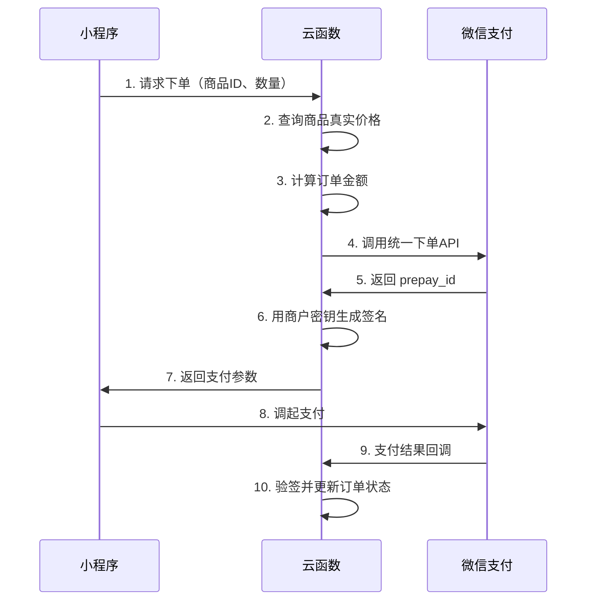

# 第 13 周：小程序后端开发，让数据在云端流动

> 小哲的汉堡店小程序前端已经跑起来了,用户能看到菜单、能点击下单。但他很快发现一个致命问题:所有数据都存在手机本地,换个设备就全没了;更要命的是,订单、支付、库存这些关键逻辑如果放在前端,任何人都能通过抓包工具篡改价格。这周他要补上最关键的一块:**把后端搭起来,让数据在云端安全流动。**

<ChapterIntroduction duration="2 课时（约 4 小时）" output="一个带云开发后端的微信小程序 + 完整的登录态、数据库、云函数、文件上传能力" prerequisite="完成 Week 12 小程序前端开发;理解前后端分离概念;会用开发者工具调试" :tags="['微信云开发', 'CloudBase', '云函数', '云数据库', '云存储', '登录态', 'RLS', '支付安全']">

你会跟着小哲走一遍「从纯前端到前后端分离」的完整路径:先搞清楚为什么小程序需要后端,再用微信云开发实现「登录态 + 数据库 + 云函数」这三项地基,最后摸到文件上传、内容审核、支付签名这些生产级能力。重点不是背 API,而是建立一套判断力:**一个真实小程序的后端由哪些模块组成,每块解决什么问题,什么时候该用哪一块。**

</ChapterIntroduction>

<StepBar :active="0" :items="[
  { title: '① 为什么需要后端', description: '前端的边界与后端的职责' },
  { title: '② 认识微信云开发', description: 'CloudBase 控制台逐项拆解' },
  { title: '③ 第一个云函数', description: '登录态 + 用户身份识别' },
  { title: '④ 云数据库实战', description: '订单 CRUD + 安全规则' },
  { title: '⑤ 生产级能力', description: '文件上传 / 内容审核 / 支付签名' }
]" />

---

## 上节课回顾

在上节课中,我们学会了用微信开发者工具搭建小程序前端,能够用 WXML/WXSS/JS 实现页面交互,并通过 `wx.request` 调用外部接口。为了帮助大家更好地衔接知识,在开始本节课的新内容前,让我们一起通过几道简单的题目快速回顾一下上节课的核心知识点:

1. 小程序的页面由哪四个文件组成?各自负责什么?
2. `wx.navigateTo` 和 `wx.redirectTo` 的区别是什么?
3. 如何在小程序中发起网络请求?需要配置什么?
4. 什么是小程序的生命周期?`onLoad` 和 `onShow` 分别在什么时候触发?

如果对以上任何一个问题还有印象模糊的地方,建议先回顾一下上节课的文档和讲义。

在本节课中,我们将学习如何让一个小程序从「能跑起来」变为更接近真实线上产品:除了用云数据库管理订单、库存等数据外,还要具备完善的用户体系（登录态、权限校验）以及其他关键后端能力（文件上传、内容审核、支付签名）。我们会以微信云开发（CloudBase）为主线,先用它实现「登录态 + 数据库 + 云函数」这三项基础功能,再以云开发提供的组件为参照,进一步理解现代小程序后端通常包含的核心模块,以及各模块的具体职能与作用逻辑。

::: tip 你将学到
1. 什么是「小程序带后端」,哪些事情必须放到后端
2. 什么是微信云开发,如何使用云开发搭建后端
3. 如何用云函数实现登录态和用户身份识别
4. 如何用云数据库存储订单并配置安全规则
5. 学会云开发进阶功能:云存储、内容审核、支付签名

最终产出:
- 一个带云开发后端的微信小程序（登录 + 数据库 + 云函数）
- 一套可复用的云开发后端代码模板,供后续项目直接套用
:::

---

## 1. 小哲的困境:为什么前端不够用

### 1.1 小哲遇到的三个问题

小哲的汉堡店小程序前端已经做得很漂亮了:菜单展示、购物车、下单流程都能跑通。但当他准备上线时,测试同学连续提了三个致命问题:

**问题 1:数据只活在本地**

测试同学在手机 A 上下了单,换到手机 B 登录同一个账号,订单记录全没了。原来小哲把订单存在了 `wx.setStorageSync` 里,数据只活在当前设备的本地存储中,根本没有「云端同步」的概念。

**问题 2:价格可以随便改**

测试同学打开抓包工具,把一份 18 元的汉堡改成 0.01 元,居然真的下单成功了。原来小哲把价格计算逻辑写在了前端 JS 里,任何人都能通过修改代码或抓包篡改金额。

**问题 3:用户身份无法识别**

小哲想给 VIP 用户打折,但他发现小程序根本不知道「当前用户是谁」。虽然用户点了「授权登录」,但前端拿到的只是一个临时的 `code`,没法直接换成「这是张三还是李四」的身份信息。

这三个问题暴露了一个本质矛盾:**前端天生不可信。** 任何跑在用户设备上的代码,都可以被查看、修改、伪造。真正重要的事情——识别用户身份、校验权限、计算价格、扣减库存、生成支付签名——必须放在一个「用户碰不到」的地方,这个地方就是**后端**。

<InfoCard icon="💡" variant="tip">
**小哲的「啊哈」时刻**

测试同学给他画了一张图:

```
前端（小程序）          后端（云端）
┌─────────────┐        ┌─────────────┐
│ 展示页面    │        │ 识别身份    │
│ 收集参数    │  ───>  │ 校验权限    │
│ 显示结果    │  <───  │ 计算价格    │
└─────────────┘        │ 写入数据库  │
                       │ 生成签名    │
                       └─────────────┘
```

前端只做三件事:收集参数、调后端接口、展示结果。所有「不能被篡改」的逻辑,都必须收口到后端。
</InfoCard>

### 1.2 哪些事情必须放到后端

下面这些能力,原则上都应该放在服务端,而不是直接写在小程序前端:

- **密钥与凭证**: `AppSecret`、支付密钥、商户私钥、第三方平台密钥
- **身份与权限**: 登录态换取、用户身份绑定、管理员权限判断
- **金额与库存**: 价格计算、库存扣减、积分发放、优惠券核销
- **支付流程**: 支付下单、签名生成、支付回调验签
- **数据写入**: 订单创建、状态流转、数据库写权限控制
- **内容安全**: 内容审核、风控、限流、反刷
- **异步任务**: 定时任务、批处理、消息推送

只要一条逻辑涉及「密钥、权限、金额、不可篡改的业务规则」,就不要把它放在前端。

### 1.3 三种可选路线

小哲问:「那我该怎么搭后端?」测试同学给了他三条路线:

#### 路线 A:微信云开发（默认推荐）

**最适合:**
- 新手第一次做带后端的小程序
- 工具类、内容类、社区类、表单类、轻电商类产品
- 想快速做 MVP、验证需求、快速上线
- 希望和微信登录态、云函数、云数据库配合得更顺

**典型能力组合:**
- `wx.cloud.callFunction` 调用云函数
- 云数据库存储数据
- 云存储管理文件
- 内容安全审核
- 定时触发器

这是小哲最推荐你先学、先用、先跑通的一条线。

#### 路线 B:云托管 / HTTP 服务（中等复杂度项目）

**最适合:**
- 你已经有现成的 Node.js / NestJS / Express / Python / Go 服务
- 需要标准 HTTP API、复杂路由、更多中间件
- 需要更灵活的容器化部署
- 需要对接更多第三方服务,或者你未来还想服务 H5、管理后台、App

这条路线依然可以放在微信云开发体系里,但服务形态更像「真正的后端服务」,而不只是函数。

#### 路线 C:完全自建后端

**最适合:**
- 你有成熟的后端团队
- 需要更强的私有化、专有网络、合规隔离
- 已经有统一网关、统一鉴权、统一运维平台

对于本教程面向的大多数读者来说,这通常不是第一步,而是第二阶段甚至第三阶段的事情。

<InfoCard icon="🎯" variant="success">
**最短答案**

**先用云开发把登录、数据、上传、审核、基础业务跑通;**  
**当你需要标准 HTTP 服务、复杂中间件或更强扩展性时,再升级到云托管;**  
**只有在明确有组织级后端要求时,才考虑完全自建。**
</InfoCard>

---

## 2. 认识微信云开发

### 2.1 什么是微信云开发

微信云开发（CloudBase）是腾讯云提供的一站式后端云服务,专为小程序、Web、移动应用设计。它的核心理念是:**让前端开发者也能快速搭建后端,无需购买服务器、配置环境、写运维脚本。**

云开发提供了四大核心能力:

1. **云函数（Cloud Functions）**: 在云端运行的 Node.js 代码,可以处理登录态、调用微信 API、操作数据库
2. **云数据库（Cloud Database）**: 基于 MongoDB 的 NoSQL 数据库,支持 JSON 文档存储
3. **云存储（Cloud Storage）**: 文件上传下载服务,支持图片、音频、视频等
4. **云调用（Cloud API）**: 直接调用微信开放能力,如发送模板消息、生成小程序码等

### 2.2 为什么云开发是最好的起步方案

这不是因为「它最炫」,而是因为它在微信生态下的工程摩擦最低。

**身份传递更自然**

CloudBase 官方文档明确提到,小程序端调用云函数时,SDK 会自动携带当前用户身份,服务端可以通过 `event.userInfo` 获取调用者信息。这意味着你不用从第一天开始自己折腾一整套 token 分发系统,就能先跑通「谁在调用这个接口」。

**数据、文件、函数是同一套体系**

如果你的产品里有这些需求:
- 用户上传头像
- 发帖子、评论、收藏
- 生成 AI 内容
- 记录订单或表单
- 后台查日志

那么云数据库、云存储、云函数直接配套,开发路径会非常短。

**更适合 AI 协作开发**

你用 Claude Code 或其他 AI 编程工具时,越「标准化」的工程结构,AI 越容易理解和修改。相比「前端请求一个你自己七拼八凑的服务器」,下面这种结构对 AI 更友好:

```text
miniprogram/          小程序前端
cloudfunctions/       云函数
  ├── login/          登录函数
  ├── getUser/        获取用户信息
  └── createOrder/    创建订单
```

因为职责清楚、目录简单、边界明确,AI 更容易帮你一次性生成能运行的版本。

### 2.3 开通云开发环境

在微信开发者工具中,点击顶部菜单「云开发」按钮,首次使用需要开通:

1. **选择套餐**: 个人开发者可以选择「免费版」,包含 2GB 数据库、5GB 存储、1000 次/天云函数调用
2. **创建环境**: 环境 ID 是唯一标识,建议命名为 `prod-xxxxx`（生产环境）或 `dev-xxxxx`（开发环境）
3. **初始化项目**: 开通后,开发者工具会自动在项目根目录生成 `cloudfunctions` 文件夹

<InfoCard icon="⚠️" variant="warning">
**环境隔离很重要**

生产环境和开发环境一定要分开。开发时用 `dev-xxxxx`,上线后切换到 `prod-xxxxx`。不要一套环境用到底,否则测试数据会污染线上数据。
</InfoCard>

### 2.4 初始化云开发能力

在小程序 `app.js` 中初始化云开发:

```javascript
// app.js
App({
  onLaunch: function () {
    // 初始化云开发
    if (!wx.cloud) {
      console.error('请使用 2.2.3 或以上的基础库以使用云能力')
    } else {
      wx.cloud.init({
        env: 'your-env-id', // 云开发环境 ID
        traceUser: true     // 是否在将用户访问记录到用户管理中
      })
    }
  }
})
```

初始化完成后,你就可以在任何页面通过 `wx.cloud` 调用云开发能力了。

---

## 3. 第一个云函数:获取用户身份

### 3.1 小哲的需求

小哲想实现一个最简单的功能:用户点击「我的」页面,显示当前用户的昵称和头像。但他遇到了一个问题:小程序前端拿到的 `wx.getUserProfile` 返回的用户信息,只是用户在当前设备上的授权信息,没法跨设备同步,也没法和后端的用户体系关联起来。

他需要一个云函数,能够:
1. 识别当前调用者是谁（通过微信的 openid）
2. 从数据库中查询该用户的完整信息
3. 如果是新用户,自动创建一条用户记录

### 3.2 创建云函数

在 `cloudfunctions` 文件夹下右键,选择「新建 Node.js 云函数」,命名为 `getCurrentUser`。开发者工具会自动生成以下文件结构:

```text
cloudfunctions/
└── getCurrentUser/
    ├── index.js      // 云函数入口文件
    └── package.json  // 依赖配置
```

编辑 `index.js`:

```javascript
// cloudfunctions/getCurrentUser/index.js
const cloud = require('wx-server-sdk')
cloud.init({ env: cloud.DYNAMIC_CURRENT_ENV })
const db = cloud.database()

exports.main = async (event, context) => {
  // event.userInfo 由云开发自动注入,包含 openId、appId 等
  const { OPENID } = cloud.getWXContext()
  
  try {
    // 从数据库查询用户信息
    const { data } = await db.collection('users').where({
      _openid: OPENID
    }).get()
    
    if (data.length > 0) {
      // 用户已存在,返回用户信息
      return {
        success: true,
        user: data[0]
      }
    } else {
      // 新用户,创建记录
      const result = await db.collection('users').add({
        data: {
          _openid: OPENID,
          nickname: '新用户',
          avatarUrl: '/images/default-avatar.png',
          createTime: db.serverDate()
        }
      })
      return {
        success: true,
        user: {
          _id: result._id,
          _openid: OPENID,
          nickname: '新用户',
          avatarUrl: '/images/default-avatar.png'
        }
      }
    }
  } catch (err) {
    return {
      success: false,
      error: err
    }
  }
}
```

<AiChat title="小哲问 AI:这段代码在做什么?" :messages="[
  { role: 'user', content: 'cloud.getWXContext() 是什么意思?为什么能拿到 OPENID?' },
  { role: 'assistant', content: '它是云开发提供的上下文获取方法,可以在云函数里拿到当前调用者的身份信息。' }
]" />

关键点:

1. 小程序端调用云函数时,微信会自动在请求中携带用户的 openid
2. 云函数运行时,云开发 SDK 会把这个 openid 解析出来,放到 WXContext 里
3. 你通过 `cloud.getWXContext()` 就能拿到,不需要前端传参

这样设计是因为 openid 是敏感信息,不能让前端直接伪造。传统后端需要自己实现 JWT token、session 管理,云开发把这一套封装好了。

### 3.3 上传并部署云函数

右键点击 `getCurrentUser` 文件夹,选择「上传并部署:云端安装依赖」。开发者工具会自动:
1. 打包云函数代码
2. 上传到云端
3. 在云端安装 `wx-server-sdk` 等依赖
4. 部署到云函数运行环境

部署成功后,你会在控制台看到「上传成功」的提示。

### 3.4 前端调用云函数

在小程序页面中调用云函数:

```javascript
// pages/profile/profile.js
Page({
  data: {
    userInfo: null
  },
  
  onLoad() {
    this.getUserInfo()
  },
  
  async getUserInfo() {
    wx.showLoading({ title: '加载中' })
    
    try {
      const res = await wx.cloud.callFunction({
        name: 'getCurrentUser'
      })
      
      if (res.result.success) {
        this.setData({
          userInfo: res.result.user
        })
      } else {
        wx.showToast({
          title: '获取用户信息失败',
          icon: 'none'
        })
      }
    } catch (err) {
      console.error('调用云函数失败', err)
      wx.showToast({
        title: '网络错误',
        icon: 'none'
      })
    } finally {
      wx.hideLoading()
    }
  }
})
```

**传统后端方式:**

```js
// 1. 前端先调 wx.login 拿 code
wx.login({
  success: res => {
    // 2. 把 code 发给自己的服务器
    wx.request({
      url: 'https://your-server.com/api/login',
      data: { code: res.code },
      success: res => {
        // 3. 服务器用 code 换 openid
        // 4. 服务器生成 token 返回
        // 5. 前端存储 token
        wx.setStorageSync('token', res.data.token)
        // 6. 后续请求都要带上 token
      }
    })
  }
})
```

**云开发方式:**

```js
// 直接调用云函数,身份自动识别
wx.cloud.callFunction({
  name: 'getCurrentUser'
}).then(res => {
  // 云函数内部已经拿到 openid
  // 不需要 code、不需要 token
  console.log(res.result.user)
})
```

---

## 4. 云数据库实战:订单管理

### 4.1 小哲的第二个需求

用户身份识别跑通了,小哲开始做订单功能。他需要:
1. 用户下单时,把订单信息存到云数据库
2. 用户查看「我的订单」时,只能看到自己的订单
3. 管理员可以看到所有订单

这涉及到云数据库的三个核心概念:**集合（Collection）、文档（Document）、权限控制**。

### 4.2 创建订单集合

在微信开发者工具的「云开发」控制台,点击「数据库」,创建一个名为 `orders` 的集合。

云数据库是 NoSQL 数据库,每条记录是一个 JSON 文档。一个订单文档的结构可能是这样的:

```json
{
  "_id": "order-001",
  "_openid": "user-openid-123",
  "items": [
    {
      "name": "牛肉汉堡",
      "price": 18,
      "quantity": 2
    },
    {
      "name": "可乐",
      "price": 5,
      "quantity": 1
    }
  ],
  "totalAmount": 41,
  "status": "pending",
  "createTime": "2025-05-31T10:30:00.000Z"
}
```

<InfoCard icon="📝" variant="info">
**云数据库的特殊字段**

- `_id`: 文档的唯一标识,由数据库自动生成
- `_openid`: 创建该文档的用户 openid,由云开发自动注入
- 其他字段可以自由定义,支持嵌套对象和数组
</InfoCard>

### 4.3 创建订单的云函数

创建一个名为 `createOrder` 的云函数:

```javascript
// cloudfunctions/createOrder/index.js
const cloud = require('wx-server-sdk')
cloud.init({ env: cloud.DYNAMIC_CURRENT_ENV })
const db = cloud.database()

exports.main = async (event, context) => {
  const { items } = event // 前端传来的商品列表
  const { OPENID } = cloud.getWXContext()
  
  // 1. 校验参数
  if (!items || items.length === 0) {
    return { success: false, error: '订单不能为空' }
  }
  
  // 2. 计算总价（重要:价格必须在后端计算,不能信任前端传来的金额）
  let totalAmount = 0
  for (const item of items) {
    // 从商品表查询真实价格
    const product = await db.collection('products').doc(item.productId).get()
    if (!product.data) {
      return { success: false, error: `商品 ${item.productId} 不存在` }
    }
    totalAmount += product.data.price * item.quantity
  }
  
  // 3. 创建订单
  try {
    const result = await db.collection('orders').add({
      data: {
        _openid: OPENID, // 自动关联到当前用户
        items: items,
        totalAmount: totalAmount,
        status: 'pending',
        createTime: db.serverDate()
      }
    })
    
    return {
      success: true,
      orderId: result._id
    }
  } catch (err) {
    return {
      success: false,
      error: err.message
    }
  }
}
```

<AiChat title="小哲问 AI:为什么价格要在后端计算?" :messages="[
  { role: 'user', content: '前端已经算好了总价,为什么还要在云函数里重新算一遍?' },
  { role: 'assistant', content: '因为前端的任何数据都不可信。订单金额必须由后端根据数据库价格重新计算。' }
]" />

如果只信任前端,用户可以通过开发者工具、抓包工具或反编译小程序代码篡改价格。正确做法是:

1. 前端只传「买了什么、买了几个」
2. 后端从数据库查询商品的真实价格
3. 后端计算总价并写入订单

这样即使用户篡改前端代码,也改不了最终的订单金额。

### 4.4 查询订单的云函数

创建一个名为 `getMyOrders` 的云函数:

```javascript
// cloudfunctions/getMyOrders/index.js
const cloud = require('wx-server-sdk')
cloud.init({ env: cloud.DYNAMIC_CURRENT_ENV })
const db = cloud.database()

exports.main = async (event, context) => {
  const { OPENID } = cloud.getWXContext()
  
  try {
    // 查询当前用户的所有订单
    const { data } = await db.collection('orders')
      .where({
        _openid: OPENID
      })
      .orderBy('createTime', 'desc')
      .limit(20)
      .get()
    
    return {
      success: true,
      orders: data
    }
  } catch (err) {
    return {
      success: false,
      error: err.message
    }
  }
}
```

### 4.5 数据库权限控制

小哲发现一个问题:虽然云函数里用 `where({ _openid: OPENID })` 过滤了数据,但如果用户直接在小程序端调用数据库 API,还是能看到所有订单:

```javascript
// 小程序端直接查询数据库（危险!）
const db = wx.cloud.database()
db.collection('orders').get().then(res => {
  console.log(res.data) // 能看到所有用户的订单!
})
```

这就需要配置**数据库权限**。在云开发控制台的「数据库」-「权限设置」中,为 `orders` 集合配置权限:

| 权限类型 | 说明 | 适用场景 |
|---------|------|---------|
| 所有用户可读,仅创建者可写 | 任何人都能读取所有数据,但只能修改自己创建的数据 | 公开内容（文章、评论） |
| 仅创建者可读写 | 只能读写自己创建的数据 | 私密数据（订单、个人信息） |
| 仅管理端可读写 | 只有云函数能操作,小程序端完全不能访问 | 敏感数据（支付记录、管理员操作日志） |
| 所有用户可读写 | 任何人都能读写所有数据 | **危险!生产环境禁用** |

对于订单数据,应该选择「仅创建者可读写」或「仅管理端可读写」。

**无权限控制,危险:**

```js
// 用户 A 可以查到用户 B 的订单
const db = wx.cloud.database()
db.collection('orders').get().then(res => {
  console.log(res.data)
  // 返回所有用户的订单
})
```

**有权限控制,安全:**

```js
// 配置为「仅创建者可读写」后
const db = wx.cloud.database()
db.collection('orders').get().then(res => {
  console.log(res.data)
  // 只返回当前用户的订单
  // 其他用户的订单被自动过滤
})
```

<InfoCard icon="🔒" variant="warning">
**权限控制是安全底线**

- 开发阶段为了方便测试,可以暂时用「所有用户可读写」
- **生产环境一定要收紧权限**,否则任何人都能读写你的数据库
- 敏感操作（支付、退款、修改库存）必须通过云函数,不要让小程序端直接操作数据库
</InfoCard>

### 4.6 前端调用示例

```javascript
// pages/order/order.js
Page({
  data: {
    orders: []
  },
  
  onLoad() {
    this.loadOrders()
  },
  
  // 创建订单
  async createOrder() {
    const items = [
      { productId: 'prod-001', quantity: 2 },
      { productId: 'prod-002', quantity: 1 }
    ]
    
    const res = await wx.cloud.callFunction({
      name: 'createOrder',
      data: { items }
    })
    
    if (res.result.success) {
      wx.showToast({ title: '下单成功' })
      this.loadOrders()
    } else {
      wx.showToast({ 
        title: res.result.error,
        icon: 'none'
      })
    }
  },
  
  // 查询订单
  async loadOrders() {
    const res = await wx.cloud.callFunction({
      name: 'getMyOrders'
    })
    
    if (res.result.success) {
      this.setData({
        orders: res.result.orders
      })
    }
  }
})
```

---

## 5. 生产级能力:文件上传、内容审核、支付签名

### 5.1 云存储:用户头像上传

小哲想让用户能上传自定义头像。传统做法需要自己搭建文件服务器、配置 OSS、处理图片压缩。云开发提供了开箱即用的云存储能力。

**前端上传文件:**

```javascript
// pages/profile/profile.js
Page({
  // 选择图片并上传
  async uploadAvatar() {
    // 1. 选择图片
    const { tempFilePaths } = await wx.chooseImage({
      count: 1,
      sizeType: ['compressed'],
      sourceType: ['album', 'camera']
    })
    
    const tempFilePath = tempFilePaths[0]
    
    // 2. 上传到云存储
    wx.showLoading({ title: '上传中' })
    
    try {
      const cloudPath = `avatars/${Date.now()}-${Math.random().toString(36).slice(2)}.png`
      const res = await wx.cloud.uploadFile({
        cloudPath: cloudPath,
        filePath: tempFilePath
      })
      
      // 3. 获取文件 URL
      const fileID = res.fileID
      
      // 4. 更新用户信息
      await wx.cloud.callFunction({
        name: 'updateUserAvatar',
        data: { avatarUrl: fileID }
      })
      
      wx.showToast({ title: '上传成功' })
    } catch (err) {
      wx.showToast({ 
        title: '上传失败',
        icon: 'none'
      })
    } finally {
      wx.hideLoading()
    }
  }
})
```

**云函数更新用户头像:**

```javascript
// cloudfunctions/updateUserAvatar/index.js
const cloud = require('wx-server-sdk')
cloud.init({ env: cloud.DYNAMIC_CURRENT_ENV })
const db = cloud.database()

exports.main = async (event, context) => {
  const { avatarUrl } = event
  const { OPENID } = cloud.getWXContext()
  
  try {
    await db.collection('users').where({
      _openid: OPENID
    }).update({
      data: {
        avatarUrl: avatarUrl
      }
    })
    
    return { success: true }
  } catch (err) {
    return { success: false, error: err.message }
  }
}
```

### 5.2 内容安全审核

如果你的小程序允许用户发布内容（评论、帖子、昵称），必须接入内容安全审核，否则可能因为违规内容被微信封禁。

云开发提供了内容安全 API，可以检测文本和图片是否包含违规内容。

**审核文本内容:**

```javascript
// cloudfunctions/publishPost/index.js
const cloud = require('wx-server-sdk')
cloud.init({ env: cloud.DYNAMIC_CURRENT_ENV })
const db = cloud.database()

exports.main = async (event, context) => {
  const { content } = event
  const { OPENID } = cloud.getWXContext()
  
  try {
    // 1. 调用内容安全 API 审核文本
    const checkResult = await cloud.openapi.security.msgSecCheck({
      content: content
    })
    
    // 2. 如果审核不通过，拒绝发布
    if (checkResult.errCode !== 0) {
      return {
        success: false,
        error: '内容包含违规信息，请修改后重试'
      }
    }
    
    // 3. 审核通过，写入数据库
    const result = await db.collection('posts').add({
      data: {
        _openid: OPENID,
        content: content,
        createTime: db.serverDate(),
        status: 'published'
      }
    })
    
    return {
      success: true,
      postId: result._id
    }
  } catch (err) {
    // 审核接口调用失败时的处理
    if (err.errCode === 87014) {
      return {
        success: false,
        error: '内容包含违规信息'
      }
    }
    return {
      success: false,
      error: '发布失败，请稍后重试'
    }
  }
}
```

**审核图片内容:**

```javascript
// cloudfunctions/checkImage/index.js
const cloud = require('wx-server-sdk')
cloud.init({ env: cloud.DYNAMIC_CURRENT_ENV })

exports.main = async (event, context) => {
  const { fileID } = event
  
  try {
    // 获取图片临时链接
    const res = await cloud.getTempFileURL({
      fileList: [fileID]
    })
    const imgUrl = res.fileList[0].tempFileURL
    
    // 调用图片内容安全 API
    const checkResult = await cloud.openapi.security.imgSecCheck({
      media: {
        contentType: 'image/png',
        value: Buffer.from(imgUrl)
      }
    })
    
    return {
      success: checkResult.errCode === 0,
      safe: checkResult.errCode === 0
    }
  } catch (err) {
    return {
      success: false,
      error: err.message
    }
  }
}
```

<InfoCard icon="⚠️" variant="warning">
**内容审核是上线必备**

- 用户生成内容（UGC）的小程序，必须接入内容审核
- 审核不通过的内容，不要直接展示给用户，应该标记为「待审核」或直接拒绝
- 审核接口有调用频率限制，建议在云函数中调用，不要在小程序端直接调用
</InfoCard>

### 5.3 支付签名:为什么一定要有后端

小哲的汉堡店要接入微信支付。他发现微信支付的流程必须有后端参与，不能纯前端完成。

**错误做法（前端直接调支付）:**

```javascript
// ❌ 危险!前端不能直接生成支付参数
wx.requestPayment({
  timeStamp: Date.now().toString(),
  nonceStr: 'random-string',
  package: 'prepay_id=xxx',
  signType: 'MD5',
  paySign: 'xxx', // 前端生成的签名（不安全!）
  success: res => {
    console.log('支付成功')
  }
})
```

为什么不能这样做？因为生成 `paySign` 需要用到商户密钥（`mch_key`），这个密钥绝对不能暴露在前端。如果前端能生成签名，任何人都能伪造支付请求。

**正确做法（后端生成支付参数）:**



**云函数生成支付参数:**

```javascript
// cloudfunctions/createPayment/index.js
const cloud = require('wx-server-sdk')
const crypto = require('crypto')
cloud.init({ env: cloud.DYNAMIC_CURRENT_ENV })
const db = cloud.database()

exports.main = async (event, context) => {
  const { orderId } = event
  const { OPENID } = cloud.getWXContext()
  
  try {
    // 1. 查询订单信息
    const order = await db.collection('orders').doc(orderId).get()
    if (!order.data || order.data._openid !== OPENID) {
      return { success: false, error: '订单不存在' }
    }
    
    // 2. 调用微信支付统一下单 API
    const paymentResult = await cloud.cloudPay.unifiedOrder({
      body: '汉堡店订单',
      outTradeNo: orderId,
      totalFee: order.data.totalAmount * 100, // 单位:分
      envId: cloud.DYNAMIC_CURRENT_ENV,
      functionName: 'paymentCallback' // 支付回调云函数
    })
    
    return {
      success: true,
      payment: paymentResult.payment
    }
  } catch (err) {
    return {
      success: false,
      error: err.message
    }
  }
}
```

**支付回调云函数:**

```javascript
// cloudfunctions/paymentCallback/index.js
const cloud = require('wx-server-sdk')
cloud.init({ env: cloud.DYNAMIC_CURRENT_ENV })
const db = cloud.database()

exports.main = async (event, context) => {
  const { outTradeNo, resultCode } = event
  
  // 支付成功
  if (resultCode === 'SUCCESS') {
    try {
      // 更新订单状态
      await db.collection('orders').doc(outTradeNo).update({
        data: {
          status: 'paid',
          paidTime: db.serverDate()
        }
      })
      
      // 可以在这里触发其他业务逻辑
      // 例如:发送模板消息、扣减库存、发放积分等
      
      return { errcode: 0, errmsg: 'ok' }
    } catch (err) {
      console.error('更新订单失败', err)
      return { errcode: -1, errmsg: err.message }
    }
  }
  
  return { errcode: 0, errmsg: 'ok' }
}
```

**小程序端调起支付:**

```javascript
// pages/order/order.js
Page({
  async payOrder(orderId) {
    wx.showLoading({ title: '正在下单' })
    
    try {
      // 1. 调用云函数获取支付参数
      const res = await wx.cloud.callFunction({
        name: 'createPayment',
        data: { orderId }
      })
      
      if (!res.result.success) {
        throw new Error(res.result.error)
      }
      
      // 2. 调起微信支付
      await wx.requestPayment(res.result.payment)
      
      // 3. 支付成功
      wx.showToast({ title: '支付成功' })
      
      // 4. 刷新订单列表
      this.loadOrders()
    } catch (err) {
      if (err.errMsg === 'requestPayment:fail cancel') {
        wx.showToast({ 
          title: '已取消支付',
          icon: 'none'
        })
      } else {
        wx.showToast({ 
          title: '支付失败',
          icon: 'none'
        })
      }
    } finally {
      wx.hideLoading()
    }
  }
})
```

<AiChat title="小哲问 AI:支付为什么这么复杂?" :messages="[
  { role: 'user', content: '为什么支付流程要这么多步骤?不能简化吗?' },
  { role: 'assistant', content: '支付涉及真实资金,每一步都在防止篡改、伪造请求或伪造支付成功。' }
]" />

支付流程不能省掉关键安全步骤:

1. **在后端下单**:防止用户篡改金额
2. **用商户密钥签名**:证明支付请求来自你的服务器
3. **接收支付回调**:不能只信任前端的「支付成功」提示
4. **回调验签**:防止有人伪造微信的回调通知

<InfoCard icon="💰" variant="danger">
**支付安全三原则**

1. **下单在服务端**: 价格、商品信息必须从数据库查询,不能信任前端传来的参数
2. **签名在服务端**: 商户密钥只能存在服务端,前端绝对不能接触
3. **订单状态以回调为准**: 不要用前端的「支付成功」提示更新订单,必须等微信服务器的回调通知
</InfoCard>

---

## 6. 用 AI 快速搭建云开发后端

### 6.1 标准化 Prompt

小哲发现,每次新建云函数都要写很多重复代码。他总结了一套标准化 Prompt,可以让 AI 快速生成云函数:

```
请帮我创建一个微信小程序云函数,功能是 [具体功能描述]。

要求:
1. 使用 wx-server-sdk
2. 通过 cloud.getWXContext() 获取当前用户 openid
3. 操作云数据库的 [集合名称] 集合
4. 返回格式为 { success: boolean, data?: any, error?: string }
5. 包含完整的错误处理

请直接给出完整代码,包括:
- cloudfunctions/[函数名]/index.js
- 必要的注释说明
```

**示例:让 AI 生成「更新用户昵称」的云函数**

```
请帮我创建一个微信小程序云函数,功能是更新用户昵称。

要求:
1. 使用 wx-server-sdk
2. 通过 cloud.getWXContext() 获取当前用户 openid
3. 操作云数据库的 users 集合
4. 返回格式为 { success: boolean, data?: any, error?: string }
5. 包含完整的错误处理
6. 昵称长度限制为 2-20 个字符
7. 昵称不能包含特殊字符

请直接给出完整代码,包括:
- cloudfunctions/updateNickname/index.js
- 必要的注释说明
```

AI 会生成类似这样的代码:

```javascript
// cloudfunctions/updateNickname/index.js
const cloud = require('wx-server-sdk')
cloud.init({ env: cloud.DYNAMIC_CURRENT_ENV })
const db = cloud.database()

exports.main = async (event, context) => {
  const { nickname } = event
  const { OPENID } = cloud.getWXContext()
  
  // 参数校验
  if (!nickname) {
    return { success: false, error: '昵称不能为空' }
  }
  
  if (nickname.length < 2 || nickname.length > 20) {
    return { success: false, error: '昵称长度必须在 2-20 个字符之间' }
  }
  
  // 检查特殊字符
  const regex = /^[一-龥a-zA-Z0-9_]+$/
  if (!regex.test(nickname)) {
    return { success: false, error: '昵称不能包含特殊字符' }
  }
  
  try {
    // 更新用户昵称
    await db.collection('users').where({
      _openid: OPENID
    }).update({
      data: {
        nickname: nickname,
        updateTime: db.serverDate()
      }
    })
    
    return { success: true }
  } catch (err) {
    console.error('更新昵称失败', err)
    return { success: false, error: '更新失败,请稍后重试' }
  }
}
```

### 6.2 让 AI 帮你设计数据库结构

在开始写云函数之前,先让 AI 帮你设计数据库结构:

```
我要做一个汉堡店小程序,需要以下功能:
1. 用户可以浏览菜单
2. 用户可以下单购买
3. 用户可以查看订单历史
4. 管理员可以管理商品和订单

请帮我设计云数据库的集合结构,包括:
- 需要哪些集合
- 每个集合有哪些字段
- 字段的数据类型
- 集合之间的关联关系
- 权限设置建议
```

AI 会给出类似这样的设计:

```
建议创建以下集合:

1. users (用户表)
   - _id: string (自动生成)
   - _openid: string (自动注入)
   - nickname: string (昵称)
   - avatarUrl: string (头像)
   - role: string (角色: 'user' | 'admin')
   - createTime: date (注册时间)
   权限: 仅创建者可读写

2. products (商品表)
   - _id: string (自动生成)
   - name: string (商品名称)
   - description: string (商品描述)
   - price: number (价格,单位:元)
   - category: string (分类: 'burger' | 'drink' | 'side')
   - imageUrl: string (商品图片)
   - stock: number (库存)
   - status: string (状态: 'available' | 'soldout')
   - createTime: date (创建时间)
   权限: 所有用户可读,仅管理端可写

3. orders (订单表)
   - _id: string (自动生成)
   - _openid: string (自动注入,下单用户)
   - items: array (订单商品列表)
     - productId: string (商品ID)
     - name: string (商品名称)
     - price: number (单价)
     - quantity: number (数量)
   - totalAmount: number (订单总额)
   - status: string (状态: 'pending' | 'paid' | 'completed' | 'cancelled')
   - createTime: date (下单时间)
   - paidTime: date (支付时间)
   权限: 仅创建者可读写

关联关系:
- orders.items.productId -> products._id
- orders._openid -> users._openid
```

### 6.3 让 AI 生成完整的 CRUD 云函数

有了数据库设计,就可以让 AI 一次性生成所有 CRUD 云函数:

```
基于上面的数据库设计,请帮我生成商品管理的完整 CRUD 云函数:

1. createProduct - 创建商品(仅管理员)
2. updateProduct - 更新商品(仅管理员)
3. deleteProduct - 删除商品(仅管理员)
4. getProducts - 获取商品列表(所有用户)
5. getProductDetail - 获取商品详情(所有用户)

要求:
- 管理员权限校验:从 users 表查询当前用户的 role 字段
- 完整的参数校验和错误处理
- 统一的返回格式
```

| 手写云函数的流程 | AI 生成云函数的流程 |
| --- | --- |
| 创建函数目录 | 写清楚需求 Prompt |
| 写 `index.js`、参数校验、数据库操作、错误处理和注释 | AI 生成完整代码 |
| 上传部署、测试调试、发现 bug 后修复并重新部署 | 复制到项目、上传部署、测试调试,有问题再让 AI 修复 |
| 一个函数至少 30 分钟 | 一个函数约 5 分钟 |

### 6.4 调试技巧:云函数日志

云函数出错时,可以在云开发控制台的「云函数」-「日志」中查看详细错误信息:

```javascript
// 在云函数中打印日志
exports.main = async (event, context) => {
  console.log('收到请求', event)
  
  try {
    const result = await db.collection('orders').add({ data: event })
    console.log('创建成功', result)
    return { success: true }
  } catch (err) {
    console.error('创建失败', err)
    return { success: false, error: err.message }
  }
}
```

日志会实时显示在控制台,方便排查问题。

---

## 7. 从云开发到云托管:什么时候需要升级

### 7.1 云开发的边界

小哲的汉堡店小程序用云开发跑得很顺,但当他想接入更多功能时,遇到了一些限制:

**云开发适合的场景:**
- 简单的 CRUD 操作
- 用户量在 10 万以内
- 业务逻辑不太复杂
- 主要服务小程序端

**云开发不太适合的场景:**
- 需要复杂的 HTTP 路由和中间件
- 需要对接大量第三方服务
- 需要更灵活的部署和扩展
- 需要同时服务小程序、H5、App、管理后台

### 7.2 什么时候升级到云托管

当你的项目出现以下信号时,就该考虑升级到云托管了:

1. **API 路由越来越多**: 云函数一个函数一个入口,路由管理变得混乱
2. **需要标准 HTTP 服务**: 想用 Express / Koa / NestJS 这类成熟框架
3. **需要复杂中间件**: 鉴权、限流、日志、监控等中间件难以在云函数中实现
4. **需要连接更多外部系统**: 数据库、Redis、消息队列等
5. **需要更稳定的容器级部署**: 云函数冷启动延迟较高

### 7.3 云托管的架构

云托管本质上是「容器化的后端服务」,你可以用任何语言和框架:

```text
云托管服务
├── src/
│   ├── controllers/    路由控制器
│   ├── services/       业务逻辑
│   ├── middleware/     中间件
│   └── app.js          应用入口
├── Dockerfile          容器配置
└── package.json        依赖管理
```

小程序可以通过 `wx.cloud.callContainer` 调用云托管服务:

```javascript
// 调用云托管服务
wx.cloud.callContainer({
  path: '/api/orders',
  method: 'POST',
  data: {
    items: [...]
  }
}).then(res => {
  console.log(res.data)
})
```

<InfoCard icon="🎯" variant="success">
**升级路径建议**

1. **第一阶段**: 用云开发快速验证 MVP,跑通核心业务
2. **第二阶段**: 当用户量和复杂度上升,部分模块升级到云托管
3. **第三阶段**: 如果有组织级需求,再考虑完全自建后端

不要一开始就追求「完美架构」,先把产品做出来,再根据实际需求逐步优化。
</InfoCard>

---

## 8. 小哲这周的转变

> 小哲回看这一周:他从「数据只活在本地」起步,最后做出了一个能识别用户身份、能安全存储订单、还能处理支付的完整小程序。
>
> 他在笔记里写下一句话:**「后端不只是一个存数据的地方。它带来的是『身份』『权限』和『信任』——用户的身份可以跨设备识别、敏感操作由服务端校验、支付流程由密钥保护。把这些交给云开发,我就能把精力放回到真正要做的产品上。」**

而真正让他安心的,是那条贯穿全周的安全主线:密钥只能放服务端,价格必须后端算,订单状态以回调为准。这套「先完成,再完美」的节奏,加上对安全的敬畏,就是这周最值钱的收获。

---

## 本周回顾

<ProgressTracker title="第 13 周学习进度" :items="[
  { title: '搞懂了为什么需要后端', description: '前端的边界 / 后端的职责 / 三种可选路线', done: false },
  { title: '认识了微信云开发', description: '云函数 / 云数据库 / 云存储 / 云调用', done: false },
  { title: '跑通了第一个云函数', description: '登录态 + 用户身份识别 + 自动注入 openid', done: false },
  { title: '完成了订单管理', description: '创建订单 / 查询订单 / 权限控制 / 价格校验', done: false },
  { title: '摸到了生产级能力', description: '文件上传 / 内容审核 / 支付签名', done: false }
]" />

**自测问题:**

1. 为什么订单的价格必须在后端计算,而不能信任前端传来的金额?
2. `cloud.getWXContext()` 能拿到什么信息?为什么它比传统的 token 机制更方便?
3. 云数据库的权限设置有哪几种?「仅创建者可读写」和「仅管理端可读写」分别适用于什么场景?
4. 支付流程为什么必须有后端参与?如果前端直接生成支付签名会有什么风险?
5. 什么时候应该从云开发升级到云托管?

---

## 下周预告

小程序的后端已经搭起来了,但小哲发现一个新问题:每次改代码都要手动上传部署,测试环境和生产环境混在一起,出了 bug 不知道是哪个版本的问题。下周他要学习**持续集成与部署（CI/CD）**,让代码从提交到上线全自动化,再也不用担心「在我电脑上能跑」的尴尬。我们下周见。

---

## 参考资料

- 微信云开发官方文档: <https://developers.weixin.qq.com/miniprogram/dev/wxcloud/basis/getting-started.html>
- 云开发快速开始: <https://developers.weixin.qq.com/miniprogram/dev/wxcloud/quick-start/miniprogram.html>
- 云函数使用指南: <https://developers.weixin.qq.com/miniprogram/dev/wxcloud/guide/functions.html>
- 云数据库使用指南: <https://developers.weixin.qq.com/miniprogram/dev/wxcloud/guide/database.html>
- 云存储使用指南: <https://developers.weixin.qq.com/miniprogram/dev/wxcloud/guide/storage.html>
- 内容安全 API: <https://developers.weixin.qq.com/miniprogram/dev/api-backend/open-api/sec-check/security.msgSecCheck.html>
- 微信支付开发文档: <https://pay.weixin.qq.com/wiki/doc/apiv3/index.shtml>
- CloudBase 云托管: <https://cloud.tencent.com/document/product/876/46127>
