# 快速接入教程

本页目标是让学生先跑通最小 API 调用，再把同一套模型服务接入常用开发工具。

阅读顺序很简单：

1. 注册账号并充值。
2. 创建 API Key，确认模型协议和模型 ID。
3. 用 `curl` 做一次最小调用测试。
4. 按目标工具填写 `BaseURL`、`API Key`、协议和模型 ID。
5. 出问题时按排障清单逐项定位。

::: warning 接入前先确认
模型 ID 大小写敏感。凡是需要填写模型 ID 的位置，都建议从后台“模型广场”直接复制，不要手打。
:::

## BaseURL 与协议

可用入口以教师或管理员当天通知为准，手册中给出的入口如下：

| 用途 | 地址 |
|---|---|
| 主入口 | `https://api.shirosora.cn` |

填写工具配置时先判断协议：

| 协议 | 常见填写方式 | 说明 |
|---|---|---|
| OpenAI 兼容 | `https://api.shirosora.cn/v1` | 多数 OpenAI 兼容工具需要在 BaseURL 后拼接 `/v1` |
| Anthropic 兼容 | `https://api.shirosora.cn` | 多数 Anthropic 兼容工具填写不带 `/v1` 的根地址 |
| 直接调用接口 | 以完整 endpoint 为准 | 例如 `/v1/chat/completions` 或 `/v1/messages` |

如果不确定工具要填哪一种，先看字段名称：写着 OpenAI Compatible、OpenAI API Host、Chat Completions 的，通常填带 `/v1`；写着 Anthropic、Claude API、Messages API 的，通常填根地址。

## 获取 API Key

### 1. 注册账号

访问注册页：

```text
https://api.shirosora.cn/sign-up
```

### 2. 创建API密钥

注册登录后，进入“API 密钥”页面。
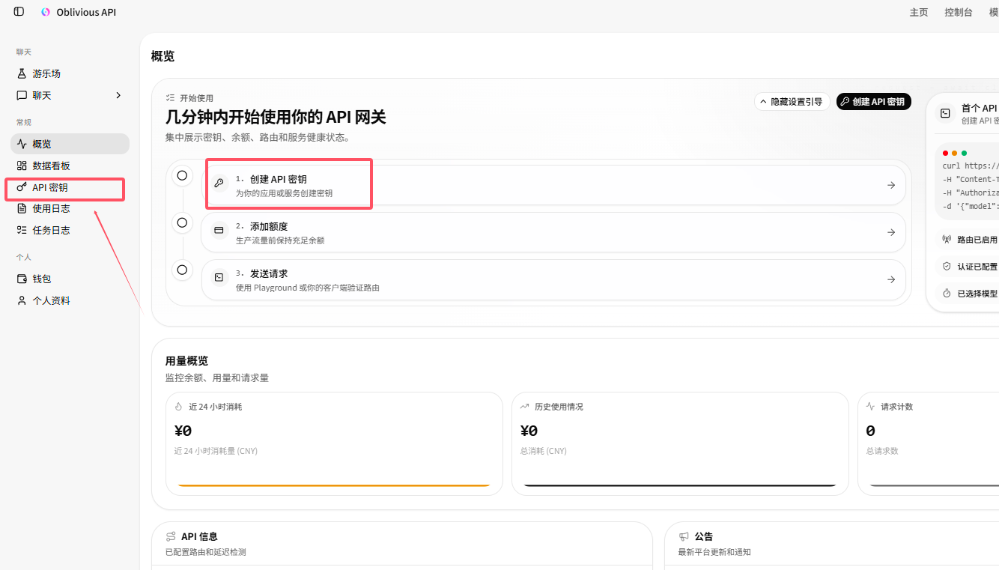

点击右上角“创建密钥”，在分组下拉框中选择合适的套餐分组，然后创建


::: warning 分组不要乱选
不同分组提供的模型和计价倍率不同，根据需要选择合适的分组。如果想要最佳体验请使用 Auto 分组，但是如遇上游故障费用可能会升高。
:::

创建完成后即可获得 API 密钥，点击复制按钮即可复制，后续接入工具时需要填写。

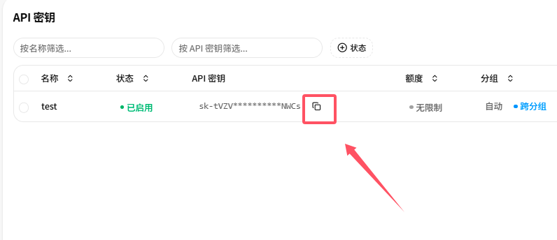

### 3. 添加额度

注册登录后，进入“钱包”页面，输入兑换码完成额度兑换。

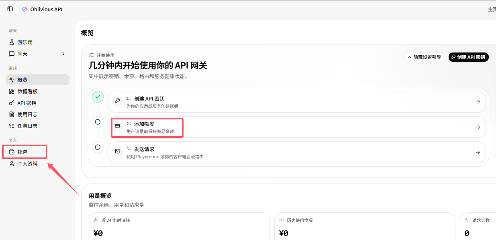


## 选择模型

后台模型广场里会列出可用模型。接入工具时要填模型 ID，而不是展示名称。

常见模型 ID 示例：

| 分类 | 模型 ID |
|---|---|
| OpenAI | `gpt-5.5` 、`gpt-5.4`、`gpt-5.4-mini` |
| Anthropic | `claude-opus-4-8` 、`claude-opus-4-7`、`claude-opus-4-6`、`claude-opus-4-5` |
| MiniMax | `MiniMax-M2`、`MiniMax-M2.5`、`MiniMax-M2.7` |
| MiniMax 极速 | `MiniMax-M2.5-highspeed`、`MiniMax-M2.7-highspeed` |
| GLM | `GLM-5`、`GLM-5.1` |
| Kimi | `Kimi-K2.5`、`Kimi-K2.6` |
| DeepSeek | `deepseek-v4-flash`、`deepseek-v4-pro` |
| Qwen | `qwen3.6-plus`、`qwen3.5-plus`、`qwen3-max-2026-01-23`、`qwen3-coder-plus`、`qwen3-coder-next` |


::: tip 建议课堂默认值
第一次测试建议用 `gpt-5.4` 作为示例模型。真正提交作业时，以自己套餐内显示的模型 ID 为准。
:::

## 最小调用测试

拿到 API Key 后，先不要急着接工具。先在终端跑一次最小请求，确认 Key、BaseURL、模型 ID 和协议都能工作。

### OpenAI 兼容协议

Windows PowerShell 可以使用 `curl.exe`：

```powershell
curl.exe -X POST "https://api.shirosora.cn/v1/chat/completions" `
  -H "Content-Type: application/json" `
  -H "Authorization: Bearer YOUR_API_KEY" `
  -d "{\"model\":\"gpt-5.4\",\"max_tokens\":1024,\"messages\":[{\"role\":\"user\",\"content\":\"你好，请介绍下自己。\"}],\"temperature\":1.0,\"stream\":true}"
```

macOS / Linux 可以使用：

```bash
curl -X POST "https://api.shirosora.cn/v1/chat/completions" \
  -H "Content-Type: application/json" \
  -H "Authorization: Bearer YOUR_API_KEY" \
  -d '{
    "model": "gpt-5.4",
    "max_tokens": 1024,
    "messages": [
      { "role": "user", "content": "你好，请介绍下自己。" }
    ],
    "temperature": 1.0,
    "stream": true
  }'
```

### Anthropic 兼容协议

Windows PowerShell：

```powershell
curl.exe -X POST "https://api.shirosora.cn/v1/messages" `
  -H "Content-Type: application/json" `
  -H "Authorization: Bearer YOUR_API_KEY" `
  -d "{\"model\":\"gpt-5.4\",\"max_tokens\":1024,\"system\":\"你是一个有用的AI助手。\",\"messages\":[{\"role\":\"user\",\"content\":\"你好，请介绍下自己。\"}],\"temperature\":1.0,\"stream\":true}"
```

macOS / Linux：

```bash
curl -X POST "https://api.shirosora.cn/v1/messages" \
  -H "Content-Type: application/json" \
  -H "Authorization: Bearer YOUR_API_KEY" \
  -d '{
    "model": "gpt-5.4",
    "max_tokens": 1024,
    "system": "你是一个有用的AI助手。",
    "messages": [
      { "role": "user", "content": "你好，请介绍下自己。" }
    ],
    "temperature": 1.0,
    "stream": true
  }'
```

如果能看到流式返回内容，说明 API Key 和模型基础调用已经跑通。

## 接入工具的通用规则

绝大多数工具都在找同四个值：

| 字段 | 填什么 |
|---|---|
| Provider / Name | `breeze` 或自定义名称 |
| BaseURL / API Host | 按协议填写 `https://api.shirosora.cn` 或 `https://api.shirosora.cn/v1` |
| API Key | 后台创建的 `sk-...` 密钥 |
| Model ID | 从模型广场复制的精确模型 ID |

如果工具支持协议类型，还要选择：

| 工具字段 | OpenAI 兼容 | Anthropic 兼容 |
|---|---|---|
| API type / protocol | `openai-completions` 或 OpenAI Compatible | `anthropic-messages` 或 Anthropic |
| npm provider | `@ai-sdk/openai-compatible` | `@ai-sdk/anthropic` |

## 常用工具接入

这一节按工具分别写。所有示例仍然以 `gpt-5.4` 为例，实际使用时必须替换成自己套餐内可用的模型 ID。

| 工具 | 推荐接入方式 | 适合对象 |
|---|---|---|
| Claude Code | 用专门的 Claude Code 配置文档或 CCSwitch | 课程主要开发工具用户 |
| Codex CLI | 用课程统一配置或 CCSwitch 管理接口 | 课程主要开发工具用户 |
| OpenClaw | 编辑 `openclaw.json` 或运行 `openclaw configure` | 能读懂 JSON 配置的用户 |
| Hermes Agent | 安装后按引导粘贴 Key、选择或手填模型 | Agent 工具用户 |
| OpenCode | 编辑 `opencode.json` 后用 `/models` 选模型 | 终端开发用户 |
| WorkBuddy / AutoClaw | 图形界面添加自定义模型 | 想快速体验模型能力的用户 |
| 腾讯云龙虾 / 阿里云龙虾 | 自定义模型，表单输入字段 | 国内 IDE / Agent 用户 |
| Cline / RooCode / VS Code | 插件内添加自定义模型 provider | VS Code / Cursor / Trae 插件用户 |
| Cherry Studio / ChatBox | 聊天客户端添加自定义模型 | 先验证聊天与多模型能力 |
| Qclaw / OneClaw / Trae / Cursor | 工具内手动配置自定义模型 | 使用对应产品的用户 |

### CCSwitch

CCSwitch 不是 AI 接口调用工具，它是 API 接口配置辅助工具。建议 Claude Code、Codex、OpenCode、OpenClaw、Hermes Agent 用户安装它来管理模型配置，减少手动填错 BaseURL、协议和模型 ID 的概率。

下载地址：

```text
https://github.com/farion1231/cc-switch/releases
```
网盘下载地址（更新不及时）：

```text
https://wwamj.lanzout.com/b002vy8i6b
密码:2y0n
```

使用方式：
tips：您也可以点击 API 密钥页面中已创建密钥最右端的三个点按钮，再点击 CC 切换，选择您使用的应用和模型后即可快速导入。

1. 安装最新版 CCSwitch。
2. 新增一个服务配置，名称可写 `breeze`。
3. 填入 `BaseURL`、`API Key`、协议和模型 ID。
4. 在目标工具里选择 CCSwitch 生成或管理的配置。

::: tip
CCSwitch 是辅助工具，不是必须安装。能稳定手动配置的同学可以直接按下面各工具步骤操作。
:::

### Claude Code

Claude Code 的配置方式和普通 OpenAI 兼容客户端不完全一样，手册把它单独拆成独立文档。课堂中建议按教师演示或 [Claude Code 安装指南](/shared/claude-code) 配置。

如果用 CCSwitch 管理 Claude Code 配置，先准备这四个值：

| 字段 | 填写 |
|---|---|
| Provider 名称 | `breeze` 或自定义名称 |
| BaseURL | 按模型协议填写，OpenAI 兼容通常用 `https://api.shirosora.cn/v1` |
| API Key | 后台创建的 `sk-...` |
| Model ID | 从模型广场复制，例如 `gpt-5.4` |

验证方法：

1. 新开一个空目录。
2. 启动 Claude Code。
3. 让它回答一句话或读取当前目录。
4. 再让它做一个小的只读分析任务，不要一开始就让它大规模改文件。

### Codex CLI

Codex CLI 的课程安装和验证见 [Codex CLI 安装指南](/shared/codex-cli)。如果要接入本页的模型服务，优先使用课堂统一配置或 CCSwitch，避免在多个位置手动维护 API Key。

接入前准备：

| 字段 | 填写 |
|---|---|
| BaseURL | OpenAI 兼容一般填 `https://api.shirosora.cn/v1` |
| API Key | 后台创建的 `sk-...` |
| Model ID | 从模型广场复制，例如 `gpt-5.4` |
| 协议 | OpenAI 兼容模型使用 OpenAI Compatible / Chat Completions |

建议流程：

1. 先用本页的 OpenAI 兼容 `curl` 命令确认 API Key 能正常返回。
2. 在 CCSwitch 或课堂指定配置入口新增 `breeze` 服务。
3. 填入 BaseURL、API Key 和模型 ID。
4. 启动 Codex CLI。
5. 在一个空目录里让 Codex 回答一句话或读取目录。
6. 再进入课程项目，让 Codex 只做“读文件并总结”的任务。
7. 确认稳定后再让它修改文件。

如果 Codex CLI 当前版本或课堂环境不支持自定义 BaseURL，就不要硬改配置。改用教师提供的统一入口，或者用 OpenCode、Cline、ChatBox 先验证同一套 API Key。

### OpenClaw

OpenClaw 有两种接入方式：直接编辑 `openclaw.json`，或者运行命令行配置向导。

#### 方法一：编辑 `openclaw.json`

安装 OpenClaw 时，如果遇到模型选择环节，可以先选择 `Skip For Now` 跳过。安装完成后编辑配置文件：

```text
C:\Users\<用户名>\.openclaw\openclaw.json
```

如果找不到这个文件，通常说明 OpenClaw 没有安装成功，需要先重新安装或启动一次 OpenClaw。

在 `providers` 里新增 `breeze`：

```json
{
  "providers": {
    "breeze": {
      "baseUrl": "https://api.shirosora.cn",
      "apiKey": "YOUR_API_KEY",
      "auth": "api-key",
      "api": "anthropic-messages",
      "models": [
        {
          "id": "gpt-5.4",
          "name": "gpt-5.4",
          "reasoning": true,
          "input": ["text", "image"],
          "contextWindow": 200000
        }
      ]
    }
  }
}
```

再把默认 agent 模型指向刚才新增的 provider：

```json
{
  "agents": {
    "defaults": {
      "model": {
        "primary": "breeze/gpt-5.4"
      },
      "models": {
        "breeze/gpt-5.4": {}
      }
    }
  }
}
```

字段怎么改：

| 场景 | `baseUrl` | `api` |
|---|---|---|
| Anthropic 兼容模型 | `https://api.shirosora.cn` | `anthropic-messages` |
| OpenAI 兼容模型 | `https://api.shirosora.cn/v1` | `openai-completions` |

保存后执行：

```bash
openclaw gateway restart
```

注意：

1. 如果 `providers` 下已有其他服务商，不要删除，追加 `breeze` 即可。
2. JSON 文件不支持注释，复制示例时不要添加 `//` 或中文注释。
3. 支持图片识别的模型可以保留 `"image"`；不支持视觉的模型只保留 `"text"`。
4. `contextWindow` 按模型上下文能力设置，手册示例使用 `200000`。

#### 方法二：命令行配置

运行：

```bash
openclaw configure
```

按提示填入服务商、BaseURL、API Key、协议和模型 ID。配置完成后新开一个终端：

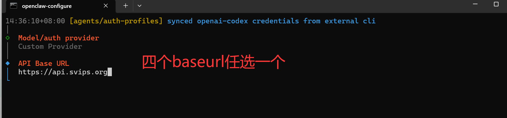

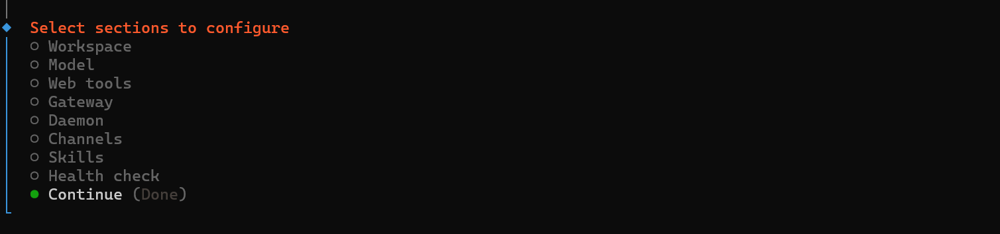

```bash
openclaw tui
```

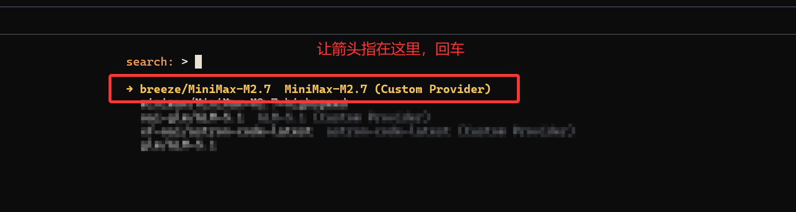

如果后续手动修改了 `contextWindow`，记得再次执行：

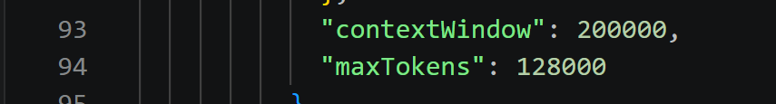

```bash
openclaw gateway restart
```

### 飞书妙搭

手册里把飞书妙搭描述为“便捷版龙虾”。如果使用飞书妙搭接入自定义模型，按“自定义模型 / 模型服务商 / API 配置”入口寻找下面字段：

| 字段 | 填写 |
|---|---|
| 服务商名称 | `breeze` |
| 接口地址 | `https://api.shirosora.cn`，OpenAI 兼容时按界面要求拼 `/v1` |
| API Key | `YOUR_API_KEY` |
| 协议类型 | `anthropic-messages` 或 `openai-completions` |
| 模型 ID | `gpt-5.4` 或自己想要使用的模型 |

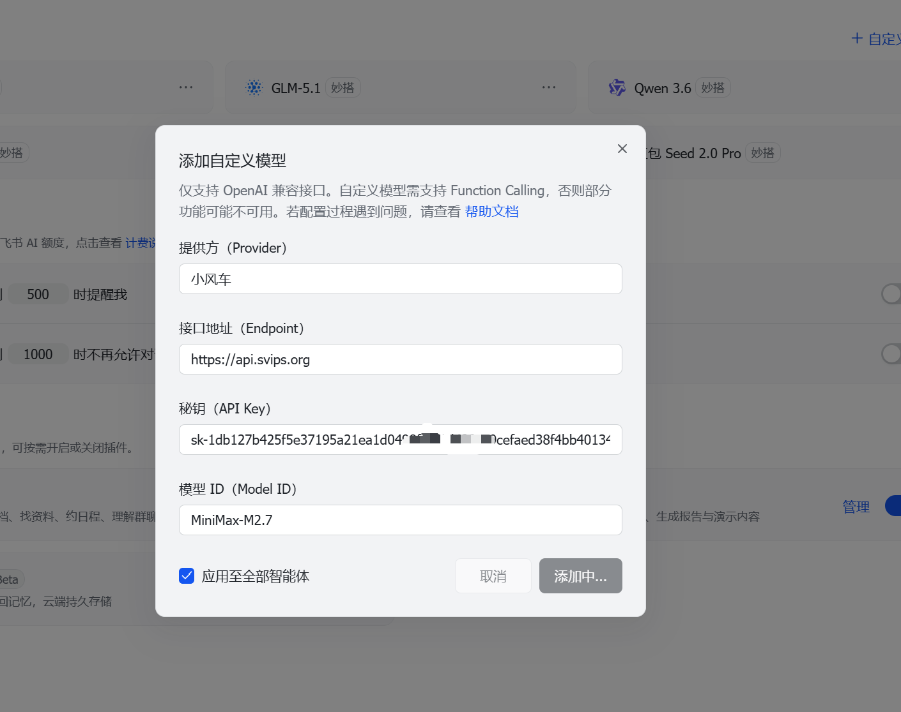

配置后先做一句话测试，再用于真实项目。

### Hermes Agent

安装地址：

```text
https://hermesagent.org.cn/
```

接入步骤：

1. 安装并启动 Hermes Agent。
2. 在密钥输入环节粘贴后台生成的 API Key。密钥粘贴时可能不显示，粘贴后直接回车即可。
3. 如果工具自动获取到模型列表，选择 `Y`。
4. 如果工具没有自动获取模型，在模型广场复制模型 ID 手动输入。
5. 最长上下文设置为目标模型支持的值，手册示例填写 `200000`。
6. 新开一个窗口唤起 Hermes，确认模型能回复。

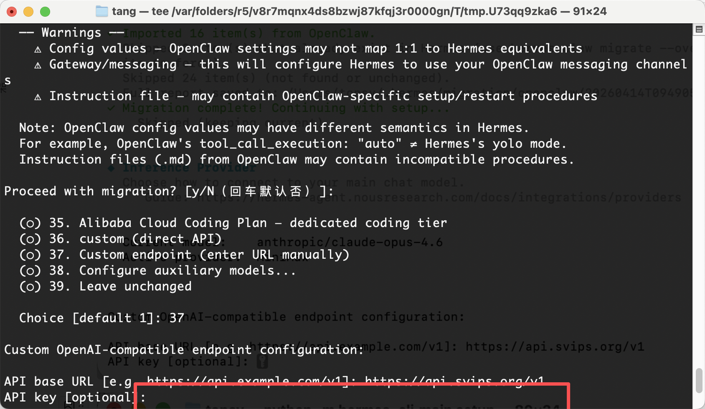

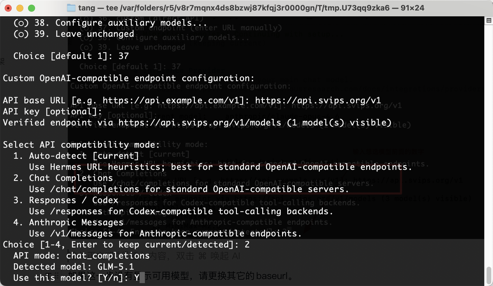

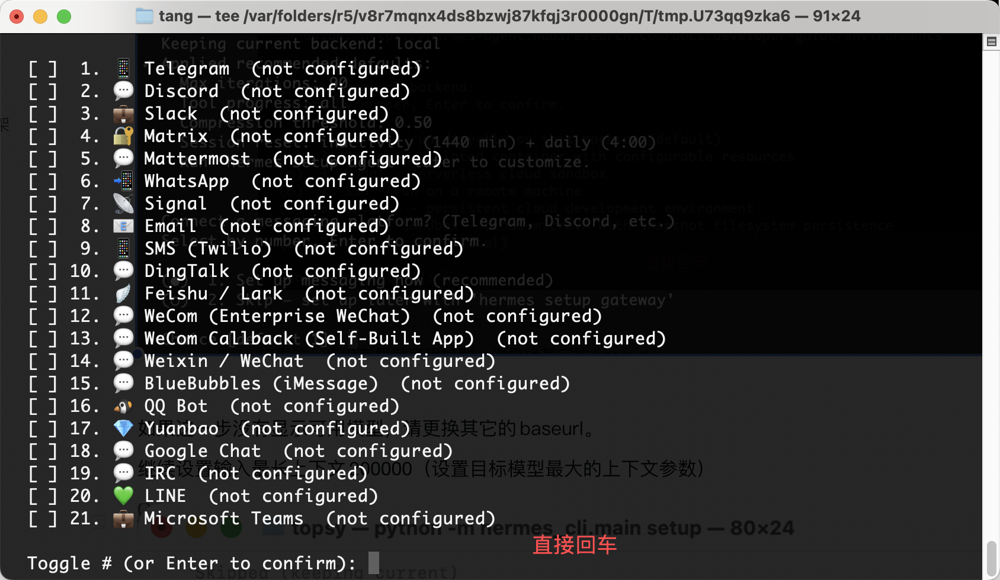

验收方式：让 Hermes 回答一句话，再让它读取一个小目录或生成一个简单文件说明。

### OpenCode

通过官方渠道安装 OpenCode 后，编辑配置文件：

```text
~/.config/opencode/opencode.json
```

Anthropic 兼容示例：

```json
{
  "$schema": "https://opencode.ai/config.json",
  "provider": {
    "breeze": {
      "npm": "@ai-sdk/anthropic",
      "name": "breeze",
      "options": {
        "baseURL": "https://api.shirosora.cn",
        "apiKey": "YOUR_API_KEY"
      },
      "models": {
        "gpt-5.4": {
          "name": "gpt-5.4",
          "thinking": true,
          "limit": {
            "context": 200000,
            "output": 65536
          },
          "modalities": {
            "input": ["text", "image"],
            "output": ["text"]
          }
        }
      }
    }
  }
}
```

OpenAI 兼容模型要改两处：

```json
{
  "npm": "@ai-sdk/openai-compatible",
  "options": {
    "baseURL": "https://api.shirosora.cn/v1",
    "apiKey": "YOUR_API_KEY"
  }
}
```

配置后启动 OpenCode，在命令里输入：

```text
/models
```

然后：

1. 进入模型选择窗口。
2. 按 `Ctrl+A` 选择模型提供商，自定义 provider 通常在列表最后。
3. 如果弹出 API Key 输入框，粘贴密钥并回车。
4. 进入模型选择界面后选择 `gpt-5.4` 或自己的模型。
5. 回车确认后开始使用。

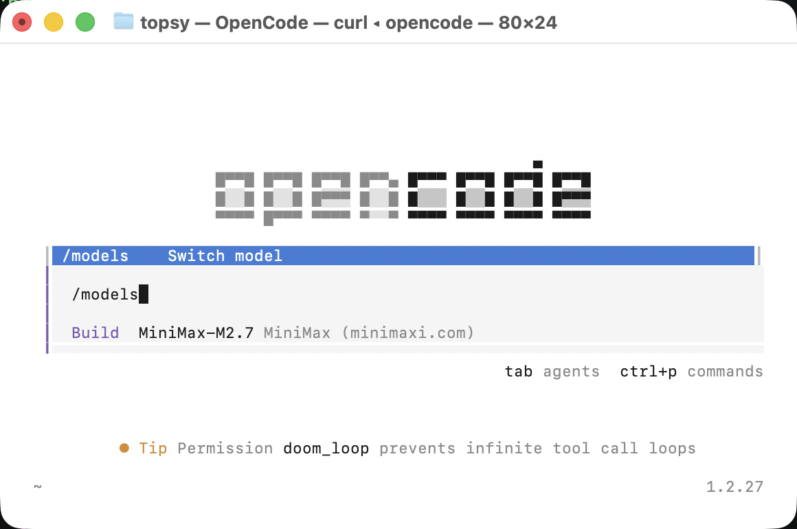

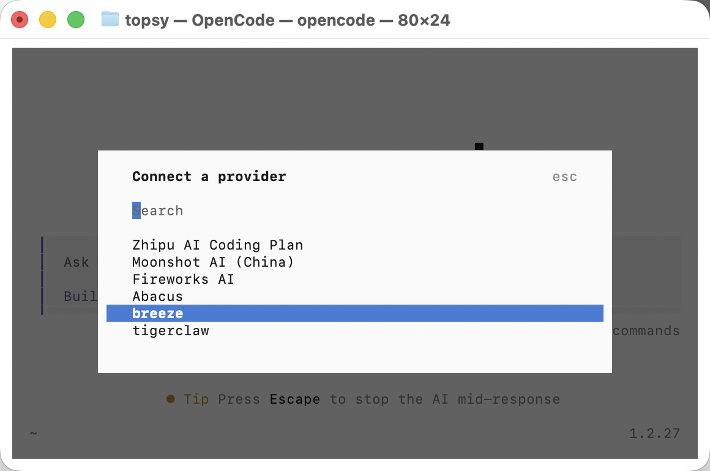

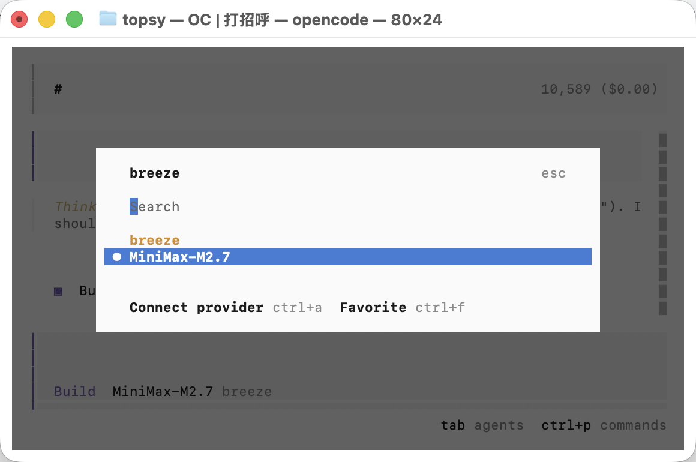

注意：

1. `opencode.json` 不能写注释。
2. 如果 `provider` 下已有其他服务商，不要删除，追加 `breeze`。
3. `npm` 必须和协议匹配：Anthropic 用 `@ai-sdk/anthropic`，OpenAI 兼容用 `@ai-sdk/openai-compatible`。
4. OpenAI 兼容的 `baseURL` 后面需要加 `/v1`。

### WorkBuddy

下载地址：

```text
https://www.codebuddy.cn/work/
```

接入步骤：

1. 安装并打开 WorkBuddy。
2. 找到模型设置或自定义模型入口。
3. 添加自定义模型。
4. 模型名称可写 `gpt-5.4`。
5. 模型 ID 填自己套餐里的模型 ID。
6. BaseURL 按协议填写：Anthropic 兼容用 `https://api.shirosora.cn`，OpenAI 兼容用 `https://api.shirosora.cn/v1`。
7. API Key 填后台生成的密钥。
8. 保存后在模型列表里选择刚添加的模型。

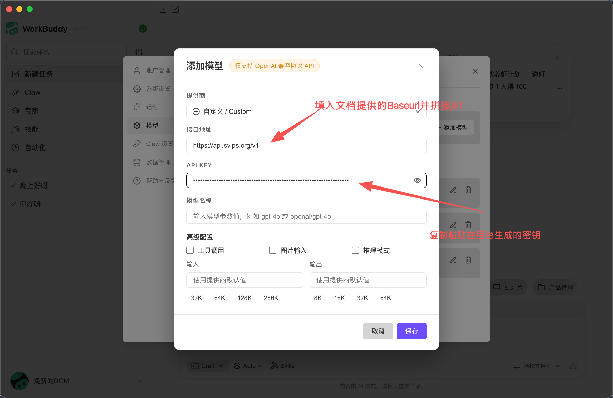

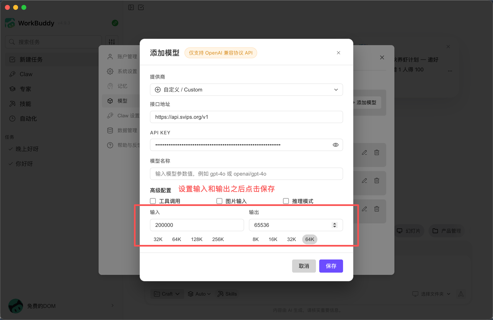

如果自定义模型没有立即出现在列表里，多刷新或重试几次。手册里说明这可能是软件列表刷新问题。

### 腾讯云龙虾

以 `gpt-5.4` 为例，配置时替换成自己套餐内模型。

步骤：

1. 打开模型配置。
2. 选择“自定义模型”。
3. 选择“表单输入”。
4. 按字段填写。

| 字段 | Anthropic 兼容示例 | OpenAI 兼容示例 |
|---|---|---|
| `provider` | `breeze` | `breeze` |
| `baseurl` | `https://api.shirosora.cn` | `https://api.shirosora.cn/v1` |
| `api` | `anthropic-messages` | `openai-completions` |
| `api_key` | `YOUR_API_KEY` | `YOUR_API_KEY` |
| `model.id` | `gpt-5.4` | `gpt-5.4` |
| `model.name` | `gpt-5.4` | `gpt-5.4` |

保存后在龙虾里切换到该模型，先做一句话测试。

### 阿里云龙虾

阿里云龙虾的填写方式和腾讯云龙虾一致。

步骤：

1. 进入模型配置。
2. 选择“自定义模型”。
3. 选择“表单输入”。
4. 填入 `provider`、`baseurl`、`api`、`api_key`、`model.id`、`model.name`。

字段示例：

```text
provider: breeze
baseurl: https://api.shirosora.cn
api: anthropic-messages
api_key: YOUR_API_KEY
model.id: gpt-5.4
model.name: gpt-5.4
```

如果使用 OpenAI 兼容协议：

```text
baseurl: https://api.shirosora.cn/v1
api: openai-completions
```

### Cline

Cline 可以通过 VS Code、Cursor、Trae 等编辑器插件市场安装。

接入步骤：

1. 在编辑器插件市场安装 Cline。
2. 打开 Cline 的模型或 API Provider 设置。
3. 选择自定义模型、自定义 provider、OpenAI Compatible 或 Anthropic Compatible。
4. 填写 BaseURL。
5. 填写 API Key。
6. 填写模型 ID，例如 `gpt-5.4`。
7. 保存配置。
8. 新开一个 Cline 会话，先让模型回复一句话。

字段建议：

| Cline 场景 | BaseURL | 模型 |
|---|---|---|
| OpenAI Compatible | `https://api.shirosora.cn/v1` | 套餐内 OpenAI 兼容模型 |
| Anthropic Compatible | `https://api.shirosora.cn` | 套餐内 Anthropic 兼容模型 |

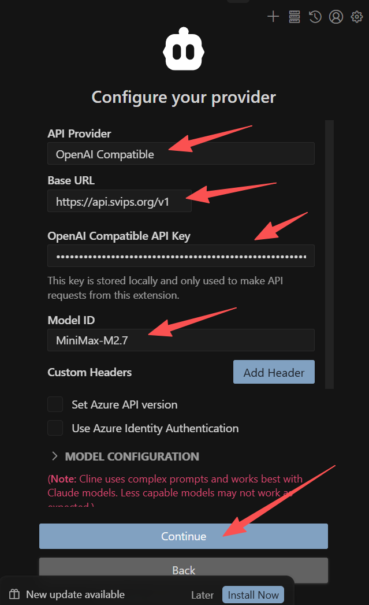

### Cherry Studio

下载地址：

```text
https://www.cherry-ai.com/download
```

接入步骤：

1. 安装并打开 Cherry Studio。
2. 进入模型服务或模型供应商设置。
3. 添加自定义供应商。
4. 供应商名称填 `breeze`。
5. 按协议选择 OpenAI Compatible 或 Anthropic / Claude Compatible。
6. 填写 BaseURL、API Key、模型 ID。
7. 保存后在聊天窗口选择该模型测试。

如果使用 OpenAI 兼容模型，BaseURL 通常填：

```text
https://api.shirosora.cn/v1
```

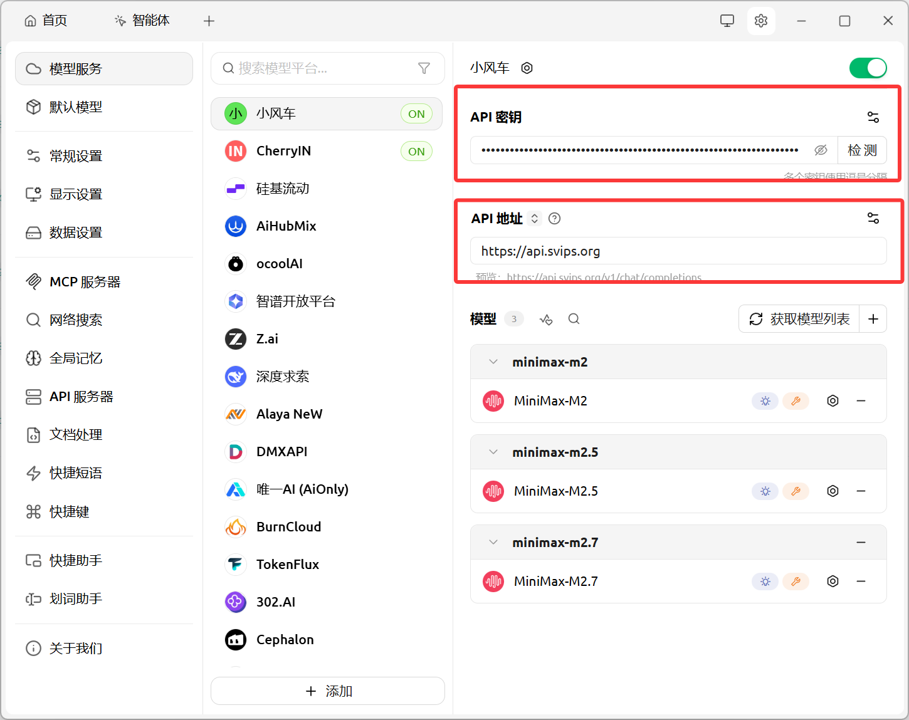

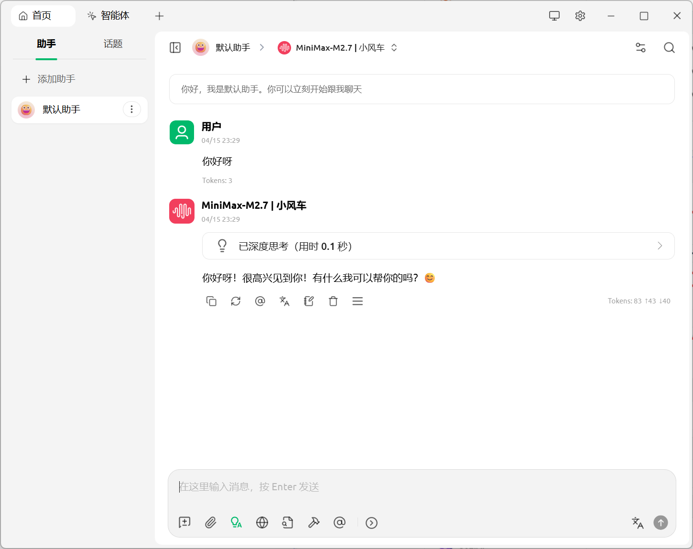

### AutoClaw

下载地址：

```text
https://autoglm.zhipuai.cn/autoclaw/
```

接入步骤：

1. 安装并打开 AutoClaw。
2. 点击“添加自定义模型”。
3. 填写模型名称和模型 ID。
4. 填写 API Key。
5. 填写 BaseURL。
6. 保存并选择该模型。

注意：如果是 OpenAI 协议的模型接口，BaseURL 需要额外拼接 `/v1`：

```text
https://api.shirosora.cn/v1
```

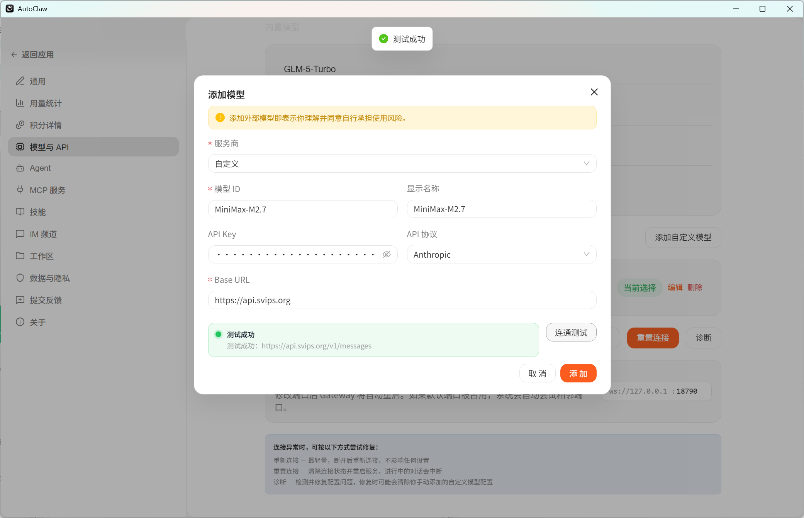

### RooCode

RooCode 可以在 VS Code、Cursor、Trae 等编辑器的插件市场安装。

接入步骤：

1. 安装 RooCode 插件。
2. 打开 RooCode 设置。
3. 找到模型供应商或 API Provider 设置。
4. 添加自定义 provider。
5. 选择 OpenAI Compatible 或 Anthropic Compatible。
6. 填入 BaseURL、API Key、模型 ID。
7. 保存后用一个小任务验证。

建议第一次验证只让 RooCode 读取当前目录并说明文件结构，不要直接让它修改项目。

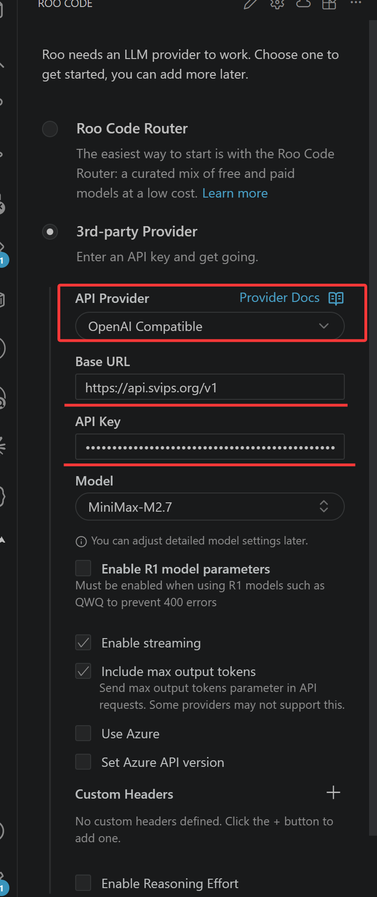

### ChatBox

下载地址：

```text
https://chatboxai.app/zh/
```

手册中特别提醒 ChatBox 的主机字段名称容易混淆：

| ChatBox 模式 | API 主机填写 |
|---|---|
| OpenAI 兼容 API | 填 OpenAI 兼容地址，通常为 `https://api.shirosora.cn/v1` |
| Claude API 兼容 | 按 ChatBox 的 Claude API 兼容主机要求填写；手册提示需要在地址后添加 `/v1` |

接入步骤：

1. 打开设置。
2. 选择 API 模式。
3. 填 API 主机。
4. 填 API Key。
5. 填模型 ID。
6. 保存后新建对话测试。

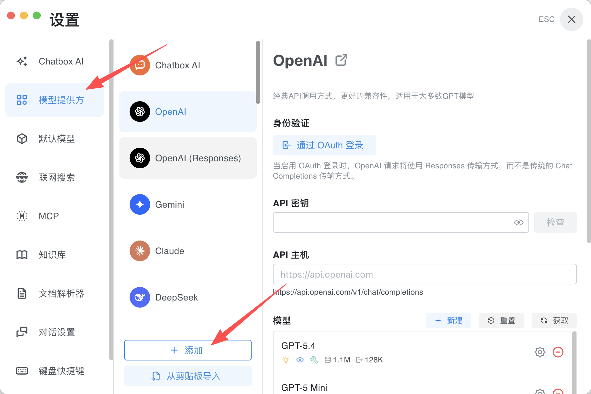

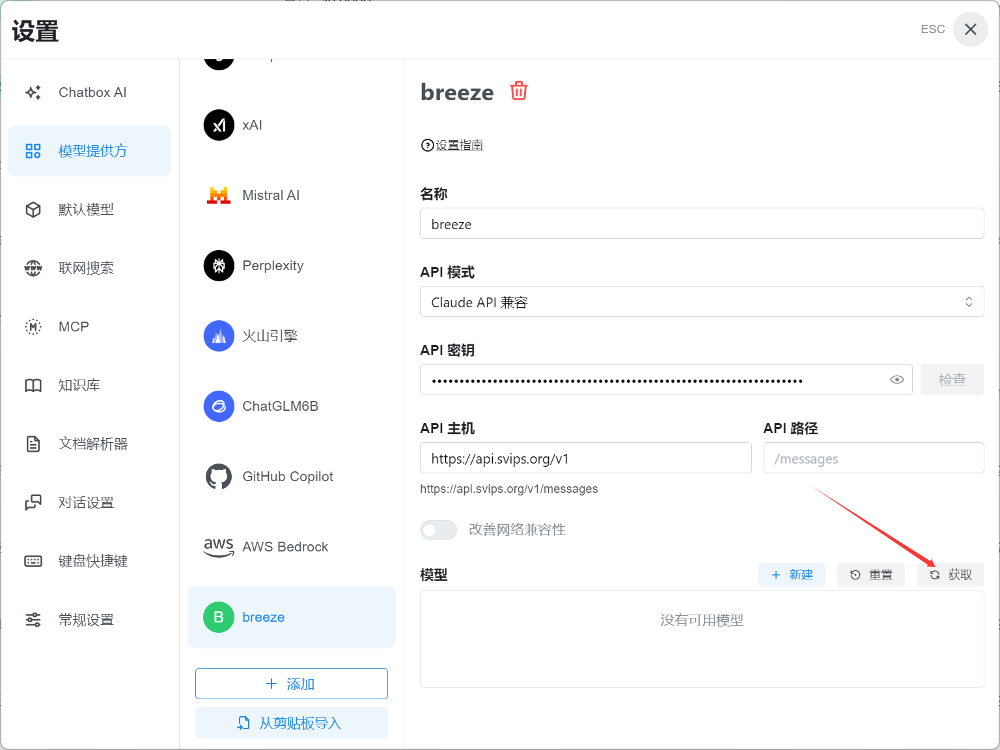

### Qclaw

下载地址：

```text
https://qclaw.qq.com/?channel=5004&bd_vid=8422091002495405437
```

手册示例使用 `gpt-5.4`，实际配置时以自己套餐为准。

接入步骤：

1. 安装并打开 Qclaw。
2. 找到自定义模型入口。
3. 添加模型服务商。
4. 填入 BaseURL、API Key、协议类型和模型 ID。
5. 保存后选择该模型。

如果填写的是 OpenAI 兼容协议，接口地址后面需要拼 `/v1`。

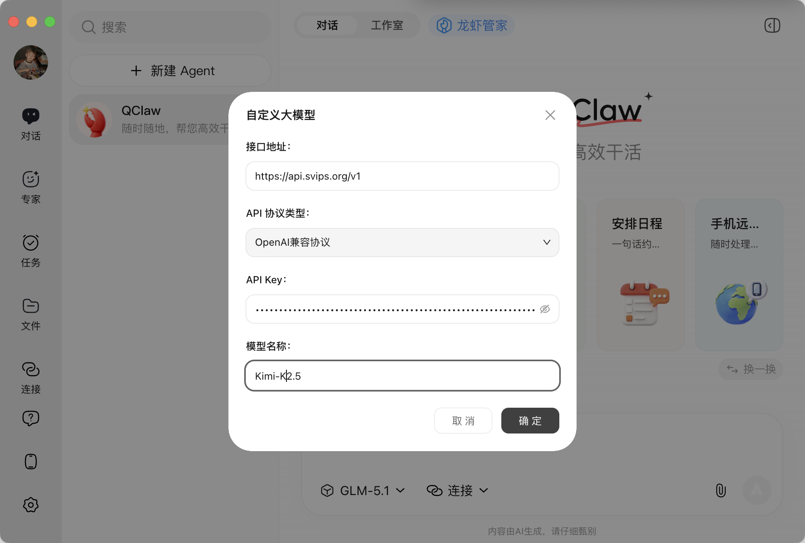

### OneClaw

下载地址：

```text
https://oneclaw.cn/
```

接入步骤：

1. 打开 OneClaw。
2. 点击“其它”。
3. 在预设下拉框中选择“手动配置”。
4. 选择接口类型。
5. 填接口地址、API Key、模型 ID。
6. 保存并测试。

接口类型和地址：

| 接口类型 | 地址填写 |
|---|---|
| `openai-completions` | `https://api.shirosora.cn/v1` |
| `anthropic-messages` | `https://api.shirosora.cn` |

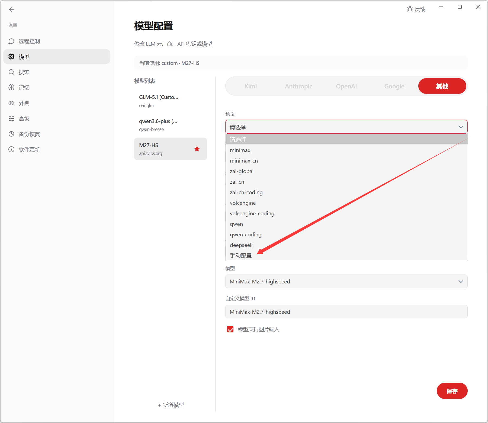

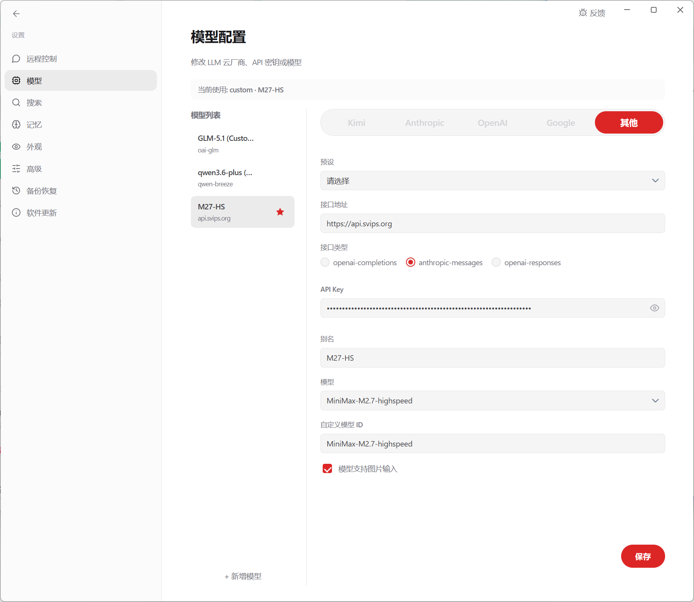

### Trae

Trae 支持自定义模型。手册把 OpenAI 协议和 Anthropic 协议分开说明。

OpenAI 兼容接入：

1. 打开 Trae 的自定义模型设置。
2. 选择 OpenAI 兼容接口。
3. 地址填写带 `/v1` 的 BaseURL。
4. 填 API Key。
5. 填模型 ID。
6. 保存后在输入框位置选择自定义模型。

```text
https://api.shirosora.cn/v1
```

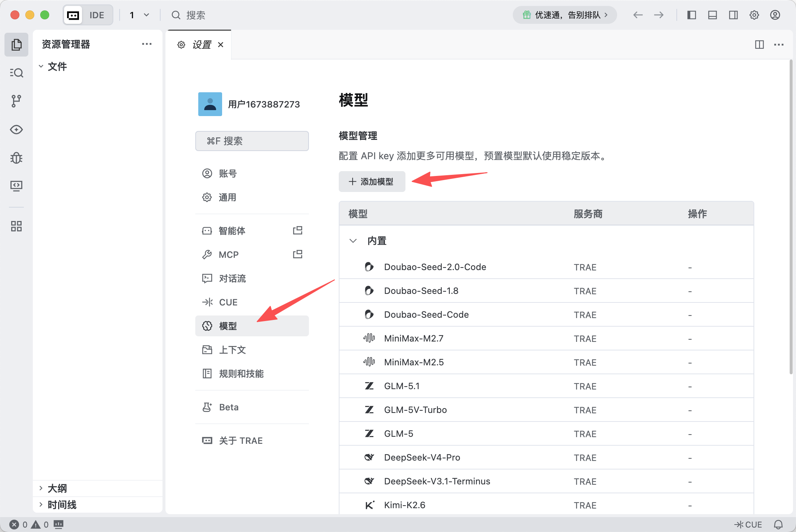

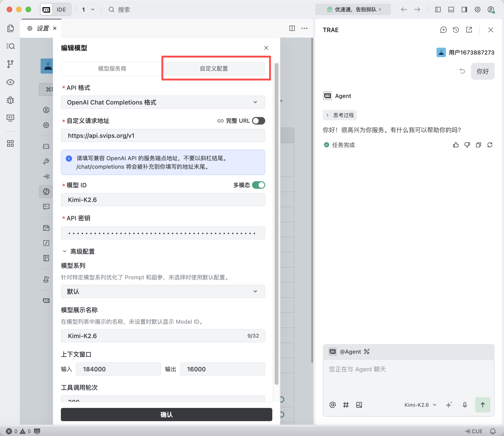

Anthropic 兼容接入：

1. 选择 Claude / Anthropic 兼容接口。
2. 按界面字段填写 BaseURL、API Key、模型 ID。
3. 如果界面要求完整 endpoint，再按工具提示补 `/v1/messages`。
4. 保存后选择模型测试。

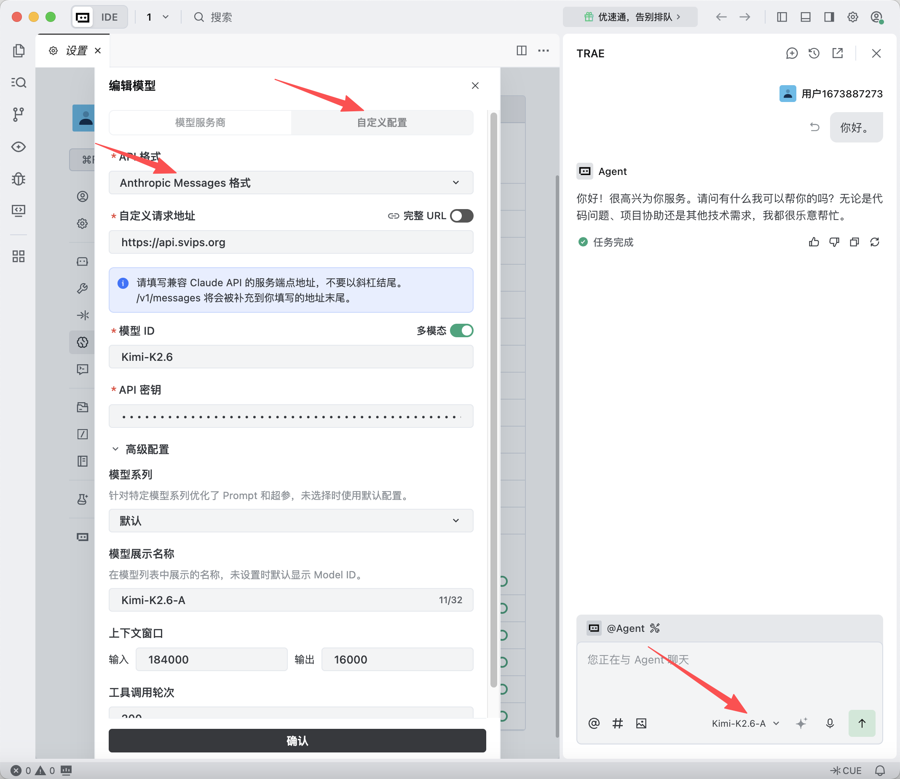

### Cursor

Cursor 需要会员才可以添加自定义模型。

接入步骤：

1. 确认账号有 Cursor 会员权限。
2. 打开 Cursor 设置里的 Models。
3. 找到自定义模型或添加模型入口。
4. 填模型名称。
5. 填 BaseURL。
6. 填 API Key。
7. 填模型 ID。
8. 点击 `Add` 保存。

建议先在一个空项目中测试模型回复，再用于课程项目。

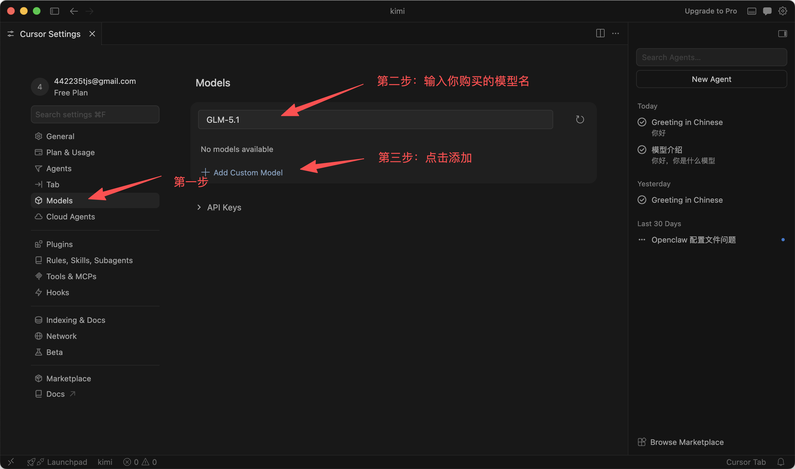

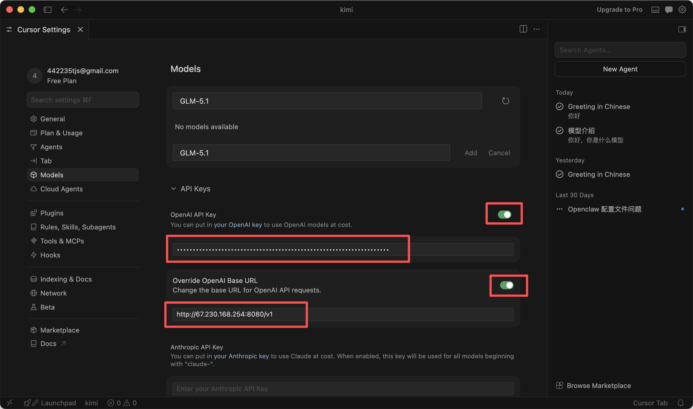

### VS Code

VS Code 本身不是模型客户端，需要通过插件调用 API。手册里给出的可选方式：

1. 使用 Claude Code。
2. 使用 Cline 插件。
3. 使用 OpenCode 插件或相关集成。

无论选哪种插件，最终仍然是填写同四个值：BaseURL、API Key、协议和模型 ID。

## 常见问题

### 连接失败、连接中断、不稳定、回复慢

按顺序尝试：

1. 更换 BaseURL。
2. 检查网络或代理。
3. 新开会话重新测试。
4. 新建 API Key。
5. 换协议测试，例如从 OpenAI 兼容切到 Anthropic 兼容，或反过来。
6. 如果仍然无效，把配置截图、报错信息和最小 `curl` 测试结果发给管理员排查。

### 工具里模型不可见

先确认：

1. 后台套餐已经兑换成功。
2. API Key 创建时选择了正确分组。
3. 模型 ID 是从模型广场复制的完整字符串。
4. 工具配置里的 provider 已经保存并重新加载。

### 401 / 认证失败

常见原因：

1. API Key 复制不完整。
2. Key 前后带了空格。
3. Key 属于另一个分组或套餐。
4. 余额计费模型没有购买对应余额。

### 404 / 模型不存在

优先检查模型 ID。模型 ID 区分大小写，`gpt-5.4` 和 `Gpt-5.4` 不是同一个值。

### JSON 配置报错

先检查三件事：

1. JSON 里没有注释。
2. 每个对象和数组的逗号位置正确。
3. 没有把示例里的 `YOUR_API_KEY`、`gpt-5.4` 忘记替换成自己的真实配置。

## 课堂验收标准

完成快速接入后，至少保存三类证据：

1. 后台套餐或余额已生效的截图。
2. API Key 所属分组和模型 ID 的截图，密钥本体需要打码。
3. 一次最小调用测试的终端输出，或者工具里成功回复的截图。

不要伪造运行结果。工具不可用时，把错误截图、配置截图和你已经尝试过的排障步骤交上来，这同样是有效的工程反馈。
