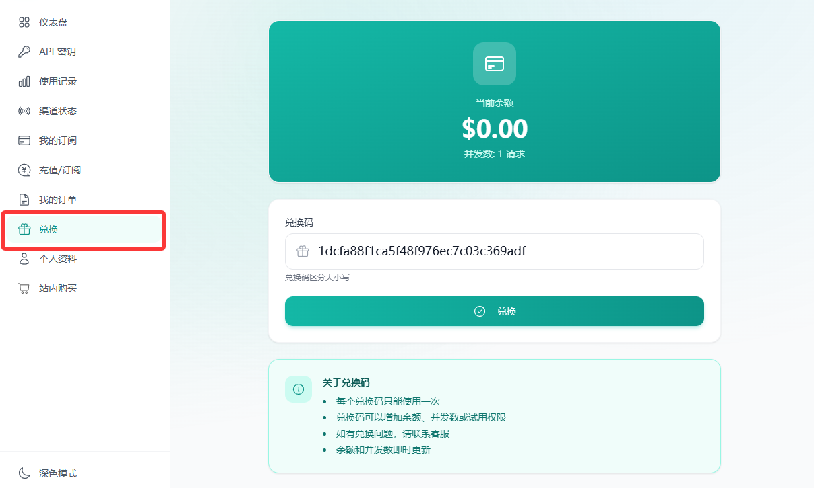
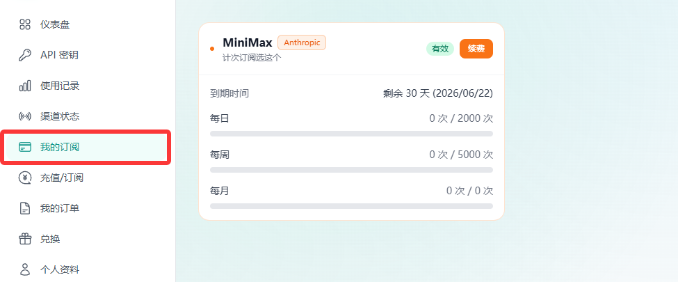
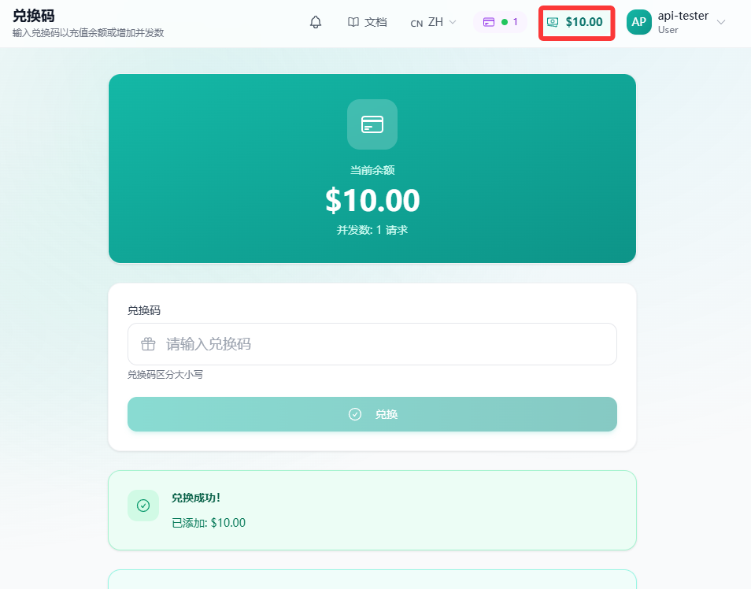
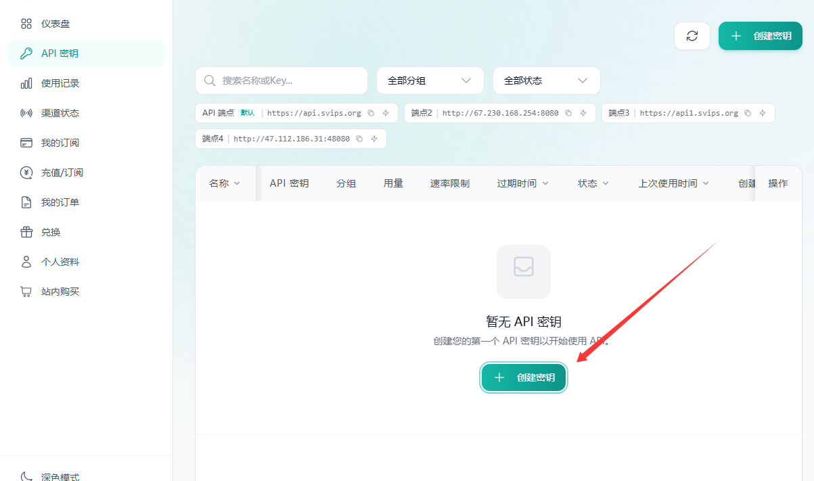
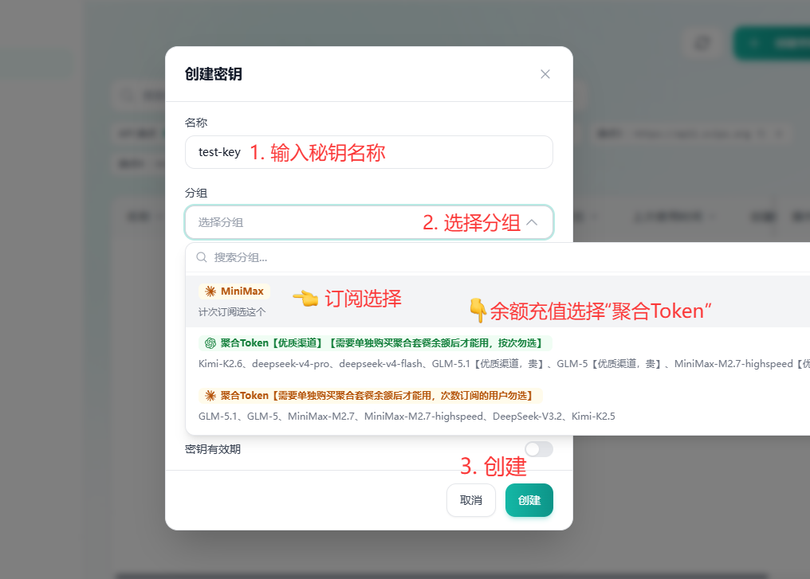

# 快速接入教程

本页根据根目录的 `使用手册.docx` 整理，目标是让学生先跑通最小 API 调用，再把同一套模型服务接入常用开发工具。

阅读顺序很简单：

1. 注册账号并兑换套餐。
2. 创建 API Key，确认模型协议和模型 ID。
3. 用 `curl` 做一次最小调用测试。
4. 按目标工具填写 `BaseURL`、`API Key`、协议和模型 ID。
5. 出问题时按排障清单逐项定位。

::: warning 接入前先确认
模型 ID 大小写敏感。凡是需要填写模型 ID 的位置，都建议从后台“模型广场”直接复制，不要手打。
:::

## BaseURL 与协议

可用入口以教师或管理员当天通知为准，手册中给出的入口如下：

| 用途 | 地址 |
|---|---|
| 主入口 | `https://api.svips.org` |
| 备用入口 1 | `https://api1.svips.org` |
| 备用入口 2 | `http://67.230.168.254:8080` |
| 备用入口 3 | `http://47.112.186.31:48080` |

填写工具配置时先判断协议：

| 协议 | 常见填写方式 | 说明 |
|---|---|---|
| OpenAI 兼容 | `https://api.svips.org/v1` | 多数 OpenAI 兼容工具需要在 BaseURL 后拼接 `/v1` |
| Anthropic 兼容 | `https://api.svips.org` | 多数 Anthropic 兼容工具填写不带 `/v1` 的根地址 |
| 直接调用接口 | 以完整 endpoint 为准 | 例如 `/v1/chat/completions` 或 `/v1/messages` |

如果不确定工具要填哪一种，先看字段名称：写着 OpenAI Compatible、OpenAI API Host、Chat Completions 的，通常填带 `/v1`；写着 Anthropic、Claude API、Messages API 的，通常填根地址。

## 获取 API Key

### 1. 注册账号

访问注册页：

```text
https://api.svips.org/register
```

如果主入口打不开，依次尝试：

```text
https://api1.svips.org/register
http://67.230.168.254:8080/register
http://47.112.186.31:48080/register
```

如果注册过程需要邀请码，按课堂通知联系管理员处理。

### 2. 兑换套餐

注册登录后，进入“兑换”页面，输入兑换码完成套餐兑换。



兑换完成后，按套餐类型检查是否生效：

| 套餐类型 | 检查方式 |
|---|---|
| 订阅套餐 | 打开“我的订阅”，确认套餐状态已经生效 |
| 余额充值 | 查看右上角余额是否增加 |





### 3. 创建密钥

进入“API 密钥”页面，点击右上角“创建密钥”，在分组下拉框中选择刚刚兑换的套餐分组，然后创建。





::: warning 分组不要乱选
聚合 Token 渠道是余额计费模式，需要单独购买聚合套餐余额后使用。按次或次数订阅用户不要误选聚合 Token 分组。
:::

## 选择模型

后台模型广场里会列出可用模型。接入工具时要填模型 ID，而不是展示名称。

常见模型 ID 示例：

| 分类 | 模型 ID |
|---|---|
| MiniMax | `MiniMax-M2`、`MiniMax-M2.5`、`MiniMax-M2.7` |
| MiniMax 极速 | `MiniMax-M2.5-highspeed`、`MiniMax-M2.7-highspeed` |
| GLM | `GLM-5`、`GLM-5.1` |
| Kimi | `Kimi-K2.5`、`Kimi-K2.6` |
| DeepSeek | `deepseek-v4-flash`、`deepseek-v4-pro` |
| Qwen | `qwen3.6-plus`、`qwen3.5-plus`、`qwen3-max-2026-01-23`、`qwen3-coder-plus`、`qwen3-coder-next` |

手册中的协议提示：

| 协议标签 | 可用模型示例 |
|---|---|
| OpenAI 兼容 | `GLM-5.1`、`GLM-5`、`MiniMax-M2.7`、`deepseek-v4-pro`、`deepseek-v4-flash`、`Kimi-K2.5`、`Kimi-K2.6` |
| Anthropic 兼容 | `GLM-5.1`、`GLM-5`、`MiniMax-M2.7`、`Kimi-K2.5` |

::: tip 建议课堂默认值
第一次测试建议用 `MiniMax-M2.7` 作为示例模型。真正提交作业时，以自己套餐内显示的模型 ID 为准。
:::

## 最小调用测试

拿到 API Key 后，先不要急着接工具。先在终端跑一次最小请求，确认 Key、BaseURL、模型 ID 和协议都能工作。

### OpenAI 兼容协议

Windows PowerShell 可以使用 `curl.exe`：

```powershell
curl.exe -X POST "https://api.svips.org/v1/chat/completions" `
  -H "Content-Type: application/json" `
  -H "Authorization: Bearer YOUR_API_KEY" `
  -d "{\"model\":\"MiniMax-M2.7\",\"max_tokens\":1024,\"messages\":[{\"role\":\"user\",\"content\":\"你好，请介绍下自己。\"}],\"temperature\":1.0,\"stream\":true}"
```

macOS / Linux 可以使用：

```bash
curl -X POST "https://api.svips.org/v1/chat/completions" \
  -H "Content-Type: application/json" \
  -H "Authorization: Bearer YOUR_API_KEY" \
  -d '{
    "model": "MiniMax-M2.7",
    "max_tokens": 1024,
    "messages": [
      { "role": "user", "content": "你好，请介绍下自己。" }
    ],
    "temperature": 1.0,
    "stream": true
  }'
```

### Anthropic 兼容协议

Windows PowerShell：

```powershell
curl.exe -X POST "https://api.svips.org/v1/messages" `
  -H "Content-Type: application/json" `
  -H "Authorization: Bearer YOUR_API_KEY" `
  -d "{\"model\":\"MiniMax-M2.7\",\"max_tokens\":1024,\"system\":\"你是一个有用的AI助手。\",\"messages\":[{\"role\":\"user\",\"content\":\"你好，请介绍下自己。\"}],\"temperature\":1.0,\"stream\":true}"
```

macOS / Linux：

```bash
curl -X POST "https://api.svips.org/v1/messages" \
  -H "Content-Type: application/json" \
  -H "Authorization: Bearer YOUR_API_KEY" \
  -d '{
    "model": "MiniMax-M2.7",
    "max_tokens": 1024,
    "system": "你是一个有用的AI助手。",
    "messages": [
      { "role": "user", "content": "你好，请介绍下自己。" }
    ],
    "temperature": 1.0,
    "stream": true
  }'
```

如果能看到流式返回内容，说明 API Key 和模型基础调用已经跑通。

## 接入工具的通用规则

绝大多数工具都在找同四个值：

| 字段 | 填什么 |
|---|---|
| Provider / Name | `breeze` 或自定义名称 |
| BaseURL / API Host | 按协议填写 `https://api.svips.org` 或 `https://api.svips.org/v1` |
| API Key | 后台创建的 `sk-...` 密钥 |
| Model ID | 从模型广场复制的精确模型 ID |

如果工具支持协议类型，还要选择：

| 工具字段 | OpenAI 兼容 | Anthropic 兼容 |
|---|---|---|
| API type / protocol | `openai-completions` 或 OpenAI Compatible | `anthropic-messages` 或 Anthropic |
| npm provider | `@ai-sdk/openai-compatible` | `@ai-sdk/anthropic` |

## 常用工具接入

### Claude Code

Claude Code 的配置方式比较特殊，建议优先看课堂单独维护的 [Claude Code 安装指南](/shared/claude-code) 和教师演示。

手册建议 Claude Code、Codex、OpenCode、OpenClaw、Hermes Agent 用户可以使用 CCSwitch 管理模型配置。CCSwitch 不是模型调用工具，而是辅助管理 API 接口的配置工具。

下载地址：

```text
https://github.com/farion1231/cc-switch/releases
```

### OpenClaw

OpenClaw 适合能理解 JSON 配置的同学。新手如果只想快速体验，优先选择 WorkBuddy 或 AutoClaw。

常见配置文件路径：

```text
C:\Users\<用户名>\.openclaw\openclaw.json
```

在已有配置中新增 provider，示例：

```json
{
  "providers": {
    "breeze": {
      "baseUrl": "https://api.svips.org",
      "apiKey": "YOUR_API_KEY",
      "auth": "api-key",
      "api": "anthropic-messages",
      "models": [
        {
          "id": "MiniMax-M2.7",
          "name": "MiniMax-M2.7",
          "reasoning": true,
          "input": ["text", "image"],
          "contextWindow": 200000
        }
      ]
    }
  },
  "agents": {
    "defaults": {
      "model": {
        "primary": "breeze/MiniMax-M2.7"
      },
      "models": {
        "breeze/MiniMax-M2.7": {}
      }
    }
  }
}
```

注意：

1. 如果是 OpenAI 兼容模型，把 `api` 改成 `openai-completions`，BaseURL 通常填带 `/v1` 的地址。
2. 如果 `providers` 下面已经有其他服务商，不要删原有配置，只追加 `breeze`。
3. JSON 文件不支持注释，不要把课堂讲解里的中文注释复制进去。
4. 修改后执行 `openclaw gateway restart`，让网关重新读取配置。

也可以通过命令行配置：

```bash
openclaw configure
openclaw tui
```

如果改了 `contextWindow`，同样需要重启网关。

### OpenCode

通过官方方式安装 OpenCode 后，编辑配置文件：

```text
~/.config/opencode/opencode.json
```

Anthropic 兼容示例：

```json
{
  "$schema": "https://opencode.ai/config.json",
  "provider": {
    "breeze": {
      "npm": "@ai-sdk/anthropic",
      "name": "breeze",
      "options": {
        "baseURL": "https://api.svips.org",
        "apiKey": "YOUR_API_KEY"
      },
      "models": {
        "MiniMax-M2.7": {
          "name": "MiniMax-M2.7",
          "thinking": true,
          "limit": {
            "context": 200000,
            "output": 65536
          },
          "modalities": {
            "input": ["text", "image"],
            "output": ["text"]
          }
        }
      }
    }
  }
}
```

如果使用 OpenAI 兼容协议：

1. 把 `npm` 改成 `@ai-sdk/openai-compatible`。
2. 把 `baseURL` 改成 `https://api.svips.org/v1`。

配置完成后启动 OpenCode，输入：

```text
/models
```

进入模型选择窗口后，按 `Ctrl+A` 选择模型提供商。如果弹出 API Key 输入框，粘贴密钥并回车，然后选择模型开始使用。

### WorkBuddy / AutoClaw

这两类工具更适合第一次快速体验：

| 工具 | 下载地址 | 关键步骤 |
|---|---|---|
| WorkBuddy | `https://www.codebuddy.cn/work/` | 添加自定义模型，填写 BaseURL、API Key、模型 ID |
| AutoClaw | `https://autoglm.zhipuai.cn/autoclaw/` | 点击添加自定义模型，OpenAI 协议记得 BaseURL 拼 `/v1` |

如果添加后自定义模型没有立刻出现在列表里，多刷新或重试几次。

### 腾讯云龙虾 / 阿里云龙虾

选择“自定义模型”和“表单输入”，按下面字段填写：

| 字段 | 示例 |
|---|---|
| `provider` | `breeze` |
| `baseurl` | `https://api.svips.org`，OpenAI 兼容时用 `https://api.svips.org/v1` |
| `api` | `anthropic-messages`，OpenAI 兼容时用 `openai-completions` |
| `api_key` | `YOUR_API_KEY` |
| `model.id` | `MiniMax-M2.7` |
| `model.name` | 可写展示名，例如 `MiniMax-M2.7` |

### Cline / RooCode / VS Code

Cline、RooCode 都可以通过 VS Code、Cursor、Trae 等编辑器插件市场安装。

通用做法：

1. 找到插件里的自定义模型或自定义 provider 入口。
2. 选择 OpenAI Compatible 或 Anthropic Compatible。
3. 填入 BaseURL、API Key、模型 ID。
4. 新开一个小任务，先让模型回复一句话，不要一开始就交给它改大项目。

### Cherry Studio / ChatBox

适合先用聊天界面验证模型能力。

| 工具 | 下载地址 | 注意事项 |
|---|---|---|
| Cherry Studio | `https://www.cherry-ai.com/download` | 添加自定义模型，模型 ID 替换成自己套餐内可用值 |
| ChatBox | `https://chatboxai.app/zh/` | OpenAI 兼容 API 主机填地址；Claude API 兼容主机按工具要求决定是否拼 `/v1` |

### Qclaw / OneClaw / Trae / Cursor

这些工具也走同一套字段：

| 工具 | 入口提示 |
|---|---|
| Qclaw | 下载后添加自定义模型，模型 ID 用套餐内可用值 |
| OneClaw | 点击“其它”，预设选择手动配置；`openai-completions` 类型地址后拼 `/v1` |
| Trae | 自定义模型里 OpenAI 协议地址需要添加 `/v1`，Anthropic 协议按工具页面提示填写 |
| Cursor | 需要 Cursor 会员才可以添加自定义模型 |

## 常见问题

### 连接失败、连接中断、不稳定、回复慢

按顺序尝试：

1. 更换 BaseURL。
2. 检查网络或代理。
3. 新开会话重新测试。
4. 新建 API Key。
5. 换协议测试，例如从 OpenAI 兼容切到 Anthropic 兼容，或反过来。
6. 如果仍然无效，把配置截图、报错信息和最小 `curl` 测试结果发给管理员排查。

### 工具里模型不可见

先确认：

1. 后台套餐已经兑换成功。
2. API Key 创建时选择了正确分组。
3. 模型 ID 是从模型广场复制的完整字符串。
4. 工具配置里的 provider 已经保存并重新加载。

### 401 / 认证失败

常见原因：

1. API Key 复制不完整。
2. Key 前后带了空格。
3. Key 属于另一个分组或套餐。
4. 余额计费模型没有购买对应余额。

### 404 / 模型不存在

优先检查模型 ID。模型 ID 区分大小写，`MiniMax-M2.7` 和 `minimax-m2.7` 不是同一个值。

### JSON 配置报错

先检查三件事：

1. JSON 里没有注释。
2. 每个对象和数组的逗号位置正确。
3. 没有把示例里的 `YOUR_API_KEY`、`MiniMax-M2.7` 忘记替换成自己的真实配置。

## 课堂验收标准

完成快速接入后，至少保存三类证据：

1. 后台套餐或余额已生效的截图。
2. API Key 所属分组和模型 ID 的截图，密钥本体需要打码。
3. 一次最小调用测试的终端输出，或者工具里成功回复的截图。

不要伪造运行结果。工具不可用时，把错误截图、配置截图和你已经尝试过的排障步骤交上来，这同样是有效的工程反馈。
